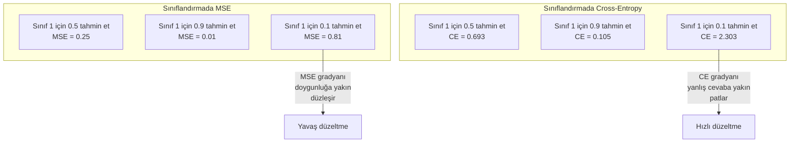
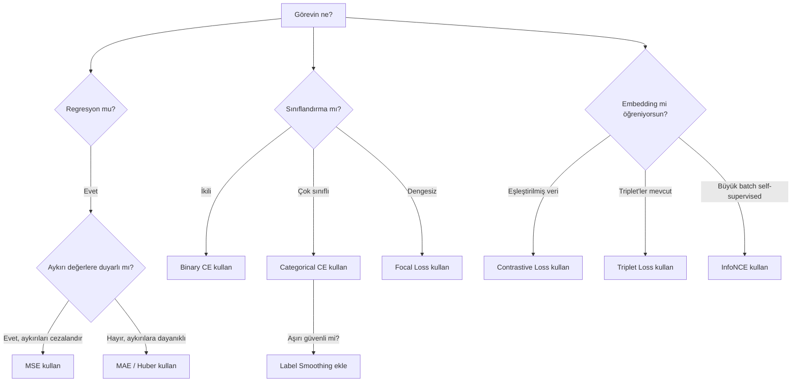
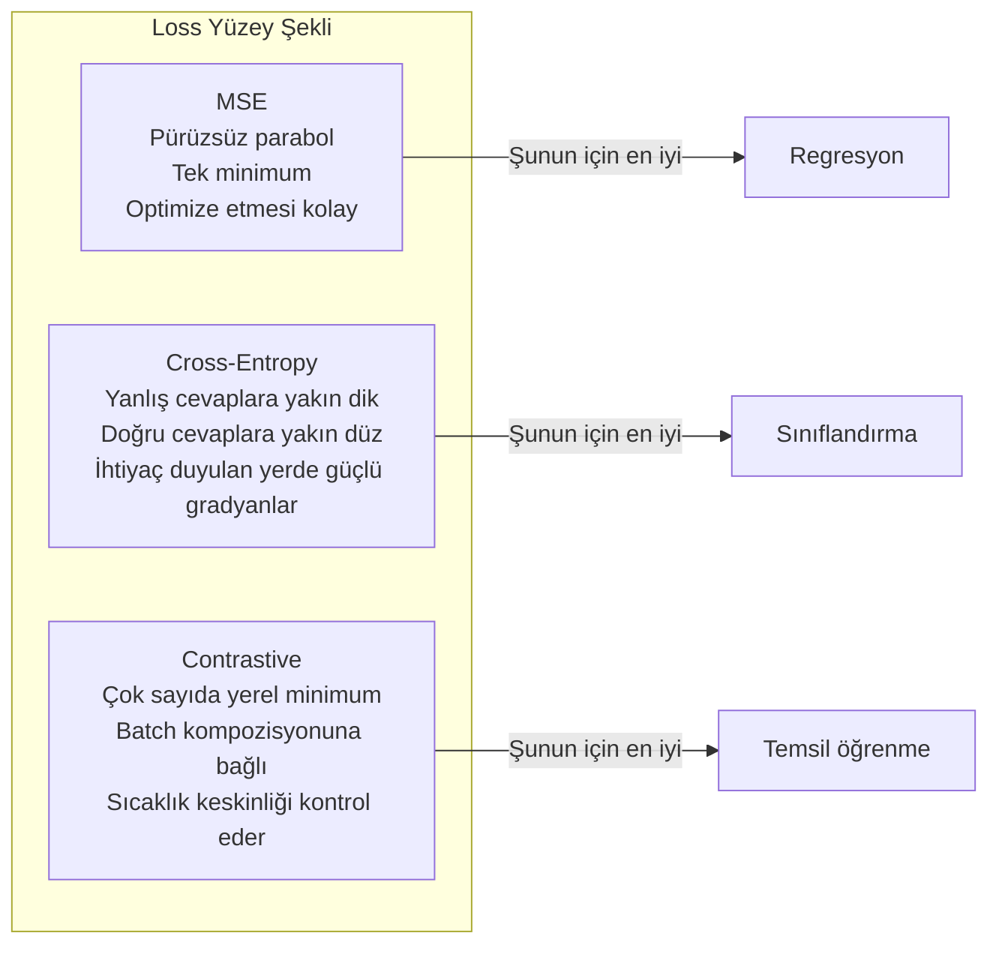

# Loss Fonksiyonları

> Ağın bir tahmin yapar. Gerçek doğru başka bir şey söyler. Ne kadar yanlış? O sayı loss'tur. Yanlış loss fonksiyonunu seç ve modelin tamamen yanlış şey için optimize etsin.

**Tür:** Yapım
**Diller:** Python
**Ön koşullar:** Ders 03.04 (Aktivasyon Fonksiyonları)
**Süre:** ~75 dakika

## Öğrenme Hedefleri

- MSE, binary cross-entropy, categorical cross-entropy ve contrastive loss (InfoNCE)'yi gradyanlarıyla birlikte sıfırdan uygula
- "Her şey için 0.5 tahmin et" başarısızlık modunu göstererek MSE'nin sınıflandırma için neden başarısız olduğunu açıkla
- Cross-entropy'ye label smoothing uygula ve aşırı kendinden emin tahminleri nasıl önlediğini açıkla
- Regresyon, ikili sınıflandırma, çok sınıflı sınıflandırma ve embedding öğrenme görevleri için doğru loss fonksiyonunu seç

## Sorun

Bir sınıflandırma probleminde MSE'yi minimize eden bir model her şey için kendinden emin bir şekilde 0.5 tahmin edecektir. Loss'u minimize ediyor. Aynı zamanda işe yaramaz.

Loss fonksiyonu, modelinin gerçekten optimize ettiği tek şeydir. Doğruluk değil. F1 skoru değil. Yöneticine raporladığın hangi metrik olursa olsun. Optimizer loss fonksiyonunun gradyanını alır ve o sayıyı küçültmek için ağırlıkları ayarlar. Loss fonksiyonu önemsediğin şeyi yakalamıyorsa, model onu tatmin etmenin matematiksel olarak en ucuz yolunu bulur ve o yol neredeyse hiçbir zaman istediğin şey değildir.

İşte somut bir örnek. Bir ikili sınıflandırma görevin var. İki sınıf, 50/50 dağılım. Loss olarak MSE kullanıyorsun. Model her giriş için 0.5 tahmin ediyor. Ortalama MSE 0.25, bu da gerçekte hiçbir şey öğrenmeden alınabilecek mümkün olan minimum. Modelin sıfır ayırt edici yeteneği var ama teknik olarak loss fonksiyonunu minimize etmiş. Cross-entropy'ye geç ve aynı model tahminleri 0 ya da 1'e itmeye zorlanır, çünkü -log(0.5) = 0.693 berbat bir loss iken -log(0.99) = 0.01 kendinden emin doğru tahminleri ödüllendirir. Loss fonksiyonu seçimi, öğrenen bir model ile metriği kandıran bir model arasındaki farktır.

Daha da kötüleşiyor. Self-supervised learning'de etiketlerin bile yok. Contrastive loss öğrenme sinyalini tamamen tanımlar: ne benzer sayılır, ne farklı sayılır ve modelin onları ne kadar zorla itmesi gerektiği. Contrastive loss'u yanlış al, embedding'lerin tek bir noktaya çöker — her giriş aynı vektöre eşlenir. Teknik olarak sıfır loss. Tamamen değersiz.

## Kavram

### Mean Squared Error (MSE)

Regresyon için varsayılan. Tahmin ile hedef arasındaki kare farkı hesapla, tüm örnekler üzerinden ortalamasını al.

```
MSE = (1/n) * sum((y_pred - y_true)^2)
```

Karenin neden önemli olduğu: büyük hataları ikinci dereceden cezalandırır. 2'lik bir hata, 1'lik bir hatadan 4 kat daha fazlaya mal olur. 10'luk bir hata 100 kat. Bu MSE'yi aykırı değerlere duyarlı yapar — tek bir vahşi yanlış tahmin loss'a hâkim olur.

Gerçek sayılar: modelin ev fiyatlarını tahmin ediyorsa ve çoğu evde 10.000 dolar, ama bir malikanede 200.000 dolar yanılıyorsa, MSE o tek malikaneyi düzeltmek için agresif şekilde uğraşacak ve potansiyel olarak diğer 99 evdeki performansa zarar verecektir.

Bir tahmine göre MSE'nin gradyanı:

```
dMSE/dy_pred = (2/n) * (y_pred - y_true)
```

Hatada doğrusal. Daha büyük hatalar daha büyük gradyanlar alır. Bu regresyon için bir özelliktir (büyük hatalar büyük düzeltmelere ihtiyaç duyar) ve sınıflandırma için bir bug'dır (kendinden emin yanlış cevapları üstel olarak cezalandırmak istersin, doğrusal olarak değil).

### Cross-Entropy Loss

Sınıflandırma için loss fonksiyonu. Bilgi teorisinde köklenmiştir — tahmin edilen olasılık dağılımı ile gerçek dağılım arasındaki ayrılığı ölçer.

**Binary Cross-Entropy (BCE):**

```
BCE = -(y * log(p) + (1 - y) * log(1 - p))
```

Burada y gerçek etiket (0 ya da 1) ve p tahmin edilen olasılıktır.

-log(p)'nin neden işe yaradığı: gerçek etiket 1 olduğunda ve p = 0.99 tahmin ettiğinde, loss -log(0.99) = 0.01. p = 0.01 tahmin ettiğinde, loss -log(0.01) = 4.6. Cross-entropy'nin işe yaramasının nedeni o 460 katlık farktır. Kendinden emin yanlış tahminleri acımasızca cezalandırırken kendinden emin doğru olanları neredeyse hiç cezalandırmaz.

Gradyan aynı hikayeyi anlatır:

```
dBCE/dp = -(y/p) + (1-y)/(1-p)
```

y = 1 ve p sıfıra yakın olduğunda gradyan -1/p'dir, ki bu negatif sonsuza yaklaşır. Model hatasını düzeltmek için muazzam bir sinyal alır. p 1'e yakın olduğunda gradyan minicik. Zaten doğru, düzeltilecek bir şey yok.

**Categorical Cross-Entropy:**

One-hot kodlanmış hedeflerle çok sınıflı sınıflandırma için.

```
CCE = -sum(y_i * log(p_i))
```

Loss'a yalnızca gerçek sınıf katkıda bulunur (çünkü diğer tüm y_i sıfırdır). 10 sınıf varsa ve doğru sınıf 0.1 olasılık alırsa (rastgele tahmin), loss -log(0.1) = 2.3. Doğru sınıf 0.9 olasılık alırsa, loss -log(0.9) = 0.105. Model olasılık kütlesini doğru cevap üzerinde toplamayı öğrenir.

### MSE Sınıflandırma İçin Neden Başarısız Olur



MSE gradyanları, tahminler 0 ya da 1'e yakın olduğunda düzleşir (sigmoid doygunluğu nedeniyle). Cross-entropy gradyanları bunu telafi eder — -log sigmoid'in düz bölgelerini iptal eder ve tam ihtiyaç duyulan yerde güçlü gradyanlar verir.

### Label Smoothing

Standart one-hot etiketler "bu %100 sınıf 3 ve %0 diğer her şey" der. Bu güçlü bir iddia. Label smoothing onu yumuşatır:

```
smooth_label = (1 - alpha) * one_hot + alpha / num_classes
```

alpha = 0.1 ve 10 sınıfla: [0, 0, 1, 0, ...] yerine, hedef [0.01, 0.01, 0.91, 0.01, ...] olur. Model 1.0 yerine 0.91'i hedefler.

Bunun neden işe yaradığı: bir softmax aracılığıyla tam olarak 1.0 üretmeye çalışan bir modelin logit'leri sonsuza itmesi gerekir. Bu aşırı güvene neden olur, genelleştirmeye zarar verir ve modeli dağılım kaymasına kırılgan yapar. Label smoothing (alpha=0.1 ile) hedefi 0.9'da sınırlar, logit'leri makul bir aralıkta tutar. GPT ve çoğu modern model label smoothing ya da eşdeğerini kullanır.

### Contrastive Loss

Etiket yok. Sınıf yok. Sadece giriş çiftleri ve şu soru: bunlar benzer mi farklı mı?

**SimCLR-tarzı contrastive loss (NT-Xent / InfoNCE):**

Bir görüntü al. Onun iki augmente edilmiş görünümünü yarat (crop, döndür, renk titret). Bunlar "pozitif çift" — benzer embedding'lere sahip olmaları gerekir. Batch'teki diğer her görüntü bir "negatif çift" oluşturur — farklı embedding'lere sahip olmaları gerekir.

```
L = -log(exp(sim(z_i, z_j) / tau) / sum(exp(sim(z_i, z_k) / tau)))
```

Burada sim() kosinüs benzerliğidir, z_i ve z_j pozitif çifttir, toplam tüm negatifler üzerindedir ve tau (sıcaklık) dağılımın ne kadar keskin olduğunu kontrol eder. Daha düşük sıcaklık = daha sert negatifler = daha agresif ayrım.

Gerçek sayılar: 256 batch boyutu, pozitif çift başına 255 negatif demek. Sıcaklık tau = 0.07 (SimCLR varsayılanı). Loss benzerlikler üzerinde bir softmax gibi görünür — pozitif çiftin benzerliğinin tüm 256 seçenek arasında en yüksek olmasını ister.

**Triplet Loss:**

Üç giriş alır: anchor, positive (aynı sınıf), negative (farklı sınıf).

```
L = max(0, d(anchor, positive) - d(anchor, negative) + margin)
```

Margin (tipik olarak 0.2-1.0) pozitif ve negatif mesafeler arasında minimum bir boşluk dayatır. Negatif zaten yeterince uzaksa, loss sıfırdır — gradyan yok, güncelleme yok. Bu eğitimi verimli yapar ama dikkatli triplet madenciliği (anchor'a yakın olan sert negatiflerin seçilmesi) gerektirir.

### Focal Loss

Dengesiz veri setleri için. Standart cross-entropy doğru sınıflandırılmış tüm örneklere eşit muamele eder. Focal loss kolay örnekleri daha az ağırlıklandırır:

```
FL = -alpha * (1 - p_t)^gamma * log(p_t)
```

Burada p_t gerçek sınıfın tahmin edilen olasılığı ve gamma odaklanmayı kontrol eder. gamma = 0 ile bu standart cross-entropy'dir. gamma = 2 (varsayılan) ile:

- Kolay örnek (p_t = 0.9): ağırlık = (0.1)^2 = 0.01. Etkin olarak görmezden gelinir.
- Sert örnek (p_t = 0.1): ağırlık = (0.9)^2 = 0.81. Tam gradyan sinyali.

Focal loss, aday bölgelerin %99'unun arka plan olduğu (kolay negatifler) nesne tespiti için Lin ve diğerleri tarafından tanıtıldı. Focal loss olmadan model kolay arka plan örneklerinde boğulur ve asla nesneleri tespit etmeyi öğrenmez. Onunla model kapasitesini önemli olan sert, belirsiz vakalara odaklar.

### Loss Fonksiyonu Karar Ağacı



### Loss Manzarası



## İnşa Et

### Adım 1: MSE ve Gradyanı

```python
def mse(predictions, targets):
    n = len(predictions)
    total = 0.0
    for p, t in zip(predictions, targets):
        total += (p - t) ** 2
    return total / n

def mse_gradient(predictions, targets):
    n = len(predictions)
    grads = []
    for p, t in zip(predictions, targets):
        grads.append(2.0 * (p - t) / n)
    return grads
```

### Adım 2: Binary Cross-Entropy

log(0) problemi gerçektir. Model bir pozitif örnek için tam olarak 0 tahmin ederse, log(0) = negatif sonsuz. Kırpma bunu önler.

```python
import math

def binary_cross_entropy(predictions, targets, eps=1e-15):
    n = len(predictions)
    total = 0.0
    for p, t in zip(predictions, targets):
        p_clipped = max(eps, min(1 - eps, p))
        total += -(t * math.log(p_clipped) + (1 - t) * math.log(1 - p_clipped))
    return total / n

def bce_gradient(predictions, targets, eps=1e-15):
    grads = []
    for p, t in zip(predictions, targets):
        p_clipped = max(eps, min(1 - eps, p))
        grads.append(-(t / p_clipped) + (1 - t) / (1 - p_clipped))
    return grads
```

### Adım 3: Softmax ile Categorical Cross-Entropy

Softmax ham logit'leri olasılıklara dönüştürür. Sonra one-hot hedeflere karşı cross-entropy'yi hesaplıyoruz.

```python
def softmax(logits):
    max_val = max(logits)
    exps = [math.exp(x - max_val) for x in logits]
    total = sum(exps)
    return [e / total for e in exps]

def categorical_cross_entropy(logits, target_index, eps=1e-15):
    probs = softmax(logits)
    p = max(eps, probs[target_index])
    return -math.log(p)

def cce_gradient(logits, target_index):
    probs = softmax(logits)
    grads = list(probs)
    grads[target_index] -= 1.0
    return grads
```

Softmax + cross-entropy'nin gradyanı çok güzel sadeleşir: gerçek sınıf için (tahmin edilen olasılık - 1), diğer tüm sınıflar için (tahmin edilen olasılık). Bu zarif sadeleşme tesadüf değil — softmax ve cross-entropy'nin neden eşleştirildiğinin nedeni budur.

### Adım 4: Label Smoothing

```python
def label_smoothed_cce(logits, target_index, num_classes, alpha=0.1, eps=1e-15):
    probs = softmax(logits)
    loss = 0.0
    for i in range(num_classes):
        if i == target_index:
            smooth_target = 1.0 - alpha + alpha / num_classes
        else:
            smooth_target = alpha / num_classes
        p = max(eps, probs[i])
        loss += -smooth_target * math.log(p)
    return loss
```

### Adım 5: Contrastive Loss (Basitleştirilmiş InfoNCE)

```python
def cosine_similarity(a, b):
    dot = sum(x * y for x, y in zip(a, b))
    norm_a = math.sqrt(sum(x * x for x in a))
    norm_b = math.sqrt(sum(x * x for x in b))
    if norm_a < 1e-10 or norm_b < 1e-10:
        return 0.0
    return dot / (norm_a * norm_b)

def contrastive_loss(anchor, positive, negatives, temperature=0.07):
    sim_pos = cosine_similarity(anchor, positive) / temperature
    sim_negs = [cosine_similarity(anchor, neg) / temperature for neg in negatives]

    max_sim = max(sim_pos, max(sim_negs)) if sim_negs else sim_pos
    exp_pos = math.exp(sim_pos - max_sim)
    exp_negs = [math.exp(s - max_sim) for s in sim_negs]
    total_exp = exp_pos + sum(exp_negs)

    return -math.log(max(1e-15, exp_pos / total_exp))
```

### Adım 6: Sınıflandırmada MSE vs Cross-Entropy

Ders 04'teki aynı ağı (çember veri seti) her iki loss fonksiyonuyla eğit. Cross-entropy'nin daha hızlı yakınsadığını izle.

```python
import random

def sigmoid(x):
    x = max(-500, min(500, x))
    return 1.0 / (1.0 + math.exp(-x))

def make_circle_data(n=200, seed=42):
    random.seed(seed)
    data = []
    for _ in range(n):
        x = random.uniform(-2, 2)
        y = random.uniform(-2, 2)
        label = 1.0 if x * x + y * y < 1.5 else 0.0
        data.append(([x, y], label))
    return data


class LossComparisonNetwork:
    def __init__(self, loss_type="bce", hidden_size=8, lr=0.1):
        random.seed(0)
        self.loss_type = loss_type
        self.lr = lr
        self.hidden_size = hidden_size

        self.w1 = [[random.gauss(0, 0.5) for _ in range(2)] for _ in range(hidden_size)]
        self.b1 = [0.0] * hidden_size
        self.w2 = [random.gauss(0, 0.5) for _ in range(hidden_size)]
        self.b2 = 0.0

    def forward(self, x):
        self.x = x
        self.z1 = []
        self.h = []
        for i in range(self.hidden_size):
            z = self.w1[i][0] * x[0] + self.w1[i][1] * x[1] + self.b1[i]
            self.z1.append(z)
            self.h.append(max(0.0, z))

        self.z2 = sum(self.w2[i] * self.h[i] for i in range(self.hidden_size)) + self.b2
        self.out = sigmoid(self.z2)
        return self.out

    def backward(self, target):
        if self.loss_type == "mse":
            d_loss = 2.0 * (self.out - target)
        else:
            eps = 1e-15
            p = max(eps, min(1 - eps, self.out))
            d_loss = -(target / p) + (1 - target) / (1 - p)

        d_sigmoid = self.out * (1 - self.out)
        d_out = d_loss * d_sigmoid

        for i in range(self.hidden_size):
            d_relu = 1.0 if self.z1[i] > 0 else 0.0
            d_h = d_out * self.w2[i] * d_relu
            self.w2[i] -= self.lr * d_out * self.h[i]
            for j in range(2):
                self.w1[i][j] -= self.lr * d_h * self.x[j]
            self.b1[i] -= self.lr * d_h
        self.b2 -= self.lr * d_out

    def compute_loss(self, pred, target):
        if self.loss_type == "mse":
            return (pred - target) ** 2
        else:
            eps = 1e-15
            p = max(eps, min(1 - eps, pred))
            return -(target * math.log(p) + (1 - target) * math.log(1 - p))

    def train(self, data, epochs=200):
        losses = []
        for epoch in range(epochs):
            total_loss = 0.0
            correct = 0
            for x, y in data:
                pred = self.forward(x)
                self.backward(y)
                total_loss += self.compute_loss(pred, y)
                if (pred >= 0.5) == (y >= 0.5):
                    correct += 1
            avg_loss = total_loss / len(data)
            accuracy = correct / len(data) * 100
            losses.append((avg_loss, accuracy))
            if epoch % 50 == 0 or epoch == epochs - 1:
                print(f"    Epoch {epoch:3d}: loss={avg_loss:.4f}, doğruluk=%{accuracy:.1f}")
        return losses
```

## Kullan

PyTorch tüm standart loss fonksiyonlarını sayısal kararlılık ile birlikte sunar:

```python
import torch
import torch.nn as nn
import torch.nn.functional as F

predictions = torch.tensor([0.9, 0.1, 0.7], requires_grad=True)
targets = torch.tensor([1.0, 0.0, 1.0])

mse_loss = F.mse_loss(predictions, targets)
bce_loss = F.binary_cross_entropy(predictions, targets)

logits = torch.randn(4, 10)
labels = torch.tensor([3, 7, 1, 9])
ce_loss = F.cross_entropy(logits, labels)
ce_smooth = F.cross_entropy(logits, labels, label_smoothing=0.1)
```

`F.cross_entropy` kullan (`F.nll_loss` artı manuel softmax değil). log-softmax ve negative log-likelihood'u sayısal olarak kararlı tek bir işlemde birleştirir. Softmax'ı ayrı uygulayıp sonra log almak daha az kararlıdır — büyük üstellerin çıkarılmasında hassasiyet kaybedersin.

Contrastive learning için, çoğu takım özel uygulamalar ya da `lightly` veya `pytorch-metric-learning` gibi kütüphaneler kullanır. Temel döngü her zaman aynıdır: çift bazlı benzerlikleri hesapla, pozitifler ve negatifler üzerinde softmax oluştur, backpropagate et.

## Yayınla

Bu ders şunları üretir:
- `outputs/prompt-loss-function-selector.md` — doğru loss fonksiyonunu seçmek için yeniden kullanılabilir bir prompt
- `outputs/prompt-loss-debugger.md` — loss eğrin yanlış göründüğünde teşhis amaçlı bir prompt

## Alıştırmalar

1. Küçük hatalar için MSE ve büyük hatalar için MAE olan Huber loss (smooth L1 loss)'u uygula. Eğitim hedeflerinin %5'ine rastgele gürültü eklendiğinde (aykırı değerler) y = sin(x)'i tahmin eden bir regresyon ağını MSE vs Huber ile eğit. Final test hatasını karşılaştır.

2. İkili sınıflandırma eğitim döngüsüne focal loss ekle. Dengesiz bir veri seti yarat (%90 sınıf 0, %10 sınıf 1). 200 epoch sonra azınlık sınıfında standart BCE vs focal loss (gamma=2)'yi recall üzerinde karşılaştır.

3. Semi-hard negative mining ile triplet loss uygula. 5 sınıf için 2D embedding verisi üret. Her anchor için, pozitiften hâlâ daha uzak olan en sert negatifi (semi-hard) bul. Yakınsamayı rastgele triplet seçimiyle karşılaştır.

4. MSE vs cross-entropy karşılaştırmasını çalıştır ama eğitim sırasında her katmandaki gradyan büyüklüklerini takip et. Epoch başına ortalama gradyan normunu çiz. Model en belirsiz olduğunda cross-entropy'nin erken epoch'larda daha büyük gradyanlar ürettiğini doğrula.

5. KL divergence loss uygula ve KL(true || predicted)'i minimize etmenin gerçek dağılım one-hot olduğunda cross-entropy ile aynı gradyanları verdiğini doğrula. Sonra "gerçek" dağılımın bir öğretmen modelin softmax çıktısından geldiği yumuşak hedefleri (knowledge distillation gibi) dene.

## Anahtar Terimler

| Terim | İnsanlar ne diyor | Gerçekte ne anlama geliyor |
|------|----------------|----------------------|
| Loss fonksiyonu | "Modelin ne kadar yanlış olduğu" | Tahminleri ve hedefleri optimizer'ın minimize ettiği bir skalere eşleyen türevlenebilir bir fonksiyon |
| MSE | "Ortalama karesel hata" | Tahminler ve hedefler arasındaki kare farkların ortalaması; büyük hataları ikinci dereceden cezalandırır |
| Cross-entropy | "Sınıflandırma loss'u" | -log(p) kullanarak tahmin edilen olasılık dağılımı ve gerçek dağılım arasındaki ayrılığı ölçer |
| Binary cross-entropy | "BCE" | İki sınıf için cross-entropy: -(y*log(p) + (1-y)*log(1-p)) |
| Label smoothing | "Hedefleri yumuşatma" | Aşırı güveni önlemek ve genelleştirmeyi iyileştirmek için sert 0/1 hedefleri yumuşak değerlerle (örn., 0.1/0.9) değiştirme |
| Contrastive loss | "Birlikte çek, ayır" | Embedding uzayında benzer çiftleri yakın, farklı çiftleri uzak yaparak temsiller öğrenen bir loss |
| InfoNCE | "CLIP/SimCLR loss'u" | Benzerlik skorları üzerinde normalize sıcaklık ölçekli cross-entropy; contrastive learning'i sınıflandırma olarak ele alır |
| Focal loss | "Dengesiz veri çözümü" | Kolay örnekleri daha az ağırlıklandırıp zor olanlara odaklanmak için (1-p_t)^gamma ile ağırlıklandırılmış cross-entropy |
| Triplet loss | "Anchor-positive-negative" | Anchor'ı embedding uzayında negatiften en az bir margin kadar pozitife daha yakın iter |
| Sıcaklık | "Keskinlik düğmesi" | Logit'ler/benzerlikler üzerinde, sonuçtaki dağılımın ne kadar tepeli olduğunu kontrol eden skaler bir bölen; daha düşük = daha keskin |

## İleri Okuma

- Lin et al., "Focal Loss for Dense Object Detection" (2017) — nesne tespitinde aşırı sınıf dengesizliğini ele almak için focal loss'u tanıttı (RetinaNet)
- Chen et al., "A Simple Framework for Contrastive Learning of Visual Representations" (SimCLR, 2020) — NT-Xent loss ile modern contrastive learning pipeline'ını tanımladı
- Szegedy et al., "Rethinking the Inception Architecture" (2016) — label smoothing'i bir regularization tekniği olarak tanıttı, şimdi çoğu büyük modelde standart
- Hinton et al., "Distilling the Knowledge in a Neural Network" (2015) — yumuşak hedefler ve KL divergence kullanarak knowledge distillation, model sıkıştırma için temel
