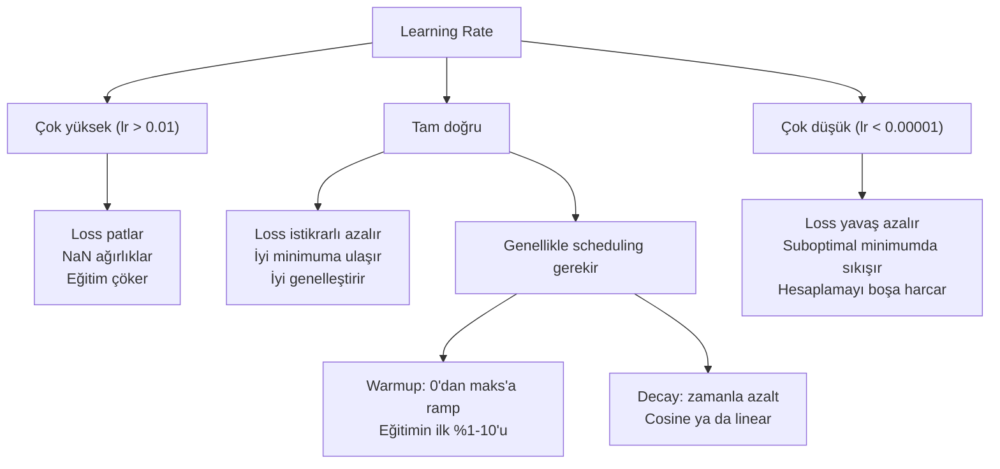
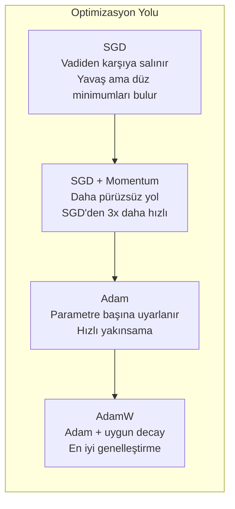
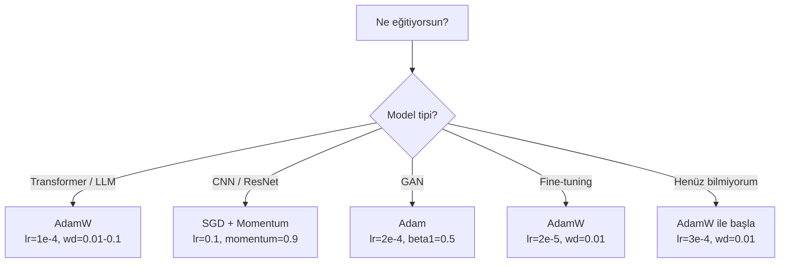

# Optimizer'lar

> Gradient descent sana hangi yöne hareket etmen gerektiğini söyler. Ne kadar uzağa ya da ne kadar hızlı hakkında hiçbir şey söylemez. SGD bir pusuladır. Adam trafik verileriyle GPS'tir.

**Tür:** Yapım
**Diller:** Python
**Ön koşullar:** Ders 03.05 (Loss Fonksiyonları)
**Süre:** ~75 dakika

## Öğrenme Hedefleri

- Python'da sıfırdan SGD, momentum'lu SGD, Adam ve AdamW optimizer'larını uygula
- Adam'ın bias correction'ının erken eğitim adımlarında sıfırla başlatılan moment tahminlerini nasıl telafi ettiğini açıkla
- AdamW'nin aynı görevde L2 regularization'lı Adam'dan neden daha iyi genelleştirme ürettiğini göster
- Transformer'lar, CNN'ler, GAN'lar ve fine-tuning için uygun optimizer ve varsayılan hiperparametreleri seç

## Sorun

Gradyanları hesapladın. Ağırlık #4,721'in loss'u azaltmak için 0.003 azalması gerektiğini biliyorsun. Ama hangi birimlerde 0.003? Ne ile ölçeklendi? Adım 1'de adım 1,000'deki kadar hareket etmeli mi?

Vanilla gradient descent her adımda her parametreye aynı learning rate'i uygular: w = w - lr * gradient. Bu, pratikte sinir ağı eğitimini acı verici yapan üç problem yaratır.

Birinci, salınım. Loss manzarası nadiren pürüzsüz bir kase şeklindedir. Daha çok uzun, dar bir vadi gibidir. Gradyan vadinin karşısına (dik yön) işaret eder, boyunca değil (sığ yön). Gradient descent dar boyut boyunca ileri geri zıplar ve faydalı boyutta minik ilerleme kaydeder. Bunu görmüşsündür: loss hızlı düşer sonra durur — model yakınsadığı için değil, salındığı için.

İkinci, tüm parametreler için tek bir learning rate yanlıştır. Bazı ağırlıklar büyük güncellemeler gerektirir (erken, underfitting aşamasındadırlar). Diğerleri minik güncellemeler gerektirir (optimal değerlerine yakındırlar). Birincisi için işe yarayan learning rate ikincisini yok eder ve tersi.

Üçüncü, eyer noktaları. Yüksek boyutlarda loss manzarası gradyanın sıfıra yakın olduğu geniş düz bölgelere sahiptir. Vanilla SGD bunlarda gradyanın hızında — ki bu etkin olarak sıfırdır — sürünür. Model sıkışmış görünür. Sıkışmamıştır — diğer tarafta faydalı iniş olan düz bir bölgededir. Ama SGD'nin geçmek için bir mekanizması yoktur.

Adam üçünü de çözer. Parametre başına iki çalışan ortalama tutar — ortalama gradyan (momentum, salınımı işler) ve ortalama kare gradyan (uyarlamalı oran, farklı ölçekleri işler). İlk birkaç adım için bias correction ile birleştiğinde, sana varsayılan hiperparametrelerle problemlerin %80'inde çalışan tek bir optimizer verir. Bu ders diğer %20'de tam olarak ne zaman ve neden başarısız olduğunu anlaman için onu sıfırdan kurar.

## Kavram

### Stochastic Gradient Descent (SGD)

En basit optimizer. Bir mini-batch üzerinde gradyanı hesapla ve ters yönde adım at.

```
w = w - lr * gradient
```

"Stochastic", gradyanı tahmin etmek için tam veri seti yerine verinin rastgele bir alt kümesini (mini-batch) kullanman demektir. Bu gürültü aslında faydalıdır — keskin yerel minimumlardan kaçmaya yardımcı olur. Ama gürültü ayrıca salınıma da neden olur.

Learning rate tek ayar düğmesidir. Çok yüksek: loss ıraksar. Çok düşük: eğitim sonsuza kadar sürer. Optimal değer mimariye, veriye, batch boyutuna ve eğitimin mevcut aşamasına bağlıdır. Modern ağlarda vanilla SGD için tipik değerler 0.01 ile 0.1 arasındadır. Ama tek bir eğitim çalışmasında bile ideal learning rate değişir.

### Momentum

Yokuş aşağı yuvarlanan top benzetmesi aşırı kullanılır ama doğrudur. Yalnızca gradyanla adım atmak yerine, geçmiş gradyanları biriktiren bir hız tutarsın.

```
m_t = beta * m_{t-1} + gradient
w = w - lr * m_t
```

Beta (tipik olarak 0.9) ne kadar geçmiş tutulacağını kontrol eder. Beta = 0.9 ile, momentum kabaca son 10 gradyanın ortalamasıdır (1 / (1 - 0.9) = 10).

Bunun salınımı neden düzelttiği: aynı yöne işaret eden gradyanlar birikir. Yön değiştiren gradyanlar birbirini iptal eder. O dar vadide, "karşı" bileşeni her adımda işaret değiştirir ve sönümlenir. "Boyunca" bileşeni tutarlı kalır ve güçlenir. Sonuç faydalı yönde pürüzsüz bir hızlanmadır.

Gerçek sayılar: kötü koşullu bir loss manzarasında tek başına SGD 10,000 adım gerektirebilir. Momentum'lu SGD (beta=0.9) aynı problemde tipik olarak 3,000-5,000 adım gerektirir. Hızlanma marjinal değildir.

### RMSProp

Gerçekten çalışan ilk parametre başına uyarlamalı learning rate yöntemi. Hinton tarafından bir Coursera dersinde önerildi (resmi olarak yayınlanmadı).

```
s_t = beta * s_{t-1} + (1 - beta) * gradient^2
w = w - lr * gradient / (sqrt(s_t) + epsilon)
```

s_t, kare gradyanların çalışan ortalamasını takip eder. Tutarlı olarak büyük gradyanlara sahip parametreler büyük bir sayıyla bölünür (daha küçük efektif learning rate). Küçük gradyanlara sahip parametreler küçük bir sayıyla bölünür (daha büyük efektif learning rate).

Bu "tüm parametreler için tek learning rate" problemini çözer. Zaten büyük güncellemeler almış bir ağırlık muhtemelen hedefine yakındır — onu yavaşlat. Minik güncellemeler almış bir ağırlık az eğitilmiş olabilir — onu hızlandır.

Epsilon (tipik olarak 1e-8) bir parametre güncellenmediğinde sıfıra bölmeyi önler.

### Adam: Momentum + RMSProp

Adam her iki fikri birleştirir. Parametre başına iki üstel hareketli ortalama tutar:

```
m_t = beta1 * m_{t-1} + (1 - beta1) * gradient        (birinci moment: ortalama)
v_t = beta2 * v_{t-1} + (1 - beta2) * gradient^2       (ikinci moment: varyans)
```

**Bias correction** çoğu açıklamanın atladığı kilit detaydır. Adım 1'de, m_1 = (1 - beta1) * gradient. beta1 = 0.9 ile, bu 0.1 * gradient — on kat çok küçük. Hareketli ortalama henüz ısınmamış. Bias correction telafi eder:

```
m_hat = m_t / (1 - beta1^t)
v_hat = v_t / (1 - beta2^t)
```

Beta1 = 0.9 ile adım 1'de: m_hat = m_1 / (1 - 0.9) = m_1 / 0.1 = gerçek gradyan. Adım 100'de: (1 - 0.9^100) yaklaşık 1.0'dır, yani düzeltme kaybolur. Bias correction ilk ~10 adım için önemlidir ve ~50'den sonra alakasızdır.

Güncelleme:

```
w = w - lr * m_hat / (sqrt(v_hat) + epsilon)
```

Adam varsayılanları: lr = 0.001, beta1 = 0.9, beta2 = 0.999, epsilon = 1e-8. Bu varsayılanlar problemlerin %80'i için çalışır. Çalışmadıklarında önce lr'yi değiştir. Sonra beta2. Beta1'i ya da epsilon'u neredeyse hiç değiştirme.

### AdamW: Doğru Yapılmış Weight Decay

L2 regularization loss'a lambda * w^2 ekler. Vanilla SGD'de bu weight decay'e eşdeğerdir (her adımda ağırlıktan lambda * w çıkarmak). Adam'da bu eşdeğerlik bozulur.

Loshchilov & Hutter içgörüsü: loss'a L2 eklediğinde ve sonra Adam gradyanı işlediğinde, uyarlamalı learning rate regularization terimini de ölçekler. Büyük gradyan varyansına sahip parametreler daha az regularization alır. Küçük varyansa sahip olanlar daha fazla alır. Bu istediğin değildir — gradyan istatistiklerinden bağımsız olarak tek tip regularization istersin.

AdamW bunu, Adam güncellemesinden sonra weight decay'i doğrudan ağırlıklara uygulayarak düzeltir:

```
w = w - lr * m_hat / (sqrt(v_hat) + epsilon) - lr * lambda * w
```

Weight decay terimi (lr * lambda * w) Adam'ın uyarlamalı faktörü tarafından ölçeklenmez. Her parametre aynı oranlı küçülmeyi alır.

Bu küçük bir detay gibi görünüyor. Değil. AdamW pratikte her görevde Adam + L2 regularization'dan daha iyi çözümlere yakınsar. Transformer'lar, diffusion modelleri ve çoğu modern mimariyi eğitmek için PyTorch'ta varsayılan optimizer'dır. BERT, GPT, LLaMA, Stable Diffusion — hepsi AdamW ile eğitildi.

### Learning Rate: En Önemli Hiperparametre



Tek bir hiperparametre ayarlayacaksan, learning rate'i ayarla. Learning rate'te 10x değişim, yapacağın herhangi bir mimari karardan daha çok önemlidir. Yaygın varsayılanlar:

- SGD: lr = 0.01 ile 0.1
- Adam/AdamW: lr = 1e-4 ile 3e-4
- Önceden eğitilmiş modelleri fine-tune etmek: lr = 1e-5 ile 5e-5
- Learning rate warmup: ilk %1-10 adımda lineer ramp

### Optimizer Karşılaştırması



### Her Optimizer Ne Zaman Kazanır



## İnşa Et

### Adım 1: Vanilla SGD

```python
class SGD:
    def __init__(self, lr=0.01):
        self.lr = lr

    def step(self, params, grads):
        for i in range(len(params)):
            params[i] -= self.lr * grads[i]
```

### Adım 2: Momentum'lu SGD

```python
class SGDMomentum:
    def __init__(self, lr=0.01, beta=0.9):
        self.lr = lr
        self.beta = beta
        self.velocities = None

    def step(self, params, grads):
        if self.velocities is None:
            self.velocities = [0.0] * len(params)
        for i in range(len(params)):
            self.velocities[i] = self.beta * self.velocities[i] + grads[i]
            params[i] -= self.lr * self.velocities[i]
```

### Adım 3: Adam

```python
import math

class Adam:
    def __init__(self, lr=0.001, beta1=0.9, beta2=0.999, epsilon=1e-8):
        self.lr = lr
        self.beta1 = beta1
        self.beta2 = beta2
        self.epsilon = epsilon
        self.m = None
        self.v = None
        self.t = 0

    def step(self, params, grads):
        if self.m is None:
            self.m = [0.0] * len(params)
            self.v = [0.0] * len(params)

        self.t += 1

        for i in range(len(params)):
            self.m[i] = self.beta1 * self.m[i] + (1 - self.beta1) * grads[i]
            self.v[i] = self.beta2 * self.v[i] + (1 - self.beta2) * grads[i] ** 2

            m_hat = self.m[i] / (1 - self.beta1 ** self.t)
            v_hat = self.v[i] / (1 - self.beta2 ** self.t)

            params[i] -= self.lr * m_hat / (math.sqrt(v_hat) + self.epsilon)
```

### Adım 4: AdamW

```python
class AdamW:
    def __init__(self, lr=0.001, beta1=0.9, beta2=0.999, epsilon=1e-8, weight_decay=0.01):
        self.lr = lr
        self.beta1 = beta1
        self.beta2 = beta2
        self.epsilon = epsilon
        self.weight_decay = weight_decay
        self.m = None
        self.v = None
        self.t = 0

    def step(self, params, grads):
        if self.m is None:
            self.m = [0.0] * len(params)
            self.v = [0.0] * len(params)

        self.t += 1

        for i in range(len(params)):
            self.m[i] = self.beta1 * self.m[i] + (1 - self.beta1) * grads[i]
            self.v[i] = self.beta2 * self.v[i] + (1 - self.beta2) * grads[i] ** 2

            m_hat = self.m[i] / (1 - self.beta1 ** self.t)
            v_hat = self.v[i] / (1 - self.beta2 ** self.t)

            params[i] -= self.lr * m_hat / (math.sqrt(v_hat) + self.epsilon)
            params[i] -= self.lr * self.weight_decay * params[i]
```

### Adım 5: Eğitim Karşılaştırması

Ders 05'teki aynı iki katmanlı ağı çember veri setinde dört optimizer'ın tümüyle eğit. Yakınsamayı karşılaştır.

```python
import random

def sigmoid(x):
    x = max(-500, min(500, x))
    return 1.0 / (1.0 + math.exp(-x))

def make_circle_data(n=200, seed=42):
    random.seed(seed)
    data = []
    for _ in range(n):
        x = random.uniform(-2, 2)
        y = random.uniform(-2, 2)
        label = 1.0 if x * x + y * y < 1.5 else 0.0
        data.append(([x, y], label))
    return data


class OptimizerTestNetwork:
    def __init__(self, optimizer, hidden_size=8):
        random.seed(0)
        self.hidden_size = hidden_size
        self.optimizer = optimizer

        self.w1 = [[random.gauss(0, 0.5) for _ in range(2)] for _ in range(hidden_size)]
        self.b1 = [0.0] * hidden_size
        self.w2 = [random.gauss(0, 0.5) for _ in range(hidden_size)]
        self.b2 = 0.0

    def get_params(self):
        params = []
        for row in self.w1:
            params.extend(row)
        params.extend(self.b1)
        params.extend(self.w2)
        params.append(self.b2)
        return params

    def set_params(self, params):
        idx = 0
        for i in range(self.hidden_size):
            for j in range(2):
                self.w1[i][j] = params[idx]
                idx += 1
        for i in range(self.hidden_size):
            self.b1[i] = params[idx]
            idx += 1
        for i in range(self.hidden_size):
            self.w2[i] = params[idx]
            idx += 1
        self.b2 = params[idx]

    def forward(self, x):
        self.x = x
        self.z1 = []
        self.h = []
        for i in range(self.hidden_size):
            z = self.w1[i][0] * x[0] + self.w1[i][1] * x[1] + self.b1[i]
            self.z1.append(z)
            self.h.append(max(0.0, z))

        self.z2 = sum(self.w2[i] * self.h[i] for i in range(self.hidden_size)) + self.b2
        self.out = sigmoid(self.z2)
        return self.out

    def compute_grads(self, target):
        eps = 1e-15
        p = max(eps, min(1 - eps, self.out))
        d_loss = -(target / p) + (1 - target) / (1 - p)
        d_sigmoid = self.out * (1 - self.out)
        d_out = d_loss * d_sigmoid

        grads = [0.0] * (self.hidden_size * 2 + self.hidden_size + self.hidden_size + 1)
        idx = 0
        for i in range(self.hidden_size):
            d_relu = 1.0 if self.z1[i] > 0 else 0.0
            d_h = d_out * self.w2[i] * d_relu
            grads[idx] = d_h * self.x[0]
            grads[idx + 1] = d_h * self.x[1]
            idx += 2

        for i in range(self.hidden_size):
            d_relu = 1.0 if self.z1[i] > 0 else 0.0
            grads[idx] = d_out * self.w2[i] * d_relu
            idx += 1

        for i in range(self.hidden_size):
            grads[idx] = d_out * self.h[i]
            idx += 1

        grads[idx] = d_out
        return grads

    def train(self, data, epochs=300):
        losses = []
        for epoch in range(epochs):
            total_loss = 0.0
            correct = 0
            for x, y in data:
                pred = self.forward(x)
                grads = self.compute_grads(y)
                params = self.get_params()
                self.optimizer.step(params, grads)
                self.set_params(params)

                eps = 1e-15
                p = max(eps, min(1 - eps, pred))
                total_loss += -(y * math.log(p) + (1 - y) * math.log(1 - p))
                if (pred >= 0.5) == (y >= 0.5):
                    correct += 1
            avg_loss = total_loss / len(data)
            accuracy = correct / len(data) * 100
            losses.append((avg_loss, accuracy))
            if epoch % 75 == 0 or epoch == epochs - 1:
                print(f"    Epoch {epoch:3d}: loss={avg_loss:.4f}, doğruluk=%{accuracy:.1f}")
        return losses
```

## Kullan

PyTorch optimizer'ları parametre gruplarını, gradient clipping'i ve learning rate scheduling'i yönetir:

```python
import torch
import torch.optim as optim

model = torch.nn.Sequential(
    torch.nn.Linear(784, 256),
    torch.nn.ReLU(),
    torch.nn.Linear(256, 10),
)

optimizer = optim.AdamW(model.parameters(), lr=3e-4, weight_decay=0.01)

scheduler = optim.lr_scheduler.CosineAnnealingLR(optimizer, T_max=100)

for epoch in range(100):
    optimizer.zero_grad()
    output = model(torch.randn(32, 784))
    loss = torch.nn.functional.cross_entropy(output, torch.randint(0, 10, (32,)))
    loss.backward()
    torch.nn.utils.clip_grad_norm_(model.parameters(), max_norm=1.0)
    optimizer.step()
    scheduler.step()
```

Düzen her zaman: zero_grad, forward, loss, backward, (clip), step, (schedule). Bu sırayı ezberle. Yanlış yapmak (örn., scheduler.step()'i optimizer.step()'ten önce çağırmak) ince bug'ların yaygın bir kaynağıdır.

CNN'ler için, çoğu uygulayıcı hâlâ momentum'lu SGD'yi (lr=0.1, momentum=0.9, weight_decay=1e-4) step ya da cosine schedule ile tercih eder. SGD daha düz minimumlar bulur, ki bunlar genellikle daha iyi genelleştirir. Transformer'lar ve LLM'ler için warmup + cosine decay ile AdamW evrensel varsayılandır. Ölçülmüş bir neden olmadan konsensüse karşı savaşma.

## Yayınla

Bu ders şunu üretir:
- `outputs/prompt-optimizer-selector.md` — herhangi bir mimari için doğru optimizer ve learning rate'i seçmek için bir karar prompt'u

## Alıştırmalar

1. Gradyanı mevcut pozisyon yerine "lookahead" pozisyonunda (w - lr * beta * v) hesapladığın Nesterov momentum'u uygula. Çember veri setinde yakınsamayı standart momentum ile karşılaştır.

2. Bir learning rate warmup schedule'ı uygula: ilk %10 eğitim adımı boyunca 0'dan max_lr'ye lineer ramp, sonra 0'a cosine decay. Adam + warmup vs warmup olmadan Adam ile eğit. Çember veri setinde %90 doğruluğa ulaşmanın kaç epoch sürdüğünü ölç.

3. Adam eğitimi sırasında her parametre için efektif learning rate'i takip et. Efektif oran lr * m_hat / (sqrt(v_hat) + eps)'dir. 10, 50 ve 200 adım sonra efektif oranların dağılımını çiz. Tüm parametreler aynı hızda mı güncelleniyor?

4. Gradient clipping (global norm ile kırp) uygula. Maks gradyan normunu 1.0'a ayarla. Yüksek learning rate (Adam için lr=0.01) kullanarak kırpma olan ve olmayan eğit. 10 rastgele tohumda kırpma olan ve olmayan kaç çalışmanın ıraksadığını (loss NaN'a gider) say.

5. Büyük ağırlıkları olan bir ağda Adam vs AdamW'yi karşılaştır. Tüm ağırlıkları [-5, 5]'te (normalden çok daha büyük) rastgele değerlere başlat. weight_decay=0.1 ile 200 epoch eğit. Eğitim boyunca her iki optimizer için ağırlıkların L2 normunu çiz. AdamW daha hızlı ağırlık küçülmesi göstermeli.

## Anahtar Terimler

| Terim | İnsanlar ne diyor | Gerçekte ne anlama geliyor |
|------|----------------|----------------------|
| Learning rate | "Adım boyutu" | Gradyan güncellemesindeki skaler çarpan; eğitimde en etkili tek hiperparametre |
| SGD | "Basit gradient descent" | Stochastic gradient descent: bir mini-batch üzerinde hesaplanan lr * gradient'i çıkararak ağırlıkları güncelle |
| Momentum | "Yuvarlanan top benzetmesi" | Geçmiş gradyanların üstel hareketli ortalaması; salınımı söndürür ve tutarlı yönleri hızlandırır |
| RMSProp | "Uyarlamalı learning rate" | Her parametrenin gradyanını son gradyanlarının çalışan RMS'ine böler; learning rate'leri eşitler |
| Adam | "Varsayılan optimizer" | Momentum (birinci moment) ve RMSProp'u (ikinci moment) ilk adımlar için bias correction ile birleştirir |
| AdamW | "Doğru yapılmış Adam" | Ayrıştırılmış weight decay ile Adam; regularization'ı gradyan üzerinden değil doğrudan ağırlıklara uygular |
| Bias correction | "Çalışan ortalamalar için warmup" | Adam'ın moment tahminlerinin sıfır-başlatmasını telafi etmek için (1 - beta^t)'ye bölme |
| Weight decay | "Ağırlıkları küçült" | Her adımda ağırlık değerinin bir kısmını çıkarmak; büyük ağırlıkları cezalandıran bir regularizer |
| Learning rate schedule | "Lr'yi zamanla değiştirmek" | Eğitim sırasında learning rate'i ayarlayan bir fonksiyon; warmup + cosine decay modern varsayılandır |
| Gradient clipping | "Gradyan normunu sınırla" | Gradyan vektörünü normu bir eşiği aştığında küçültmek; patlayan gradyan güncellemelerini önler |

## İleri Okuma

- Kingma & Ba, "Adam: A Method for Stochastic Optimization" (2014) — yakınsama analizi ve bias correction türetilmesiyle orijinal Adam makalesi
- Loshchilov & Hutter, "Decoupled Weight Decay Regularization" (2017) — Adam'da L2 regularization ve weight decay'in eşdeğer olmadığını kanıtladı ve AdamW'yi önerdi
- Smith, "Cyclical Learning Rates for Training Neural Networks" (2017) — sabit bir learning rate ayarlama gereğini ortadan kaldıran LR aralık testi ve döngüsel schedule'lar tanıttı
- Ruder, "An Overview of Gradient Descent Optimization Algorithms" (2016) — net karşılaştırmalar ve sezgilerle tüm optimizer varyantlarının en iyi tek incelemesi
