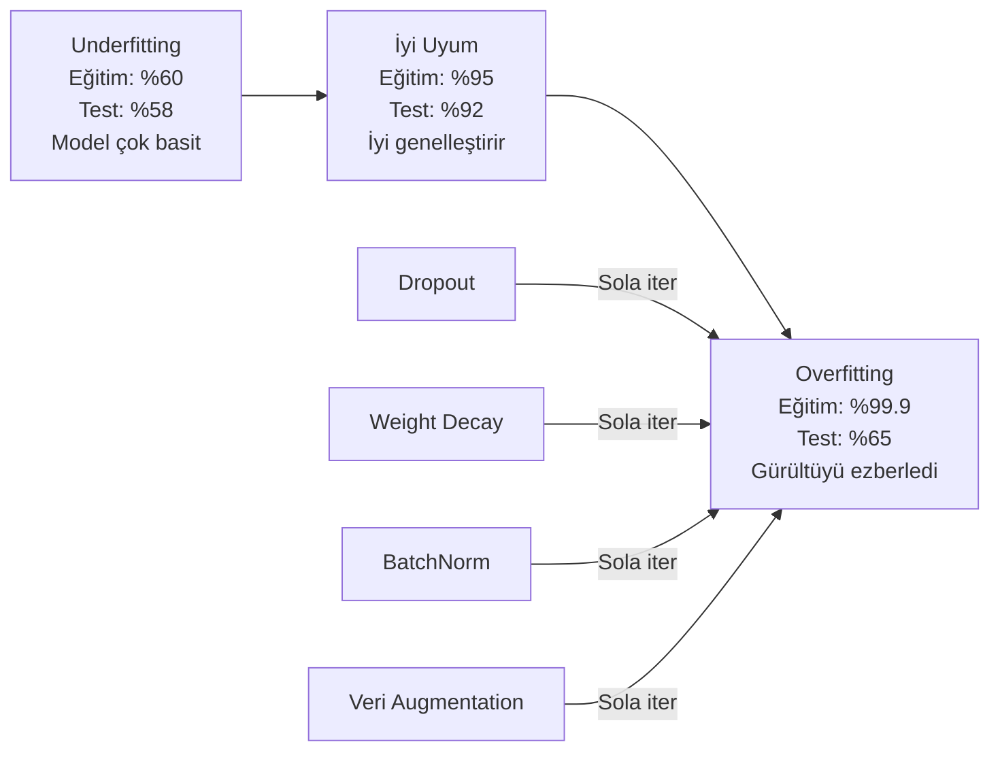
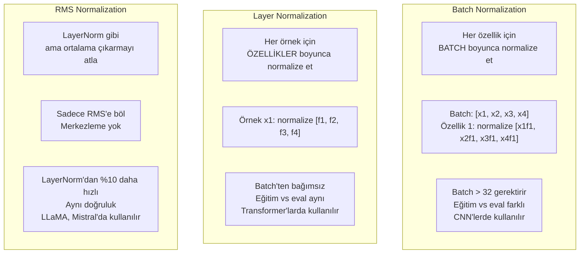
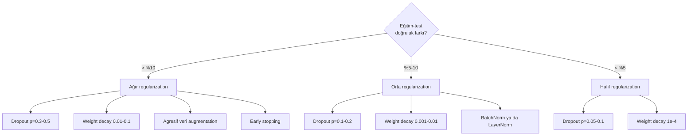

# Regularization

> Modelin eğitim verisinde %99, test verisinde %60 alıyor. Öğrenmek yerine ezberledi. Regularization, genelleştirmeyi zorlamak için karmaşıklığa uyguladığın vergidir.

**Tür:** Yapım
**Diller:** Python
**Ön koşullar:** Ders 03.06 (Optimizer'lar)
**Süre:** ~75 dakika

## Öğrenme Hedefleri

- Ters ölçekleme ile dropout, L2 weight decay, batch normalization, layer normalization ve RMSNorm'u sıfırdan uygula
- Regularization deneyleri kullanarak eğitim-test doğruluk farkını ölç ve overfitting'i teşhis et
- Transformer'ların neden BatchNorm yerine LayerNorm kullandığını ve modern LLM'lerin neden RMSNorm'u tercih ettiğini açıkla
- Overfitting'in şiddetine göre doğru regularization tekniği kombinasyonunu uygula

## Sorun

Yeterli parametreye sahip bir sinir ağı herhangi bir veri setini ezberleyebilir. Bu varsayımsal değil — Zhang ve diğerleri (2017) standart ağları ImageNet üzerinde rastgele etiketlerle eğiterek bunu kanıtladılar. Ağlar, tamamen rastgele etiket atamalarında sıfıra yakın eğitim loss'una ulaştı. Öğrenilecek bir kalıbı olmayan bir milyon rastgele giriş-çıkış çiftini ezberlediler. Eğitim loss'u kusursuzdu. Test doğruluğu sıfırdı.

Bu overfitting problemidir ve modeller büyüdükçe kötüleşir. GPT-3'ün 175 milyar parametresi vardır. Eğitim seti yaklaşık 500 milyar token'a sahiptir. O kadar çok parametreyle, modelin eğitim verisinin önemli parçalarını harfiyen ezberleyecek kapasitesi vardır. Regularization olmadan, genelleştirilebilir kalıplar öğrenmek yerine sadece eğitim örneklerini kusardı.

Eğitim performansı ile test performansı arasındaki fark overfitting boşluğudur. Bu derste her teknik o boşluğa farklı bir açıdan saldırır. Dropout ağı tek bir nörona güvenmemeye zorlar. Weight decay tek bir ağırlığın çok büyümesini önler. Batch normalization loss manzarasını pürüzsüzleştirir, böylece optimizer daha düz, daha genelleştirilebilir minimumlar bulur. Layer normalization aynı şeyi yapar ama batch normalization'ın başarısız olduğu yerlerde çalışır (küçük batch'ler, değişken uzunluklu diziler). RMSNorm bunu ortalama hesaplamasını atarak %10 daha hızlı yapar. Her teknik basittir. Birlikte, ezberleyen bir model ile genelleştiren bir model arasındaki farktır.

## Kavram

### Overfitting Spektrumu

Her model underfitting'den (kalıbı yakalamak için çok basit) overfitting'e (gürültüyü yakalayacak kadar karmaşık) uzanan bir spektrumda bir yere oturur. Tatlı nokta arasındadır ve regularization modelleri overfit tarafından oraya iter.



### Dropout

En zarif yoruma sahip en basit regularization tekniği. Eğitim sırasında p olasılığıyla her nöronun çıktısını rastgele sıfırla.

```
output = activation(z) * mask    mask[i] ~ Bernoulli(1 - p) olduğunda
```

p = 0.5 ile, her forward pass'te nöronların yarısı sıfırlanır. Ağ, hangi nöronların mevcut olacağını tahmin edemediğinden artıklı temsiller öğrenmek zorundadır. Bu eş-uyumlanmayı (co-adaptation) önler — nöronların belirli başka nöronların var olmasına güvenmeyi öğrenmesini.

Ensemble yorumu: N nöronlu ve dropout'lu bir ağ 2^N olası alt ağ yaratır (hangi nöronların açık ya da kapalı olduğunun her kombinasyonu). Dropout ile eğitim yaklaşık olarak tüm 2^N alt ağını aynı anda farklı mini-batch'lerde eğitir. Test zamanında tüm nöronları kullanırsın (dropout yok) ve eğitim sırasındaki beklenen değerle eşleşmek için çıktıları (1 - p) ile ölçekleyebilirsin. Bu 2^N alt ağının tahminlerinin ortalamasını almaya eşdeğerdir — tek bir modelden devasa bir ensemble.

Pratikte ölçekleme test yerine eğitim sırasında uygulanır (inverted dropout):

```
Eğitim sırasında:  output = activation(z) * mask / (1 - p)
Test sırasında:    output = activation(z)   (değişiklik gerekmez)
```

Bu daha temizdir çünkü test kodunun dropout'tan hiç haberdar olması gerekmez.

Varsayılan oranlar: transformer'lar için p = 0.1, MLP'ler için p = 0.5, CNN'ler için p = 0.2-0.3. Daha yüksek dropout = daha güçlü regularization = daha fazla underfitting riski.

### Weight Decay (L2 Regularization)

Tüm ağırlıkların karesel büyüklüğünü loss'a ekle:

```
total_loss = task_loss + (lambda / 2) * sum(w_i^2)
```

Regularization teriminin gradyanı lambda * w'dir. Bu, her adımda her ağırlığın büyüklüğüyle orantılı bir kesirle sıfıra doğru küçültüldüğü anlamına gelir. Büyük ağırlıklar daha çok cezalandırılır. Model, hiçbir tek ağırlığın baskın olmadığı çözümlere doğru itilir.

Bunun genelleştirmeye neden yardım ettiği: aşırı uyumlanmış modeller eğitim verisindeki gürültüyü güçlendiren büyük ağırlıklara sahip olma eğilimindedir. Weight decay ağırlıkları küçük tutar, bu da modelin efektif kapasitesini sınırlar ve ezberlenmiş tuhaflıklar yerine sağlam, genelleştirilebilir özelliklere güvenmeye zorlar.

Lambda hiperparametresi gücü kontrol eder. Tipik değerler:

- Transformer'larda AdamW için 0.01
- CNN'lerde SGD için 1e-4
- Ağır overfit olmuş modeller için 0.1

Ders 06'da tartışıldığı gibi: weight decay ve L2 regularization SGD'de eşdeğerdir ama Adam'da değildir. Adam ile eğitirken her zaman AdamW (ayrıştırılmış weight decay) kullan.

### Batch Normalization

Her katmanın çıktısını sonraki katmana iletmeden önce mini-batch boyunca normalize et.

Bir katmandaki bir mini-batch aktivasyon için:

```
mu = (1/B) * sum(x_i)           (batch ortalaması)
sigma^2 = (1/B) * sum((x_i - mu)^2)   (batch varyansı)
x_hat = (x_i - mu) / sqrt(sigma^2 + eps)   (normalize et)
y = gamma * x_hat + beta        (ölçekle ve kaydır)
```

Gamma ve beta öğrenilebilir parametrelerdir; eğer optimum ise ağın normalizasyonu geri almasına izin verir. Onlar olmasa her katmanın çıktısını sıfır ortalama birim varyans olmaya zorlardın ki bu ağın istediği şey olmayabilir.

**Eğitim vs çıkarım ayrımı:** Eğitim sırasında, mu ve sigma mevcut mini-batch'ten gelir. Çıkarım sırasında eğitim boyunca biriktirilen çalışan ortalamaları kullanırsın (momentum = 0.1 ile üstel hareketli ortalama, yani %90 eski + %10 yeni).

BatchNorm'un neden çalıştığı hâlâ tartışmalıdır. Orijinal makale "iç eş değişken kayması"nı (önceki katmanlar güncellendikçe katman girdilerinin dağılımının değişmesi) azalttığını iddia etti. Santurkar ve diğerleri (2018) bu açıklamanın yanlış olduğunu gösterdi. Asıl sebep: BatchNorm loss manzarasını daha pürüzsüz yapar. Gradyanlar daha öngörücüdür, Lipschitz sabitleri daha küçüktür ve optimizer güvenle daha büyük adımlar atabilir. BatchNorm'un daha yüksek learning rate'leri kullanmana ve daha hızlı yakınsamana izin vermesinin sebebi budur.

BatchNorm'un temel bir sınırlaması vardır: batch istatistiklerine bağlıdır. Batch boyutu 1 ile, ortalama ve varyans anlamsızdır. Küçük batch'lerle (< 32), istatistikler gürültülüdür ve performansa zarar verir. Bu nesne tespiti (bellek batch boyutunu sınırlar) ve dil modelleme (dizi uzunlukları değişir) gibi görevler için önemlidir.

### Layer Normalization

Batch boyunca yerine özellikler boyunca normalize et. Tek bir örnek için:

```
mu = (1/D) * sum(x_j)           (özellik ortalaması)
sigma^2 = (1/D) * sum((x_j - mu)^2)   (özellik varyansı)
x_hat = (x_j - mu) / sqrt(sigma^2 + eps)
y = gamma * x_hat + beta
```

D özellik boyutudur. Her örnek bağımsız olarak normalize edilir — batch boyutuna bağımlılık yok. Transformer'ların BatchNorm yerine LayerNorm kullanmasının sebebi budur. Diziler değişken uzunluklara sahiptir, batch boyutları genellikle küçüktür (ya da generasyon sırasında 1) ve hesaplama eğitim ve çıkarım arasında aynıdır.

Transformer'larda LayerNorm her self-attention bloğundan ve her feed-forward bloğundan sonra (Post-LN) ya da öncesinde (Pre-LN, eğitim için daha kararlı) uygulanır.

### RMSNorm

Ortalama çıkarması olmayan LayerNorm. Zhang & Sennrich (2019) tarafından önerildi.

```
rms = sqrt((1/D) * sum(x_j^2))
y = gamma * x / rms
```

Hepsi bu. Ortalama hesaplaması yok, beta parametresi yok. Gözlem: LayerNorm'daki yeniden merkezleme (ortalama çıkarma) modelin performansına çok az katkıda bulunur ama hesaplamaya mal olur. Onu kaldırmak yaklaşık %10 daha az yük ile aynı doğruluğu verir.

LLaMA, LLaMA 2, LLaMA 3, Mistral ve çoğu modern LLM LayerNorm yerine RMSNorm kullanır. Milyarlarca parametre ve trilyonlarca token ölçeğinde %10 tasarruf önemlidir.

### Normalizasyon Karşılaştırması



### Regularization Olarak Veri Augmentation

Bir model değişikliği değil veri değişikliği. Eğitim girdilerini etiketleri koruyarak dönüştür:

- Görüntüler: rastgele crop, çevir, döndür, renk titret, cutout
- Metin: eşanlamlı değişimi, geri çeviri, rastgele silme
- Ses: zaman uzatma, perde kaydırma, gürültü ekleme

Etki regularization ile aynıdır: eğitim setinin efektif boyutunu artırır, modelin belirli örnekleri ezberlemesini zorlaştırır. Orijinal formunda her görüntüyü yalnızca bir kez gören bir model onu ezberleyebilir. Her görüntünün 50 augmente edilmiş versiyonunu gören bir model değişmez yapıyı öğrenmek zorunda kalır.

### Early Stopping

En basit regularizer: validation loss artmaya başladığında eğitimi durdur. O noktada model henüz overfit olmamıştır. Pratikte her epoch'ta validation loss'u takip edersin, en iyi modeli kaydedersin ve "patience" penceresi boyunca (tipik olarak 5-20 epoch) eğitime devam edersin. Validation loss patience penceresi içinde iyileşmezse durur ve kaydedilmiş en iyi modeli yüklersin.

### Ne Zaman Ne Uygulamalı



## İnşa Et

### Adım 1: Dropout (Train ve Eval Modu)

```python
import random
import math


class Dropout:
    def __init__(self, p=0.5):
        self.p = p
        self.training = True
        self.mask = None

    def forward(self, x):
        if not self.training:
            return list(x)
        self.mask = []
        output = []
        for val in x:
            if random.random() < self.p:
                self.mask.append(0)
                output.append(0.0)
            else:
                self.mask.append(1)
                output.append(val / (1 - self.p))
        return output

    def backward(self, grad_output):
        grads = []
        for g, m in zip(grad_output, self.mask):
            if m == 0:
                grads.append(0.0)
            else:
                grads.append(g / (1 - self.p))
        return grads
```

### Adım 2: L2 Weight Decay

```python
def l2_regularization(weights, lambda_reg):
    penalty = 0.0
    for w in weights:
        penalty += w * w
    return lambda_reg * 0.5 * penalty

def l2_gradient(weights, lambda_reg):
    return [lambda_reg * w for w in weights]
```

### Adım 3: Batch Normalization

```python
class BatchNorm:
    def __init__(self, num_features, momentum=0.1, eps=1e-5):
        self.gamma = [1.0] * num_features
        self.beta = [0.0] * num_features
        self.eps = eps
        self.momentum = momentum
        self.running_mean = [0.0] * num_features
        self.running_var = [1.0] * num_features
        self.training = True
        self.num_features = num_features

    def forward(self, batch):
        batch_size = len(batch)
        if self.training:
            mean = [0.0] * self.num_features
            for sample in batch:
                for j in range(self.num_features):
                    mean[j] += sample[j]
            mean = [m / batch_size for m in mean]

            var = [0.0] * self.num_features
            for sample in batch:
                for j in range(self.num_features):
                    var[j] += (sample[j] - mean[j]) ** 2
            var = [v / batch_size for v in var]

            for j in range(self.num_features):
                self.running_mean[j] = (1 - self.momentum) * self.running_mean[j] + self.momentum * mean[j]
                self.running_var[j] = (1 - self.momentum) * self.running_var[j] + self.momentum * var[j]
        else:
            mean = list(self.running_mean)
            var = list(self.running_var)

        self.x_hat = []
        output = []
        for sample in batch:
            normalized = []
            out_sample = []
            for j in range(self.num_features):
                x_h = (sample[j] - mean[j]) / math.sqrt(var[j] + self.eps)
                normalized.append(x_h)
                out_sample.append(self.gamma[j] * x_h + self.beta[j])
            self.x_hat.append(normalized)
            output.append(out_sample)
        return output
```

### Adım 4: Layer Normalization

```python
class LayerNorm:
    def __init__(self, num_features, eps=1e-5):
        self.gamma = [1.0] * num_features
        self.beta = [0.0] * num_features
        self.eps = eps
        self.num_features = num_features

    def forward(self, x):
        mean = sum(x) / len(x)
        var = sum((xi - mean) ** 2 for xi in x) / len(x)

        self.x_hat = []
        output = []
        for j in range(self.num_features):
            x_h = (x[j] - mean) / math.sqrt(var + self.eps)
            self.x_hat.append(x_h)
            output.append(self.gamma[j] * x_h + self.beta[j])
        return output
```

### Adım 5: RMSNorm

```python
class RMSNorm:
    def __init__(self, num_features, eps=1e-6):
        self.gamma = [1.0] * num_features
        self.eps = eps
        self.num_features = num_features

    def forward(self, x):
        rms = math.sqrt(sum(xi * xi for xi in x) / len(x) + self.eps)
        output = []
        for j in range(self.num_features):
            output.append(self.gamma[j] * x[j] / rms)
        return output
```

### Adım 6: Regularization'lı ve Regularization'sız Eğitim

```python
def sigmoid(x):
    x = max(-500, min(500, x))
    return 1.0 / (1.0 + math.exp(-x))


def make_circle_data(n=200, seed=42):
    random.seed(seed)
    data = []
    for _ in range(n):
        x = random.uniform(-2, 2)
        y = random.uniform(-2, 2)
        label = 1.0 if x * x + y * y < 1.5 else 0.0
        data.append(([x, y], label))
    return data


class RegularizedNetwork:
    def __init__(self, hidden_size=16, lr=0.05, dropout_p=0.0, weight_decay=0.0):
        random.seed(0)
        self.hidden_size = hidden_size
        self.lr = lr
        self.dropout_p = dropout_p
        self.weight_decay = weight_decay
        self.dropout = Dropout(p=dropout_p) if dropout_p > 0 else None

        self.w1 = [[random.gauss(0, 0.5) for _ in range(2)] for _ in range(hidden_size)]
        self.b1 = [0.0] * hidden_size
        self.w2 = [random.gauss(0, 0.5) for _ in range(hidden_size)]
        self.b2 = 0.0

    def forward(self, x, training=True):
        self.x = x
        self.z1 = []
        self.h = []
        for i in range(self.hidden_size):
            z = self.w1[i][0] * x[0] + self.w1[i][1] * x[1] + self.b1[i]
            self.z1.append(z)
            self.h.append(max(0.0, z))

        if self.dropout and training:
            self.dropout.training = True
            self.h = self.dropout.forward(self.h)
        elif self.dropout:
            self.dropout.training = False
            self.h = self.dropout.forward(self.h)

        self.z2 = sum(self.w2[i] * self.h[i] for i in range(self.hidden_size)) + self.b2
        self.out = sigmoid(self.z2)
        return self.out

    def backward(self, target):
        eps = 1e-15
        p = max(eps, min(1 - eps, self.out))
        d_loss = -(target / p) + (1 - target) / (1 - p)
        d_sigmoid = self.out * (1 - self.out)
        d_out = d_loss * d_sigmoid

        for i in range(self.hidden_size):
            d_relu = 1.0 if self.z1[i] > 0 else 0.0
            d_h = d_out * self.w2[i] * d_relu
            self.w2[i] -= self.lr * (d_out * self.h[i] + self.weight_decay * self.w2[i])
            for j in range(2):
                self.w1[i][j] -= self.lr * (d_h * self.x[j] + self.weight_decay * self.w1[i][j])
            self.b1[i] -= self.lr * d_h
        self.b2 -= self.lr * d_out

    def evaluate(self, data):
        correct = 0
        total_loss = 0.0
        for x, y in data:
            pred = self.forward(x, training=False)
            eps = 1e-15
            p = max(eps, min(1 - eps, pred))
            total_loss += -(y * math.log(p) + (1 - y) * math.log(1 - p))
            if (pred >= 0.5) == (y >= 0.5):
                correct += 1
        return total_loss / len(data), correct / len(data) * 100

    def train_model(self, train_data, test_data, epochs=300):
        history = []
        for epoch in range(epochs):
            total_loss = 0.0
            correct = 0
            for x, y in train_data:
                pred = self.forward(x, training=True)
                self.backward(y)
                eps = 1e-15
                p = max(eps, min(1 - eps, pred))
                total_loss += -(y * math.log(p) + (1 - y) * math.log(1 - p))
                if (pred >= 0.5) == (y >= 0.5):
                    correct += 1
            train_loss = total_loss / len(train_data)
            train_acc = correct / len(train_data) * 100
            test_loss, test_acc = self.evaluate(test_data)
            history.append((train_loss, train_acc, test_loss, test_acc))
            if epoch % 75 == 0 or epoch == epochs - 1:
                gap = train_acc - test_acc
                print(f"    Epoch {epoch:3d}: train_acc=%{train_acc:.1f}, test_acc=%{test_acc:.1f}, fark=%{gap:.1f}")
        return history
```

## Kullan

PyTorch tüm normalizasyonu ve regularization'ı modül olarak sunar:

```python
import torch
import torch.nn as nn

model = nn.Sequential(
    nn.Linear(784, 256),
    nn.BatchNorm1d(256),
    nn.ReLU(),
    nn.Dropout(0.3),
    nn.Linear(256, 128),
    nn.BatchNorm1d(128),
    nn.ReLU(),
    nn.Dropout(0.3),
    nn.Linear(128, 10),
)

model.train()
out_train = model(torch.randn(32, 784))

model.eval()
out_test = model(torch.randn(1, 784))
```

`model.train()` / `model.eval()` geçişi kritiktir. Dropout'u açar/kapatır ve BatchNorm'a batch istatistikleri vs çalışan istatistikleri kullanmasını söyler. Çıkarımdan önce `model.eval()`'i unutmak deep learning'deki en yaygın bug'lardan biridir. Test doğruluğun rastgele dalgalanacak çünkü dropout hâlâ aktif ve BatchNorm mini-batch istatistiklerini kullanıyor.

Transformer'lar için düzen farklıdır:

```python
class TransformerBlock(nn.Module):
    def __init__(self, d_model=512, nhead=8, dropout=0.1):
        super().__init__()
        self.attention = nn.MultiheadAttention(d_model, nhead, dropout=dropout)
        self.norm1 = nn.LayerNorm(d_model)
        self.ff = nn.Sequential(
            nn.Linear(d_model, d_model * 4),
            nn.GELU(),
            nn.Linear(d_model * 4, d_model),
            nn.Dropout(dropout),
        )
        self.norm2 = nn.LayerNorm(d_model)
        self.dropout = nn.Dropout(dropout)

    def forward(self, x):
        attended, _ = self.attention(x, x, x)
        x = self.norm1(x + self.dropout(attended))
        x = self.norm2(x + self.ff(x))
        return x
```

BatchNorm değil LayerNorm. Dropout p=0.1, p=0.5 değil. Bunlar transformer varsayılanlarıdır.

## Yayınla

Bu ders şunu üretir:
- `outputs/prompt-regularization-advisor.md` — overfitting'i teşhis eden ve doğru regularization stratejisini öneren bir prompt

## Alıştırmalar

1. 2D veri için spatial dropout uygula: tek tek nöronları düşürmek yerine tüm özellik kanallarını düşür. Bunu, ardışık özellik gruplarını kanal olarak ele alıp tüm grupları düşürerek simüle et. hidden_size=32 ile çember veri setinde eğitim-test farkını standart dropout ile karşılaştır.

2. Ders 05'teki label smoothing'i bu derste dropout ile birleştirerek uygula. Dört konfigürasyonla eğit: hiçbiri, sadece dropout, sadece label smoothing, ikisi birden. Her biri için final eğitim-test doğruluk farkını ölç. Hangi kombinasyon en küçük farkı veriyor?

3. Çember veri seti ağında gizli katman ile aktivasyon arasına bir BatchNorm katmanı ekle. 0.01, 0.05 ve 0.1 learning rate'lerinde BatchNorm'lu ve BatchNorm'suz eğit. BatchNorm vanilla ağın ıraksadığı daha yüksek learning rate'lerde kararlı eğitime izin vermeli.

4. Early stopping uygula: her epoch'ta test loss'u takip et, en iyi ağırlıkları kaydet ve test loss 20 epoch boyunca iyileşmediyse dur. Regularize edilmiş ağı 1000 epoch çalıştır. En iyi test doğruluğuna hangi epoch'un sahip olduğunu ve kaç epoch'luk hesaplamadan tasarruf ettiğini raporla.

5. 4 katmanlı bir ağda (2 değil) LayerNorm vs RMSNorm'u karşılaştır. İkisini de aynı ağırlıklarla başlat. 200 epoch eğit ve final doğruluğu, eğitim hızını (epoch başına süre) ve ilk katmandaki gradyan büyüklüklerini karşılaştır. RMSNorm'un aynı doğrulukla daha hızlı olduğunu doğrula.

## Anahtar Terimler

| Terim | İnsanlar ne diyor | Gerçekte ne anlama geliyor |
|------|----------------|----------------------|
| Overfitting | "Model veriyi ezberledi" | Bir modelin eğitim performansı test performansını önemli ölçüde aştığında; sinyal yerine gürültüyü öğrendiğini gösterir |
| Regularization | "Overfitting'i önleme" | Genelleştirmeyi iyileştirmek için model karmaşıklığını kısıtlayan herhangi bir teknik: dropout, weight decay, normalizasyon, augmentation |
| Dropout | "Rastgele nöron silme" | Eğitim sırasında p olasılığıyla rastgele nöronları sıfırlamak, artıklı temsiller zorlamak; bir ensemble eğitmeye eşdeğer |
| Weight decay | "L2 cezası" | Her adımda lambda * w çıkararak tüm ağırlıkları sıfıra doğru küçültmek; karmaşıklığı ağırlık büyüklüğü üzerinden cezalandırır |
| Batch normalization | "Batch başına normalize et" | Eğitim sırasında batch istatistiklerini ve çıkarım sırasında çalışan ortalamaları kullanarak katman çıktılarını batch boyutu boyunca normalize etmek |
| Layer normalization | "Örnek başına normalize et" | Her örnek içinde özellikler boyunca normalize etmek; batch'ten bağımsız, batch boyutunun değiştiği transformer'larda kullanılır |
| RMSNorm | "Ortalamasız LayerNorm" | Kök ortalama kare normalizasyonu; LayerNorm'dan ortalama çıkarmayı atar, %10 hızlanma ile eşit doğruluk |
| Early stopping | "Overfit'ten önce dur" | Validation loss iyileşmediği zaman eğitimi durdurmak; en basit regularizer, genellikle diğerleriyle birlikte kullanılır |
| Veri augmentation | "Daha azdan daha çok veri" | Eğitim girdilerini dönüştürerek (çevirme, crop, gürültü) efektif veri seti boyutunu artırmak ve değişmezlik öğrenmeyi zorlamak |
| Genelleştirme farkı | "Eğitim-test farkı" | Eğitim ve test performansı arasındaki fark; regularization bu farkı minimize etmeyi hedefler |

## İleri Okuma

- Srivastava et al., "Dropout: A Simple Way to Prevent Neural Networks from Overfitting" (2014) — ensemble yorumu ve kapsamlı deneylerle orijinal dropout makalesi
- Ioffe & Szegedy, "Batch Normalization: Accelerating Deep Network Training by Reducing Internal Covariate Shift" (2015) — BatchNorm'u ve eğitim prosedürünü tanıttı, en çok atıf alan deep learning makalelerinden biri
- Zhang & Sennrich, "Root Mean Square Layer Normalization" (2019) — RMSNorm'un azaltılmış hesaplamayla LayerNorm doğruluğuna eşleştiğini gösterdi; LLaMA ve Mistral tarafından benimsendi
- Zhang et al., "Understanding Deep Learning Requires Rethinking Generalization" (2017) — sinir ağlarının rastgele etiketleri ezberleyebileceğini gösteren ve genelleştirmenin geleneksel görüşlerine meydan okuyan dönüm noktası makale
