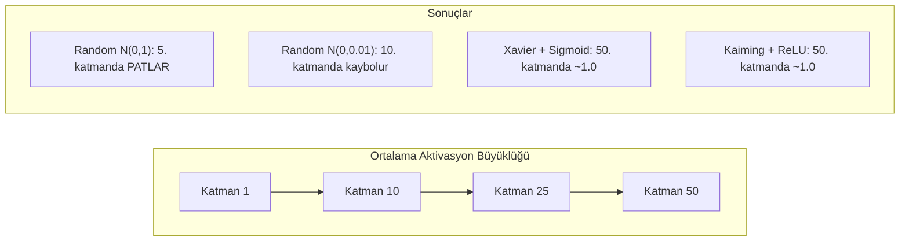
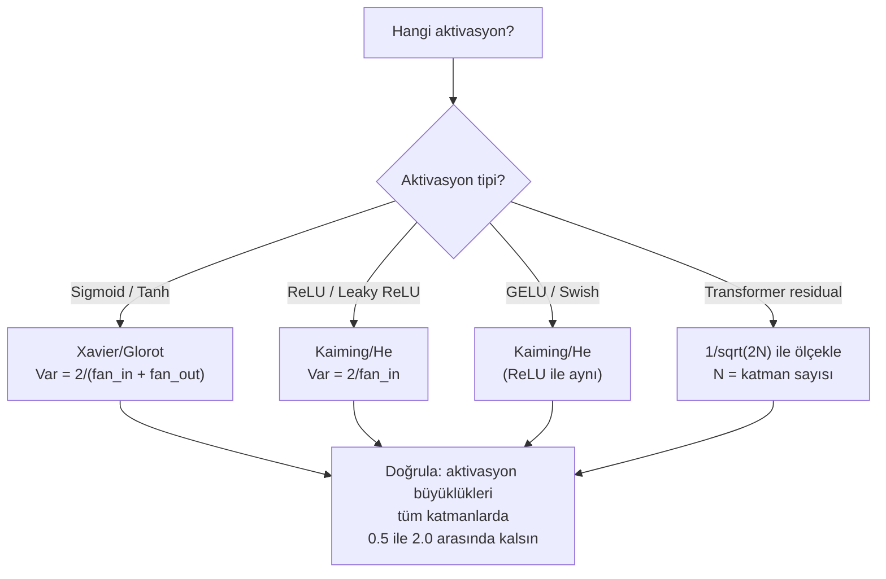

# Weight Initialization ve Eğitim Kararlılığı

> Yanlış başlat, eğitim hiç başlamaz. Doğru başlat, 50 katman 3 katman kadar pürüzsüz eğitilir.

**Tür:** Yapım
**Diller:** Python
**Ön koşullar:** Ders 03.04 (Aktivasyon Fonksiyonları), Ders 03.07 (Regularization)
**Süre:** ~90 dakika

## Öğrenme Hedefleri

- Zero, random, Xavier/Glorot ve Kaiming/He initialization stratejilerini uygula ve 50 katman boyunca aktivasyon büyüklükleri üzerindeki etkilerini ölç
- Xavier init'in neden Var(w) = 2/(fan_in + fan_out) ve Kaiming'in neden Var(w) = 2/fan_in kullandığını türet
- Sıfır initialization ile simetri problemini göster ve neden yalnızca rastgele ölçeğin yetersiz olduğunu açıkla
- Doğru initialization stratejisini aktivasyon fonksiyonuyla eşleştir: sigmoid/tanh için Xavier, ReLU/GELU için Kaiming

## Sorun

Tüm ağırlıkları sıfıra başlat. Hiçbir şey öğrenmez. Her nöron aynı fonksiyonu hesaplar, aynı gradyanı alır ve aynı şekilde güncellenir. 10,000 epoch sonra 512 nöronlu gizli katmanın hâlâ aynı nöronun 512 kopyasıdır. 512 parametre için ödedin ve 1 aldın.

Çok büyük başlat. Aktivasyonlar ağ boyunca patlar. 10. katmana gelindiğinde değerler 1e15'e ulaşır. 20. katmana gelindiğinde sonsuza taşar. Gradyanlar tersten aynı yörüngeyi izler.

Bir standart normal dağılımdan rastgele başlat. 3 katman için çalışır. 50 katmanda, rastgele ölçeğin biraz çok küçük ya da biraz çok büyük olmasına bağlı olarak sinyal sıfıra çöker ya da sonsuza patlar. "Çalışır" ile "bozuk" arasındaki sınır jilet kadar incedir.

Weight initialization deep learning'deki en küçümsenen karardır. Mimari makaleler alır. Optimizer'lar blog yazıları alır. Initialization bir dipnot alır. Ama yanlış al ve başka hiçbir şey önemli değildir — ağın eğitim başlamadan ölü.

## Kavram

### Simetri Problemi

Bir katmandaki her nöron aynı yapıya sahiptir: girişleri ağırlıklarla çarp, bias ekle, aktivasyon uygula. Tüm ağırlıklar aynı değerde başlarsa (sıfır uç durumdur), her nöron aynı çıktıyı hesaplar. Backpropagation sırasında her nöron aynı gradyanı alır. Güncelleme adımı sırasında her nöron aynı miktarda değişir.

Sıkıştın. Ağın yüzlerce parametresi var ama hepsi senkronize hareket ediyor. Buna simetri denir ve rastgele initialization onu kırmanın kaba kuvvet yoludur. Her nöron ağırlık uzayında farklı bir noktada başlar, böylece her biri farklı bir özellik öğrenir.

Ama "rastgele" yeterli değildir. Rastgeleliğin *ölçeği* ağın eğitilip eğitilmeyeceğini belirler.

### Katmanlar Boyunca Varyans Yayılımı

fan_in girdili tek bir katmanı düşün:

```
z = w1*x1 + w2*x2 + ... + w_n*x_n
```

Her ağırlık wi varyans Var(w) olan bir dağılımdan çekilirse ve her giriş xi varyans Var(x)'e sahipse, çıktı varyansı:

```
Var(z) = fan_in * Var(w) * Var(x)
```

Var(w) = 1 ve fan_in = 512 ise, çıktı varyansı giriş varyansının 512 katıdır. 10 katman sonra: 512^10 = 1.2e27. Sinyalin patladı.

Var(w) = 0.001 ise, çıktı varyansı katman başına 0.001 * 512 = 0.512 ile küçülür. 10 katman sonra: 0.512^10 = 0.00013. Sinyalin kayboldu.

Hedef: Var(z) = Var(x) olacak şekilde Var(w)'yi seç. Sinyal büyüklüğü katmanlar boyunca sabit kalır.

### Xavier/Glorot Initialization

Glorot ve Bengio (2010) sigmoid ve tanh aktivasyonları için çözümü türetti. Hem forward hem backward pass'te varyansı sabit tutmak için:

```
Var(w) = 2 / (fan_in + fan_out)
```

Pratikte ağırlıklar şuradan çekilir:

```
w ~ Uniform(-limit, limit)  burada limit = sqrt(6 / (fan_in + fan_out))
```

ya da:

```
w ~ Normal(0, sqrt(2 / (fan_in + fan_out)))
```

Bu çalışır çünkü sigmoid ve tanh sıfıra yakın kabaca doğrusaldır ve uygun şekilde başlatılmış aktivasyonlar burada yaşar. Varyans onlarca katman boyunca kararlı kalır.

### Kaiming/He Initialization

ReLU çıktıların yarısını öldürür (negatif olan her şey sıfır olur). Efektif fan_in yarıya iner çünkü ortalamada girdilerin yarısı sıfırlanmıştır. Xavier init bunu hesaba katmaz — gereken varyansı az tahmin eder.

He et al. (2015) formülü ayarladı:

```
Var(w) = 2 / fan_in
```

Ağırlıklar şuradan çekilir:

```
w ~ Normal(0, sqrt(2 / fan_in))
```

2 faktörü ReLU'nun aktivasyonların yarısını sıfırlamasını telafi eder. Onsuz, sinyal katman başına ~0.5x küçülür. 50 katmanla: 0.5^50 = 8.8e-16. Kaiming init bunu önler.

### Transformer Initialization

GPT-2 farklı bir desen tanıttı. Residual bağlantılar her alt katmanın çıktısını girdisine ekler:

```
x = x + sublayer(x)
```

Her toplama varyansı artırır. N residual katmanla, varyans N ile orantılı olarak büyür. GPT-2 residual katmanların ağırlıklarını 1/sqrt(2N) ile ölçekler, burada N katman sayısıdır. Bu birikmiş sinyal büyüklüğünü kararlı tutar.

Llama 3 (405B parametre, 126 katman) benzer bir şema kullanır. Bu ölçekleme olmadan, residual akış 126 attention ve feedforward bloğu boyunca sınırsız büyürdü.

```mermaid
flowchart TD
    subgraph "Zero Init"
        Z1["Katman 1<br/>Tüm ağırlıklar = 0"] --> Z2["Katman 2<br/>Tüm nöronlar özdeş"]
        Z2 --> Z3["Katman 3<br/>Hâlâ özdeş"]
        Z3 --> ZR["Sonuç: genişlikten bağımsız<br/>1 efektif nöron"]
    end

    subgraph "Xavier Init"
        X1["Katman 1<br/>Var = 2/(fan_in+fan_out)"] --> X2["Katman 2<br/>Sinyal kararlı"]
        X2 --> X3["Katman 50<br/>Sinyal kararlı"]
        X3 --> XR["Sonuç: sigmoid/tanh ile<br/>eğitilir"]
    end

    subgraph "Kaiming Init"
        K1["Katman 1<br/>Var = 2/fan_in"] --> K2["Katman 2<br/>Sinyal kararlı"]
        K2 --> K3["Katman 50<br/>Sinyal kararlı"]
        K3 --> KR["Sonuç: ReLU/GELU ile<br/>eğitilir"]
    end
```



### 50 Katman Boyunca Aktivasyon Büyüklüğü



### Doğru Init'i Seçme



## İnşa Et

### Adım 1: Initialization Stratejileri

Bir ağırlık matrisini başlatmanın dört yolu. Her biri fan_in sütunlu ve fan_out satırlı bir liste listesi (2D matris) döndürür.

```python
import math
import random


def zero_init(fan_in, fan_out):
    return [[0.0 for _ in range(fan_in)] for _ in range(fan_out)]


def random_init(fan_in, fan_out, scale=1.0):
    return [[random.gauss(0, scale) for _ in range(fan_in)] for _ in range(fan_out)]


def xavier_init(fan_in, fan_out):
    std = math.sqrt(2.0 / (fan_in + fan_out))
    return [[random.gauss(0, std) for _ in range(fan_in)] for _ in range(fan_out)]


def kaiming_init(fan_in, fan_out):
    std = math.sqrt(2.0 / fan_in)
    return [[random.gauss(0, std) for _ in range(fan_in)] for _ in range(fan_out)]
```

### Adım 2: Aktivasyon Fonksiyonları

Her init stratejisini amaçlanan aktivasyonuyla test etmek için sigmoid, tanh ve ReLU'ya ihtiyacımız var.

```python
def sigmoid(x):
    x = max(-500, min(500, x))
    return 1.0 / (1.0 + math.exp(-x))


def tanh_act(x):
    return math.tanh(x)


def relu(x):
    return max(0.0, x)
```

### Adım 3: 50 Katman Boyunca Forward Pass

Rastgele veriyi derin bir ağdan geçir ve her katmanda ortalama aktivasyon büyüklüğünü ölç.

```python
def forward_deep(init_fn, activation_fn, n_layers=50, width=64, n_samples=100):
    random.seed(42)
    layer_magnitudes = []

    inputs = [[random.gauss(0, 1) for _ in range(width)] for _ in range(n_samples)]

    for layer_idx in range(n_layers):
        weights = init_fn(width, width)
        biases = [0.0] * width

        new_inputs = []
        for sample in inputs:
            output = []
            for neuron_idx in range(width):
                z = sum(weights[neuron_idx][j] * sample[j] for j in range(width)) + biases[neuron_idx]
                output.append(activation_fn(z))
            new_inputs.append(output)
        inputs = new_inputs

        magnitudes = []
        for sample in inputs:
            magnitudes.append(sum(abs(v) for v in sample) / width)
        mean_mag = sum(magnitudes) / len(magnitudes)
        layer_magnitudes.append(mean_mag)

    return layer_magnitudes
```

### Adım 4: Deney

Tüm kombinasyonları çalıştır: zero init, random N(0,1), random N(0,0.01), sigmoid ile Xavier, tanh ile Xavier, ReLU ile Kaiming. Kilit katmanlarda büyüklüğü yazdır.

```python
def run_experiment():
    configs = [
        ("Zero init + Sigmoid", lambda fi, fo: zero_init(fi, fo), sigmoid),
        ("Random N(0,1) + ReLU", lambda fi, fo: random_init(fi, fo, 1.0), relu),
        ("Random N(0,0.01) + ReLU", lambda fi, fo: random_init(fi, fo, 0.01), relu),
        ("Xavier + Sigmoid", xavier_init, sigmoid),
        ("Xavier + Tanh", xavier_init, tanh_act),
        ("Kaiming + ReLU", kaiming_init, relu),
    ]

    print(f"{'Strateji':<30} {'L1':>10} {'L5':>10} {'L10':>10} {'L25':>10} {'L50':>10}")
    print("-" * 80)

    for name, init_fn, act_fn in configs:
        mags = forward_deep(init_fn, act_fn)
        row = f"{name:<30}"
        for idx in [0, 4, 9, 24, 49]:
            val = mags[idx]
            if val > 1e6:
                row += f" {'PATLADI':>10}"
            elif val < 1e-6:
                row += f" {'KAYBOLDU':>10}"
            else:
                row += f" {val:>10.4f}"
        print(row)
```

### Adım 5: Simetri Gösterimi

Zero init'in özdeş nöronlar ürettiğini göster.

```python
def symmetry_demo():
    random.seed(42)
    weights = zero_init(2, 4)
    biases = [0.0] * 4

    inputs = [0.5, -0.3]
    outputs = []
    for neuron_idx in range(4):
        z = sum(weights[neuron_idx][j] * inputs[j] for j in range(2)) + biases[neuron_idx]
        outputs.append(sigmoid(z))

    print("\nSimetri Gösterimi (4 nöron, zero init):")
    for i, out in enumerate(outputs):
        print(f"  Nöron {i}: çıktı = {out:.6f}")
    all_same = all(abs(outputs[i] - outputs[0]) < 1e-10 for i in range(len(outputs)))
    print(f"  Hepsi özdeş: {all_same}")
    print(f"  Efektif parametreler: 1 ({len(weights) * len(weights[0])} değil)")
```

### Adım 6: Katman Katman Büyüklük Raporu

50 katman boyunca aktivasyon büyüklüklerinin görsel bir çubuk grafiğini yazdır.

```python
def magnitude_report(name, magnitudes):
    print(f"\n{name}:")
    for i, mag in enumerate(magnitudes):
        if i % 5 == 0 or i == len(magnitudes) - 1:
            if mag > 1e6:
                bar = "X" * 50 + " PATLADI"
            elif mag < 1e-6:
                bar = "." + " KAYBOLDU"
            else:
                bar_len = min(50, max(1, int(mag * 10)))
                bar = "#" * bar_len
            print(f"  Katman {i+1:3d}: {bar} ({mag:.6f})")
```

## Kullan

PyTorch bunları yerleşik fonksiyonlar olarak sunar:

```python
import torch
import torch.nn as nn

layer = nn.Linear(512, 256)

nn.init.xavier_uniform_(layer.weight)
nn.init.xavier_normal_(layer.weight)

nn.init.kaiming_uniform_(layer.weight, nonlinearity='relu')
nn.init.kaiming_normal_(layer.weight, nonlinearity='relu')

nn.init.zeros_(layer.bias)
```

`nn.Linear(512, 256)` çağırdığında, PyTorch varsayılan olarak Kaiming uniform initialization'a düşer. Çoğu basit ağın "sadece çalışmasının" nedeni budur — PyTorch zaten doğru seçimi yaptı. Ama özel mimariler kurarken ya da 20 katmandan daha derine gittiğinde, neler olduğunu anlamalı ve potansiyel olarak varsayılanı geçersiz kılmalısın.

Transformer'lar için HuggingFace modelleri tipik olarak initialization'ı `_init_weights` metodunda halleder. GPT-2'nin uygulaması residual projeksiyonları 1/sqrt(N) ile ölçekler. Sıfırdan bir transformer kuruyorsan bunu kendin eklemelisin.

## Yayınla

Bu ders şunu üretir:
- `outputs/prompt-init-strategy.md` — weight initialization problemlerini teşhis eden ve doğru stratejiyi öneren bir prompt

## Alıştırmalar

1. LeCun initialization'ı (Var = 1/fan_in, SELU aktivasyonu için tasarlandı) ekle. LeCun init + tanh ile 50 katmanlı deneyi çalıştır ve Xavier + tanh ile karşılaştır.

2. GPT-2 residual ölçeklemesini uygula: residual akışa eklemeden önce her katmanın çıktısını 1/sqrt(2*N) ile çarp. Ölçekleme olan ve olmayan 50 katmanı çalıştır, residual büyüklüğün ne kadar hızlı büyüdüğünü ölç.

3. Bir ağın katman boyutlarını ve aktivasyon tipini alıp doğru initialization'ı öneren ve mevcut init sorunlara yol açacaksa uyaran bir "init sağlık kontrolü" fonksiyonu yarat.

4. Deneyi fan_in = 16 vs fan_in = 1024 ile çalıştır. Xavier ve Kaiming fan_in'e uyum sağlar ama random init sağlamaz. Daha büyük katmanlarla "çalışır" ile "kırılır" arasındaki farkın nasıl genişlediğini göster.

5. Orthogonal initialization'ı uygula (rastgele bir matris üret, SVD'sini hesapla, ortogonal matris U'yu kullan). 50 katmanlı ReLU ağlarında Kaiming ile karşılaştır.

## Anahtar Terimler

| Terim | İnsanlar ne diyor | Gerçekte ne anlama geliyor |
|------|----------------|----------------------|
| Weight initialization | "Başlangıç ağırlıklarını rastgele ayarla" | Bir ağın eğitilip eğitilemeyeceğini belirleyen başlangıç ağırlık değerlerini seçme stratejisi |
| Simetri kırma | "Nöronları farklı yap" | Nöronların özdeş fonksiyonlar hesaplamak yerine farklı özellikler öğrenmesini sağlamak için rastgele initialization kullanma |
| Fan-in | "Bir nörona gelen giriş sayısı" | Gelen bağlantı sayısı; ağırlıklı toplamda giriş varyansının nasıl biriktiğini belirler |
| Fan-out | "Bir nörondan çıkan çıktı sayısı" | Backpropagation sırasında gradyan varyansını korumakla ilgili olan giden bağlantı sayısı |
| Xavier/Glorot init | "Sigmoid initialization'ı" | Var(w) = 2/(fan_in + fan_out), sigmoid ve tanh aktivasyonları boyunca varyansı korumak için tasarlandı |
| Kaiming/He init | "ReLU initialization'ı" | Var(w) = 2/fan_in, ReLU'nun aktivasyonların yarısını sıfırlamasını hesaba katar |
| Varyans yayılımı | "Sinyallerin katmanlar boyunca nasıl büyüdüğü ya da küçüldüğü" | Aktivasyon varyansının ağırlık ölçeğine dayalı olarak katman katman nasıl değiştiğinin matematiksel analizi |
| Residual ölçekleme | "GPT-2'nin init numarası" | N transformer katmanı boyunca varyans büyümesini önlemek için residual bağlantı ağırlıklarını 1/sqrt(2N) ile ölçekleme |
| Ölü ağ | "Hiçbir şey eğitilmiyor" | Kötü initialization'ın tüm gradyanları sıfır ya da tüm aktivasyonları doygun yaptığı bir ağ |
| Patlayan aktivasyonlar | "Değerler sonsuza gider" | Ağırlık varyansı çok yüksek olduğunda, aktivasyon büyüklüklerinin katmanlar boyunca üstel olarak büyümesine neden olur |

## İleri Okuma

- Glorot & Bengio, "Understanding the difficulty of training deep feedforward neural networks" (2010) — varyans analiziyle orijinal Xavier initialization makalesi
- He et al., "Delving Deep into Rectifiers" (2015) — ReLU ağları için Kaiming initialization'ı tanıttı
- Radford et al., "Language Models are Unsupervised Multitask Learners" (2019) — residual ölçekleme initialization'ı ile GPT-2 makalesi
- Mishkin & Matas, "All You Need is a Good Init" (2016) — analitik formüllere ampirik bir alternatif olarak katman-sıralı birim-varyans initialization'ı
