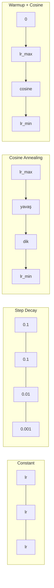
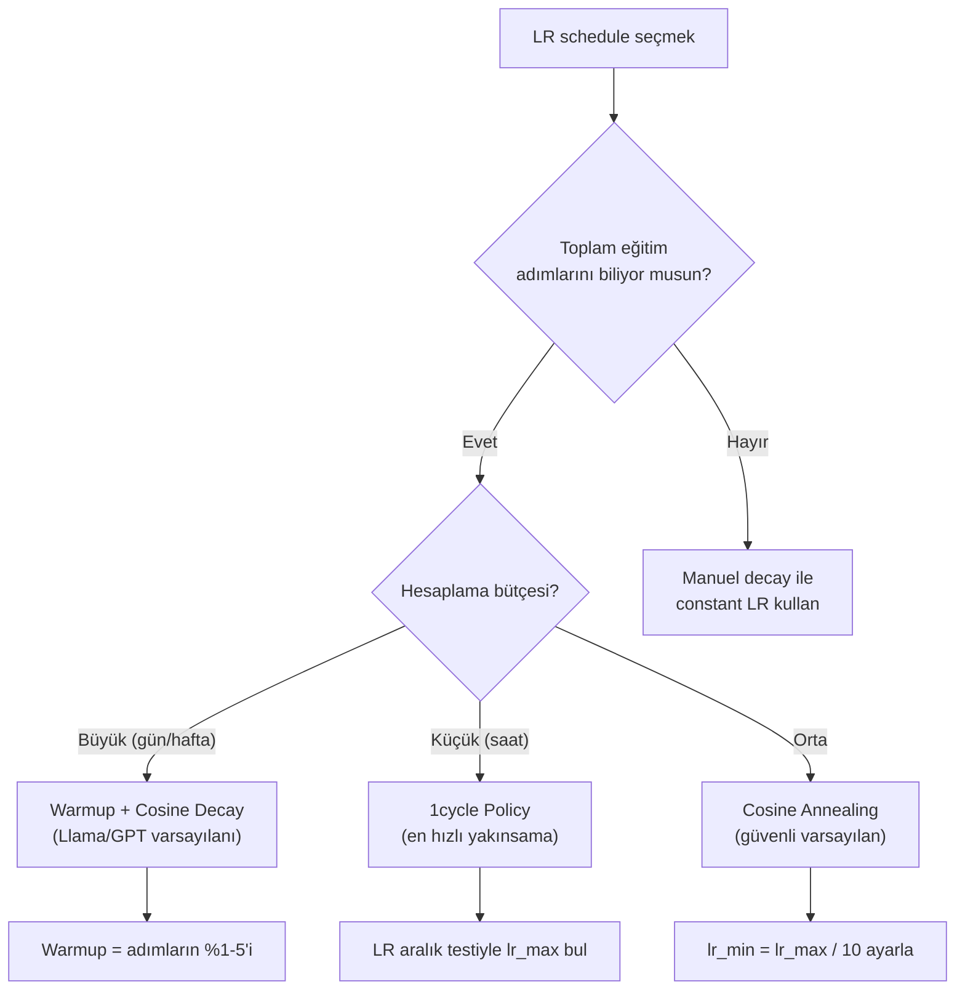
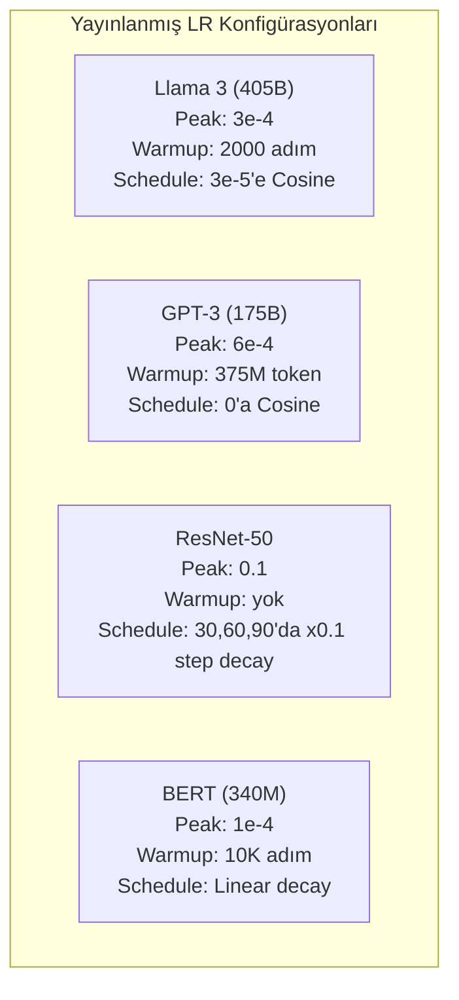

# Learning Rate Schedule'ları ve Warmup

> Learning rate en önemli tek hiperparametredir. Mimari değil. Veri seti boyutu değil. Aktivasyon fonksiyonu değil. Learning rate. Başka bir şey ayarlamayacaksan bunu ayarla.

**Tür:** Yapım
**Diller:** Python
**Ön koşullar:** Ders 03.06 (Optimizer'lar), Ders 03.08 (Weight Initialization)
**Süre:** ~90 dakika

## Öğrenme Hedefleri

- constant, step decay, cosine annealing, warmup + cosine ve 1cycle learning rate schedule'larını sıfırdan uygula
- Learning rate seçiminin üç başarısızlık modunu göster: ıraksama (çok yüksek), durma (çok düşük) ve salınım (decay yok)
- Adam tabanlı optimizer'lar için warmup'un neden gerekli olduğunu ve erken eğitimi nasıl kararlı hale getirdiğini açıkla
- Aynı görevde beş schedule'ın yakınsama hızını karşılaştır ve belirli bir eğitim bütçesi için uygun olanı seç

## Sorun

Learning rate'i 0.1'e ayarla. Eğitim ıraksar — loss 3 adımda sonsuza zıplar. 0.0001'e ayarla. Eğitim sürünür — 100 epoch sonra model rastgeleden zar zor hareket etmiştir. 0.01'e ayarla. Eğitim 50 epoch çalışır, sonra loss adımlar çok büyük olduğu için asla ulaşamayacağı bir minimumun etrafında salınır.

Optimal learning rate sabit değildir. Eğitim sırasında değişir. Erken aşamada hızlı zemin kazanmak için büyük adımlar istersin. Eğitimin sonlarında keskin bir minimuma yerleşmek için minik adımlar istersin. %90 doğru bir model ile %95 doğru bir model arasındaki fark genellikle sadece schedule'dur.

Son üç yılda yayınlanan her büyük model bir learning rate schedule kullanır. Llama 3 2000 warmup adımı ve 3e-5'e cosine decay ile peak lr=3e-4 kullandı. GPT-3 375 milyon token boyunca warmup ile lr=6e-4 kullandı. Bunlar keyfi seçimler değildir. Milyonlarca dolara mal olan kapsamlı hiperparametre taramalarının sonucudur.

Schedule'ları anlaman gerekiyor çünkü varsayılanlar senin problemin için çalışmayacak. Önceden eğitilmiş bir modeli fine-tune ettiğinde, doğru schedule sıfırdan eğitimden farklıdır. Batch boyutunu artırdığında, warmup periyodunun değişmesi gerekir. Adım 10,000'de eğitim bozulduğunda, bunun bir schedule problemi mi yoksa başka bir şey mi olduğunu bilmen gerekir.

## Kavram

### Constant Learning Rate

En basit yaklaşım. Bir sayı seç, her adım için onu kullan.

```
lr(t) = lr_0
```

Nadiren optimal. Ya eğitimin sonu için çok yüksektir (minimum etrafında salınım) ya da başlangıç için çok düşüktür (küçük adımlarda boşa harcanan hesaplama). Küçük modeller ve hata ayıklama için iyi çalışır. Bir saatten uzun süre eğitilen herhangi bir şey için berbat bir seçim.

### Step Decay

ResNet döneminin eski yaklaşımı. Sabit epoch'larda learning rate'i bir faktörle (genellikle 10x) kes.

```
lr(t) = lr_0 * gamma^(floor(epoch / step_size))
```

Burada gamma = 0.1 ve step_size = 30 demek ki: lr her 30 epoch'ta 10x düşer. ResNet-50 bunu kullandı — lr=0.1, 30, 60 ve 90. epoch'larda 10x düş.

Problem: optimal decay noktaları veri setine ve mimariye bağlıdır. Farklı bir probleme geç ve ne zaman düşeceğini yeniden ayarlaman gerekir. Geçişler ani — oran aniden değiştiğinde loss sivrilebilir.

### Cosine Annealing

Maksimum learning rate'ten minimuma, bir cosine eğrisini takip ederek pürüzsüz decay:

```
lr(t) = lr_min + 0.5 * (lr_max - lr_min) * (1 + cos(pi * t / T))
```

Burada t mevcut adım ve T toplam adım sayısıdır.

t=0'da cosine terimi 1'dir, yani lr = lr_max. t=T'de cosine terimi -1'dir, yani lr = lr_min. Decay başta yumuşaktır, ortada hızlanır ve sonuna doğru tekrar yumuşar.

Bu çoğu modern eğitim çalışması için varsayılandır. lr_max ve lr_min dışında ayarlanacak hiperparametre yok. Cosine şekli, çoğu öğrenmenin eğitimin ortasında olduğuna dair ampirik gözlemle eşleşir — o kritik dönemde makul adım boyutları istersin.

### Warmup: Neden Küçük Başlıyorsun

Adam ve diğer uyarlamalı optimizer'lar gradyan ortalaması ve varyansının çalışan tahminlerini tutar. Adım 0'da, bu tahminler sıfıra başlatılır. İlk birkaç gradyan güncellemesi çöp istatistiklere dayanır. Bu dönemde learning rate'in büyükse, model devasa, kötü yönlendirilmiş adımlar atar.

Warmup bunu düzeltir. Minik bir learning rate ile başla (genellikle lr_max / warmup_steps ya da hatta sıfır) ve ilk N adım boyunca lr_max'a doğrusal olarak rampla. Tam learning rate'e ulaştığında Adam'ın istatistikleri kararlı hale gelmiştir.

```
lr(t) = lr_max * (t / warmup_steps)     t < warmup_steps için
```

Tipik warmup: toplam eğitim adımlarının %1-5'i. Llama 3 ~1.8 trilyon token için eğitildi ve 2000 adım için ısındı. GPT-3 375 milyon token boyunca ısındı.

### Linear Warmup + Cosine Decay

Modern varsayılan. Doğrusal olarak ramp at, sonra cosine ile decay et:

```
if t < warmup_steps:
    lr(t) = lr_max * (t / warmup_steps)
else:
    progress = (t - warmup_steps) / (total_steps - warmup_steps)
    lr(t) = lr_min + 0.5 * (lr_max - lr_min) * (1 + cos(pi * progress))
```

Llama, GPT, PaLM ve çoğu modern transformer bunu kullanır. Warmup erken kararsızlığı önler. Cosine decay modeli iyi bir minimuma yerleştirir.

### 1cycle Policy

Leslie Smith'in keşfi (2018): eğitimin ilk yarısında learning rate'i düşük bir değerden yüksek bir değere rampla, sonra ikinci yarıda geri rampla. Karşı sezgisel — neden learning rate'i ortada *artırasın*?

Teori: yüksek bir learning rate optimizasyon yörüngesine gürültü ekleyerek regularization gibi davranır. Model rampa-yukarı fazında loss manzarasının daha fazlasını keşfeder ve daha iyi havzalar bulur. Rampa-aşağı fazı sonra bulunan en iyi havza içinde rafine eder.

```
Faz 1 (0'dan T/2'ye):    lr lr_max/25'ten lr_max'a ramplar
Faz 2 (T/2'den T'ye):    lr lr_max'tan lr_max/10000'e ramplar
```

1cycle sabit bir hesaplama bütçesi için genellikle cosine annealing'den daha hızlı eğitir. Takas: toplam adım sayısını önceden bilmelisin.

### Schedule Şekilleri



### Karar Akış Şeması



### Yayınlanmış Modellerden Gerçek Sayılar



## İnşa Et

### Adım 1: Schedule Fonksiyonları

Her fonksiyon mevcut adımı alır ve o adımdaki learning rate'i döndürür.

```python
import math


def constant_schedule(step, lr=0.01, **kwargs):
    return lr


def step_decay_schedule(step, lr=0.1, step_size=100, gamma=0.1, **kwargs):
    return lr * (gamma ** (step // step_size))


def cosine_schedule(step, lr=0.01, total_steps=1000, lr_min=1e-5, **kwargs):
    if step >= total_steps:
        return lr_min
    return lr_min + 0.5 * (lr - lr_min) * (1 + math.cos(math.pi * step / total_steps))


def warmup_cosine_schedule(step, lr=0.01, total_steps=1000, warmup_steps=100, lr_min=1e-5, **kwargs):
    if total_steps <= warmup_steps:
        return lr * (step / max(warmup_steps, 1))
    if step < warmup_steps:
        return lr * step / warmup_steps
    progress = (step - warmup_steps) / (total_steps - warmup_steps)
    return lr_min + 0.5 * (lr - lr_min) * (1 + math.cos(math.pi * progress))


def one_cycle_schedule(step, lr=0.01, total_steps=1000, **kwargs):
    mid = max(total_steps // 2, 1)
    if step < mid:
        return (lr / 25) + (lr - lr / 25) * step / mid
    else:
        progress = (step - mid) / max(total_steps - mid, 1)
        return lr * (1 - progress) + (lr / 10000) * progress
```

### Adım 2: Tüm Schedule'ları Görselleştir

Her schedule'ın eğitim boyunca nasıl evrildiğini gösteren metin tabanlı bir grafik yazdır.

```python
def visualize_schedule(name, schedule_fn, total_steps=500, **kwargs):
    steps = list(range(0, total_steps, total_steps // 20))
    if total_steps - 1 not in steps:
        steps.append(total_steps - 1)

    lrs = [schedule_fn(s, total_steps=total_steps, **kwargs) for s in steps]
    max_lr = max(lrs) if max(lrs) > 0 else 1.0

    print(f"\n{name}:")
    for s, lr_val in zip(steps, lrs):
        bar_len = int(lr_val / max_lr * 40)
        bar = "#" * bar_len
        print(f"  Adım {s:4d}: lr={lr_val:.6f} {bar}")
```

### Adım 3: Eğitim Ağı

Önceki derslerle aynı çember veri setinde basit iki katmanlı bir ağ, ama şimdi schedule'ı değiştiriyoruz.

```python
import random


def sigmoid(x):
    x = max(-500, min(500, x))
    return 1.0 / (1.0 + math.exp(-x))


def relu(x):
    return max(0.0, x)


def relu_deriv(x):
    return 1.0 if x > 0 else 0.0


def make_circle_data(n=200, seed=42):
    random.seed(seed)
    data = []
    for _ in range(n):
        x = random.uniform(-2, 2)
        y = random.uniform(-2, 2)
        label = 1.0 if x * x + y * y < 1.5 else 0.0
        data.append(([x, y], label))
    return data


def train_with_schedule(schedule_fn, schedule_name, data, epochs=300, base_lr=0.05, **kwargs):
    random.seed(0)
    hidden_size = 8
    total_steps = epochs * len(data)

    std = math.sqrt(2.0 / 2)
    w1 = [[random.gauss(0, std) for _ in range(2)] for _ in range(hidden_size)]
    b1 = [0.0] * hidden_size
    w2 = [random.gauss(0, std) for _ in range(hidden_size)]
    b2 = 0.0

    step = 0
    epoch_losses = []

    for epoch in range(epochs):
        total_loss = 0
        correct = 0

        for x, target in data:
            lr = schedule_fn(step, lr=base_lr, total_steps=total_steps, **kwargs)

            z1 = []
            h = []
            for i in range(hidden_size):
                z = w1[i][0] * x[0] + w1[i][1] * x[1] + b1[i]
                z1.append(z)
                h.append(relu(z))

            z2 = sum(w2[i] * h[i] for i in range(hidden_size)) + b2
            out = sigmoid(z2)

            error = out - target
            d_out = error * out * (1 - out)

            for i in range(hidden_size):
                d_h = d_out * w2[i] * relu_deriv(z1[i])
                w2[i] -= lr * d_out * h[i]
                for j in range(2):
                    w1[i][j] -= lr * d_h * x[j]
                b1[i] -= lr * d_h
            b2 -= lr * d_out

            total_loss += (out - target) ** 2
            if (out >= 0.5) == (target >= 0.5):
                correct += 1
            step += 1

        avg_loss = total_loss / len(data)
        accuracy = correct / len(data) * 100
        epoch_losses.append(avg_loss)

    return epoch_losses
```

### Adım 4: Tüm Schedule'ları Karşılaştır

Aynı ağı her schedule ile eğit ve final loss ile yakınsama davranışını karşılaştır.

```python
def compare_schedules(data):
    configs = [
        ("Constant", constant_schedule, {}),
        ("Step Decay", step_decay_schedule, {"step_size": 15000, "gamma": 0.1}),
        ("Cosine", cosine_schedule, {"lr_min": 1e-5}),
        ("Warmup+Cosine", warmup_cosine_schedule, {"warmup_steps": 3000, "lr_min": 1e-5}),
        ("1cycle", one_cycle_schedule, {}),
    ]

    print(f"\n{'Schedule':<20} {'Başl. Loss':>12} {'Orta Loss':>12} {'Son Loss':>12} {'En İyi Loss':>12}")
    print("-" * 70)

    for name, schedule_fn, extra_kwargs in configs:
        losses = train_with_schedule(schedule_fn, name, data, epochs=300, base_lr=0.05, **extra_kwargs)
        mid_idx = len(losses) // 2
        best = min(losses)
        print(f"{name:<20} {losses[0]:>12.6f} {losses[mid_idx]:>12.6f} {losses[-1]:>12.6f} {best:>12.6f}")
```

### Adım 5: LR Çok Yüksek vs Çok Düşük

Üç başarısızlık modunu göster: çok yüksek (ıraksama), çok düşük (sürünme) ve tam doğru.

```python
def lr_sensitivity(data):
    learning_rates = [1.0, 0.1, 0.01, 0.001, 0.0001]

    print("\nLR Duyarlılığı (constant schedule, 100 epoch):")
    print(f"  {'LR':>10} {'Başl. Loss':>12} {'Son Loss':>12} {'Durum':>15}")
    print("  " + "-" * 52)

    for lr in learning_rates:
        losses = train_with_schedule(constant_schedule, f"lr={lr}", data, epochs=100, base_lr=lr)
        start = losses[0]
        end = losses[-1]

        if end > start or math.isnan(end) or end > 1.0:
            status = "IRAKSADI"
        elif end > start * 0.9:
            status = "ZAR ZOR HAREKET"
        elif end < 0.15:
            status = "YAKINSADI"
        else:
            status = "ÖĞRENİYOR"

        end_str = f"{end:.6f}" if not math.isnan(end) else "NaN"
        print(f"  {lr:>10.4f} {start:>12.6f} {end_str:>12} {status:>15}")
```

## Kullan

PyTorch scheduler'ları `torch.optim.lr_scheduler`'da sunar:

```python
import torch
import torch.optim as optim
from torch.optim.lr_scheduler import CosineAnnealingLR, OneCycleLR, StepLR

model = nn.Sequential(nn.Linear(10, 64), nn.ReLU(), nn.Linear(64, 1))
optimizer = optim.Adam(model.parameters(), lr=3e-4)

scheduler = CosineAnnealingLR(optimizer, T_max=1000, eta_min=1e-5)

for step in range(1000):
    loss = train_step(model, optimizer)
    scheduler.step()
```

Warmup + cosine için bir lambda scheduler ya da HuggingFace'ten `get_cosine_schedule_with_warmup` kullan:

```python
from transformers import get_cosine_schedule_with_warmup

scheduler = get_cosine_schedule_with_warmup(
    optimizer,
    num_warmup_steps=2000,
    num_training_steps=100000,
)
```

HuggingFace fonksiyonu çoğu Llama ve GPT fine-tuning script'inin kullandığı şeydir. Şüphedeysen, warmup = toplam adımların %3-5'i ile warmup + cosine kullan. Hemen hemen her şey için çalışır.

## Yayınla

Bu ders şunu üretir:
- `outputs/prompt-lr-schedule-advisor.md` — eğitim kurulumun için doğru learning rate schedule'ını ve hiperparametreleri öneren bir prompt

## Alıştırmalar

1. Üstel decay'i uygula: lr(t) = lr_0 * gamma^t burada gamma = 0.999. Çember veri setinde cosine annealing ile karşılaştır.

2. Learning rate aralık testini uygula (Leslie Smith): LR'yi 1e-7'den 1'e üstel olarak artırırken birkaç yüz adım eğit. Loss vs LR'yi çiz. Optimal maks LR loss artmaya başlamadan hemen önceki yerdir.

3. Warmup + cosine ile eğit ama warmup uzunluğunu değiştir: toplam adımların %0, %1, %5, %10, %20'si. Eğitimin en kararlı olduğu tatlı noktayı bul.

4. Warm restart'larla cosine annealing'i (SGDR) uygula: her T adımda learning rate'i lr_max'a sıfırla ve tekrar decay et. Daha uzun bir eğitim çalışmasında standart cosine ile karşılaştır.

5. Eğitim loss'unu izleyen, loss kararlı hale geldiğinde otomatik olarak warmup'tan cosine'e geçen ve loss çok uzun süre durakladığında lr'yi azaltan bir "schedule cerrahı" kur.

## Anahtar Terimler

| Terim | İnsanlar ne diyor | Gerçekte ne anlama geliyor |
|------|----------------|----------------------|
| Learning rate | "Modelin ne kadar hızlı öğrendiği" | Parametre güncelleme boyutunu belirlemek için gradyanı çarpan skaler |
| Schedule | "LR'yi zamanla değiştirme" | Eğitim adımını learning rate'e eşleyen, yakınsamayı optimize etmek için tasarlanmış bir fonksiyon |
| Warmup | "Küçük bir LR ile başla" | Optimizer istatistiklerini kararlı hale getirmek için ilk N adım boyunca LR'yi sıfıra yakın bir değerden hedef değere doğrusal olarak ramp |
| Cosine annealing | "Pürüzsüz LR decay" | Eğitim boyunca cosine eğrisi takip ederek LR'yi lr_max'tan lr_min'e azaltma |
| Step decay | "Kilometre taşlarında LR düşür" | Sabit epoch aralıklarında LR'yi bir faktörle (genellikle 0.1) çarpma |
| 1cycle policy | "Yukarı sonra aşağı" | Daha hızlı yakınsama için LR'yi tek bir döngüde yukarı sonra aşağı ramplayan Leslie Smith yöntemi |
| LR aralık testi | "En iyi learning rate'i bul" | Loss'un ıraksamaya başladığı değeri bulmak için LR'yi artırırken kısa süre eğitmek |
| Warm restart'larla cosine | "Sıfırla ve tekrarla" | LR'yi periyodik olarak lr_max'a sıfırlama ve tekrar decay etme (SGDR) |
| Eta min | "LR için zemin" | Schedule'ın decay ettiği minimum learning rate |
| Peak learning rate | "Maksimum LR" | Eğitim sırasında ulaşılan en yüksek LR, tipik olarak warmup'tan sonra |

## İleri Okuma

- Loshchilov & Hutter, "SGDR: Stochastic Gradient Descent with Warm Restarts" (2017) — cosine annealing ve warm restart'ları tanıttı
- Smith, "Super-Convergence: Very Fast Training of Neural Networks Using Large Learning Rates" (2018) — 1cycle policy makalesi
- Touvron et al., "Llama 2: Open Foundation and Fine-Tuned Chat Models" (2023) — ölçekte kullanılan warmup + cosine schedule'ı belgeler
- Goyal et al., "Accurate, Large Minibatch SGD: Training ImageNet in 1 Hour" (2017) — büyük batch eğitim için doğrusal ölçekleme kuralı ve warmup
