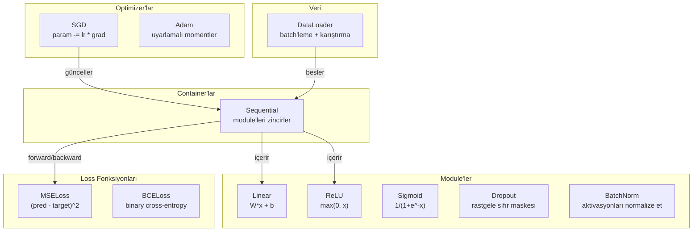
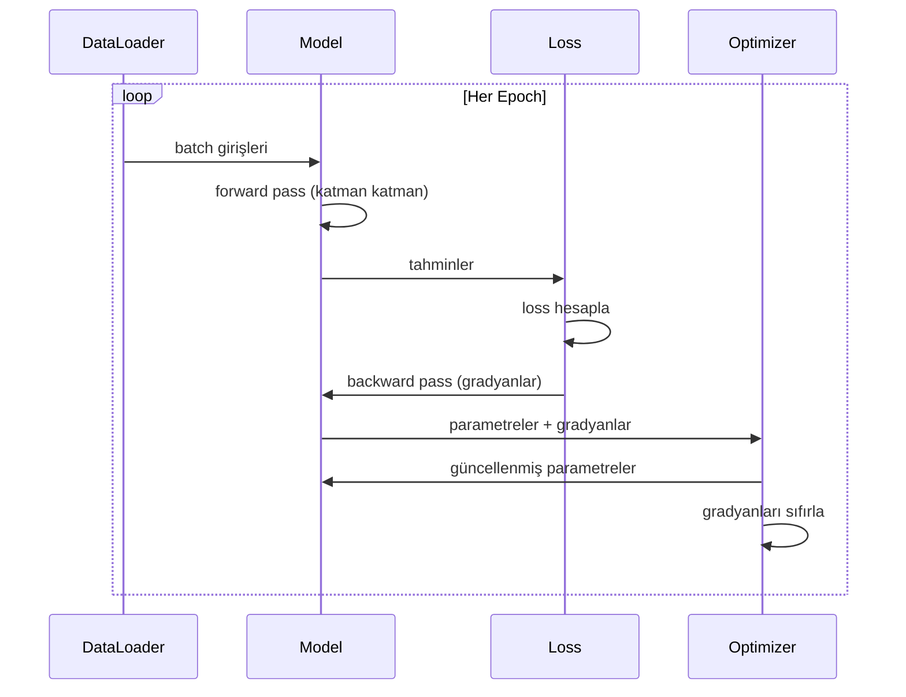
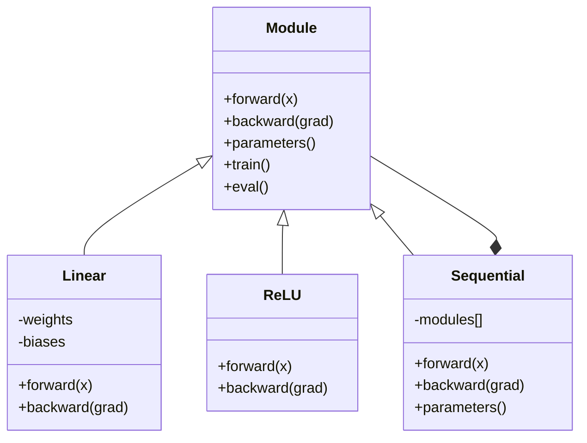

# Kendi Mini Framework'ünü Kur

> Nöronlar, katmanlar, ağlar, backprop, aktivasyonlar, loss fonksiyonları, optimizer'lar, regularization, initialization ve LR schedule'ları inşa ettin. Hepsi ayrı parçalar olarak. Şimdi onları bir framework'te bir araya bağla. PyTorch değil. TensorFlow değil. Seninki.

**Tür:** Yapım
**Diller:** Python
**Ön koşullar:** Faz 03'ün tamamı (Dersler 01-09)
**Süre:** ~120 dakika

## Öğrenme Hedefleri

- Module, Linear, ReLU, Sigmoid, Dropout, BatchNorm, Sequential, loss fonksiyonları, optimizer'lar ve DataLoader ile eksiksiz bir deep learning framework'ü (~500 satır) kur
- Module soyutlamasını (forward, backward, parameters) ve train/eval modu geçişinin neden gerekli olduğunu açıkla
- Tüm bileşenleri 4 katmanlı bir ağı çember sınıflandırma üzerinde eğiten çalışan bir eğitim döngüsüne bağla
- Framework'ünün her bileşenini PyTorch eşdeğerine eşle (nn.Module, nn.Sequential, optim.Adam, DataLoader)

## Sorun

Ayrı dosyalara dağılmış on derslik yapı bloğun var. Burada bir `Value` sınıfı, orada bir eğitim döngüsü, başka bir dosyada weight initialization, daha başka bir dosyada learning rate schedule'ları. Bir ağı eğitmek için beş farklı dersten kopyalayıp yapıştırıyor ve onları elle bağlıyorsun.

Framework'lerin çözdüğü budur. PyTorch sana `nn.Module`, `nn.Sequential`, `optim.Adam`, `DataLoader` ve onları bir araya bağlayan bir eğitim döngüsü deseni verir. TensorFlow sana `keras.Layer`, `keras.Sequential`, `keras.optimizers.Adam` verir. Bunlar büyü değildir. Ağları tanımlamayı, eğitmeyi ve değerlendirmeyi her seferinde sıhhi tesisatı yeniden icat etmeden mümkün kılan organizasyonel desenlerdir.

Aynı şeyi ~500 satır Python ile inşa edeceksin. numpy yok. Dış bağımlılık yok. Herhangi bir feedforward ağı tanımlayabilen, onu SGD ya da Adam ile eğitebilen, veriyi batch'leyebilen, dropout ve batch normalization uygulayabilen, herhangi bir aktivasyonu kullanabilen ve learning rate'i schedule edebilen bir framework.

Bitirdiğinde, PyTorch'ta `model = nn.Sequential(...)` yazdığında tam olarak ne olduğunu anlayacaksın. `model.train()` ve `model.eval()`'in neden var olduğunu anlayacaksın. `optimizer.zero_grad()`'in neden ayrı bir çağrı olduğunu anlayacaksın. Hepsini anlayacaksın çünkü hepsini sen inşa ettin.

## Kavram

### Module Soyutlaması

PyTorch'taki her katman `nn.Module`'dan miras alır. Bir Module'un üç sorumluluğu vardır:

1. **forward()** — girişlere göre çıktıyı hesapla
2. **parameters()** — tüm eğitilebilir ağırlıkları döndür
3. **backward()** — gradyanları hesapla (PyTorch'ta autograd tarafından, bizimkinde açıkça halledilir)

Bir Linear katman bir Module'dur. Bir ReLU aktivasyonu bir Module'dur. Bir dropout katmanı bir Module'dur. Bir batch normalization katmanı bir Module'dur. Hepsi aynı arayüze sahiptir.

### Sequential Container

`nn.Sequential` Module'leri zincirler. Forward pass: veriyi Module 1, sonra Module 2, sonra Module 3 boyunca besle. Backward pass: zinciri ters çevir. Container'ın kendisi bir Module'dur — forward(), parameters() ve backward()'a sahiptir. Bu composite desenidir: Module'lerden oluşan bir dizi kendisi de bir Module'dur.

### Eğitim vs Değerlendirme Modu

Dropout eğitim sırasında nöronları rastgele sıfırlar ama değerlendirme sırasında her şeyi geçirir. Batch normalization eğitim sırasında batch istatistiklerini kullanır ama değerlendirme sırasında çalışan ortalamaları kullanır. `train()` ve `eval()` metotları bu davranışı değiştirir. Her Module'un bir `training` bayrağı vardır.

### Optimizer

Optimizer parametreleri gradyanlarını kullanarak günceller. SGD: `param -= lr * grad`. Adam: momentum ve varyans tahminlerini tutar, sonra günceller. Optimizer ağ mimarisi hakkında bir şey bilmez — yalnızca düz bir parametre listesi ve onların gradyanlarını görür.

### DataLoader

Batch'leme iki nedenden ötürü önemlidir. Birincisi, büyük problemler için tüm veri setini belleğe sığdıramazsın. İkincisi, mini-batch gradient descent yerel minimumlardan kaçmaya yardım eden gürültü sağlar. DataLoader veriyi batch'lere böler ve isteğe bağlı olarak epoch'lar arasında karıştırır.

### Framework Mimarisi



### Eğitim Döngüsü



### Module Hiyerarşisi



## İnşa Et

### Adım 1: Module Temel Sınıfı

Her katmanın uyguladığı soyut arayüz.

```python
class Module:
    def __init__(self):
        self.training = True

    def forward(self, x):
        raise NotImplementedError

    def backward(self, grad):
        raise NotImplementedError

    def parameters(self):
        return []

    def train(self):
        self.training = True

    def eval(self):
        self.training = False
```

### Adım 2: Linear Katman

Temel yapı taşı. Ağırlıkları ve bias'ları saklar, ileri yönde Wx + b hesaplar ve geri yönde ağırlık/giriş gradyanlarını hesaplar.

```python
import math
import random


class Linear(Module):
    def __init__(self, fan_in, fan_out):
        super().__init__()
        std = math.sqrt(2.0 / fan_in)
        self.weights = [[random.gauss(0, std) for _ in range(fan_in)] for _ in range(fan_out)]
        self.biases = [0.0] * fan_out
        self.weight_grads = [[0.0] * fan_in for _ in range(fan_out)]
        self.bias_grads = [0.0] * fan_out
        self.fan_in = fan_in
        self.fan_out = fan_out
        self.input = None

    def forward(self, x):
        self.input = x
        output = []
        for i in range(self.fan_out):
            val = self.biases[i]
            for j in range(self.fan_in):
                val += self.weights[i][j] * x[j]
            output.append(val)
        return output

    def backward(self, grad):
        input_grad = [0.0] * self.fan_in
        for i in range(self.fan_out):
            self.bias_grads[i] += grad[i]
            for j in range(self.fan_in):
                self.weight_grads[i][j] += grad[i] * self.input[j]
                input_grad[j] += grad[i] * self.weights[i][j]
        return input_grad

    def parameters(self):
        params = []
        for i in range(self.fan_out):
            for j in range(self.fan_in):
                params.append((self.weights, i, j, self.weight_grads))
            params.append((self.biases, i, None, self.bias_grads))
        return params
```

### Adım 3: Aktivasyon Module'leri

ReLU, Sigmoid ve Tanh Module olarak. Her biri backward pass için ihtiyaç duyduğunu cache'ler.

```python
class ReLU(Module):
    def __init__(self):
        super().__init__()
        self.mask = None

    def forward(self, x):
        self.mask = [1.0 if v > 0 else 0.0 for v in x]
        return [max(0.0, v) for v in x]

    def backward(self, grad):
        return [g * m for g, m in zip(grad, self.mask)]


class Sigmoid(Module):
    def __init__(self):
        super().__init__()
        self.output = None

    def forward(self, x):
        self.output = []
        for v in x:
            v = max(-500, min(500, v))
            self.output.append(1.0 / (1.0 + math.exp(-v)))
        return self.output

    def backward(self, grad):
        return [g * o * (1 - o) for g, o in zip(grad, self.output)]


class Tanh(Module):
    def __init__(self):
        super().__init__()
        self.output = None

    def forward(self, x):
        self.output = [math.tanh(v) for v in x]
        return self.output

    def backward(self, grad):
        return [g * (1 - o * o) for g, o in zip(grad, self.output)]
```

### Adım 4: Dropout Module

Eğitim sırasında rastgele öğeleri sıfırlar. Kalan öğeleri 1/(1-p) ile ölçekler, böylece beklenen değerler aynı kalır. Eval sırasında hiçbir şey yapmaz.

```python
class Dropout(Module):
    def __init__(self, p=0.5):
        super().__init__()
        self.p = p
        self.mask = None

    def forward(self, x):
        if not self.training:
            return x
        self.mask = [0.0 if random.random() < self.p else 1.0 / (1 - self.p) for _ in x]
        return [v * m for v, m in zip(x, self.mask)]

    def backward(self, grad):
        if self.mask is None:
            return grad
        return [g * m for g, m in zip(grad, self.mask)]
```

### Adım 5: BatchNorm Module

Aktivasyonları batch boyunca özellik başına sıfır ortalama ve birim varyansa normalize eder. Eval modu için çalışan istatistikleri tutar.

```python
class BatchNorm(Module):
    def __init__(self, size, momentum=0.1, eps=1e-5):
        super().__init__()
        self.size = size
        self.gamma = [1.0] * size
        self.beta = [0.0] * size
        self.gamma_grads = [0.0] * size
        self.beta_grads = [0.0] * size
        self.running_mean = [0.0] * size
        self.running_var = [1.0] * size
        self.momentum = momentum
        self.eps = eps
        self.x_norm = None
        self.std_inv = None
        self.batch_input = None

    def forward_batch(self, batch):
        batch_size = len(batch)
        output_batch = []

        if self.training:
            mean = [0.0] * self.size
            for sample in batch:
                for j in range(self.size):
                    mean[j] += sample[j]
            mean = [m / batch_size for m in mean]

            var = [0.0] * self.size
            for sample in batch:
                for j in range(self.size):
                    var[j] += (sample[j] - mean[j]) ** 2
            var = [v / batch_size for v in var]

            self.std_inv = [1.0 / math.sqrt(v + self.eps) for v in var]

            self.x_norm = []
            self.batch_input = batch
            for sample in batch:
                normed = [(sample[j] - mean[j]) * self.std_inv[j] for j in range(self.size)]
                self.x_norm.append(normed)
                output = [self.gamma[j] * normed[j] + self.beta[j] for j in range(self.size)]
                output_batch.append(output)

            for j in range(self.size):
                self.running_mean[j] = (1 - self.momentum) * self.running_mean[j] + self.momentum * mean[j]
                self.running_var[j] = (1 - self.momentum) * self.running_var[j] + self.momentum * var[j]
        else:
            std_inv = [1.0 / math.sqrt(v + self.eps) for v in self.running_var]
            for sample in batch:
                normed = [(sample[j] - self.running_mean[j]) * std_inv[j] for j in range(self.size)]
                output = [self.gamma[j] * normed[j] + self.beta[j] for j in range(self.size)]
                output_batch.append(output)

        return output_batch

    def forward(self, x):
        result = self.forward_batch([x])
        return result[0]

    def backward(self, grad):
        if self.x_norm is None:
            return grad
        for j in range(self.size):
            self.gamma_grads[j] += self.x_norm[0][j] * grad[j]
            self.beta_grads[j] += grad[j]
        return [grad[j] * self.gamma[j] * self.std_inv[j] for j in range(self.size)]

    def parameters(self):
        params = []
        for j in range(self.size):
            params.append((self.gamma, j, None, self.gamma_grads))
            params.append((self.beta, j, None, self.beta_grads))
        return params
```

### Adım 6: Sequential Container

Module'leri zincirler. Forward soldan sağa, backward sağdan sola gider.

```python
class Sequential(Module):
    def __init__(self, *modules):
        super().__init__()
        self.modules = list(modules)

    def forward(self, x):
        for module in self.modules:
            x = module.forward(x)
        return x

    def backward(self, grad):
        for module in reversed(self.modules):
            grad = module.backward(grad)
        return grad

    def parameters(self):
        params = []
        for module in self.modules:
            params.extend(module.parameters())
        return params

    def train(self):
        self.training = True
        for module in self.modules:
            module.train()

    def eval(self):
        self.training = False
        for module in self.modules:
            module.eval()
```

### Adım 7: Loss Fonksiyonları

MSE ve Binary Cross-Entropy. Her biri loss değerini döndürür ve gradyanı döndüren bir backward() sağlar.

```python
class MSELoss:
    def __call__(self, predicted, target):
        self.predicted = predicted
        self.target = target
        n = len(predicted)
        self.loss = sum((p - t) ** 2 for p, t in zip(predicted, target)) / n
        return self.loss

    def backward(self):
        n = len(self.predicted)
        return [2 * (p - t) / n for p, t in zip(self.predicted, self.target)]


class BCELoss:
    def __call__(self, predicted, target):
        self.predicted = predicted
        self.target = target
        eps = 1e-7
        n = len(predicted)
        self.loss = 0
        for p, t in zip(predicted, target):
            p = max(eps, min(1 - eps, p))
            self.loss += -(t * math.log(p) + (1 - t) * math.log(1 - p))
        self.loss /= n
        return self.loss

    def backward(self):
        eps = 1e-7
        n = len(self.predicted)
        grads = []
        for p, t in zip(self.predicted, self.target):
            p = max(eps, min(1 - eps, p))
            grads.append((-t / p + (1 - t) / (1 - p)) / n)
        return grads
```

### Adım 8: SGD ve Adam Optimizer'ları

Her ikisi de bir parametre listesi alır ve gradyanları kullanarak ağırlıkları günceller.

```python
class SGD:
    def __init__(self, parameters, lr=0.01):
        self.params = parameters
        self.lr = lr

    def step(self):
        for container, i, j, grad_container in self.params:
            if j is not None:
                container[i][j] -= self.lr * grad_container[i][j]
            else:
                container[i] -= self.lr * grad_container[i]

    def zero_grad(self):
        for container, i, j, grad_container in self.params:
            if j is not None:
                grad_container[i][j] = 0.0
            else:
                grad_container[i] = 0.0


class Adam:
    def __init__(self, parameters, lr=0.001, beta1=0.9, beta2=0.999, eps=1e-8):
        self.params = parameters
        self.lr = lr
        self.beta1 = beta1
        self.beta2 = beta2
        self.eps = eps
        self.t = 0
        self.m = [0.0] * len(parameters)
        self.v = [0.0] * len(parameters)

    def step(self):
        self.t += 1
        for idx, (container, i, j, grad_container) in enumerate(self.params):
            if j is not None:
                g = grad_container[i][j]
            else:
                g = grad_container[i]

            self.m[idx] = self.beta1 * self.m[idx] + (1 - self.beta1) * g
            self.v[idx] = self.beta2 * self.v[idx] + (1 - self.beta2) * g * g

            m_hat = self.m[idx] / (1 - self.beta1 ** self.t)
            v_hat = self.v[idx] / (1 - self.beta2 ** self.t)

            update = self.lr * m_hat / (math.sqrt(v_hat) + self.eps)

            if j is not None:
                container[i][j] -= update
            else:
                container[i] -= update

    def zero_grad(self):
        for container, i, j, grad_container in self.params:
            if j is not None:
                grad_container[i][j] = 0.0
            else:
                grad_container[i] = 0.0
```

### Adım 9: DataLoader

Veriyi batch'lere böler, isteğe bağlı olarak her epoch'ta karıştırır.

```python
class DataLoader:
    def __init__(self, data, batch_size=32, shuffle=True):
        self.data = data
        self.batch_size = batch_size
        self.shuffle = shuffle

    def __iter__(self):
        indices = list(range(len(self.data)))
        if self.shuffle:
            random.shuffle(indices)
        for start in range(0, len(indices), self.batch_size):
            batch_indices = indices[start:start + self.batch_size]
            batch = [self.data[i] for i in batch_indices]
            inputs = [item[0] for item in batch]
            targets = [item[1] for item in batch]
            yield inputs, targets

    def __len__(self):
        return (len(self.data) + self.batch_size - 1) // self.batch_size
```

### Adım 10: Çember Sınıflandırma Üzerinde 4 Katmanlı Bir Ağ Eğit

Her şeyi birbirine bağla. Bir model tanımla, bir loss seç, bir optimizer seç, eğitim döngüsünü çalıştır.

```python
def make_circle_data(n=500, seed=42):
    random.seed(seed)
    data = []
    for _ in range(n):
        x = random.uniform(-2, 2)
        y = random.uniform(-2, 2)
        label = 1.0 if x * x + y * y < 1.5 else 0.0
        data.append(([x, y], [label]))
    return data


def train():
    random.seed(42)

    model = Sequential(
        Linear(2, 16),
        ReLU(),
        Linear(16, 16),
        ReLU(),
        Linear(16, 8),
        ReLU(),
        Linear(8, 1),
        Sigmoid(),
    )

    criterion = BCELoss()
    optimizer = Adam(model.parameters(), lr=0.01)

    data = make_circle_data(500)
    split = int(len(data) * 0.8)
    train_data = data[:split]
    test_data = data[split:]

    loader = DataLoader(train_data, batch_size=16, shuffle=True)

    model.train()

    for epoch in range(100):
        total_loss = 0
        total_correct = 0
        total_samples = 0

        for batch_inputs, batch_targets in loader:
            batch_loss = 0
            for x, t in zip(batch_inputs, batch_targets):
                pred = model.forward(x)
                loss = criterion(pred, t)
                batch_loss += loss

                optimizer.zero_grad()
                grad = criterion.backward()
                model.backward(grad)
                optimizer.step()

                predicted_class = 1.0 if pred[0] >= 0.5 else 0.0
                if predicted_class == t[0]:
                    total_correct += 1
                total_samples += 1

            total_loss += batch_loss

        avg_loss = total_loss / total_samples
        accuracy = total_correct / total_samples * 100

        if epoch % 10 == 0 or epoch == 99:
            print(f"Epoch {epoch:3d} | Loss: {avg_loss:.6f} | Eğitim Doğruluğu: %{accuracy:.1f}")

    model.eval()
    correct = 0
    for x, t in test_data:
        pred = model.forward(x)
        predicted_class = 1.0 if pred[0] >= 0.5 else 0.0
        if predicted_class == t[0]:
            correct += 1
    test_accuracy = correct / len(test_data) * 100
    print(f"\nTest Doğruluğu: %{test_accuracy:.1f} ({correct}/{len(test_data)})")

    return model, test_accuracy
```

## Kullan

İşte az önce inşa ettiğinin PyTorch eşdeğeri:

```python
import torch
import torch.nn as nn
from torch.utils.data import DataLoader, TensorDataset

model = nn.Sequential(
    nn.Linear(2, 16),
    nn.ReLU(),
    nn.Linear(16, 16),
    nn.ReLU(),
    nn.Linear(16, 8),
    nn.ReLU(),
    nn.Linear(8, 1),
    nn.Sigmoid(),
)

criterion = nn.BCELoss()
optimizer = torch.optim.Adam(model.parameters(), lr=0.01)

for epoch in range(100):
    model.train()
    for inputs, targets in dataloader:
        optimizer.zero_grad()
        predictions = model(inputs)
        loss = criterion(predictions, targets)
        loss.backward()
        optimizer.step()

    model.eval()
    with torch.no_grad():
        test_predictions = model(test_inputs)
```

Yapı özdeş. `Sequential`, `Linear`, `ReLU`, `Sigmoid`, `BCELoss`, `Adam`, `zero_grad`, `backward`, `step`, `train`, `eval`. Her kavram bire bir eşleşir. Fark, PyTorch'un autograd'ı otomatik olarak halletmesi (her module'da backward() uygulamana gerek yok), GPU'da çalışması ve yıllarca optimize edilmiş olmasıdır. Ama iskelet aynıdır.

Şimdi PyTorch kodu gördüğünde her satırda tam olarak ne olduğunu biliyorsun. Bu anlayış her şeyin amacıdır.

## Yayınla

Bu ders şunu üretir:
- `outputs/prompt-framework-architect.md` — framework soyutlamalarını kullanarak sinir ağı mimarileri tasarlamak için bir prompt

## Alıştırmalar

1. Çok sınıflı sınıflandırma için bir `SoftmaxCrossEntropyLoss` sınıfı ekle. Tahminleri softmax'la, cross-entropy loss hesapla ve birleştirilmiş backward pass'i hallet. Onu 3 sınıflı bir sarmal veri setinde test et.

2. Optimizer'a learning rate scheduling uygula: bir `set_lr()` metodu ekle ve Ders 09'daki cosine schedule'ı bağla. Çember sınıflandırıcısını warmup + cosine ile eğit ve constant LR ile karşılaştır.

3. Sequential'a tüm ağırlıkları bir JSON dosyasına serileştiren ve geri yükleyen bir `save()` ve `load()` metodu ekle. Yüklenen bir modelin orijinalle aynı tahminleri ürettiğini doğrula.

4. Adam optimizer'da weight decay (L2 regularization) uygula. Her adımda ağırlıkları sıfıra doğru küçülten bir `weight_decay` parametresi ekle. decay=0 ile decay=0.01 eğitimini karşılaştır.

5. Örnek başına eğitim döngüsünü uygun mini-batch gradyan biriktirme ile değiştir: bir batch'teki tüm örnekler boyunca gradyanları biriktir, sonra batch boyutuna böl ve bir optimizer adımı at. Bunun yakınsama hızını değiştirip değiştirmediğini ölç.

## Anahtar Terimler

| Terim | İnsanlar ne diyor | Gerçekte ne anlama geliyor |
|------|----------------|----------------------|
| Module | "Bir katman" | Bir framework'teki temel soyutlama — forward(), backward() ve parameters()'a sahip her şey |
| Sequential | "Katmanları sırayla yığ" | Module'leri zincirleyen, forward için sırayla ve backward için tersten uygulayan bir container |
| Forward pass | "Ağı çalıştır" | Girdiyi her module'dan sırayla geçirerek çıktıyı hesaplama |
| Backward pass | "Gradyanları hesapla" | Parametre gradyanlarını hesaplamak için loss gradyanını her module'dan tersten yayma |
| Parametreler | "Eğitilebilir ağırlıklar" | Ağdaki optimizer'ın güncelleyebileceği tüm değerler — ağırlıklar ve bias'lar |
| Optimizer | "Ağırlıkları güncelleyen şey" | Parametreleri güncellemek için gradyanları kullanan, SGD, Adam ya da başka kuralları uygulayan bir algoritma |
| DataLoader | "Veri besleyen şey" | Bir veri setini batch'lere bölen, isteğe bağlı olarak epoch'lar arasında karıştıran bir iterator |
| Eğitim modu | "model.train()" | Dropout ve batch istatistikleriyle batch normalization gibi stokastik davranışı etkinleştiren bir bayrak |
| Değerlendirme modu | "model.eval()" | Dropout'u devre dışı bırakan ve batch normalization için çalışan istatistikleri kullanan bir bayrak |
| Zero grad | "Gradyanları temizle" | Bir sonraki batch'in gradyanlarını hesaplamadan önce tüm parametre gradyanlarını sıfıra sıfırlamak |

## İleri Okuma

- Paszke et al., "PyTorch: An Imperative Style, High-Performance Deep Learning Library" (2019) — PyTorch'un tasarım kararlarını açıklayan makale
- Chollet, "Deep Learning with Python, Second Edition" (2021) — Bölüm 3 Keras iç işleyişini aynı module/katman soyutlamasıyla kapsar
- Johnson, "Tiny-DNN" (https://github.com/tiny-dnn/tiny-dnn) — framework içlerini anlamak için yalnızca başlıklı bir C++ deep learning framework'ü
