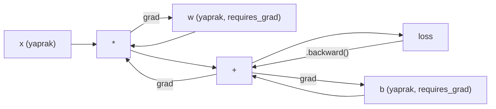
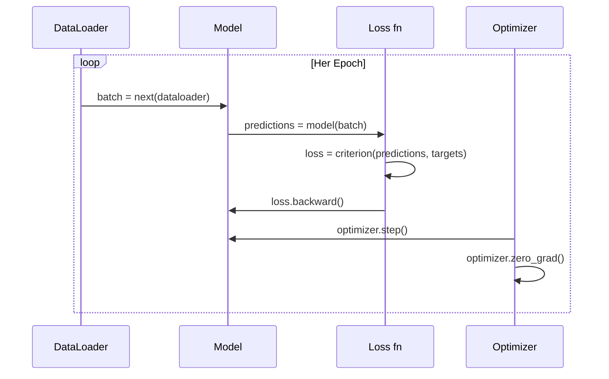

# PyTorch'a Giriş

> Motoru pistonlardan ve krank millerinden inşa ettin. Şimdi herkesin gerçekten sürdüğünü öğren.

**Tür:** Yapım
**Diller:** Python
**Ön koşullar:** Ders 03.10 (Kendi Mini Framework'ünü Kur)
**Süre:** ~75 dakika

## Öğrenme Hedefleri

- PyTorch'un nn.Module, nn.Sequential ve autograd'ını kullanarak sinir ağlarını kur ve eğit
- PyTorch tensor'larını, GPU hızlandırmasını ve standart eğitim döngüsünü (zero_grad, forward, loss, backward, step) kullan
- Sıfırdan yazdığın mini framework bileşenlerini PyTorch eşdeğerlerine dönüştür
- Aynı görevde saf Python framework'ünün ve PyTorch'un eğitim hızını profile et ve karşılaştır

## Sorun

Çalışan bir mini framework'ün var. Linear katmanlar, ReLU, dropout, batch norm, Adam, bir DataLoader, bir eğitim döngüsü. Saf Python'da bir çember sınıflandırma probleminde 4 katmanlı bir ağı eğitiyor.

Aynı zamanda aynı problemde PyTorch'tan 500x daha yavaş.

Mini framework'ün iç içe Python döngüleriyle aynı anda bir örnek işliyor. PyTorch aynı işlemleri GPU'da çalışan optimize edilmiş C++/CUDA kernel'lerine gönderiyor. Tek bir NVIDIA A100'de PyTorch ImageNet (1.28M görüntü) üzerinde bir ResNet-50'yi (25.6M parametre) yaklaşık 6 saatte eğitiyor. Framework'ün aynı görevi yaklaşık 3,000 saatte alacaktı — eğer önce belleği tükenmezse.

Hız tek boşluk değil. Framework'ünün GPU desteği yok. Otomatik türev alma yok — her module için backward()'ı elle yazdın. Serileştirme yok. Dağıtık eğitim yok. Karışık hassasiyet yok. Print ifadeleri olmadan gradyan akışını hata ayıklamanın yolu yok.

PyTorch bu boşlukların her birini doldurur. Ve bunu zaten kurduğun aynı zihinsel modeli korurken yapar: Module, forward(), parameters(), backward(), optimizer.step(). Kavramlar bire bir transfer olur. Sözdizimi neredeyse özdeştir. Fark, PyTorch'un sıfırdan tasarladığın aynı arayüzün arkasına on yıllık sistem mühendisliğini sarmasıdır.

## Kavram

### PyTorch Neden Kazandı

2015'te TensorFlow herhangi bir şey çalıştırmadan önce statik bir computation graph tanımlamanı gerektiriyordu. Graph'ı kurar, derler, sonra içinden veri beslerdin. Hata ayıklama, graph görselleştirmelerine bakmak demekti. Mimariyi değiştirmek graph'ı sıfırdan yeniden kurmak demekti.

PyTorch 2017'de farklı bir felsefeyle başlatıldı: eager execution. Python yazıyorsun. Hemen çalışıyor. `y = model(x)` aslında y'yi şu anda hesaplıyor, "daha sonra y'yi hesaplayacak bir düğüm graph'a ekle" değil. Bu standart Python hata ayıklama araçlarının çalıştığı anlamına geliyordu. print() çalıştı. pdb çalıştı. forward pass'inde if/else çalıştı.

2020'ye gelindiğinde piyasa konuşmuştu. PyTorch'un ML araştırma makalelerindeki payı %7'den (2017) %75'in üzerine çıktı (2022). Meta, Google DeepMind, OpenAI, Anthropic ve Hugging Face hepsi PyTorch'u birincil framework olarak kullanıyor. TensorFlow 2.x yanıt olarak eager execution'ı benimsedi — PyTorch'un tasarımının doğru olduğunun zımni kabulü.

Ders: developer experience birikir. %10 daha yavaş ama hata ayıklamada %50 daha hızlı bir framework her seferinde kazanır.

### Tensor'lar

Bir tensor üç kritik özelliğe sahip çok boyutlu bir dizidir: şekil (shape), dtype ve cihaz (device).

```python
import torch

x = torch.zeros(3, 4)           # şekil: (3, 4), dtype: float32, device: cpu
x = torch.randn(2, 3, 224, 224) # 2 RGB görüntü batch'i, 224x224
x = torch.tensor([1, 2, 3])     # bir Python listesinden
```

**Şekil** boyutluluktur. Bir skaler şekil ()'tir, bir vektör (n,), bir matris (m, n), bir görüntü batch'i (batch, channels, height, width)'tir.

**Dtype** hassasiyeti ve belleği kontrol eder.

| dtype | Bit | Aralık | Kullanım durumu |
|-------|------|-------|----------|
| float32 | 32 | ~7 ondalık basamak | Varsayılan eğitim |
| float16 | 16 | ~3.3 ondalık basamak | Karışık hassasiyet |
| bfloat16 | 16 | float32 ile aynı aralık, daha az hassasiyet | LLM eğitimi |
| int8 | 8 | -128 ile 127 | Kuantize çıkarım |

**Device** hesaplamanın nerede olacağını belirler.

```python
device = torch.device("cuda" if torch.cuda.is_available() else "cpu")
x = torch.randn(3, 4, device=device)
x = x.to("cuda")
x = x.cpu()
```

Her işlem tüm tensor'ların aynı cihazda olmasını gerektirir. Bu başlangıç seviyesinin karşılaştığı 1 numaralı PyTorch hatasıdır: `RuntimeError: Expected all tensors to be on the same device`. Hesaplamadan önce her şeyi aynı cihaza taşıyarak düzelt.

**Yeniden şekillendirme** sabit zamanlıdır — veriyi değil, metaveriyi değiştirir.

```python
x = torch.randn(2, 3, 4)
x.view(2, 12)      # (2, 12)'ye yeniden şekillendir — bitişik olmalı
x.reshape(6, 4)    # (6, 4)'e yeniden şekillendir — her zaman çalışır
x.permute(2, 0, 1) # boyutları yeniden sırala
x.unsqueeze(0)     # boyut ekle: (1, 2, 3, 4)
x.squeeze()        # boyut-1 boyutları kaldır
```

### Autograd

Mini framework'ün her module için backward() uygulaman gerektirdi. PyTorch gerektirmez. Tensor'lar üzerindeki her işlemi yönlü asiklik bir graph'a (computation graph) kaydeder ve sonra gradyanları otomatik olarak hesaplamak için o graph'ı ters yönde dolaşır.



Framework'ünden temel fark: PyTorch tape tabanlı autodiff kullanır. Forward pass sırasında her işlem bir "tape"e eklenir. `.backward()` çağırmak tape'i ters çevirerek oynatır.

```python
x = torch.randn(3, requires_grad=True)
y = x ** 2 + 3 * x
z = y.sum()
z.backward()
print(x.grad)  # dz/dx = 2x + 3
```

Autograd'ın üç kuralı:

1. Yalnızca `requires_grad=True` olan yaprak tensor'lar gradyan biriktirir
2. Gradyanlar varsayılan olarak birikir — her backward pass'ten önce `optimizer.zero_grad()` çağır
3. `torch.no_grad()` gradyan takibini devre dışı bırakır (değerlendirme sırasında kullan)

### nn.Module

`nn.Module` PyTorch'taki her sinir ağı bileşeni için temel sınıftır. Bu soyutlamayı Ders 10'da zaten kurdun. PyTorch'un versiyonu otomatik parametre kaydı, özyinelemeli module keşfi, cihaz yönetimi ve state dict serileştirmesi ekler.

```python
import torch.nn as nn

class MLP(nn.Module):
    def __init__(self, input_dim, hidden_dim, output_dim):
        super().__init__()
        self.layer1 = nn.Linear(input_dim, hidden_dim)
        self.relu = nn.ReLU()
        self.layer2 = nn.Linear(hidden_dim, output_dim)

    def forward(self, x):
        x = self.layer1(x)
        x = self.relu(x)
        x = self.layer2(x)
        return x
```

`__init__`'te bir `nn.Module` ya da `nn.Parameter`'ı attribute olarak atadığında, PyTorch onu otomatik olarak kaydeder. `model.parameters()` her kayıtlı parametreyi özyinelemeli olarak toplar. Bu yüzden mini framework'te yaptığın gibi asla ağırlıkları manuel olarak toplamak zorunda kalmazsın.

Temel yapı taşları:

| Module | Ne yapar | Parametreler |
|--------|-------------|------------|
| nn.Linear(in, out) | Wx + b | in*out + out |
| nn.Conv2d(in_ch, out_ch, k) | 2D convolution | in_ch*out_ch*k*k + out_ch |
| nn.BatchNorm1d(features) | Aktivasyonları normalize et | 2 * features |
| nn.Dropout(p) | Rastgele sıfırlama | 0 |
| nn.ReLU() | max(0, x) | 0 |
| nn.GELU() | Gaussian error linear | 0 |
| nn.Embedding(vocab, dim) | Lookup tablosu | vocab * dim |
| nn.LayerNorm(dim) | Örnek başına normalizasyon | 2 * dim |

### Loss Fonksiyonları ve Optimizer'lar

PyTorch inşa ettiğin her şeyin üretime hazır versiyonlarını sunar.

**Loss fonksiyonları** (`torch.nn`'den):

| Loss | Görev | Giriş |
|------|------|-------|
| nn.MSELoss() | Regresyon | Herhangi bir şekil |
| nn.CrossEntropyLoss() | Çok sınıflı sınıflandırma | Logit'ler (softmax değil) |
| nn.BCEWithLogitsLoss() | İkili sınıflandırma | Logit'ler (sigmoid değil) |
| nn.L1Loss() | Regresyon (sağlam) | Herhangi bir şekil |
| nn.CTCLoss() | Dizi hizalama | Log olasılıkları |

Not: `CrossEntropyLoss` dahili olarak `LogSoftmax` + `NLLLoss`'u birleştirir. Ham logit'leri geçir, softmax çıktılarını değil. Bu sessizce yanlış gradyanlar üreten yaygın bir hatadır.

**Optimizer'lar** (`torch.optim`'den):

| Optimizer | Ne zaman kullanılır | Tipik LR |
|-----------|-------------|-----------|
| SGD(params, lr, momentum) | CNN'ler, iyi ayarlanmış pipeline'lar | 0.01--0.1 |
| Adam(params, lr) | Varsayılan başlangıç noktası | 1e-3 |
| AdamW(params, lr, weight_decay) | Transformer'lar, fine-tuning | 1e-4--1e-3 |
| LBFGS(params) | Küçük ölçek, ikinci dereceden | 1.0 |

### Eğitim Döngüsü

Her PyTorch eğitim döngüsü aynı 5 adımlı deseni takip eder. Bunu Ders 10'dan zaten biliyorsun.



Kanonik desen:

```python
for epoch in range(num_epochs):
    model.train()
    for inputs, targets in train_loader:
        inputs, targets = inputs.to(device), targets.to(device)
        optimizer.zero_grad()
        outputs = model(inputs)
        loss = criterion(outputs, targets)
        loss.backward()
        optimizer.step()
```

Batch döngüsünün içinde beş satır. GPT-4'ü, Stable Diffusion'ı ve LLaMA'yı eğiten beş satır. Mimari değişir. Veri değişir. Bu beş satır değişmez.

### Dataset ve DataLoader

PyTorch'un `Dataset`'i iki metoda sahip soyut bir sınıftır: `__len__` ve `__getitem__`. `DataLoader` onu batch'leme, karıştırma ve çoklu işlem veri yüklemesiyle sarar.

```python
from torch.utils.data import Dataset, DataLoader

class MNISTDataset(Dataset):
    def __init__(self, images, labels):
        self.images = images
        self.labels = labels

    def __len__(self):
        return len(self.labels)

    def __getitem__(self, idx):
        return self.images[idx], self.labels[idx]

loader = DataLoader(dataset, batch_size=64, shuffle=True, num_workers=4)
```

`num_workers=4` GPU mevcut batch üzerinde eğitirken paralel olarak veri yüklemek için 4 işlem oluşturur. Disk bağımlı iş yüklerinde (büyük görüntüler, ses), bu tek başına eğitim hızını iki katına çıkarabilir.

### GPU Eğitimi

Bir modeli GPU'ya taşımak:

```python
device = torch.device("cuda" if torch.cuda.is_available() else "cpu")
model = model.to(device)
```

Bu özyinelemeli olarak her parametreyi ve buffer'ı GPU'ya transfer eder. Sonra eğitim sırasında her batch'i taşı:

```python
inputs, targets = inputs.to(device), targets.to(device)
```

**Karışık hassasiyet** modern GPU'larda (A100, H100, RTX 4090) bellek kullanımını yarıya indirir ve throughput'u iki katına çıkarır; forward/backward'ı float16'da çalıştırırken master ağırlıkları float32'de tutar:

```python
from torch.amp import autocast, GradScaler

scaler = GradScaler()
for inputs, targets in loader:
    with autocast(device_type="cuda"):
        outputs = model(inputs)
        loss = criterion(outputs, targets)
    scaler.scale(loss).backward()
    scaler.step(optimizer)
    scaler.update()
    optimizer.zero_grad()
```

### Karşılaştırma: Mini Framework vs PyTorch vs JAX

| Özellik | Mini Framework (L10) | PyTorch | JAX |
|---------|---------------------|---------|-----|
| Autodiff | Manuel backward() | Tape tabanlı autograd | Fonksiyonel dönüşümler |
| Çalıştırma | Eager (Python döngüleri) | Eager (C++ kernel'leri) | İzlenir + JIT derlenir |
| GPU desteği | Yok | Var (CUDA, ROCm, MPS) | Var (CUDA, TPU) |
| Hız (MNIST MLP) | ~300s/epoch | ~0.5s/epoch | ~0.3s/epoch |
| Module sistemi | Özel Module sınıfı | nn.Module | Stateless fonksiyonlar (Flax/Equinox) |
| Hata ayıklama | print() | print(), pdb, breakpoint() | Daha zor (JIT izleme print'i bozar) |
| Ekosistem | Yok | Hugging Face, Lightning, timm | Flax, Optax, Orbax |
| Öğrenme eğrisi | Onu sen kurdun | Orta | Dik (fonksiyonel paradigma) |
| Üretim kullanımı | Oyuncak problemler | Meta, OpenAI, Anthropic, HF | Google DeepMind, Midjourney |

## İnşa Et

Yalnızca PyTorch primitif'leri kullanarak MNIST üzerinde eğitilmiş bir 3 katmanlı MLP. Üst seviye sarmalayıcı yok. `torchvision.datasets` yok. Ham veriyi kendimiz indirir ve ayrıştırırız.

### Adım 1: MNIST'i Ham Dosyalardan Yükle

MNIST 4 gzip'li dosya olarak gelir: eğitim görüntüleri (60,000 x 28 x 28), eğitim etiketleri, test görüntüleri (10,000 x 28 x 28), test etiketleri. Onları indiririz ve binary formatı ayrıştırırız.

```python
import torch
import torch.nn as nn
import struct
import gzip
import urllib.request
import os

def download_mnist(path="./mnist_data"):
    base_url = "https://storage.googleapis.com/cvdf-datasets/mnist/"
    files = [
        "train-images-idx3-ubyte.gz",
        "train-labels-idx1-ubyte.gz",
        "t10k-images-idx3-ubyte.gz",
        "t10k-labels-idx1-ubyte.gz",
    ]
    os.makedirs(path, exist_ok=True)
    for f in files:
        filepath = os.path.join(path, f)
        if not os.path.exists(filepath):
            urllib.request.urlretrieve(base_url + f, filepath)

def load_images(filepath):
    with gzip.open(filepath, "rb") as f:
        magic, num, rows, cols = struct.unpack(">IIII", f.read(16))
        data = f.read()
        images = torch.frombuffer(bytearray(data), dtype=torch.uint8)
        images = images.reshape(num, rows * cols).float() / 255.0
    return images

def load_labels(filepath):
    with gzip.open(filepath, "rb") as f:
        magic, num = struct.unpack(">II", f.read(8))
        data = f.read()
        labels = torch.frombuffer(bytearray(data), dtype=torch.uint8).long()
    return labels
```

### Adım 2: Modeli Tanımla

3 katmanlı bir MLP: 784 -> 256 -> 128 -> 10. ReLU aktivasyonları. Regularization için dropout. Basit tutmak için batch norm yok.

```python
class MNISTModel(nn.Module):
    def __init__(self):
        super().__init__()
        self.net = nn.Sequential(
            nn.Linear(784, 256),
            nn.ReLU(),
            nn.Dropout(0.2),
            nn.Linear(256, 128),
            nn.ReLU(),
            nn.Dropout(0.2),
            nn.Linear(128, 10),
        )

    def forward(self, x):
        return self.net(x)
```

Çıktı katmanı 10 ham logit üretir (rakam başına bir tane). Softmax yok — `CrossEntropyLoss` bunu dahili olarak halleder.

Parametre sayısı: 784*256 + 256 + 256*128 + 128 + 128*10 + 10 = 235,146. Modern standartlara göre çok küçük. GPT-2 small 124M'e sahip. Bu saniyelerde eğitilir.

### Adım 3: Eğitim Döngüsü

Kanonik forward-loss-backward-step deseni.

```python
def train_one_epoch(model, loader, criterion, optimizer, device):
    model.train()
    total_loss = 0
    correct = 0
    total = 0
    for images, labels in loader:
        images, labels = images.to(device), labels.to(device)
        optimizer.zero_grad()
        outputs = model(images)
        loss = criterion(outputs, labels)
        loss.backward()
        optimizer.step()
        total_loss += loss.item() * images.size(0)
        _, predicted = outputs.max(1)
        correct += predicted.eq(labels).sum().item()
        total += labels.size(0)
    return total_loss / total, correct / total


def evaluate(model, loader, criterion, device):
    model.eval()
    total_loss = 0
    correct = 0
    total = 0
    with torch.no_grad():
        for images, labels in loader:
            images, labels = images.to(device), labels.to(device)
            outputs = model(images)
            loss = criterion(outputs, labels)
            total_loss += loss.item() * images.size(0)
            _, predicted = outputs.max(1)
            correct += predicted.eq(labels).sum().item()
            total += labels.size(0)
    return total_loss / total, correct / total
```

Değerlendirme sırasında `torch.no_grad()`'a dikkat et. Bu autograd'ı devre dışı bırakır, bellek kullanımını azaltır ve çıkarımı hızlandırır. Onsuz, PyTorch asla kullanmayacağın bir computation graph kurar.

### Adım 4: Her Şeyi Birbirine Bağla

```python
def main():
    device = torch.device("cuda" if torch.cuda.is_available() else "cpu")

    download_mnist()
    train_images = load_images("./mnist_data/train-images-idx3-ubyte.gz")
    train_labels = load_labels("./mnist_data/train-labels-idx1-ubyte.gz")
    test_images = load_images("./mnist_data/t10k-images-idx3-ubyte.gz")
    test_labels = load_labels("./mnist_data/t10k-labels-idx1-ubyte.gz")

    train_dataset = torch.utils.data.TensorDataset(train_images, train_labels)
    test_dataset = torch.utils.data.TensorDataset(test_images, test_labels)
    train_loader = torch.utils.data.DataLoader(
        train_dataset, batch_size=64, shuffle=True
    )
    test_loader = torch.utils.data.DataLoader(
        test_dataset, batch_size=256, shuffle=False
    )

    model = MNISTModel().to(device)
    criterion = nn.CrossEntropyLoss()
    optimizer = torch.optim.Adam(model.parameters(), lr=1e-3)

    num_params = sum(p.numel() for p in model.parameters())
    print(f"Device: {device}")
    print(f"Parametreler: {num_params:,}")
    print(f"Eğitim örnekleri: {len(train_dataset):,}")
    print(f"Test örnekleri: {len(test_dataset):,}")
    print()

    for epoch in range(10):
        train_loss, train_acc = train_one_epoch(
            model, train_loader, criterion, optimizer, device
        )
        test_loss, test_acc = evaluate(
            model, test_loader, criterion, device
        )
        print(
            f"Epoch {epoch+1:2d} | "
            f"Eğitim Loss: {train_loss:.4f} | Eğitim Doğr: {train_acc:.4f} | "
            f"Test Loss: {test_loss:.4f} | Test Doğr: {test_acc:.4f}"
        )

    torch.save(model.state_dict(), "mnist_mlp.pt")
    print(f"\nModel mnist_mlp.pt'ye kaydedildi")
    print(f"Final test doğruluğu: {test_acc:.4f}")
```

10 epoch sonra beklenen çıktı: ~%97.8 test doğruluğu. CPU'da eğitim süresi: ~30 saniye. GPU'da: ~5 saniye. Aynı mimariyle mini framework'ünde: ~45 dakika.

## Kullan

### Hızlı Karşılaştırma: Mini Framework vs PyTorch

| Mini Framework (Ders 10) | PyTorch |
|---------------------------|---------|
| `model = Sequential(Linear(784, 256), ReLU(), ...)` | `model = nn.Sequential(nn.Linear(784, 256), nn.ReLU(), ...)` |
| `pred = model.forward(x)` | `pred = model(x)` |
| `optimizer.zero_grad()` | `optimizer.zero_grad()` |
| `grad = criterion.backward()` sonra `model.backward(grad)` | `loss.backward()` |
| `optimizer.step()` | `optimizer.step()` |
| GPU yok | `model.to("cuda")` |
| Her module için manuel backward | Autograd her şeyi halleder |

Arayüz neredeyse özdeş. Fark başlık altındaki her şey.

### Modelleri Kaydetme ve Yükleme

```python
torch.save(model.state_dict(), "model.pt")

model = MNISTModel()
model.load_state_dict(torch.load("model.pt", weights_only=True))
model.eval()
```

Her zaman model nesnesi değil `state_dict()`'i (parametre sözlüğü) kaydet. Model nesnesini kaydetmek pickle kullanır, ki bu kodu refactor ettiğinde kırılır. State dict'ler taşınabilirdir.

### Learning Rate Scheduling

```python
scheduler = torch.optim.lr_scheduler.CosineAnnealingLR(
    optimizer, T_max=10
)
for epoch in range(10):
    train_one_epoch(model, train_loader, criterion, optimizer, device)
    scheduler.step()
```

PyTorch 15+ scheduler sunar: StepLR, ExponentialLR, CosineAnnealingLR, OneCycleLR, ReduceLROnPlateau. Hepsi aynı optimizer arayüzüne takılır.

## Yayınla

Bu ders iki artifakt üretir:

- `outputs/prompt-pytorch-debugger.md` — yaygın PyTorch eğitim başarısızlıklarını teşhis etmek için bir prompt
- `outputs/skill-pytorch-patterns.md` — PyTorch eğitim desenleri için bir skill referansı

## Alıştırmalar

1. **Batch normalization ekle.** Her doğrusal katmandan sonra (aktivasyondan önce) `nn.BatchNorm1d` ekle. Test doğruluğunu ve eğitim hızını yalnızca dropout'lu versiyonla karşılaştır. Batch norm daha az epoch'ta %98+'e ulaşmalı.

2. **Bir learning rate finder uygula.** Üstel olarak artan learning rate ile (1e-7'den 1.0'a) bir epoch eğit. Loss vs LR'yi çiz. Optimal LR loss tırmanmaya başlamadan hemen önceki yerdir. MNIST modeli için daha iyi bir LR seçmek için bunu kullan.

3. **Karışık hassasiyetle GPU'ya port et.** Eğitim döngüsüne `torch.amp.autocast` ve `GradScaler` ekle. GPU'da karışık hassasiyetli ve karışık hassasiyetsiz throughput'u (örnek/saniye) ölç. Bir A100'de ~2x hızlanma bekle.

4. **Özel bir Dataset kur.** Fashion-MNIST'i indir (MNIST ile aynı format ama giysi öğeleri ile). `__getitem__` ve `__len__` ile bir `FashionMNISTDataset(Dataset)` sınıfı uygula. Aynı MLP'yi eğit ve doğruluğu karşılaştır. Fashion-MNIST daha zor — ~%98 yerine ~%88 bekle.

5. **Adam'ı SGD + momentum ile değiştir.** `SGD(params, lr=0.01, momentum=0.9)` ile eğit. Yakınsama eğrilerini karşılaştır. Sonra bir `CosineAnnealingLR` scheduler ekle ve SGD'nin epoch 10'a kadar Adam'a yetişip yetişmediğini gör.

## Anahtar Terimler

| Terim | İnsanlar ne diyor | Gerçekte ne anlama geliyor |
|------|----------------|----------------------|
| Tensor | "Çok boyutlu bir dizi" | Her işleme yerleşik otomatik türev desteği olan tipli, cihaz farkındalıklı bir dizi |
| Autograd | "Otomatik backprop" | Forward pass sırasında işlemleri kaydeden, sonra kesin gradyanları hesaplamak için onları ters yönde oynatan tape tabanlı bir sistem |
| nn.Module | "Bir katman" | Herhangi bir türevlenebilir hesaplama bloğu için temel sınıf — parametreleri kaydeder, iç içe geçmeyi destekler, train/eval modlarını halleder |
| state_dict | "Model ağırlıkları" | Parametre adlarını tensor'lara eşleyen bir OrderedDict — eğitilmiş bir modelin taşınabilir, serileştirilebilir temsili |
| .backward() | "Gradyanları hesapla" | Computation graph'ı ters yönde dolaş, requires_grad=True olan her yaprak tensor için gradyanları hesapla ve biriktir |
| .to(device) | "GPU'ya taşı" | Tüm parametreleri ve buffer'ları belirtilen cihaza (CPU, CUDA, MPS) özyinelemeli olarak transfer et |
| DataLoader | "Veri pipeline'ı" | Bir Dataset'ten veri yüklemeyi batch'leyen, karıştıran ve isteğe bağlı olarak paralelleştiren bir iterator |
| Karışık hassasiyet | "Float16 kullan" | Sayısal kararlılık için float32 master ağırlıkları korurken hız için float16 forward/backward ile eğit |
| Eager execution | "Şimdi çalıştır" | İşlemler çağrıldığında hemen çalışır, daha sonraki bir derleme adımına ertelenmez — PyTorch'u TF 1.x'ten ayıran temel tasarım seçimi |
| zero_grad | "Gradyanları sıfırla" | PyTorch varsayılan olarak gradyanları biriktirdiğinden, bir sonraki backward pass'ten önce tüm parametre gradyanlarını sıfıra ayarla |

## İleri Okuma

- Paszke et al., "PyTorch: An Imperative Style, High-Performance Deep Learning Library" (2019) — PyTorch'un tasarım takaslarını açıklayan orijinal makale
- PyTorch Tutorials: "Learning PyTorch with Examples" (https://pytorch.org/tutorials/beginner/pytorch_with_examples.html) — tensor'lardan nn.Module'a kadar resmi yol
- PyTorch Performance Tuning Guide (https://pytorch.org/tutorials/recipes/recipes/tuning_guide.html) — karışık hassasiyet, DataLoader worker'ları, pinned memory ve diğer üretim optimizasyonları
- Horace He, "Making Deep Learning Go Brrrr" (https://horace.io/brrr_intro.html) — PyTorch'a özgü optimizasyon stratejileriyle GPU eğitiminin neden hızlı olduğu
