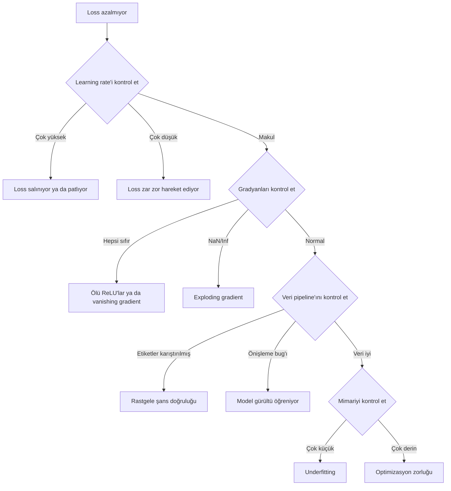
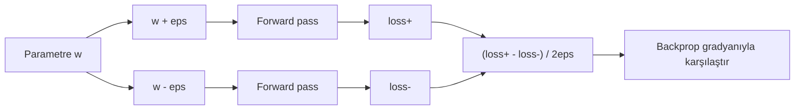
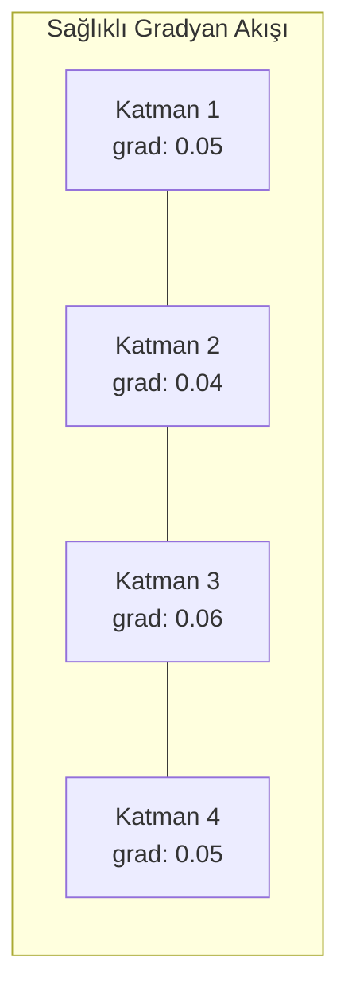
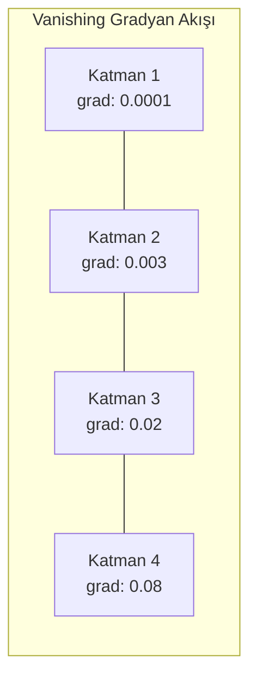
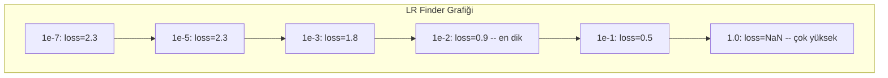

# Sinir Ağlarında Hata Ayıklama

> Ağın derlendi. Çalıştı. Bir sayı üretti. Sayı yanlış ve hiçbir şey çökmedi. En zor hata ayıklama türüne hoş geldin — hata mesajı olmayan tür.

**Tür:** Pratik
**Diller:** Python, PyTorch
**Ön koşullar:** Faz 03 Dersler 01-10 (özellikle backpropagation, loss fonksiyonları, optimizer'lar)
**Süre:** ~90 dakika

## Öğrenme Hedefleri

- Sistematik hata ayıklama stratejileri kullanarak yaygın sinir ağı başarısızlıklarını (NaN loss, düz loss eğrisi, overfitting, salınım) teşhis et
- Model mimarinin ve eğitim döngünün doğru olduğunu doğrulamak için "tek batch'i overfit et" tekniğini uygula
- Vanishing/exploding gradient problemlerini tespit etmek için gradyan büyüklüklerini, aktivasyon dağılımlarını ve ağırlık normlarını incele
- Veri pipeline, model mimarisi, loss fonksiyonu, optimizer ve learning rate sorunlarını kapsayan bir hata ayıklama kontrol listesi kur

## Sorun

Geleneksel yazılım bozulduğunda çöker. Bir null pointer exception fırlatır. Bir tip uyumsuzluğu derleme zamanında başarısız olur. Bir off-by-one hatası açıkça yanlış bir çıktı üretir.

Sinir ağları sana bu lüksü vermiyor.

Bozuk bir sinir ağı tamamlanana kadar çalışır, bir loss değeri yazdırır ve tahminler verir. Loss azalabilir. Tahminler makul görünebilir. Ama model sessizce yanlıştır — kısayollar öğreniyor, gürültü ezberliyor ya da işe yaramaz bir yerel minimuma yakınsıyor. Google araştırmacıları ML hata ayıklama süresinin %60-70'inin hiçbir hata üretmeyen ama model kalitesini düşüren "sessiz" bug'larda harcandığını tahmin etti.

Çalışan bir model ile bozuk olan arasındaki fark genellikle yanlış yerleştirilmiş tek bir satırdır: eksik bir `zero_grad()`, transpoze edilmiş bir boyut, 10x yanlış bir learning rate. Kanonik "Recipe for Training Neural Networks" (2019) şununla açılır: "En yaygın sinir ağı hataları çökmeyen bug'lardır."

Bu ders sana o bug'ları bulmayı öğretir.

## Kavram

### Hata Ayıklama Zihniyeti

Print-ve-dua hata ayıklamayı unut. Sinir ağı hata ayıklama sistematik bir yaklaşım gerektirir çünkü geri bildirim döngüsü yavaştır (eğitim çalışması başına dakikalar ya da saatler) ve semptomlar belirsizdir (kötü loss 20 farklı şey anlamına gelebilir).

Altın kural: **basit başla, karmaşıklığı her seferinde bir parça ekle ve her parçayı bağımsız olarak doğrula.**



### Semptom 1: Loss Azalmıyor

Bu en yaygın şikayet. Eğitim döngüsü çalışır, epoch'lar geçer ve loss düz kalır ya da vahşice salınır.

**Yanlış learning rate.** Çok yüksek: loss salınır ya da NaN'a zıplar. Çok düşük: loss o kadar yavaş azalır ki düz görünür. Adam için 1e-3'te başla. SGD için 1e-1 ya da 1e-2'de başla. Başka bir şeyin yanlış olduğuna karar vermeden önce her biri 10x yayılan 3 learning rate dene (örn. 1e-2, 1e-3, 1e-4).

**Ölü ReLU'lar.** Bir ReLU nöronu büyük negatif bir giriş alırsa, 0 üretir ve gradyanı 0'dır. Bir daha asla aktive olmaz. Yeterli sayıda nöron ölürse, ağ öğrenemez. Kontrol et: her ReLU katmanından sonra tam olarak 0 olan aktivasyonların oranını yazdır. >%50'si ölü ise LeakyReLU'ya geç ya da learning rate'i azalt.

**Vanishing gradient.** Sigmoid ya da tanh aktivasyonlu derin ağlarda, gradyanlar geriye yayıldıkça üstel olarak küçülür. İlk katmana ulaştıklarında ~0'dırlar. İlk katmanlar öğrenmeyi bırakır. Çözüm: ReLU/GELU kullan, residual bağlantılar ekle ya da batch normalization kullan.

**Exploding gradient.** Tersi problem — gradyanlar üstel olarak büyür. RNN'lerde ve çok derin ağlarda yaygındır. Loss NaN'a zıplar. Çözüm: gradient clipping (`torch.nn.utils.clip_grad_norm_`), daha düşük learning rate ya da normalizasyon ekle.

### Semptom 2: Loss Azalıyor Ama Model Kötü

Loss düşüyor. Eğitim doğruluğu %99'a çarpıyor. Ama test doğruluğu %55. Ya da model gerçek veride saçma çıktılar üretiyor.

**Overfitting.** Model kalıpları öğrenmek yerine eğitim verisini ezberliyor. Eğitim ve doğrulama loss'u arasındaki fark zamanla artar. Çözüm: daha fazla veri, dropout, weight decay, early stopping, veri augmentation.

**Veri sızıntısı.** Test verisi eğitime sızdı. Doğruluk şüpheli derecede yüksek. Yaygın sebepler: bölmeden önce karıştırma, tam veri setinden istatistiklerle önişleme, bölmeler arasında yinelenen örnekler. Çözüm: önce böl, sonra önişle, yinelenenleri kontrol et.

**Etiket hataları.** Çoğu gerçek veri setindeki etiketlerin %5-10'u yanlıştır (Northcutt et al., 2021 — "Pervasive Label Errors in Test Sets"). Model gürültüyü öğrenir. Çözüm: yanlış etiketlenmiş örnekleri bulmak ve düzeltmek için confident learning kullan ya da yüksek loss örneklerini görmezden gelmek için loss truncation kullan.

### Semptom 3: Loss'ta NaN ya da Inf

Loss değeri `nan` ya da `inf` olur. Eğitim ölüdür.

**Learning rate çok yüksek.** Gradyan güncellemeleri o kadar fazla aşıyor ki ağırlıklar patlıyor. Çözüm: 10x azalt.

**log(0) ya da log(negatif).** Cross-entropy loss `log(p)` hesaplar. Modelin tam 0 ya da negatif olasılık üretirse, log patlar. Çözüm: tahminleri `[eps, 1-eps]`'e kelepçele, `eps=1e-7` ile.

**Sıfıra bölme.** Batch normalization standart sapmaya böler. Sabit değerlere sahip bir batch'in std=0'dır. Çözüm: paydaya epsilon ekle (PyTorch bunu varsayılan olarak yapar ama özel uygulamalar yapmayabilir).

**Sayısal overflow.** `exp()`'e beslenen büyük aktivasyonlar Inf üretir. Softmax özellikle eğilimlidir. Çözüm: üstellemeden önce maks'ı çıkar (log-sum-exp numarası).

### Teknik 1: Gradient Checking

Analitik gradyanlarını (backprop'tan) sayısal gradyanlarınla (sonlu farklardan) karşılaştır. Uyuşmazlarsa backward pass'inde bir bug var.

`w` parametresi için sayısal gradyan:

```
grad_numerical = (loss(w + eps) - loss(w - eps)) / (2 * eps)
```

Uyum metriği (göreceli fark):

```
rel_diff = |grad_analytical - grad_numerical| / max(|grad_analytical|, |grad_numerical|, 1e-8)
```

`rel_diff < 1e-5` ise: doğru. `rel_diff > 1e-3` ise: neredeyse kesinlikle bir bug.



### Teknik 2: Aktivasyon İstatistikleri

Eğitim sırasında her katmandan sonra aktivasyonların ortalamasını ve standart sapmasını izle. Sağlıklı ağlar ortalama 0'a yakın ve std 1'e yakın (normalizasyondan sonra) ya da en azından sınırlı aktivasyonları korur.

| Sağlık göstergesi | Ortalama | Std | Teşhis |
|-----------------|------|-----|-----------|
| Sağlıklı | ~0 | ~1 | Ağ normal şekilde öğreniyor |
| Doygun | >>0 ya da <<0 | ~0 | Aktivasyonlar uç değerlerde sıkışmış |
| Ölü | 0 | 0 | Nöronlar ölü (hepsi sıfır) |
| Patlıyor | >>10 | >>10 | Aktivasyonlar sınırsız büyüyor |

### Teknik 3: Gradyan Akışı Görselleştirme

Her katman için ortalama gradyan büyüklüğünü çiz. Sağlıklı bir ağda gradyan büyüklükleri katmanlar arasında kabaca benzer olmalıdır. Erken katmanların gradyanları sonraki katmanlardan 1000x daha küçükse vanishing gradient'in var.





### Teknik 4: Overfit-One-Batch Testi

Deep learning'deki en önemli tek hata ayıklama tekniği.

Küçük bir batch al (8-32 örnek). Onun üzerinde 100+ iterasyon için eğit. Loss neredeyse sıfıra gitmeli ve eğitim doğruluğu %100'e ulaşmalı. Gitmiyorsa, modelin ya da eğitim döngünde temel bir bug var — tam eğitime devam etme.

Bu test şunları yakalar:
- Bozuk loss fonksiyonları
- Bozuk backward pass'ler
- Veriyi temsil edemeyecek kadar küçük mimari
- Model parametrelerine bağlanmamış optimizer
- Veri ve etiketler hizalı değil

Bu çalıştırması 30 saniye sürer ve tam eğitim çalışmalarında saatler süren hata ayıklamayı kurtarır.

### Teknik 5: Learning Rate Finder

Leslie Smith (2017) bir epoch boyunca çok küçükten (1e-7) çok büyüğe (10) learning rate'i taramayı, loss'u kaydetmeyi önerdi. Loss vs learning rate'i çiz. Optimal learning rate, loss'un en hızlı azaldığı orandan kabaca 10x daha küçüktür.



Bu örnekte en iyi LR: ~1e-3 (en dik noktadan bir büyüklük mertebesi önce).

### Yaygın PyTorch Bug'ları

Bunlar PyTorch topluluğunda en çok toplu saat harcayan bug'lardır:

| Bug | Semptom | Çözüm |
|-----|---------|-----|
| `optimizer.zero_grad()`'i unutmak | Gradyanlar batch'ler arasında birikir, loss salınır | `loss.backward()`'tan önce `optimizer.zero_grad()` ekle |
| Test zamanında `model.eval()`'i unutmak | Dropout ve batch norm farklı davranır, test doğruluğu çalışmalar arasında değişir | `model.eval()` ve `torch.no_grad()` ekle |
| Yanlış tensor şekilleri | Sessiz broadcasting yanlış sonuçlar üretir, hata yok | Hata ayıklama sırasında her işlemden sonra şekilleri yazdır |
| CPU/GPU uyumsuzluğu | `RuntimeError: expected CUDA tensor` | Model VE veri üzerinde `.to(device)` kullan |
| Tensor'ları detach etmemek | Computation graph sonsuza büyür, OOM | `.detach()` ya da `with torch.no_grad()` kullan |
| In-place işlemleri autograd'ı bozuyor | `RuntimeError: modified by in-place operation` | `x += 1`'i `x = x + 1` ile değiştir |
| Veri normalize edilmemiş | Loss rastgele şans seviyesinde sıkışmış | Girdileri ortalama=0, std=1'e normalize et |
| Etiketler yanlış dtype | Cross-entropy `Long` bekler, `Float` aldı | Etiketleri cast et: `labels.long()` |

### Ana Hata Ayıklama Tablosu

| Semptom | Olası neden | İlk denenecek şey |
|---------|-------------|-------------------|
| Loss -log(1/num_classes)'ta sıkışmış | Model tek tip dağılım tahmin ediyor | Veri pipeline'ını kontrol et, etiketlerin girdilerle eşleştiğini doğrula |
| Birkaç adımdan sonra Loss NaN | Learning rate çok yüksek | LR'yi 10x azalt |
| Hemen Loss NaN | log(0) ya da sıfıra bölme | log/bölme işlemlerine epsilon ekle |
| Loss vahşice salınıyor | LR çok yüksek ya da batch boyutu çok küçük | LR'yi azalt, batch boyutunu artır |
| Loss azalıyor sonra durakta | İnce ayar fazı için LR çok yüksek | LR schedule ekle (cosine ya da step decay) |
| Eğitim doğruluğu yüksek, test doğruluğu düşük | Overfitting | Dropout, weight decay, daha fazla veri ekle |
| Eğitim doğruluğu = test doğruluğu = şans | Model hiçbir şey öğrenmiyor | Overfit-one-batch testi çalıştır |
| Eğitim doğruluğu = test doğruluğu ama ikisi de düşük | Underfitting | Daha büyük model, daha fazla katman, daha fazla özellik |
| Gradyanlar tamamen sıfır | Ölü ReLU'lar ya da detach edilmiş computation graph | LeakyReLU'ya geç, `.requires_grad`'ı kontrol et |
| Eğitim sırasında bellek yetersiz | Batch çok büyük ya da graph serbest bırakılmadı | Batch boyutunu azalt, eval için `torch.no_grad()` kullan |

## İnşa Et

Aktivasyonları, gradyanları ve loss eğrilerini izleyen bir teşhis araç seti. Bir ağı kasıtlı olarak bozacaksın ve araç setini her sorunu teşhis etmek için kullanacaksın.

### Adım 1: NetworkDebugger Sınıfı

Katman başına aktivasyon ve gradyan istatistiklerini kaydetmek için bir PyTorch modeline hook'lanır.

```python
import torch
import torch.nn as nn
import math


class NetworkDebugger:
    def __init__(self, model):
        self.model = model
        self.activation_stats = {}
        self.gradient_stats = {}
        self.loss_history = []
        self.lr_losses = []
        self.hooks = []
        self._register_hooks()

    def _register_hooks(self):
        for name, module in self.model.named_modules():
            if isinstance(module, (nn.Linear, nn.Conv2d, nn.ReLU, nn.LeakyReLU)):
                hook = module.register_forward_hook(self._make_activation_hook(name))
                self.hooks.append(hook)
                hook = module.register_full_backward_hook(self._make_gradient_hook(name))
                self.hooks.append(hook)

    def _make_activation_hook(self, name):
        def hook(module, input, output):
            with torch.no_grad():
                out = output.detach().float()
                self.activation_stats[name] = {
                    "mean": out.mean().item(),
                    "std": out.std().item(),
                    "fraction_zero": (out == 0).float().mean().item(),
                    "min": out.min().item(),
                    "max": out.max().item(),
                }
        return hook

    def _make_gradient_hook(self, name):
        def hook(module, grad_input, grad_output):
            if grad_output[0] is not None:
                with torch.no_grad():
                    grad = grad_output[0].detach().float()
                    self.gradient_stats[name] = {
                        "mean": grad.mean().item(),
                        "std": grad.std().item(),
                        "abs_mean": grad.abs().mean().item(),
                        "max": grad.abs().max().item(),
                    }
        return hook

    def record_loss(self, loss_value):
        self.loss_history.append(loss_value)

    def check_loss_health(self):
        if len(self.loss_history) < 2:
            return "NOT_ENOUGH_DATA"
        recent = self.loss_history[-10:]
        if any(math.isnan(v) or math.isinf(v) for v in recent):
            return "NAN_OR_INF"
        if len(self.loss_history) >= 20:
            first_half = sum(self.loss_history[:10]) / 10
            second_half = sum(self.loss_history[-10:]) / 10
            if second_half >= first_half * 0.99:
                return "NOT_DECREASING"
        if len(recent) >= 5:
            diffs = [recent[i+1] - recent[i] for i in range(len(recent)-1)]
            if max(diffs) - min(diffs) > 2 * abs(sum(diffs) / len(diffs)):
                return "OSCILLATING"
        return "HEALTHY"

    def check_activations(self):
        issues = []
        for name, stats in self.activation_stats.items():
            if stats["fraction_zero"] > 0.5:
                issues.append(f"DEAD_NEURONS: {name} %{stats['fraction_zero']*100:.0f} sıfır aktivasyona sahip")
            if abs(stats["mean"]) > 10:
                issues.append(f"EXPLODING_ACTIVATIONS: {name} mean={stats['mean']:.2f}")
            if stats["std"] < 1e-6:
                issues.append(f"COLLAPSED_ACTIVATIONS: {name} std={stats['std']:.2e}")
        return issues if issues else ["HEALTHY"]

    def check_gradients(self):
        issues = []
        grad_magnitudes = []
        for name, stats in self.gradient_stats.items():
            grad_magnitudes.append((name, stats["abs_mean"]))
            if stats["abs_mean"] < 1e-7:
                issues.append(f"VANISHING_GRADIENT: {name} abs_mean={stats['abs_mean']:.2e}")
            if stats["abs_mean"] > 100:
                issues.append(f"EXPLODING_GRADIENT: {name} abs_mean={stats['abs_mean']:.2e}")
        if len(grad_magnitudes) >= 2:
            first_mag = grad_magnitudes[0][1]
            last_mag = grad_magnitudes[-1][1]
            if last_mag > 0 and first_mag / last_mag > 100:
                issues.append(f"GRADIENT_RATIO: ilk/son = {first_mag/last_mag:.0f}x (vanishing)")
        return issues if issues else ["HEALTHY"]

    def print_report(self):
        print("\n=== NETWORK DEBUGGER RAPORU ===")
        print(f"\nLoss sağlığı: {self.check_loss_health()}")
        if self.loss_history:
            print(f"  Son 5 loss: {[f'{v:.4f}' for v in self.loss_history[-5:]]}")
        print("\nAktivasyon teşhisi:")
        for item in self.check_activations():
            print(f"  {item}")
        print("\nGradyan teşhisi:")
        for item in self.check_gradients():
            print(f"  {item}")
        print("\nKatman başına aktivasyon istatistikleri:")
        for name, stats in self.activation_stats.items():
            print(f"  {name}: mean={stats['mean']:.4f} std={stats['std']:.4f} zero=%{stats['fraction_zero']*100:.1f}")
        print("\nKatman başına gradyan istatistikleri:")
        for name, stats in self.gradient_stats.items():
            print(f"  {name}: abs_mean={stats['abs_mean']:.2e} max={stats['max']:.2e}")

    def remove_hooks(self):
        for hook in self.hooks:
            hook.remove()
        self.hooks.clear()
```

### Adım 2: Overfit-One-Batch Testi

```python
def overfit_one_batch(model, x_batch, y_batch, criterion, lr=0.01, steps=200):
    optimizer = torch.optim.Adam(model.parameters(), lr=lr)
    model.train()
    print("\n=== OVERFIT ONE BATCH TESTİ ===")
    print(f"Batch boyutu: {x_batch.shape[0]}, Adımlar: {steps}")

    for step in range(steps):
        optimizer.zero_grad()
        output = model(x_batch)
        loss = criterion(output, y_batch)
        loss.backward()
        optimizer.step()

        if step % 50 == 0 or step == steps - 1:
            with torch.no_grad():
                preds = (output > 0).float() if output.shape[-1] == 1 else output.argmax(dim=1)
                targets = y_batch if y_batch.dim() == 1 else y_batch.squeeze()
                acc = (preds.squeeze() == targets).float().mean().item()
            print(f"  Adım {step:3d} | Loss: {loss.item():.6f} | Doğruluk: %{acc*100:.1f}")

    final_loss = loss.item()
    if final_loss > 0.1:
        print(f"\n  BAŞARISIZ: Loss yakınsamadı ({final_loss:.4f}). Model ya da eğitim döngüsü bozuk.")
        return False
    print(f"\n  BAŞARILI: Loss {final_loss:.6f}'e yakınsadı")
    return True
```

### Adım 3: Learning Rate Finder

```python
def find_learning_rate(model, x_data, y_data, criterion, start_lr=1e-7, end_lr=10, steps=100):
    import copy
    original_state = copy.deepcopy(model.state_dict())
    optimizer = torch.optim.SGD(model.parameters(), lr=start_lr)
    lr_mult = (end_lr / start_lr) ** (1 / steps)

    model.train()
    results = []
    best_loss = float("inf")
    current_lr = start_lr

    print("\n=== LEARNING RATE FINDER ===")

    for step in range(steps):
        optimizer.zero_grad()
        output = model(x_data)
        loss = criterion(output, y_data)

        if math.isnan(loss.item()) or loss.item() > best_loss * 10:
            break

        best_loss = min(best_loss, loss.item())
        results.append((current_lr, loss.item()))

        loss.backward()
        optimizer.step()

        current_lr *= lr_mult
        for param_group in optimizer.param_groups:
            param_group["lr"] = current_lr

    model.load_state_dict(original_state)

    if len(results) < 10:
        print("  LR taraması tamamlanamadı — loss çok hızlı ıraksadı")
        return results

    min_loss_idx = min(range(len(results)), key=lambda i: results[i][1])
    suggested_lr = results[max(0, min_loss_idx - 10)][0]

    print(f"  {start_lr:.0e}'den {results[-1][0]:.0e}'ye {len(results)} adım tarandı")
    print(f"  Minimum loss {results[min_loss_idx][1]:.4f}, lr={results[min_loss_idx][0]:.2e}'de")
    print(f"  Önerilen learning rate: {suggested_lr:.2e}")

    return results
```

### Adım 4: Gradient Checker

```python
def _flat_to_multi_index(flat_idx, shape):
    multi_idx = []
    remaining = flat_idx
    for dim in reversed(shape):
        multi_idx.insert(0, remaining % dim)
        remaining //= dim
    return tuple(multi_idx)


def gradient_check(model, x, y, criterion, eps=1e-4):
    model.train()
    x_double = x.double()
    y_double = y.double()
    model_double = model.double()

    print("\n=== GRADIENT CHECK ===")
    overall_max_diff = 0
    checked = 0

    for name, param in model_double.named_parameters():
        if not param.requires_grad:
            continue

        layer_max_diff = 0

        model_double.zero_grad()
        output = model_double(x_double)
        loss = criterion(output, y_double)
        loss.backward()
        analytical_grad = param.grad.clone()

        num_checks = min(5, param.numel())
        for i in range(num_checks):
            idx = _flat_to_multi_index(i, param.shape)
            original = param.data[idx].item()

            param.data[idx] = original + eps
            with torch.no_grad():
                loss_plus = criterion(model_double(x_double), y_double).item()

            param.data[idx] = original - eps
            with torch.no_grad():
                loss_minus = criterion(model_double(x_double), y_double).item()

            param.data[idx] = original

            numerical = (loss_plus - loss_minus) / (2 * eps)
            analytical = analytical_grad[idx].item()

            denom = max(abs(numerical), abs(analytical), 1e-8)
            rel_diff = abs(numerical - analytical) / denom

            layer_max_diff = max(layer_max_diff, rel_diff)
            checked += 1

        overall_max_diff = max(overall_max_diff, layer_max_diff)
        status = "OK" if layer_max_diff < 1e-5 else "UYUMSUZ"
        print(f"  {name}: max_rel_diff={layer_max_diff:.2e} [{status}]")

    model.float()

    print(f"\n  {checked} parametre kontrol edildi")
    if overall_max_diff < 1e-5:
        print("  BAŞARILI: Gradyanlar eşleşti (rel_diff < 1e-5)")
    elif overall_max_diff < 1e-3:
        print("  UYARI: Küçük farklar (1e-5 < rel_diff < 1e-3)")
    else:
        print("  BAŞARISIZ: Gradyan uyumsuzluğu tespit edildi (rel_diff > 1e-3)")
    return overall_max_diff
```

### Adım 5: Kasıtlı Olarak Bozuk Ağlar

Şimdi araç setini bozuk ağlara uygula ve her birini teşhis et.

```python
def demo_broken_networks():
    torch.manual_seed(42)
    x = torch.randn(64, 10)
    y = (x[:, 0] > 0).long()

    print("\n" + "=" * 60)
    print("BUG 1: Learning rate çok yüksek (lr=10)")
    print("=" * 60)
    model1 = nn.Sequential(nn.Linear(10, 32), nn.ReLU(), nn.Linear(32, 2))
    debugger1 = NetworkDebugger(model1)
    optimizer1 = torch.optim.SGD(model1.parameters(), lr=10.0)
    criterion = nn.CrossEntropyLoss()
    for step in range(20):
        optimizer1.zero_grad()
        out = model1(x)
        loss = criterion(out, y)
        debugger1.record_loss(loss.item())
        loss.backward()
        optimizer1.step()
    debugger1.print_report()
    debugger1.remove_hooks()

    print("\n" + "=" * 60)
    print("BUG 2: Kötü initialization'dan ölü ReLU'lar")
    print("=" * 60)
    model2 = nn.Sequential(nn.Linear(10, 32), nn.ReLU(), nn.Linear(32, 32), nn.ReLU(), nn.Linear(32, 2))
    with torch.no_grad():
        for m in model2.modules():
            if isinstance(m, nn.Linear):
                m.weight.fill_(-1.0)
                m.bias.fill_(-5.0)
    debugger2 = NetworkDebugger(model2)
    optimizer2 = torch.optim.Adam(model2.parameters(), lr=1e-3)
    for step in range(50):
        optimizer2.zero_grad()
        out = model2(x)
        loss = criterion(out, y)
        debugger2.record_loss(loss.item())
        loss.backward()
        optimizer2.step()
    debugger2.print_report()
    debugger2.remove_hooks()

    print("\n" + "=" * 60)
    print("BUG 3: Eksik zero_grad (gradyanlar birikiyor)")
    print("=" * 60)
    model3 = nn.Sequential(nn.Linear(10, 32), nn.ReLU(), nn.Linear(32, 2))
    debugger3 = NetworkDebugger(model3)
    optimizer3 = torch.optim.SGD(model3.parameters(), lr=0.01)
    for step in range(50):
        out = model3(x)
        loss = criterion(out, y)
        debugger3.record_loss(loss.item())
        loss.backward()
        optimizer3.step()
    debugger3.print_report()
    debugger3.remove_hooks()

    print("\n" + "=" * 60)
    print("SAĞLIKLI AĞ: Karşılaştırma için doğru kurulum")
    print("=" * 60)
    model_good = nn.Sequential(nn.Linear(10, 32), nn.ReLU(), nn.Linear(32, 2))
    debugger_good = NetworkDebugger(model_good)
    optimizer_good = torch.optim.Adam(model_good.parameters(), lr=1e-3)
    for step in range(50):
        optimizer_good.zero_grad()
        out = model_good(x)
        loss = criterion(out, y)
        debugger_good.record_loss(loss.item())
        loss.backward()
        optimizer_good.step()
    debugger_good.print_report()
    debugger_good.remove_hooks()

    print("\n" + "=" * 60)
    print("OVERFIT-ONE-BATCH TESTİ (sağlıklı model)")
    print("=" * 60)
    model_test = nn.Sequential(nn.Linear(10, 32), nn.ReLU(), nn.Linear(32, 2))
    overfit_one_batch(model_test, x[:8], y[:8], criterion)

    print("\n" + "=" * 60)
    print("LEARNING RATE FINDER")
    print("=" * 60)
    model_lr = nn.Sequential(nn.Linear(10, 32), nn.ReLU(), nn.Linear(32, 2))
    find_learning_rate(model_lr, x, y, criterion)

    print("\n" + "=" * 60)
    print("GRADIENT CHECK")
    print("=" * 60)
    model_grad = nn.Sequential(nn.Linear(10, 8), nn.ReLU(), nn.Linear(8, 2))
    gradient_check(model_grad, x[:4], y[:4], criterion)
```

## Kullan

### PyTorch Yerleşik Araçlar

```python
import torch
import torch.nn as nn

model = nn.Sequential(
    nn.Linear(768, 256),
    nn.ReLU(),
    nn.Linear(256, 10),
)

with torch.autograd.detect_anomaly():
    output = model(input_tensor)
    loss = criterion(output, target)
    loss.backward()

for name, param in model.named_parameters():
    if param.grad is not None:
        print(f"{name}: grad_mean={param.grad.abs().mean():.2e}")
```

### Weights & Biases Entegrasyonu

```python
import wandb

wandb.init(project="debug-training")

for epoch in range(100):
    loss = train_one_epoch()
    wandb.log({
        "loss": loss,
        "lr": optimizer.param_groups[0]["lr"],
        "grad_norm": torch.nn.utils.clip_grad_norm_(model.parameters(), float("inf")),
    })

    for name, param in model.named_parameters():
        if param.grad is not None:
            wandb.log({f"grad/{name}": wandb.Histogram(param.grad.cpu().numpy())})
```

### TensorBoard

```python
from torch.utils.tensorboard import SummaryWriter

writer = SummaryWriter("runs/debug_experiment")

for epoch in range(100):
    loss = train_one_epoch()
    writer.add_scalar("Loss/train", loss, epoch)

    for name, param in model.named_parameters():
        writer.add_histogram(f"weights/{name}", param, epoch)
        if param.grad is not None:
            writer.add_histogram(f"gradients/{name}", param.grad, epoch)
```

### Hata Ayıklama Kontrol Listesi (Tam Eğitimden Önce)

1. Overfit-one-batch testini çalıştır. Başarısız olursa, dur.
2. Model özetini yazdır — parametre sayısının makul olduğunu doğrula.
3. Rastgele veriyle tek bir forward pass çalıştır — çıktı şeklini kontrol et.
4. 5 epoch eğit — loss'un azaldığını doğrula.
5. Aktivasyon istatistiklerini kontrol et — ölü katman yok, patlama yok.
6. Gradyan akışını kontrol et — vanishing yok, exploding yok.
7. Veri pipeline'ını doğrula — etiketleriyle 5 rastgele örnek yazdır.

## Yayınla

Bu ders şunları üretir:
- `outputs/prompt-nn-debugger.md` — sinir ağı eğitim başarısızlıklarını teşhis etmek için bir prompt
- `outputs/skill-debug-checklist.md` — eğitim sorunlarını ayıklamak için karar ağacı kontrol listesi

Hata ayıklama için temel deployment desenleri:
- Üretim eğitim script'lerine izleme hook'ları ekle
- Her N adımda W&B ya da TensorBoard'a aktivasyon ve gradyan istatistiklerini logla
- NaN loss, ölü nöronlar (>%80 sıfır) ya da gradyan patlaması için otomatik uyarılar uygula
- Mimariler ya da veri pipeline'ları değiştirdiğinde her zaman overfit-one-batch testini çalıştır

## Alıştırmalar

1. **Bir exploding gradient detektörü ekle.** `NetworkDebugger`'ı, gradyanlar bir eşiği aştığında tespit edecek ve otomatik olarak bir gradient clipping değeri önerecek şekilde değiştir. Normalizasyon olmayan 20 katmanlı bir ağda test et.

2. **Ölü nöron canlandırıcısı kur.** Ölü ReLU nöronlarını (her zaman 0 üreten) tanımlayan ve gelen ağırlıklarını Kaiming initialization ile yeniden başlatan bir fonksiyon yaz. Bunun nöronların >%70'inin ölü olduğu bir ağı kurtardığını göster.

3. **Learning rate finder'ı çizimle uygula.** `find_learning_rate`'i sonuçları bir CSV olarak kaydedecek şekilde genişlet ve CSV'yi okuyup matplotlib kullanarak LR vs loss eğrisini gösteren ayrı bir script yaz. CIFAR-10'da ResNet-18 için optimal LR'yi tespit et.

4. **Bir veri pipeline doğrulayıcısı yarat.** Şunları kontrol eden bir fonksiyon yaz: train/test bölmeleri arasında yinelenen örnekler, etiket dağılım dengesizliği (>10:1 oran), giriş normalizasyonu (ortalama 0'a yakın, std 1'e yakın) ve veride NaN/Inf değerler. Kasıtlı olarak bozulmuş bir veri setinde çalıştır.

5. **Gerçek bir başarısızlığı ayıkla.** Ders 10'dan mini framework'ü al, ince bir bug tanıt (örn., backward'da ağırlık matrisini transpoze et) ve hangi parametrenin yanlış gradyanlara sahip olduğunu tam olarak bulmak için gradient checking kullan. Hata ayıklama sürecini belgele.

## Anahtar Terimler

| Terim | İnsanlar ne diyor | Gerçekte ne anlama geliyor |
|------|----------------|----------------------|
| Sessiz bug | "Çalışıyor ama kötü sonuçlar veriyor" | Hiçbir hata üretmeyen ama model kalitesini düşüren bir bug — ML'deki baskın başarısızlık modu |
| Ölü ReLU | "Nöronlar öldü" | Girdisi her zaman negatif olan ve 0 üreten, kalıcı olarak 0 gradyan alan bir ReLU nöronu |
| Vanishing gradient | "Erken katmanlar öğrenmeyi durduruyor" | Gradyanlar katmanlar boyunca üstel olarak küçülür, erken katmanlardaki ağırlıkları etkin olarak donmuş yapar |
| Exploding gradient | "Loss NaN'a gitti" | Gradyanlar katmanlar boyunca üstel olarak büyür, taşan ağırlık güncellemelerine neden olur |
| Gradient checking | "Backprop'un doğru olduğunu doğrula" | Backprop'tan analitik gradyanları sonlu farklardan sayısal gradyanlarla karşılaştırma |
| Overfit-one-batch | "En önemli debug testi" | Modelin öğrenebildiğini doğrulamak için tek bir küçük batch üzerinde eğitim — yapamazsa temel bir şey bozuk |
| LR finder | "Doğru learning rate'i bulmak için tara" | Bir epoch boyunca learning rate'i üstel olarak artırma ve loss ıraksamadan hemen önceki oranı seçme |
| Veri sızıntısı | "Test verisi eğitime sızdı" | Test setindeki bilginin eğitimi kirletmesi, yapay olarak yüksek doğruluk üretmesi |
| Aktivasyon istatistikleri | "Katman sağlığını izle" | Ölü, doygun ya da patlayan nöronları tespit etmek için her katmanın çıktısının ortalamasını, std'sini ve sıfır kesirini takip etme |
| Gradient clipping | "Gradyan büyüklüğünü sınırla" | Normu bir eşiği aştığında gradyanları küçültmek, patlayan gradyan güncellemelerini önlemek |

## İleri Okuma

- Smith, "Cyclical Learning Rates for Training Neural Networks" (2017) — learning rate aralık testini (LR finder) tanıtan makale
- Northcutt et al., "Pervasive Label Errors in Test Sets Destabilize Machine Learning Benchmarks" (2021) — ImageNet, CIFAR-10 ve diğer büyük benchmark'lardaki etiketlerin %3-6'sının yanlış olduğunu gösterir
- Zhang et al., "Understanding Deep Learning Requires Rethinking Generalization" (2017) — sinir ağlarının rastgele etiketleri ezberleyebileceğini gösteren makale, overfit-one-batch testinin neden çalıştığının nedeni
- Yerleşik NaN/Inf tespiti için PyTorch dokümantasyonu `torch.autograd.detect_anomaly` ve `torch.autograd.set_detect_anomaly`
