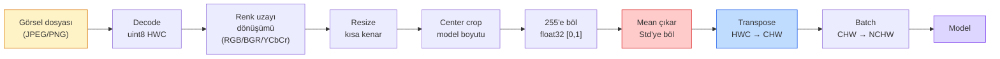
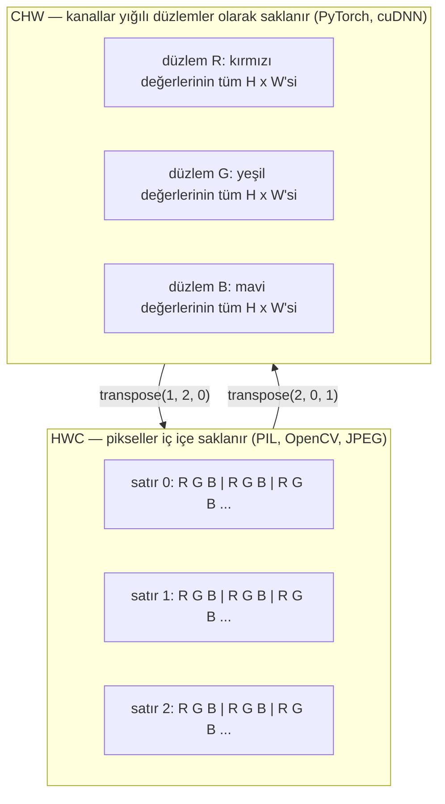

# Görsel Temelleri — Pikseller, Kanallar, Renk Uzayları

> Bir görsel, ışık örneklerinin tensörüdür. Kullanacağın her görü modeli bu tek gerçeklikten başlar.

**Tür:** Yapım
**Diller:** Python
**Ön koşullar:** Faz 1 Ders 12 (Tensor İşlemleri), Faz 3 Ders 11 (PyTorch'a Giriş)
**Süre:** ~45 dakika

## Öğrenme Hedefleri

- Sürekli bir sahnenin nasıl piksellere ayrıklaştırıldığını ve sampling/quantization kararlarının her downstream modelin tavanını nasıl belirlediğini açıkla
- Görselleri NumPy dizileri olarak oku, dilimle ve incele; HWC ile CHW yerleşimleri arasında akıcı şekilde geçiş yap
- RGB, grayscale, HSV ve YCbCr arasında dönüşüm yap ve her renk uzayının neden var olduğunu açıkla
- Piksel düzeyinde önişlemeyi (normalize, standardize, resize, channel-first) tam olarak torchvision'ın beklediği şekilde uygula

## Sorun

Okuyacağın her makale, indireceğin her pretrained weight, çağıracağın her görü API'si girdinin belirli bir encoding'ini varsayar. Modelin `float32` istediği yerde `uint8` görsel gönder; yine çalışır — ve sessizce çöp üretir. RGB üzerinde eğitilmiş bir ağa BGR ver, doğruluk on puan düşer. Modele channels-first beklediği yerde channels-last girdi ver; ilk conv katmanı yüksekliği bir feature channel olarak işler. Bunların hiçbiri hata fırlatmaz. Sadece metriklerini mahveder ve bir haftayı dosyayı nasıl yüklediğinden kaynaklanan bir bug'ı aramakla geçirirsin.

Convolution, üzerinde ne kayıldığını bildiğinde karmaşık değildir. Asıl zor olan, "bir görsel"in kamera, JPEG decoder, PIL, OpenCV, torchvision ve bir CUDA kernel için farklı şeyler ifade etmesidir. Her yığının kendi eksen sırası, byte aralığı ve kanal konvansiyonu vardır. Bunları toparlayamayan bir görü mühendisi bozuk pipeline'lar yayınlar.

Bu ders, fazın geri kalanının üzerine inşa edebilmesi için temeli sağlamlaştırır. Sonunda bir pikselin ne olduğunu, neden piksel başına bir yerine üç sayı olduğunu, "ImageNet istatistikleriyle normalize et"in aslında ne yaptığını ve bu fazdaki diğer her dersin varsayacağı iki ya da üç yerleşim arasında nasıl geçiş yapılacağını bileceksin.

## Kavram

### Bir bakışta tam önişleme pipeline'ı

Her üretim görü sistemi aynı tersinir dönüşüm dizisidir. Bir adımı yanlış yap, model eğitildiğinden farklı bir girdi görür.



Kırmızı ve mavi kutular sessiz başarısızlıkların %80'inin yaşandığı yerdir: eksik standardizasyon ve yanlış yerleşim.

### Bir piksel bir karedir değil, bir örnektir

Bir kamera sensörü, ufak detektörlerden oluşan bir ızgaraya çarpan fotonları sayar. Her detektör saniyenin bir kesri kadar ışığı entegre eder ve kaç fotonun çarptığıyla orantılı bir voltaj yayar. Sensör daha sonra bu voltajı bir tam sayıya ayrıklaştırır. Bir detektör bir piksele dönüşür.

```
Sürekli sahne                   Sensör ızgarası                Dijital görsel
(sonsuz detay)                  (H x W detektör)                (H x W tam sayı)

    ~~~~~                        +--+--+--+--+--+                 210 198 180 155 120
   ~   ~   ~                     |  |  |  |  |  |                 205 195 178 152 118
  ~ ışık ~      ---->            +--+--+--+--+--+     ---->       200 190 175 150 115
   ~~~~~                         |  |  |  |  |  |                 195 185 170 148 112
                                 +--+--+--+--+--+                 188 180 165 145 108
```

Bu adımda iki seçim olur ve downstream her şeyin tavanını bunlar belirler:

- **Uzaysal sampling** sahnenin derecesi başına kaç detektör olduğuna karar verir. Çok az olursa kenarlar tırtıklı olur (aliasing). Çok fazla olursa depolama ve compute patlar.
- **Yoğunluk quantization** voltajın ne kadar ince kovalandığına karar verir. 8 bit 256 seviye verir, display için standarttır. 10, 12, 16 bit daha yumuşak gradyanlar verir; tıbbi görüntüleme, HDR ve ham sensör pipeline'ları için önemlidir.

Bir piksel alanı olan renkli bir kare değildir. Tek bir ölçümdür. Resize ya da rotate yaptığında bu ölçüm ızgarasını yeniden örnekliyorsundur.

### Neden üç kanal

Bir detektör görünür spektrum boyunca fotonları sayar — bu grayscale'dir. Renk elde etmek için sensör, ızgarayı kırmızı, yeşil ve mavi filtrelerden oluşan bir mozaikle örter. Demosaicing sonrasında her uzaysal konumun üç tam sayısı vardır: kırmızı filtreli detektörün, yeşil filtrelinin ve mavi filtrelinin yakınındaki yanıtları. Bu üç tam sayı bir pikselin RGB üçlüsüdür.

```
Bellekte bir piksel:

    (R, G, B) = (210, 140, 30)   <- kırmızımsı-turuncu

H x W bir RGB görsel:

    shape (H, W, 3)     şu şekilde saklanır:   W pikselli H satır, 3 değer
                                                her biri uint8 için [0, 255]
```

Üç sihir değildir. Depth kameraları bir Z kanalı ekler. Uydular kızılötesi ve morötesi bantlar ekler. Tıbbi taramaların genellikle tek kanalı (X-ışını, BT) ya da çok kanalı (hiperspektral) vardır. Kanal sayısı son eksendir; conv katmanları onun üzerinden karışmayı öğrenir.

### İki yerleşim konvansiyonu: HWC ve CHW

Aynı tensor, iki sıralama. Her kütüphane birini seçer.

```
HWC (height, width, channels)           CHW (channels, height, width)

   W ->                                    H ->
  +-----+-----+-----+                     +-----+-----+
H |R G B|R G B|R G B|                   C |R R R R R R|
| +-----+-----+-----+                   | +-----+-----+
v |R G B|R G B|R G B|                   v |G G G G G G|
  +-----+-----+-----+                     +-----+-----+
                                          |B B B B B B|
                                          +-----+-----+

   PIL, OpenCV, matplotlib,              PyTorch, çoğu derin öğrenme
   diskteki neredeyse tüm görsel         framework'ü, cuDNN kernelleri
```

CHW var çünkü convolution kernel'ları H ve W üzerinde kayar. Kanal eksenini ön tarafta tutmak, her kernel'in kanal başına bitişik bir 2D düzlem görmesi anlamına gelir; bu da temiz bir şekilde vektörleşir. Disk formatları HWC'yi tutar çünkü bu, scanline'ların sensörden nasıl çıktığına uyar.

Bin kez yazacağın tek satırlık dönüşüm:

```
img_chw = img_hwc.transpose(2, 0, 1)      # NumPy
img_chw = img_hwc.permute(2, 0, 1)        # PyTorch tensor
```

Bellek yerleşimi, görselleştirilmiş:



### Byte aralıkları ve dtype

Üç konvansiyon baskındır:

| Konvansiyon | dtype | Aralık | Nerede görürsün |
|------------|-------|-------|------------------|
| Ham | `uint8` | [0, 255] | Diskteki dosyalar, PIL, OpenCV çıktısı |
| Normalize | `float32` | [0.0, 1.0] | `img.astype('float32') / 255` sonrası |
| Standardize | `float32` | yaklaşık [-2, +2] | Mean çıkarıp std'ye böldükten sonra |

Convolutional ağlar standardize girdiler üzerinde eğitilmiştir. ImageNet istatistikleri `mean=[0.485, 0.456, 0.406]`, `std=[0.229, 0.224, 0.225]`, tam ImageNet eğitim seti üzerindeki üç kanalın aritmetik ortalaması ve standart sapmasıdır; [0, 1] normalize piksellerde hesaplanmıştır. Standardize float bekleyen bir modele ham `uint8` beslemek, uygulamalı görüde en yaygın sessiz başarısızlıktır.

### Renk uzayları ve neden var oldukları

RGB capture formatıdır ama her zaman bir model için en kullanışlı temsil değildir.

```
 RGB               HSV                       YCbCr / YUV

 R red             H hue (açı 0-360)         Y luminance (parlaklık)
 G green           S saturation (0-1)        Cb chroma blue-yellow
 B blue            V value/brightness (0-1)  Cr chroma red-green

 Lineer            Rengi parlaklıktan        Parlaklığı renkten
 sensör çıktısı    ayırır. Renk tabanlı      ayırır. JPEG ve çoğu video
                   thresholding, UI          codec'i chroma kanallarını
                   slider'lar, basit         daha fazla sıkıştırır çünkü
                   filtreler için faydalı    insan gözü chroma detayına
                                             Y'ye olduğundan daha az
                                             duyarlıdır.
```

Çoğu modern CNN için RGB beslersin. Diğer uzaylarla şu durumlarda karşılaşırsın:

- **HSV** — klasik CV kodu, renk tabanlı segmentasyon, white-balancing.
- **YCbCr** — JPEG iç yapısını okumak, video pipeline'ları, yalnızca Y üzerinde çalışan süper çözünürlük modelleri.
- **Grayscale** — OCR, doküman modelleri, rengin sinyal değil rahatsızlık değişkeni olduğu her durum.

RGB'den grayscale'e dönüşüm bir ortalama değil, ağırlıklı toplamdır çünkü insan gözü yeşile kırmızı ya da maviden daha duyarlıdır:

```
Y = 0.299 R + 0.587 G + 0.114 B       (ITU-R BT.601, klasik ağırlıklar)
```

### Aspect ratio, resizing ve interpolation

Her modelin sabit bir girdi boyutu vardır (çoğu ImageNet sınıflandırıcı için 224x224, modern detektörler için 384x384 ya da 512x512). Görsellerin bunlara nadiren uyar. Önemli üç resize seçeneği:

- **Kısa kenarı resize et, sonra center crop** — standart ImageNet tarifi. Aspect ratio'yu korur, bir şerit kenar pikseli atar.
- **Resize et ve pad'le** — aspect ratio'yu ve her pikseli korur, siyah bantlar ekler. Detection ve OCR için standart.
- **Doğrudan hedefe resize et** — görseli esnetir. Ucuz, geometriyi bozar, birçok sınıflandırma görevi için yeterli.

Interpolation metodu, yeni ızgara eskisiyle hizalı değilken ara piksellerin nasıl hesaplanacağına karar verir:

```
Nearest neighbour     en hızlı, bloklu, mask/label için tek seçenek
Bilinear              hızlı, pürüzsüz, çoğu görsel resize için varsayılan
Bicubic               daha yavaş, upscaling'de daha keskin
Lanczos               en yavaş, en iyi kalite, son display için kullanılır
```

Kural: eğitim için bilinear, görsel asset'ler için bicubic ya da lanczos, tam sayı sınıf ID'leri içeren herhangi bir şey için nearest.

## İnşa Et

### Adım 1: Bir görseli yükle ve şeklini incele

Pillow ile herhangi bir JPEG ya da PNG yükle, NumPy'a dönüştür ve elde ettiğini yazdır. Offline çalışan deterministik bir örnek için bir tane sentezle.

```python
import numpy as np
from PIL import Image

def synthetic_rgb(h=128, w=192, seed=0):
    rng = np.random.default_rng(seed)
    yy, xx = np.meshgrid(np.linspace(0, 1, h), np.linspace(0, 1, w), indexing="ij")
    r = (np.sin(xx * 6) * 0.5 + 0.5) * 255
    g = yy * 255
    b = (1 - yy) * xx * 255
    rgb = np.stack([r, g, b], axis=-1) + rng.normal(0, 6, (h, w, 3))
    return np.clip(rgb, 0, 255).astype(np.uint8)

arr = synthetic_rgb()
# Ya da diskten yükle:
# arr = np.asarray(Image.open("your_image.jpg").convert("RGB"))

print(f"type:   {type(arr).__name__}")
print(f"dtype:  {arr.dtype}")
print(f"shape:  {arr.shape}     # (H, W, C)")
print(f"min:    {arr.min()}")
print(f"max:    {arr.max()}")
print(f"(0, 0)'daki piksel: {arr[0, 0]}")
```

Beklenen çıktı: `shape: (H, W, 3)`, `dtype: uint8`, aralık `[0, 255]`. Byte'lar bir kameradan, bir JPEG decoder'dan ya da bir sentetik generator'dan gelse de bu, canonical disk üzerindeki temsildir.

### Adım 2: Kanalları ayır ve yerleşimi yeniden sırala

R, G, B'yi ayrı ayrı çıkar, sonra PyTorch için HWC'den CHW'ye dönüştür.

```python
R = arr[:, :, 0]
G = arr[:, :, 1]
B = arr[:, :, 2]
print(f"R shape: {R.shape}, mean: {R.mean():.1f}")
print(f"G shape: {G.shape}, mean: {G.mean():.1f}")
print(f"B shape: {B.shape}, mean: {B.mean():.1f}")

arr_chw = arr.transpose(2, 0, 1)
print(f"\nHWC shape: {arr.shape}")
print(f"CHW shape: {arr_chw.shape}")
```

Kanal başına bir tane olmak üzere üç grayscale düzlem. CHW yalnızca eksenleri yeniden sıralar; bellek yerleşimi izin verdiğinde kesinlikle bir veri kopyalaması gerekmez.

### Adım 3: Grayscale ve HSV dönüşümleri

Ağırlıklı toplam grayscale, sonra manuel bir RGB-to-HSV.

```python
def rgb_to_grayscale(rgb):
    weights = np.array([0.299, 0.587, 0.114], dtype=np.float32)
    return (rgb.astype(np.float32) @ weights).astype(np.uint8)

def rgb_to_hsv(rgb):
    rgb_f = rgb.astype(np.float32) / 255.0
    r, g, b = rgb_f[..., 0], rgb_f[..., 1], rgb_f[..., 2]
    cmax = np.max(rgb_f, axis=-1)
    cmin = np.min(rgb_f, axis=-1)
    delta = cmax - cmin

    h = np.zeros_like(cmax)
    mask = delta > 0
    rmax = mask & (cmax == r)
    gmax = mask & (cmax == g)
    bmax = mask & (cmax == b)
    h[rmax] = ((g[rmax] - b[rmax]) / delta[rmax]) % 6
    h[gmax] = ((b[gmax] - r[gmax]) / delta[gmax]) + 2
    h[bmax] = ((r[bmax] - g[bmax]) / delta[bmax]) + 4
    h = h * 60.0

    s = np.where(cmax > 0, delta / cmax, 0)
    v = cmax
    return np.stack([h, s, v], axis=-1)

gray = rgb_to_grayscale(arr)
hsv = rgb_to_hsv(arr)
print(f"gray shape: {gray.shape}, range: [{gray.min()}, {gray.max()}]")
print(f"hsv   shape: {hsv.shape}")
print(f"hue range: [{hsv[..., 0].min():.1f}, {hsv[..., 0].max():.1f}] degrees")
print(f"sat range: [{hsv[..., 1].min():.2f}, {hsv[..., 1].max():.2f}]")
print(f"val range: [{hsv[..., 2].min():.2f}, {hsv[..., 2].max():.2f}]")
```

Hue derece cinsinden çıkar, saturation ve value [0, 1] aralığında. Bu OpenCV `hsv_full` konvansiyonuna uyar.

### Adım 4: Normalize et, standardize et ve tersini al

Ham byte'lardan, pretrained bir ImageNet modelinin beklediği tam tensor'a git, sonra geri dön.

```python
mean = np.array([0.485, 0.456, 0.406], dtype=np.float32)
std = np.array([0.229, 0.224, 0.225], dtype=np.float32)

def preprocess_imagenet(rgb_uint8):
    x = rgb_uint8.astype(np.float32) / 255.0
    x = (x - mean) / std
    x = x.transpose(2, 0, 1)
    return x

def deprocess_imagenet(chw_float32):
    x = chw_float32.transpose(1, 2, 0)
    x = x * std + mean
    x = np.clip(x * 255.0, 0, 255).astype(np.uint8)
    return x

x = preprocess_imagenet(arr)
print(f"önişlenmiş shape: {x.shape}     # (C, H, W)")
print(f"önişlenmiş dtype: {x.dtype}")
print(f"kanal başına önişlenmiş mean:  {x.mean(axis=(1, 2)).round(3)}")
print(f"kanal başına önişlenmiş std:   {x.std(axis=(1, 2)).round(3)}")

roundtrip = deprocess_imagenet(x)
max_diff = np.abs(roundtrip.astype(int) - arr.astype(int)).max()
print(f"roundtrip max piksel farkı: {max_diff}    # 0 ya da 1 olmalı")
```

Kanal başına mean sıfıra yakın, std bire yakın olmalı. Preprocess/deprocess çifti, tam olarak her torchvision `transforms.Normalize` çağrısının altta yaptığı şeydir.

### Adım 5: Üç interpolation yöntemiyle resize

Fark görünür olsun diye bir upscale üzerinde nearest, bilinear ve bicubic'i karşılaştır.

```python
target = (arr.shape[0] * 3, arr.shape[1] * 3)

nearest = np.asarray(Image.fromarray(arr).resize(target[::-1], Image.NEAREST))
bilinear = np.asarray(Image.fromarray(arr).resize(target[::-1], Image.BILINEAR))
bicubic = np.asarray(Image.fromarray(arr).resize(target[::-1], Image.BICUBIC))

def local_roughness(x):
    gy = np.diff(x.astype(float), axis=0)
    gx = np.diff(x.astype(float), axis=1)
    return float(np.abs(gy).mean() + np.abs(gx).mean())

for name, out in [("nearest", nearest), ("bilinear", bilinear), ("bicubic", bicubic)]:
    print(f"{name:>8}  shape={out.shape}  roughness={local_roughness(out):6.2f}")
```

Nearest, sert kenarları koruduğu için roughness'ta en yüksek puanı alır. Bilinear en pürüzsüzdür. Bicubic arada durur; merdiven artefaktları olmadan algılanan keskinliği korur.

## Kullan

`torchvision.transforms` yukarıdaki her şeyi tek bir bileştirilebilir pipeline'da paketler. Aşağıdaki kod, `preprocess_imagenet`'in yaptığı şeyi artı resize ve crop'u tam olarak yeniden üretir.

```python
import torch
from torchvision import transforms
from PIL import Image

img = Image.fromarray(synthetic_rgb(256, 256))

pipeline = transforms.Compose([
    transforms.Resize(256),
    transforms.CenterCrop(224),
    transforms.ToTensor(),
    transforms.Normalize(mean=[0.485, 0.456, 0.406], std=[0.229, 0.224, 0.225]),
])

x = pipeline(img)
print(f"tensor type:  {type(x).__name__}")
print(f"tensor dtype: {x.dtype}")
print(f"tensor shape: {tuple(x.shape)}      # (C, H, W)")
print(f"kanal başına mean: {x.mean(dim=(1, 2)).tolist()}")
print(f"kanal başına std:  {x.std(dim=(1, 2)).tolist()}")

batch = x.unsqueeze(0)
print(f"\nbatched shape: {tuple(batch.shape)}   # (N, C, H, W) — model için hazır")
```

Bu tam sırayla dört adım: `Resize(256)` kısa kenarı 256'ya ölçekler; `CenterCrop(224)` ortadan 224x224'lük bir patch alır; `ToTensor()` 255'e böler ve HWC'yi CHW'ye değiştirir; `Normalize` ImageNet mean'ini çıkarır ve std'ye böler. Bu sırayı tersine çevirmek modele neyin ulaştığını sessizce değiştirir.

## Yayınla

Bu ders şunları üretir:

- `outputs/prompt-vision-preprocessing-audit.md` — herhangi bir model card ya da dataset card'ı, bir ekibin uyması gereken tam önişleme invariant'larının checklist'ine çeviren bir prompt.
- `outputs/skill-image-tensor-inspector.md` — herhangi bir görsel-şekilli tensor ya da array verildiğinde dtype, layout, range ve onun ham mı, normalize mi yoksa standardize mi göründüğünü raporlayan bir skill.

## Alıştırmalar

1. **(Kolay)** Bir JPEG'i OpenCV (`cv2.imread`) ve Pillow ile yükle. Her ikisinin shape'ini ve `(0, 0)` pikselini yazdır. Kanal sırası farkını açıkla, sonra OpenCV array'ini Pillow array'i ile aynı yapan tek satırlık bir dönüşüm yaz.
2. **(Orta)** `standardize(img, mean, std)` ve ters fonksiyonunu yaz; ikisi birlikte herhangi bir uint8 görselde `roundtrip_max_diff <= 1` testini geçsin. Fonksiyonların aynı çağrıyla HWC'deki tek bir görselde ve NCHW'deki bir batch'te çalışmalı.
3. **(Zor)** ImageNet-standardize edilmiş 3 kanallı bir tensor al ve RGB'nin tek bir grayscale kanala ağırlıklı karışımını öğrenen bir 1x1 conv'den geçir. Ağırlıkları `[0.299, 0.587, 0.114]` olarak ilklendir, dondur ve çıktının manuel `rgb_to_grayscale`'inle floating-point hata içinde eşleştiğini doğrula. Başka hangi klasik renk uzayı dönüşümleri 1x1 convolution olarak yazılabilir?

## Anahtar Terimler

| Terim | İnsanlar ne diyor | Gerçekte ne anlama geliyor |
|------|----------------|----------------------|
| Piksel | "Renkli bir kare" | Bir ızgara konumunda tek bir ışık yoğunluğu örneği — renk için üç sayı, grayscale için bir |
| Kanal | "Renk" | Bir görsel tensor'a yığılmış paralel uzaysal ızgaralardan biri; HWC'de son eksen, CHW'de ilk |
| HWC / CHW | "Shape" | Bir görsel tensor için eksen sıralamaları; disk ve PIL HWC kullanır, PyTorch ve cuDNN CHW kullanır |
| Normalize | "Görseli ölçekle" | Pikseller [0, 1]'de yaşasın diye 255'e böl — gerekli ama yeterli değil |
| Standardize | "Sıfır-merkezle" | Girdi dağılımı modelin eğitildiği şeye uysun diye kanal başına mean çıkar ve std'ye böl |
| Grayscale dönüşümü | "Kanalları ortala" | İnsan luminans algısına uyan 0.299/0.587/0.114 katsayılarıyla ağırlıklı toplam |
| Interpolation | "Resize'ın pikselleri nasıl seçtiği" | Yeni ızgara eskisiyle hizalı değilken çıktı değerlerine karar veren kural — etiketler için nearest, eğitim için bilinear, display için bicubic |
| Aspect ratio | "Genişlik bölü yükseklik" | "Resize ve pad"i "resize ve stretch"ten ayıran oran |

## İleri Okuma

- [Charles Poynton — A Guided Tour of Color Space](https://poynton.ca/PDFs/Guided_tour.pdf) — neden bu kadar çok renk uzayı olduğuna ve her birinin ne zaman önemli olduğuna dair en net teknik anlatım
- [PyTorch Vision Transforms Docs](https://pytorch.org/vision/stable/transforms.html) — üretimde aslında bileştireceğin tam transforms pipeline'ı
- [How JPEG Works (Colt McAnlis)](https://www.youtube.com/watch?v=F1kYBnY6mwg) — chroma subsampling, DCT ve JPEG'in RGB yerine neden YCbCr encode ettiğine dair keskin görsel tur
- [ImageNet Preprocessing Conventions (torchvision models)](https://pytorch.org/vision/stable/models.html) — `mean=[0.485, 0.456, 0.406]` ve zoo'daki her modelin neden bunu beklediğinin doğru kaynağı
