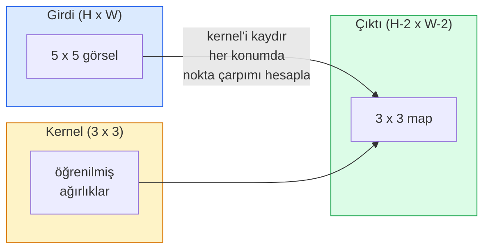
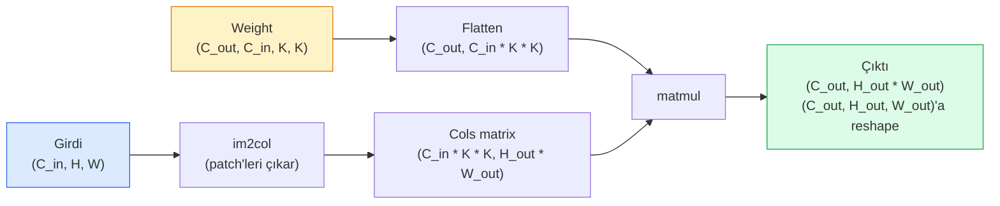

# Sıfırdan Convolutions

> Bir convolution, görsel boyunca kaydırdığın ve her konumda aynı ağırlıkları paylaşan ufak bir dense katmandır.

**Tür:** Yapım
**Diller:** Python
**Ön koşullar:** Faz 3 (Derin Öğrenme Çekirdeği), Faz 4 Ders 01 (Görsel Temelleri)
**Süre:** ~75 dakika

## Öğrenme Hedefleri

- Yalnızca NumPy kullanarak sıfırdan 2D convolution uygula; nested-loop versiyonu ve vektörize edilmiş `im2col` versiyonu dahil
- Girdi boyutu, kernel boyutu, padding ve stride'ın herhangi bir kombinasyonu için çıktı uzaysal boyutunu hesapla ve `(H - K + 2P) / S + 1` formülünü açıkla
- Elle kernel tasarla (edge, blur, sharpen, Sobel) ve her birinin neden ürettiği aktivasyon kalıbını ürettiğini açıkla
- Convolution'ları bir feature extractor'a yığ ve yığının derinliğini receptive field'ın boyutuna bağla

## Sorun

224x224 RGB görseldeki fully connected bir katman, nöron başına 224 * 224 * 3 = 150.528 girdi ağırlığına ihtiyaç duyardı. 1.000 birimli tek bir gizli katman zaten 150 milyon parametredir — sen daha bir şey öğrenmeden önce. Daha da kötüsü, o katmanın sol üstteki bir köpekle sağ alttaki bir köpeğin aynı kalıp olduğuna dair bir kavramı yoktur. Her piksel konumunu bağımsız olarak ele alır; bu da görseller için tam olarak yanlıştır: bir kediyi üç piksel kaydırmak ağı kavramı yeniden öğrenmeye zorlamamalıdır.

Bir görsel modelinin ihtiyaç duyduğu iki özellik **translation equivariance** (girdi kaydığında çıktı kayar) ve **parameter sharing** (aynı feature detector her yerde çalışır). Dense katmanlar bunların hiçbirini vermez. Convolution ikisini de bedavaya verir.

Convolution derin öğrenme için icat edilmemişti. JPEG sıkıştırmasını, Photoshop'ta Gaussian blur'u, endüstriyel görüde edge detection'ı ve şimdiye kadar yayınlanmış her ses filtresini güçlendiren operasyonun aynısıdır. CNN'lerin 2012'den 2020'ye ImageNet'e hükmetmesinin nedeni, convolution'ın yakın değerlerin ilişkili olduğu ve aynı kalıbın her yerde görünebileceği veriler için doğru prior olmasıdır.

## Kavram

### Bir kernel, kayan

Bir 2D convolution, kernel (ya da filtre) adı verilen küçük bir ağırlık matrisini alır, girdi boyunca kaydırır ve her konumda eleman-wise çarpımların toplamını hesaplar. O toplam bir çıktı pikseli olur.



5x5 bir girdide somut bir 3x3 örnek (padding yok, stride 1):

```
Girdi X (5 x 5):                Kernel W (3 x 3):

  1  2  0  1  2                   1  0 -1
  0  1  3  1  0                   2  0 -2
  2  1  0  2  1                   1  0 -1
  1  0  2  1  3
  2  1  1  0  1

Kernel her geçerli 3 x 3 pencere üzerinde kayar. Çıktı Y 3 x 3:

 Y[0,0] = sum( W * X[0:3, 0:3] )
 Y[0,1] = sum( W * X[0:3, 1:4] )
 Y[0,2] = sum( W * X[0:3, 2:5] )
 Y[1,0] = sum( W * X[1:4, 0:3] )
 ... ve böyle devam eder
```

O tek formül — **paylaşılan ağırlıklar, locality, kayan pencere** — tüm fikrin kendisidir. Geri kalan her şey muhasebedir.

### Çıktı boyutu formülü

Girdi uzaysal boyutu `H`, kernel boyutu `K`, padding `P`, stride `S` verildiğinde:

```
H_out = floor( (H - K + 2P) / S ) + 1
```

Bunu ezberle. Mimari başına onlarca kez hesaplayacaksın.

| Senaryo | H | K | P | S | H_out |
|----------|---|---|---|---|-------|
| Valid conv, padding yok | 32 | 3 | 0 | 1 | 30 |
| Same conv (boyutu korur) | 32 | 3 | 1 | 1 | 32 |
| 2 ile downsample | 32 | 3 | 1 | 2 | 16 |
| Pool 2x2 | 32 | 2 | 0 | 2 | 16 |
| Geniş receptive field | 32 | 7 | 3 | 2 | 16 |

"Same padding", S == 1 olduğunda H_out == H olacak şekilde P seçmek demektir. Tek K için bu P = (K - 1) / 2'dir. 3x3 kernel'lerin baskın olmasının nedeni budur — hâlâ merkezi olan en küçük tek kernel'dir.

### Padding

Padding olmadan her convolution feature map'i küçültür. 20 tane yığ ve 224x224 görselin 184x184 olur; bu kenarda compute israfı yapar ve eşleşen şekillere ihtiyaç duyan residual bağlantıları karmaşıklaştırır.

```
5 x 5 girdi üzerinde sıfır padding (P = 1):

  0  0  0  0  0  0  0
  0  1  2  0  1  2  0
  0  0  1  3  1  0  0
  0  2  1  0  2  1  0       Şimdi kernel (0, 0) pikseli üzerinde
  0  1  0  2  1  3  0       merkezlenebilir ve hâlâ çarpmak için
  0  2  1  1  0  1  0       üç satır ve üç sütun değere sahiptir.
  0  0  0  0  0  0  0
```

Pratikte karşılaşacağın modlar: `zero` (en yaygın), `reflect` (kenarı aynalar, generative modellerde sert sınırlardan kaçınır), `replicate` (kenarı kopyalar), `circular` (etrafından dolanır, toroidal problemlerde kullanılır).

### Stride

Stride, kaydırmanın adım boyutudur. `stride=1` varsayılandır. `stride=2` uzaysal boyutları yarıya indirir ve ayrı bir pooling katmanı olmadan bir CNN içinde downsample yapmanın klasik yoludur — her modern mimari (ResNet, ConvNeXt, MobileNet) bir yerde max-pool yerine strided conv kullanır.

```
5 x 5 girdi, 3 x 3 kernel'de stride 1:

  başlangıçlar: (0,0) (0,1) (0,2)        -> çıktı satırı 0
                (1,0) (1,1) (1,2)        -> çıktı satırı 1
                (2,0) (2,1) (2,2)        -> çıktı satırı 2

  Çıktı: 3 x 3

Aynı girdide stride 2:

  başlangıçlar: (0,0) (0,2)              -> çıktı satırı 0
                (2,0) (2,2)              -> çıktı satırı 1

  Çıktı: 2 x 2
```

### Birden fazla input kanalı

Gerçek görsellerin üç kanalı vardır. RGB bir girdideki 3x3 convolution aslında bir 3x3x3 hacimdir: input kanal başına bir 3x3 dilim. Her uzaysal konumda üç dilimin hepsi üzerinde çarpıp toplarsın ve bir bias eklersin.

```
Girdi:    (C_in,  H,  W)        3 x 5 x 5
Kernel:   (C_in,  K,  K)        3 x 3 x 3 (bir kernel)
Çıktı:    (1,     H', W')       2D map

C_out output kanal üreten bir katman için C_out kernel yığarsın:

Weight:   (C_out, C_in, K, K)   örn. 64 x 3 x 3 x 3
Çıktı:    (C_out, H', W')       64 x 3 x 3

Parametre sayısı: C_out * C_in * K * K + C_out   (+ C_out bias'lardır)
```

Bu son satır, bir model planlarken hesaplayacağın satırdır. 3 kanal girdide 64 kanallı 3x3 conv `64 * 3 * 3 * 3 + 64 = 1.792` parametreye sahiptir. Ucuz.

### im2col hilesi

Nested loop'lar okuması kolay ama yavaştır. GPU'lar büyük matrix çarpımları ister. Hile: girdinin her receptive-field penceresini büyük bir matrisin tek bir sütununa düzleştir, kernel'i bir satıra düzleştir ve tüm convolution tek bir matmul olur.



Her üretim conv implementasyonu, bunun artı cache-tiling hilelerinin (direct conv, Winograd, büyük kernel'ler için FFT conv) bir varyantıdır. im2col'u anla ve çekirdeği anlarsın.

### Receptive field

Tek bir 3x3 conv 9 girdi pikseline bakar. İki 3x3 conv yığ ve ikinci katmandaki bir nöron 5x5 girdi pikseline bakar. Üç 3x3 conv 7x7 verir. Genel olarak:

```
L yığılmış K x K conv sonrası RF (stride 1) = 1 + L * (K - 1)

Stride'larla:   RF, her katman boyunca stride ile çarpımsal olarak büyür.
```

"3x3 her yere" yaklaşımının (VGG, ResNet, ConvNeXt) çalışmasının tüm nedeni, iki 3x3 conv'un bir 5x5 conv ile aynı girdi alanını görmesi, ancak daha az parametre ile ve aralarında ekstra bir non-linearity ile görmesidir.

## İnşa Et

### Adım 1: Bir array'i pad et

En küçük primitive ile başla: H x W bir array etrafına sıfırlarla pad eden bir fonksiyon.

```python
import numpy as np

def pad2d(x, p):
    if p == 0:
        return x
    h, w = x.shape[-2:]
    out = np.zeros(x.shape[:-2] + (h + 2 * p, w + 2 * p), dtype=x.dtype)
    out[..., p:p + h, p:p + w] = x
    return out

x = np.arange(9).reshape(3, 3)
print(x)
print()
print(pad2d(x, 1))
```

`x.shape[:-2]` trailing-axes hilesi, aynı fonksiyonun `(H, W)`, `(C, H, W)` ya da `(N, C, H, W)` üzerinde modifiye edilmeden çalışması anlamına gelir.

### Adım 2: Nested loop'larla 2D convolution

Referans implementasyon — yavaş, ama belirsiz değil. Bu, prensipte `torch.nn.functional.conv2d`'nin yaptığıdır.

```python
def conv2d_naive(x, w, b=None, stride=1, padding=0):
    c_in, h, w_in = x.shape
    c_out, c_in_w, kh, kw = w.shape
    assert c_in == c_in_w

    x_pad = pad2d(x, padding)
    h_out = (h + 2 * padding - kh) // stride + 1
    w_out = (w_in + 2 * padding - kw) // stride + 1

    out = np.zeros((c_out, h_out, w_out), dtype=np.float32)
    for oc in range(c_out):
        for i in range(h_out):
            for j in range(w_out):
                hs = i * stride
                ws = j * stride
                patch = x_pad[:, hs:hs + kh, ws:ws + kw]
                out[oc, i, j] = np.sum(patch * w[oc])
        if b is not None:
            out[oc] += b[oc]
    return out
```

Dört nested loop (output channel, satır, sütun, artı C_in, kh, kw üzerinden implicit toplam). Bu, her daha hızlı implementasyonu karşılaştıracağın ground truth'tur.

### Adım 3: Elle tasarlanmış bir kernel'le doğrula

Bir dikey Sobel kernel kur, sentetik bir step görsele uygula ve dikey kenarın yandığını izle.

```python
def synthetic_step_image():
    img = np.zeros((1, 16, 16), dtype=np.float32)
    img[:, :, 8:] = 1.0
    return img

sobel_x = np.array([
    [[-1, 0, 1],
     [-2, 0, 2],
     [-1, 0, 1]]
], dtype=np.float32)[None]

x = synthetic_step_image()
y = conv2d_naive(x, sobel_x, padding=1)
print(y[0].round(1))
```

7. sütunda büyük pozitif değerler (sol-sağ parlaklık artışı) ve diğer her yerde sıfırlar bekle. O tek print, matematiğin doğru olduğunun sağlık kontrolüdür.

### Adım 4: im2col

Girdideki her kernel boyutundaki pencereyi bir matrisin sütununa dönüştür. `C_in=3, K=3` için her sütun 27 sayıdır.

```python
def im2col(x, kh, kw, stride=1, padding=0):
    c_in, h, w = x.shape
    x_pad = pad2d(x, padding)
    h_out = (h + 2 * padding - kh) // stride + 1
    w_out = (w + 2 * padding - kw) // stride + 1

    cols = np.zeros((c_in * kh * kw, h_out * w_out), dtype=x.dtype)
    col = 0
    for i in range(h_out):
        for j in range(w_out):
            hs = i * stride
            ws = j * stride
            patch = x_pad[:, hs:hs + kh, ws:ws + kw]
            cols[:, col] = patch.reshape(-1)
            col += 1
    return cols, h_out, w_out
```

Hâlâ bir Python loop, ama şimdi ağır iş tek bir vektörize matmul olacak.

### Adım 5: im2col + matmul ile hızlı conv

Dörtlü loop'u tek bir matrix çarpımıyla değiştir.

```python
def conv2d_im2col(x, w, b=None, stride=1, padding=0):
    c_out, c_in, kh, kw = w.shape
    cols, h_out, w_out = im2col(x, kh, kw, stride, padding)
    w_flat = w.reshape(c_out, -1)
    out = w_flat @ cols
    if b is not None:
        out += b[:, None]
    return out.reshape(c_out, h_out, w_out)
```

Doğruluk kontrolü: her iki implementasyonu çalıştır ve karşılaştır.

```python
rng = np.random.default_rng(0)
x = rng.normal(0, 1, (3, 16, 16)).astype(np.float32)
w = rng.normal(0, 1, (8, 3, 3, 3)).astype(np.float32)
b = rng.normal(0, 1, (8,)).astype(np.float32)

y_naive = conv2d_naive(x, w, b, padding=1)
y_im2col = conv2d_im2col(x, w, b, padding=1)

print(f"max abs diff: {np.max(np.abs(y_naive - y_im2col)):.2e}")
```

`max abs diff` `1e-5` civarında olmalı — fark, bug değil floating-point accumulation sırasıdır.

### Adım 6: Elle tasarlanmış kernel'lerden oluşan bir banka

Tek bir conv katmanının herhangi bir eğitim öncesinde neyi ifade edebileceğini gösteren beş filtre.

```python
KERNELS = {
    "identity": np.array([[0, 0, 0], [0, 1, 0], [0, 0, 0]], dtype=np.float32),
    "blur_3x3": np.ones((3, 3), dtype=np.float32) / 9.0,
    "sharpen": np.array([[0, -1, 0], [-1, 5, -1], [0, -1, 0]], dtype=np.float32),
    "sobel_x": np.array([[-1, 0, 1], [-2, 0, 2], [-1, 0, 1]], dtype=np.float32),
    "sobel_y": np.array([[-1, -2, -1], [0, 0, 0], [1, 2, 1]], dtype=np.float32),
}

def apply_kernel(img2d, kernel):
    x = img2d[None].astype(np.float32)
    w = kernel[None, None]
    return conv2d_im2col(x, w, padding=1)[0]
```

Herhangi bir grayscale görsele uygulandığında, blur yumuşatır, sharpen kenarları belirginleştirir, Sobel-x dikey kenarları yakar, Sobel-y yatay kenarları yakar. Bunlar tam olarak AlexNet ve VGG'deki *ilk* eğitimli conv katmanının öğrenmiş olduğu kalıplardır — çünkü iyi bir görsel modeli sonradan hangi görev gelirse gelsin edge ve blob detector'larına ihtiyaç duyar.

## Kullan

PyTorch'un `nn.Conv2d`'si aynı operasyonu autograd, CUDA kernel'ları ve cuDNN optimizasyonu ile sarar. Shape semantikleri aynıdır.

```python
import torch
import torch.nn as nn

conv = nn.Conv2d(in_channels=3, out_channels=64, kernel_size=3, stride=1, padding=1)
print(conv)
print(f"weight shape: {tuple(conv.weight.shape)}   # (C_out, C_in, K, K)")
print(f"bias shape:   {tuple(conv.bias.shape)}")
print(f"param count:  {sum(p.numel() for p in conv.parameters())}")

x = torch.randn(8, 3, 224, 224)
y = conv(x)
print(f"\ninput  shape: {tuple(x.shape)}")
print(f"output shape: {tuple(y.shape)}")
```

`padding=1`'i `padding=0` ile değiştir, çıktı 222x222'ye düşer. `stride=1`'i `stride=2` ile değiştir, 112x112'ye düşer. Yukarıda ezberlediğin formülün aynısı.

## Yayınla

Bu ders şunları üretir:

- `outputs/prompt-cnn-architect.md` — girdi boyutu, parametre bütçesi ve hedef receptive field verildiğinde her adımda doğru K/S/P ile bir `Conv2d` katman yığını tasarlayan bir prompt.
- `outputs/skill-conv-shape-calculator.md` — bir ağ spec'ini katman katman gezen ve her blok için output shape, receptive field ve parametre sayısını döndüren bir skill.

## Alıştırmalar

1. **(Kolay)** 128x128 grayscale girdi ve bir `[Conv3x3(s=1,p=1), Conv3x3(s=2,p=1), Conv3x3(s=1,p=1), Conv3x3(s=2,p=1)]` yığını verildiğinde, her katmandaki çıktı uzaysal boyutunu ve receptive field'ı elle hesapla. Dummy conv'lardan bir PyTorch `nn.Sequential` ile doğrula.
2. **(Orta)** `conv2d_naive` ve `conv2d_im2col`'u bir `groups` argümanı kabul edecek şekilde genişlet. `groups=C_in=C_out`'un bir depthwise convolution'ı yeniden ürettiğini ve parametre sayısının `C * C * K * K` yerine `C * K * K` olduğunu göster.
3. **(Zor)** `conv2d_im2col`'un backward pass'ini elle uygula: çıktının gradyanı verildiğinde, `x` ve `w`'nin gradyanlarını hesapla. Aynı girdiler ve ağırlıklar üzerinde `torch.autograd.grad`'a karşı doğrula. Hile: im2col'un gradyanı `col2im`'dir ve örtüşen pencereleri biriktirmek zorundadır.

## Anahtar Terimler

| Terim | İnsanlar ne diyor | Gerçekte ne anlama geliyor |
|------|----------------|----------------------|
| Convolution | "Bir filtre kaydırma" | Paylaşılan ağırlıklarla her uzaysal konumda uygulanan öğrenilebilir bir nokta çarpımı; matematiksel olarak bir cross-correlation, ama herkes ona convolution diyor |
| Kernel / filtre | "Feature detector" | (C_in, K, K) şeklinde, girdinin bir penceresiyle nokta çarpımı bir çıktı pikseli üreten küçük bir weight tensor |
| Stride | "Ne kadar atladığın" | Ardışık kernel yerleşimleri arasındaki adım boyutu; stride 2 her uzaysal boyutu yarıya indirir |
| Padding | "Kenarlardaki sıfırlar" | Kernel'in border pikseller üzerinde merkezlenebilmesi için girdinin etrafına eklenen ekstra değerler; `same` padding çıktı boyutunu girdi boyutuna eşit tutar |
| Receptive field | "Nöronun ne kadarını gördüğü" | Belirli bir çıktı aktivasyonunun bağlı olduğu orijinal girdi patch'i; derinlik ve stride ile büyür |
| im2col | "GEMM hilesi" | Her receptive penceresini sütunlara yeniden düzenlemek ki convolution büyük bir matrix çarpımı olsun — her hızlı conv kernel'ının özü |
| Depthwise conv | "Kanal başına bir kernel" | `groups == C_in` ile bir conv; her çıktı kanalını yalnızca eşleşen girdi kanalından hesaplar; MobileNet ve ConvNeXt'in omurgası |
| Translation equivariance | "Girdi kayarsa çıktı kayar" | Girdiyi k piksel kaydırmanın çıktıyı k piksel kaydırma özelliği; paylaşılan ağırlıklarla bedavaya gelir |

## İleri Okuma

- [A guide to convolution arithmetic for deep learning (Dumoulin & Visin, 2016)](https://arxiv.org/abs/1603.07285) — her kursun sessizce kopyaladığı padding/stride/dilation'ın kesin diyagramları
- [CS231n: Convolutional Neural Networks for Visual Recognition](https://cs231n.github.io/convolutional-networks/) — canonical ders notları, orijinal im2col açıklaması dahil
- [The Annotated ConvNet (fast.ai)](https://nbviewer.org/github/fastai/fastbook/blob/master/13_convolutions.ipynb) — manuel convolution'dan eğitilmiş bir rakam sınıflandırıcıya yürüyen bir notebook
- [Receptive Field Arithmetic for CNNs (Dang Ha The Hien)](https://distill.pub/2019/computing-receptive-fields/) — receptive field hesaplamalarının makale kalitesinde interaktif açıklayıcısı
