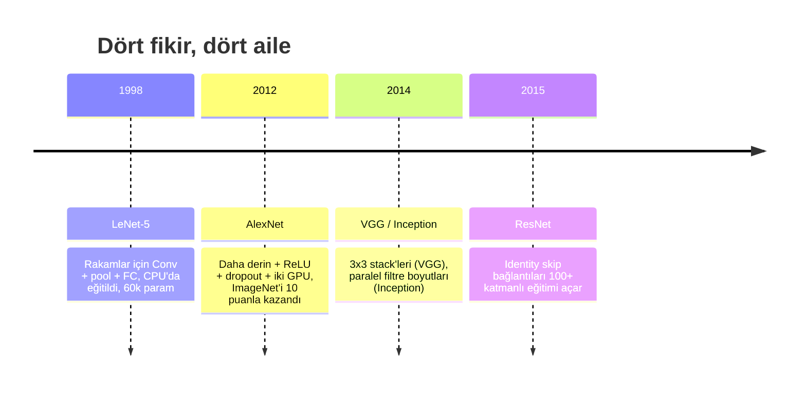
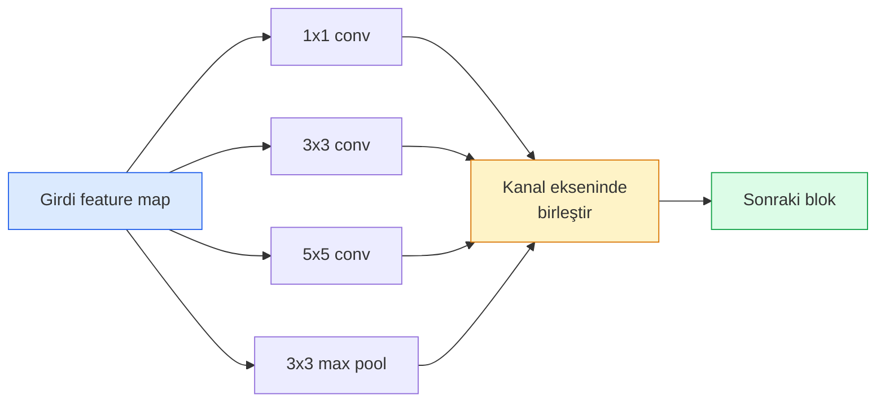
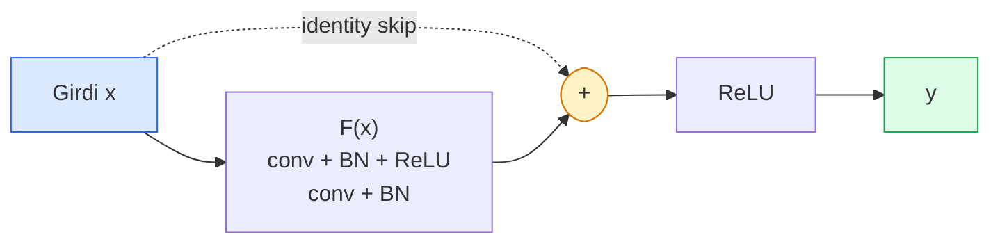

# CNN'ler — LeNet'ten ResNet'e

> Son otuz yılın her büyük CNN'i, üzerine yeni bir fikir eklenmiş aynı conv–nonlinearity–downsample tarifidir. Fikirleri sırasıyla öğren.

**Tür:** Öğrenim + Yapım
**Diller:** Python
**Ön koşullar:** Faz 3 Ders 11 (PyTorch), Faz 4 Ders 01 (Görsel Temelleri), Faz 4 Ders 02 (Sıfırdan Convolutions)
**Süre:** ~75 dakika

## Öğrenme Hedefleri

- LeNet-5 -> AlexNet -> VGG -> Inception -> ResNet mimari soykütüğünü izle ve her ailenin getirdiği tek yeni fikri belirt
- LeNet-5'i, VGG tarzı bir block'u ve bir ResNet BasicBlock'u PyTorch'ta her biri 40 satırın altında uygula
- Residual bağlantıların 1.000 katmanlı bir ağı neden eğitilemezden state-of-the-art'a çevirdiğini açıkla
- Modern bir backbone'u (ResNet-18, ResNet-50) oku ve kaynağa bakmadan önce çıktı şeklini, receptive field'ını ve parametre sayısını tahmin et

## Sorun

2011'de en iyi ImageNet sınıflandırıcısı yaklaşık %74 top-5 doğruluk aldı. 2012'de AlexNet %85 aldı. 2015'te ResNet %96 aldı. Yeni veri yok. Yeni GPU jenerasyonu yok. Kazanımlar mimari fikirlerden geldi. Çalışan bir görü mühendisi, hangi fikrin hangi makaleden geldiğini bilmek zorunda çünkü 2026'da yayınladığın her üretim backbone'u o aynı parçaların yeniden kombinasyonu — ve çünkü fikirler aktarılmaya devam ediyor: grouped conv'lar CNN'lerden transformer'lara, residual bağlantılar ResNet'ten varolan her LLM'e, batch normalisation diffusion modellerinde yaşıyor.

Bu ağları sırasıyla incelemek seni yaygın bir hatadan da korur: bir LeNet boyutundaki ağ problemi çözecekken eldeki en büyük modele uzanmak. MNIST bir ResNet'e ihtiyaç duymaz. Her ailenin scaling eğrisini bilmek, üzerinde nerede durman gerektiğini söyler.

## Kavram

### Görüyü değiştiren dört fikir



Klasik görüde başka hiçbir şey bu dört sıçrama kadar önemli değildi.

### LeNet-5 (1998)

Yann LeCun'un rakam tanıyıcısı. 60.000 parametre. İki conv-pool bloğu, iki fully connected katman, tanh aktivasyonları. Her CNN'in miras aldığı şablonu tanımladı:

```
input (1, 32, 32)
  conv 5x5 -> (6, 28, 28)
  avg pool 2x2 -> (6, 14, 14)
  conv 5x5 -> (16, 10, 10)
  avg pool 2x2 -> (16, 5, 5)
  flatten -> 400
  dense -> 120
  dense -> 84
  dense -> 10
```

Modern dünyanın CNN dediği her şey — küçük bir sınıflandırıcı kafasını besleyen alternatif convolutions ve downsampling — daha fazla katman, daha büyük kanallar ve daha iyi aktivasyonlarla LeNet'tir.

### AlexNet (2012)

ImageNet'i birlikte kıran üç değişiklik:

1. **ReLU** tanh yerine. Gradyanlar yok olmayı bırakır. Eğitim altı kat hızlanır.
2. **Dropout** fully connected kafada. Regularizasyon bir hile değil, bir katman olur.
3. **Derinlik ve genişlik**. Beş conv katman, üç dense katman, 60M parametre, modelin onlar arasında bölündüğü iki GPU üzerinde eğitildi.

Makalenin Figür 2'si hâlâ GPU bölünmesini iki paralel akış olarak gösterir. O paralellik bir donanım çözümüydü, mimari bir içgörü değil — ama yukarıdaki üç fikir hâlâ kullandığın her modelde var.

### VGG (2014)

VGG şunu sordu: yalnızca 3x3 convolution kullanır ve derine inersen ne olur?

```
stack:    conv 3x3 -> conv 3x3 -> pool 2x2
tekrar:   16 ya da 19 conv katman
```

İki 3x3 conv, bir 5x5 conv ile aynı 5x5 girdi alanını görür ama daha az parametre (2*9*C^2 = 18C^2 vs 25*C^2) ve aralarında ekstra bir ReLU ile. VGG bu gözlemi tüm bir mimariye dönüştürdü. Sadelik — tek tip blok, tekrarlandı — sonrasında gelen her şey için referans noktası yaptı.

Maliyet: 138M parametre, yavaş eğitim, çıkarımda pahalı.

### Inception (2014, aynı yıl)

Google'ın "hangi kernel boyutunu kullanmalıyım?" cevabı: hepsini, paralel olarak.



Her branch uzmanlaşır — kanal karışımı için 1x1, yerel doku için 3x3, daha geniş kalıplar için 5x5, shift-invariant özellikler için pooling — ve concat sonraki katmanın hangi branch faydalıysa onu seçmesine izin verir. Inception v1, parametre sayısını makul tutmak için her branch içinde bottleneck olarak 1x1 convolution kullandı.

### Degradation problemi

2015'e gelindiğinde VGG-19 çalışıyordu ve VGG-32 çalışmıyordu. Derinliğin yardımcı olması gerekiyordu, ama ~20 katmandan sonra hem eğitim hem test loss kötüleşiyordu. Bu overfitting değil. Bu, gradyanlar her katmanda çarpımsal olarak küçüldüğü için optimizer'ın faydalı ağırlıkları bulamamasıdır.

```
Düz derin ağ:
  y = f_L( f_{L-1}( ... f_1(x) ... ) )

Erken katmana göre gradyan:
  dL/dW_1 = dL/dy * df_L/df_{L-1} * ... * df_2/df_1 * df_1/dW_1

Her çarpımsal terim yaklaşık (weight magnitude) * (activation gain) büyüklüğüne sahiptir.
< 1 gain'lerle 100 tane yığ ve gradyan etkili bir şekilde sıfır olur.
```

VGG 19 katmanda çalıştı çünkü batch norm (aynı anda yayınlandı) aktivasyonları iyi ölçeklenmiş tuttu. Ama batch norm bile 30 civarı katmanın ötesinde derinliği kurtaramadı.

### ResNet (2015)

He, Zhang, Ren, Sun her şeyi düzelten tek bir değişiklik önerdi:

```
standart blok:    y = F(x)
residual blok:    y = F(x) + x
```

`+ x`, katmanın `F(x)`'i sıfıra çekerek her zaman hiçbir şey yapmamayı seçebileceği anlamına gelir. 1.000 katmanlı bir ResNet artık en kötü ihtimalle 1 katmanlı bir ağ kadar kötüdür çünkü her ekstra bloğun bir trivial kaçış yolu vardır. O garantiyle optimizer her bloğu *biraz* faydalı yapmaya razıdır — ve 100 kez yığılmış biraz faydalı, state-of-the-art'tır.



Block'un her yerde görünen iki varyantı:

- **BasicBlock** (ResNet-18, ResNet-34): iki 3x3 conv, ikisinin etrafından skip.
- **Bottleneck** (ResNet-50, -101, -152): 1x1 aşağı, 3x3 ortada, 1x1 yukarı, üçlünün etrafından skip. Kanal sayıları yüksek olduğunda daha ucuz.

Skip bir downsample'ı (stride=2) geçmek zorunda kaldığında, identity yolu shape'leri eşleştirmek için bir 1x1 stride=2 conv ile değiştirilir.

### Residual'lar görüyü neden aşar

Fikir aslında image classification'la ilgili değildi. Derin ağları "parmaklarını çapraz tutup gradyanların hayatta kalmasını umma"dan güvenilir, ölçeklenebilir bir mühendislik aracına çevirmekle ilgiliydi. Bir sonraki fazda okuyacağın her transformer'da her blokta tam olarak aynı skip bağlantısı var. ResNet olmasa GPT olmaz.

## İnşa Et

### Adım 1: LeNet-5

Minimal, sadık bir LeNet. Tanh aktivasyonları, average pooling. Modernliğe tek taviz, orijinal Gaussian bağlantıları yerine downstream'de `nn.CrossEntropyLoss` kullanmamızdır.

```python
import torch
import torch.nn as nn
import torch.nn.functional as F

class LeNet5(nn.Module):
    def __init__(self, num_classes=10):
        super().__init__()
        self.conv1 = nn.Conv2d(1, 6, kernel_size=5)
        self.conv2 = nn.Conv2d(6, 16, kernel_size=5)
        self.pool = nn.AvgPool2d(2)
        self.fc1 = nn.Linear(16 * 5 * 5, 120)
        self.fc2 = nn.Linear(120, 84)
        self.fc3 = nn.Linear(84, num_classes)

    def forward(self, x):
        x = self.pool(torch.tanh(self.conv1(x)))
        x = self.pool(torch.tanh(self.conv2(x)))
        x = torch.flatten(x, 1)
        x = torch.tanh(self.fc1(x))
        x = torch.tanh(self.fc2(x))
        return self.fc3(x)

net = LeNet5()
x = torch.randn(1, 1, 32, 32)
print(f"output: {net(x).shape}")
print(f"params: {sum(p.numel() for p in net.parameters()):,}")
```

Beklenen çıktı: `output: torch.Size([1, 10])`, `params: 61,706`. Modern görüyü başlatan tam rakam sınıflandırıcısı bu.

### Adım 2: Bir VGG block'u

Tek tekrar kullanılabilir blok: iki 3x3 conv, ReLU, batch norm, max pool.

```python
class VGGBlock(nn.Module):
    def __init__(self, in_c, out_c):
        super().__init__()
        self.conv1 = nn.Conv2d(in_c, out_c, kernel_size=3, padding=1)
        self.bn1 = nn.BatchNorm2d(out_c)
        self.conv2 = nn.Conv2d(out_c, out_c, kernel_size=3, padding=1)
        self.bn2 = nn.BatchNorm2d(out_c)
        self.pool = nn.MaxPool2d(2)

    def forward(self, x):
        x = F.relu(self.bn1(self.conv1(x)))
        x = F.relu(self.bn2(self.conv2(x)))
        return self.pool(x)

class MiniVGG(nn.Module):
    def __init__(self, num_classes=10):
        super().__init__()
        self.stack = nn.Sequential(
            VGGBlock(3, 32),
            VGGBlock(32, 64),
            VGGBlock(64, 128),
        )
        self.head = nn.Sequential(
            nn.AdaptiveAvgPool2d(1),
            nn.Flatten(),
            nn.Linear(128, num_classes),
        )

    def forward(self, x):
        return self.head(self.stack(x))

net = MiniVGG()
x = torch.randn(1, 3, 32, 32)
print(f"output: {net(x).shape}")
print(f"params: {sum(p.numel() for p in net.parameters()):,}")
```

CIFAR boyutlu girdi üzerinde üç VGG blok, bir adaptive pool, tek bir linear katman. ~290k parametre. CIFAR-10 için bol bol yeter.

### Adım 3: Bir ResNet BasicBlock

ResNet-18 ve ResNet-34'ün çekirdek yapı taşı.

```python
class BasicBlock(nn.Module):
    def __init__(self, in_c, out_c, stride=1):
        super().__init__()
        self.conv1 = nn.Conv2d(in_c, out_c, kernel_size=3, stride=stride, padding=1, bias=False)
        self.bn1 = nn.BatchNorm2d(out_c)
        self.conv2 = nn.Conv2d(out_c, out_c, kernel_size=3, stride=1, padding=1, bias=False)
        self.bn2 = nn.BatchNorm2d(out_c)
        if stride != 1 or in_c != out_c:
            self.shortcut = nn.Sequential(
                nn.Conv2d(in_c, out_c, kernel_size=1, stride=stride, bias=False),
                nn.BatchNorm2d(out_c),
            )
        else:
            self.shortcut = nn.Identity()

    def forward(self, x):
        out = F.relu(self.bn1(self.conv1(x)))
        out = self.bn2(self.conv2(out))
        out = out + self.shortcut(x)
        return F.relu(out)
```

Conv katmanlarda `bias=False` bir batch-norm konvansiyonudur — BN'nin beta parametresi zaten bias'ı halleder, dolayısıyla conv bias'ı da taşımak israftır. `shortcut` yalnızca stride ya da kanal sayısı değiştiğinde gerçek bir conv'a ihtiyaç duyar; aksi halde bir no-op identity'dir.

### Adım 4: Ufak bir ResNet

CIFAR boyutlu girdiler için çalışan bir ResNet elde etmek üzere BasicBlock'ların dört grubunu yığ.

```python
class TinyResNet(nn.Module):
    def __init__(self, num_classes=10):
        super().__init__()
        self.stem = nn.Sequential(
            nn.Conv2d(3, 32, kernel_size=3, stride=1, padding=1, bias=False),
            nn.BatchNorm2d(32),
            nn.ReLU(inplace=True),
        )
        self.layer1 = self._make_group(32, 32, num_blocks=2, stride=1)
        self.layer2 = self._make_group(32, 64, num_blocks=2, stride=2)
        self.layer3 = self._make_group(64, 128, num_blocks=2, stride=2)
        self.layer4 = self._make_group(128, 256, num_blocks=2, stride=2)
        self.head = nn.Sequential(
            nn.AdaptiveAvgPool2d(1),
            nn.Flatten(),
            nn.Linear(256, num_classes),
        )

    def _make_group(self, in_c, out_c, num_blocks, stride):
        blocks = [BasicBlock(in_c, out_c, stride=stride)]
        for _ in range(num_blocks - 1):
            blocks.append(BasicBlock(out_c, out_c, stride=1))
        return nn.Sequential(*blocks)

    def forward(self, x):
        x = self.stem(x)
        x = self.layer1(x)
        x = self.layer2(x)
        x = self.layer3(x)
        x = self.layer4(x)
        return self.head(x)

net = TinyResNet()
x = torch.randn(1, 3, 32, 32)
print(f"output: {net(x).shape}")
print(f"params: {sum(p.numel() for p in net.parameters()):,}")
```

Her biri iki bloktan oluşan dört grup. Grupların 2, 3, 4'ünün başında stride 2. Her downsample'da kanal sayısı iki katına çıkar. Yaklaşık 2.8M parametre. ResNet-152'ye kadar temiz şekilde ölçeklenen standart tariftir.

### Adım 5: Parametre-feature verimliliğini karşılaştır

Aynı girdiyi üç ağın hepsinden geçir ve parametre sayılarını karşılaştır.

```python
def summary(name, net, x):
    y = net(x)
    params = sum(p.numel() for p in net.parameters())
    print(f"{name:12s}  input {tuple(x.shape)} -> output {tuple(y.shape)}  params {params:>10,}")

x = torch.randn(1, 3, 32, 32)
summary("LeNet5",     LeNet5(),       torch.randn(1, 1, 32, 32))
summary("MiniVGG",    MiniVGG(),      x)
summary("TinyResNet", TinyResNet(),   x)
```

Üç model, üç çağ, parametre sayısında üç büyüklük mertebesi. CIFAR-10 doğruluğu için yaklaşık şuna ihtiyacın var: birkaç epoch eğitimden sonra LeNet %60, MiniVGG %89, TinyResNet %93.

## Kullan

`torchvision.models` sana yukarıdakilerin hepsinin pretrained versiyonlarını verir. Çağrı imzası aileler arasında aynıdır, ki bu da backbone soyutlamasının tam amacıdır.

```python
from torchvision.models import resnet18, ResNet18_Weights, vgg16, VGG16_Weights

r18 = resnet18(weights=ResNet18_Weights.IMAGENET1K_V1)
r18.eval()

print(f"ResNet-18 params: {sum(p.numel() for p in r18.parameters()):,}")
print(r18.layer1[0])
print()

v16 = vgg16(weights=VGG16_Weights.IMAGENET1K_V1)
v16.eval()
print(f"VGG-16   params: {sum(p.numel() for p in v16.parameters()):,}")
```

ResNet-18'in 11.7M parametresi var. VGG-16'nın 138M. Benzer ImageNet top-1 doğruluğu (%69.8 vs %71.6). Residual bağlantılar sana 12x parametre verimliliği kazandırır. ResNet varyantlarının 2016'dan 2021'de ViT gelene kadar hükmetmesinin sebebi budur — ve hâlâ compute'un kısıt olduğu gerçek dünya deployment'larına hükmediyor.

Transfer learning için tarif her zaman aynıdır: pretrained yükle, backbone'u dondur, sınıflandırıcı kafayı değiştir.

```python
for p in r18.parameters():
    p.requires_grad = False
r18.fc = nn.Linear(r18.fc.in_features, 10)
```

Üç satır. Artık ImageNet'in bedelini ödediği temsilleri miras alan 10 sınıflı bir CIFAR sınıflandırıcına sahipsin.

## Yayınla

Bu ders şunları üretir:

- `outputs/prompt-backbone-selector.md` — görev, dataset boyutu ve compute bütçesi verildiğinde doğru CNN ailesini (LeNet/VGG/ResNet/MobileNet/ConvNeXt) seçen bir prompt.
- `outputs/skill-residual-block-reviewer.md` — bir PyTorch modülünü okuyup skip-connection hatalarını (stride değişikliğinde eksik shortcut, shortcut aktivasyon sırası, toplama göreceli BN konumu) işaretleyen bir skill.

## Alıştırmalar

1. **(Kolay)** `TinyResNet` için parametreleri katman katman elle say. `sum(p.numel() for p in net.parameters())` ile karşılaştır. Parametre bütçesinin çoğu nereye gidiyor — conv'lara, BN'ye ya da sınıflandırıcı kafaya?
2. **(Orta)** Bottleneck block'u (skip ile 1x1 -> 3x3 -> 1x1) uygula ve onu CIFAR için ResNet-50 tarzı bir ağ kurmak için kullan. Parametreleri `TinyResNet` ile karşılaştır.
3. **(Zor)** `BasicBlock`'tan skip bağlantısını kaldır, CIFAR-10 üzerinde her biri 10 epoch boyunca 34 bloklu bir "plain" ağı ve 34 bloklu bir ResNet'i eğit. Her ikisi için eğitim loss vs epoch grafiğini çiz. Plain derin ağın daha sığ ikizinden daha yüksek loss'a yakınsadığı He et al. Figür 1 sonucunu yeniden üret.

## Anahtar Terimler

| Terim | İnsanlar ne diyor | Gerçekte ne anlama geliyor |
|------|----------------|----------------------|
| Backbone | "Model" | Task head'e beslenen feature map'i üreten convolutional blok yığını |
| Residual connection | "Skip connection" | `y = F(x) + x`; optimizer'ın F'i sıfıra ayarlayarak identity'yi öğrenmesine izin verir, bu da herhangi bir derinliği eğitilebilir kılar |
| BasicBlock | "Skip'li iki 3x3 conv" | ResNet-18/34 yapı bloğu: conv-BN-ReLU-conv-BN-add-ReLU |
| Bottleneck | "1x1 aşağı, 3x3, 1x1 yukarı" | ResNet-50/101/152 bloğu; 3x3 küçültülmüş bir genişlikte çalıştığı için yüksek kanal sayılarında ucuz |
| Degradation problem | "Daha derin daha kötü" | ~20 düz conv katmandan sonra hem eğitim hem test hatası artar; daha fazla veri ile değil, residual bağlantılarla çözülür |
| Stem | "İlk katman" | 3 kanallı girdiyi base feature genişliğine çeviren ilk conv; ImageNet için genellikle 7x7 stride 2, CIFAR için 3x3 stride 1 |
| Head | "Sınıflandırıcı" | Son backbone bloğundan sonraki katmanlar: adaptive pool, flatten, linear(s) |
| Transfer learning | "Pretrained ağırlıklar" | ImageNet üzerinde eğitilmiş bir backbone'u yüklemek ve görevin üzerinde yalnızca kafayı fine-tune etmek |

## İleri Okuma

- [Deep Residual Learning for Image Recognition (He et al., 2015)](https://arxiv.org/abs/1512.03385) — ResNet makalesi; her figür incelemeye değer
- [Very Deep Convolutional Networks (Simonyan & Zisserman, 2014)](https://arxiv.org/abs/1409.1556) — VGG makalesi; hâlâ "neden 3x3" için en iyi referans
- [ImageNet Classification with Deep CNNs (Krizhevsky et al., 2012)](https://papers.nips.cc/paper_files/paper/2012/hash/c399862d3b9d6b76c8436e924a68c45b-Abstract.html) — AlexNet; el yapımı feature çağını bitiren makale
- [Going Deeper with Convolutions (Szegedy et al., 2014)](https://arxiv.org/abs/1409.4842) — Inception v1; vision transformer'larda hâlâ görünen paralel filtre fikri
