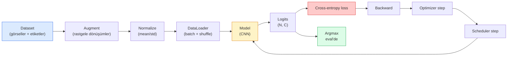

# Image Classification

> Bir sınıflandırıcı, piksellerden sınıflar üzerindeki bir olasılık dağılımına giden bir fonksiyondur. Geri kalan her şey tesisat.

**Tür:** Yapım
**Diller:** Python
**Ön koşullar:** Faz 2 Ders 09 (Model Değerlendirme), Faz 3 Ders 10 (Mini Framework), Faz 4 Ders 03 (CNN'ler)
**Süre:** ~75 dakika

## Öğrenme Hedefleri

- CIFAR-10 üzerinde uçtan uca bir görsel sınıflandırma pipeline'ı kur: dataset, augmentation, model, eğitim döngüsü, değerlendirme
- Her bileşenin (dataloader, loss, optimizer, scheduler, augmentation) rolünü açıkla ve herhangi birini bozmanın loss eğrisinde nasıl tezahür edeceğini tahmin et
- Mixup, cutout ve label smoothing'i sıfırdan uygula ve her birinin ne zaman eklenmeye değer olduğunu açıkla
- Confusion matrix ve sınıf başına precision/recall tablosunu, agrega doğruluğun ötesinde dataset ve model başarısızlıklarını teşhis etmek için oku

## Sorun

Yayınlanan her görü görevi bir seviyede image classification'a indirgenir. Detection bölgeleri sınıflandırır. Segmentation pikselleri sınıflandırır. Retrieval sınıf merkezlerine benzerliğe göre sıralar. Sınıflandırmayı doğru yapmak — dataset döngüsü, augmentation politikası, loss, değerlendirme — fazdaki diğer her göreve aktarılan beceridir.

Çoğu sınıflandırma bug'ı modelde değildir. Pipeline'da yaşar: bozuk bir normalizasyon, shuffle edilmemiş bir eğitim seti, etiketleri bozan augmentation, eğitim verisiyle kontamine olmuş bir validation split'i, epoch 30'dan sonra sessizce ıraksayan bir learning rate. Doğru bir setup'la CIFAR-10'da %93 alacak bir CNN, bozuk olanla yaygın olarak %70-75 alır ve loss eğrisi tüm süreç boyunca makul görünür.

Bu ders tüm pipeline'ı elle bağlar ki her parça incelenebilir olsun. Bir bug saklayabilecek `torchvision.datasets`'ten hiçbir şey kullanmayacaksın.

## Kavram

### Sınıflandırma pipeline'ı



Bu döngüdeki her satır bir bug'ın yaşayabileceği yerdir. Cross-entropy ham logitleri alır, softmax çıktılarını değil; dolayısıyla loss'tan önce herhangi bir `model(x).softmax()` sessizce yanlış gradyanı hesaplar. Augmentation'lar yalnızca girdilere uygulanır, etiketlere değil — ikisini de karıştıran mixup hariç. `optimizer.zero_grad()` step başına bir kez olmak zorundadır; bunu atlamak gradyanları biriktirir ve çok kararsız bir learning rate gibi görünür. Bu bug'ların her biri hata fırlatmadan öğrenme eğrisini yatay yapar.

### Cross-entropy, logitler ve softmax

Bir sınıflandırıcı görsel başına logit denilen `C` sayı üretir. Softmax uygulamak onları bir olasılık dağılımına çevirir:

```
softmax(z)_i = exp(z_i) / sum_j exp(z_j)
```

Cross-entropy, doğru sınıfın negatif log olasılığını ölçer:

```
CE(z, y) = -log( softmax(z)_y )
        = -z_y + log( sum_j exp(z_j) )
```

Sağdaki form sayısal olarak kararlı olandır (log-sum-exp). PyTorch'un `nn.CrossEntropyLoss`'u softmax + NLL'yi tek bir op'ta birleştirir ve ham logitleri doğrudan alır. Önce kendin softmax uygulamak neredeyse her zaman bir bug'dır — log(softmax(softmax(z))) hesaplarsın, anlamsız bir miktar.

### Augmentation neden çalışır

Bir CNN'in translation için (weight sharing'den) inductive bias'ı vardır ama crop, flip, color jitter ya da occlusion'a karşı yerleşik bir invariance'ı yoktur. Ona o invariance'ları öğretmenin tek yolu, onları çalıştıran pikselleri göstermektir. Eğitim sırasındaki her rastgele dönüşüm şunu söylemenin bir yoludur: "bu iki görselin aynı etiketi var; farkı görmezden gelen özellikleri öğren."

```
Orijinal crop:   "sola bakan köpek"
Flip:            "sağa bakan köpek"       <- aynı etiket, farklı pikseller
Rotate(+15):     "köpek, hafif eğik"
Color jitter:    "daha sıcak ışıkta köpek"
RandomErasing:   "yaması eksik köpek"
```

Kural: augmentation etiketi korumalıdır. Bir rakamda cutout ve rotation "6"yı "9"a çevirebilir; o dataset için daha küçük rotation aralıkları kullanır ve rakam spesifik invariance'lara saygı duyan augmentation'lar seçersin.

### Mixup ve cutmix

Sıradan augmentation pikselleri dönüştürür ama etiketleri one-hot tutar. **Mixup** ve **cutmix** bunu her ikisini de interpolasyon yaparak kırar.

```
Mixup:
  lambda ~ Beta(a, a)
  x = lambda * x_i + (1 - lambda) * x_j
  y = lambda * y_i + (1 - lambda) * y_j

Cutmix:
  x_j'den x_i'ye rastgele bir dikdörtgen yapıştır
  y = alana göre y_i ve y_j'nin ağırlıklı karışımı
```

Neden yardımcı olur: model spike'lı one-hot hedefleri ezberlemeyi bırakır ve sınıflar arasında interpolasyon yapmayı öğrenir. Eğitim loss'u artar, test doğruluğu artar. Herhangi bir sınıflandırıcı için en ucuz tek robustness yükseltmesidir.

### Label smoothing

Mixup'ın kuzeni. `[0, 0, 1, 0, 0]`'a karşı eğitmek yerine, 0.1 gibi küçük bir `eps` için `[eps/C, eps/C, 1-eps, eps/C, eps/C]`'ye karşı eğit. Modelin keyfi olarak keskin logitler üretmesini durdurur ve neredeyse hiç maliyet olmadan kalibrasyonu iyileştirir. PyTorch 1.10'dan beri `nn.CrossEntropyLoss(label_smoothing=0.1)`'a yerleşik.

### Doğruluğun ötesinde değerlendirme

Agrega doğruluk dengesizliği saklar. Her zaman çoğunluk sınıfını tahmin eden 90-10'luk bir binary sınıflandırıcı %90 alır. Neyin olduğunu sana gerçekten söyleyen araçlar:

- **Sınıf başına doğruluk** — sınıf başına bir sayı; düşük performanslı kategorileri anında yüzeye çıkarır.
- **Confusion matrix** — C x C grid; satır i sütun j = sınıf j olarak tahmin edilen gerçek sınıf i sayısı; diyagonal doğru, off-diagonal'lar modelinin yaşadığı yer.
- **Top-1 / Top-5** — doğru sınıfın top 1 ya da top 5 tahminde olup olmadığı; "Norwich terrier" vs "Norfolk terrier" gibi sınıflar gerçekten muğlak olduğu için Top-5 ImageNet için önemlidir.
- **Kalibrasyon (ECE)** — 0.8 güven tahmini %80 zamanın doğru çıkar mı? Modern ağlar sistematik olarak aşırı güvenlidir; temperature scaling ya da label smoothing ile düzelt.

## İnşa Et

### Adım 1: Deterministik bir sentetik dataset

CIFAR-10 diskte yaşar. Bu dersi tekrarlanabilir ve hızlı yapmak için CIFAR'a benzeyen sentetik bir dataset kuruyoruz — modelin öğrenmesi gereken sınıf-spesifik yapıya sahip 32x32 RGB görseller. Aynı pipeline gerçek CIFAR-10'da değişmeden çalışır.

```python
import numpy as np
import torch
from torch.utils.data import Dataset


def synthetic_cifar(num_per_class=1000, num_classes=10, seed=0):
    rng = np.random.default_rng(seed)
    X = []
    Y = []
    for c in range(num_classes):
        centre = rng.uniform(0, 1, (3,))
        freq = 2 + c
        for _ in range(num_per_class):
            yy, xx = np.meshgrid(np.linspace(0, 1, 32), np.linspace(0, 1, 32), indexing="ij")
            r = np.sin(xx * freq) * 0.5 + centre[0]
            g = np.cos(yy * freq) * 0.5 + centre[1]
            b = (xx + yy) * 0.5 * centre[2]
            img = np.stack([r, g, b], axis=-1)
            img += rng.normal(0, 0.08, img.shape)
            img = np.clip(img, 0, 1)
            X.append(img.astype(np.float32))
            Y.append(c)
    X = np.stack(X)
    Y = np.array(Y)
    idx = rng.permutation(len(X))
    return X[idx], Y[idx]


class ArrayDataset(Dataset):
    def __init__(self, X, Y, transform=None):
        self.X = X
        self.Y = Y
        self.transform = transform

    def __len__(self):
        return len(self.X)

    def __getitem__(self, i):
        img = self.X[i]
        if self.transform is not None:
            img = self.transform(img)
        img = torch.from_numpy(img).permute(2, 0, 1)
        return img, int(self.Y[i])
```

Her sınıf kendi renk paletini ve frekans kalıbını alır, artı modelin pikselleri ezberlemek yerine sinyali öğrenmesini zorlamak için Gaussian gürültü. On sınıf, her biri bin görsel, permüte edilmiş.

### Adım 2: Normalizasyon ve augmentation

Her görü pipeline'ının sahip olduğu iki dönüşüm.

```python
def standardize(mean, std):
    mean = np.array(mean, dtype=np.float32)
    std = np.array(std, dtype=np.float32)
    def _fn(img):
        return (img - mean) / std
    return _fn


def random_hflip(p=0.5):
    def _fn(img):
        if np.random.random() < p:
            return img[:, ::-1, :].copy()
        return img
    return _fn


def random_crop(pad=4):
    def _fn(img):
        h, w = img.shape[:2]
        padded = np.pad(img, ((pad, pad), (pad, pad), (0, 0)), mode="reflect")
        y = np.random.randint(0, 2 * pad)
        x = np.random.randint(0, 2 * pad)
        return padded[y:y + h, x:x + w, :]
    return _fn


def compose(*fns):
    def _fn(img):
        for fn in fns:
            img = fn(img)
        return img
    return _fn
```

Crop'tan önce zero-pad değil reflect-pad, çünkü siyah kenarlar modelin faydasız bir şekilde görmezden gelmeyi öğreneceği bir sinyaldir.

### Adım 3: Mixup

Eğitim adımı içinde iki görseli ve iki etiketi karıştırır. Dataset içinde değil, forward pass'in yanında yaşaması için bir batch dönüşümü olarak uygulanmıştır.

```python
def mixup_batch(x, y, num_classes, alpha=0.2):
    if alpha <= 0:
        return x, torch.nn.functional.one_hot(y, num_classes).float()
    lam = float(np.random.beta(alpha, alpha))
    idx = torch.randperm(x.size(0), device=x.device)
    x_mixed = lam * x + (1 - lam) * x[idx]
    y_onehot = torch.nn.functional.one_hot(y, num_classes).float()
    y_mixed = lam * y_onehot + (1 - lam) * y_onehot[idx]
    return x_mixed, y_mixed


def soft_cross_entropy(logits, soft_targets):
    log_probs = torch.log_softmax(logits, dim=-1)
    return -(soft_targets * log_probs).sum(dim=-1).mean()
```

`soft_cross_entropy`, soft-label dağılımına karşı cross-entropy'dir. Hedef tam olarak one-hot olduğunda olağan one-hot durumuna indirgenir.

### Adım 4: Eğitim döngüsü

Komple tarif: veri üzerinde tek bir geçiş, batch başına bir kez gradyanlar, epoch başına bir kez adım atan scheduler.

```python
import torch
import torch.nn as nn
from torch.utils.data import DataLoader
from torch.optim import SGD
from torch.optim.lr_scheduler import CosineAnnealingLR

def train_one_epoch(model, loader, optimizer, device, num_classes, use_mixup=True):
    model.train()
    total, correct, loss_sum = 0, 0, 0.0
    for x, y in loader:
        x, y = x.to(device), y.to(device)
        if use_mixup:
            x_m, y_soft = mixup_batch(x, y, num_classes)
            logits = model(x_m)
            loss = soft_cross_entropy(logits, y_soft)
        else:
            logits = model(x)
            loss = nn.functional.cross_entropy(logits, y, label_smoothing=0.1)
        optimizer.zero_grad()
        loss.backward()
        optimizer.step()
        loss_sum += loss.item() * x.size(0)
        total += x.size(0)
        # Karıştırılmamış etiketler `y`'ye karşı eğitim doğruluğu, mixup açıkken
        # yalnızca bir yaklaşıktır (model y'yi değil soft hedefleri gördü). Bunu
        # kaba bir ilerleme sinyali olarak gör; gerçek performans için val
        # accuracy'ye güven.
        with torch.no_grad():
            pred = logits.argmax(dim=-1)
            correct += (pred == y).sum().item()
    return loss_sum / total, correct / total


@torch.no_grad()
def evaluate(model, loader, device, num_classes):
    model.eval()
    total, correct = 0, 0
    loss_sum = 0.0
    cm = torch.zeros(num_classes, num_classes, dtype=torch.long)
    for x, y in loader:
        x, y = x.to(device), y.to(device)
        logits = model(x)
        loss = nn.functional.cross_entropy(logits, y)
        pred = logits.argmax(dim=-1)
        for t, p in zip(y.cpu(), pred.cpu()):
            cm[t, p] += 1
        loss_sum += loss.item() * x.size(0)
        total += x.size(0)
        correct += (pred == y).sum().item()
    return loss_sum / total, correct / total, cm
```

Bir eğitim döngüsü yazdığın her seferinde kontrol ettiğin beş invariant:

1. Eğitimden önce `model.train()`, değerlendirmeden önce `model.eval()` — dropout ve batchnorm davranışını değiştirir.
2. `.backward()`'tan önce `.zero_grad()`.
3. Metrikleri biriktirirken `.item()` — böylece hiçbir şey computation graph'ı canlı tutmaz.
4. Değerlendirme sırasında `@torch.no_grad()` — bellek ve zaman kazandırır, ince kazaları önler.
5. Softmax'a değil ham logitlere karşı argmax — aynı sonuç, bir op daha az.

### Adım 5: Bir araya getir

Önceki dersten `TinyResNet`'i kullan, birkaç epoch eğit, değerlendir.

```python
from main import synthetic_cifar, ArrayDataset
from main import standardize, random_hflip, random_crop, compose
from main import mixup_batch, soft_cross_entropy
from main import train_one_epoch, evaluate
# TinyResNet önceki derslen (03-cnns-lenet-to-resnet) gelir.
# Import path'i önceki dersin kodunu sakladığın yere göre ayarla.
from cnns_lenet_to_resnet import TinyResNet  # örnek placeholder

X, Y = synthetic_cifar(num_per_class=500)
split = int(0.9 * len(X))
X_train, Y_train = X[:split], Y[:split]
X_val, Y_val = X[split:], Y[split:]

mean = [0.5, 0.5, 0.5]
std = [0.25, 0.25, 0.25]
train_tf = compose(random_hflip(), random_crop(pad=4), standardize(mean, std))
eval_tf = standardize(mean, std)

train_ds = ArrayDataset(X_train, Y_train, transform=train_tf)
val_ds = ArrayDataset(X_val, Y_val, transform=eval_tf)

train_loader = DataLoader(train_ds, batch_size=128, shuffle=True, num_workers=0)
val_loader = DataLoader(val_ds, batch_size=256, shuffle=False, num_workers=0)

device = "cuda" if torch.cuda.is_available() else "cpu"
model = TinyResNet(num_classes=10).to(device)
optimizer = SGD(model.parameters(), lr=0.1, momentum=0.9, weight_decay=5e-4, nesterov=True)
scheduler = CosineAnnealingLR(optimizer, T_max=10)

for epoch in range(10):
    tr_loss, tr_acc = train_one_epoch(model, train_loader, optimizer, device, 10, use_mixup=True)
    va_loss, va_acc, _ = evaluate(model, val_loader, device, 10)
    scheduler.step()
    print(f"epoch {epoch:2d}  lr {scheduler.get_last_lr()[0]:.4f}  "
          f"train {tr_loss:.3f}/{tr_acc:.3f}  val {va_loss:.3f}/{va_acc:.3f}")
```

Sentetik dataset'te bu, beş epoch içinde neredeyse mükemmel validation doğruluğuna ulaşır, ki konu da bu: pipeline doğru, model öğrenilebilir olanı öğrenebilir. Dataset'i gerçek CIFAR-10 ile değiştir ve aynı döngü değişiklik olmadan ~%90'a kadar eğitilir.

### Adım 6: Confusion matrix'i oku

Tek başına doğruluk, modelin nerede başarısız olduğunu sana asla söylemez. Confusion matrix söyler.

```python
def print_confusion(cm, labels=None):
    c = cm.shape[0]
    labels = labels or [str(i) for i in range(c)]
    print(f"{'':>6}" + "".join(f"{l:>5}" for l in labels))
    for i in range(c):
        row = cm[i].tolist()
        print(f"{labels[i]:>6}" + "".join(f"{v:>5}" for v in row))
    print()
    tp = cm.diag().float()
    fp = cm.sum(dim=0).float() - tp
    fn = cm.sum(dim=1).float() - tp
    prec = tp / (tp + fp).clamp_min(1)
    rec = tp / (tp + fn).clamp_min(1)
    f1 = 2 * prec * rec / (prec + rec).clamp_min(1e-9)
    for i in range(c):
        print(f"{labels[i]:>6}  prec {prec[i]:.3f}  rec {rec[i]:.3f}  f1 {f1[i]:.3f}")

_, _, cm = evaluate(model, val_loader, device, 10)
print_confusion(cm)
```

Satırlar gerçek sınıflar, sütunlar tahminlerdir. Sınıf 3 ve 5 arasındaki off-diagonal sayıların bir kümesi, modelin o ikisini karıştırdığı anlamına gelir ve hedefli veri toplama ya da sınıf-spesifik bir augmentation için bir başlangıç noktası verir.

## Kullan

`torchvision` yukarıdaki her şeyi deyimsel bileşenlere sarar. Gerçek CIFAR-10 için tam pipeline, bir eğitim döngüsü artı dört satırdır.

```python
from torchvision.datasets import CIFAR10
from torchvision.transforms import Compose, RandomCrop, RandomHorizontalFlip, ToTensor, Normalize

mean = (0.4914, 0.4822, 0.4465)
std = (0.2470, 0.2435, 0.2616)
train_tf = Compose([
    RandomCrop(32, padding=4, padding_mode="reflect"),
    RandomHorizontalFlip(),
    ToTensor(),
    Normalize(mean, std),
])
eval_tf = Compose([ToTensor(), Normalize(mean, std)])

train_ds = CIFAR10(root="./data", train=True,  download=True, transform=train_tf)
val_ds   = CIFAR10(root="./data", train=False, download=True, transform=eval_tf)
```

İki şeye dikkat: mean/std **dataset-spesifiktir** — ImageNet'te değil, CIFAR-10 eğitim setinde hesaplanmıştır — ve reflect pad topluluk-varsayılan crop politikasıdır. Buraya ImageNet istatistiklerini kopyala-yapıştır yapmak, biri modeli profil edene kadar kimsenin yakalamadığı ~%1 doğruluk sızıntısıdır.

## Yayınla

Bu ders şunları üretir:

- `outputs/prompt-classifier-pipeline-auditor.md` — yukarıdaki beş invariant için bir eğitim script'ini denetleyen ve ilk ihlali yüzeye çıkaran bir prompt.
- `outputs/skill-classification-diagnostics.md` — bir confusion matrix ve sınıf adlarının listesi verildiğinde, sınıf başına başarısızlıkları özetleyen ve en etkili tek düzeltmeyi öneren bir skill.

## Alıştırmalar

1. **(Kolay)** Sentetik dataset'te mixup'lı ve mixup'sız aynı modeli beş epoch eğit. Her ikisi için train ve val loss çiz. Mixup ile train loss'un neden daha yüksek olduğunu yet val accuracy'nin benzer ya da daha iyi olduğunu açıkla.
2. **(Orta)** Cutout uygula — her eğitim görselinde rastgele 8x8 bir kareyi sıfırla — ve no augmentation, hflip+crop, hflip+crop+cutout, hflip+crop+mixup karşı bir ablation çalıştır. Her biri için val accuracy raporla.
3. **(Zor)** Bir CIFAR-100 pipeline kur (100 sınıf, aynı girdi boyutu) ve yayınlanmış doğruluğun %1'i içinde bir ResNet-34 eğitim çalışmasını yeniden üret. Ekstralar: üç learning rate ve iki weight decay tara, yerel bir CSV'ye logla, son confusion-matrix-top-confusions tablosunu üret.

## Anahtar Terimler

| Terim | İnsanlar ne diyor | Gerçekte ne anlama geliyor |
|------|----------------|----------------------|
| Logitler | "Ham çıktılar" | Görsel başına C sayının pre-softmax vektörü; cross-entropy bunları bekler, softmax'lanmış değerleri değil |
| Cross-entropy | "Loss" | Doğru sınıfın negatif log-olasılığı; log-softmax ve NLL'yi tek bir kararlı op'ta birleştirir |
| DataLoader | "Batcher" | Bir dataset'i shuffling, batching ve (opsiyonel) çoklu-worker yükleme ile sarar; eğitim bug'larının yarısı için suçlanır |
| Augmentation | "Rastgele dönüşümler" | Eğitim zamanında etiketi koruyan herhangi bir piksel düzeyinde dönüşüm; CNN'in doğal olarak sahip olmadığı invariance'ları öğretir |
| Mixup / Cutmix | "İki görseli karıştır" | Sınıflandırıcının sert sınırlar yerine pürüzsüz interpolasyonları öğrenmesi için hem girdileri hem etiketleri harmanla |
| Label smoothing | "Daha yumuşak hedefler" | One-hot'u (1-eps, eps/(C-1), ...) ile değiştir; kalibrasyonu iyileştirir ve doğruluğu hafifçe artırır |
| Top-k accuracy | "Top-5" | Doğru sınıf, k en yüksek olasılıklı tahminde; gerçekten muğlak sınıfları olan dataset'lerde kullanılır |
| Confusion matrix | "Hataların yaşadığı yer" | (i, j) girdisi sınıf j olarak tahmin edilen gerçek sınıf i görsellerini sayan C x C tablo; diyagonal doğru, off-diagonal sana neyi düzelteceğini söyler |

## İleri Okuma

- [CS231n: Training Neural Networks](https://cs231n.github.io/neural-networks-3/) — tek bir sayfada eğitim pipeline'ının hâlâ en net turu
- [Bag of Tricks for Image Classification (He et al., 2019)](https://arxiv.org/abs/1812.01187) — ImageNet'te ResNet doğruluğuna birlikte 3-4% ekleyen her küçük hile
- [mixup: Beyond Empirical Risk Minimization (Zhang et al., 2017)](https://arxiv.org/abs/1710.09412) — orijinal mixup makalesi; üç sayfa teori artı ikna edici deneyler
- [Why temperature scaling matters (Guo et al., 2017)](https://arxiv.org/abs/1706.04599) — modern ağların miskalibre olduğunu kanıtlayan ve tek bir skaler parametre ile düzelten makale
