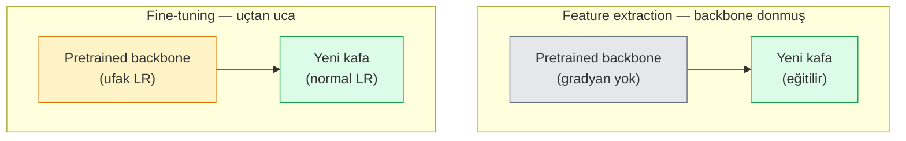

# Transfer Learning & Fine-Tuning

> Başka biri bir ağa kenarların, dokuların ve nesne parçalarının nasıl göründüğünü öğretmek için bir milyon GPU saati harcadı. Kendi modelini eğitmeden önce o feature'ları ödünç almalısın.

**Tür:** Yapım
**Diller:** Python
**Ön koşullar:** Faz 4 Ders 03 (CNN'ler), Faz 4 Ders 04 (Image Classification)
**Süre:** ~75 dakika

## Öğrenme Hedefleri

- Feature extraction'ı fine-tuning'den ayır ve dataset boyutu, domain mesafesi ve compute bütçesine göre doğru olanı seç
- Önceden eğitilmiş bir backbone'u yükle, sınıflandırıcı kafasını değiştir ve yalnızca kafayı 20 satırın altında çalışan bir baseline'a eğit
- Katmanları kademeli olarak çöz, discriminative learning rate'lerle ki erken generic feature'lar geç task-spesifik olanlardan daha küçük güncelleme alsın
- Üç yaygın başarısızlığı teşhis et: çözülmüş bloklarda çok yüksek LR'den feature drift, ufak dataset'lerde BN istatistik çöküşü ve catastrophic forgetting

## Sorun

ImageNet üzerinde bir ResNet-50 eğitmek yaklaşık 2.000 GPU-saat maliyetlidir. Çok az ekibin yayınladığı her görev için o bütçesi vardır. Hemen hemen her ekibin gerçekten yayınladığı şey, birkaç yüz ya da birkaç bin task-spesifik görselle eğitilmiş yeni bir kafa ile önceden eğitilmiş bir backbone'dur.

Bu bir kısayol değildir. ImageNet üzerinde eğitilmiş herhangi bir CNN'in ilk conv bloğu kenarları ve Gabor benzeri filtreleri öğrenir. Sonraki birkaç blok dokuları ve basit motifleri öğrenir. Orta bloklar nesne parçalarını öğrenir. Son bloklar 1.000 ImageNet kategorisine benzemeye başlayan kombinasyonları öğrenir. O hiyerarşinin ilk %90'ı, tıbbi görüntüleme, endüstriyel inceleme, uydu verisi ve diğer her görü görevine neredeyse değişmeden aktarılır — çünkü doğanın kenarlar ve dokulardan oluşan sınırlı bir kelime dağarcığı vardır. Son %10 ise senin gerçekten eğittiğin şeydir.

Transfer'i doğru yapmanın seni bekleyen üç bug'ı vardır: pretrained feature'ları çok yüksek bir learning rate ile yok etmek, çok şey dondurarak modeli bilgiden mahrum bırakmak ve BatchNorm'un running istatistiklerinin ağın geri kalanının hiç öğrenmediği ufak bir dataset'e doğru sürüklenmesine izin vermek. Bu ders her birini kasıtlı olarak yürüyor.

## Kavram

### Feature extraction vs fine-tuning

İki rejim, pretrained feature'lara ne kadar güvendiğine ve ne kadar verin olduğuna göre seçilir.



Kurallar:

| Dataset boyutu | Domain mesafesi | Tarif |
|--------------|-----------------|--------|
| < 1k görsel | ImageNet'e yakın | Backbone'u dondur, sadece kafayı eğit |
| 1k-10k | yakın | İlk 2-3 stage'i dondur, gerisini fine-tune et |
| 10k-100k | herhangi | Discriminative LR ile uçtan uca fine-tune et |
| 100k+ | uzak | Her şeyi fine-tune et; domain yeterince uzaksa sıfırdan eğitimi düşün |

"ImageNet'e yakın" kabaca nesne benzeri içeriğe sahip doğal RGB fotoğraflar demektir. Tıbbi BT taramaları, tepeden uydu görüntüleri ve mikroskopi uzak domain'lerdir — feature'lar hâlâ yardımcı olur ama daha fazla katmanın adapte olmasına izin vermen gerekir.

### Dondurmak neden işe yarar

Bir CNN'in öğrendiği ImageNet feature'ları 1.000 kategoriye özelleşmemiştir. Doğal görsellerin istatistiklerine özelleşmiştir: belirli yönlerde kenarlar, dokular, kontrast kalıpları, şekil primitifleri. Bu istatistikler bir insanın isimlendirebileceği neredeyse her görsel domain boyunca kararlıdır. ImageNet üzerinde eğitilmiş ve CIFAR-10 üzerinde yalnızca yeni bir linear kafa (backbone'un fine-tuning'i olmadan) ile zero-shot değerlendirilmiş bir modelin neden %80+ doğruluk aldığının nedeni budur. Kafa, bu görev için zaten öğrenilmiş feature'lardan hangilerinin ağırlıklandırılacağını öğreniyor.

### Discriminative learning rate

Çözdüğünde erken katmanlar geç katmanlardan daha yavaş eğitilmeli. Erken katmanlar korumak istediğin generic feature'ları encode eder; geç katmanlar çok hareket ettirmen gereken task-spesifik yapıyı encode eder.

```
Tipik tarif:

  stage 0 (stem + ilk grup):   lr = base_lr / 100    (çoğunlukla sabit)
  stage 1:                      lr = base_lr / 10
  stage 2:                      lr = base_lr / 3
  stage 3 (son backbone grup): lr = base_lr
  kafa:                         lr = base_lr  (ya da hafif yüksek)
```

PyTorch'ta bu sadece optimizer'a geçirilen parameter group'larının bir listesidir. Bir model, beş learning rate, sıfır ekstra kod.

### BatchNorm problemi

BN katmanlar ImageNet üzerinde hesaplanmış `running_mean` ve `running_var` buffer'ları tutar. Görevinin farklı bir piksel dağılımı varsa — farklı aydınlatma, farklı sensör, farklı renk uzayı — o buffer'lar yanlıştır. Tercih sırasıyla üç seçenek:

1. **BN train modundayken fine-tune et.** BN'nin running istatistiklerini diğer her şeyle birlikte güncellemesine izin ver. Görev dataset'i orta boyutluyken (>= 5k örnek) varsayılan seçim.
2. **BN'yi eval modunda dondur.** ImageNet istatistiklerini koru ve yalnızca ağırlıkları eğit. Dataset'in BN'nin moving average'inin gürültülü olacağı kadar küçük olduğunda doğru.
3. **BN'yi GroupNorm ile değiştir.** Moving-average problemini tamamen kaldırır. GPU başına batch boyutunun ufak olduğu detection ve segmentation backbone'larında kullanılır.

Bunu yanlış yapmak doğruluğu sessizce %5-15 düşürür.

### Kafa tasarımı

Sınıflandırıcı kafa, 1-3 linear katman artı opsiyonel bir dropout'tur. Her torchvision backbone değiştireceğin bir varsayılan kafa ile gelir:

```
backbone.fc = nn.Linear(backbone.fc.in_features, num_classes)          # ResNet
backbone.classifier[1] = nn.Linear(..., num_classes)                    # EfficientNet, MobileNet
backbone.heads.head = nn.Linear(..., num_classes)                       # torchvision ViT
```

Küçük dataset'ler için tek bir linear katman genellikle yeterlidir. Gizli bir katman eklemek (Linear -> ReLU -> Dropout -> Linear) görev dağılımı backbone'un eğitim dağılımından daha uzak olduğunda yardımcı olur.

### Layer-wise LR decay

Modern fine-tuning'de kullanılan discriminative LR'in daha pürüzsüz bir versiyonu (BEiT, DINOv2, ViT-B fine-tune'ları). Katmanları stage'lere gruplamak yerine, her katmana üzerindekinden biraz daha küçük bir LR ver:

```
lr_layer_k = base_lr * decay^(L - k)
```

decay = 0.75 ve L = 12 transformer block ile, ilk block kafanın LR'sinin `0.75^11 ≈ 0.04x`'inde eğitilir. CNN'ler için stage-gruplandırılmış LR'ler genellikle yeterli olduğu için, transformer fine-tune'ları için daha önemlidir.

### Neyi değerlendirmeli

Transfer-learning çalışmaları, sıfırdan bir çalışmada izlemediğin iki sayıya ihtiyaç duyar:

- **Yalnızca pretrained doğruluğu** — backbone donmuş halde kafanın doğruluğu. Bu senin tabanın.
- **Fine-tuned doğruluğu** — uçtan uca eğitimden sonra aynı model. Bu senin tavanın.

Fine-tuned, pretrained-only'den azsa, bir learning-rate ya da BN bug'ın var. Her zaman ikisini de yazdır.

## İnşa Et

### Adım 1: Önceden eğitilmiş bir backbone yükle ve incele

```python
import torch
import torch.nn as nn
from torchvision.models import resnet18, ResNet18_Weights

backbone = resnet18(weights=ResNet18_Weights.IMAGENET1K_V1)
print(backbone)
print()
print("classifier head:", backbone.fc)
print("feature dim:", backbone.fc.in_features)
```

`ResNet18`'in dört stage'i (`layer1..layer4`), artı bir stem ve bir `fc` kafası var. Her torchvision sınıflandırma backbone'ı benzer bir yapıya sahiptir.

### Adım 2: Feature extraction — her şeyi dondur, kafayı değiştir

```python
def make_feature_extractor(num_classes=10):
    model = resnet18(weights=ResNet18_Weights.IMAGENET1K_V1)
    for p in model.parameters():
        p.requires_grad = False
    model.fc = nn.Linear(model.fc.in_features, num_classes)
    return model

model = make_feature_extractor(num_classes=10)
trainable = sum(p.numel() for p in model.parameters() if p.requires_grad)
frozen = sum(p.numel() for p in model.parameters() if not p.requires_grad)
print(f"trainable: {trainable:>10,}")
print(f"frozen:    {frozen:>10,}")
```

Yalnızca `model.fc` eğitilebilir. Backbone donmuş bir feature extractor'dur.

### Adım 3: Discriminative fine-tuning

Stage-spesifik learning rate'lerle parameter group'ları kuran bir utility.

```python
def discriminative_param_groups(model, base_lr=1e-3, decay=0.3):
    stages = [
        ["conv1", "bn1"],
        ["layer1"],
        ["layer2"],
        ["layer3"],
        ["layer4"],
        ["fc"],
    ]
    groups = []
    for i, names in enumerate(stages):
        lr = base_lr * (decay ** (len(stages) - 1 - i))
        params = [p for n, p in model.named_parameters()
                  if any(n.startswith(k) for k in names)]
        if params:
            groups.append({"params": params, "lr": lr, "name": "_".join(names)})
    return groups

model = resnet18(weights=ResNet18_Weights.IMAGENET1K_V1)
model.fc = nn.Linear(model.fc.in_features, 10)
for p in model.parameters():
    p.requires_grad = True

groups = discriminative_param_groups(model)
for g in groups:
    print(f"{g['name']:>10s}  lr={g['lr']:.2e}  params={sum(p.numel() for p in g['params']):>8,}")
```

`decay=0.3`, her stage'in bir sonrakinin oranının %30'unda eğitildiği anlamına gelir. `fc` `base_lr` alır, `layer4` `0.3 * base_lr` alır, `conv1` `0.3^5 * base_lr ≈ 0.00243 * base_lr` alır. Aşırı geliyor; ampirik olarak çalışıyor.

### Adım 4: BatchNorm yönetimi

Ağırlıklarını dondurmadan BN running istatistiklerini donduran yardımcı.

```python
def freeze_bn_stats(model):
    for m in model.modules():
        if isinstance(m, (nn.BatchNorm1d, nn.BatchNorm2d, nn.BatchNorm3d)):
            m.eval()
            for p in m.parameters():
                p.requires_grad = False
    return model
```

Her epoch'un başında `model.train()` ayarladıktan sonra çağır. `model.train()` her şeyi eğitim moduna çevirir; bu yalnızca BN katmanları için tersine çevirir.

### Adım 5: Minimal uçtan uca fine-tuning döngüsü

```python
from torch.optim import SGD
from torch.utils.data import DataLoader
from torch.optim.lr_scheduler import CosineAnnealingLR
import torch.nn.functional as F

def fine_tune(model, train_loader, val_loader, device, epochs=5, base_lr=1e-3, freeze_bn=False):
    model = model.to(device)
    groups = discriminative_param_groups(model, base_lr=base_lr)
    optimizer = SGD(groups, momentum=0.9, weight_decay=1e-4, nesterov=True)
    scheduler = CosineAnnealingLR(optimizer, T_max=epochs)

    for epoch in range(epochs):
        model.train()
        if freeze_bn:
            freeze_bn_stats(model)
        tr_loss, tr_correct, tr_total = 0.0, 0, 0
        for x, y in train_loader:
            x, y = x.to(device), y.to(device)
            logits = model(x)
            loss = F.cross_entropy(logits, y, label_smoothing=0.1)
            optimizer.zero_grad()
            loss.backward()
            optimizer.step()
            tr_loss += loss.item() * x.size(0)
            tr_total += x.size(0)
            tr_correct += (logits.argmax(-1) == y).sum().item()
        scheduler.step()

        model.eval()
        va_total, va_correct = 0, 0
        with torch.no_grad():
            for x, y in val_loader:
                x, y = x.to(device), y.to(device)
                pred = model(x).argmax(-1)
                va_total += x.size(0)
                va_correct += (pred == y).sum().item()
        print(f"epoch {epoch}  train {tr_loss/tr_total:.3f}/{tr_correct/tr_total:.3f}  "
              f"val {va_correct/va_total:.3f}")
    return model
```

CIFAR-10'da yukarıdaki tarifle beş epoch, `ResNet18-IMAGENET1K_V1`'i ~%70 zero-shot linear-probe doğruluğundan ~%93 fine-tuned doğruluğa götürür. Yalnız kafa, backbone'a hiç dokunmadan %86 civarında plato yapar.

### Adım 6: Progressive unfreezing

Sondan başa doğru epoch başına bir stage çözen bir program. Ekstra birkaç epoch maliyetine feature drift'i azaltır.

```python
def progressive_unfreeze_schedule(model):
    stages = ["layer4", "layer3", "layer2", "layer1"]
    yielded = set()

    def start():
        for p in model.parameters():
            p.requires_grad = False
        for p in model.fc.parameters():
            p.requires_grad = True

    def unfreeze(epoch):
        if epoch < len(stages):
            name = stages[epoch]
            yielded.add(name)
            for n, p in model.named_parameters():
                if n.startswith(name):
                    p.requires_grad = True
            return name
        return None

    return start, unfreeze
```

İlk epoch'tan önce `start()`'ı bir kez çağır. Her epoch'un başında `unfreeze(epoch)` çağır. Eğitilebilir parametre seti her değiştiğinde optimizer'ı yeniden inşa et, yoksa donmuş paramlar onu karıştıran cached moment'ları hâlâ tutar.

## Kullan

Çoğu gerçek görev için `torchvision.models` + üç satır yeterlidir. Yukarıdaki ağır makine, kütüphane varsayılanlarının çözemediği problemlerle karşılaştığında önemlidir.

```python
from torchvision.models import resnet50, ResNet50_Weights

model = resnet50(weights=ResNet50_Weights.IMAGENET1K_V2)
model.fc = nn.Linear(model.fc.in_features, num_classes)
optimizer = torch.optim.AdamW(model.parameters(), lr=1e-4, weight_decay=1e-4)
```

İki üretim-kalite varsayılan daha:

- `timm` tutarlı bir API ile ~800 pretrained görü backbone'u taşır (`timm.create_model("resnet50", pretrained=True, num_classes=10)`). torchvision zoo'sunun ötesindeki herhangi bir fine-tune için standarttır.
- Transformer'lar için `transformers.AutoModelForImageClassification.from_pretrained(name, num_labels=N)` sana metin modelleriyle aynı loading semantikleriyle ViT / BEiT / DeiT verir.

## Yayınla

Bu ders şunları üretir:

- `outputs/prompt-fine-tune-planner.md` — dataset boyutu, domain mesafesi ve compute bütçesine göre feature-extraction vs progressive vs uçtan uca fine-tuning seçen bir prompt.
- `outputs/skill-freeze-inspector.md` — bir PyTorch modeli verildiğinde hangi parametrelerin eğitilebilir olduğunu, hangi BatchNorm katmanlarının eval modunda olduğunu ve optimizer'a gerçekten eğitilebilir parametrelerin beslenip beslenmediğini raporlayan bir skill.

## Alıştırmalar

1. **(Kolay)** Aynı sentetik-CIFAR dataset'inde bir `ResNet18`'i linear probe (backbone donmuş) ve tam fine-tune olarak eğit. Her iki doğruluğu yan yana raporla. Hangi farkın feature'ların iyi aktarıldığını, hangisinin aktarılmadığını söylediğini açıkla.
2. **(Orta)** Kasıtlı olarak bir bug tanıt: kafa yerine backbone stage'inde `base_lr = 1e-1` ayarla. Eğitim loss'unun patladığını göster, sonra `discriminative_param_groups` yardımcısını uygulayarak toparla. Her stage'in ıraksamaya başladığı LR'i kaydet.
3. **(Zor)** Bir tıbbi görüntüleme dataset'i al (örn. CheXpert-small, PatchCamelyon ya da HAM10000) ve üç rejimi karşılaştır: (a) ImageNet-pretrained donmuş backbone + linear kafa; (b) ImageNet-pretrained uçtan uca fine-tune; (c) sıfırdan eğitim. Her biri için doğruluk ve compute maliyetini raporla. Hangi dataset boyutunda sıfırdan eğitim rekabetçi olur?

## Anahtar Terimler

| Terim | İnsanlar ne diyor | Gerçekte ne anlama geliyor |
|------|----------------|----------------------|
| Feature extraction | "Dondur ve kafayı eğit" | Backbone parametreleri donmuş, yalnızca yeni sınıflandırıcı kafası gradyan alır |
| Fine-tuning | "Uçtan uca yeniden eğit" | Tüm parametreler eğitilebilir, genellikle sıfırdan eğitimden çok daha küçük LR ile |
| Discriminative LR | "Erken katmanlar için daha küçük LR" | Erken-stage LR'in geç-stage LR'in bir kesri olduğu optimizer parameter group'ları |
| Layer-wise LR decay | "Pürüzsüz LR gradyanı" | Per-layer LR decay^(L - k) ile çarpılır; transformer fine-tune'larda yaygın |
| Catastrophic forgetting | "Model ImageNet'i kaybetti" | Çok yüksek bir LR, yeni görev sinyali öğrenilmeden önce pretrained feature'ları üzerine yazar |
| BN statistics drift | "Running mean yanlış" | BatchNorm running_mean/var mevcut görevden farklı bir dağılım üzerinde hesaplanmış, sessizce doğruluğu zedeliyor |
| Linear probe | "Donmuş backbone + linear kafa" | Pretrained feature'ların değerlendirmesi — donmuş temsilin üstündeki en iyi linear sınıflandırıcının doğruluğu |
| Catastrophic collapse | "Her şey tek bir sınıfı tahmin ediyor" | Kafadan gelen gradyanlar kararlı hale gelemeden feature'ları yok edecek kadar yüksek bir LR ile fine-tune yaparken olur |

## İleri Okuma

- [How transferable are features in deep neural networks? (Yosinski et al., 2014)](https://arxiv.org/abs/1411.1792) — katmanlar arasında feature transferability'sini niceleştiren makale
- [Universal Language Model Fine-tuning (ULMFiT, Howard & Ruder, 2018)](https://arxiv.org/abs/1801.06146) — orijinal discriminative LR / progressive unfreezing tarifi; fikirler doğrudan görüye aktarılır
- [timm documentation](https://huggingface.co/docs/timm) — modern görü backbone'ları ve eğitildikleri tam fine-tune varsayılanları için referans
- [A Simple Framework for Linear-Probe Evaluation (Kornblith et al., 2019)](https://arxiv.org/abs/1805.08974) — linear-probe doğruluğunun neden önemli olduğu ve nasıl doğru raporlanacağı
