# Nesne Tespiti — Sıfırdan YOLO

> Tespit, bir feature map'teki her konumda çalıştırılan classification artı regresyondur; sonra non-maximum suppression ile temizlenir.

**Tür:** Yapım
**Diller:** Python
**Ön koşullar:** Faz 4 Ders 03 (CNN'ler), Faz 4 Ders 04 (Image Classification), Faz 4 Ders 05 (Transfer Learning)
**Süre:** ~75 dakika

## Öğrenme Hedefleri

- Tespiti yoğun bir tahmin problemine çeviren grid-and-anchor tasarımını açıkla ve çıktı tensor'undaki her sayının ne anlama geldiğini söyle
- Kutular arasında Intersection-over-Union hesapla ve non-maximum suppression'ı sıfırdan uygula
- Önceden eğitilmiş bir backbone üzerine minimal bir YOLO tarzı kafa kur; classification, objectness ve box-regression loss'ları dahil
- Bir tespit metriği satırını (precision@0.5, recall, mAP@0.5, mAP@0.5:0.95) oku ve sıradaki hangi düğmeyi çevireceğini seç

## Sorun

Classification "bu görsel bir köpektir" der. Tespit "(112, 40, 280, 210) piksellerinde bir köpek var, (400, 180, 560, 310)'da bir kedi var ve karede başka bir şey yok" der. O tek yapısal değişiklik — görsel başına bir etiket yerine değişken sayıda etiketli bir kutu tahmin etmek — her otonom sistemin, her gözetim ürününün, her doküman layout parser'ının ve her fabrika görü hattının bağımlı olduğu şeydir.

Tespit, görüdeki her mühendislik trade-off'unun aynı anda görüldüğü yerdir de. Doğru kutular istersin (regression kafası), her kutu için doğru sınıf istersin (classification kafası), tespit edilecek bir şey olmadığında modelin bunu bilmesini istersin (objectness skoru) ve her gerçek nesne için tam olarak bir tahmin istersin (non-maximum suppression). Bunlardan herhangi birini kaçırırsan pipeline ya nesneleri ıskalar, ya halüsinasyon kutuları raporlar, ya da aynı nesneyi biraz farklı konumlarda on beş kez tahmin eder.

YOLO (You Only Look Once, Redmon et al. 2016), bunların hepsini bir conv ağının tek bir forward pass'iyle yaparak gerçek zamanlı çalıştıran tasarımdı ve aynı yapısal kararlar hâlâ modern detektörlerin (YOLOv8, YOLOv9, YOLO-NAS, RT-DETR) omurgasıdır. Çekirdeği öğren ve her varyant aynı parçaların yeniden düzenlemesi olur.

## Kavram

### Yoğun tahmin olarak tespit

Bir sınıflandırıcı görsel başına C sayı üretir. YOLO tarzı bir detektör görsel başına `(S x S x (5 + C))` sayı üretir; burada S uzaysal grid boyutudur.

```mermaid
flowchart LR
    IMG["Girdi 416x416 RGB"] --> BB["Backbone<br/>(ResNet, DarkNet, ...)"]
    BB --> FM["Feature map<br/>(C_feat, 13, 13)"]
    FM --> HEAD["Detection head<br/>(1x1 conv'lar)"]
    HEAD --> OUT["Çıktı tensor<br/>(13, 13, B * (5 + C))"]
    OUT --> DEC["Decode<br/>(grid + sigmoid + exp)"]
    DEC --> NMS["Non-max suppression"]
    NMS --> RESULT["Son kutular"]

    style IMG fill:#dbeafe,stroke:#2563eb
    style HEAD fill:#fef3c7,stroke:#d97706
    style NMS fill:#fecaca,stroke:#dc2626
    style RESULT fill:#dcfce7,stroke:#16a34a
```



`S * S` grid hücresinin her biri `B` kutu tahmin eder. Her kutu için:

- 4 sayı geometriyi tarif eder: `tx, ty, tw, th`.
- 1 sayı objectness skorudur: "bu hücrede merkezlenmiş bir nesne var mı?"
- C sayı sınıf olasılıklarıdır.

Hücre başına toplam: `B * (5 + C)`. `S=13, B=2, C=20` ile VOC için bu hücre başına 50 sayıdır.

### Neden grid ve anchor

Düz regresyon her nesne için `(x, y, w, h)`'yi mutlak koordinat olarak tahmin ederdi. Bu bir conv ağı için zordur çünkü görseli kaydırmak tüm tahminleri aynı miktarda kaydırmamalıdır — her nesne uzaysal olarak çapalanmıştır. Grid buna her ground-truth kutusunu merkezinin düştüğü grid hücresine atayarak cevap verir; yalnızca o hücre o nesneden sorumludur.

Anchor'lar ikinci bir problemi adresler. Bir 3x3 conv 16 piksellik bir receptive field feature hücresinden 500 piksel genişliğinde bir kutuyu kolayca regress edemez. Bunun yerine hücre başına `B` prior kutu şekli (anchor) önceden tanımlarız ve her anchor'dan küçük delta'lar tahmin ederiz. Model sıfırdan regresyon yapmak yerine doğru anchor'u seçmeyi ve onu dürtmeyi öğrenir.

```
Anchor box prior'ları (416x416 girdi için örnek):

  küçük:    (30,  60)
  orta:     (75,  170)
  büyük:    (200, 380)

Her grid hücresinde, her anchor (tx, ty, tw, th, obj, c_1, ..., c_C) yayar.
```

Modern detektörler genellikle çözünürlük başına farklı anchor setleri ile FPN kullanır — sığ yüksek-çözünürlük map'lerde küçük anchor'lar, derin düşük-çözünürlük map'lerde büyük anchor'lar. Aynı fikir, daha fazla ölçek.

### Tahminlerin decode edilmesi

Ham `tx, ty, tw, th` kutu koordinatları değildir; çizmeden önce dönüştürülmesi gereken regresyon hedefleridir:

```
merkez x  = (sigmoid(tx) + cell_x) * stride
merkez y  = (sigmoid(ty) + cell_y) * stride
genişlik  = anchor_w * exp(tw)
yükseklik = anchor_h * exp(th)
```

`sigmoid` merkez offset'lerini hücrenin içinde tutar. `exp`, genişliğin işaret değiştirmeden anchor'dan serbestçe ölçeklenmesine izin verir. `stride` grid koordinatlarını piksellere geri ölçekler. Bu decode adımı v2'den beri her YOLO sürümünde aynıdır.

### IoU

Tespit'in iki kutu arasındaki evrensel benzerlik metriği:

```
IoU(A, B) = area(A intersect B) / area(A union B)
```

IoU = 1 özdeş demektir; IoU = 0 örtüşme yok demektir. Tahmin ile ground-truth kutusu arasındaki IoU, bir tahminin true positive sayılıp sayılmayacağına karar verir (tipik olarak IoU >= 0.5). İki tahmin arasındaki IoU NMS'in deduplikasyon için kullandığı şeydir.

### Non-maximum suppression

Bitişik anchor'larda eğitilmiş bir conv ağı, aynı nesne için sıklıkla örtüşen kutular tahmin eder. NMS en yüksek güvenli tahmini tutar ve eşiğin üzerinde IoU'ya sahip diğer tahminleri siler.

```
NMS(boxes, scores, iou_threshold):
    kutuları score'a göre azalan sırala
    keep = []
    while boxes boş değil:
        en yüksek skorlu kutuyu seç, keep'e ekle
        seçilen kutuya IoU > iou_threshold olan her kutuyu sil
    return keep
```

Tipik eşik: nesne tespiti için 0.45. Son detektörler standart NMS'i `soft-NMS`, `DIoU-NMS` ile değiştirir ya da suppression'ı doğrudan öğrenir (RT-DETR) ama yapısal amaç aynıdır.

### Loss

YOLO loss'u ağırlıklarla eklenmiş üç loss'tur:

```
L = lambda_coord * L_box(pred, target, obj=1 olan yerde)
  + lambda_obj   * L_obj(pred, 1,     obj=1 olan yerde)
  + lambda_noobj * L_obj(pred, 0,     obj=0 olan yerde)
  + lambda_cls   * L_cls(pred, target, obj=1 olan yerde)
```

Yalnızca nesne içeren hücreler box-regression ve classification loss'larına katkıda bulunur. Nesnesiz hücreler yalnızca objectness loss'una katkıda bulunur (modele sessiz kalmayı öğretir). `lambda_noobj` genellikle küçüktür (~0.5) çünkü hücrelerin büyük çoğunluğu boştur ve aksi halde toplam loss'a hakim olur.

Modern varyantlar MSE box loss'unu CIoU / DIoU ile (doğrudan IoU'yu optimize eder) değiştirir, sınıf dengesizliği için focal loss kullanır ve objectness'i quality focal loss ile dengeler. Üç-bileşenli yapı değişmemiştir.

### Tespit metrikleri

Accuracy tespite aktarılmaz. Aktarılan dört sayı:

- **Precision@IoU=0.5** — pozitif sayılan tahminlerden kaçı gerçekten doğru.
- **Recall@IoU=0.5** — gerçek nesnelerden kaçını bulduk.
- **AP@0.5** — IoU eşiği 0.5'te precision-recall eğrisi alanı; sınıf başına bir sayı.
- **mAP@0.5:0.95** — IoU eşikleri 0.5, 0.55, ..., 0.95 üzerinde AP ortalaması. COCO metriği; en katı ve en bilgi verici olan.

Dördünü de raporla. mAP@0.5'te güçlü ama mAP@0.5:0.95'te zayıf olan bir detektör kabaca lokalize ediyor ama sıkı değil; daha iyi box-regression loss'u ile düzelt. Yüksek precision ve düşük recall'lu bir detektör çok tutucudur; confidence eşiğini düşür ya da objectness ağırlığını artır.

## İnşa Et

### Adım 1: IoU

Tüm dersin beygiri. `(x1, y1, x2, y2)` formatında iki kutu array'i üzerinde çalışır.

```python
import numpy as np

def box_iou(boxes_a, boxes_b):
    ax1, ay1, ax2, ay2 = boxes_a[:, 0], boxes_a[:, 1], boxes_a[:, 2], boxes_a[:, 3]
    bx1, by1, bx2, by2 = boxes_b[:, 0], boxes_b[:, 1], boxes_b[:, 2], boxes_b[:, 3]

    inter_x1 = np.maximum(ax1[:, None], bx1[None, :])
    inter_y1 = np.maximum(ay1[:, None], by1[None, :])
    inter_x2 = np.minimum(ax2[:, None], bx2[None, :])
    inter_y2 = np.minimum(ay2[:, None], by2[None, :])

    inter_w = np.clip(inter_x2 - inter_x1, 0, None)
    inter_h = np.clip(inter_y2 - inter_y1, 0, None)
    inter = inter_w * inter_h

    area_a = (ax2 - ax1) * (ay2 - ay1)
    area_b = (bx2 - bx1) * (by2 - by1)
    union = area_a[:, None] + area_b[None, :] - inter
    return inter / np.clip(union, 1e-8, None)
```

Bir `(N_a, N_b)` ikili IoU matrisi döndürür. Array'lerden birini `(1, 4)` şeklinde yaparak tek bir ground-truth kutusuna karşı kullan.

### Adım 2: Non-max suppression

```python
def nms(boxes, scores, iou_threshold=0.45):
    order = np.argsort(-scores)
    keep = []
    while len(order) > 0:
        i = order[0]
        keep.append(i)
        if len(order) == 1:
            break
        rest = order[1:]
        ious = box_iou(boxes[[i]], boxes[rest])[0]
        order = rest[ious <= iou_threshold]
    return np.array(keep, dtype=np.int64)
```

Deterministik, sort'tan `O(N log N)` ve özdeş girdilerde `torchvision.ops.nms` davranışını eşler.

### Adım 3: Box encoding ve decoding

Piksel koordinatları ile ağın aslında regress ettiği `(tx, ty, tw, th)` hedefleri arasında dönüşüm yap.

```python
def encode(box_xyxy, cell_x, cell_y, stride, anchor_wh):
    x1, y1, x2, y2 = box_xyxy
    cx = 0.5 * (x1 + x2)
    cy = 0.5 * (y1 + y2)
    w = x2 - x1
    h = y2 - y1
    tx = cx / stride - cell_x
    ty = cy / stride - cell_y
    tw = np.log(w / anchor_wh[0] + 1e-8)
    th = np.log(h / anchor_wh[1] + 1e-8)
    return np.array([tx, ty, tw, th])


def decode(tx_ty_tw_th, cell_x, cell_y, stride, anchor_wh):
    tx, ty, tw, th = tx_ty_tw_th
    cx = (sigmoid(tx) + cell_x) * stride
    cy = (sigmoid(ty) + cell_y) * stride
    w = anchor_wh[0] * np.exp(tw)
    h = anchor_wh[1] * np.exp(th)
    return np.array([cx - w / 2, cy - h / 2, cx + w / 2, cy + h / 2])


def sigmoid(x):
    return 1.0 / (1.0 + np.exp(-x))
```

Test: bir kutuyu encode et sonra decode et — orijinaline çok yakın bir şey geri almalısın (sigmoid tersi `tx` post-sigmoid aralığında olmadığında mükemmel şekilde tersinmediği için bir noktaya kadar).

### Adım 4: Minimal bir YOLO kafası

Bir feature map'te tek 1x1 conv, `(B, S, S, num_anchors, 5 + C)`'ye reshape edilir.

```python
import torch
import torch.nn as nn

class YOLOHead(nn.Module):
    def __init__(self, in_c, num_anchors, num_classes):
        super().__init__()
        self.num_anchors = num_anchors
        self.num_classes = num_classes
        self.conv = nn.Conv2d(in_c, num_anchors * (5 + num_classes), kernel_size=1)

    def forward(self, x):
        n, _, h, w = x.shape
        y = self.conv(x)
        y = y.view(n, self.num_anchors, 5 + self.num_classes, h, w)
        y = y.permute(0, 3, 4, 1, 2).contiguous()
        return y
```

Çıktı shape'i: `(N, H, W, num_anchors, 5 + C)`. Son boyut `[tx, ty, tw, th, obj, cls_0, ..., cls_{C-1}]` tutar.

### Adım 5: Ground-truth ataması

Her ground-truth kutusu için hangi `(cell, anchor)`'ın sorumlu olduğuna karar ver.

```python
def assign_targets(boxes_xyxy, classes, anchors, stride, grid_size, num_classes):
    num_anchors = len(anchors)
    target = np.zeros((grid_size, grid_size, num_anchors, 5 + num_classes), dtype=np.float32)
    has_obj = np.zeros((grid_size, grid_size, num_anchors), dtype=bool)

    for box, cls in zip(boxes_xyxy, classes):
        x1, y1, x2, y2 = box
        cx, cy = 0.5 * (x1 + x2), 0.5 * (y1 + y2)
        gx, gy = int(cx / stride), int(cy / stride)
        bw, bh = x2 - x1, y2 - y1

        ious = np.array([
            (min(bw, aw) * min(bh, ah)) / (bw * bh + aw * ah - min(bw, aw) * min(bh, ah))
            for aw, ah in anchors
        ])
        best = int(np.argmax(ious))
        aw, ah = anchors[best]

        target[gy, gx, best, 0] = cx / stride - gx
        target[gy, gx, best, 1] = cy / stride - gy
        target[gy, gx, best, 2] = np.log(bw / aw + 1e-8)
        target[gy, gx, best, 3] = np.log(bh / ah + 1e-8)
        target[gy, gx, best, 4] = 1.0
        target[gy, gx, best, 5 + cls] = 1.0
        has_obj[gy, gx, best] = True
    return target, has_obj
```

Anchor seçimi "ground truth ile en iyi şekil IoU'su"dur — YOLOv2/v3 atamasıyla eşleşen ucuz bir proxy. v5 ve sonrası aynı fikri rafine eden daha sofistike stratejiler kullanır (task-aligned matching, dynamic k).

### Adım 6: Üç loss

```python
def yolo_loss(pred, target, has_obj, lambda_coord=5.0, lambda_obj=1.0, lambda_noobj=0.5, lambda_cls=1.0):
    has_obj_t = torch.from_numpy(has_obj).bool()
    target_t = torch.from_numpy(target).float()

    # box-regression loss: yalnızca nesneli hücrelerde
    box_pred = pred[..., :4][has_obj_t]
    box_true = target_t[..., :4][has_obj_t]
    loss_box = torch.nn.functional.mse_loss(box_pred, box_true, reduction="sum")

    # objectness loss
    obj_pred = pred[..., 4]
    obj_true = target_t[..., 4]
    loss_obj_pos = torch.nn.functional.binary_cross_entropy_with_logits(
        obj_pred[has_obj_t], obj_true[has_obj_t], reduction="sum")
    loss_obj_neg = torch.nn.functional.binary_cross_entropy_with_logits(
        obj_pred[~has_obj_t], obj_true[~has_obj_t], reduction="sum")

    # nesneli hücrelerde classification loss
    cls_pred = pred[..., 5:][has_obj_t]
    cls_true = target_t[..., 5:][has_obj_t]
    loss_cls = torch.nn.functional.binary_cross_entropy_with_logits(
        cls_pred, cls_true, reduction="sum")

    total = (lambda_coord * loss_box
             + lambda_obj * loss_obj_pos
             + lambda_noobj * loss_obj_neg
             + lambda_cls * loss_cls)
    return total, {"box": loss_box.item(), "obj_pos": loss_obj_pos.item(),
                   "obj_neg": loss_obj_neg.item(), "cls": loss_cls.item()}
```

Her YOLO tutorial'ının ya hardcode ettiği ya da taradığı beş hyper-parametre. Oranlar önemli: `lambda_coord=5, lambda_noobj=0.5` orijinal YOLOv1 makalesini yansıtır ve hâlâ makul bir varsayılan olarak çalışır.

### Adım 7: Inference pipeline

Ham kafa çıktısını decode et, sigmoid/exp uygula, objectness'te threshold uygula ve NMS yap.

```python
def postprocess(pred_tensor, anchors, stride, img_size, conf_threshold=0.25, iou_threshold=0.45):
    pred = pred_tensor.detach().cpu().numpy()
    grid_h, grid_w = pred.shape[1], pred.shape[2]
    num_anchors = len(anchors)

    boxes, scores, classes = [], [], []
    for gy in range(grid_h):
        for gx in range(grid_w):
            for a in range(num_anchors):
                tx, ty, tw, th, obj, *cls = pred[0, gy, gx, a]
                score = sigmoid(obj) * sigmoid(np.array(cls)).max()
                if score < conf_threshold:
                    continue
                cls_idx = int(np.argmax(cls))
                cx = (sigmoid(tx) + gx) * stride
                cy = (sigmoid(ty) + gy) * stride
                w = anchors[a][0] * np.exp(tw)
                h = anchors[a][1] * np.exp(th)
                boxes.append([cx - w / 2, cy - h / 2, cx + w / 2, cy + h / 2])
                scores.append(float(score))
                classes.append(cls_idx)

    if not boxes:
        return np.zeros((0, 4)), np.zeros((0,)), np.zeros((0,), dtype=int)
    boxes = np.array(boxes)
    scores = np.array(scores)
    classes = np.array(classes)
    keep = nms(boxes, scores, iou_threshold)
    return boxes[keep], scores[keep], classes[keep]
```

Komple eval yolu: head -> decode -> threshold -> NMS.

## Kullan

`torchvision.models.detection` aynı kavramsal yapıya sahip üretim detektörleri taşır. Bir pretrained model yüklemek üç satır alır.

```python
import torch
from torchvision.models.detection import fasterrcnn_resnet50_fpn_v2

model = fasterrcnn_resnet50_fpn_v2(weights="DEFAULT")
model.eval()
with torch.no_grad():
    predictions = model([torch.randn(3, 400, 600)])
print(predictions[0].keys())
print(f"boxes:  {predictions[0]['boxes'].shape}")
print(f"scores: {predictions[0]['scores'].shape}")
print(f"labels: {predictions[0]['labels'].shape}")
```

Gerçek zamanlı inference pipeline'ları için `ultralytics` (YOLOv8/v9) standarttır: `from ultralytics import YOLO; model = YOLO('yolov8n.pt'); model(img)`. Model decoding ve NMS'i içeride halleder ve yukarıda inşa ettiğin aynı `boxes / scores / labels` üçlüsünü döndürür.

## Yayınla

Bu ders şunları üretir:

- `outputs/prompt-detection-metric-reader.md` — bir `precision, recall, AP, mAP@0.5:0.95` satırını tek satırlık bir teşhise ve en faydalı tek sonraki deneye çeviren bir prompt.
- `outputs/skill-anchor-designer.md` — bir ground-truth kutu dataset'i verildiğinde `(w, h)` üzerinde k-means çalıştıran ve FPN seviyesi başına anchor setleri artı doğru anchor sayısını seçmek için ihtiyaç duyduğun coverage istatistiklerini döndüren bir skill.

## Alıştırmalar

1. **(Kolay)** `box_iou`'yu uygula ve 1.000 rastgele kutu çifti üzerinde `torchvision.ops.box_iou`'ya karşı çalıştır. Maksimum mutlak farkın `1e-6`'nın altında olduğunu doğrula.
2. **(Orta)** `yolo_loss`'u MSE yerine `CIoU` box loss kullanan bir versiyona port et. 100 görselli sentetik bir dataset'te CIoU'nun aynı epoch sayısında MSE'den daha iyi bir son mAP@0.5:0.95'e yakınsadığını göster.
3. **(Zor)** Multi-scale inference uygula: aynı görseli üç çözünürlükte modele besle, kutu tahminlerini birleştir ve sonunda tek bir NMS çalıştır. Held-out bir sette single-scale inference'a karşı mAP yükselişini ölç.

## Anahtar Terimler

| Terim | İnsanlar ne diyor | Gerçekte ne anlama geliyor |
|------|----------------|----------------------|
| Anchor | "Box prior" | Her grid hücresinde önceden tanımlanmış kutu şekli; ağ mutlak koordinatlar yerine bundan delta'lar tahmin eder |
| IoU | "Örtüşme" | İki kutunun intersection-over-union'ı; tespitteki evrensel benzerlik ölçüsü |
| NMS | "Deduplikasyon" | En yüksek skorlu tahminleri tutan ve eşiğin üzerinde örtüşenleri kaldıran greedy algoritma |
| Objectness | "Burada bir şey var mı" | Anchor başına, hücre başına, o hücrede bir nesnenin merkezlenip merkezlenmediğini tahmin eden skaler |
| Grid stride | "Downsample faktörü" | Grid hücresi başına piksel; 13-grid kafası olan 416-px girdinin stride'ı 32 |
| mAP | "Mean average precision" | Sınıflar ve (COCO için) IoU eşikleri üzerinde precision-recall eğrisi altındaki alanın ortalaması |
| AP@0.5 | "PASCAL VOC AP" | IoU eşiği 0.5 ile average precision; metriğin daha yumuşak versiyonu |
| mAP@0.5:0.95 | "COCO AP" | IoU eşikleri 0.5..0.95, 0.05 adımında ortalama; katı versiyon ve mevcut topluluk standardı |

## İleri Okuma

- [YOLOv1: You Only Look Once (Redmon et al., 2016)](https://arxiv.org/abs/1506.02640) — kurucu makale; o zamandan beri her YOLO bu yapının rafine edilmesidir
- [YOLOv3 (Redmon & Farhadi, 2018)](https://arxiv.org/abs/1804.02767) — multi-scale FPN tarzı kafaları tanıtan makale; hâlâ en net diyagram
- [Ultralytics YOLOv8 docs](https://docs.ultralytics.com) — mevcut üretim referansı; dataset formatları, augmentation'lar, eğitim tariflerini kapsar
- [The Illustrated Guide to Object Detection (Jonathan Hui)](https://jonathan-hui.medium.com/object-detection-series-24d03a12f904) — tam detektör zoo'sunun en iyi sade İngilizce turu; DETR, RetinaNet, FCOS ve YOLO'nun nasıl ilişkili olduğunu anlamak için paha biçilmez
