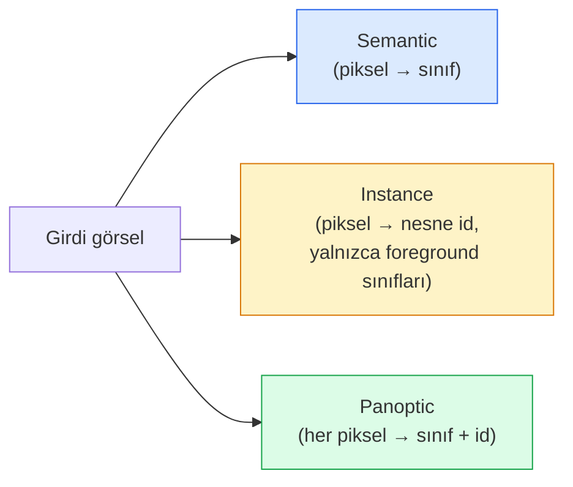
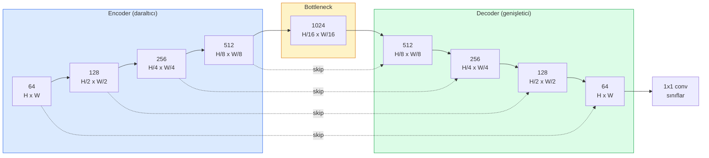

# Semantic Segmentation — U-Net

> Segmentasyon, her pikseldeki classification'dır. U-Net bunu downsampling bir encoder ile upsampling bir decoder'ı eşleştirip aralarına skip bağlantıları çekerek çalıştırır.

**Tür:** Yapım
**Diller:** Python
**Ön koşullar:** Faz 4 Ders 03 (CNN'ler), Faz 4 Ders 04 (Image Classification)
**Süre:** ~75 dakika

## Öğrenme Hedefleri

- Semantic, instance ve panoptic segmentasyonu ayır ve verili bir problem için doğru görevi seç
- PyTorch'ta sıfırdan bir U-Net kur; encoder block'lar, bir bottleneck, transposed convolutions ile bir decoder ve skip bağlantıları
- Piksel-bazlı cross-entropy, Dice loss ve tıbbi ve endüstriyel segmentasyon için mevcut varsayılan olan kombine loss'u uygula
- Sınıf başına IoU ve Dice metriklerini oku ve kötü bir skorun küçük-nesne recall'undan, sınır doğruluğundan ya da sınıf dengesizliğinden gelip gelmediğini teşhis et

## Sorun

Classification görsel başına bir etiket üretir. Detection görsel başına bir avuç kutu üretir. Segmentasyon piksel başına bir etiket üretir. `H x W` boyutunda bir girdi için çıktı `H x W` (semantic) ya da `H x W x N_instances` (instance) şeklindeki bir tensor'dur. Bu görsel başına milyonlarca tahmin demektir, bir tane değil.

Segmentasyonun yapısı, neredeyse her yoğun-tahmin görü ürününü neden güçlendirdiğinin nedenidir: tıbbi görüntüleme (tümör mask'leri), otonom sürüş (yol, şerit, engel), uydu (bina ayak izleri, mahsul sınırları), doküman parsing (layout zone'ları), robotik (tutulabilir bölgeler). Bu görevlerin hiçbiri nesnenin etrafına bir kutu koyarak çözülemez; tam silüete ihtiyaç duyarlar.

Mimari problem belirtmesi basit ve çözmesi basit değil: ağın bir görselin global bağlamını (bu ne tür bir sahne) ve yerel piksel detayını (tam olarak hangi piksel yol vs kaldırım) aynı anda görmesi gerekir. Standart bir CNN bağlam kazanmak için uzaysal olarak sıkıştırır, bu da detayı atar. U-Net her ikisini de alan tasarımdı.

## Kavram

### Semantic vs instance vs panoptic



- **Semantic** "bu piksel yol, o piksel araba" der. Yan yana iki araba tek bir bloba çöker.
- **Instance** "bu piksel araba #3, o piksel araba #5" der. Arka plan stuff'ı görmezden gelir ("stuff" = gökyüzü, yol, çim).
- **Panoptic** ikisini birleştirir: her piksel bir sınıf etiketi alır, her instance benzersiz bir id alır, hem stuff hem things segmente edilir.

Bu ders semantic'i kapsar. Bir sonraki ders (Mask R-CNN) instance'ı kapsar.

### U-Net şekli



Encoder uzaysal çözünürlüğü dört kez yarıya indirir ve kanalları iki katına çıkarır. Decoder tersine çevirir: uzaysal çözünürlüğü dört kez iki katına çıkarır ve kanalları yarıya indirir. Skip bağlantıları her çözünürlükte eşleşen encoder feature'larını decoder feature'larıyla birleştirir. Son 1x1 conv tam çözünürlükte `64 -> num_classes` map eder.

Skip bağlantıları neden gerekli: decoder, piksel düzeyinde tahminler üretmeye çalıştığında yalnızca küçük feature map'leri görmüştür. Skip'ler olmadan kenarları doğru lokalize edemez çünkü o bilgi encoder'da sıkıştırılıp uzaklaştırılmıştır. Skip bağlantıları encoder'ın aşağı inerken hesapladığı yüksek-çözünürlüklü feature map'leri ona uzatır.

### Transposed vs bilinear upsample

Decoder uzaysal boyutları genişletmek zorundadır. İki seçenek:

- **Transposed convolution** (`nn.ConvTranspose2d`) — öğrenilebilir upsample. Tarihi U-Net varsayılanı. Stride ve kernel boyutu eşit bölünmezse satranç tahtası artefaktları üretebilir.
- **Bilinear upsample + 3x3 conv** — pürüzsüz upsample artından conv. Daha az artefakt, daha az parametre, artık modern varsayılan.

İkisi de vahşi doğada görünür. İlk U-Net için bilinear daha güvenlidir.

### Bir piksel grid'inde cross-entropy

C sınıflı semantic segmentasyon için model çıktısı `(N, C, H, W)`. Hedef tam sayı sınıf ID'leri ile `(N, H, W)`. Cross-entropy classification durumuyla aynıdır, sadece her uzaysal konumda uygulanır:

```
Loss = (n, h, w) üzerinde mean of -log( softmax(logits[n, :, h, w])[target[n, h, w]] )
```

PyTorch'ta `F.cross_entropy` bu shape'i doğal olarak halleder. Reshape gerekmez.

### Dice loss ve neden ihtiyacın var

Cross-entropy her piksele eşit davranır. Bu, bir sınıf kareye hakim olduğunda yanlıştır (tıbbi görüntüleme: %99 arka plan, %1 tümör). Ağ her yerde arka plan tahmin ederek %99 doğruluk alabilir ve yine de işe yaramaz olabilir.

Dice loss bunu öngörülen ve gerçek mask arasındaki örtüşmeyi doğrudan optimize ederek çözer:

```
Dice(p, y) = 2 * sum(p * y) / (sum(p) + sum(y) + epsilon)
Dice_loss = 1 - Dice
```

burada `p` bir sınıf için sigmoid/softmax olasılık map'i, `y` ikili ground-truth mask'tir. Loss yalnızca örtüşme mükemmel olduğunda sıfırdır. Oran tabanlı olduğu için sınıf dengesizliği önemsizdir.

Pratikte **combined loss** kullan:

```
L = L_cross_entropy + lambda * L_dice       (lambda ~ 1)
```

Cross-entropy eğitimin başında kararlı gradyanlar verir; Dice eğitimin kuyruğunu mask şeklini gerçekten eşleştirmeye odaklar. Bu kombinasyon tıbbi görüntüleme varsayılanıdır ve herhangi bir sınıf-dengesiz dataset'te yenilmesi zordur.

### Değerlendirme metrikleri

- **Piksel doğruluğu** — doğru tahmin edilen piksellerin yüzdesi. Ucuz. Sınıflandırmada doğruluğun aynı nedeniyle dengesiz verilerde bozuk.
- **Sınıf başına IoU** — her sınıfın mask'ı için intersection over union; sınıflar üzerinde ortalama = mIoU.
- **Dice (piksellerde F1)** — IoU'ya benzer; `Dice = 2 * IoU / (1 + IoU)`. Tıbbi görüntüleme Dice'ı, sürüş topluluğu IoU'yu tercih eder; monotonik olarak ilişkilidirler.
- **Boundary F1** — öngörülen sınırların ground-truth sınırlara ne kadar yakın olduğunu ölçer, küçük kaymaları bile cezalandırır. Yarı iletken inceleme gibi yüksek-hassasiyetli görevler için önemli.

mIoU değil, sınıf başına IoU raporla. Mean IoU, dokuzu %85'teyken %15'te olan bir sınıfı saklar.

### Girdi çözünürlüğü trade-off'u

U-Net'in encoder'ı çözünürlüğü dört kez yarıya indirir, bu yüzden girdi 16'ya bölünebilir olmalıdır. Tıbbi görseller genellikle 512x512 ya da 1024x1024'tür. Otonom sürüş crop'ları 2048x1024'tür. U-Net'in bellek maliyeti `H * W * C_max` ile ölçeklenir ve 1024x1024'te 1024 bottleneck kanalla forward pass zaten gigabytes VRAM kullanır.

İki standart çözüm:
1. Girdiyi tile'a böl — örtüşmeyle 256x256 tile'ları işle ve dik.
2. Bottleneck'i uzaysal çözünürlüğü daha yüksek tutan ama receptive field'ı genişleten dilated convolution'larla değiştir (DeepLab ailesi).

İlk model için 64 kanal-tabanlı bir U-Net ile 256x256 girdi 8 GB VRAM'de rahatça eğitilir.

## İnşa Et

### Adım 1: Encoder block

Batch norm ve ReLU ile iki 3x3 conv. İlk conv kanal sayısını değiştirir; ikincisi tutar.

```python
import torch
import torch.nn as nn
import torch.nn.functional as F

class DoubleConv(nn.Module):
    def __init__(self, in_c, out_c):
        super().__init__()
        self.net = nn.Sequential(
            nn.Conv2d(in_c, out_c, kernel_size=3, padding=1, bias=False),
            nn.BatchNorm2d(out_c),
            nn.ReLU(inplace=True),
            nn.Conv2d(out_c, out_c, kernel_size=3, padding=1, bias=False),
            nn.BatchNorm2d(out_c),
            nn.ReLU(inplace=True),
        )

    def forward(self, x):
        return self.net(x)
```

Bu block her yerde tekrar kullanılır. `bias=False` çünkü BN'nin beta'sı bias'ı halleder.

### Adım 2: Down ve up block'lar

```python
class Down(nn.Module):
    def __init__(self, in_c, out_c):
        super().__init__()
        self.net = nn.Sequential(
            nn.MaxPool2d(2),
            DoubleConv(in_c, out_c),
        )

    def forward(self, x):
        return self.net(x)


class Up(nn.Module):
    def __init__(self, in_c, out_c):
        super().__init__()
        self.up = nn.Upsample(scale_factor=2, mode="bilinear", align_corners=False)
        self.conv = DoubleConv(in_c, out_c)

    def forward(self, x, skip):
        x = self.up(x)
        if x.shape[-2:] != skip.shape[-2:]:
            x = F.interpolate(x, size=skip.shape[-2:], mode="bilinear", align_corners=False)
        x = torch.cat([skip, x], dim=1)
        return self.conv(x)
```

Yalnız-uzaysal shape kontrolü (`shape[-2:]`), boyutları 16'ya bölünemeyen girdileri halleder; güvenli bir `F.interpolate` concat'ten önce tensor'u hizalar. Tam shape karşılaştırması kanal sayısı farklarında da tetiklenir, ki bu sessiz bir interpolate değil yüksek sesli bir hata olmalıdır.

### Adım 3: U-Net

```python
class UNet(nn.Module):
    def __init__(self, in_channels=3, num_classes=2, base=64):
        super().__init__()
        self.inc = DoubleConv(in_channels, base)
        self.d1 = Down(base, base * 2)
        self.d2 = Down(base * 2, base * 4)
        self.d3 = Down(base * 4, base * 8)
        self.d4 = Down(base * 8, base * 16)
        self.u1 = Up(base * 16 + base * 8, base * 8)
        self.u2 = Up(base * 8 + base * 4, base * 4)
        self.u3 = Up(base * 4 + base * 2, base * 2)
        self.u4 = Up(base * 2 + base, base)
        self.outc = nn.Conv2d(base, num_classes, kernel_size=1)

    def forward(self, x):
        x1 = self.inc(x)
        x2 = self.d1(x1)
        x3 = self.d2(x2)
        x4 = self.d3(x3)
        x5 = self.d4(x4)
        x = self.u1(x5, x4)
        x = self.u2(x, x3)
        x = self.u3(x, x2)
        x = self.u4(x, x1)
        return self.outc(x)

net = UNet(in_channels=3, num_classes=2, base=32)
x = torch.randn(1, 3, 256, 256)
print(f"output: {net(x).shape}")
print(f"params: {sum(p.numel() for p in net.parameters()):,}")
```

Çıktı shape'i `(1, 2, 256, 256)` — girdiyle aynı uzaysal boyut, `num_classes` kanal. `base=32`'de yaklaşık 7.7M parametre.

### Adım 4: Loss'lar

```python
def dice_loss(logits, targets, num_classes, eps=1e-6):
    probs = F.softmax(logits, dim=1)
    targets_one_hot = F.one_hot(targets, num_classes).permute(0, 3, 1, 2).float()
    dims = (0, 2, 3)
    intersection = (probs * targets_one_hot).sum(dim=dims)
    denom = probs.sum(dim=dims) + targets_one_hot.sum(dim=dims)
    dice = (2 * intersection + eps) / (denom + eps)
    return 1 - dice.mean()


def combined_loss(logits, targets, num_classes, lam=1.0):
    ce = F.cross_entropy(logits, targets)
    dc = dice_loss(logits, targets, num_classes)
    return ce + lam * dc, {"ce": ce.item(), "dice": dc.item()}
```

Dice sınıf başına hesaplanır sonra ortalanır (macro Dice). `eps`, batch'ten yoksun sınıflarda sıfıra bölünmeyi önler.

### Adım 5: IoU metriği

```python
@torch.no_grad()
def iou_per_class(logits, targets, num_classes):
    preds = logits.argmax(dim=1)
    ious = torch.zeros(num_classes)
    for c in range(num_classes):
        pred_c = (preds == c)
        true_c = (targets == c)
        inter = (pred_c & true_c).sum().float()
        union = (pred_c | true_c).sum().float()
        ious[c] = (inter / union) if union > 0 else torch.tensor(float("nan"))
    return ious
```

C uzunluğunda bir vektör döndürür. `nan`, batch'ten yoksun sınıfları işaretler — mIoU hesaplarken bunların üzerinde ortalama alma.

### Adım 6: Uçtan uca doğrulama için sentetik dataset

Ağın pikel rengini değil şekli öğrenmesi gerekecek şekilde renkli arka planlar üzerinde şekiller üret.

```python
import numpy as np
from torch.utils.data import Dataset, DataLoader

def synthetic_segmentation(num_samples=200, size=64, seed=0):
    rng = np.random.default_rng(seed)
    images = np.zeros((num_samples, size, size, 3), dtype=np.float32)
    masks = np.zeros((num_samples, size, size), dtype=np.int64)
    for i in range(num_samples):
        bg = rng.uniform(0, 1, (3,))
        images[i] = bg
        masks[i] = 0
        num_shapes = rng.integers(1, 4)
        for _ in range(num_shapes):
            cls = int(rng.integers(1, 3))
            color = rng.uniform(0, 1, (3,))
            cx, cy = rng.integers(10, size - 10, size=2)
            r = int(rng.integers(4, 12))
            yy, xx = np.meshgrid(np.arange(size), np.arange(size), indexing="ij")
            if cls == 1:
                mask = (xx - cx) ** 2 + (yy - cy) ** 2 < r ** 2
            else:
                mask = (np.abs(xx - cx) < r) & (np.abs(yy - cy) < r)
            images[i][mask] = color
            masks[i][mask] = cls
        images[i] += rng.normal(0, 0.02, images[i].shape)
        images[i] = np.clip(images[i], 0, 1)
    return images, masks


class SegDataset(Dataset):
    def __init__(self, images, masks):
        self.images = images
        self.masks = masks

    def __len__(self):
        return len(self.images)

    def __getitem__(self, i):
        img = torch.from_numpy(self.images[i]).permute(2, 0, 1).float()
        mask = torch.from_numpy(self.masks[i]).long()
        return img, mask
```

Üç sınıf: arka plan (0), daireler (1), kareler (2). Ağ şekli ayırt etmeyi öğrenmek zorunda.

### Adım 7: Eğitim döngüsü

```python
def train_one_epoch(model, loader, optimizer, device, num_classes):
    model.train()
    loss_sum, total = 0.0, 0
    iou_sum = torch.zeros(num_classes)
    for x, y in loader:
        x, y = x.to(device), y.to(device)
        logits = model(x)
        loss, _ = combined_loss(logits, y, num_classes)
        optimizer.zero_grad()
        loss.backward()
        optimizer.step()
        loss_sum += loss.item() * x.size(0)
        total += x.size(0)
        iou_sum += iou_per_class(logits, y, num_classes).nan_to_num(0)
    return loss_sum / total, iou_sum / len(loader)
```

Bunu sentetik dataset'te 10-30 epoch çalıştır ve şekil sınıfları için mIoU'nun 0.9'u aştığını izle. `nan_to_num(0)`'in batch'ten yoksun sınıfları sıfır olarak ele aldığını not et; doğru sınıf-başına IoU için, varlığa göre maskele ve burada ortalama almak yerine değerlendirme zamanında batch'ler arası `torch.nanmean` kullan.

## Kullan

Üretim için `segmentation_models_pytorch` ("smp") her standart segmentasyon mimarisini herhangi bir torchvision ya da timm backbone'la sarar. Üç satır:

```python
import segmentation_models_pytorch as smp

model = smp.Unet(
    encoder_name="resnet34",
    encoder_weights="imagenet",
    in_channels=3,
    classes=3,
)
```

Gerçek iş için bilmeye değer:
- **DeepLabV3+** max-pool tabanlı downsampling'i dilated conv'larla değiştirir, böylece bottleneck çözünürlüğü korur; uydu ve sürüş verilerinde daha hızlı sınırlar.
- **SegFormer** conv encoder'ı hiyerarşik bir transformer ile değiştirir; birçok benchmark'ta mevcut SOTA.
- **Mask2Former** / **OneFormer** semantic, instance ve panoptic segmentasyonu tek bir mimaride birleştirir.

Üçü de aynı data loader ile `smp` veya `transformers`'ta drop-in yedektir.

## Yayınla

Bu ders şunları üretir:

- `outputs/prompt-segmentation-task-picker.md` — semantic, instance ve panoptic segmentasyon arasında seçim yapan ve verili bir görev için mimariyi adlandıran bir prompt.
- `outputs/skill-segmentation-mask-inspector.md` — sınıf dağılımını, öngörülen mask istatistiklerini ve yetersiz tahmin edilen ya da sınır bulanıklığı olan sınıfları raporlayan bir skill.

## Alıştırmalar

1. **(Kolay)** Bir binary segmentasyon görevi için (foreground vs arka plan) `bce_dice_loss` uygula. Foreground piksellerin %5'i olduğunda kombine loss'un tek başına BCE'den daha hızlı yakınsadığını sentetik iki-sınıflı bir dataset'te doğrula.
2. **(Orta)** `nn.Upsample + conv` up-block'unu bir `nn.ConvTranspose2d` up-block'u ile değiştir. Her ikisini sentetik dataset'te eğit ve mIoU karşılaştır. Transposed-conv versiyonunda satranç tahtası artefaktlarının nerede ortaya çıktığını gözlemle.
3. **(Zor)** Gerçek bir segmentasyon dataset'i al (Oxford-IIIT Pets, Cityscapes mini split ya da bir tıbbi alt küme) ve U-Net'i `smp.Unet` referansının 2 IoU puanı içinde eğit. Sınıf başına IoU raporla ve Dice'ı loss'a eklemenin en çok hangi sınıflara fayda sağladığını belirle.

## Anahtar Terimler

| Terim | İnsanlar ne diyor | Gerçekte ne anlama geliyor |
|------|----------------|----------------------|
| Semantic segmentasyon | "Her pikseli etiketle" | C sınıfa piksel-başı classification; aynı sınıfın instance'ları birleşir |
| Instance segmentasyon | "Her nesneyi etiketle" | Aynı sınıfın farklı instance'larını ayırır; yalnızca foreground |
| Panoptic segmentasyon | "Semantic + instance" | Her piksel bir sınıf alır; her thing instance ayrıca benzersiz bir id alır |
| Skip connection | "U-Net köprüsü" | Encoder feature'larının eşleşen çözünürlükteki decoder feature'larına birleştirilmesi; yüksek-frekans detayını korur |
| Transposed conv | "Deconvolution" | Öğrenilebilir upsampling; satranç tahtası artefaktları üretebilir |
| Dice loss | "Örtüşme loss'u" | 1 - 2|A ∩ B| / (|A| + |B|); mask örtüşmesini doğrudan optimize eder ve sınıf dengesizliğine dayanıklıdır |
| mIoU | "Mean intersection over union" | Sınıflar üzerinde ortalama IoU; segmentasyon için topluluk-standart metriği |
| Boundary F1 | "Sınır doğruluğu" | Yalnızca sınır pikselleri üzerinde hesaplanan F1 skoru; hassasiyet kritik görevler için önemli |

## İleri Okuma

- [U-Net: Convolutional Networks for Biomedical Image Segmentation (Ronneberger et al., 2015)](https://arxiv.org/abs/1505.04597) — orijinal makale; herkesin kopyaladığı figür sayfa 2'de
- [Fully Convolutional Networks (Long et al., 2015)](https://arxiv.org/abs/1411.4038) — segmentasyonu uçtan uca bir conv problemi yapan ilk makale
- [segmentation_models_pytorch](https://github.com/qubvel/segmentation_models.pytorch) — üretim segmentasyonu için referans; her standart mimari artı her standart loss
- [Lessons learned from training SOTA segmentation (kaggle.com competitions)](https://www.kaggle.com/code/iafoss/carvana-unet-pytorch) — TTA, pseudo-labeling ve sınıf ağırlıklarının gerçek veride neden önemli olduğunun yürüyüşü
