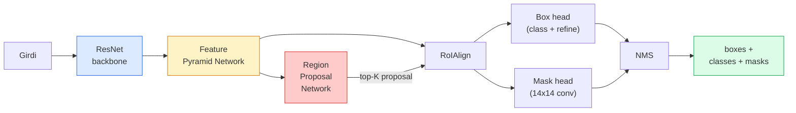

# Instance Segmentation — Mask R-CNN

> Bir Faster R-CNN detektörüne ufak bir mask branch'i ekle, instance segmentasyonun olur. Zor olan kısım RoIAlign ve göründüğünden daha zor.

**Tür:** Yapım + Öğrenim
**Diller:** Python
**Ön koşullar:** Faz 4 Ders 06 (YOLO), Faz 4 Ders 07 (U-Net)
**Süre:** ~75 dakika

## Öğrenme Hedefleri

- Mask R-CNN mimarisini uçtan uca izle: backbone, FPN, RPN, RoIAlign, box head, mask head
- RoIAlign'ı sıfırdan uygula ve RoIPool'un neden artık kullanılmadığını açıkla
- Üretim kalitesinde instance mask'leri için torchvision `maskrcnn_resnet50_fpn_v2` pretrained modelini kullan ve çıktı formatını doğru oku
- Box ve mask head'leri değiştirip backbone'u donmuş tutarak küçük bir özel dataset'te Mask R-CNN'i fine-tune et

## Sorun

Semantic segmentasyon sana sınıf başına bir mask verir. Instance segmentasyon nesne başına bir mask verir, hatta iki nesne bir sınıfı paylaşsa bile. Bireyleri saymak, kareler arasında takip etmek ve şeyleri ölçmek (bir duvardaki her tuğlanın bounding box'u, mikroskop görselindeki her hücre) hepsi instance segmentasyonu gerektirir.

Mask R-CNN (He et al., 2017) bunu instance segmentasyonu detection-artı-mask olarak yeniden çerçeveleyerek çözdü. Tasarım o kadar temizdi ki sonraki beş yıl boyunca neredeyse her instance segmentasyon makalesi bir Mask R-CNN varyantıydı ve torchvision implementasyonu hâlâ küçükten orta dataset'lere üretim varsayılanıdır.

Zor mühendislik problemi sampling'tir: köşeleri piksel sınırlarıyla hizalı olmayan bir proposal kutusundan nasıl sabit-boyutlu bir feature bölgesi kırpılır? Bunu yanlış yapmak her yerde ondalık mAP puanlarına mal olur. RoIAlign cevaptır.

## Kavram

### Mimari



Anlaman gereken beş parça:

1. **Backbone** — ImageNet üzerinde eğitilmiş ResNet-50 ya da ResNet-101. Stride 4, 8, 16, 32'de bir feature map hiyerarşisi üretir.
2. **FPN (Feature Pyramid Network)** — her seviyeye semantik zengin feature'ların C kanalını veren top-down + yan bağlantılar. Detection nesne boyutuyla eşleşen FPN seviyesini sorgular.
3. **RPN (Region Proposal Network)** — her anchor konumunda "burada bir nesne var mı?" ve "kutuyu nasıl rafine ederim?" tahmin eden küçük bir conv head. Görsel başına ~1000 proposal üretir.
4. **RoIAlign** — herhangi bir FPN seviyesinde herhangi bir kutudan sabit-boyutlu (örn. 7x7) feature patch'i örnekler. Bilinear sampling, quantization yok.
5. **Head'ler** — kutuyu rafine eden ve bir sınıf seçen iki-katmanlı box head, artı her proposal için `28x28` ikili mask üreten küçük bir conv head.

### Neden RoIAlign, RoIPool değil

Orijinal Fast R-CNN, bir proposal kutusunu grid'e bölen, her hücrede maksimum feature'ı alan ve tüm koordinatları tam sayıya yuvarlayan RoIPool kullanıyordu. O yuvarlama, feature map'i girdi piksel koordinatlarından tam bir feature-map pikseline kadar yanlış hizalar — 224x224 görselde küçük, feature map stride 32 olduğunda yıkıcı.

```
RoIPool:
  kutu (34.7, 51.3, 98.2, 142.9)
  yuvarla -> (34, 51, 98, 142)
  grid'e böl -> her hücre sınırını yuvarla
  her adımda yanlış hizalama birikir

RoIAlign:
  kutu (34.7, 51.3, 98.2, 142.9)
  bilinear interpolation kullanarak tam float koordinatlarında örnekle
  hiçbir yerde yuvarlama yok
```

RoIAlign COCO'da mask AP'yi bedavaya 3-4 puan yükseltir. Lokalizasyona önem veren her detektör artık bunu kullanır — YOLOv7 seg, RT-DETR, Mask2Former.

### Tek paragrafta RPN

Bir feature map'in her konumunda farklı boyutlarda ve şekillerde K anchor kutusu yerleştir. Her anchor için bir objectness skoru ve anchor'ı daha iyi uyan bir kutuya çevirmek için bir regresyon offset tahmin et. Skora göre top ~1.000 kutuyu tut, IoU 0.7'de NMS uygula ve hayatta kalanları head'lere ver. RPN kendi mini-loss'uyla eğitilir — Ders 6'daki YOLO loss'uyla aynı yapı, sadece iki sınıfla (nesne / nesne yok).

### Mask head

Her proposal için (RoIAlign sonrası) mask head ufak bir FCN'dir: dört 3x3 conv, bir 2x deconv, `28x28` çözünürlükte `num_classes` çıktı kanalı üreten son bir 1x1 conv. Yalnızca öngörülen sınıfa karşılık gelen kanal tutulur; diğerleri görmezden gelinir. Bu mask tahminini classification'dan ayırır.

Son ikili mask'ı üretmek için 28x28 mask'ı proposal'ın orijinal piksel boyutuna upsample et.

### Loss'lar

Mask R-CNN'in birlikte eklenmiş dört loss'u vardır:

```
L = L_rpn_cls + L_rpn_box + L_box_cls + L_box_reg + L_mask
```

- `L_rpn_cls`, `L_rpn_box` — RPN proposal'ları için objectness + box regresyonu.
- `L_box_cls` — head'in sınıflandırıcısı üzerinde (C+1) sınıf üzerinde cross-entropy (arka plan dahil).
- `L_box_reg` — head'in box refinement'ı üzerinde smooth L1.
- `L_mask` — 28x28 mask çıktısı üzerinde piksel başına ikili cross-entropy.

Her loss'un kendi varsayılan ağırlığı vardır; torchvision implementasyonu bunları constructor argümanları olarak açar.

### Çıktı formatı

`torchvision.models.detection.maskrcnn_resnet50_fpn_v2`, görsel başına bir dict olmak üzere bir dict listesi döndürür:

```
{
    "boxes":  (N, 4) (x1, y1, x2, y2) piksel koordinatlarında,
    "labels": (N,) sınıf ID'leri, 0 = arka plan, dolayısıyla index'ler 1-tabanlı,
    "scores": (N,) güven skorları,
    "masks":  (N, 1, H, W) [0, 1]'de float mask'lar — ikili için 0.5'te threshold,
}
```

Mask zaten tam görsel çözünürlüğünde. 28x28 head çıktısı içeride upsample edilmiş.

## İnşa Et

### Adım 1: Sıfırdan RoIAlign

Bu, Mask R-CNN'in nesir olarak anlamaktan daha basit olan tek bileşendir.

```python
import torch
import torch.nn.functional as F

def roi_align_single(feature, box, output_size=7, spatial_scale=1 / 16.0):
    """
    feature: (C, H, W) tek-görsel feature map
    box: orijinal görsel piksel koordinatlarında (x1, y1, x2, y2)
    output_size: çıktı grid'inin kenarı (box head için 7, mask head için 14)
    spatial_scale: feature map stride'ının tersi
    """
    C, H, W = feature.shape
    x1, y1, x2, y2 = [c * spatial_scale - 0.5 for c in box]
    bin_w = (x2 - x1) / output_size
    bin_h = (y2 - y1) / output_size

    grid_y = torch.linspace(y1 + bin_h / 2, y2 - bin_h / 2, output_size)
    grid_x = torch.linspace(x1 + bin_w / 2, x2 - bin_w / 2, output_size)
    yy, xx = torch.meshgrid(grid_y, grid_x, indexing="ij")

    gx = 2 * (xx + 0.5) / W - 1
    gy = 2 * (yy + 0.5) / H - 1
    grid = torch.stack([gx, gy], dim=-1).unsqueeze(0)
    sampled = F.grid_sample(feature.unsqueeze(0), grid, mode="bilinear",
                            align_corners=False)
    return sampled.squeeze(0)
```

Her sayı bilinear-örneklenmiş bir konumda. Yuvarlama yok, quantization yok, düşmüş gradyan yok.

### Adım 2: torchvision'ın RoIAlign'ı ile karşılaştır

```python
from torchvision.ops import roi_align

feature = torch.randn(1, 16, 50, 50)
boxes = torch.tensor([[0, 10, 20, 100, 90]], dtype=torch.float32)  # (batch_idx, x1, y1, x2, y2)

ours = roi_align_single(feature[0], boxes[0, 1:].tolist(), output_size=7, spatial_scale=1/4)
theirs = roi_align(feature, boxes, output_size=(7, 7), spatial_scale=1/4, sampling_ratio=1, aligned=True)[0]

print(f"shape ours:   {tuple(ours.shape)}")
print(f"shape theirs: {tuple(theirs.shape)}")
print(f"max|diff|:    {(ours - theirs).abs().max().item():.3e}")
```

`sampling_ratio=1` ve `aligned=True` ile ikisi `1e-5` içinde eşleşir.

### Adım 3: Pretrained Mask R-CNN yükle

```python
import torch
from torchvision.models.detection import maskrcnn_resnet50_fpn_v2, MaskRCNN_ResNet50_FPN_V2_Weights

model = maskrcnn_resnet50_fpn_v2(weights=MaskRCNN_ResNet50_FPN_V2_Weights.DEFAULT)
model.eval()
print(f"params: {sum(p.numel() for p in model.parameters()):,}")
print(f"classes (arka plan dahil): {len(model.roi_heads.box_predictor.cls_score.out_features * [0])}")
```

46M parametre, 91 sınıf (COCO). İlk sınıf (id 0) arka plandır; modelin gerçekten tespit ettiği her şey id 1'de başlar.

### Adım 4: Inference çalıştır

```python
with torch.no_grad():
    x = torch.randn(3, 400, 600)
    predictions = model([x])
p = predictions[0]
print(f"boxes:  {tuple(p['boxes'].shape)}")
print(f"labels: {tuple(p['labels'].shape)}")
print(f"scores: {tuple(p['scores'].shape)}")
print(f"masks:  {tuple(p['masks'].shape)}")
```

Mask tensor `(N, 1, H, W)` shape'inde. Nesne başına ikili mask elde etmek için 0.5'te threshold:

```python
binary_masks = (p['masks'] > 0.5).squeeze(1)  # (N, H, W) boolean
```

### Adım 5: Özel sınıf sayısı için head'leri değiştir

Yaygın fine-tuning tarifi: backbone'u, FPN'yi ve RPN'yi yeniden kullan; iki sınıflandırıcı head'i değiştir.

```python
from torchvision.models.detection.faster_rcnn import FastRCNNPredictor
from torchvision.models.detection.mask_rcnn import MaskRCNNPredictor

def build_custom_maskrcnn(num_classes):
    model = maskrcnn_resnet50_fpn_v2(weights=MaskRCNN_ResNet50_FPN_V2_Weights.DEFAULT)
    in_features = model.roi_heads.box_predictor.cls_score.in_features
    model.roi_heads.box_predictor = FastRCNNPredictor(in_features, num_classes)
    in_features_mask = model.roi_heads.mask_predictor.conv5_mask.in_channels
    hidden_layer = 256
    model.roi_heads.mask_predictor = MaskRCNNPredictor(in_features_mask, hidden_layer, num_classes)
    return model

custom = build_custom_maskrcnn(num_classes=5)
print(f"custom cls_score.out_features: {custom.roi_heads.box_predictor.cls_score.out_features}")
```

`num_classes`, arka plan sınıfını dahil etmelidir, dolayısıyla 4 nesne sınıflı bir dataset `num_classes=5` kullanır.

### Adım 6: Eğitime ihtiyacı olmayanı dondur

Küçük dataset'lerde backbone'u ve FPN'yi dondur. Yalnızca RPN objectness + regresyonu ve iki head öğrenir.

```python
def freeze_backbone_and_fpn(model):
    # torchvision Mask R-CNN, FPN'yi `model.backbone` içine paketler
    # (`model.backbone.fpn` olarak), dolayısıyla `model.backbone.parameters()`
    # üzerinden iterate etmek hem ResNet feature katmanlarını hem FPN lateral/output
    # conv'larını kapsar.
    for p in model.backbone.parameters():
        p.requires_grad = False
    return model

custom = freeze_backbone_and_fpn(custom)
trainable = sum(p.numel() for p in custom.parameters() if p.requires_grad)
print(f"freeze sonrası trainable: {trainable:,}")
```

500-görsel dataset'lerde bu, yakınsama ile overfitting arasındaki farktır.

## Kullan

torchvision'da Mask R-CNN'in tam eğitim döngüsü 40 satırdır ve görevler arasında anlamlı şekilde değişmez — dataset'leri değiştir ve git.

```python
def train_step(model, images, targets, optimizer):
    model.train()
    loss_dict = model(images, targets)
    losses = sum(loss for loss in loss_dict.values())
    optimizer.zero_grad()
    losses.backward()
    optimizer.step()
    return {k: v.item() for k, v in loss_dict.items()}
```

`targets` listesinin `boxes`, `labels` ve `masks` (`(num_instances, H, W)` ikili tensor olarak) içeren görsel başına dict'leri olmalıdır. Model, eğitim sırasında dört loss'un bir dict'ini ve eval sırasında bir tahmin listesini, `model.training`'e key'lenmiş olarak döndürür.

`pycocotools` değerlendiricisi hem kutular hem mask'lar için mAP@IoU=0.5:0.95 üretir; box head'in mi mask head'in mi bottleneck olduğunu bilmek için her iki sayıya ihtiyacın var.

## Yayınla

Bu ders şunları üretir:

- `outputs/prompt-instance-vs-semantic-router.md` — üç soru soran ve instance vs semantic vs panoptic artı başlanacak tam modeli seçen bir prompt.
- `outputs/skill-mask-rcnn-head-swapper.md` — yeni `num_classes` verildiğinde herhangi bir torchvision detection modelinde head'leri değiştirmek için 10 satır kod üreten bir skill.

## Alıştırmalar

1. **(Kolay)** 100 rastgele kutu üzerinde RoIAlign'ını `torchvision.ops.roi_align`'a karşı doğrula. Maks mutlak farkı raporla. Ayrıca RoIPool (2017 öncesi davranış) çalıştır ve sınır yakınındaki kutularda ~1-2 feature-map pikselle ıraksadığını göster.
2. **(Orta)** `maskrcnn_resnet50_fpn_v2`'yi 50-görsellik özel bir dataset'te fine-tune et (herhangi iki sınıf: balonlar, balıklar, çukur, logolar). Backbone'u dondur, 20 epoch eğit, mask AP@0.5 raporla.
3. **(Zor)** Mask R-CNN'in mask head'ini 28x28 yerine 56x56'da tahmin eden biriyle değiştir. Öncesi ve sonrası mAP@IoU=0.75'i ölç. Kazancın (ya da yokluğunun) beklenen sınır-hassasiyet / bellek trade-off'una neden uyduğunu açıkla.

## Anahtar Terimler

| Terim | İnsanlar ne diyor | Gerçekte ne anlama geliyor |
|------|----------------|----------------------|
| Mask R-CNN | "Detection artı mask'lar" | Faster R-CNN + proposal başına sınıf başına 28x28 mask tahmin eden küçük bir FCN head |
| FPN | "Feature pyramid" | Her stride seviyesine semantik zengin feature'ların C kanalını veren top-down + yan bağlantılar |
| RPN | "Region proposer" | Görsel başına ~1000 nesne/nesne yok proposal'ı üreten küçük bir conv head |
| RoIAlign | "Yuvarlamasız crop" | Herhangi bir float-koordinat kutusundan bilinear olarak sabit-boyutlu feature grid'i örnekler |
| RoIPool | "2017 öncesi crop" | RoIAlign ile aynı amaç ama kutu koordinatlarını yuvarlar; eskimiş |
| Mask AP | "Instance mAP" | Box IoU yerine mask IoU ile hesaplanan average precision; COCO instance segmentasyon metriği |
| Binary mask head | "Sınıf başına mask" | Her proposal için sınıf başına bir ikili mask tahmin eder; yalnızca öngörülen sınıfın kanalı tutulur |
| Background class | "Sınıf 0" | Catch-all "nesne yok" sınıfı; gerçek sınıfların index'leri 1'den başlar |

## İleri Okuma

- [Mask R-CNN (He et al., 2017)](https://arxiv.org/abs/1703.06870) — makale; RoIAlign üzerine 3. bölüm kritik okuma
- [FPN: Feature Pyramid Networks (Lin et al., 2017)](https://arxiv.org/abs/1612.03144) — FPN makalesi; her modern detektör bunu kullanır
- [torchvision Mask R-CNN tutorial](https://pytorch.org/tutorials/intermediate/torchvision_tutorial.html) — fine-tuning döngüsü için referans
- [Detectron2 model zoo](https://github.com/facebookresearch/detectron2/blob/main/MODEL_ZOO.md) — neredeyse her detection ve segmentation varyantı için eğitilmiş weight'lerle üretim implementasyonları
