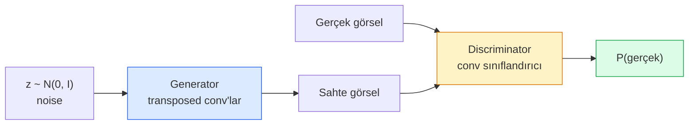
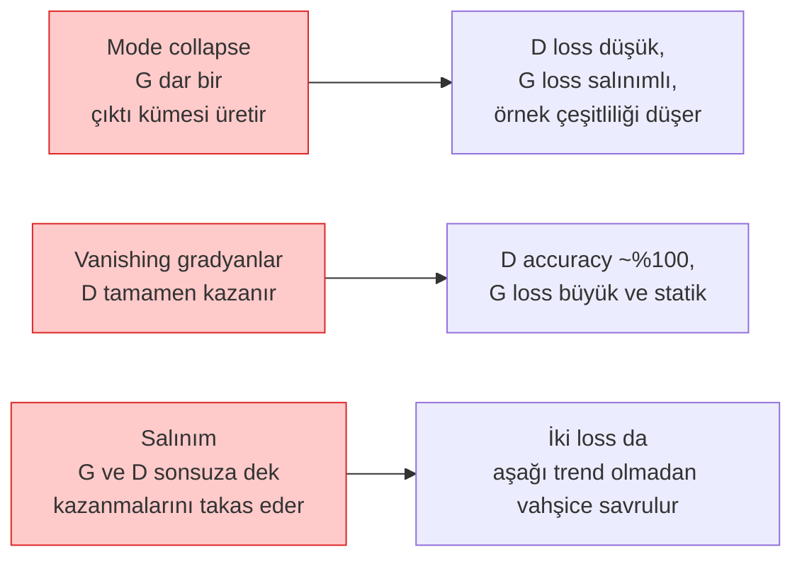

# Image Generation — GAN'lar

> Bir GAN, sabit bir oyunda iki sinir ağıdır. Biri çizer, biri eleştirir. Çizimler eleştirmeni kandırana kadar birlikte iyileşirler.

**Tür:** Yapım
**Diller:** Python
**Ön koşullar:** Faz 4 Ders 03 (CNN'ler), Faz 3 Ders 06 (Optimizer'lar), Faz 3 Ders 07 (Regularization)
**Süre:** ~75 dakika

## Öğrenme Hedefleri

- Generator ve discriminator arasındaki minimax oyununu ve dengenin p_model = p_data'ya neden karşılık geldiğini açıkla
- PyTorch'ta bir DCGAN uygula ve 60 satırın altında tutarlı 32x32 sentetik görseller üretmesini sağla
- GAN eğitimini üç standart hile ile kararlı kıl: non-saturating loss, spectral norm, TTUR (two-timescale update rule)
- Sağlıklı yakınsamayı mode collapse, salınım ve discriminator-tamamen-kazanır'dan ayıran eğitim eğrilerini oku

## Sorun

Classification bir ağa görselleri etiketlere eşlemeyi öğretir. Generation problemi tersine çevirir: aynı dağılımdan gelmiş gibi görünen yeni görseller örnekle. Karşılaştırabileceğin "doğru" bir çıktı yoktur; yalnızca taklit etmek istediğin bir dağılım vardır.

Standart loss fonksiyonları (MSE, cross-entropy) "bu örnek gerçek dağılımdan mı geldi" diye ölçemez. Piksel başına hatayı minimize etmek bulanık ortalamalar üretir, gerçekçi örnekler değil. Atılım, loss'u öğrenmekti: işi gerçek ile sahteyi ayırmak olan ikinci bir ağ eğit ve generator'ı itmek için kararlarını kullan.

GAN'lar (Goodfellow et al., 2014) o çerçeveyi tanımladı. 2018'e gelindiğinde StyleGAN, fotoğraflardan ayırt edilemeyen 1024x1024 yüzler üretiyordu. Diffusion modelleri o zamandan beri kalite ve kontrol edilebilirlik konusunda tahtı aldı, ama diffusion'ı pratik yapan her hile — normalizasyon seçimleri, latent space'ler, feature loss'ları — önce GAN'larda anlaşıldı.

## Kavram

### İki ağ



**Generator** G bir gürültü vektörü `z` alır ve bir görsel üretir. **Discriminator** D bir görsel alır ve tek bir skaler üretir: görselin gerçek olma olasılığı.

### Oyun

G, D'nin yanılmasını ister. D doğru olmak ister. Formal olarak:

```
min_G max_D  E_x[log D(x)] + E_z[log(1 - D(G(z)))]
```

Sağdan sola oku: D, gerçek (`log D(real)`) ve sahte (`log (1 - D(fake))`) görsellerde doğruluğu maksimize ediyor. G ise D'nin sahtelerdeki doğruluğunu minimize ediyor — `D(G(z))`'nin yüksek olmasını istiyor.

Goodfellow bu minimax'in `p_G = p_data` olan bir global denge noktası olduğunu, D'nin her yerde 0.5 çıkardığını ve üretilen ile gerçek dağılımlar arasındaki Jensen-Shannon divergence'ının sıfır olduğunu kanıtladı. Zor olan kısım oraya ulaşmak.

### Non-saturating loss

Yukarıdaki form sayısal olarak kararsızdır. Eğitimin başında her sahte için `D(G(z))` sıfıra yakındır, dolayısıyla `log(1 - D(G(z)))`, G'ye göre yok olan gradyanlara sahiptir. Çözüm: G'nin loss'unu çevir.

```
L_D = -E_x[log D(x)] - E_z[log(1 - D(G(z)))]
L_G = -E_z[log D(G(z))]                          # non-saturating
```

Şimdi `D(G(z))` sıfıra yakınken G'nin loss'u büyük ve gradyanı bilgi verici. Her modern GAN bu varyantla eğitilir.

### DCGAN mimari kuralları

Radford, Metz, Chintala (2015) yıllarca başarısız deneylerin damıtmasını, GAN eğitimini kararlı yapan beş kurala dönüştürdü:

1. Pooling'i strided conv'larla değiştir (her iki ağda).
2. Hem generator hem discriminator'da batch norm kullan, G'nin çıktısı ve D'nin girdisi hariç.
3. Daha derin mimarilerde fully connected katmanları kaldır.
4. G, çıktı hariç tüm katmanlarda ReLU kullanır (çıktıda tanh, [-1, 1] için).
5. D, tüm katmanlarda LeakyReLU (negative_slope=0.2) kullanır.

Her modern conv-tabanlı GAN (StyleGAN, BigGAN, GigaGAN) hâlâ bu kurallardan başlar ve parçaları teker teker değiştirir.

### Başarısızlık modları ve imzaları



- **Mode collapse**: G, D'yi kandıran bir görsel bulur ve yalnızca onu üretir. Çözüm: minibatch discrimination, spectral norm ya da label-conditioning ekle.
- **Discriminator kazanır**: D çok hızlı çok güçlü olur, G'nin gradyanları yok olur. Çözüm: daha küçük D, daha düşük D learning rate ya da gerçek etiketlere label smoothing uygula.
- **Salınım**: iki ağ asla dengeye yaklaşmadan kazanmalarını takas eder. Çözüm: TTUR (D, G'den 2-4 kat daha hızlı öğrenir) ya da Wasserstein loss'a geç.

### Değerlendirme

GAN'ların ground truth'u yok, peki çalıştıklarını nasıl bilirsin?

- **Örnek incelemesi** — her epoch'un sonunda 64 örneğe sadece bak. Pazarlık dışı.
- **FID (Fréchet Inception Distance)** — gerçek ve üretilen setlerin Inception-v3 feature dağılımları arasındaki mesafe. Daha düşük daha iyi. Topluluk standardı.
- **Inception Score** — daha eski, daha kırılgan; FID'i tercih et.
- **Generative modeller için Precision/Recall** — kaliteyi (precision) ve coverage'ı (recall) ayrı ayrı ölçer. Tek başına FID'den daha bilgi verici.

Küçük bir sentetik veri çalışması için örnek incelemesi yeterlidir.

## İnşa Et

### Adım 1: Generator

64-boyutlu gürültü alan ve 32x32 görsel üreten küçük bir DCGAN generator'ı.

```python
import torch
import torch.nn as nn

class Generator(nn.Module):
    def __init__(self, z_dim=64, img_channels=3, feat=64):
        super().__init__()
        self.net = nn.Sequential(
            nn.ConvTranspose2d(z_dim, feat * 4, kernel_size=4, stride=1, padding=0, bias=False),
            nn.BatchNorm2d(feat * 4),
            nn.ReLU(inplace=True),
            nn.ConvTranspose2d(feat * 4, feat * 2, kernel_size=4, stride=2, padding=1, bias=False),
            nn.BatchNorm2d(feat * 2),
            nn.ReLU(inplace=True),
            nn.ConvTranspose2d(feat * 2, feat, kernel_size=4, stride=2, padding=1, bias=False),
            nn.BatchNorm2d(feat),
            nn.ReLU(inplace=True),
            nn.ConvTranspose2d(feat, img_channels, kernel_size=4, stride=2, padding=1, bias=False),
            nn.Tanh(),
        )

    def forward(self, z):
        return self.net(z.view(z.size(0), -1, 1, 1))
```

Her biri `kernel_size=4, stride=2, padding=1` olan dört transposed conv, böylece uzaysal boyutu temiz şekilde iki katına çıkarırlar. Tanh ile [-1, 1] aralığında çıktı aktivasyonları.

### Adım 2: Discriminator

Generator'ın aynası. LeakyReLU, strided conv'lar, skalar logit ile biter.

```python
class Discriminator(nn.Module):
    def __init__(self, img_channels=3, feat=64):
        super().__init__()
        self.net = nn.Sequential(
            nn.Conv2d(img_channels, feat, kernel_size=4, stride=2, padding=1),
            nn.LeakyReLU(0.2, inplace=True),
            nn.Conv2d(feat, feat * 2, kernel_size=4, stride=2, padding=1, bias=False),
            nn.BatchNorm2d(feat * 2),
            nn.LeakyReLU(0.2, inplace=True),
            nn.Conv2d(feat * 2, feat * 4, kernel_size=4, stride=2, padding=1, bias=False),
            nn.BatchNorm2d(feat * 4),
            nn.LeakyReLU(0.2, inplace=True),
            nn.Conv2d(feat * 4, 1, kernel_size=4, stride=1, padding=0),
        )

    def forward(self, x):
        return self.net(x).view(-1)
```

Son conv bir `4x4` feature map'i `1x1`'e indirir. Çıktı görsel başına tek bir skalerdır; sigmoid'i yalnızca loss hesabında uygula.

### Adım 3: Eğitim adımı

Alternatif: her batch'te önce D'yi bir kez, sonra G'yi bir kez güncelle.

```python
import torch.nn.functional as F

def train_step(G, D, real, z, opt_g, opt_d, device):
    real = real.to(device)
    bs = real.size(0)

    # D step
    opt_d.zero_grad()
    d_real = D(real)
    d_fake = D(G(z).detach())
    loss_d = (F.binary_cross_entropy_with_logits(d_real, torch.ones_like(d_real))
              + F.binary_cross_entropy_with_logits(d_fake, torch.zeros_like(d_fake)))
    loss_d.backward()
    opt_d.step()

    # G step
    opt_g.zero_grad()
    d_fake = D(G(z))
    loss_g = F.binary_cross_entropy_with_logits(d_fake, torch.ones_like(d_fake))
    loss_g.backward()
    opt_g.step()

    return loss_d.item(), loss_g.item()
```

D adımında `G(z).detach()` kritik: G güncellemesi sırasında G'ye gradyan akmasını istemiyoruz. Bunu unutmak klasik başlangıç bug'ıdır.

### Adım 4: Sentetik şekillerde tam eğitim döngüsü

```python
from torch.utils.data import DataLoader, TensorDataset
import numpy as np

def synthetic_images(num=2000, size=32, seed=0):
    rng = np.random.default_rng(seed)
    imgs = np.zeros((num, 3, size, size), dtype=np.float32) - 1.0
    for i in range(num):
        r = rng.uniform(6, 12)
        cx, cy = rng.uniform(r, size - r, size=2)
        yy, xx = np.meshgrid(np.arange(size), np.arange(size), indexing="ij")
        mask = (xx - cx) ** 2 + (yy - cy) ** 2 < r ** 2
        color = rng.uniform(-0.5, 1.0, size=3)
        for c in range(3):
            imgs[i, c][mask] = color[c]
    return torch.from_numpy(imgs)

device = "cuda" if torch.cuda.is_available() else "cpu"
data = synthetic_images()
loader = DataLoader(TensorDataset(data), batch_size=64, shuffle=True)

G = Generator(z_dim=64, img_channels=3, feat=32).to(device)
D = Discriminator(img_channels=3, feat=32).to(device)
opt_g = torch.optim.Adam(G.parameters(), lr=2e-4, betas=(0.5, 0.999))
opt_d = torch.optim.Adam(D.parameters(), lr=2e-4, betas=(0.5, 0.999))

for epoch in range(10):
    for (batch,) in loader:
        z = torch.randn(batch.size(0), 64, device=device)
        ld, lg = train_step(G, D, batch, z, opt_g, opt_d, device)
    print(f"epoch {epoch}  D {ld:.3f}  G {lg:.3f}")
```

`Adam(lr=2e-4, betas=(0.5, 0.999))` DCGAN varsayılanıdır — düşük beta1 momentum teriminin adversarial oyunu çok fazla kararlı kılmasını engeller.

### Adım 5: Örnekleme

```python
@torch.no_grad()
def sample(G, n=16, z_dim=64, device="cpu"):
    G.eval()
    z = torch.randn(n, z_dim, device=device)
    imgs = G(z)
    imgs = (imgs + 1) / 2
    return imgs.clamp(0, 1)
```

Örneklemeden önce her zaman eval moduna geç. DCGAN için bu önemli çünkü batch'in istatistikleri yerine batch norm running stats'leri kullanılır.

### Adım 6: Spectral normalisation

Discriminator'da BN için drop-in yedek; ağın 1-Lipschitz olmasını garanti eder. Çoğu "D çok güçlü kazanır" başarısızlığını düzeltir.

```python
from torch.nn.utils import spectral_norm

def build_sn_discriminator(img_channels=3, feat=64):
    return nn.Sequential(
        spectral_norm(nn.Conv2d(img_channels, feat, 4, 2, 1)),
        nn.LeakyReLU(0.2, inplace=True),
        spectral_norm(nn.Conv2d(feat, feat * 2, 4, 2, 1)),
        nn.LeakyReLU(0.2, inplace=True),
        spectral_norm(nn.Conv2d(feat * 2, feat * 4, 4, 2, 1)),
        nn.LeakyReLU(0.2, inplace=True),
        spectral_norm(nn.Conv2d(feat * 4, 1, 4, 1, 0)),
    )
```

`Discriminator`'ı `build_sn_discriminator()` ile değiştir ve genellikle TTUR hilesine ihtiyacın olmaz. Spectral norm uygulayabileceğin en kolay tek robustness yükseltmesidir.

## Kullan

Ciddi generation için pretrained weight'ler kullan ya da diffusion'a geç. İki standart kütüphane:

- `torch_fidelity`, özel eval kodu yazmadan generator'ında FID / IS hesaplar.
- `pytorch-gan-zoo` (legacy) ve `StudioGAN`, DCGAN, WGAN-GP, SN-GAN, StyleGAN ve BigGAN için test edilmiş implementasyonlar taşır.

2026'da GAN'lar hâlâ şunlar için en iyi seçim: gerçek zamanlı görsel generation (latency <10 ms), style transfer, hassas kontrolle image-to-image translation (Pix2Pix, CycleGAN). Diffusion fotorealizm ve metin koşullamasında kazanır.

## Yayınla

Bu ders şunları üretir:

- `outputs/prompt-gan-training-triage.md` — bir eğitim eğrisi tanımı okuyup başarısızlık modunu (mode collapse, D-kazanır, salınım) artı tavsiye edilen tek düzeltmeyi seçen bir prompt.
- `outputs/skill-dcgan-scaffold.md` — `z_dim`, hedef `image_size` ve `num_channels`'den bir DCGAN scaffold yazan, eğitim döngüsü ve sample saver dahil bir skill.

## Alıştırmalar

1. **(Kolay)** Yukarıdaki DCGAN'i sentetik daire dataset'inde eğit ve her epoch'un sonunda 16 örnekli bir grid kaydet. Hangi epoch'a kadar üretilen daireler net olarak daire oluyor?
2. **(Orta)** Discriminator'ın batch norm'unu spectral norm ile değiştir. İki versiyonu yan yana eğit. Hangisi daha hızlı yakınsıyor? Hangisi üç seed'de daha düşük varyansa sahip?
3. **(Zor)** Conditional bir DCGAN uygula: sınıf etiketini hem G'ye hem D'ye besle (G'de one-hot'u gürültüye concat et, D'de bir sınıf embedding kanalı concat et). Ders 7'deki sentetik "daireler vs kareler" dataset'inde eğit ve belirli etiketlerle örnekleyerek sınıf koşullamasının çalıştığını göster.

## Anahtar Terimler

| Terim | İnsanlar ne diyor | Gerçekte ne anlama geliyor |
|------|----------------|----------------------|
| Generator (G) | "Şey çizen ağ" | Gürültüyü görsellere eşler; discriminator'ı kandırmak için eğitilir |
| Discriminator (D) | "Eleştirmen" | İkili sınıflandırıcı; gerçek ile üretilen görselleri ayırmak için eğitilir |
| Minimax | "Oyun" | G üzerinde min, D üzerinde max adversarial loss; denge p_G = p_data'dır |
| Non-saturating loss | "Sayısal olarak sağduyulu versiyon" | Eğitimin başında yok olan gradyanlardan kaçınmak için G'nin loss'u log(1 - D(G(z))) yerine -log(D(G(z))) |
| Mode collapse | "Generator tek şey yapar" | G veri dağılımının yalnızca küçük bir alt kümesini üretir; SN, minibatch discrimination ya da daha büyük batch ile düzelt |
| TTUR | "İki learning rate" | D, G'den daha hızlı öğrenir, tipik olarak 2-4 kat; eğitimi kararlı kılar |
| Spectral norm | "1-Lipschitz katman" | Her katmanın Lipschitz sabitini sınırlayan weight-normalisation; D'nin keyfi olarak dik olmasını durdurur |
| FID | "Fréchet Inception Distance" | Gerçek ve üretilen setlerin Inception-v3 feature dağılımları arasındaki mesafe; standart değerlendirme metriği |

## İleri Okuma

- [Generative Adversarial Networks (Goodfellow et al., 2014)](https://arxiv.org/abs/1406.2661) — her şeyi başlatan makale
- [DCGAN (Radford, Metz, Chintala, 2015)](https://arxiv.org/abs/1511.06434) — GAN'ları eğitilebilir yapan mimari kuralları
- [Spectral Normalization for GANs (Miyato et al., 2018)](https://arxiv.org/abs/1802.05957) — en faydalı tek kararlılık hilesi
- [StyleGAN3 (Karras et al., 2021)](https://arxiv.org/abs/2106.12423) — SOTA GAN; son on yıldaki her hilenin en iyi şarkıları albümü gibi okunur
