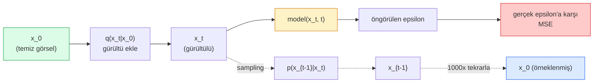

# Image Generation — Diffusion Modelleri

> Bir diffusion modeli denoising'i öğrenir. Onu gürültülü bir görselden ufak miktarda gürültü çıkarmaya eğit, bunu bin kez tersine tekrarla ve bir görsel generator'ın olur.

**Tür:** Yapım
**Diller:** Python
**Ön koşullar:** Faz 4 Ders 07 (U-Net), Faz 1 Ders 06 (Olasılık), Faz 3 Ders 06 (Optimizer'lar)
**Süre:** ~75 dakika

## Öğrenme Hedefleri

- İleri gürültü ekleme süreci `x_0 -> x_1 -> ... -> x_T`'yi türet ve herhangi bir t için closed-form `q(x_t | x_0)`'ın neden geçerli olduğunu açıkla
- Her adımda eklenen gürültüyü regress eden DDPM tarzı bir eğitim hedefi ve saf gürültüden bir görsele geri yürüyen bir sampler uygula
- Herhangi bir timestep için gürültüyü tahmin eden (CPU'da eğitilebilecek kadar küçük) zaman-koşullu bir U-Net kur
- DDPM ve DDIM sampling arasındaki farkı ve her birinin ne zaman uygun olduğunu açıkla (Ders 23 flow matching ve rectified flow'u derinlemesine ele alır)

## Sorun

GAN'lar tek seferde üretir: gürültü girer, görsel çıkar, tek forward pass. Hızlıdır ve eğitmesi zordur. Diffusion modelleri iteratif üretir: saf gürültüden başla, küçük adımlarla denoise yap, görsel ortaya çıkar. Yavaştırlar ve eğitmesi kolaydır. Son beş yıldır ikinci özellik hakim olmuştur: küçük bir ekip bir diffusion modeli eğitebilir ve makul örnekler alabilir; GAN eğitimi yıllarca başarısız çalışmalarla öğrendiğin bir el sanatıdır.

Eğitim kararlılığının ötesinde, diffusion'ın iteratif yapısı modern görsel generation'ın yaptığı her şeyin kilidini açan şeydir: metin koşullaması, inpainting, görsel editing, super-resolution, kontrol edilebilir stil. Sampling döngüsünün her adımı yeni bir kısıt enjekte edebileceğin bir yerdir. Bu hook, Stable Diffusion, Imagen, DALL-E 3, Midjourney ve kullanacağın her kontrol edilebilir görsel modelinin neden hepsinin diffusion tabanlı olduğunun nedenidir.

Bu ders minimal DDPM'yi kurar: ileri gürültüleme, geri denoising, eğitim döngüsü. Bir sonraki ders (Stable Diffusion) bunu bir VAE, bir text encoder ve classifier-free guidance ile bir üretim sistemine bağlar.

## Kavram

### İleri süreç

Bir `x_0` görseli al. Ufak miktarda Gaussian gürültü ekleyip `x_1` elde et. Biraz daha ekleyip `x_2` elde et. T adım boyunca devam et, ta ki `x_T` saf Gaussian gürültüsünden neredeyse ayırt edilemez olana kadar.

```
q(x_t | x_{t-1}) = N(x_t; sqrt(1 - beta_t) * x_{t-1},  beta_t * I)
```

`beta_t` küçük bir varyans schedule'ıdır, tipik olarak T=1000 adımda 0.0001'den 0.02'ye lineerdir. Her adım sinyali hafifçe küçültür ve taze gürültü enjekte eder.

### Closed-form sıçrama

Adım adım gürültü eklemek bir Markov chain'dir, ama matematik katlanır: `x_t`'yi `x_0`'dan tek adımda doğrudan örnekleyebilirsin.

```
alpha_t = 1 - beta_t tanımla
alpha_bar_t = prod_{s=1..t} alpha_s tanımla

Sonra:
  q(x_t | x_0) = N(x_t; sqrt(alpha_bar_t) * x_0,  (1 - alpha_bar_t) * I)

Eşdeğer:
  x_t = sqrt(alpha_bar_t) * x_0 + sqrt(1 - alpha_bar_t) * epsilon
  burada epsilon ~ N(0, I)
```

Bu tek denklem diffusion'ın pratik olmasının tüm nedenidir. Eğitim sırasında rastgele bir `t` seçer, `x_t`'yi `x_0`'dan doğrudan örnekler ve tek adımda eğitirsin — tam Markov chain'in simülasyonuna gerek yok.

### Geri süreç

İleri süreç sabittir. Geri süreç `p(x_{t-1} | x_t)` sinir ağının öğrendiği şeydir. Diffusion modelleri `x_{t-1}`'i doğrudan tahmin etmez; t adımında eklenen gürültü `epsilon`'u tahmin eder ve matematik ondan `x_{t-1}`'i türetir.



### Eğitim loss'u

Her eğitim adımı için:

1. Gerçek bir görsel `x_0` örnekle.
2. [1, T]'den uniform bir timestep `t` örnekle.
3. Gürültü `epsilon ~ N(0, I)` örnekle.
4. `x_t = sqrt(alpha_bar_t) * x_0 + sqrt(1 - alpha_bar_t) * epsilon` hesapla.
5. Ağ ile `epsilon_theta(x_t, t)` tahmin et.
6. `|| epsilon - epsilon_theta(x_t, t) ||^2`'yi minimize et.

Hepsi bu. Sinir ağı herhangi bir timestep'teki gürültüyü tahmin etmeyi öğrenir. Loss MSE. Adversarial oyun yok, collapse yok, salınım yok.

### Sampler (DDPM)

Üretmek için: `x_T ~ N(0, I)`'dan başla ve geriye doğru adım adım yürü.

```
for t = T, T-1, ..., 1:
    eps = model(x_t, t)
    x_{t-1} = (1 / sqrt(alpha_t)) * (x_t - (beta_t / sqrt(1 - alpha_bar_t)) * eps) + sqrt(beta_t) * z
    burada z ~ N(0, I) eğer t > 1 ise, aksi halde 0
return x_0
```

Anahtar, geri koşullu genel olarak closed form bilinmese de, bu özel Gaussian ileri süreç için biliniyor olmasıdır. Çirkin görünen katsayılar Bayes kuralının verdiği şeylerdir.

### Neden 1000 adım

İleri gürültü schedule'ı, her adım reverse adımı neredeyse Gaussian olacak kadar gürültü ekleyecek şekilde seçilir. Çok az adım, reverse adım Gaussian'dan uzak, ağ onu iyi modelleyemez. Çok fazla adım, sampling pahalı olur ve azalan getiri. T=1000 lineer schedule ile DDPM varsayılanıdır.

### DDIM: 20x daha hızlı sampling

Eğitim aynıdır. Sampling değişir. DDIM (Song et al., 2020) yeniden eğitim olmadan timestep'leri atlayan deterministik bir reverse süreç tanımlar. DDIM ile 50 adımda sampling, ~1000 adımlık DDPM kalitesi verir. Her üretim sistemi DDIM ya da daha hızlı bir varyant (DPM-Solver, Euler ancestral) kullanır.

### Zaman koşullaması

`epsilon_theta(x_t, t)` ağının hangi timestep'i denoise ettiğini bilmesi gerekir. Modern diffusion modelleri her U-Net seviyesindeki feature map'lere eklenen sinüsoidal zaman embedding'leri ile (transformer'lardaki positional encoding ile aynı fikir) `t`'yi enjekte eder.

```
t_embedding = sinusoidal(t)
feature_map += MLP(t_embedding)
```

Zaman koşullaması olmadan ağ gürültü seviyesini görselin kendisinden tahmin etmek zorundadır, bu çalışır ama çok daha az sample-efficient'tır.

## İnşa Et

### Adım 1: Gürültü schedule'ı

```python
import torch

def linear_beta_schedule(T=1000, beta_start=1e-4, beta_end=2e-2):
    return torch.linspace(beta_start, beta_end, T)


def precompute_schedule(betas):
    alphas = 1.0 - betas
    alphas_cumprod = torch.cumprod(alphas, dim=0)
    return {
        "betas": betas,
        "alphas": alphas,
        "alphas_cumprod": alphas_cumprod,
        "sqrt_alphas_cumprod": torch.sqrt(alphas_cumprod),
        "sqrt_one_minus_alphas_cumprod": torch.sqrt(1.0 - alphas_cumprod),
        "sqrt_recip_alphas": torch.sqrt(1.0 / alphas),
    }

schedule = precompute_schedule(linear_beta_schedule(T=1000))
```

Bir kez precompute et, eğitim ve sampling sırasında index ile topla.

### Adım 2: İleri diffusion (q_sample)

```python
def q_sample(x0, t, noise, schedule):
    sqrt_a = schedule["sqrt_alphas_cumprod"][t].view(-1, 1, 1, 1)
    sqrt_one_minus_a = schedule["sqrt_one_minus_alphas_cumprod"][t].view(-1, 1, 1, 1)
    return sqrt_a * x0 + sqrt_one_minus_a * noise
```

Tek satırlık closed form. `t`, batch başına bir görsel için bir timestep batch'i.

### Adım 3: Ufak zaman-koşullu bir U-Net

```python
import torch.nn as nn
import torch.nn.functional as F
import math

def timestep_embedding(t, dim=64):
    half = dim // 2
    freqs = torch.exp(-math.log(10000) * torch.arange(half, device=t.device) / half)
    args = t[:, None].float() * freqs[None]
    emb = torch.cat([args.sin(), args.cos()], dim=-1)
    return emb


class TinyUNet(nn.Module):
    def __init__(self, img_channels=3, base=32, t_dim=64):
        super().__init__()
        self.t_mlp = nn.Sequential(
            nn.Linear(t_dim, base * 4),
            nn.SiLU(),
            nn.Linear(base * 4, base * 4),
        )
        self.t_dim = t_dim
        self.enc1 = nn.Conv2d(img_channels, base, 3, padding=1)
        self.enc2 = nn.Conv2d(base, base * 2, 4, stride=2, padding=1)
        self.mid = nn.Conv2d(base * 2, base * 2, 3, padding=1)
        self.dec1 = nn.ConvTranspose2d(base * 2, base, 4, stride=2, padding=1)
        self.dec2 = nn.Conv2d(base * 2, img_channels, 3, padding=1)
        self.time_proj = nn.Linear(base * 4, base * 2)

    def forward(self, x, t):
        t_emb = timestep_embedding(t, self.t_dim)
        t_emb = self.t_mlp(t_emb)
        t_proj = self.time_proj(t_emb)[:, :, None, None]

        h1 = F.silu(self.enc1(x))
        h2 = F.silu(self.enc2(h1)) + t_proj
        h3 = F.silu(self.mid(h2))
        d1 = F.silu(self.dec1(h3))
        d2 = torch.cat([d1, h1], dim=1)
        return self.dec2(d2)
```

Bottleneck'te zaman koşullaması enjekte edilmiş iki-seviyeli U-Net. Gerçek görseller için derinliği ve genişliği ölçeklendir.

### Adım 4: Eğitim döngüsü

```python
def train_step(model, x0, schedule, optimizer, device, T=1000):
    model.train()
    x0 = x0.to(device)
    bs = x0.size(0)
    t = torch.randint(0, T, (bs,), device=device)
    noise = torch.randn_like(x0)
    x_t = q_sample(x0, t, noise, schedule)
    pred = model(x_t, t)
    loss = F.mse_loss(pred, noise)
    optimizer.zero_grad()
    loss.backward()
    optimizer.step()
    return loss.item()
```

Tüm eğitim döngüsü bu. GAN oyunu yok, özel loss yok, tek MSE çağrısı.

### Adım 5: Sampler (DDPM)

```python
@torch.no_grad()
def sample(model, schedule, shape, T=1000, device="cpu"):
    model.eval()
    x = torch.randn(shape, device=device)
    betas = schedule["betas"].to(device)
    sqrt_one_minus_a = schedule["sqrt_one_minus_alphas_cumprod"].to(device)
    sqrt_recip_alphas = schedule["sqrt_recip_alphas"].to(device)

    for t in reversed(range(T)):
        t_batch = torch.full((shape[0],), t, dtype=torch.long, device=device)
        eps = model(x, t_batch)
        coef = betas[t] / sqrt_one_minus_a[t]
        mean = sqrt_recip_alphas[t] * (x - coef * eps)
        if t > 0:
            x = mean + torch.sqrt(betas[t]) * torch.randn_like(x)
        else:
            x = mean
    return x
```

Tek bir batch örnek üretmek için 1000 forward pass. Gerçek kodda bunu DDIM 50-adım sampler ile değiştirirdin.

### Adım 6: DDIM sampler (deterministik, ~20x daha hızlı)

```python
@torch.no_grad()
def sample_ddim(model, schedule, shape, steps=50, T=1000, device="cpu", eta=0.0):
    model.eval()
    x = torch.randn(shape, device=device)
    alphas_cumprod = schedule["alphas_cumprod"].to(device)

    ts = torch.linspace(T - 1, 0, steps + 1).long()
    for i in range(steps):
        t = ts[i]
        t_prev = ts[i + 1]
        t_batch = torch.full((shape[0],), t, dtype=torch.long, device=device)
        eps = model(x, t_batch)
        a_t = alphas_cumprod[t]
        a_prev = alphas_cumprod[t_prev] if t_prev >= 0 else torch.tensor(1.0, device=device)
        x0_pred = (x - torch.sqrt(1 - a_t) * eps) / torch.sqrt(a_t)
        sigma = eta * torch.sqrt((1 - a_prev) / (1 - a_t) * (1 - a_t / a_prev))
        dir_xt = torch.sqrt(1 - a_prev - sigma ** 2) * eps
        noise = sigma * torch.randn_like(x) if eta > 0 else 0
        x = torch.sqrt(a_prev) * x0_pred + dir_xt + noise
    return x
```

`eta=0` tamamen deterministiktir (aynı gürültü girdisi her zaman aynı çıktıyı üretir). `eta=1` DDPM'yi geri kazanır.

## Kullan

Üretim işleri için `diffusers` kullan:

```python
from diffusers import DDPMScheduler, UNet2DModel

unet = UNet2DModel(sample_size=32, in_channels=3, out_channels=3, layers_per_block=2)
scheduler = DDPMScheduler(num_train_timesteps=1000)
```

Kütüphane hazır scheduler'lar (DDPM, DDIM, DPM-Solver, Euler, Heun), yapılandırılabilir U-Net'ler, text-to-image ve image-to-image için pipeline'lar ve LoRA fine-tuning yardımcıları taşır.

Araştırma için `k-diffusion` (Katherine Crowson) en sadık referans implementasyonlara ve en iyi sampling varyantlarına sahiptir.

## Yayınla

Bu ders şunları üretir:

- `outputs/prompt-diffusion-sampler-picker.md` — kalite hedefi, latency bütçesi ve koşullama türüne göre DDPM / DDIM / DPM-Solver / Euler seçen bir prompt.
- `outputs/skill-noise-schedule-designer.md` — T ve hedef bozulma seviyesi verildiğinde lineer, kosinüs ya da sigmoid beta schedule üreten bir skill, artı zaman içindeki sinyal-gürültü oranının teşhis grafikleri.

## Alıştırmalar

1. **(Kolay)** İleri süreci görselleştir: bir görsel al ve `x_t`'yi `t in [0, 100, 250, 500, 750, 1000]`'de çiz. `x_1000`'in saf Gaussian gürültü gibi göründüğünü doğrula.
2. **(Orta)** TinyUNet'i sentetik-daireler dataset'inde 20 epoch eğit ve 16 daire örnekle. DDPM (1000 adım) ve DDIM (50 adım) sampling'i karşılaştır — aynı gürültü seed'inden benzer görseller üretirler mi?
3. **(Zor)** Kosinüs gürültü schedule'ı (Nichol & Dhariwal, 2021) uygula: `alpha_bar_t = cos^2((t/T + s) / (1 + s) * pi / 2)`. Aynı modeli lineer ve kosinüs schedule'larla eğit ve kosinüsün düşük adım sayılarında daha iyi örnekler verdiğini göster.

## Anahtar Terimler

| Terim | İnsanlar ne diyor | Gerçekte ne anlama geliyor |
|------|----------------|----------------------|
| İleri süreç | "Zamanla gürültü ekle" | T adım boyunca bir görseli Gaussian gürültüye bozan sabit Markov chain |
| Reverse süreç | "Adım adım denoise et" | Gürültüden görsele geri yürüyen öğrenilmiş dağılım |
| Epsilon prediction | "Gürültüyü tahmin et" | Eğitim hedefi: `epsilon_theta(x_t, t)` t adımında eklenen gürültüyü tahmin eder |
| Beta schedule | "Gürültü miktarları" | Adım başına ne kadar gürültü girdiğini tanımlayan T küçük varyans dizisi |
| alpha_bar_t | "Kümülatif tutma faktörü" | t zamanına kadar (1 - beta_s)'nin çarpımı; daha büyük t daha az sinyal kaldı demektir |
| DDPM sampler | "Ancestral, stokastik" | Her x_{t-1}'i koşullu Gaussian'ından örnekler; 1000 adım |
| DDIM sampler | "Deterministik, hızlı" | Sampling'i deterministik bir ODE olarak yeniden yazar; benzer kaliteyle 20-100 adım |
| Time conditioning | "Modele hangi t olduğunu söyle" | t'nin sinüsoidal embedding'i U-Net'e gürültü seviyesini bilmesi için enjekte edilir |

## İleri Okuma

- [Denoising Diffusion Probabilistic Models (Ho et al., 2020)](https://arxiv.org/abs/2006.11239) — diffusion'ı pratik yapan ve FID'de GAN'ları yenen makale
- [Improved DDPM (Nichol & Dhariwal, 2021)](https://arxiv.org/abs/2102.09672) — kosinüs schedule'ı ve v-parameterisation
- [DDIM (Song, Meng, Ermon, 2020)](https://arxiv.org/abs/2010.02502) — gerçek zamanlı inference'ı mümkün kılan deterministik sampler
- [Elucidating the Design Space of Diffusion (Karras et al., 2022)](https://arxiv.org/abs/2206.00364) — her diffusion tasarım kararının birleşik görünümü; mevcut en iyi referans
