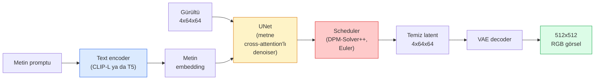

# Stable Diffusion — Mimari & Fine-Tuning

> Stable Diffusion, pretrained bir VAE'nin latent uzayında çalışan, cross-attention ile metne koşullu, hızlı deterministik bir ODE solver ile sample edilen ve classifier-free guidance ile yönlendirilen bir DDPM'dir.

**Tür:** Öğrenim + Kullan
**Diller:** Python
**Ön koşullar:** Faz 4 Ders 10 (Diffusion), Faz 7 Ders 02 (Self-Attention)
**Süre:** ~75 dakika

## Öğrenme Hedefleri

- Bir Stable Diffusion pipeline'ının beş parçasını izle: VAE, text encoder, U-Net, scheduler, safety checker — ve her birinin gerçekten ne yaptığı
- Latent diffusion'ı açıkla ve 4x64x64 latent uzayında (3x512x512 görsel yerine) eğitmenin kalite kaybı olmadan compute'u neden 48x azalttığını anlat
- `diffusers` kullanarak görsel üret, image-to-image, inpainting ve ControlNet-yönlendirmeli generation çalıştır
- Küçük bir özel dataset'te LoRA ile Stable Diffusion'ı fine-tune et ve inference'ta LoRA adapter'ını yükle

## Sorun

512x512 RGB görseller üzerinde doğrudan bir DDPM eğitmek pahalıdır. Her eğitim adımı 3x512x512 = 786.432 girdi değeri gören bir U-Net'ten backprop yapar ve sampling aynı U-Net üzerinden 50+ forward pass alır. Stable Diffusion 1.5 (2022'de yayınlandı) kalite seviyesinde, pixel-space diffusion kabaca 256 GPU-ay eğitim ve tüketici GPU'da görsel başına 10-30 saniye gerektirirdi.

Open-weight text-to-image'i pratik yapan hile **latent diffusion**'dı (Rombach et al., CVPR 2022). Bir 3x512x512 görseli 4x64x64 latent tensor'a ve geri eşleyen bir VAE eğit, sonra diffusion'ı o latent uzayında yap. Compute `(3*512*512)/(4*64*64) = 48x` azalır. Aynı GPU'da sampling onlarca saniyeden iki saniyenin altına düşer.

Neredeyse her modern görsel-generation modeli — SDXL, SD3, FLUX, HunyuanDiT, Wan-Video — autoencoder, denoiser (U-Net ya da DiT) ve metin koşullaması üzerinde varyasyonlarla bir latent diffusion modelidir. Stable Diffusion'ı öğren, şablonu öğrenmişsindir.

## Kavram

### Pipeline



- **VAE** — donmuş autoencoder. Encoder görseli latent'lara dönüştürür (img2img ve eğitim için kullanılır). Decoder latent'ları görsele geri çevirir.
- **Text encoder** — CLIP text encoder (SD 1.x/2.x), CLIP-L + CLIP-G (SDXL) ya da T5-XXL (SD3/FLUX). Bir token embedding dizisi üretir.
- **U-Net** — denoiser. Her çözünürlük seviyesinde latent'lardan text embedding'e attend eden cross-attention katmanları vardır.
- **Scheduler** — sampling algoritması (DDIM, Euler, DPM-Solver++). Sigma'ları seçer, öngörülen gürültüyü latent'a karıştırır.
- **Safety checker** — çıktı görselinde opsiyonel NSFW / yasadışı içerik filtresi.

### Classifier-free guidance (CFG)

Düz metin koşullaması her prompt `c` için `epsilon_theta(x_t, t, c)` öğrenir. CFG aynı ağı zamanın %10'unda `c` düşürülmüş (boş bir embedding ile değiştirilmiş) olarak eğitir, hem koşullu hem koşulsuz gürültüyü tahmin eden tek bir model verir. Inference'ta:

```
eps = eps_uncond + w * (eps_cond - eps_uncond)
```

`w` guidance scale'dir. `w=0` koşulsuzdur, `w=1` düz koşulludur, `w>1` çıktıyı çeşitlilik pahasına "prompt'a daha fazla koşullu" olmaya iter. SD varsayılanı `w=7.5`.

CFG, text-to-image'in üretim kalitesinde çalışmasının nedenidir. O olmadan prompt'lar çıktıyı zayıfça etkiler; onunla prompt'lar baskındır.

### Latent space geometrisi

VAE'nin 4-kanallı latent'ı sadece sıkıştırılmış bir görsel değildir. Aritmetiğin kabaca semantik düzenlemelere karşılık geldiği (prompt engineering + interpolation buradadır) ve diffusion U-Net'in tüm modelleme bütçesini harcamak üzere eğitildiği bir manifolddur. Rastgele bir 4x64x64 latent'ı decode etmek rastgele görünen bir görsel üretmez — çöp üretir, çünkü yalnızca latent'ların belirli bir alt-manifoldu geçerli görsellere decode olur.

İki sonuç:

1. **Img2img** = görseli latent'a encode et, kısmi gürültü ekle, denoiser'ı çalıştır, decode et. Encoding neredeyse tersinir olduğu için görsel yapı hayatta kalır; içerik prompt'a göre değişir.
2. **Inpainting** = img2img ile aynı ama denoiser yalnızca maskelenmiş bölgeleri günceller; maskelenmemiş bölgeler encode'lanmış latent'ta tutulur.

### U-Net mimarisi

SD U-Net, Ders 10'daki TinyUNet'in üç eklenti ile büyük versiyonudur:

- Her uzaysal çözünürlükte self-attention + text embedding'e cross-attention içeren **transformer block'lar**.
- Sinüsoidal encoding üzerinde MLP yoluyla **zaman embedding**.
- Encoder ve decoder arasında eşleşen çözünürlüklerde **skip bağlantıları**.

SD 1.5'te toplam parametre: ~860M. SDXL: ~2.6B. FLUX: ~12B. Parametre sıçraması çoğunlukla attention katmanlarında.

### LoRA fine-tuning

Stable Diffusion'ın tam fine-tuning'i 20+ GB VRAM gerektirir ve 860M parametre günceller. LoRA (Low-Rank Adaptation) base modeli donmuş tutar ve attention katmanlarına küçük rank-decomposition matrisleri enjekte eder. SD için bir LoRA adapter tipik olarak 10-50 MB'tır, tek tüketici GPU'da 10-60 dakikada eğitilir ve inference zamanında drop-in modifikasyon olarak yüklenir.

```
Orijinal: W_q : (d_in, d_out)   donmuş
LoRA:     W_q + alpha * (A @ B)   burada A : (d_in, r), B : (r, d_out)

r tipik olarak 4-32.
```

LoRA, neredeyse her topluluk fine-tune'unun dağıtıldığı yöntemdir. CivitAI ve Hugging Face milyonlarcasına ev sahipliği yapar.

### Karşılaşacağın scheduler'lar

- **DDIM** — deterministik, ~50 adım, basit.
- **Euler ancestral** — stokastik, 30-50 adım, hafifçe daha yaratıcı örnekler.
- **DPM-Solver++ 2M Karras** — deterministik, 20-30 adım, üretim varsayılanı.
- **LCM / TCD / Turbo** — consistency modelleri ve distilled varyantlar; biraz kalite kaybı pahasına 1-4 adım.

Scheduler değiştirmek `diffusers`'ta tek satırlık bir değişikliktir ve bazen herhangi bir yeniden eğitim olmadan örnek sorunlarını düzeltir.

## İnşa Et

Bu ders Stable Diffusion'ı sıfırdan yeniden inşa etmek yerine `diffusers`'ı uçtan uca kullanır. Yeniden inşa etmen gereken parçalar (VAE, text encoder, U-Net, scheduler) kendi derslerinin konularıdır; burada amaç üretim API'sinde akıcılıktır.

### Adım 1: Text-to-image

```python
import torch
from diffusers import StableDiffusionPipeline

pipe = StableDiffusionPipeline.from_pretrained(
    "runwayml/stable-diffusion-v1-5",
    torch_dtype=torch.float16,
).to("cuda")

image = pipe(
    prompt="a dog riding a skateboard in tokyo, studio ghibli style",
    guidance_scale=7.5,
    num_inference_steps=25,
    generator=torch.Generator("cuda").manual_seed(42),
).images[0]
image.save("dog.png")
```

`float16` görünür kalite kaybı olmadan VRAM'i yarıya indirir. Varsayılan DPM-Solver++ ile `num_inference_steps=25`, DDIM ile `num_inference_steps=50`'yi eşler.

### Adım 2: Scheduler'ı değiştir

```python
from diffusers import DPMSolverMultistepScheduler, EulerAncestralDiscreteScheduler

pipe.scheduler = DPMSolverMultistepScheduler.from_config(pipe.scheduler.config)
pipe.scheduler = EulerAncestralDiscreteScheduler.from_config(pipe.scheduler.config)
```

Scheduler state U-Net ağırlıklarından bağımsızdır. DDPM ile eğitebilir ve herhangi bir scheduler ile sample edebilirsin.

### Adım 3: Image-to-image

```python
from diffusers import StableDiffusionImg2ImgPipeline
from PIL import Image

img2img = StableDiffusionImg2ImgPipeline.from_pretrained(
    "runwayml/stable-diffusion-v1-5",
    torch_dtype=torch.float16,
).to("cuda")

init_image = Image.open("dog.png").convert("RGB").resize((512, 512))
out = img2img(
    prompt="a dog riding a skateboard, oil painting",
    image=init_image,
    strength=0.6,
    guidance_scale=7.5,
).images[0]
```

`strength`, denoising'den önce ne kadar gürültü ekleneceğidir (0.0 = değişmedi, 1.0 = tam yeniden generation). 0.5-0.7 style transfer için standart aralıktır.

### Adım 4: Inpainting

```python
from diffusers import StableDiffusionInpaintPipeline

inpaint = StableDiffusionInpaintPipeline.from_pretrained(
    "runwayml/stable-diffusion-inpainting",
    torch_dtype=torch.float16,
).to("cuda")

image = Image.open("dog.png").convert("RGB").resize((512, 512))
mask = Image.open("dog_mask.png").convert("L").resize((512, 512))

out = inpaint(
    prompt="a cat",
    image=image,
    mask_image=mask,
    guidance_scale=7.5,
).images[0]
```

Mask'taki beyaz pikseller yeniden üretilecek alandır. Siyah pikseller korunur.

### Adım 5: LoRA yükleme

```python
pipe.load_lora_weights("sayakpaul/sd-lora-ghibli")
pipe.fuse_lora(lora_scale=0.8)

image = pipe(prompt="a village square in ghibli style").images[0]
```

`lora_scale` gücü kontrol eder; 0.0 = etkisi yok, 1.0 = tam etki. `fuse_lora` adapter'ı hız için yerinde ağırlıklara pişirir, ama değiştirmeyi engeller. Farklı bir adapter yüklemeden önce `pipe.unfuse_lora()` çağır.

### Adım 6: LoRA eğitimi (taslak)

Gerçek LoRA eğitimi `peft` ya da `diffusers.training`'te yaşar. Ana hatlar:

```python
# Pseudocode
for step, batch in enumerate(dataloader):
    images, prompts = batch
    latents = vae.encode(images).latent_dist.sample() * 0.18215

    t = torch.randint(0, num_train_timesteps, (batch_size,))
    noise = torch.randn_like(latents)
    noisy_latents = scheduler.add_noise(latents, noise, t)

    text_emb = text_encoder(tokenizer(prompts))

    pred_noise = unet(noisy_latents, t, text_emb)  # LoRA ağırlıkları burada enjekte edilir

    loss = F.mse_loss(pred_noise, noise)
    loss.backward()
    optimizer.step()
```

Yalnızca LoRA matrisleri gradyan alır; base U-Net, VAE ve text encoder donmuştur. Batch size 1 ve gradient checkpointing ile bu 8 GB VRAM'e sığar.

## Kullan

Üretimde gerçekten verdiğin kararlar:

- **Model ailesi**: open-source topluluk fine-tune'ları için SD 1.5, daha yüksek fidelity için SDXL, state of the art ve sıkı lisanslama gereksinimleri için SD3 / FLUX.
- **Scheduler**: 20-30 adım için DPM-Solver++ 2M Karras, latency 1s'in altındayken LCM-LoRA.
- **Hassasiyet**: 4080/4090'da `float16`, A100 ve daha yenilerde `bfloat16`, VRAM sıkışıkken `int8` (`bitsandbytes` ya da `compel` yoluyla).
- **Koşullama**: düz metin çalışır; daha güçlü kontrol için base pipeline'ın üstüne ControlNet (canny, depth, pose) ekle.

Batch generation için `AUTO1111` / `ComfyUI` topluluk araçlarıdır; üretim API'leri için TensorRT derlemesiyle `diffusers` + `accelerate` ya da `optimum-nvidia`.

## Yayınla

Bu ders şunları üretir:

- `outputs/prompt-sd-pipeline-planner.md` — latency bütçesi, fidelity hedefi ve lisanslama kısıtı verildiğinde SD 1.5 / SDXL / SD3 / FLUX artı scheduler ve hassasiyet seçen bir prompt.
- `outputs/skill-lora-training-setup.md` — caption'lar, rank, batch size ve learning rate dahil özel bir dataset için tam bir LoRA eğitim konfigürasyonu yazan bir skill.

## Alıştırmalar

1. **(Kolay)** Aynı prompt'u `guidance_scale` `[1, 3, 5, 7.5, 10, 15]`'te üret. Görselin nasıl değiştiğini tarif et. Hangi guidance değerinde artefaktlar ortaya çıkıyor?
2. **(Orta)** Herhangi bir gerçek fotoğraf al, `strength` `[0.2, 0.4, 0.6, 0.8, 1.0]`'de `StableDiffusionImg2ImgPipeline` üzerinden çalıştır. Hangi strength stil değiştirirken kompozisyonu korur? 1.0 neden girdiyi tamamen görmezden geliyor?
3. **(Zor)** Tek bir öznenin (bir evcil hayvan, bir logo, bir karakter) 10-20 görseline LoRA eğit ve o özneyi içinde olan yeni sahneler üret. Girdi görsellerine overfit olmadan en iyi kimlik korumasını üreten LoRA rank'ını ve eğitim adımlarını raporla.

## Anahtar Terimler

| Terim | İnsanlar ne diyor | Gerçekte ne anlama geliyor |
|------|----------------|----------------------|
| Latent diffusion | "Latent'larda diffuse et" | Tüm DDPM'yi pixel space (3x512x512) yerine VAE latent uzayında (4x64x64) çalıştır; 48x compute tasarrufu |
| VAE scale factor | "0.18215" | VAE'nin ham latent'ını kabaca birim varyansa yeniden ölçeklendiren sabit; her SD pipeline'ında hardcode |
| Classifier-free guidance | "CFG" | Koşullu ve koşulsuz gürültü tahminlerini karıştır; en etkili tek inference düğmesi |
| Scheduler | "Sampler" | Gürültü + model tahminlerini denoised bir latent yörüngesine çeviren algoritma |
| LoRA | "Low-rank adapter" | Base ağırlıklara dokunmadan attention katmanlarını fine-tune eden küçük rank-decomposition matrisleri |
| Cross-attention | "Metin-görsel attention" | Latent token'lardan metin token'larına attention; her U-Net seviyesinde prompt bilgisi enjekte eder |
| ControlNet | "Yapı koşullaması" | SD'yi ekstra bir girdiyle (canny, depth, pose, segmentation) yönlendiren ayrı eğitilmiş bir adapter |
| DPM-Solver++ | "Varsayılan scheduler" | İkinci dereceden deterministik ODE solver; 2026'da düşük adım sayılarında (20-30) en iyi kalite |

## İleri Okuma

- [High-Resolution Image Synthesis with Latent Diffusion (Rombach et al., 2022)](https://arxiv.org/abs/2112.10752) — Stable Diffusion makalesi; tasarımı haklı çıkaran her ablation dahil
- [Classifier-Free Diffusion Guidance (Ho & Salimans, 2022)](https://arxiv.org/abs/2207.12598) — CFG makalesi
- [LoRA: Low-Rank Adaptation of Large Language Models (Hu et al., 2021)](https://arxiv.org/abs/2106.09685) — LoRA NLP-firstti; SD'ye neredeyse hiç değişiklik olmadan aktarıldı
- [diffusers documentation](https://huggingface.co/docs/diffusers) — her SD / SDXL / SD3 / FLUX pipeline için referans
