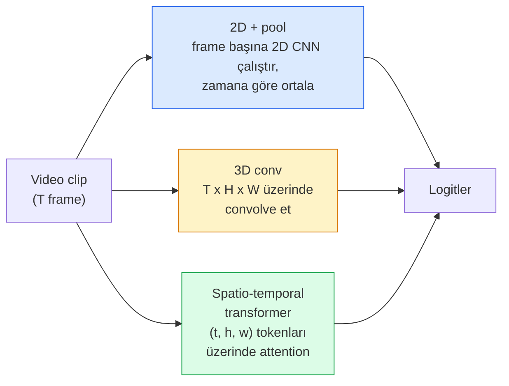

# Video Anlama — Temporal Modelleme

> Bir video, görsel dizisi artı onları bağlayan fiziktir. Her video modeli zamanı ya ekstra bir eksen (3D conv), attend edilecek bir dizi (transformer) ya da bir kez çıkarılıp pool edilecek bir feature (2D+pool) olarak ele alır.

**Tür:** Öğrenim + Yapım
**Diller:** Python
**Ön koşullar:** Faz 4 Ders 03 (CNN'ler), Faz 4 Ders 04 (Image Classification)
**Süre:** ~45 dakika

## Öğrenme Hedefleri

- Üç ana video-modelleme yaklaşımını (2D+pool, 3D conv, spatio-temporal transformer) ayır ve maliyet ile doğruluk trade-off'larını tahmin et
- PyTorch'ta frame sampling, temporal pooling ve 2D+pool baseline sınıflandırıcı uygula
- I3D'nin "inflated" 3D kernel'larının ImageNet ağırlıklarından neden iyi aktarıldığını ve faktörize edilmiş bir (2+1)D conv'un farklı olarak ne yaptığını açıkla
- Standart aksiyon tanıma dataset'lerini ve metriklerini oku: Kinetics-400/600, UCF101, Something-Something V2; clip ve video düzeyinde top-1 doğruluğu

## Sorun

30 fps'de 30 saniyelik bir video 900 görseldir. Naif olarak video sınıflandırma 900 kez çalıştırılan image classification artı bir tür agregasyondur. Bu, aksiyon hemen her frame'de görünür olduğunda çalışır (spor, yemek pişirme, egzersiz videoları) ve aksiyon hareketin kendisiyle tanımlandığında kötü başarısız olur: "bir şeyi soldan sağa itmek" her tek frame'de iki sabit nesne gibi görünür.

Her video mimarisi için temel soru şudur: temporal yapı ne zaman modellenir ve nasıl? Cevap diğer her şeyi yönlendirir — compute maliyeti, pretraining stratejisi, ImageNet ağırlıklarını yeniden kullanıp kullanamayacağın, modelin hangi dataset'lerde eğitildiği.

Bu ders kasıtlı olarak statik-görsel derslerinden daha kısadır. Çekirdek görsel makinesi zaten yerinde ve video anlama çoğunlukla temporal hikayedir: sampling, modelleme ve agregasyon.

## Kavram

### Üç mimari aile



### 2D + pool

Bir 2D CNN (ResNet, EfficientNet, ViT) al. Her örneklenen frame'de bağımsız çalıştır. Frame-başına embedding'leri ortala (ya da max-pool, ya da attention-pool). Pool edilmiş vektörü bir sınıflandırıcıya besle.

Artıları:
- ImageNet pretraining doğrudan aktarılır.
- Uygulaması en basit.
- Ucuz: T frame * tek-görsel inference maliyeti.

Eksileri:
- Hareketi modelleyemez. Aksiyon = görünüşlerin agregatı.
- Temporal pooling sıraya duyarsız; "kapı aç" ve "kapı kapat" aynı görünür.

Ne zaman kullan: görünüm-ağır görevler, küçük video dataset'lerinde transfer learning, başlangıç baseline'ları.

### 3D convolution'lar

2D (H, W) kernel'larını 3D (T, H, W) kernel'larıyla değiştir. Ağ hem uzay hem zaman üzerinde convolve eder. Erken aile: C3D, I3D, SlowFast.

I3D hilesi: pretrained bir 2D ImageNet modeli al, her 2D kernel'ı yeni bir zaman ekseninde kopyalayarak "inflate" et. 3x3 2D conv 3x3x3 3D conv olur. Bu, 3D modele sıfırdan eğitim yerine güçlü pretrained ağırlıklar verir.

Artıları:
- Hareketi doğrudan modeller.
- I3D inflation bedavaya transfer learning verir.

Eksileri:
- 2D karşılığından T/8 daha fazla FLOP (3 katmanlı 3 temporal kernel için).
- Temporal kernel'lar küçüktür; uzun-menzilli hareket bir piramit ya da dual-stream yaklaşımı gerektirir.

Ne zaman kullan: hareketin sinyal olduğu aksiyon tanıma (Something-Something V2, hareket-ağır sınıflarıyla Kinetics).

### Spatio-temporal transformer'lar

Videoyu uzay-zaman patch'lerinin bir grid'ine tokenize et ve hepsinin üzerinde attend et. TimeSformer, ViViT, Video Swin, VideoMAE.

Önemli attention kalıpları:
- **Joint** — (t, h, w) üzerinde tek büyük attention. `T*H*W`'de quadratic; pahalı.
- **Divided** — blok başına iki attention: biri zaman üzerinde, biri uzay üzerinde. Linear-vari ölçekleme.
- **Factorised** — zaman attention'ı blok genelinde uzay attention'ı ile alternatiflenir.

Artıları:
- Her büyük benchmark'ta SOTA doğruluk.
- Image transformer'lardan (ViT) patch inflation yoluyla aktarılır.
- Sparse attention yoluyla uzun-bağlam video destekler.

Eksileri:
- Compute aç.
- Dikkatli attention kalıbı seçimi gerektirir yoksa runtime balon olur.

Ne zaman kullan: büyük dataset'ler, yüksek-fidelity video anlama, multi-modal video+metin görevleri.

### Frame sampling

10 saniyelik bir clip 30 fps'de 300 frame'dir; 300'ünü herhangi bir modele beslemek israftır. Standart stratejiler:

- **Uniform sampling** — clip boyunca eşit T frame seç. 2D+pool için varsayılan.
- **Dense sampling** — rastgele bitişik T-frame penceresi. Hareket komşu frame'leri gerektirdiği için 3D conv'lar için yaygın.
- **Multi-clip** — aynı videodan birden fazla T-frame penceresi örnekle, her birini sınıflandır, test zamanında tahminleri ortala.

T genellikle 8, 16, 32 ya da 64'tür. Daha yüksek T = daha fazla compute'ta daha fazla temporal sinyal.

### Değerlendirme

İki seviye:
- **Clip düzeyinde doğruluk** — model bir T-frame clip görür, top-k raporlar.
- **Video düzeyinde doğruluk** — clip-düzeyi tahminleri video başına çoklu clip üzerinde ortala; daha yüksek ve daha kararlı.

Her zaman ikisini de raporla. %78 clip / %82 video alan model test-time averaging'e ağır şekilde bağlıdır; %80 / %81 alan ise clip başına daha güçlüdür.

### Karşılaşacağın dataset'ler

- **Kinetics-400 / 600 / 700** — genel amaçlı aksiyon dataset'i. 400k clip; YouTube URL'leri (çoğu artık ölü).
- **Something-Something V2** — hareket-tanımlı aksiyonlar ("X'i soldan sağa hareket ettirme"). 2D+pool ile çözülemez.
- **UCF-101**, **HMDB-51** — daha eski, daha küçük, hâlâ raporlanan.
- **AVA** — uzay ve zamanda aksiyon *lokalizasyonu*; classification'dan zor.

## İnşa Et

### Adım 1: Frame sampler

Frame listesi (ya da video tensor) üzerinde çalışan uniform ve dense sampler'lar.

```python
import numpy as np

def sample_uniform(num_frames_total, T):
    if num_frames_total <= T:
        return list(range(num_frames_total)) + [num_frames_total - 1] * (T - num_frames_total)
    step = num_frames_total / T
    return [int(i * step) for i in range(T)]


def sample_dense(num_frames_total, T, rng=None):
    rng = rng or np.random.default_rng()
    if num_frames_total <= T:
        return list(range(num_frames_total)) + [num_frames_total - 1] * (T - num_frames_total)
    start = int(rng.integers(0, num_frames_total - T + 1))
    return list(range(start, start + T))
```

İkisi de video tensor'unu dilimlemek için kullanacağın `T` index'i döndürür.

### Adım 2: 2D+pool baseline'ı

Bir 2D ResNet-18'i her frame üzerinde çalıştır, feature'ları average-pool et, sınıflandır.

```python
import torch
import torch.nn as nn
from torchvision.models import resnet18, ResNet18_Weights

class FramePool(nn.Module):
    def __init__(self, num_classes=400, pretrained=True):
        super().__init__()
        weights = ResNet18_Weights.IMAGENET1K_V1 if pretrained else None
        backbone = resnet18(weights=weights)
        self.features = nn.Sequential(*(list(backbone.children())[:-1]))  # global avg pool tutulur
        self.head = nn.Linear(512, num_classes)

    def forward(self, x):
        # x: (N, T, 3, H, W)
        N, T = x.shape[:2]
        x = x.view(N * T, *x.shape[2:])
        feats = self.features(x).view(N, T, -1)
        pooled = feats.mean(dim=1)
        return self.head(pooled)

model = FramePool(num_classes=10)
x = torch.randn(2, 8, 3, 224, 224)
print(f"output: {model(x).shape}")
print(f"params: {sum(p.numel() for p in model.parameters()):,}")
```

On bir milyon parametre, ImageNet pretrained, frame başına çalışır, ortalar, sınıflandırır. Bu baseline görünüm-ağır görevlerde uygun 3D modellerin sıklıkla 5-10 puan içindedir — bazen daha iyi, çünkü daha güçlü bir ImageNet backbone'unu yeniden kullanır.

### Adım 3: I3D tarzı inflated 3D conv

Yeni bir zaman ekseninde ağırlıkları tekrarlayarak tek bir 2D conv'u 3D conv'a çevir.

```python
def inflate_2d_to_3d(conv2d, time_kernel=3):
    out_c, in_c, kh, kw = conv2d.weight.shape
    weight_3d = conv2d.weight.data.unsqueeze(2)  # (out, in, 1, kh, kw)
    weight_3d = weight_3d.repeat(1, 1, time_kernel, 1, 1) / time_kernel
    conv3d = nn.Conv3d(in_c, out_c, kernel_size=(time_kernel, kh, kw),
                        padding=(time_kernel // 2, conv2d.padding[0], conv2d.padding[1]),
                        stride=(1, conv2d.stride[0], conv2d.stride[1]),
                        bias=False)
    conv3d.weight.data = weight_3d
    return conv3d

conv2d = nn.Conv2d(3, 64, kernel_size=3, padding=1, bias=False)
conv3d = inflate_2d_to_3d(conv2d, time_kernel=3)
print(f"2D weight shape:  {tuple(conv2d.weight.shape)}")
print(f"3D weight shape:  {tuple(conv3d.weight.shape)}")
x = torch.randn(1, 3, 8, 56, 56)
print(f"3D output shape:  {tuple(conv3d(x).shape)}")
```

`time_kernel`'a bölme aktivasyon büyüklüklerini kabaca sabit tutar — ilk geçişte batch-norm istatistiklerini bozmamak için önemli.

### Adım 4: Faktörize (2+1)D conv

Bir 3D conv'u bir 2D (uzaysal) ve bir 1D (temporal) conv'a böl. Aynı receptive field, daha az parametre, bazı benchmark'larda daha iyi doğruluk.

```python
class Conv2Plus1D(nn.Module):
    def __init__(self, in_c, out_c, kernel_size=3):
        super().__init__()
        mid_c = (in_c * out_c * kernel_size * kernel_size * kernel_size) \
                // (in_c * kernel_size * kernel_size + out_c * kernel_size)
        self.spatial = nn.Conv3d(in_c, mid_c, kernel_size=(1, kernel_size, kernel_size),
                                 padding=(0, kernel_size // 2, kernel_size // 2), bias=False)
        self.bn = nn.BatchNorm3d(mid_c)
        self.act = nn.ReLU(inplace=True)
        self.temporal = nn.Conv3d(mid_c, out_c, kernel_size=(kernel_size, 1, 1),
                                  padding=(kernel_size // 2, 0, 0), bias=False)

    def forward(self, x):
        return self.temporal(self.act(self.bn(self.spatial(x))))

c = Conv2Plus1D(3, 64)
x = torch.randn(1, 3, 8, 56, 56)
print(f"(2+1)D output: {tuple(c(x).shape)}")
```

Tam bir R(2+1)D ağı, her 3x3 conv'u `Conv2Plus1D` ile değiştirilmiş bir ResNet-18 ile aynıdır.

## Kullan

İki kütüphane üretim video işini kapsar:

- `torchvision.models.video` — pretrained Kinetics ağırlıklarıyla R(2+1)D, MViT, Swin3D. Image modelleriyle aynı API.
- `pytorchvideo` (Meta) — model zoo, Kinetics / SSv2 / AVA için data loader'lar, standart transform'lar.

Vision-Language video modelleri için (video captioning, video QA) `transformers` (`VideoMAE`, `VideoLLaMA`, `InternVideo`) kullan.

## Yayınla

Bu ders şunları üretir:

- `outputs/prompt-video-architecture-picker.md` — görünüm-vs-hareket, dataset boyutu ve compute bütçesine göre 2D+pool / I3D / (2+1)D / transformer seçen bir prompt.
- `outputs/skill-frame-sampler-auditor.md` — bir video pipeline'ının sampler'ını inceleyen ve yaygın bug'ları işaretleyen bir skill: off-by-one index, `num_frames < T` olduğunda eşit olmayan sampling, aspect-koruyan crop eksikliği vs.

## Alıştırmalar

1. **(Kolay)** T=8 ile FramePool ve T=8 ile I3D tarzı bir 3D ResNet için FLOPları (yaklaşık) hesapla. 2D+pool'un neden 3-5x daha ucuz olduğunu açıkla.
2. **(Orta)** Sentetik bir video dataset'i üret: rastgele yönlerde hareket eden rastgele toplar, hareket yönüne göre etiketlenmiş ("soldan-sağa", "sağdan-sola", "diyagonal-yukarı"). FramePool'u üzerinde eğit. Şansa yakın doğruluk aldığını göster, görünümün tek başına hareket görevleri için yetersiz olduğunu kanıtla.
3. **(Zor)** Bir ResNet-18'deki her Conv2d'yi `Conv2Plus1D` ile değiştirerek bir R(2+1)D-18 inşa et. İlk conv'un ağırlıklarını ImageNet-pretrained ResNet-18'den inflate et. 2. alıştırmadaki hareket dataset'inde eğit ve FramePool'u yen.

## Anahtar Terimler

| Terim | İnsanlar ne diyor | Gerçekte ne anlama geliyor |
|------|----------------|----------------------|
| 2D + pool | "Frame başına sınıflandırıcı" | Her örneklenen frame'de bir 2D CNN çalıştır, zaman üzerinde feature'ları average-pool et, sınıflandır |
| 3D convolution | "Spatio-temporal kernel" | (T, H, W) üzerinde convolve eden kernel; hareketi doğal olarak modelleyebilir |
| Inflation | "2D ağırlıkları 3D'ye yükselt" | 3D conv ağırlıklarını bir 2D conv'un ağırlıklarını yeni zaman ekseninde tekrar ederek ilklendir, sonra aktivasyon ölçeğini korumak için kernel_T'ye böl |
| (2+1)D | "Faktörize conv" | 3D'yi 2D uzaysal + 1D temporal'a böl; daha az parametre, arada ekstra non-linearity |
| Divided attention | "Önce zaman sonra uzay" | Katman başına iki attention'lı transformer block: biri aynı frame'deki token'lar üzerinde, biri aynı konumdaki token'lar üzerinde |
| Clip | "T-frame penceresi" | Örneklenmiş T frame'lik alt-dizi; bir video modelinin tükettiği birim |
| Clip vs video accuracy | "İki eval ayarı" | Clip = video başına bir örnek, video = birden fazla örneklenmiş clip üzerinde ortalama |
| Kinetics | "Videonun ImageNet'i" | 400-700 aksiyon sınıfı, 300k+ YouTube clip, standart video pretraining corpus'u |

## İleri Okuma

- [I3D: Quo Vadis, Action Recognition (Carreira & Zisserman, 2017)](https://arxiv.org/abs/1705.07750) — inflation ve Kinetics dataset'ini tanıtır
- [R(2+1)D: A Closer Look at Spatiotemporal Convolutions (Tran et al., 2018)](https://arxiv.org/abs/1711.11248) — faktörize conv, hâlâ güçlü bir baseline
- [TimeSformer: Is Space-Time Attention All You Need? (Bertasius et al., 2021)](https://arxiv.org/abs/2102.05095) — ilk güçlü video transformer
- [VideoMAE (Tong et al., 2022)](https://arxiv.org/abs/2203.12602) — video için masked autoencoder pretraining; mevcut baskın pretraining tarifi
