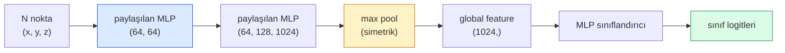

# 3D Görü — Point Cloud'lar & NeRF'ler

> 3D görü iki tatla gelir. Point cloud'lar sensörün ham çıktısıdır. NeRF'ler öğrenilmiş volumetric alandır. İkisi de "uzayda ne nerede"yi cevaplar.

**Tür:** Öğrenim + Yapım
**Diller:** Python
**Ön koşullar:** Faz 4 Ders 03 (CNN'ler), Faz 1 Ders 12 (Tensor İşlemleri)
**Süre:** ~45 dakika

## Öğrenme Hedefleri

- Explicit (point cloud, mesh, voxel) ve implicit (signed distance field, NeRF) 3D temsillerini ayır ve her birinin ne zaman kullanıldığını anla
- PointNet'in sırasız bir nokta seti üzerinde bir sinir ağını permutation-invariant yapan simetrik-fonksiyon hilesini anla
- Bir NeRF forward pass'ini izle: ray casting, volumetric rendering, positional encoding, MLP density+renk kafası
- Az sayıda pozlu görselden pretrained 3D rekonstrüksiyon için `nerfstudio` ya da `instant-ngp` kullan

## Sorun

Bir kamera 2D görsel üretir. Bir LIDAR sıralı olmayan bir 3D nokta seti üretir. Bir structure-from-motion pipeline'ı 3D keypoint'lerin seyrek bir bulutunu üretir. Bir NeRF bir avuç pozlu görselden tüm 3D sahneyi rekonstrükte eder. Bunların hepsi "görü"dür ama hiçbiri bir CNN'in istediği yoğun tensor'a benzemez.

3D görü önemlidir çünkü neredeyse her yüksek-değerli robot görevi 3D'de çalışır: tutma, engelden kaçınma, navigasyon, AR occlusion, 3D içerik yakalama. Yalnızca 2D görselleri anlayan bir görü mühendisi alanın en hızlı büyüyen diliminden kilitlenmiştir (AR/VR içerik, robotik, otonom sürüş stack'leri, gayrimenkul ya da inşaat için NeRF-tabanlı 3D rekonstrüksiyon).

İki temsil farklı nedenlerle baskındır. Point cloud'lar sensörlerin sana bedavaya verdiği şeydir. NeRF'ler ve halefleri (3D Gaussian splatting, neural SDF'ler) bir sinir ağına bir sahneyi öğrenmesini söylediğinde aldığın şeydir.

## Kavram

### Point cloud'lar

Bir point cloud, R^3'te N noktalık sıralı olmayan bir settir, opsiyonel olarak her biri feature'larla (renk, intensity, normal).

```
cloud = [
  (x1, y1, z1, r1, g1, b1),
  (x2, y2, z2, r2, g2, b2),
  ...
  (xN, yN, zN, rN, gN, bN),
]
```

Grid yok, bağlantı yok. İki özellik bunu sinir ağları için zor yapar:

- **Permutation invariance** — çıktı nokta sırasına bağlı olmamalıdır.
- **Değişken N** — tek bir model farklı boyutlardaki bulutları işlemelidir.

PointNet (Qi et al., 2017) ikisini de tek bir fikirle çözdü: her noktaya paylaşılan bir MLP uygula, sonra simetrik bir fonksiyonla (max pool) agrega et. Sonuç sıraya bağlı olmayan sabit-boyutlu bir vektördür.

```
f(P) = max_{p in P} MLP(p)
```

Bu PointNet'in tüm çekirdeğidir. Daha derin varyantlar (PointNet++, Point Transformer) hiyerarşik sampling ve yerel agregasyon ekler, ama simetrik-fonksiyon hilesi değişmemiştir.

### PointNet mimarisi



"Paylaşılan MLP" aynı MLP'nin her nokta üzerinde bağımsız çalıştığı anlamına gelir. Verimlilik için nokta boyutu üzerinde bir 1x1 conv olarak uygulanır.

### Neural Radiance Fields (NeRF'ler)

NeRF'ler (Mildenhall et al., 2020) "N fotoğraftan bir 3D sahneyi rekonstrükte edebilir miyiz?" sorusunu aldı ve sahnenin kendisi olan bir sinir ağı ile cevapladı. Ağ `(x, y, z, viewing_direction)`'ı `(density, colour)`'a eşler. Yeni bir görünüm render etmek bu ağ üzerinden bir ray-casting döngüsüdür.

```
NeRF MLP:  (x, y, z, theta, phi) -> (sigma, r, g, b)

Yeni bir görünümün (u, v) pikselini render etmek için:
  1. Kameradan piksel (u, v) üzerinden bir ray fırlat
  2. Ray boyunca t_1, t_2, ..., t_N mesafelerinde noktalar örnekle
  3. Her noktada MLP'yi sorgula
  4. Renkleri (1 - exp(-sigma * dt)) ile ağırlıklandırarak composite et
  5. Toplam render edilmiş piksel rengidir
```

Bir loss, render edilen pikseli eğitim fotoğraflarındaki ground-truth pikselle karşılaştırır. Render adımından geriye yayılım MLP'yi günceller. 3D ground truth yok, explicit geometri yok — sahne MLP ağırlıklarında saklanır.

### NeRF'te positional encoding

`(x, y, z)` üzerinde vanilla bir MLP yüksek-frekans detaylarını temsil edemez çünkü MLP'ler düşük frekanslara doğru spektral olarak biased'dır. NeRF bunu MLP'den önce her koordinatı bir Fourier feature vektörüne encode ederek düzeltir:

```
gamma(p) = (sin(2^0 pi p), cos(2^0 pi p), sin(2^1 pi p), cos(2^1 pi p), ...)
```

L=10 frekans seviyesine kadar. Bu, transformer'ların pozisyonlar için kullandığı aynı hile ve diffusion zaman koşullamasında (Ders 10) tekrar ortaya çıkar. O olmadan NeRF'ler bulanık görünür.

### Volumetric rendering

```
C(r) = sum_i T_i * (1 - exp(-sigma_i * delta_i)) * c_i

T_i  = exp(- sum_{j<i} sigma_j * delta_j)
delta_i = t_{i+1} - t_i
```

`T_i` transmittance'dır — ışığın i noktasına kadar ne kadarının hayatta kaldığı. `(1 - exp(-sigma_i * delta_i))` i noktasındaki opaklıktır. `c_i` renktir. Son piksel ray boyunca ağırlıklı bir toplamdır.

### NeRF'lerin yerini ne aldı

Saf NeRF'ler eğitmesi yavaş (saatler) ve render etmesi yavaştır (görsel başına saniyeler). O zamandan beri soykütüğü:

- **Instant-NGP** (2022) — hash-grid encoding MLP'nin konum girdisini değiştirir; saniyeler içinde eğitir.
- **Mip-NeRF 360** — sınırsız sahneleri ve anti-aliasing'i halleder.
- **3D Gaussian Splatting** (2023) — volumetric alanı milyonlarca 3D Gaussian ile değiştirir; dakikalarda eğitir, gerçek zamanlı render eder. Mevcut üretim varsayılanı.

2026'da neredeyse her gerçek NeRF ürünü aslında 3D Gaussian splatting'dir. Mental model hâlâ NeRF'dir.

### Dataset'ler ve benchmark'lar

- **ShapeNet** — point cloud olarak 3D CAD modellerinin classification ve segmentasyonu.
- **ScanNet** — segmentasyon için gerçek iç mekan taramaları.
- **KITTI** — otonom sürüş için açık hava LIDAR point cloud'ları.
- **NeRF Synthetic** / **Blended MVS** — view synthesis için pozlu-görsel dataset'leri.
- **Mip-NeRF 360** dataset'i — sınırsız gerçek sahneler.

## İnşa Et

### Adım 1: PointNet sınıflandırıcı

```python
import torch
import torch.nn as nn

class PointNet(nn.Module):
    def __init__(self, num_classes=10):
        super().__init__()
        self.mlp1 = nn.Sequential(
            nn.Conv1d(3, 64, 1),    nn.BatchNorm1d(64),   nn.ReLU(inplace=True),
            nn.Conv1d(64, 64, 1),   nn.BatchNorm1d(64),   nn.ReLU(inplace=True),
        )
        self.mlp2 = nn.Sequential(
            nn.Conv1d(64, 128, 1),  nn.BatchNorm1d(128),  nn.ReLU(inplace=True),
            nn.Conv1d(128, 1024, 1), nn.BatchNorm1d(1024), nn.ReLU(inplace=True),
        )
        self.head = nn.Sequential(
            nn.Linear(1024, 512),   nn.BatchNorm1d(512),  nn.ReLU(inplace=True),
            nn.Dropout(0.3),
            nn.Linear(512, 256),    nn.BatchNorm1d(256),  nn.ReLU(inplace=True),
            nn.Dropout(0.3),
            nn.Linear(256, num_classes),
        )

    def forward(self, x):
        # x: (N, 3, num_points) — Conv1d için transpose edilmiş
        x = self.mlp1(x)
        x = self.mlp2(x)
        x = torch.max(x, dim=-1)[0]       # (N, 1024)
        return self.head(x)

pts = torch.randn(4, 3, 1024)
net = PointNet(num_classes=10)
print(f"output: {net(pts).shape}")
print(f"params: {sum(p.numel() for p in net.parameters()):,}")
```

Yaklaşık 1.6M parametre. Bulut başına 1.024 nokta üzerinde çalışır.

### Adım 2: Positional encoding

```python
def positional_encoding(x, L=10):
    """
    x: (..., D) -> (..., D * 2 * L)
    """
    freqs = 2.0 ** torch.arange(L, dtype=x.dtype, device=x.device)
    args = x.unsqueeze(-1) * freqs * 3.141592653589793
    sinc = torch.cat([args.sin(), args.cos()], dim=-1)
    return sinc.reshape(*x.shape[:-1], -1)

x = torch.randn(5, 3)
y = positional_encoding(x, L=10)
print(f"input:  {x.shape}")
print(f"encoded: {y.shape}     # (5, 60)")
```

`2^l * pi` ile çarpmak kademeli olarak daha yüksek frekanslar verir.

### Adım 3: Ufak NeRF MLP

```python
class TinyNeRF(nn.Module):
    def __init__(self, L_pos=10, L_dir=4, hidden=128):
        super().__init__()
        self.L_pos = L_pos
        self.L_dir = L_dir
        pos_dim = 3 * 2 * L_pos
        dir_dim = 3 * 2 * L_dir
        self.trunk = nn.Sequential(
            nn.Linear(pos_dim, hidden), nn.ReLU(inplace=True),
            nn.Linear(hidden, hidden),  nn.ReLU(inplace=True),
            nn.Linear(hidden, hidden),  nn.ReLU(inplace=True),
            nn.Linear(hidden, hidden),  nn.ReLU(inplace=True),
        )
        self.sigma = nn.Linear(hidden, 1)
        self.color = nn.Sequential(
            nn.Linear(hidden + dir_dim, hidden // 2), nn.ReLU(inplace=True),
            nn.Linear(hidden // 2, 3), nn.Sigmoid(),
        )

    def forward(self, x, d):
        x_enc = positional_encoding(x, self.L_pos)
        d_enc = positional_encoding(d, self.L_dir)
        h = self.trunk(x_enc)
        sigma = torch.relu(self.sigma(h)).squeeze(-1)
        rgb = self.color(torch.cat([h, d_enc], dim=-1))
        return sigma, rgb

nerf = TinyNeRF()
x = torch.randn(128, 3)
d = torch.randn(128, 3)
s, c = nerf(x, d)
print(f"sigma: {s.shape}   rgb: {c.shape}")
```

Orijinal NeRF'e (derinlik 8 olan 2 MLP gövdesi var) kıyasla ufak. Mimariyi göstermek için yeterli.

### Adım 4: Bir ray boyunca volumetric rendering

```python
def volumetric_render(sigma, rgb, t_vals):
    """
    sigma: (..., N_samples)
    rgb:   (..., N_samples, 3)
    t_vals: (N_samples,) ray boyunca mesafeler
    """
    delta = torch.cat([t_vals[1:] - t_vals[:-1], torch.full_like(t_vals[:1], 1e10)])
    alpha = 1.0 - torch.exp(-sigma * delta)
    trans = torch.cumprod(torch.cat([torch.ones_like(alpha[..., :1]), 1.0 - alpha + 1e-10], dim=-1), dim=-1)[..., :-1]
    weights = alpha * trans
    rendered = (weights.unsqueeze(-1) * rgb).sum(dim=-2)
    depth = (weights * t_vals).sum(dim=-1)
    return rendered, depth, weights


N = 64
t_vals = torch.linspace(2.0, 6.0, N)
sigma = torch.rand(N) * 0.5
rgb = torch.rand(N, 3)
rendered, depth, weights = volumetric_render(sigma, rgb, t_vals)
print(f"rendered colour: {rendered.tolist()}")
print(f"depth:           {depth.item():.2f}")
```

Bir ray, 64 örnek, tek bir RGB piksele ve bir depth'e composite.

## Kullan

Gerçek iş için:

- `nerfstudio` (Tancik et al.) — NeRF / Instant-NGP / Gaussian Splatting için mevcut referans kütüphanesi. Komut satırı artı bir web viewer.
- `pytorch3d` (Meta) — differentiable rendering, point-cloud yardımcıları, mesh op'ları.
- `open3d` — point cloud işleme, registration, görselleştirme.

Deployment için 3D Gaussian splatting büyük ölçüde saf NeRF'lerin yerini aldı çünkü 100x daha hızlı render eder. Rekonstrüksiyon kalitesi karşılaştırılabilir.

## Yayınla

Bu ders şunları üretir:

- `outputs/prompt-3d-task-router.md` — görev ve girdi verisine göre doğru 3D temsile (point cloud, mesh, voxel, NeRF, Gaussian splat) yönlendiren bir prompt.
- `outputs/skill-point-cloud-loader.md` — doğru normalizasyon, merkezleme ve nokta sampling ile .ply / .pcd / .xyz dosyaları için bir PyTorch `Dataset` yazan bir skill.

## Alıştırmalar

1. **(Kolay)** PointNet'in permutation-invariant olduğunu göster: aynı bulutu iki kez çalıştır, bir kez noktalar shuffle edilmiş. Çıktıların floating-point gürültüsüne kadar özdeş olduğunu doğrula.
2. **(Orta)** Kamera intrinsics ve pose verildiğinde H x W bir görselin her pikseli için ray origin'leri ve direction'ları üreten minimal bir ray-generation fonksiyonu uygula.
3. **(Zor)** Renkli bir küpün render edilmiş görünümlerinden oluşan sentetik bir dataset'te (differentiable rendering ya da basit bir ray tracer aracılığıyla üretilmiş) bir TinyNeRF eğit. Epoch 1, 10 ve 100'de render loss'u raporla. Model hangi epoch'ta tanınabilir görünümler üretmeye başlıyor?

## Anahtar Terimler

| Terim | İnsanlar ne diyor | Gerçekte ne anlama geliyor |
|------|----------------|----------------------|
| Point cloud | "LIDAR'dan 3D noktalar" | Sırasız (x, y, z) seti + nokta başına opsiyonel feature'lar |
| PointNet | "Point cloud'larda ilk sinir ağı" | Nokta başına paylaşılan MLP + simetrik (max) pool; tasarım gereği permutation-invariant |
| NeRF | "Sahnenin kendisi olan MLP" | (x, y, z, dir)'yi (density, renk)'e eşleyen ağ; ray casting ile render edilir |
| Positional encoding | "Fourier feature'ları" | MLP düşük-frekans bias'ını aşmak için her koordinatı çoklu frekanslarda sin/cos'a encode et |
| Volumetric rendering | "Ray integration" | Bir ray boyunca örnekleri transmittance ve alpha kullanarak tek bir piksele composite et |
| Instant-NGP | "Hash-grid NeRF" | NeRF'in koordinat MLP'sini çok-çözünürlüklü bir hash grid ile değiştirir; 100-1000x daha hızlı |
| 3D Gaussian splatting | "Milyonlarca Gaussian" | Sahne = 3D Gaussian'lar koleksiyonu; gerçek zamanlı render eder, dakikalarda eğitir |
| SDF | "Signed distance field" | En yakın yüzeye işaretli mesafeyi döndüren fonksiyon; başka bir implicit temsil |

## İleri Okuma

- [PointNet (Qi et al., 2017)](https://arxiv.org/abs/1612.00593) — permutation-invariant sınıflandırıcı
- [NeRF (Mildenhall et al., 2020)](https://arxiv.org/abs/2003.08934) — fotoğraflardan 3D rekonstrüksiyonu bir sinir ağı problemi yapan makale
- [Instant-NGP (Müller et al., 2022)](https://arxiv.org/abs/2201.05989) — hash grid'ler, 1000x hızlanma
- [3D Gaussian Splatting (Kerbl et al., 2023)](https://arxiv.org/abs/2308.04079) — üretimde NeRF'lerin yerini alan mimari
