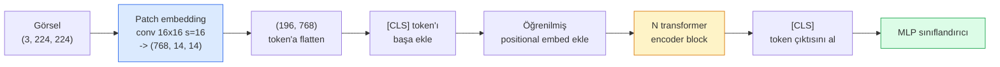

# Vision Transformer'lar (ViT)

> Görseli patch'lere kes, her patch'i bir kelime gibi ele al, standart bir transformer çalıştır. Geriye bakma.

**Tür:** Yapım
**Diller:** Python
**Ön koşullar:** Faz 7 Ders 02 (Self-Attention), Faz 4 Ders 04 (Image Classification)
**Süre:** ~45 dakika

## Öğrenme Hedefleri

- Minimal bir ViT inşa etmek için patch embedding, öğrenilmiş positional embedding, class token ve transformer encoder block'larını sıfırdan uygula
- DeiT ve MAE aksini kanıtlayana kadar ViT'in neden büyük pretraining verisine ihtiyaç duyduğu düşünüldüğünü açıkla
- ViT, Swin ve ConvNeXt'i mimari prior'ları üzerinde karşılaştır (hiçbiri, yerel pencere attention'ı, conv backbone)
- `timm` ve standart linear-probe / fine-tune tarifi kullanarak küçük bir dataset'te pretrained bir ViT'i fine-tune et

## Sorun

On yıl boyunca convolution bilgisayarlı görü ile eş anlamlıydı. CNN'lerin güçlü inductive bias'ları vardı — locality, translation equivariance — ki kimse değiştirebileceğini düşünmedi. Sonra Dosovitskiy et al. (2020), flatten edilmiş görsel patch'lerine uygulanan düz bir transformer'ın, hiç convolutional makinesi olmadan, en iyi CNN'leri ölçekte eşleyebileceğini ya da yenebileceğini gösterdi.

Yakalama "ölçekte"ydi. ImageNet-1k'da ViT, ResNet'e yenildi. ImageNet-21k ya da JFT-300M üzerinde pretrained ve sonra ImageNet-1k'da fine-tuned ViT onu yendi. Sonuç, transformer'ların faydalı prior'lardan yoksun olduğu ama yeterli veriden onları öğrenebileceğiydi. Sonraki çalışmalar (DeiT, MAE, DINO), doğru eğitim tarifleriyle — güçlü augmentation, self-supervised pretraining, distillation — ViT'lerin küçük veride de iyi eğitildiğini gösterdi.

2026'ya gelindiğinde saf CNN'ler edge cihazlarda hâlâ rekabetçi (ConvNeXt en güçlüsü), ama transformer'lar diğer her şeye hakim: segmentasyon (Mask2Former, SegFormer), detection (DETR, RT-DETR), multimodal (CLIP, SigLIP), video (VideoMAE, VJEPA). ViT block yapısı bilinecek olandır.

## Kavram

### Pipeline



Yedi adım. Patch'ler -> token'lar -> attention -> sınıflandırıcı. Her varyant (DeiT, Swin, ConvNeXt, MAE pretraining) yedinin bir ya da ikisini değiştirir ve geri kalanını rahat bırakır.

### Patch embedding

İlk conv sırrı. Kernel boyutu 16, stride 16, bu yüzden 224x224 görsel her biri 768-boyutlu bir embedding'e projekte edilmiş 16x16 patch'lerin 14x14 grid'i olur. O tek conv hem patchify hem lineer projekte eder.

```
Input:  (3, 224, 224)
Conv (3 -> 768, k=16, s=16, padding yok):
Output: (768, 14, 14)
Spatial flatten: (196, 768)
```

196 patch = 196 token. Her token'ın feature boyutu 768 (ViT-B), 1024 (ViT-L) ya da 1280 (ViT-H).

### Class token

Diziye baştan eklenen tek bir öğrenilmiş vektör:

```
tokens = [CLS; patch_1; patch_2; ...; patch_196]   shape (197, 768)
```

N transformer block sonrasında `[CLS]` çıktısı global görsel temsilidir. Classification head yalnızca bu tek vektörü okur.

### Positional embedding

Transformer'ların uzaysal konum kavramı yerleşik yoktur. Her token'a öğrenilmiş bir vektör ekle:

```
tokens = tokens + learned_pos_embedding   (shape ayrıca (197, 768))
```

Embedding modelin bir parametresidir; gradyan tabanlı eğitim onu 2D görsel yapısına uyarlar. Sinüsoidal 2D alternatifler vardır ama pratikte nadiren kullanılır.

### Transformer encoder block

Standart. Multi-head self-attention, MLP, residual bağlantılar, pre-LayerNorm.

```
x = x + MSA(LN(x))
x = x + MLP(LN(x))

MLP iki katmanlı, GELU ile: Linear(d -> 4d) -> GELU -> Linear(4d -> d)
```

ViT-B/16 bu block'lardan her biri 12 attention head'li 12 tanesini yığar, toplam 86M parametre.

### Neden pre-LN

Erken transformer'lar post-LN (`x = LN(x + sublayer(x))`) kullandı ve warmup olmadan 6-8 katmandan derine eğitmekte zorlandılar. Pre-LN (`x = x + sublayer(LN(x))`) daha derin ağları warmup olmadan kararlı şekilde eğitir. Her ViT ve her modern LLM pre-LN kullanır.

### Patch boyutu trade-off'u

- 16x16 patch -> 196 token, standart.
- 32x32 patch -> 49 token, daha hızlı ama daha düşük çözünürlük.
- 8x8 patch -> 784 token, daha ince ama O(n^2) attention maliyeti kötü ölçeklenir.

Daha büyük patch'ler = daha az token = daha hızlı ama daha az uzaysal detay. SwinV2 hiyerarşik pencerelerde 4x4 patch kullanır.

### DeiT'in ImageNet-1k'da ViT eğitme tarifi

Orijinal ViT, CNN'leri yenmek için JFT-300M'a ihtiyaç duydu. DeiT (Touvron et al., 2020), dört değişiklikle ImageNet-1k'da tek başına ViT-B'yi %81.8 top-1'e eğitti:

1. Ağır augmentation: RandAugment, Mixup, CutMix, Random Erasing.
2. Stochastic depth (eğitim sırasında tüm block'ları rastgele düşür).
3. Tekrarlanmış augmentation (aynı görsel batch başına 3 kez örneklenir).
4. CNN öğretmenden distillation (opsiyonel, doğruluğu daha da yükseltir).

Her modern ViT eğitim tarifi DeiT'ten iner.

### Swin vs ConvNeXt

- **Swin** (Liu et al., 2021) — pencere tabanlı attention. Her block bir yerel pencere içinde attend eder; alternatif block'lar pencereyi kaydırarak pencereler arası bilgiyi karıştırır. Attention operatörünü korurken CNN-vari bir locality prior'ı geri getirir.
- **ConvNeXt** (Liu et al., 2022) — Swin'in mimari seçimlerini eşleyen yeniden tasarlanmış CNN (depthwise conv'lar, LayerNorm, GELU, inverted bottleneck). Boşluğun "attention vs convolution" değil "modern eğitim tarifi + mimari" olduğunu gösterdi.

2026'da ConvNeXt-V2 ve Swin-V2 ikisi de üretim kalitesinde; doğru seçim inference stack'ine (ConvNeXt edge için daha iyi derlenir) ve pretraining corpus'una bağlıdır.

### MAE pretraining

Masked Autoencoder (He et al., 2022): patch'lerin %75'ini rastgele maskele, encoder'ı yalnızca görünür %25'i işlemek üzere eğit, küçük bir decoder'ı encoder'ın çıktısından maskelenmiş patch'leri yeniden inşa etmek için eğit. Pretraining sonrasında decoder'ı at ve encoder'ı fine-tune et.

MAE ViT'i ImageNet-1k'da tek başına eğitilebilir yapar, SOTA'ya ulaşır ve mevcut varsayılan self-supervised tarifidir.

## İnşa Et

### Adım 1: Patch embedding

```python
import torch
import torch.nn as nn

class PatchEmbedding(nn.Module):
    def __init__(self, in_channels=3, patch_size=16, dim=192, image_size=64):
        super().__init__()
        assert image_size % patch_size == 0
        self.proj = nn.Conv2d(in_channels, dim, kernel_size=patch_size, stride=patch_size)
        num_patches = (image_size // patch_size) ** 2
        self.num_patches = num_patches

    def forward(self, x):
        x = self.proj(x)
        return x.flatten(2).transpose(1, 2)
```

Bir conv, bir flatten, bir transpose. Tüm görsel-to-token adımı budur.

### Adım 2: Transformer block

Pre-LN, multi-head self-attention, GELU ile MLP, residual bağlantılar.

```python
class Block(nn.Module):
    def __init__(self, dim, num_heads, mlp_ratio=4, dropout=0.0):
        super().__init__()
        self.ln1 = nn.LayerNorm(dim)
        self.attn = nn.MultiheadAttention(dim, num_heads, dropout=dropout, batch_first=True)
        self.ln2 = nn.LayerNorm(dim)
        self.mlp = nn.Sequential(
            nn.Linear(dim, dim * mlp_ratio),
            nn.GELU(),
            nn.Dropout(dropout),
            nn.Linear(dim * mlp_ratio, dim),
            nn.Dropout(dropout),
        )

    def forward(self, x):
        a, _ = self.attn(self.ln1(x), self.ln1(x), self.ln1(x), need_weights=False)
        x = x + a
        x = x + self.mlp(self.ln2(x))
        return x
```

`nn.MultiheadAttention` head'lere bölmeyi, scaled dot-product'u ve çıktı projeksiyonunu halleder. `batch_first=True` ki shape'ler `(N, seq, dim)` olsun.

### Adım 3: ViT

```python
class ViT(nn.Module):
    def __init__(self, image_size=64, patch_size=16, in_channels=3,
                 num_classes=10, dim=192, depth=6, num_heads=3, mlp_ratio=4):
        super().__init__()
        self.patch = PatchEmbedding(in_channels, patch_size, dim, image_size)
        num_patches = self.patch.num_patches
        self.cls_token = nn.Parameter(torch.zeros(1, 1, dim))
        self.pos_embed = nn.Parameter(torch.zeros(1, num_patches + 1, dim))
        self.blocks = nn.ModuleList([
            Block(dim, num_heads, mlp_ratio) for _ in range(depth)
        ])
        self.ln = nn.LayerNorm(dim)
        self.head = nn.Linear(dim, num_classes)
        nn.init.trunc_normal_(self.pos_embed, std=0.02)
        nn.init.trunc_normal_(self.cls_token, std=0.02)

    def forward(self, x):
        x = self.patch(x)
        cls = self.cls_token.expand(x.size(0), -1, -1)
        x = torch.cat([cls, x], dim=1)
        x = x + self.pos_embed
        for blk in self.blocks:
            x = blk(x)
        x = self.ln(x[:, 0])
        return self.head(x)

vit = ViT(image_size=64, patch_size=16, num_classes=10, dim=192, depth=6, num_heads=3)
x = torch.randn(2, 3, 64, 64)
print(f"output: {vit(x).shape}")
print(f"params: {sum(p.numel() for p in vit.parameters()):,}")
```

Yaklaşık 2.8M parametre — CPU'da çalıştırılabilir ufak bir ViT. Gerçek ViT-B 86M; `dim=768, depth=12, num_heads=12` ile aynı class tanımı.

### Adım 4: Sağlık kontrolü — tek görsel inference

```python
logits = vit(torch.randn(1, 3, 64, 64))
print(f"logits: {logits}")
print(f"probs:  {logits.softmax(-1)}")
```

Hatasız çalışmalı. Olasılıklar 1'e toplanır.

## Kullan

`timm` her ViT varyantını ImageNet pretrained ağırlıklarla taşır. Tek satır:

```python
import timm

model = timm.create_model("vit_base_patch16_224", pretrained=True, num_classes=10)
```

`timm` 2026'da vision transformer'lar için üretim varsayılanıdır. ViT, DeiT, Swin, Swin-V2, ConvNeXt, ConvNeXt-V2, MaxViT, MViT, EfficientFormer ve aynı API altında düzinelerce diğerini destekler.

Multi-modal iş için (görsel + metin) `transformers` CLIP, SigLIP, BLIP-2, LLaVA taşır. Hepsindeki image encoder bir ViT varyantıdır.

## Yayınla

Bu ders şunları üretir:

- `outputs/prompt-vit-vs-cnn-picker.md` — dataset boyutu, compute ve inference stack'ine göre bir ViT, ConvNeXt ya da Swin arasında seçim yapan bir prompt.
- `outputs/skill-vit-patch-and-pos-embed-inspector.md` — bir ViT'in patch embedding ve positional embedding shape'lerinin modelin beklediği dizi uzunluğuyla eşleştiğini doğrulayan, en yaygın port etme bug'larını yakalayan bir skill.

## Alıştırmalar

1. **(Kolay)** Yukarıdaki ufak ViT üzerinde bir forward pass için her ara tensor'un shape'lerini yazdır. Doğrula: input `(N, 3, 64, 64)` -> patches `(N, 16, 192)` -> CLS ile `(N, 17, 192)` -> sınıflandırıcı input `(N, 192)` -> output `(N, num_classes)`.
2. **(Orta)** Ders 4'teki sentetik-CIFAR dataset'inde pretrained bir `timm` ViT-S/16'yı fine-tune et. Aynı veride ResNet-18 fine-tuning'e karşı karşılaştır. Eğitim süresini ve son doğruluğu raporla.
3. **(Zor)** Ufak ViT için MAE pretraining uygula: patch'lerin %75'ini maskele, encoder + küçük bir decoder'ı maskelenmiş patch'leri yeniden inşa etmek için eğit. Pretraining öncesi ve sonrası sentetik verilerde linear-probe doğruluğunu değerlendir.

## Anahtar Terimler

| Terim | İnsanlar ne diyor | Gerçekte ne anlama geliyor |
|------|----------------|----------------------|
| Patch embedding | "İlk conv" | Kernel boyutu = stride = patch boyutu olan bir conv; görseli token embedding'leri grid'ine çevirir |
| Class token | "[CLS]" | Token dizisinin başına eklenen öğrenilmiş bir vektör; son çıktısı global görsel temsilidir |
| Positional embedding | "Öğrenilmiş pos" | Transformer'ın her patch'in nereden geldiğini bilmesi için her token'a eklenen öğrenilmiş bir vektör |
| Pre-LN | "Sublayer'dan önce LayerNorm" | Kararlı transformer varyantı: `LN(x + sublayer(x))` yerine `x + sublayer(LN(x))` |
| Multi-head attention | "Paralel attention" | num_heads bağımsız alt-uzaya bölünmüş standart transformer attention'ı, sonradan birleştirilir |
| ViT-B/16 | "Base, patch 16" | Canonical boyut: dim=768, depth=12, heads=12, patch_size=16, image=224; ~86M param |
| DeiT | "Veri-verimli ViT" | Güçlü augmentation ile yalnızca ImageNet-1k'da eğitilmiş ViT; büyük pretraining dataset'lerinin kesinlikle gerekli olmadığını kanıtladı |
| MAE | "Masked autoencoder" | Self-supervised pretraining: patch'lerin %75'ini maskele, yeniden inşa et; baskın ViT pretraining tarifi |

## İleri Okuma

- [An Image is Worth 16x16 Words (Dosovitskiy et al., 2020)](https://arxiv.org/abs/2010.11929) — ViT makalesi
- [DeiT: Data-efficient Image Transformers (Touvron et al., 2020)](https://arxiv.org/abs/2012.12877) — ImageNet-1k'da tek başına ViT nasıl eğitilir
- [Masked Autoencoders are Scalable Vision Learners (He et al., 2022)](https://arxiv.org/abs/2111.06377) — MAE pretraining
- [timm documentation](https://huggingface.co/docs/timm) — üretimde kullanacağın her vision transformer için referans
