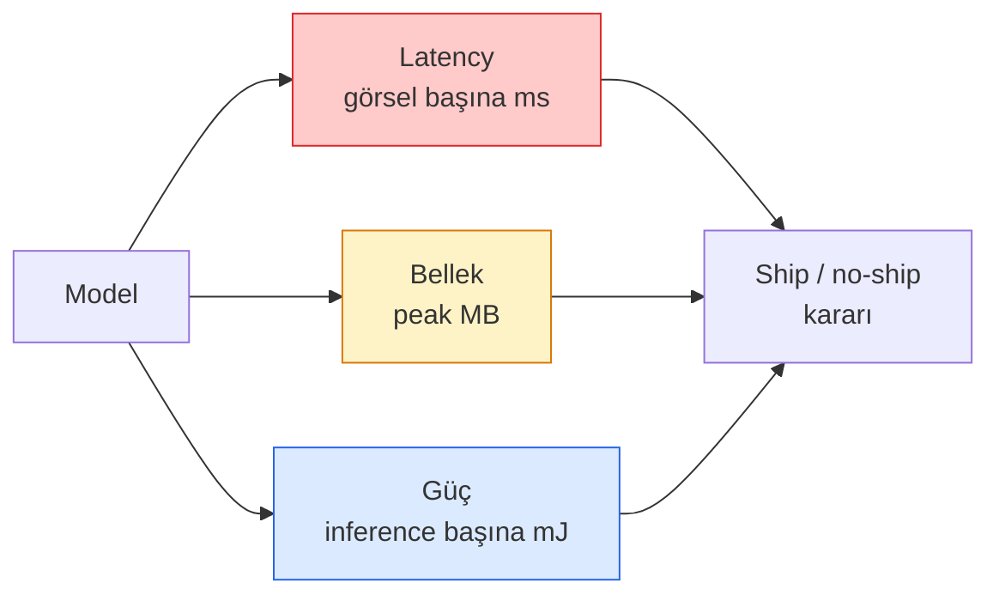

# Gerçek Zamanlı Görü — Edge Deployment

> Edge inference, 2 GB RAM'li bir cihazda 90 doğruluklu bir modeli 30 fps'de çalıştırma disiplinidir. Doğruluğun her yüzde puanı milisaniyelik gecikme ile takas edilir.

**Tür:** Öğrenim + Yapım
**Diller:** Python
**Ön koşullar:** Faz 4 Ders 04 (Image Classification), Faz 10 Ders 11 (Quantization)
**Süre:** ~75 dakika

## Öğrenme Hedefleri

- Herhangi bir PyTorch modeli için inference latency, peak memory ve throughput ölç ve FLOPs / params / latency trade-off'unu oku
- PyTorch'un post-training quantisation'ı kullanarak bir görü modelini INT8'e quantize et ve doğruluk kaybının < %1 olduğunu doğrula
- ONNX'e export et ve ONNX Runtime ya da TensorRT ile derle; üç en yaygın export başarısızlığını ve düzeltmelerini adlandır
- Edge kısıtı için MobileNetV3, EfficientNet-Lite, ConvNeXt-Tiny ya da MobileViT'in ne zaman seçileceğini açıkla

## Sorun

Eğitim-zamanı görü modeli floating-point bir canavardır. 100M parametre, forward pass başına 10 GFLOP, 2 GB VRAM. Bunların hiçbiri bir telefona, bir arabanın infotainment ünitesine, bir endüstriyel kameraya ya da bir drone'a sığmaz. Bir görü sistemi göndermek aynı tahminleri 100x daha küçük bir bütçeye sığdırmak demektir.

Üç düğme işin çoğunu yapar: model seçimi (aynı tariple daha küçük bir mimari), quantisation (FP32 yerine INT8) ve inference runtime (ONNX Runtime, TensorRT, Core ML, TFLite). Bunları doğru yapmak workstation'da çalışan bir demo ile 30 $'lık bir kamera modülünde yayınlanan bir ürün arasındaki farktır.

Bu ders önce ölçüm disiplinini kurar (ölçemediğini optimize edemezsin), sonra üç düğmeyi yürür. Amaç her edge runtime'ı öğrenmek değil, hangi kollar olduğunu ve her birinin düşündüğün şeyi yaptığını nasıl doğrulayacağını bilmektir.

## Kavram

### Üç bütçe



- **Latency**: p50, p95, p99. Yalnızca p50 ortalamak gerçek zamanlı sistemler için önemli olan kuyruk davranışını saklar.
- **Peak memory**: cihazın gördüğü maksimum, sabit hal ortalaması değil. Embedded hedeflerde OOM'lar ölümcül olduğu için önemli.
- **Güç / enerji**: pille çalışan bir cihazda inference başına millijoule. Genellikle CPU/GPU kullanımı * zaman ile yaklaşık hesaplanır.

(model, latency, bellek, doğruluk) tablosu, bir edge kararının alındığı şeydir. Her hücre hedef cihazda ölçülür, workstation'da değil.

### Ölçüm disiplini

Her edge profilinin izlemesi gereken üç kural:

1. Ölçmeden önce 5-10 dummy forward pass ile modeli **warm up** et. Soğuk cache'ler ve JIT derlemesi temsil edici olmayan ilk sayılar üretir.
2. Zamanlanmış bloktan önce ve sonra GPU iş yüklerini `torch.cuda.synchronize()` ile **synchronize** et. Bu olmadan kernel execution'ı değil kernel dispatch'i ölçersin.
3. Girdi boyutlarını üretim çözünürlüğüne **sabitle**. 224x224'teki latency 512x512'deki latency değildir.

### Proxy olarak FLOP'lar

FLOP'lar (inference başına floating-point operasyon), latency için ucuz, cihaz-bağımsız bir proxy'dir. Mimari karşılaştırma için faydalı, mutlak wall-clock olarak yanıltıcı. %10 daha fazla FLOP'lu bir model pratikte 2x daha hızlı olabilir çünkü donanım dostu op'lar kullanır (depthwise conv'lar iyi derlenir, büyük 7x7 conv'lar derlenmez).

Kural: mimari arama için FLOP'ları kullan, deployment kararları için cihazda latency kullan.

### Tek paragrafta quantisation

FP32 ağırlıkları ve aktivasyonları INT8 ile değiştir. Model boyutu 4x düşer, bellek bant genişliği 4x düşer, INT8 kernel'ları olan donanımda (her modern mobil SoC, Tensor Core'lu her NVIDIA GPU) compute 2-4x düşer. Görü görevlerinde doğruluk kaybı post-training static quantisation ile tipik olarak 0.1-1 yüzde puanıdır.

Türler:

- **Dynamic** — ağırlıkları INT8'e quantize et, aktivasyonlar FP'de hesaplanır. Kolay, küçük hızlanma.
- **Static (post-training)** — ağırlıkları quantize et + küçük bir kalibrasyon setinde aktivasyon aralıklarını kalibre et. Dynamic'ten çok daha hızlı.
- **Quantisation-aware training (QAT)** — eğitim sırasında quantisation'ı simüle et böylece model onun etrafında öğrenir. En iyi doğruluk, etiketli veri gerektirir.

Görü için post-training static quantisation %5 çabayla faydanın %95'ini verir. QAT'ı yalnızca PTQ'dan doğruluk kaybı kabul edilemezken kullan.

### Pruning ve distillation

- **Pruning** — önemsiz ağırlıkları (büyüklük tabanlı) ya da kanalları (yapısal) kaldır. Overparameterised modellerde iyi çalışır; zaten kompakt mimarilerde daha az faydalı.
- **Distillation** — küçük bir öğrenciyi büyük bir öğretmenin logitlerini taklit etmek üzere eğit. Modelin küçültülmesinden kaybedilen doğruluğun çoğunu sıklıkla geri kazanır. Üretim edge modelleri için standart.

### Inference runtime'lar

- **PyTorch eager** — yavaş, deployment için değil. Yalnızca geliştirme için kullan.
- **TorchScript** — eski. `torch.compile` ve ONNX export ile yerini aldı.
- **ONNX Runtime** — nötr runtime. CPU, CUDA, CoreML, TensorRT, OpenVINO hepsinin ONNX provider'ı var. Buradan başla.
- **TensorRT** — NVIDIA derleyicisi. NVIDIA GPU'larda (workstation ve Jetson) en iyi latency. ONNX Runtime ile veya bağımsız entegre olur.
- **Core ML** — Apple'ın iOS/macOS için runtime'ı. `.mlmodel` ya da `.mlpackage` gerektirir.
- **TFLite** — Google'ın Android/ARM için runtime'ı. `.tflite` gerektirir.
- **OpenVINO** — Intel'in CPU/VPU için runtime'ı. `.xml` + `.bin` gerektirir.

Pratikte: PyTorch -> ONNX export et -> hedef için runtime'ı seç. ONNX lingua franca'dır.

### Edge mimari seçici

| Bütçe | Model | Neden |
|--------|-------|-----|
| < 3M param | MobileNetV3-Small | Her yerde derlenir, iyi baseline |
| 3-10M | EfficientNet-Lite-B0 | TFLite'ta parametre başına en iyi doğruluk |
| 10-20M | ConvNeXt-Tiny | Parametre başına en iyi doğruluk, CPU dostu |
| 20-30M | MobileViT-S ya da EfficientViT | ImageNet doğruluğuyla transformer |
| 30-80M | Swin-V2-Tiny | Stack pencere attention'ı destekliyorsa |

Buna karşı spesifik bir nedenin yoksa hepsini INT8'e quantize et.

## İnşa Et

### Adım 1: Latency'i doğru ölç

```python
import time
import torch

def measure_latency(model, input_shape, device="cpu", warmup=10, iters=50):
    model = model.to(device).eval()
    x = torch.randn(input_shape, device=device)
    with torch.no_grad():
        for _ in range(warmup):
            model(x)
        if device == "cuda":
            torch.cuda.synchronize()
        times = []
        for _ in range(iters):
            if device == "cuda":
                torch.cuda.synchronize()
            t0 = time.perf_counter()
            model(x)
            if device == "cuda":
                torch.cuda.synchronize()
            times.append((time.perf_counter() - t0) * 1000)
    times.sort()
    return {
        "p50_ms": times[len(times) // 2],
        "p95_ms": times[int(len(times) * 0.95)],
        "p99_ms": times[int(len(times) * 0.99)],
        "mean_ms": sum(times) / len(times),
    }
```

Warm up et, synchronize et, `time.perf_counter()` kullan. Yalnızca mean değil, persentil raporla.

### Adım 2: Parametre ve FLOP sayıları

```python
def parameter_count(model):
    return sum(p.numel() for p in model.parameters())

def flops_estimate(model, input_shape):
    """
    Conv/linear-only bir model için kaba FLOP sayısı. Üretim kullanımı için `fvcore` ya da `ptflops`.
    """
    total = 0
    def conv_hook(m, inp, out):
        nonlocal total
        c_out, c_in, kh, kw = m.weight.shape
        h, w = out.shape[-2:]
        total += 2 * c_in * c_out * kh * kw * h * w
    def linear_hook(m, inp, out):
        nonlocal total
        total += 2 * m.in_features * m.out_features
    hooks = []
    for m in model.modules():
        if isinstance(m, torch.nn.Conv2d):
            hooks.append(m.register_forward_hook(conv_hook))
        elif isinstance(m, torch.nn.Linear):
            hooks.append(m.register_forward_hook(linear_hook))
    model.eval()
    with torch.no_grad():
        model(torch.randn(input_shape))
    for h in hooks:
        h.remove()
    return total
```

Gerçek projeler için `fvcore.nn.FlopCountAnalysis` ya da `ptflops` kullan; her modül tipini doğru şekilde işlerler.

### Adım 3: Post-training static quantisation

```python
def quantise_ptq(model, calibration_loader, backend="x86"):
    import torch.ao.quantization as tq
    model = model.eval().cpu()
    model.qconfig = tq.get_default_qconfig(backend)
    tq.prepare(model, inplace=True)
    with torch.no_grad():
        for x, _ in calibration_loader:
            model(x)
    tq.convert(model, inplace=True)
    return model
```

Üç adım: konfigüre et, hazırla (observer'lar ekle), gerçek verilerle kalibre et, çevir (fuse + quantize). Modelin fuse edilmiş olmasını gerektirir (`Conv -> BN -> ReLU` -> `ConvBnReLU`), ki bunu `torch.ao.quantization.fuse_modules` halleder.

### Adım 4: ONNX'e export

```python
def export_onnx(model, sample_input, path="model.onnx"):
    model = model.eval()
    torch.onnx.export(
        model,
        sample_input,
        path,
        input_names=["input"],
        output_names=["output"],
        dynamic_axes={"input": {0: "batch"}, "output": {0: "batch"}},
        opset_version=17,
    )
    return path
```

`opset_version=17` 2026'da güvenli varsayılan. `dynamic_axes` ONNX modelini keyfi batch boyutuyla çalıştırmana izin verir.

### Adım 5: Benchmark ve rejimleri karşılaştır

```python
import torch.nn as nn
from torchvision.models import mobilenet_v3_small

def compare_regimes():
    model = mobilenet_v3_small(weights=None, num_classes=10)
    params = parameter_count(model)
    flops = flops_estimate(model, (1, 3, 224, 224))
    lat_fp32 = measure_latency(model, (1, 3, 224, 224), device="cpu")
    print(f"FP32 MobileNetV3-Small: {params:,} params  {flops/1e9:.2f} GFLOPs  "
          f"p50={lat_fp32['p50_ms']:.2f}ms  p95={lat_fp32['p95_ms']:.2f}ms")
```

Aynı fonksiyonu `resnet50`, `efficientnet_v2_s` ve `convnext_tiny` için çalıştır ve bir deployment kararı için ihtiyaç duyduğun karşılaştırma tablosuna sahipsin.

## Kullan

Üretim stack'leri üç yoldan birine yakınsar:

- **Web / serverless**: PyTorch -> ONNX -> ONNX Runtime (CPU ya da CUDA provider). En kolay, çoğu için yeterli.
- **NVIDIA edge (Jetson, GPU server)**: PyTorch -> ONNX -> TensorRT. En iyi latency, en büyük mühendislik çabası.
- **Mobil**: PyTorch -> ONNX -> Core ML (iOS) ya da TFLite (Android). Export öncesi quantize et.

Ölçüm için `torch-tb-profiler`, `nvprof` / `nsys` ve macOS'ta Instruments katman-katman dökümler verir. `benchmark_app` (OpenVINO) ve `trtexec` (TensorRT) bağımsız CLI sayıları verir.

## Yayınla

Bu ders şunları üretir:

- `outputs/prompt-edge-deployment-planner.md` — hedef cihaz ve latency SLA verildiğinde backbone, quantisation stratejisi ve runtime seçen bir prompt.
- `outputs/skill-latency-profiler.md` — warmup, synchronisation, persentiller ve bellek izleme ile komple bir latency-benchmarking script'i yazan bir skill.

## Alıştırmalar

1. **(Kolay)** CPU'da 224x224'te `resnet18`, `mobilenet_v3_small`, `efficientnet_v2_s` ve `convnext_tiny` için p50 latency ölç. Tabloyu raporla ve hangi mimarinin ms başına en iyi doğruluğu olduğunu belirle.
2. **(Orta)** `mobilenet_v3_small`'a post-training static quantisation uygula. FP32 vs INT8 latency'i ve CIFAR-10 ya da benzeri bir held-out alt kümesinde doğruluk kaybını raporla.
3. **(Zor)** `convnext_tiny`'i ONNX'e export et, `CPUExecutionProvider` ile `onnxruntime` üzerinden çalıştır ve PyTorch eager baseline'a karşı latency karşılaştır. ONNX Runtime'ın daha hızlı olduğu ilk katmanı belirle ve nedenini açıkla.

## Anahtar Terimler

| Terim | İnsanlar ne diyor | Gerçekte ne anlama geliyor |
|------|----------------|----------------------|
| Latency | "Ne kadar hızlı" | Girdiden çıktıya zaman; p50/p95/p99 persentilleri, mean değil |
| FLOPs | "Model boyutu" | Forward pass başına floating-point op; compute maliyeti için kaba proxy |
| INT8 quantisation | "8-bit" | FP32 ağırlık/aktivasyonları 8-bit tam sayılarla değiştir; ~4x daha küçük, 2-4x daha hızlı |
| PTQ | "Post-training quantisation" | Eğitilmiş bir modeli yeniden eğitim olmadan quantize et; kolay, genellikle yeterli |
| QAT | "Quantisation-aware training" | Eğitim sırasında quantisation'ı simüle et; en iyi doğruluk, etiketli veri gerektirir |
| ONNX | "Nötr format" | Her ana akım inference runtime tarafından desteklenen model değişim formatı |
| TensorRT | "NVIDIA derleyicisi" | ONNX'i NVIDIA GPU'lar için optimize edilmiş bir engine'a derler |
| Distillation | "Teacher -> student" | Küçük bir modeli büyük bir modelin logitlerini taklit etmek üzere eğit; kaybedilen doğruluğun çoğunu geri kazanır |

## İleri Okuma

- [EfficientNet (Tan & Le, 2019)](https://arxiv.org/abs/1905.11946) — verimli mimariler için compound scaling
- [MobileNetV3 (Howard et al., 2019)](https://arxiv.org/abs/1905.02244) — h-swish ve squeeze-excite ile mobile-first mimari
- [A Practical Guide to TensorRT Optimization (NVIDIA)](https://developer.nvidia.com/blog/accelerating-model-inference-with-tensorrt-tips-and-best-practices-for-pytorch-users/) — makaledeki throughput sayılarını gerçekten nasıl elde edersin
- [ONNX Runtime docs](https://onnxruntime.ai/docs/) — quantisation, graph optimisation, provider seçimi
