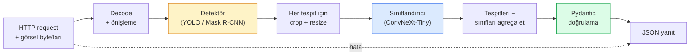

# Komple Bir Görü Pipeline'ı İnşa Et — Bitirme

> Üretim bir görü sistemi, veri kontratlarıyla dikilmiş modeller ve kuralların bir zinciridir. Parçalar zaten bu fazda; bitirme onları uçtan uca birbirine bağlar.

**Tür:** Yapım
**Diller:** Python
**Ön koşullar:** Faz 4 Ders 01-15
**Süre:** ~120 dakika

## Öğrenme Hedefleri

- Nesneleri tespit eden, sınıflandıran ve yapılandırılmış JSON yayan bir üretim görü pipeline'ı tasarla — her başarısızlık yolu ele alınmış
- Bir detektör (Mask R-CNN ya da YOLO), bir sınıflandırıcı (ConvNeXt-Tiny) ve bir veri kontratını (Pydantic) tek bir servise tak
- Uçtan uca pipeline'ı benchmark et ve ilk bottleneck'i (genellikle önişleme, sonra detektör) belirle
- Bir görsel yükleme kabul eden, pipeline'ı çalıştıran ve sınıflandırmalarla tespitleri döndüren minimal bir FastAPI servisi yayınla

## Sorun

Bireysel görü modelleri faydalıdır; görü ürünleri onların zincirleridir. Bir perakende raf denetimi bir detektör artı bir ürün sınıflandırıcı artı bir fiyat-OCR pipeline'ıdır. Otonom sürüş bir 2D detektör artı bir 3D detektör artı bir segmenter artı bir tracker artı bir planner'dır. Bir tıbbi ön-tarama bir segmenter artı bir bölge sınıflandırıcı artı bir klinisyen UI'sidir.

Bu zincirleri bağlamak bir ML prototipini bir üründen ayıran kısımdır. Modeller arası her arayüz bug'lar için yeni bir yerdir. Her koordinat dönüşümü, her normalizasyon, her mask resize sessiz-başarısızlık adayıdır. Bir pipeline en zayıf arayüzü kadar güçlüdür.

Bu bitirme minimum uygulanabilir pipeline'ı kurar: detection + classification + yapılandırılmış çıktı + bir serving katmanı. Faz 4'teki diğer her şey bu iskelete oturur: Mask R-CNN'i YOLOv8 ile değiştir, bir OCR kafası ekle, bir segmentation branch'i ekle, bir tracker ekle. Mimari kararlıdır; parçalar takılabilirdir.

## Kavram

### Pipeline



Yedi aşama. İki model aşaması pahalıdır; diğer beş aşama bug'ların yaşadığı yerdir.

### Pydantic ile veri kontratları

Her model sınırı tipli bir nesne olur. Bu sessiz başarısızlıkları yüksek sesli olanlara çevirir.

```
Detection(
    box: tuple[float, float, float, float],   # (x1, y1, x2, y2), mutlak piksel
    score: float,                              # [0, 1]
    class_id: int,                             # detektörün label map'inden
    mask: Optional[list[list[int]]],           # varsa RLE-encoded
)

PipelineResult(
    image_id: str,
    detections: list[Detection],
    classifications: list[Classification],
    inference_ms: float,
)
```

Bir detektör kutuları `(x1, y1, x2, y2)` yerine `(cx, cy, w, h)` döndürdüğünde, Pydantic'in doğrulaması sınırda başarısız olur ve sessizce boş bölgeler döndüren downstream bir crop'u debug etmek yerine hemen öğrenirsin.

### Latency nereye gider

Neredeyse her görü pipeline'ında üç gerçek geçerlidir:

1. **Önişleme genellikle en büyük tek bloktur.** JPEG'leri decode etmek, renk uzaylarını dönüştürmek, resize etmek — bunlar CPU-bağımlı ve unutması kolay.
2. **Detektör GPU zamanına hakimdir.** GPU zamanının %70-90'ı detection forward pass'inde.
3. **Postprocessing (NMS, RLE encode/decode) GPU'da ucuzdur, CPU'da pahalıdır.** Her zaman gerçek hedefle profil yap.

Dağılımı bilmek optimizasyonu önceliklendirilmiş bir listeye dönüştüren şeydir.

### Başarısızlık modları

- **Boş tespitler** — boş liste döndür, crash olma. Logla.
- **Sınır dışı kutular** — crop'tan önce görsel boyutuna clamp et.
- **Ufak crop'lar** — sınıflandırıcının minimum girdisinden küçük kutular için classification'ı atla.
- **Bozuk upload** — 500 değil, spesifik bir hata kodu ile 400 yanıtı.
- **Model yükleme başarısızlığı** — ilk istekte değil, servis başlangıcında başarısız ol.

Üretim bir pipeline her birini başarısızlığı saklayan generic `try/except` yazmadan halleder. Her başarısızlık bir isimli kod ve yanıt alır.

### Batching

Üretim servisi birden fazla client'a hizmet eder. İstekler arasında tespitleri ve sınıflandırmaları batch'lemek throughput'u katlar. Trade-off: bir batch'in dolmasını beklemekten ekstra latency. Tipik kurulum: 20ms'ye kadar istekleri topla, birlikte batch'le, işle, yanıtları dağıt. `torchserve` ve `triton` bunu yerel olarak yapar; öngörülebilir yüklü küçük servisler kendi mikro-batcher'larını yapar.

## İnşa Et

### Adım 1: Veri kontratları

```python
from pydantic import BaseModel, Field
from typing import List, Optional, Tuple

class Detection(BaseModel):
    box: Tuple[float, float, float, float]
    score: float = Field(ge=0, le=1)
    class_id: int = Field(ge=0)
    mask_rle: Optional[str] = None


class Classification(BaseModel):
    detection_index: int
    class_id: int
    class_name: str
    score: float = Field(ge=0, le=1)


class PipelineResult(BaseModel):
    image_id: str
    detections: List[Detection]
    classifications: List[Classification]
    inference_ms: float
```

Beş saniyelik kod, herhangi bir ciddi pipeline'da bir saatlik debug'ı kurtarır.

### Adım 2: Minimal bir Pipeline class'ı

```python
import time
import numpy as np
import torch
from PIL import Image

class VisionPipeline:
    def __init__(self, detector, classifier, class_names,
                 device="cpu", min_crop=32):
        self.detector = detector.to(device).eval()
        self.classifier = classifier.to(device).eval()
        self.class_names = class_names
        self.device = device
        self.min_crop = min_crop

    def preprocess(self, image):
        """
        image: PIL.Image ya da np.ndarray (H, W, 3) uint8
        returns: cihazda CHW float tensor
        """
        if isinstance(image, Image.Image):
            image = np.asarray(image.convert("RGB"))
        tensor = torch.from_numpy(image).permute(2, 0, 1).float() / 255.0
        return tensor.to(self.device)

    @torch.no_grad()
    def detect(self, image_tensor):
        return self.detector([image_tensor])[0]

    @torch.no_grad()
    def classify(self, crops):
        if len(crops) == 0:
            return []
        batch = torch.stack(crops).to(self.device)
        logits = self.classifier(batch)
        probs = logits.softmax(-1)
        scores, cls = probs.max(-1)
        return list(zip(cls.tolist(), scores.tolist()))

    def run(self, image, image_id="anonymous"):
        t0 = time.perf_counter()
        tensor = self.preprocess(image)
        det = self.detect(tensor)

        crops = []
        detections = []
        valid_indices = []
        for i, (box, score, cls) in enumerate(zip(det["boxes"], det["scores"], det["labels"])):
            x1, y1, x2, y2 = [max(0, int(b)) for b in box.tolist()]
            x2 = min(x2, tensor.shape[-1])
            y2 = min(y2, tensor.shape[-2])
            detections.append(Detection(
                box=(x1, y1, x2, y2),
                score=float(score),
                class_id=int(cls),
            ))
            if (x2 - x1) < self.min_crop or (y2 - y1) < self.min_crop:
                continue
            crop = tensor[:, y1:y2, x1:x2]
            crop = torch.nn.functional.interpolate(
                crop.unsqueeze(0),
                size=(224, 224),
                mode="bilinear",
                align_corners=False,
            )[0]
            crops.append(crop)
            valid_indices.append(i)

        class_preds = self.classify(crops)

        classifications = []
        for valid_idx, (cls_id, cls_score) in zip(valid_indices, class_preds):
            classifications.append(Classification(
                detection_index=valid_idx,
                class_id=int(cls_id),
                class_name=self.class_names[cls_id],
                score=float(cls_score),
            ))

        return PipelineResult(
            image_id=image_id,
            detections=detections,
            classifications=classifications,
            inference_ms=(time.perf_counter() - t0) * 1000,
        )
```

Her arayüz tipli. Her başarısızlık yolunun spesifik bir yönetim kararı var.

### Adım 3: Bir detektör ve sınıflandırıcı bağla

```python
from torchvision.models.detection import maskrcnn_resnet50_fpn_v2
from torchvision.models import convnext_tiny

# Eğitim olmadan gerçekçi bir pipeline için ImageNet-pretrained ağırlıklar kullan
detector = maskrcnn_resnet50_fpn_v2(weights="DEFAULT")
classifier = convnext_tiny(weights="DEFAULT")
class_names = [f"imagenet_class_{i}" for i in range(1000)]

pipe = VisionPipeline(detector, classifier, class_names)

# Sentetik bir görselle smoke test
test_image = (np.random.rand(400, 600, 3) * 255).astype(np.uint8)
result = pipe.run(test_image, image_id="demo")
print(result.model_dump_json(indent=2)[:500])
```

### Adım 4: FastAPI servisi

```python
from fastapi import FastAPI, UploadFile, HTTPException
from io import BytesIO

app = FastAPI()
pipe = None  # startup'ta ilklenir

@app.on_event("startup")
def load():
    global pipe
    detector = maskrcnn_resnet50_fpn_v2(weights="DEFAULT").eval()
    classifier = convnext_tiny(weights="DEFAULT").eval()
    pipe = VisionPipeline(detector, classifier, class_names=[f"c{i}" for i in range(1000)])

@app.post("/detect")
async def detect_endpoint(file: UploadFile):
    if file.content_type not in {"image/jpeg", "image/png", "image/webp"}:
        raise HTTPException(status_code=400, detail="desteklenmeyen görsel türü")
    data = await file.read()
    try:
        img = Image.open(BytesIO(data)).convert("RGB")
    except Exception:
        raise HTTPException(status_code=400, detail="görsel decode edilemiyor")
    result = pipe.run(img, image_id=file.filename or "upload")
    return result.model_dump()
```

`uvicorn main:app --host 0.0.0.0 --port 8000` ile çalıştır. `curl -F 'file=@dog.jpg' http://localhost:8000/detect` ile test et.

### Adım 5: Pipeline'ı benchmark et

```python
import time

def benchmark(pipe, num_runs=20, image_size=(400, 600)):
    img = (np.random.rand(*image_size, 3) * 255).astype(np.uint8)
    pipe.run(img)  # warm up

    stages = {"preprocess": [], "detect": [], "classify": [], "total": []}
    for _ in range(num_runs):
        t0 = time.perf_counter()
        tensor = pipe.preprocess(img)
        t1 = time.perf_counter()
        det = pipe.detect(tensor)
        t2 = time.perf_counter()
        crops = []
        for box in det["boxes"]:
            x1, y1, x2, y2 = [max(0, int(b)) for b in box.tolist()]
            x2 = min(x2, tensor.shape[-1])
            y2 = min(y2, tensor.shape[-2])
            if (x2 - x1) >= pipe.min_crop and (y2 - y1) >= pipe.min_crop:
                crop = tensor[:, y1:y2, x1:x2]
                crop = torch.nn.functional.interpolate(
                    crop.unsqueeze(0), size=(224, 224), mode="bilinear", align_corners=False
                )[0]
                crops.append(crop)
        pipe.classify(crops)
        t3 = time.perf_counter()
        stages["preprocess"].append((t1 - t0) * 1000)
        stages["detect"].append((t2 - t1) * 1000)
        stages["classify"].append((t3 - t2) * 1000)
        stages["total"].append((t3 - t0) * 1000)

    for stage, times in stages.items():
        times.sort()
        print(f"{stage:12s}  p50={times[len(times)//2]:7.1f} ms  p95={times[int(len(times)*0.95)]:7.1f} ms")
```

CPU'da tipik çıktı: preprocess ~3 ms, detect 300-500 ms, classify 20-40 ms, total 350-550 ms. GPU'da detect 20-40 ms ve preprocess + classify göreceli olarak daha fazla önemli olmaya başlar.

## Kullan

Üretim şablonları aynı yapıya yakınsar, artı:

- **Model versiyonlama** — yanıtta her zaman model adını ve weight hash'ini logla.
- **İstek başına trace ID'leri** — yavaş yanıtları aşamalarla ilişkilendirebilesin diye her istek için her aşama zamanlamasını logla.
- **Fallback yolu** — sınıflandırıcı timeout olursa, tüm isteği başarısız yapmak yerine classification'sız tespitleri döndür.
- **Güvenlik filtreleri** — NSFW / PII filtreleri classification sonrası, yanıt servisten ayrılmadan önce çalışır.
- **Batch endpoint** — toplu işleme için görsel URL'leri listesi kabul eden bir `/detect_batch`.

Üretim serving için `torchserve`, `Triton Inference Server` ve `BentoML` batching, versiyonlama, metrikler ve health check'leri kutudan çıkar çıkmaz halleder. `FastAPI`'yi doğrudan çalıştırmak prototipler ve küçük ölçekli ürünler için sorun değil.

## Yayınla

Bu ders şunları üretir:

- `outputs/prompt-vision-service-shape-reviewer.md` — bir görü servisinin kodunu kontrat/yanıt shape ihlalleri için inceleyen ve ilk bozucu bug'ı adlandıran bir prompt.
- `outputs/skill-pipeline-budget-planner.md` — hedef latency ve throughput verildiğinde her pipeline aşamasına bir zaman bütçesi atayan ve bütçesini ilk hangi aşamanın kaçıracağını işaretleyen bir skill.

## Alıştırmalar

1. **(Kolay)** Açık herhangi bir dataset'ten 10 görsel üzerinde pipeline'ı çalıştır. Aşama başına ortalama süreyi ve görsel başına tespit sayılarının dağılımını raporla.
2. **(Orta)** `Detection`'a bir mask çıktı alanı ekle ve onu RLE olarak encode et. 10-nesneli bir görsel için bile JSON'ın 1MB'ın altında kaldığını doğrula.
3. **(Zor)** Sınıflandırıcının önüne bir mikro-batcher ekle: 10 ms'ye kadar crop'ları topla, hepsini tek bir GPU çağrısında sınıflandır, istek başına sonuçları döndür. Saniyede 5 eşzamanlı istekte throughput kazancını ve eklenen latency'i ölç.

## Anahtar Terimler

| Terim | İnsanlar ne diyor | Gerçekte ne anlama geliyor |
|------|----------------|----------------------|
| Pipeline | "Sistem" | Her çift arasında tipli bir arayüzle önişleme, inference ve postprocessing adımlarının sıralı zinciri |
| Veri kontratı | "Şema" | Her aşama girdi ve çıktısının uyduğu Pydantic / dataclass tanımları; entegrasyon bug'larını sınırda yakalar |
| Önişleme | "Modelden önce" | Decoding, renk dönüşümü, resizing, normalisation; genellikle en büyük CPU zaman sinki |
| Postprocessing | "Modelden sonra" | NMS, mask resize, threshold, RLE encode; GPU'da ucuz, CPU'da pahalı |
| Microbatcher | "Topla sonra forward et" | Sabit bir pencere boyunca birden fazla istek bekleyen, tek bir batched forward pass çalıştıran agregatör |
| Trace ID | "Request id" | Yavaş istekler uçtan uca takip edilebilsin diye her aşamada loglanan istek başına tanımlayıcı |
| Başarısızlık kodu | "İsimli hata" | Generic 500 yerine başarısızlık sınıfı başına spesifik hata kodu; client retry mantığı sağlar |
| Health check | "Readiness probe" | Servisin yanıt verip veremediğini raporlayan ucuz endpoint; load balancer'lar buna güvenir |

## İleri Okuma

- [Full Stack Deep Learning — Deploying Models](https://fullstackdeeplearning.com/course/2022/lecture-5-deployment/) — üretim ML deployment'ının canonical genel bakışı
- [BentoML docs](https://docs.bentoml.com) — batching, versiyonlama ve metriklerle serving framework
- [torchserve docs](https://pytorch.org/serve/) — PyTorch'un resmi serving kütüphanesi
- [NVIDIA Triton Inference Server](https://developer.nvidia.com/triton-inference-server) — batching ve multi-model destekli yüksek-throughput serving
