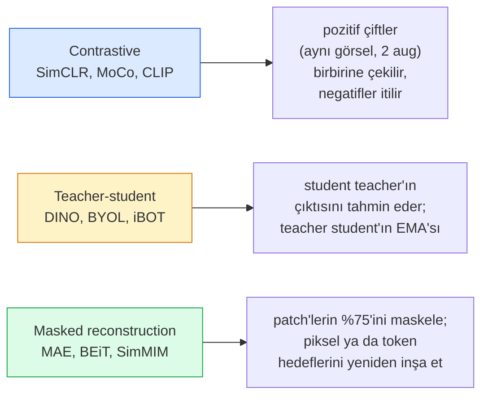

# Self-Supervised Görü — SimCLR, DINO, MAE

> Etiketler supervised görünün darboğazıdır. Self-supervised pretraining onları kaldırır: 100M etiketsiz görselden görsel feature'ları öğren, 10k etiketliyle fine-tune et.

**Tür:** Öğrenim + Yapım
**Diller:** Python
**Ön koşullar:** Faz 4 Ders 04 (Image Classification), Faz 4 Ders 14 (ViT)
**Süre:** ~75 dakika

## Öğrenme Hedefleri

- Üç ana self-supervised aileyi — contrastive (SimCLR), teacher-student (DINO), masked reconstruction (MAE) — izle ve her birinin neyi optimize ettiğini söyle
- Sıfırdan bir InfoNCE loss uygula ve 512'lik batch'in neden çalışıp 32'lik batch'in neden başarısız olduğunu açıkla
- MAE'nin %75 maskeleme oranının neden keyfi olmadığını ve BERT'in metin için %15'inden nasıl farklı olduğunu açıkla
- Linear probing ve zero-shot retrieval için DINOv2 ya da MAE ImageNet checkpoint'lerini kullan

## Sorun

Supervised ImageNet 1.3M etiketli görsele sahiptir, anotasyonu tahmini 10M$ tutmuştur. Tıbbi ve endüstriyel dataset'ler daha küçüktür ve etiketlemesi daha da pahalıdır. Her görü ekibi sorar: ucuz etiketsiz veride — YouTube frame'leri, web crawl'ları, webcam görüntüleri, uydu taramaları — pretrain edip sonra küçük etiketli bir set üzerinde fine-tune edebilir miyiz?

Self-supervised learning cevaptır. LAION ya da JFT üzerinde eğitilmiş modern bir self-supervised ViT, fine-tune edildiğinde supervised ImageNet doğruluğuna ulaşır ya da yener. Downstream görevlere (detection, segmentation, depth) supervised pretraining'den daha iyi de aktarır. DINOv2 (Meta, 2023) ve MAE (Meta, 2022) aktarılabilir görü feature'ları için mevcut üretim varsayılanlarıdır.

Kavramsal kayma şudur: pretext task — modelin yapmak üzere eğitildiği şey — downstream task olmak zorunda değildir. Önemli olan modelin faydalı feature'lar öğrenmeye zorlanmasıdır. Grayscale görsellerin rengini tahmin et, görselleri döndür ve modele döndürmeyi sınıflandırmasını söyle, patch'leri maskele ve onları yeniden inşa et — hepsi çalışmıştır. Ölçeklenen üç yaklaşım contrastive learning, teacher-student distillation ve masked reconstruction'dır.

## Kavram

### Üç aile



### Contrastive learning (SimCLR)

Bir görsel al, iki rastgele augmentation uygula, iki görünüm elde et. Her ikisini aynı encoder artı bir projection head'den geçir. "Bu iki embedding yakın olmalı" ve "bu embedding batch'teki diğer her görselin embedding'lerinden uzak olmalı" diyen bir loss'u minimize et.

```
Batch başına 2N görünüm arasında pozitif çift (z_i, z_j) için Loss:

   L_ij = -log( exp(sim(z_i, z_j) / tau) / sum_k in batch \ {i} exp(sim(z_i, z_k) / tau) )

sim = cosine similarity
tau = temperature (0.1 standart)
```

Bu InfoNCE loss'tur. Pozitif başına çok sayıda negative gerektirir, dolayısıyla batch boyutu önemlidir — SimCLR 512-8192 gerektirir. MoCo, negative sayısını batch boyutundan ayırmak için geçmiş batch'lerin bir momentum kuyruğunu tanıttı.

### Teacher-student (DINO)

Aynı mimariye sahip iki ağ: student ve teacher. Teacher student'ın ağırlıklarının exponential moving average (EMA)'sıdır. Her ikisi de görselin augmented görünümlerini görür. Student'ın çıktısı teacher'ınkiyle eşleşmek üzere eğitilir — explicit negative yok.

```
loss = CE( student_output(view_1),  teacher_output(view_2) )
     + CE( student_output(view_2),  teacher_output(view_1) )

teacher_weights = m * teacher_weights + (1 - m) * student_weights   (m ≈ 0.996)
```

Neden "sabit tahmin et"e çökmüyor: teacher'ın çıktısı merkezlenmiş (boyut başına ortalama çıkarılmış) ve sharpened (küçük temperature'a bölünmüş). Centring, bir boyutun hakim olmasını engeller; sharpening uniform'a output collapse'ı engeller.

DINO, DINOv2'nin 142M curated görsel üzerinde ölçeklendirdiği şeydir. Sonuç feature'lar zero-shot görsel retrieval ve yoğun tahmin için mevcut SOTA'dır.

### Masked reconstruction (MAE)

Bir ViT girdisinin patch'lerinin %75'ini maskele. Yalnızca görünür %25'i encoder'dan geçir. Küçük bir decoder, encoder'ın çıktısı artı maskelenmiş konumlardaki mask token'larını alır ve maskelenmiş patch'lerin piksellerini yeniden inşa etmek için eğitilir.

```
Encoder:  patch'lerin görünür %25'i -> feature'lar
Decoder:  feature'lar + maskelenmiş konumlarda mask token'lar -> yeniden inşa edilmiş pikseller
Loss:     yalnızca maskelenmiş patch'lerde yeniden inşa edilmiş ve orijinal pikseller arasında MSE
```

MAE'yi çalıştıran ana tasarım kararları:

- **%75 mask oranı** — yüksek. Encoder'ı semantik feature'lar öğrenmeye zorlar; %25'i yeniden inşa etmek neredeyse trivial olur (komşu pikseller o kadar korelasyonludur ki bir CNN kolayca halleder).
- **Asimetrik encoder/decoder** — büyük ViT encoder yalnızca görünür patch'leri görür; küçük bir decoder (8-katmanlı, 512-boyutlu) yeniden inşayı halleder. Naive BEiT'ten 3x daha hızlı pretraining.
- **Pixel-space yeniden inşa hedefi** — BEiT'in tokenized hedefinden daha basit ve ViT'te daha iyi çalışır.

Pretraining sonrasında decoder'ı at. Encoder feature extractor'dır.

### Neden %75 ve %15 değil

BERT %15 token maskeler. MAE %75 maskeler. Fark bilgi yoğunluğudur.

- Doğal dilin token başına yüksek entropisi vardır. Token'ların %15'ini tahmin etmek hâlâ zordur çünkü her maskelenmiş konumun birçok makul tamamlaması vardır.
- Görsel patch'lerin düşük entropisi vardır — maskelenmemiş bir komşuluk genellikle maskelenmiş patch'in piksellerini neredeyse tam olarak belirler. Tahmini semantik anlama gerektirecek hale getirmek için agresif maskelemen gerekir.

%75, basit uzaysal ekstrapolasyonun görevi çözememesi için yeterince yüksektir; encoder görsel içeriğini temsil etmek zorundadır.

### Linear-probe değerlendirmesi

Self-supervised pretraining sonrasında standart değerlendirme bir **linear probe**'dur: encoder'ı dondur, ImageNet etiketleri üzerinde üstünde tek bir linear sınıflandırıcı eğit. Top-1 doğruluğu raporlar.

- SimCLR ResNet-50: ~%71 (2020)
- DINO ViT-S/16: ~%77 (2021)
- MAE ViT-L/16: ~%76 (2022)
- DINOv2 ViT-g/14: ~%86 (2023)

Linear probe feature kalitesinin saf bir ölçüsüdür; fine-tuning tipik olarak 2-5 puan ekler ama head yeniden eğitiminin etkisini de karıştırır.

## İnşa Et

### Adım 1: İki-görünüm augmentation pipeline'ı

```python
import torch
import torchvision.transforms as T

two_view_train = lambda: T.Compose([
    T.RandomResizedCrop(96, scale=(0.2, 1.0)),
    T.RandomHorizontalFlip(),
    T.ColorJitter(0.4, 0.4, 0.4, 0.1),
    T.RandomGrayscale(p=0.2),
    T.ToTensor(),
])


class TwoViewDataset(torch.utils.data.Dataset):
    def __init__(self, base):
        self.base = base
        self.aug = two_view_train()

    def __len__(self):
        return len(self.base)

    def __getitem__(self, i):
        img, _ = self.base[i]
        v1 = self.aug(img)
        v2 = self.aug(img)
        return v1, v2
```

Her __getitem__ aynı görselin iki augmented görünümünü döndürür; etiketlere gerek yok.

### Adım 2: InfoNCE loss

```python
import torch.nn.functional as F

def info_nce(z1, z2, tau=0.1):
    """
    z1, z2: çiftlenmiş görünümlerin (N, D) L2-normalize edilmiş embedding'leri
    """
    N, D = z1.shape
    z = torch.cat([z1, z2], dim=0)  # (2N, D)
    sim = z @ z.T / tau              # (2N, 2N)

    mask = torch.eye(2 * N, dtype=torch.bool, device=z.device)
    sim = sim.masked_fill(mask, float("-inf"))

    targets = torch.cat([torch.arange(N, 2 * N), torch.arange(0, N)]).to(z.device)
    return F.cross_entropy(sim, targets)
```

Çağırmadan önce embedding'leri L2-normalize et. `tau=0.1` SimCLR varsayılanıdır; daha düşük loss'u daha keskin yapar ve daha fazla negative gerektirir.

### Adım 3: InfoNCE sağlık kontrolü

```python
z1 = F.normalize(torch.randn(16, 32), dim=-1)
z2 = z1.clone()
loss_same = info_nce(z1, z2, tau=0.1).item()
z2_random = F.normalize(torch.randn(16, 32), dim=-1)
loss_random = info_nce(z1, z2_random, tau=0.1).item()
print(f"InfoNCE özdeş çiftlerle:    {loss_same:.3f}")
print(f"InfoNCE rastgele çiftlerle: {loss_random:.3f}")
```

Özdeş çiftler düşük bir loss vermeli (büyük batch ve soğuk temperature için 0'a yakın). Rastgele çiftler 16-çiftlik batch ile log(2N-1) = ~log(31) = ~3.4 vermeli.

### Adım 4: MAE-tarzı maskeleme

```python
def random_mask_indices(num_patches, mask_ratio=0.75, seed=0):
    g = torch.Generator().manual_seed(seed)
    n_keep = int(num_patches * (1 - mask_ratio))
    perm = torch.randperm(num_patches, generator=g)
    visible = perm[:n_keep]
    masked = perm[n_keep:]
    return visible.sort().values, masked.sort().values


num_patches = 196
visible, masked = random_mask_indices(num_patches, mask_ratio=0.75)
print(f"visible: {len(visible)} / {num_patches}")
print(f"masked:  {len(masked)} / {num_patches}")
```

Basit, hızlı ve verili seed için deterministik. Gerçek MAE implementasyonları bunu batch'ler ve örnek başına mask tutar.

## Kullan

DINOv2 2026'da üretim standardıdır:

```python
import torch
from transformers import AutoImageProcessor, AutoModel

processor = AutoImageProcessor.from_pretrained("facebook/dinov2-base")
model = AutoModel.from_pretrained("facebook/dinov2-base")
model.eval()

# Zero-shot retrieval için görsel başına embedding'ler
with torch.no_grad():
    inputs = processor(images=[pil_image], return_tensors="pt")
    outputs = model(**inputs)
    embedding = outputs.last_hidden_state[:, 0]  # CLS token
```

Sonuç 768-boyutlu embedding, modern görsel retrieval, yoğun karşılık ve zero-shot transfer pipeline'larının omurgasıdır. Downstream görevde fine-tuning nadiren bir linear head'den fazlasını gerektirir.

Görsel-metin embedding'leri için SigLIP ya da OpenCLIP eşdeğeridir; MAE-tarzı fine-tuning için `timm` reposu her MAE checkpoint'i taşır.

## Yayınla

Bu ders şunları üretir:

- `outputs/prompt-ssl-pretraining-picker.md` — dataset boyutu, compute ve downstream task verildiğinde SimCLR / MAE / DINOv2 seçen bir prompt.
- `outputs/skill-linear-probe-runner.md` — donmuş herhangi bir encoder + etiketli dataset için linear-probe değerlendirmesi yazan bir skill.

## Alıştırmalar

1. **(Kolay)** İyi hizalı embedding'ler için temperature'ı düşürdüğünde InfoNCE loss'unun düştüğünü ve rastgele embedding'ler için temperature'ı düşürdüğünde yükseldiğini doğrula. `tau in [0.05, 0.1, 0.2, 0.5]` vs loss grafiği üret.
2. **(Orta)** Bir DINO-tarzı centre buffer uygula. Centring olmadan student'ın birkaç epoch içinde sabit bir vektöre çöktüğünü göster.
3. **(Zor)** Ders 10'daki TinyUNet'i backbone olarak kullanarak CIFAR-100 üzerinde MAE eğit. 10, 50 ve 200 epoch'ta linear-probe doğruluğunu raporla. Aynı 1.000-görsellik alt kümede MAE-pretrained linear probe'un sıfırdan supervised linear probe'u yendiğini göster.

## Anahtar Terimler

| Terim | İnsanlar ne diyor | Gerçekte ne anlama geliyor |
|------|----------------|----------------------|
| Self-supervised | "Etiket-free" | Etiketsiz veriden faydalı temsiller üreten bir pretext task |
| Pretext task | "Sahte görev" | SSL sırasında kullanılan hedef (patch'leri yeniden inşa et, görünümleri eşle); pretraining sonrası atılır |
| Linear probe | "Donmuş encoder + linear head" | Standart SSL değerlendirmesi: donmuş feature'ların üzerinde yalnızca linear sınıflandırıcı eğit |
| InfoNCE | "Contrastive loss" | Kosinüs benzerlikleri üzerinde softmax; pozitif çift hedef sınıftır, diğerleri negatiftir |
| EMA teacher | "Moving-average teacher" | Ağırlıkları student'ınkinin exponential moving average'i olan teacher; BYOL, MoCo, DINO tarafından kullanılır |
| Mask ratio | "Gizlenen patch %'si" | MAE sırasında maskelenen patch fraksiyonu; görü için %75, metin için %15 |
| Representation collapse | "Sabit çıktı" | Encoder'ın tüm girdiler için sabit bir vektör ürettiği SSL başarısızlığı; centring, sharpening ya da negative'lerle önlenir |
| DINOv2 | "Üretim SSL backbone'u" | Meta'nın 2023 self-supervised ViT'i; 2026'da en güçlü genel-amaçlı görsel feature'ları |

## İleri Okuma

- [SimCLR (Chen et al., 2020)](https://arxiv.org/abs/2002.05709) — contrastive learning referansı
- [DINO (Caron et al., 2021)](https://arxiv.org/abs/2104.14294) — momentum, centring, sharpening ile teacher-student
- [MAE (He et al., 2022)](https://arxiv.org/abs/2111.06377) — ViT için masked autoencoder pretraining
- [DINOv2 (Oquab et al., 2023)](https://arxiv.org/abs/2304.07193) — self-supervised ViT'i üretim feature'larına ölçeklendirmek
