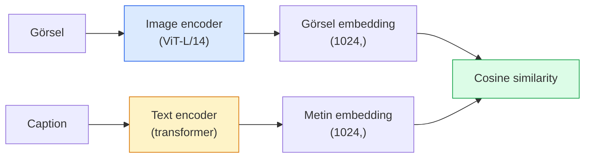

# Open-Vocabulary Görü — CLIP

> Bir image encoder ile bir text encoder'ı birlikte eğit, böylece eşleşen (görsel, caption) çiftleri paylaşılan bir uzayda aynı noktaya düşsün. Tüm hile bu.

**Tür:** Yapım + Kullan
**Diller:** Python
**Ön koşullar:** Faz 4 Ders 14 (ViT), Faz 4 Ders 17 (Self-Supervised)
**Süre:** ~45 dakika

## Öğrenme Hedefleri

- CLIP'in iki-tower mimarisini ve contrastive eğitim hedefini açıkla
- Hiçbir görev-spesifik eğitim olmadan zero-shot classification için pretrained bir CLIP (ya da SigLIP) kullan
- Sıfırdan zero-shot classification uygula: sınıf prompt'larını encode et, cosine similarity hesapla, argmax al
- CLIP, SigLIP, OpenCLIP ve LLaVA/LLaMA-vision modellerini ayır — 2026'da her birinin ne için olduğu

## Sorun

Geleneksel sınıflandırıcılar closed-vocabulary'dir: bir 1000-sınıflı ImageNet modeli yalnızca 1000 etiket tahmin edebilir. Her yeni kategori etiketli veri ve yeniden eğitilmiş bir head gerektirir.

CLIP (Radford et al., OpenAI 2021), web'den scrap edilmiş 400M (görsel, caption) çifti üzerinde eğitmenin, çıkarımda yalnızca doğal dilde tarif edilen herhangi bir kategori setine sınıflandırabilen bir model ürettiğini gösterdi. Bir cümle yazarak ona yeni bir sınıf verirsin.

Bu yetenek — zero-shot transfer — her modern görü sisteminin neden bir CLIP-ailesi checkpoint ile başladığının nedenidir. Detection (Grounding DINO, OWL-ViT), segmentation (CLIPSeg, SAM), retrieval, içerik moderasyonu, VLM'ler ve text-to-image generation hepsi CLIP-tarzı joint embedding'ler üzerine inşa eder.

## Kavram

### İki tower



Her iki encoder da aynı embedding boyutuna linear projection ile biter (CLIP-B/32 için 512, CLIP-L/14 için 1024). L2-normalize et ve cosine similarity hesapla.

### Hedef

N (görsel, caption) çiftinden oluşan bir batch verildiğinde, bir NxN benzerlik matrisi kur. Her iki encoder'ı diyagonal (eşleşen çiftler) yüksek benzerliğe ve off-diagonal'lar (eşleşmeyen) düşük benzerliğe sahip olacak şekilde eğit.

```
sim_matrix = image_embeddings @ text_embeddings.T / tau

loss_i2t = cross_entropy(sim_matrix,       targets=arange(N))
loss_t2i = cross_entropy(sim_matrix.T,     targets=arange(N))
loss = (loss_i2t + loss_t2i) / 2
```

Simetriktir çünkü hem image-to-text hem text-to-image retrieval çalışmalıdır. `tau` (temperature) tipik olarak bir skalar parametre olarak öğrenilir, 0.07 ile ilklendirilir.

### SigLIP: daha iyi bir loss

SigLIP (Zhai et al., 2023) softmax'ı çift başına sigmoid ile değiştirdi:

```
loss = çiftler üzerinde mean of log(1 + exp(-y_ij * sim_ij))
y_ij = +1 eğer eşleşiyorsa, aksi halde -1
```

Çift-başına loss, CLIP'in gerektirdiği batch-düzeyi normalizasyonu kaldırır. SigLIP küçük batch boyutlarında daha iyi eğitilir ve eşit veride CLIP'i eşler ya da aşar.

### Zero-shot classification

Eğitilmiş bir CLIP verildiğinde:

1. Her sınıf için bir prompt oluştur: "a photo of a {class}".
2. Tüm sınıf prompt'larını text encoder ile encode et -> `T` shape (C, d).
3. Test görselini encode et -> `I` shape (1, d).
4. Benzerlik = `I @ T.T` shape (1, C).
5. Argmax -> öngörülen sınıf.

Prompt engineering önemli. OpenAI ImageNet için 80 prompt şablonu yayınladı ("a photo of a {}", "a blurry photo of a {}", "a sketch of a {}", ...). Tüm şablonların embedding'lerini sınıf başına ortalamak ekstra %1-3 top-1 doğruluk verir.

### 2026'da CLIP-tarzı modellerin nerede kullanıldığı

- **Zero-shot classification** — doğrudan kullanım.
- **Image retrieval** — tüm görselleri bir kez encode et, sorguyu çıkarımda göm.
- **Text-koşullu detection** — Grounding DINO, OWL-ViT bir CLIP text tower'ını bir detektörün etrafına sarar.
- **Text-koşullu segmentation** — CLIPSeg; SAM CLIP üzerinden text-prompt girdileri kullanır.
- **VLM'ler** — LLaVA, Qwen-VL, InternVL bir CLIP-ailesi görü encoder'ı bir LLM'e bağlar.
- **Text-to-image gen** — Stable Diffusion, DALL-E 3 CLIP text embedding'lerine koşullanır.

Bir kez paylaşılan bir embedding space'in olduğunda, her görü+dil görevi bir mesafe hesaplamasına dönüşür.

## İnşa Et

### Adım 1: Ufak bir iki-tower modeli

Gerçek CLIP ViT + transformer'dır. Bu ders için tower'lar CPU'da eğitim sinyali görünür olsun diye önceden çıkarılmış feature'lar üzerinde küçük MLP'lerdir.

```python
import torch
import torch.nn as nn
import torch.nn.functional as F


class TwoTower(nn.Module):
    def __init__(self, img_in=128, txt_in=64, emb=64):
        super().__init__()
        self.image_proj = nn.Sequential(nn.Linear(img_in, 128), nn.ReLU(), nn.Linear(128, emb))
        self.text_proj = nn.Sequential(nn.Linear(txt_in, 128), nn.ReLU(), nn.Linear(128, emb))
        self.logit_scale = nn.Parameter(torch.ones([]) * 2.6592)  # ln(1/0.07)

    def forward(self, img_feats, txt_feats):
        i = F.normalize(self.image_proj(img_feats), dim=-1)
        t = F.normalize(self.text_proj(txt_feats), dim=-1)
        return i, t, self.logit_scale.exp()
```

İki projection, paylaşılan-boyut çıktı, öğrenilen temperature. Gerçek CLIP API ile aynı shape.

### Adım 2: Contrastive loss

```python
def clip_loss(image_emb, text_emb, logit_scale):
    N = image_emb.size(0)
    sim = logit_scale * image_emb @ text_emb.T
    targets = torch.arange(N, device=sim.device)
    l_i = F.cross_entropy(sim, targets)
    l_t = F.cross_entropy(sim.T, targets)
    return (l_i + l_t) / 2
```

Simetrik. Daha yüksek logit_scale = daha keskin softmax = daha güvenli ama kararsızlık riski.

### Adım 3: Zero-shot sınıflandırıcı

```python
@torch.no_grad()
def zero_shot_classify(model, image_feats, class_text_feats, class_names):
    """
    image_feats:      (N, img_in)
    class_text_feats: (C, txt_in)   sınıf başına bir ortalanmış embedding
    """
    i = F.normalize(model.image_proj(image_feats), dim=-1)
    t = F.normalize(model.text_proj(class_text_feats), dim=-1)
    sim = i @ t.T
    pred = sim.argmax(dim=-1)
    return [class_names[p] for p in pred.tolist()]
```

Adım başına tek satır. Bu, üretim bir CLIP checkpoint ile kullanılan tam zero-shot prosedürdür.

### Adım 4: Sağlık kontrolü

```python
torch.manual_seed(0)
model = TwoTower()

img = torch.randn(8, 128)
txt = torch.randn(8, 64)
i, t, scale = model(img, txt)
loss = clip_loss(i, t, scale)
print(f"batch size: {i.size(0)}   loss: {loss.item():.3f}")
```

Rastgele ilklendirilmiş bir model için loss `log(N) = log(8) = 2.08`'e yakın olmalı — hiç yapı öğrenilmemişken simetrik cross-entropy hedefi.

## Kullan

OpenCLIP 2026'da topluluk varsayılanıdır:

```python
import open_clip
import torch
from PIL import Image

model, _, preprocess = open_clip.create_model_and_transforms("ViT-B-32", pretrained="laion2b_s34b_b79k")
tokenizer = open_clip.get_tokenizer("ViT-B-32")

image = preprocess(Image.open("dog.jpg")).unsqueeze(0)
text = tokenizer(["a photo of a dog", "a photo of a cat", "a photo of a car"])

with torch.no_grad():
    image_features = model.encode_image(image)
    text_features = model.encode_text(text)
    image_features = image_features / image_features.norm(dim=-1, keepdim=True)
    text_features = text_features / text_features.norm(dim=-1, keepdim=True)
    probs = (100.0 * image_features @ text_features.T).softmax(dim=-1)

print(probs)
```

SigLIP daha yenidir, küçük ölçeklerde daha iyi eğitir ve yeni iş için tercih edilir: `google/siglip-base-patch16-224`. Hugging Face her ikisini de taşır.

## Yayınla

Bu ders şunları üretir:

- `outputs/prompt-zero-shot-class-picker.md` — bir sınıf listesi ve bir domain verildiğinde zero-shot CLIP için sınıf şablonları tasarlayan bir prompt.
- `outputs/skill-image-text-retriever.md` — herhangi bir CLIP checkpoint ile bir görsel embedding index'i kuran, query-by-text ve query-by-image destekleyen bir skill.

## Alıştırmalar

1. **(Kolay)** Pretrained bir OpenCLIP ViT-B/32 kullan ve 80-şablonlu prompt seti ile CIFAR-10'da zero-shot classification yap. Top-1 doğruluğu raporla; %85-90 civarında olmalı.
2. **(Orta)** Aynı CIFAR-10 görevinde tek-şablon ("a photo of a {}") vs 80-şablon ortalanmış embedding'leri karşılaştır. Farkı nicele ve şablonların neden yardımcı olduğunu açıkla.
3. **(Zor)** Zero-shot görsel retrieval index'i kur: 1.000 görseli CLIP ile göm, bir FAISS index'i kur, doğal dil tanımıyla sorgula. Elle yazdığın 20 held-out sorgu için retrieval recall@5 raporla.

## Anahtar Terimler

| Terim | İnsanlar ne diyor | Gerçekte ne anlama geliyor |
|------|----------------|----------------------|
| Two-tower | "Dual encoder" | Paylaşılan-boyutlu projection head ile biten ayrı görsel ve metin encoder'ları |
| Zero-shot | "Görev-spesifik eğitim yok" | Çıkarımda yalnızca metinle tarif edilen sınıflara sınıflandır; etiketlere dokunulmaz |
| Temperature / logit_scale | "tau" | Softmax öncesi benzerlik matrisini ölçekleyen öğrenilen skaler |
| Prompt template | "A photo of a {}" | Sınıf adlarının etrafında doğal-dil sargı; birçok şablonu ortalamak zero-shot doğruluğunu artırır |
| CLIP | "Image+text modeli" | 2021 OpenAI modeli; 2026'da alanın kelime dağarcığı |
| SigLIP | "Sigmoid CLIP" | Softmax'ı çift-başına sigmoid ile değiştirir; küçük batch'lerde daha iyi eğitir |
| OpenCLIP | "Açık yeniden üretim" | LAION üzerinde topluluk-eğitimli CLIP varyantları; open-source pipeline'lar için üretim varsayılanı |
| VLM | "Vision-language modeli" | Bir CLIP-ailesi encoder artı bir LLM, görseller hakkında soruları cevaplamak üzere eğitilmiş |

## İleri Okuma

- [CLIP: Learning Transferable Visual Models from Natural Language Supervision (Radford et al., 2021)](https://arxiv.org/abs/2103.00020)
- [SigLIP: Sigmoid Loss for Language-Image Pre-Training (Zhai et al., 2023)](https://arxiv.org/abs/2303.15343)
- [OpenCLIP](https://github.com/mlfoundations/open_clip) — topluluk codebase'i
- [DINOv2 vs CLIP vs MAE: a features comparison](https://huggingface.co/blog/dinov2) — yan yana kullanım durumları olan HF rehberi
