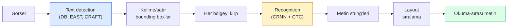

# OCR & Doküman Anlama

> OCR üç-aşamalı bir pipeline'dır — metin kutularını tespit et, karakterleri tanı, sonra layout'larını yap. Her modern OCR sistemi bu aşamaları yeniden sıralar ya da birleştirir.

**Tür:** Öğrenim + Kullan
**Diller:** Python
**Ön koşullar:** Faz 4 Ders 06 (Detection), Faz 7 Ders 02 (Self-Attention)
**Süre:** ~45 dakika

## Öğrenme Hedefleri

- Klasik OCR pipeline'ını (detect -> recognise -> layout) ve modern uçtan uca alternatifleri (Donut, Qwen-VL-OCR) izle
- Sequence-to-sequence OCR eğitimi için CTC (Connectionist Temporal Classification) loss uygula
- Üretim doküman parsing için eğitim olmadan PaddleOCR ya da EasyOCR kullan
- OCR, layout parsing ve doküman anlamayı ayır — ve görev başına doğru aracı seç

## Sorun

Metinle dolu görseller her yerde: fişler, faturalar, kimlikler, taranmış kitaplar, formlar, beyaz tahtalar, tabelalar, ekran görüntüleri. Bunlardan yapılandırılmış veri çıkarmak — yalnızca karakterleri değil, "bu toplam tutar" — en yüksek-değerli uygulamalı görü problemlerinden biridir.

Alan üç beceri katmanına ayrılır:

1. **Düzgün OCR**: pikselleri metne çevir.
2. **Layout parsing**: OCR çıktısını bölgelere (başlık, gövde, tablo, header) grupla.
3. **Doküman anlama**: layout'tan yapılandırılmış alanları ("invoice_total = $42.50") çıkar.

Her katmanın klasik ve modern yaklaşımları vardır ve "bir görselden metin istiyorum" ile "bu fişten toplam tutar lazım" arasındaki boşluk çoğu ekibin farkına vardığından daha büyüktür.

## Kavram

### Klasik pipeline



- **Text detection** satır başına ya da kelime başına dörtgenler üretir.
- **Recognition** her bölgeyi sabit bir yüksekliğe kırpar, bir karakter dizisi üretmek için bir CNN + BiLSTM + CTC çalıştırır.
- **Layout** okuma sırasını yeniden inşa eder (Latin için yukarıdan aşağı, soldan sağa; Arapça, Japonca için farklı).

### Tek paragrafta CTC

OCR tanıma sabit-uzunlukta bir feature map'ten değişken-uzunlukta bir dizi üretir. CTC (Graves et al., 2006) bunu karakter-düzeyi hizalama olmadan eğitmene izin verir. Model her zaman adımında (vocab + blank) üzerinde bir dağılım üretir; CTC loss, tekrarları birleştirip blank'leri kaldırdıktan sonra hedef metne indirgeyen tüm hizalamalar üzerinde marjinalleştirir.

```
ham çıktı: "h h h _ _ e e l l _ l l o _ _"
tekrarları birleştir ve blank'leri kaldır: "hello"
```

CTC, CRNN'in 2015'te çalışmasının ve 2026'da hâlâ çoğu üretim OCR modelini eğitmesinin nedenidir.

### Modern uçtan uca modeller

- **Donut** (Kim et al., 2022) — bir ViT encoder + bir text decoder; bir görsel okur ve doğrudan JSON yayar. Text detector yok, layout modülü yok.
- **TrOCR** — satır düzeyi OCR için ViT + transformer decoder.
- **Qwen-VL-OCR / InternVL** — OCR görevleri için fine-tune edilmiş tam vision-language modelleri; karmaşık dokümanlarda 2026'da en iyi doğruluk.
- **PaddleOCR** — olgun bir üretim paketinde klasik DB + CRNN pipeline'ı; hâlâ open-source beygir.

Uçtan uca modeller daha fazla veri ve compute gerektirir ama multi-stage pipeline'ların hata birikimini atlar.

### Layout parsing

Yapılandırılmış dokümanlar için bir layout detector (LayoutLMv3, DocLayNet) çalıştır; her bölgeyi etiketler: Başlık, Paragraf, Figür, Tablo, Footnote. Okuma sırası sonra "layout sırasında bölgeler arasında iterate et, birleştir" olur.

Formlar için **Key-Value extraction** modelleri kullan (görsel-zengin dokümanlar için Donut, düz taramalar için LayoutLMv3). Görsel + tespit edilen metin + konumları alır ve yapılandırılmış anahtar-değer çiftleri tahmin ederler.

### Değerlendirme metrikleri

- **Character Error Rate (CER)** — Levenshtein mesafe / referansın uzunluğu. Daha düşük daha iyi. Üretim hedefi: temiz taramalarda < %2.
- **Word Error Rate (WER)** — kelime düzeyinde aynı.
- **Yapılandırılmış alanlarda F1** — anahtar-değer görevleri için; `{invoice_total: 42.50}`'nin doğru göründüğünü ölçer.
- **JSON üzerinde edit mesafesi** — uçtan uca doküman parsing için; Donut makalesi normalize tree edit distance'ı tanıttı.

## İnşa Et

### Adım 1: CTC loss + greedy decoder

```python
import torch
import torch.nn as nn
import torch.nn.functional as F


def ctc_loss(log_probs, targets, input_lengths, target_lengths, blank=0):
    """
    log_probs:      (T, N, C) vocab üzerinde log-softmax, index 0'da blank dahil
    targets:        (N, S) int hedefler (blank yok)
    input_lengths:  (N,) örnek başına kullanılan zaman adımları
    target_lengths: (N,) örnek başına hedef uzunluğu
    """
    return F.ctc_loss(log_probs, targets, input_lengths, target_lengths,
                      blank=blank, reduction="mean", zero_infinity=True)


def greedy_ctc_decode(log_probs, blank=0):
    """
    log_probs: (T, N, C) log-softmax
    returns: index dizilerinin listesi (blank'ler kaldırılmış, tekrarlar birleştirilmiş)
    """
    preds = log_probs.argmax(dim=-1).transpose(0, 1).cpu().tolist()
    out = []
    for seq in preds:
        decoded = []
        prev = None
        for idx in seq:
            if idx != prev and idx != blank:
                decoded.append(idx)
            prev = idx
        out.append(decoded)
    return out
```

`F.ctc_loss` mevcut olduğunda verimli CuDNN implementasyonunu kullanır. Greedy decoder beam search'ten daha basittir ve genellikle CER'in %1'i içindedir.

### Adım 2: Ufak CRNN tanıyıcı

Satır OCR için minimal CNN + BiLSTM.

```python
class TinyCRNN(nn.Module):
    def __init__(self, vocab_size=40, hidden=128, feat=32):
        super().__init__()
        self.cnn = nn.Sequential(
            nn.Conv2d(1, feat, 3, 1, 1), nn.BatchNorm2d(feat), nn.ReLU(inplace=True),
            nn.MaxPool2d(2),
            nn.Conv2d(feat, feat * 2, 3, 1, 1), nn.BatchNorm2d(feat * 2), nn.ReLU(inplace=True),
            nn.MaxPool2d(2),
            nn.Conv2d(feat * 2, feat * 4, 3, 1, 1), nn.BatchNorm2d(feat * 4), nn.ReLU(inplace=True),
            nn.MaxPool2d((2, 1)),
            nn.Conv2d(feat * 4, feat * 4, 3, 1, 1), nn.BatchNorm2d(feat * 4), nn.ReLU(inplace=True),
            nn.MaxPool2d((2, 1)),
        )
        self.rnn = nn.LSTM(feat * 4, hidden, bidirectional=True, batch_first=True)
        self.head = nn.Linear(hidden * 2, vocab_size)

    def forward(self, x):
        # x: (N, 1, H, W)
        f = self.cnn(x)                # (N, C, H', W')
        f = f.mean(dim=2).transpose(1, 2)  # (N, W', C)
        h, _ = self.rnn(f)
        return F.log_softmax(self.head(h).transpose(0, 1), dim=-1)  # (W', N, vocab)
```

Sabit-yükseklik girdi (CNN yüksekliği 1'e max-pool eder). Genişlik CTC için zaman boyutudur.

### Adım 3: Sentetik OCR

Uçtan uca smoke test için beyaz üzerine siyah rakam dizileri üret.

```python
import numpy as np

def synthetic_line(text, height=32, char_width=16):
    W = char_width * len(text)
    img = np.ones((height, W), dtype=np.float32)
    for i, c in enumerate(text):
        x = i * char_width
        shade = 0.0 if c.isalnum() else 0.5
        img[6:height - 6, x + 2:x + char_width - 2] = shade
    return img


def build_batch(strings, vocab):
    H = 32
    W = 16 * max(len(s) for s in strings)
    imgs = np.ones((len(strings), 1, H, W), dtype=np.float32)
    target_lengths = []
    targets = []
    for i, s in enumerate(strings):
        imgs[i, 0, :, :16 * len(s)] = synthetic_line(s)
        ids = [vocab.index(c) for c in s]
        targets.extend(ids)
        target_lengths.append(len(ids))
    return torch.from_numpy(imgs), torch.tensor(targets), torch.tensor(target_lengths)


vocab = ["_"] + list("0123456789abcdefghijklmnopqrstuvwxyz")
imgs, targets, lengths = build_batch(["hello", "world"], vocab)
print(f"images: {imgs.shape}   targets: {targets.shape}   lengths: {lengths.tolist()}")
```

Gerçek bir OCR dataset'i font'lar, gürültü, rotasyon, blur ve renk ekler. Yukarıdaki pipeline özdeştir.

### Adım 4: Eğitim taslağı

```python
model = TinyCRNN(vocab_size=len(vocab))
opt = torch.optim.Adam(model.parameters(), lr=1e-3)

for step in range(200):
    strings = ["abc" + str(step % 10)] * 4 + ["xyz" + str((step + 1) % 10)] * 4
    imgs, targets, target_lens = build_batch(strings, vocab)
    log_probs = model(imgs)  # (W', 8, vocab)
    input_lens = torch.full((8,), log_probs.size(0), dtype=torch.long)
    loss = ctc_loss(log_probs, targets, input_lens, target_lens, blank=0)
    opt.zero_grad(); loss.backward(); opt.step()
```

Loss bu trivial sentetik veride 200 adımda ~3'ten ~0.2'ye düşmeli.

## Kullan

Üç üretim yolu:

- **PaddleOCR** — olgun, hızlı, çok dilli. Tek-satır kullanım: `paddleocr.PaddleOCR(lang="en").ocr(image_path)`.
- **EasyOCR** — Python-native, çok dilli, PyTorch backbone.
- **Tesseract** — klasik; modellerin zorlandığı eski taranmış dokümanlar için hâlâ faydalı.

Uçtan uca doküman parsing için Donut ya da bir VLM kullan:

```python
from transformers import DonutProcessor, VisionEncoderDecoderModel

processor = DonutProcessor.from_pretrained("naver-clova-ix/donut-base-finetuned-cord-v2")
model = VisionEncoderDecoderModel.from_pretrained("naver-clova-ix/donut-base-finetuned-cord-v2")
```

Tekrarlanabilir yapısı olan fişler, faturalar ve formlar için Donut'u fine-tune et. Keyfi dokümanlar ya da muhakemeli OCR için Qwen-VL-OCR gibi bir VLM mevcut varsayılandır.

## Yayınla

Bu ders şunları üretir:

- `outputs/prompt-ocr-stack-picker.md` — doküman türü, dil ve yapı verildiğinde Tesseract / PaddleOCR / Donut / VLM-OCR seçen bir prompt.
- `outputs/skill-ctc-decoder.md` — sıfırdan greedy ve beam-search CTC decoder'ları yazan, uzunluk normalizasyonu dahil bir skill.

## Alıştırmalar

1. **(Kolay)** TinyCRNN'i 5-basamaklı rastgele sayısal string'lerde 500 adım eğit. Held-out bir sette CER raporla.
2. **(Orta)** Greedy decoding'i beam search (beam_width=5) ile değiştir. CER delta raporla. Beam search hangi girdilerde kazanır?
3. **(Zor)** 20 fiş üzerinde PaddleOCR kullan, satır öğeleri çıkar ve {item_name, price} çiftleri için elle-etiketli ground truth'a karşı F1 hesapla.

## Anahtar Terimler

| Terim | İnsanlar ne diyor | Gerçekte ne anlama geliyor |
|------|----------------|----------------------|
| OCR | "Piksellerden metin" | Görsel bölgelerini karakter dizilerine çevirme |
| CTC | "Hizalama-free loss" | Zaman adımı başına etiket olmadan bir dizi modelini eğiten loss; hizalamalar üzerinde marjinalleştirir |
| CRNN | "Klasik OCR modeli" | Conv feature extractor + BiLSTM + CTC; üretimde hâlâ kullanılan 2015 baseline |
| Donut | "Uçtan uca OCR" | ViT encoder + text decoder; doğrudan görselden JSON yayar |
| Layout parsing | "Bölgeleri bul" | Bir dokümanda Başlık/Tablo/Figür/Paragraf bölgelerini tespit et ve etiketle |
| Reading order | "Metin dizisi" | Tanınan bölgelerin bir cümleye sıralanması; Latin için trivial, karışık layout'lar için non-trivial |
| CER / WER | "Hata oranları" | Karakter ya da kelime ayrıntısında Levenshtein mesafe / referans uzunluğu |
| VLM-OCR | "Okuyan LLM" | OCR görevleri için eğitilmiş ya da prompt'lanmış bir vision-language modeli; karmaşık dokümanlarda mevcut SOTA |

## İleri Okuma

- [CRNN (Shi et al., 2015)](https://arxiv.org/abs/1507.05717) — orijinal CNN+RNN+CTC mimarisi
- [CTC (Graves et al., 2006)](https://www.cs.toronto.edu/~graves/icml_2006.pdf) — orijinal CTC makalesi; algoritmik fikirlerle yoğun şekilde paketli
- [Donut (Kim et al., 2022)](https://arxiv.org/abs/2111.15664) — OCR-free doküman anlama transformer
- [PaddleOCR](https://github.com/PaddlePaddle/PaddleOCR) — open-source üretim OCR stack'i
