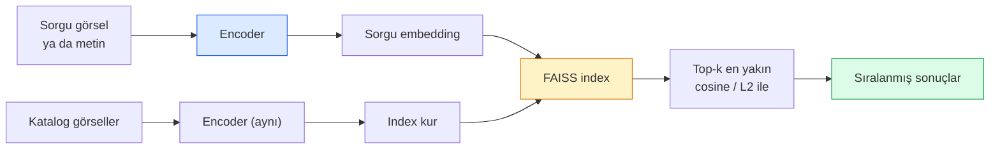

# Image Retrieval & Metric Learning

> Bir retrieval sistemi adayları embedding space'inde bir mesafeye göre sıralar. Metric learning, o uzayı mesafelerin istediğin anlamı taşıyacak şekilde şekillendirme disiplinidir.

**Tür:** Yapım
**Diller:** Python
**Ön koşullar:** Faz 4 Ders 14 (ViT), Faz 4 Ders 18 (CLIP)
**Süre:** ~45 dakika

## Öğrenme Hedefleri

- Triplet, contrastive ve proxy-tabanlı metric learning loss'larını açıkla ve verili bir dataset için doğru olanı seç
- L2-normalisation ve cosine similarity'i doğru uygula ve "aynı item" ile "aynı sınıf" retrieval arasındaki farkı denetle
- Bir FAISS index'i kur, onu metin ve görselle sorgula ve held-out bir sorgu seti için recall@K raporla
- DINOv2, CLIP ve SigLIP'i kutudan çıkar çıkmaz embedding backbone'ları olarak kullan ve her birinin ne zaman kazandığını bil

## Sorun

Retrieval üretim görüsünde her yerdedir: duplicate detection, reverse image search, görsel arama ("benzer ürünleri bul"), yüz re-identification, gözetim için kişi re-ID, e-ticaret için instance-düzeyi eşleme. Ürün sorusu her zaman aynıdır: "bu sorgu görseli verildiğinde katalogumu sırala."

İki tasarım kararı tüm sistemi şekillendirir. Embedding — hangi modelin vektörleri ürettiği. Index — ölçekte en yakın komşular nasıl bulunur. İkisi de 2026'da metalaştı (embedding için DINOv2, index için FAISS), bu da çıtayı yükseltir: zor olan kısım uygulamanız için *neyin benzer sayılacağını tanımlamak*, sonra mesafeler eşleşsin diye embedding space'i şekillendirmektir.

O şekillendirme metric learning'dir. Küçük ama yüksek-kaldıraçlı bir disiplindir.

## Kavram

### Bir bakışta retrieval



### Dört loss ailesi

| Loss | Gerektirir | Artıları | Eksileri |
|------|----------|------|------|
| **Contrastive** | (anchor, positive) + negatives | Basit, herhangi bir çift etiketiyle çalışır | Birçok negative olmadan yavaş yakınsama |
| **Triplet** | (anchor, positive, negative) | Sezgisel; doğrudan margin kontrolü | Hard-triplet mining pahalı |
| **NT-Xent / InfoNCE** | Çiftler + batch-mining negatives | Büyük batch'lere ölçeklenir | Büyük batch ya da momentum kuyruğu gerektirir |
| **Proxy-tabanlı (ProxyNCA)** | Yalnızca sınıf etiketleri | Hızlı, kararlı, mining yok | Küçük dataset'lerde proxy'lere overfit olabilir |

Çoğu üretim kullanım durumu için pretrained bir backbone ile başla ve kutudan çıkar çıkmaz embedding'ler test setinde düşük performans gösterirse yalnızca bir metric-learning fine-tune'u ekle.

### Formal olarak triplet loss

```
L = max(0, ||f(a) - f(p)||^2 - ||f(a) - f(n)||^2 + margin)
```

Anchor `a`'yı positive `p`'ye yakın çek, negative `n`'den uzaklaştır, bir boşluk sağlayan bir `margin` ile. Üç-görsel yapı herhangi bir benzerlik sıralamasına genelleşir.

Mining önemli: kolay triplet'ler (`n` zaten `a`'dan uzak) sıfır loss katkıda bulunur; yalnızca zor triplet'ler ağa öğretir. Semi-hard mining (`n`, `p`'den uzak ama margin içinde) 2016 FaceNet tarifidir ve hâlâ baskın.

### Cosine similarity vs L2

İki metrik, iki konvansiyon:

- **Cosine**: vektörler arasındaki açı. L2-normalize edilmiş embedding'ler gerektirir.
- **L2**: Öklid mesafesi. Ham ya da normalize embedding'lerde çalışır ama genellikle L2-normalize + kare L2 ile çiftlenir.

Çoğu modern ağ için ikisi eşdeğerdir: `||a|| = ||b|| = 1` olduğunda `||a - b||^2 = 2 - 2 cos(a, b)`. Embedding eğitimine uyan konvansiyonu seç; bunları karıştırmak "en yakın"ın ne anlama geldiğini sessizce değiştirir.

### Recall@K

Standart retrieval metriği:

```
recall@K = top K sonuçta en az bir doğru eşleşme olan sorguların fraksiyonu
```

recall@1, @5, @10'u yan yana raporla. recall@1 0.5'in altındayken recall@10 0.95'in üzerindeyse, embedding space'in doğru yapıya sahip olduğu ama sıralamanın gürültülü olduğu anlamına gelir — daha uzun fine-tune ya da re-ranking adımı dene.

Duplicate detection için precision@K daha önemlidir çünkü her false positive kullanıcı-görünür bir hatadır. Görsel arama için recall@K ürün sinyalidir.

### Tek paragrafta FAISS

Facebook AI Similarity Search. En yakın-komşu araması için de-facto kütüphane. Üç index seçimi:

- `IndexFlatIP` / `IndexFlatL2` — brute force, kesin, eğitim yok. ~1M vektöre kadar kullan.
- `IndexIVFFlat` — K hücreye böl, yalnızca en yakın birkaç hücreyi ara. Yaklaşık, hızlı, eğitim verisi gerektirir.
- `IndexHNSW` — graf-tabanlı, çok sayıda sorgu için en hızlı, büyük index boyutu.

100k vektör için muhtemelen cosine similarity'de `IndexFlatIP` istersin. 10M için `IndexIVFFlat` istersin. 100M+ için product quantisation ile birleştirilmiş (`IndexIVFPQ`).

### Instance-düzeyi vs kategori-düzeyi retrieval

Aynı isimle iki çok farklı problem:

- **Kategori-düzeyi** — "kataloğumda kedileri bul." Sınıf-koşullu benzerlik; kutudan çıkar çıkmaz CLIP / DINOv2 embedding'leri iyi çalışır.
- **Instance-düzeyi** — "kataloğumda *bu tam ürünü* bul." Aynı sınıfın görsel olarak benzer nesneleri arasında ince-taneli ayrım gerektirir; kutudan çıkar çıkmaz embedding'ler düşük performans gösterir; metric learning ile fine-tuning önemlidir.

Bir model seçmeden önce her zaman hangisini çözdüğünü sor.

## İnşa Et

### Adım 1: Triplet loss

```python
import torch
import torch.nn.functional as F

def triplet_loss(anchor, positive, negative, margin=0.2):
    d_ap = F.pairwise_distance(anchor, positive, p=2)
    d_an = F.pairwise_distance(anchor, negative, p=2)
    return F.relu(d_ap - d_an + margin).mean()
```

Tek satır. L2-normalize edilmiş ya da ham embedding'lerde çalışır.

### Adım 2: Semi-hard mining

Bir batch embedding ve etiket verildiğinde, her anchor için en zor semi-hard negative'i bul.

```python
def semi_hard_negatives(emb, labels, margin=0.2):
    dist = torch.cdist(emb, emb)
    same_class = labels[:, None] == labels[None, :]
    diff_class = ~same_class
    N = emb.size(0)

    positives = dist.clone()
    positives[~same_class] = float("-inf")
    positives.fill_diagonal_(float("-inf"))
    pos_idx = positives.argmax(dim=1)

    semi_hard = dist.clone()
    semi_hard[same_class] = float("inf")
    d_ap = dist[torch.arange(N), pos_idx].unsqueeze(1)
    semi_hard[dist <= d_ap] = float("inf")
    neg_idx = semi_hard.argmin(dim=1)

    fallback_mask = semi_hard[torch.arange(N), neg_idx] == float("inf")
    if fallback_mask.any():
        hardest = dist.clone()
        hardest[same_class] = float("inf")
        neg_idx = torch.where(fallback_mask, hardest.argmin(dim=1), neg_idx)
    return pos_idx, neg_idx
```

Her anchor sınıf-içi en zor positive'i ve positive'den uzak ama margin içinde semi-hard bir negative alır.

### Adım 3: Recall@K

```python
def recall_at_k(query_emb, gallery_emb, query_labels, gallery_labels, k=1):
    sim = query_emb @ gallery_emb.T
    _, top_k = sim.topk(k, dim=-1)
    matches = (gallery_labels[top_k] == query_labels[:, None]).any(dim=-1)
    return matches.float().mean().item()
```

L2-normalize edilmiş embedding'lerde inner product ile top-k cosine ile top-k'ya eşittir. En az bir doğru komşu olan sorguların ortalama oranını raporla.

### Adım 4: Bir araya getir

```python
import torch
import torch.nn as nn
from torch.optim import Adam

class Encoder(nn.Module):
    def __init__(self, in_dim=128, emb_dim=64):
        super().__init__()
        self.net = nn.Sequential(
            nn.Linear(in_dim, 128), nn.ReLU(),
            nn.Linear(128, emb_dim),
        )

    def forward(self, x):
        return F.normalize(self.net(x), dim=-1)

torch.manual_seed(0)
num_classes = 6
protos = F.normalize(torch.randn(num_classes, 128), dim=-1)

def sample_batch(bs=32):
    labels = torch.randint(0, num_classes, (bs,))
    x = protos[labels] + 0.15 * torch.randn(bs, 128)
    return x, labels

enc = Encoder()
opt = Adam(enc.parameters(), lr=3e-3)

for step in range(200):
    x, y = sample_batch(32)
    emb = enc(x)
    pos_idx, neg_idx = semi_hard_negatives(emb, y)
    loss = triplet_loss(emb, emb[pos_idx], emb[neg_idx])
    opt.zero_grad(); loss.backward(); opt.step()
```

Birkaç yüz adımdan sonra embedding kümeleri sınıf başına bir küme oluşturur.

## Kullan

2026'da üretim stack'leri:

- **DINOv2 + FAISS** — genel amaçlı görsel retrieval. Kutudan çıkar çıkmaz çalışır.
- **CLIP + FAISS** — sorgular metin olduğunda.
- **Fine-tuned DINOv2 + FAISS** — instance-düzeyi retrieval, yüz re-ID, fashion, e-ticaret.
- **Milvus / Weaviate / Qdrant** — FAISS ya da HNSW etrafında yönetilen vector DB sargıları.

SOTA instance retrieval için tarif: DINOv2 backbone, embedding head ekle, instance-etiketli çiftler üzerinde triplet ya da InfoNCE loss ile fine-tune et, FAISS'te index'le.

## Yayınla

Bu ders şunları üretir:

- `outputs/prompt-retrieval-loss-picker.md` — verili bir retrieval problemi için triplet / InfoNCE / ProxyNCA seçen bir prompt.
- `outputs/skill-recall-at-k-runner.md` — train/val/gallery split'leri ve uygun veri kontratıyla recall@K için temiz bir değerlendirme harness'i yazan bir skill.

## Alıştırmalar

1. **(Kolay)** Yukarıdaki toy örneği çalıştır. Altı kümenin oluştuğunu görmek için eğitim öncesi ve sonrası embedding'leri PCA ile çiz.
2. **(Orta)** Bir ProxyNCA loss uygulaması ekle: sınıf başına bir öğrenilmiş "proxy", cosine similarity üzerinde standart cross-entropy. Toy veride triplet loss vs yakınsama hızını karşılaştır.
3. **(Zor)** 1.000 ImageNet validation görseli al, HuggingFace üzerinden DINOv2 ile göm, bir FAISS flat index kur ve aynı görselleri sorgu olarak (1.0 olmalı) ve ImageNet etiketlerini ground truth olarak held-out bir split'e karşı recall@{1, 5, 10} raporla.

## Anahtar Terimler

| Terim | İnsanlar ne diyor | Gerçekte ne anlama geliyor |
|------|----------------|----------------------|
| Metric learning | "Uzayı şekillendir" | Bir encoder'ı çıktı uzayındaki mesafeler hedef bir benzerliği yansıtacak şekilde eğitmek |
| Triplet loss | "Çek ve it" | L = max(0, d(a, p) - d(a, n) + margin); canonical metric-learning loss |
| Semi-hard mining | "Faydalı negative'ler" | Anchor'dan positive'den uzak ama margin içinde negative'ler; ampirik olarak en bilgi verici |
| Proxy-tabanlı loss | "Sınıf prototipleri" | Sınıf başına bir öğrenilmiş proxy; proxy'lere-benzerlik üzerinde cross-entropy; çift mining yok |
| Recall@K | "Top-K isabet oranı" | Top K'da en az bir doğru sonuç olan sorguların fraksiyonu |
| Instance retrieval | "Bu tam şeyi bul" | İnce-taneli eşleme; kutudan çıkar çıkmaz feature'lar genellikle düşük performans gösterir |
| FAISS | "NN kütüphanesi" | Facebook'un en yakın-komşu kütüphanesi; kesin ve yaklaşık index destekler |
| HNSW | "Graf index" | Hierarchical navigable small world; küçük bellek overhead'iyle hızlı yaklaşık NN |

## İleri Okuma

- [FaceNet: A Unified Embedding for Face Recognition (Schroff et al., 2015)](https://arxiv.org/abs/1503.03832) — triplet loss / semi-hard mining makalesi
- [In Defense of the Triplet Loss for Person Re-Identification (Hermans et al., 2017)](https://arxiv.org/abs/1703.07737) — triplet fine-tuning'e pratik rehber
- [FAISS documentation](https://github.com/facebookresearch/faiss/wiki) — her index, her trade-off
- [SMoT: Metric Learning Taxonomy (Kim et al., 2021)](https://arxiv.org/abs/2010.06927) — modern loss'ların ve bağlantılarının taraması
