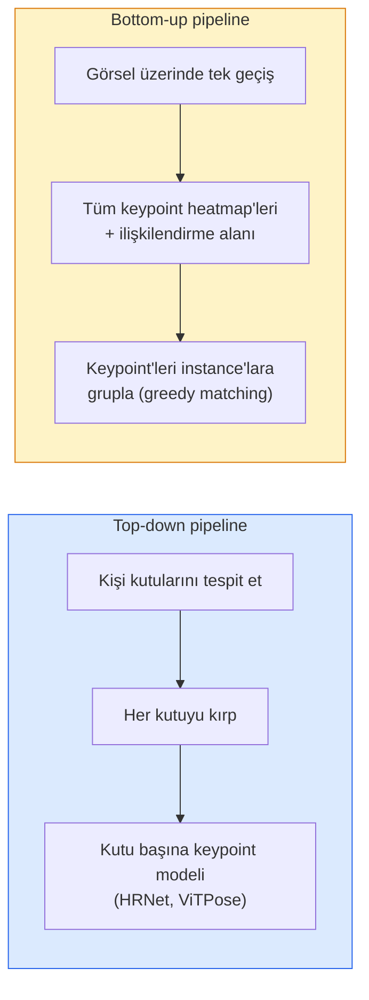

# Keypoint Detection & Poz Tahmini

> Bir poz, sıralı keypoint'ler setidir. Bir keypoint detector bir heatmap regressor'dır. Geri kalan her şey muhasebedir.

**Tür:** Yapım
**Diller:** Python
**Ön koşullar:** Faz 4 Ders 06 (Detection), Faz 4 Ders 07 (U-Net)
**Süre:** ~45 dakika

## Öğrenme Hedefleri

- Top-down ve bottom-up poz tahminini ayır ve her birinin ne zaman kullanıldığını söyle
- Keypoint başına Gaussian hedefiyle K keypoint için heatmap regress et ve çıkarımda keypoint koordinatlarını çıkar
- Part Affinity Fields (PAFs) ve bottom-up pipeline'ların keypoint'leri instance'lara nasıl ilişkilendirdiğini açıkla
- Üretim keypoint tahmini için MediaPipe Pose ya da MMPose kullan ve çıktı formatlarını anla

## Sorun

Keypoint görevleri birçok isim altında gizlenir: insan pozu (17 vücut eklemi), yüz landmark'ları (68 ya da 478 nokta), el (21 nokta), hayvan pozu, robotik nesne pozu, tıbbi anatomi landmark'ları. Her biri aynı yapıyı paylaşır: bir nesnede K ayrık noktayı tespit et ve (x, y) koordinatlarını çıkar.

Poz tahmini motion capture, fitness uygulamaları, spor analitiği, gesture kontrolü, animasyon, AR try-on ve robotik tutmanın temelidir. 2D durumu olgundur; 3D poz (tek bir kameradan world koordinatlarında eklem konumlarını tahmin) mevcut araştırma sınırıdır.

Mühendislik sorusu ölçektir. Tek-görsel, tek-kişi pozu 20ms'lik bir problemdir. 30 fps'de kalabalıkta multi-person poz farklı mimarilerle farklı bir problemdir.

## Kavram

### Top-down vs bottom-up



- **Top-down** — önce insanları tespit et, sonra her crop'ta kişi-başına keypoint modeli çalıştır. En yüksek doğruluk; kişi sayısıyla lineer ölçeklenir.
- **Bottom-up** — tek bir forward pass tüm keypoint'leri artı bir ilişkilendirme alanı tahmin eder; grupla. Kalabalık boyutundan bağımsız sabit zaman.

Top-down (HRNet, ViTPose) doğruluk lideridir; bottom-up (OpenPose, HigherHRNet) kalabalık sahneler için throughput lideridir.

### Heatmap regresyonu

`(x, y)`'yi doğrudan regress etmek yerine, keypoint başına gerçek konumda merkezlenmiş bir Gaussian blob ile bir `H x W` heatmap tahmin et.

```
target[k, y, x] = exp(-((x - cx_k)^2 + (y - cy_k)^2) / (2 sigma^2))
```

Çıkarımda her heatmap'in argmax'i öngörülen keypoint konumudur.

Heatmap'lerin doğrudan regresyondan neden daha iyi çalıştığı: ağın uzaysal yapısı (conv feature map) doğal olarak uzaysal çıktıyla hizalanır. Gaussian hedefler regularize de eder — küçük bir lokalizasyon hatası küçük bir loss üretir, sıfır değil.

### Sub-pixel lokalizasyonu

Argmax tam sayı koordinatlar verir. Sub-pixel hassasiyet için argmax ve komşularına bir parabol fit et, ya da iyi bilinen offset `(dx, dy) = 0.25 * (heatmap[y, x+1] - heatmap[y, x-1], ...)` yönünü kullan.

### Part Affinity Fields (PAFs)

OpenPose'un bottom-up ilişkilendirme hilesi. Her bağlı keypoint çifti (örn. sol omuzdan sol dirseğe) için, birinden diğerine işaret eden birim vektörü encode eden 2-kanallı bir alan tahmin et. Bir omuzu dirseğiyle ilişkilendirmek için PAF'i aday çiftleri bağlayan çizgi boyunca integre et; en yüksek integral'a sahip çift eşlenir.

```
Her bağlantı (uzuv) için:
  PAF kanalları: 2 (birim vektör x, y)
  Çizgi integrali: örnek noktaları üzerinde toplam (PAF . çizgi_yönü)
  Daha yüksek integral = daha güçlü eşleşme
```

Şık ve kişi başına crop olmadan keyfi kalabalık boyutlarına ölçeklenir.

### COCO keypoints

Standart vücut-poz dataset'i: kişi başına 17 keypoint, metrik olarak PCK (Percentage of Correct Keypoints) ve OKS (Object Keypoint Similarity). OKS keypoint'in IoU karşılığıdır ve COCO mAP@OKS'in raporladığı şeydir.

### 2D vs 3D

- **2D poz** — görsel koordinatlar; üretim kalitesinde çözüldü (MediaPipe, HRNet, ViTPose).
- **3D poz** — world / kamera koordinatları; hâlâ aktif araştırma. Yaygın yaklaşımlar:
  - 2D tahminleri küçük bir MLP ile 3D'ye yükselt (VideoPose3D).
  - Görselden doğrudan 3D regresyonu (PyMAF, MHFormer).
  - Ground truth için multi-view kurulumlar (CMU Panoptic).

## İnşa Et

### Adım 1: Gaussian heatmap hedefi

```python
import numpy as np
import torch

def gaussian_heatmap(size, cx, cy, sigma=2.0):
    yy, xx = np.meshgrid(np.arange(size), np.arange(size), indexing="ij")
    return np.exp(-((xx - cx) ** 2 + (yy - cy) ** 2) / (2 * sigma ** 2)).astype(np.float32)

hm = gaussian_heatmap(64, 32, 32, sigma=2.0)
print(f"peak: {hm.max():.3f} ({hm.argmax() % 64}, {hm.argmax() // 64})'te")
```

Keypoint başına heatmap'ler bir kanal ekseninde yığılırsa tam hedef tensor verir.

### Adım 2: Ufak keypoint head'i

K heatmap kanal üreten U-Net tarzı bir model.

```python
import torch.nn as nn
import torch.nn.functional as F

class TinyKeypointNet(nn.Module):
    def __init__(self, num_keypoints=4, base=16):
        super().__init__()
        self.down1 = nn.Sequential(nn.Conv2d(3, base, 3, 2, 1), nn.ReLU(inplace=True))
        self.down2 = nn.Sequential(nn.Conv2d(base, base * 2, 3, 2, 1), nn.ReLU(inplace=True))
        self.mid = nn.Sequential(nn.Conv2d(base * 2, base * 2, 3, 1, 1), nn.ReLU(inplace=True))
        self.up1 = nn.ConvTranspose2d(base * 2, base, 2, 2)
        self.up2 = nn.ConvTranspose2d(base, num_keypoints, 2, 2)

    def forward(self, x):
        h1 = self.down1(x)
        h2 = self.down2(h1)
        h3 = self.mid(h2)
        u1 = self.up1(h3)
        return self.up2(u1)
```

Input `(N, 3, H, W)`, output `(N, K, H, W)`. Loss, Gaussian hedeflerine karşı piksel başına MSE.

### Adım 3: Çıkarım — keypoint koordinatlarını çıkar

```python
def heatmap_to_coords(heatmaps):
    """
    heatmaps: (N, K, H, W)
    returns:  görsel piksellerinde (N, K, 2) float koordinatlar
    """
    N, K, H, W = heatmaps.shape
    hm = heatmaps.reshape(N, K, -1)
    idx = hm.argmax(dim=-1)
    ys = (idx // W).float()
    xs = (idx % W).float()
    return torch.stack([xs, ys], dim=-1)

coords = heatmap_to_coords(torch.randn(2, 4, 32, 32))
print(f"coords: {coords.shape}")  # (2, 4, 2)
```

Çıkarımda tek satır. Sub-pixel rafine için argmax etrafında interpolate et.

### Adım 4: Sentetik keypoint dataset'i

Basit: beyaz bir canvas'a dört nokta çiz ve onları tahmin etmeyi öğren.

```python
def make_synthetic_sample(size=64):
    img = np.ones((3, size, size), dtype=np.float32)
    rng = np.random.default_rng()
    kps = rng.integers(8, size - 8, size=(4, 2))
    for cx, cy in kps:
        img[:, cy - 2:cy + 2, cx - 2:cx + 2] = 0.0
    hms = np.stack([gaussian_heatmap(size, cx, cy) for cx, cy in kps])
    return img, hms, kps
```

Ufak bir modelin bir dakikada öğrenmesi için yeterince kolay.

### Adım 5: Eğitim

```python
model = TinyKeypointNet(num_keypoints=4)
opt = torch.optim.Adam(model.parameters(), lr=3e-3)

for step in range(200):
    batch = [make_synthetic_sample() for _ in range(16)]
    imgs = torch.from_numpy(np.stack([b[0] for b in batch]))
    hms = torch.from_numpy(np.stack([b[1] for b in batch]))
    pred = model(imgs)
    # pred'i tam çözünürlüğe upsample et
    pred = F.interpolate(pred, size=hms.shape[-2:], mode="bilinear", align_corners=False)
    loss = F.mse_loss(pred, hms)
    opt.zero_grad(); loss.backward(); opt.step()
```

## Kullan

- **MediaPipe Pose** — Google'ın üretim pose estimator'ı; sub-10ms latency ile WebGL + mobile runtime'lar taşır.
- **MMPose** (OpenMMLab) — kapsamlı araştırma codebase'i; pretrained ağırlıklarla her SOTA mimari.
- **YOLOv8-pose** — tek forward pass'le en hızlı gerçek zamanlı multi-person poz.
- **transformers HumanDPT / PoseAnything** — open-vocabulary poz için yeni vision-language yaklaşımları (herhangi bir nesne, herhangi bir keypoint seti).

## Yayınla

Bu ders şunları üretir:

- `outputs/prompt-pose-stack-picker.md` — latency, kalabalık boyutu ve 2D vs 3D ihtiyacına göre MediaPipe / YOLOv8-pose / HRNet / ViTPose seçen bir prompt.
- `outputs/skill-heatmap-to-coords.md` — her üretim poz modelinin kullandığı sub-pixel heatmap-to-coordinate rutinini yazan bir skill.

## Alıştırmalar

1. **(Kolay)** Sentetik 4-noktalı dataset'te ufak keypoint modelini eğit. 200 adımdan sonra öngörülen ve gerçek keypoint'ler arasında ortalama L2 hatasını raporla.
2. **(Orta)** Sub-pixel rafine ekle: argmax konumu verildiğinde, komşu piksellerden x ve y boyunca 1D parabol fit et. Tam sayı argmax'a karşı doğruluk kazancını raporla.
3. **(Zor)** Her görselin 4-keypoint kalıbının iki instance'ını gösterdiği 2-kişi sentetik dataset'i kur. Hangi keypoint'in hangi instance'a ait olduğunu tahmin eden PAF'larla bottom-up pipeline eğit ve OKS değerlendir.

## Anahtar Terimler

| Terim | İnsanlar ne diyor | Gerçekte ne anlama geliyor |
|------|----------------|----------------------|
| Keypoint | "Landmark" | Bir nesnede spesifik sıralı bir nokta (eklem, köşe, feature) |
| Poz | "İskelet" | Bir instance'a ait sıralı keypoint seti |
| Top-down | "Önce tespit sonra poz" | İki aşamalı pipeline: kişi detector + crop başına keypoint modeli; en yüksek doğruluk |
| Bottom-up | "Önce poz, sonra grupla" | Tek geçişli tüm-keypoint tahmini + gruplama; kalabalık boyutunda sabit zaman |
| Heatmap | "Gaussian hedefi" | Keypoint başına gerçek konumda peak'i olan H x W tensor; tercih edilen regresyon hedefi |
| PAF | "Part Affinity Field" | Uzuv yönlerini encode eden 2-kanallı birim vektör alanı; keypoint'leri instance'lara gruplamak için kullanılır |
| OKS | "Keypoint IoU" | Object Keypoint Similarity; poz için COCO metriği |
| HRNet | "High-Resolution Net" | Baskın top-down keypoint mimarisi; tüm süreçte yüksek-çözünürlüklü feature'ları korur |

## İleri Okuma

- [OpenPose (Cao et al., 2017)](https://arxiv.org/abs/1812.08008) — PAF'larla bottom-up; yaklaşımın hâlâ en iyi yazısı
- [HRNet (Sun et al., 2019)](https://arxiv.org/abs/1902.09212) — top-down referans mimarisi
- [ViTPose (Xu et al., 2022)](https://arxiv.org/abs/2204.12484) — poz backbone'u olarak düz ViT; birçok benchmark'ta mevcut SOTA
- [MediaPipe Pose](https://developers.google.com/mediapipe/solutions/vision/pose_landmarker) — üretim gerçek zamanlı poz; 2026'da en hızlı deploy edilmiş stack
