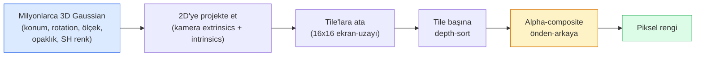

# Sıfırdan 3D Gaussian Splatting

> Bir sahne, milyonlarca 3D Gaussian'dan oluşan bir buluttur. Her birinin bir konumu, oryantasyonu, ölçeği, opaklığı ve görüş yönüne bağlı bir rengi vardır. Onları rasterize et, rasterization üzerinden backprop yap, hazır.

**Tür:** Yapım
**Diller:** Python
**Ön koşullar:** Faz 4 Ders 13 (3D Vision & NeRF), Faz 1 Ders 12 (Tensor İşlemleri), Faz 4 Ders 10 (opsiyonel Diffusion temelleri)
**Süre:** ~90 dakika

## Öğrenme Hedefleri

- 3D Gaussian Splatting'in 2026'da fotorealistik 3D rekonstrüksiyon için NeRF'in yerini neden üretim varsayılanı olarak aldığını açıkla
- Altı Gaussian-başına parametreyi (konum, rotation quaternion, ölçek, opaklık, spherical harmonics renk, opsiyonel feature) ve her birinin kaç float katkıda bulunduğunu söyle
- `alpha` compositing kullanarak sıfırdan bir 2D Gaussian splatting rasterizer uygula, sonra 3D durumun aynı döngüye nasıl projekte olduğunu göster
- 20-50 fotoğraftan bir sahneyi rekonstrükte etmek için `nerfstudio`, `gsplat` ya da `SuperSplat` kullan ve `KHR_gaussian_splatting` glTF eklentisine ya da OpenUSD 26.03 `UsdVolParticleField3DGaussianSplat` schema'sına export et

## Sorun

Bir NeRF, sahneyi bir MLP'nin ağırlıkları olarak saklar. Render edilen her piksel bir ray boyunca yüzlerce MLP sorgusudur. Eğitim saatler alır, render saniyeler alır ve ağırlıklar düzenlenemez — bir sahne içinde bir sandalye taşımak istersen yeniden eğitmek zorundasın.

3D Gaussian Splatting (Kerbl, Kopanas, Leimkühler, Drettakis, SIGGRAPH 2023) tüm bunların yerini aldı. Bir sahne explicit bir 3D Gaussian setidir. Render etmek 100+ fps'de GPU rasterization'dır. Eğitim dakikalar alır. Düzenleme doğrudandır: bir Gaussian alt kümesini translate et ve sandalyeyi taşımış olursun. 2026'ya gelindiğinde Khronos Group, Gaussian splat'lar için bir glTF eklentisini onayladı, OpenUSD 26.03 bir Gaussian splat schema'sı taşıyor, Zillow ve Apartments.com onlarla emlak render ediyor ve 3D rekonstrüksiyon üzerine yeni araştırma makalelerinin çoğu çekirdek 3DGS fikrinin varyantları.

Mental model basit, matematiğin yeterli hareketli parçası var ki çoğu giriş rasterization'da başlar ve projeksiyonları ile spherical harmonics'i geçer. Bu ders tüm şeyi inşa eder — önce bir 2D versiyon, sonra 3D uzantı.

## Kavram

### Bir Gaussian'ın taşıdığı şey

Bir 3D Gaussian uzayda şu özelliklere sahip parametrik bir blob'dur:

```
konum            mu         (3,)    world koordinatlarında merkez
rotation         q          (4,)    oryantasyonu encode eden birim quaternion
ölçek            s          (3,)    eksen başına log-ölçek (render zamanında üstellenir)
opaklık          alpha      (1,)    post-sigmoid opaklık [0, 1]
SH katsayıları   c_lm       (3 * (L+1)^2,)   görüş-bağımlı renk
```

Rotation + ölçek 3x3 bir kovaryans inşa eder: `Sigma = R S S^T R^T`. Bu 3D'deki Gaussian'ın şeklidir. Spherical harmonics, görüş başına doku saklamadan renk görüş yönüyle değişir — specular highlight'lar, ince parlaklık, görüş-bağımlı parlama. SH degree 3 ile renk kanalı başına 16 katsayı alırsın, yalnız renk için Gaussian başına 48 float.

Bir sahne tipik olarak 1-5 milyon Gaussian'a sahiptir. Her biri kabaca 60 float saklar (3 + 4 + 3 + 1 + 48 + diğer). Bu beş milyon Gaussian'lı bir sahne için 240 MB'dir — nokta başına dokuya sahip eşdeğer point cloud'dan çok daha küçük ve yüksek çözünürlükte yeniden render edilen bir NeRF MLP ağırlıklarından bir büyüklük mertebesi daha küçük.

### Rasterization, ray marching değil



Beş adım, hepsi GPU dostu. Piksel başına MLP sorgusu yok. Tek bir RTX 3080 Ti 6 milyon splat'ı 147 fps'de render eder.

### Projeksiyon adımı

World konumu `mu` ve 3D kovaryansı `Sigma` olan 3D Gaussian, ekran konumu `mu'` ve 2D kovaryansı `Sigma'` olan bir 2D Gaussian'a projekte olur:

```
mu' = project(mu)
Sigma' = J W Sigma W^T J^T          (2 x 2)

W = görüş dönüşümü (kameranın rotation + translation'ı)
J = mu'da perspective projeksiyonun Jacobian'ı
```

2D Gaussian'ın footprint'i, eksenleri `Sigma'`'ın eigenvector'leri olan bir elipstir. O elipsin içindeki her piksel, Gaussian'ın katkısını `exp(-0.5 * (p - mu')^T Sigma'^-1 (p - mu'))` ile ağırlıklandırılmış olarak alır.

### Alpha-compositing kuralı

Bir piksel için, onu kaplayan Gaussian'lar arkadan-öne (ya da eşdeğer olarak ters formülle önden-arkaya) sıralanır. Renk, 1980'lerden beri her yarı-saydam rasterizer ile aynı denklemle composite edilir:

```
C_pixel = sum_i alpha_i * T_i * c_i

T_i = prod_{j < i} (1 - alpha_j)       i'ye kadar transmittance
alpha_i = opacity_i * exp(-0.5 * d^T Sigma'^-1 d)   yerel katkı
c_i = eval_SH(SH_i, view_direction)    görüş-bağımlı renk
```

Bu, **NeRF'in volumetric render'ı ile aynı denklem**, sadece bir ray boyunca yoğun örnekler yerine explicit seyrek bir Gaussian seti üzerinde. O özdeşlik render edilen kalitenin neden NeRF ile eşleştiğinin nedeni — ikisi de aynı radiance-field denklemini integre ediyor.

### Bunun neden differentiable olduğu

Her adım — projeksiyon, tile ataması, alpha compositing, SH değerlendirmesi — Gaussian parametrelerine göre differentiable'dır. Ground-truth bir görsel verildiğinde, render edilen piksel loss'unu hesapla, rasterizer üzerinden backprop yap, gradient descent ile tüm `(mu, q, s, alpha, c_lm)`'yi güncelle. ~30.000 iterasyon boyunca Gaussian'lar doğru konumlarını, ölçeklerini ve renklerini bulur.

### Densification ve pruning

Sabit bir Gaussian seti karmaşık bir sahneyi kaplayamaz. Eğitim iki adaptif mekanizma içerir:

- Gradient büyüklüğü yüksek ama ölçeği küçük olduğunda mevcut konumundaki bir Gaussian'ı **clone**'la — yeniden inşanın burada daha fazla detaya ihtiyacı var.
- Gradient'i yüksek olduğunda büyük-ölçekli bir Gaussian'ı iki küçük olana **split** et — bir büyük Gaussian bölgeye fit etmek için çok pürüzsüz.
- Opaklığı eşiğin altına düşen Gaussian'ları **prune** et — katkıda bulunmuyorlar.

Densification her N iterasyonda çalışır. Bir sahne tipik olarak ~100k başlangıç Gaussian'dan (SfM noktalarından seed'li) eğitim sonunda 1-5M'a büyür.

### Tek paragrafta spherical harmonics

Görüş-bağımlı renk, birim küre üzerinde bir `c(direction)` fonksiyonudur. Spherical harmonics kürenin Fourier base'idir. Degree `L`'de kes ve kanal başına `(L+1)^2` base fonksiyon alırsın. Yeni bir görüş için rengi değerlendirmek, öğrenilmiş SH katsayıları ile görüş yönünde değerlendirilen base arasında bir nokta çarpımıdır. Degree 0 = bir katsayı = sabit renk. Degree 3 = 16 katsayı = Lambertian shading, specular ve hafif yansımayı yakalamak için yeterli. SD Gaussian Splatting makaleleri varsayılan olarak degree 3 kullanır.

### 2026 üretim stack'i

```
1. Capture         akıllı telefon / DJI drone / handheld tarayıcı
2. SfM / MVS       COLMAP ya da GLOMAP kamera pozları + seyrek nokta türetir
3. 3DGS eğit       nerfstudio / gsplat / inria official / PostShot (RTX 4090'da ~10-30 dak)
4. Düzenle         SuperSplat / SplatForge (floater'ları temizle, segmente et)
5. Export          .ply -> glTF KHR_gaussian_splatting ya da .usd (OpenUSD 26.03)
6. Görüntüle       Cesium / Unreal / Babylon.js / Three.js / Vision Pro
```

### 4D ve generative varyantlar

- **4D Gaussian Splatting** — Gaussian'lar zamanın fonksiyonlarıdır; volumetric video için kullanılır (Superman 2026, A$AP Rocky'nin "Helicopter").
- **Generative splat'lar** — tam sahneler halüsinasyon yapan text-to-splat modelleri (World Labs'ın Marble'ı).
- **3D Gaussian Unscented Transform** — otonom sürüş simülasyonu için NVIDIA NuRec'in varyantı.

## İnşa Et

### Adım 1: 2D Gaussian

Önce bir 2D rasterizer kurarız. 3D durum projeksiyon sonrası ona indirgenir.

```python
import torch
import torch.nn as nn
import torch.nn.functional as F


def eval_2d_gaussian(means, covs, points):
    """
    means:  (G, 2)      merkezler
    covs:   (G, 2, 2)   kovaryans matrisleri
    points: (H, W, 2)   piksel koordinatları
    returns: (G, H, W)  her Gaussian için her piksel başına yoğunluk
    """
    G = means.size(0)
    H, W, _ = points.shape
    flat = points.view(-1, 2)
    inv = torch.linalg.inv(covs)
    diff = flat[None, :, :] - means[:, None, :]
    d = torch.einsum("gpi,gij,gpj->gp", diff, inv, diff)
    density = torch.exp(-0.5 * d)
    return density.view(G, H, W)
```

`einsum`, her (Gaussian, piksel) çifti için `diff^T Sigma^-1 diff` quadratic form'unu yapar.

### Adım 2: 2D splatting rasterizer

Önden-arkaya alpha-compositing. 2D'de depth anlamsızdır, dolayısıyla sıralama için Gaussian başına öğrenilmiş bir skaler kullanırız.

```python
def rasterise_2d(means, covs, colours, opacities, depths, image_size):
    """
    means:     (G, 2)
    covs:      (G, 2, 2)
    colours:   (G, 3)
    opacities: (G,)     [0, 1]'de
    depths:    (G,)     sıralama için kullanılan Gaussian başına skaler
    image_size: (H, W)
    returns:   (H, W, 3) render edilmiş görsel
    """
    H, W = image_size
    yy, xx = torch.meshgrid(
        torch.arange(H, dtype=torch.float32, device=means.device),
        torch.arange(W, dtype=torch.float32, device=means.device),
        indexing="ij",
    )
    points = torch.stack([xx, yy], dim=-1)

    densities = eval_2d_gaussian(means, covs, points)
    alphas = opacities[:, None, None] * densities
    alphas = alphas.clamp(0.0, 0.99)

    order = torch.argsort(depths)
    alphas = alphas[order]
    colours_sorted = colours[order]

    T = torch.ones(H, W, device=means.device)
    out = torch.zeros(H, W, 3, device=means.device)
    for i in range(means.size(0)):
        a = alphas[i]
        out += (T * a)[..., None] * colours_sorted[i][None, None, :]
        T = T * (1.0 - a)
    return out
```

Hızlı değil — gerçek bir implementasyon tile-tabanlı CUDA kernel'ları kullanır — ama tam doğru matematik ve tamamen differentiable.

### Adım 3: Eğitilebilir bir 2D splat sahnesi

```python
class Splats2D(nn.Module):
    def __init__(self, num_splats=128, image_size=64, seed=0):
        super().__init__()
        g = torch.Generator().manual_seed(seed)
        H, W = image_size, image_size
        self.means = nn.Parameter(torch.rand(num_splats, 2, generator=g) * torch.tensor([W, H]))
        self.log_scale = nn.Parameter(torch.ones(num_splats, 2) * math.log(2.0))
        self.rot = nn.Parameter(torch.zeros(num_splats))  # 2D'de tek açı
        self.colour_logits = nn.Parameter(torch.randn(num_splats, 3, generator=g) * 0.5)
        self.opacity_logit = nn.Parameter(torch.zeros(num_splats))
        self.depth = nn.Parameter(torch.rand(num_splats, generator=g))

    def covs(self):
        s = torch.exp(self.log_scale)
        c, si = torch.cos(self.rot), torch.sin(self.rot)
        R = torch.stack([
            torch.stack([c, -si], dim=-1),
            torch.stack([si, c], dim=-1),
        ], dim=-2)
        S = torch.diag_embed(s ** 2)
        return R @ S @ R.transpose(-1, -2)

    def forward(self, image_size):
        covs = self.covs()
        colours = torch.sigmoid(self.colour_logits)
        opacities = torch.sigmoid(self.opacity_logit)
        return rasterise_2d(self.means, covs, colours, opacities, self.depth, image_size)
```

`log_scale`, `opacity_logit` ve `colour_logits` hepsi render zamanında doğru aktivasyon üzerinden eşlenen kısıtlanmamış parametrelerdir. Bu her 3DGS implementasyonu için standart kalıptır.

### Adım 4: 2D Gaussian'ları hedef görsele fit et

```python
import math
import numpy as np

def make_target(size=64):
    yy, xx = np.meshgrid(np.arange(size), np.arange(size), indexing="ij")
    img = np.zeros((size, size, 3), dtype=np.float32)
    # Kırmızı daire
    mask = (xx - 20) ** 2 + (yy - 20) ** 2 < 10 ** 2
    img[mask] = [1.0, 0.2, 0.2]
    # Mavi kare
    mask = (np.abs(xx - 45) < 8) & (np.abs(yy - 40) < 8)
    img[mask] = [0.2, 0.3, 1.0]
    return torch.from_numpy(img)


target = make_target(64)
model = Splats2D(num_splats=64, image_size=64)
opt = torch.optim.Adam(model.parameters(), lr=0.05)

for step in range(200):
    pred = model((64, 64))
    loss = F.mse_loss(pred, target)
    opt.zero_grad(); loss.backward(); opt.step()
    if step % 40 == 0:
        print(f"step {step:3d}  mse {loss.item():.4f}")
```

200 adım boyunca 64 Gaussian iki şekle yerleşir. Tüm fikir bu — explicit geometric primitive'ler üzerinde gradient-descent.

### Adım 5: 2D'den 3D'ye

3D uzantı aynı döngüyü korur. Eklemeler:

1. Gaussian başına rotation tek bir açı yerine bir quaternion'dur.
2. Kovaryans `R S S^T R^T`'dir, `R` quaternion'dan inşa edilir ve `S = diag(exp(log_scale))`.
3. Projeksiyon `(mu, Sigma) -> (mu', Sigma')` kamera extrinsics'ini ve `mu`'da perspective projeksiyonun Jacobian'ını kullanır.
4. Renk bir spherical-harmonics genişlemesi olur; görüş yönünde değerlendir.
5. Depth-sort öğrenilmiş bir skaler yerine gerçek kamera-uzayı z'den.

Her üretim implementasyonu (`gsplat`, `inria/gaussian-splatting`, `nerfstudio`) tile-tabanlı CUDA kernel'larıyla tam olarak bunu GPU'da yapar.

### Adım 6: Spherical harmonics değerlendirmesi

Degree 3'e kadar SH base'in kanal başına 16 terimi vardır. Değerlendirme:

```python
def eval_sh_degree_3(sh_coeffs, dirs):
    """
    sh_coeffs: (..., 16, 3)   son boyut RGB kanallarıdır
    dirs:      (..., 3)       birim vektörler
    returns:   (..., 3)
    """
    C0 = 0.282094791773878
    C1 = 0.488602511902920
    C2 = [1.092548430592079, 1.092548430592079,
          0.315391565252520, 1.092548430592079,
          0.546274215296039]
    x, y, z = dirs[..., 0], dirs[..., 1], dirs[..., 2]
    x2, y2, z2 = x * x, y * y, z * z
    xy, yz, xz = x * y, y * z, x * z

    result = C0 * sh_coeffs[..., 0, :]
    result = result - C1 * y[..., None] * sh_coeffs[..., 1, :]
    result = result + C1 * z[..., None] * sh_coeffs[..., 2, :]
    result = result - C1 * x[..., None] * sh_coeffs[..., 3, :]

    result = result + C2[0] * xy[..., None] * sh_coeffs[..., 4, :]
    result = result + C2[1] * yz[..., None] * sh_coeffs[..., 5, :]
    result = result + C2[2] * (2.0 * z2 - x2 - y2)[..., None] * sh_coeffs[..., 6, :]
    result = result + C2[3] * xz[..., None] * sh_coeffs[..., 7, :]
    result = result + C2[4] * (x2 - y2)[..., None] * sh_coeffs[..., 8, :]

    # degree 3 terimleri kısalık için burada atlanmıştır; tam 16-katsayılı versiyon kod dosyasında
    return result
```

Öğrenilen `sh_coeffs` o Gaussian için "her yöndeki renk"i saklar. Render zamanında mevcut görüş yönüne karşı değerlendirir ve bir 3-vektör RGB alırsın.

## Kullan

Gerçek 3DGS işi için `gsplat` (Meta) ya da `nerfstudio` kullan:

```bash
pip install nerfstudio gsplat
ns-download-data example
ns-train splatfacto --data path/to/data
```

`splatfacto` nerfstudio'nun 3DGS trainer'ıdır. Tipik bir sahne için RTX 4090'da çalışma 10-30 dakika alır.

2026'da önemli export seçenekleri:

- `.ply` — ham Gaussian bulutu (portable, en büyük dosya).
- `.splat` — PlayCanvas / SuperSplat quantized format.
- glTF `KHR_gaussian_splatting` — Khronos standart, viewer'lar arası portable (Şub 2026 RC).
- OpenUSD `UsdVolParticleField3DGaussianSplat` — USD-native, NVIDIA Omniverse ve Vision Pro pipeline'ları için.

4D / dinamik sahneler için `4DGS` ve `Deformable-3DGS` aynı makineyi zaman-değişken mean'ler ve opaklıklarla genişletir.

## Yayınla

Bu ders şunları üretir:

- `outputs/prompt-3dgs-capture-planner.md` — verili bir sahne türü için bir capture session'ı (fotoğraf sayısı, kamera yolu, aydınlatma) planlayan bir prompt.
- `outputs/skill-3dgs-export-router.md` — downstream viewer ya da engine verildiğinde doğru export formatını (`.ply` / `.splat` / glTF / USD) seçen bir skill.

## Alıştırmalar

1. **(Kolay)** Yukarıdaki 2D splat trainer'ı farklı bir sentetik görselde çalıştır. `num_splats`'ı `[16, 64, 256]`'da değiştir ve her biri için MSE vs step grafiği çiz. Azalan getiri noktasını belirle.
2. **(Orta)** 2D rasterizer'ı, bir skaler "view açısı"na degree-2 harmonic üzerinden bağlı Gaussian başına RGB renkleri destekleyecek şekilde genişlet. Bir hedef görsel çiftinde eğit ve modelin her ikisini de yeniden inşa ettiğini doğrula.
3. **(Zor)** `nerfstudio`'yu clone'la ve elinde olan herhangi bir sahnenin 20-fotoğraflık capture'unda (masa, bitki, yüz, oda) `splatfacto` eğit. glTF `KHR_gaussian_splatting`'e export et ve bir viewer'da aç (Three.js `GaussianSplats3D`, SuperSplat, Babylon.js V9). Eğitim süresini, Gaussian sayısını ve render edilen fps'yi raporla.

## Anahtar Terimler

| Terim | İnsanlar ne diyor | Gerçekte ne anlama geliyor |
|------|----------------|----------------------|
| 3DGS | "Gaussian splat'lar" | Gaussian başına konum, rotation, ölçek, opaklık, SH renk ile milyonlarca 3D Gaussian olarak explicit sahne temsili |
| Kovaryans | "Gaussian'ın şekli" | `Sigma = R S S^T R^T`; bir Gaussian'ın oryantasyonu ve anizotropik ölçeği |
| Alpha compositing | "Arkadan-öne harmanlama" | NeRF'in volumetric render'ı ile aynı denklem, artık explicit seyrek bir set üzerinde |
| Densification | "Clone ve split" | Yeniden inşanın under-fit olduğu yere yeni Gaussian'ların adaptif eklenmesi |
| Pruning | "Düşük-opaklığı sil" | Eğitim sırasında neredeyse-sıfır opaklığa çöken Gaussian'ları kaldır |
| Spherical harmonics | "Görüş-bağımlı renk" | Küre üzerinde Fourier base; rengi görüş yönünün bir fonksiyonu olarak saklar |
| Splatfacto | "nerfstudio'nun 3DGS'i" | 2026'da 3DGS eğitmeye en kolay yol |
| `KHR_gaussian_splatting` | "glTF standardı" | 3DGS'i viewer'lar ve engine'ler arası portable yapan Khronos 2026 eklentisi |

## İleri Okuma

- [3D Gaussian Splatting for Real-Time Radiance Field Rendering (Kerbl et al., SIGGRAPH 2023)](https://repo-sam.inria.fr/fungraph/3d-gaussian-splatting/) — orijinal makale
- [gsplat (Meta/nerfstudio)](https://github.com/nerfstudio-project/gsplat) — üretim kalitesi CUDA rasterizer
- [nerfstudio Splatfacto](https://docs.nerf.studio/nerfology/methods/splat.html) — referans eğitim tarifi
- [Khronos KHR_gaussian_splatting extension](https://github.com/KhronosGroup/glTF/blob/main/extensions/2.0/Khronos/KHR_gaussian_splatting/README.md) — 2026 portable formatı
- [OpenUSD 26.03 release notes](https://openusd.org/release/) — `UsdVolParticleField3DGaussianSplat` schema
- [THE FUTURE 3D State of Gaussian Splatting 2026](https://www.thefuture3d.com/blog-0/2026/4/4/state-of-gaussian-splatting-2026) — endüstri genel bakışı
