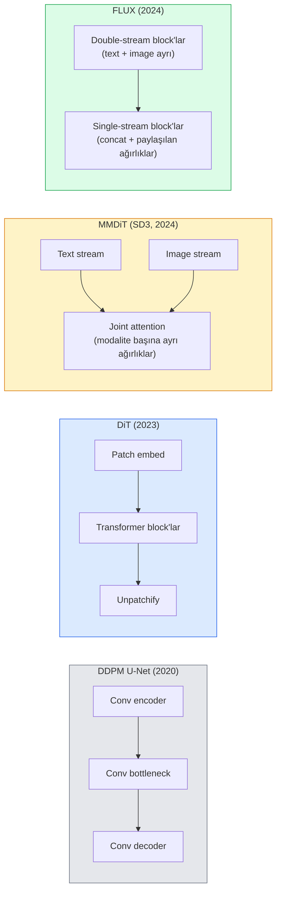

# Diffusion Transformer'lar & Rectified Flow

> U-Net diffusion'ın sırrı değildir. Onu bir transformer ile değiştir, gürültü schedule'ını düz-çizgi flow ile değiştir ve birdenbire SD3, FLUX ve her 2026 text-to-image modelini elde edersin.

**Tür:** Öğrenim + Yapım
**Diller:** Python
**Ön koşullar:** Faz 4 Ders 10 (Diffusion DDPM), Faz 4 Ders 14 (ViT), Faz 7 Ders 02 (Self-Attention)
**Süre:** ~75 dakika

## Öğrenme Hedefleri

- U-Net DDPM'den (Ders 10) Diffusion Transformer (DiT), MMDiT (SD3) ve single+double-stream DiT (FLUX)'a evrimi izle
- Rectified flow'u açıkla: gürültü ile veri arasındaki düz-çizgi yörünge modellerin neden 1000 yerine 20 adımda sample etmesine izin verir
- Ufak bir DiT block'u ve rectified-flow eğitim döngüsü uygula, her ikisi de 100 satırın altında
- Model varyantlarını (SD3, FLUX.1-dev, FLUX.1-schnell, Z-Image, Qwen-Image) mimari, parametre sayısı ve lisanslama ile ayır

## Sorun

Ders 10, U-Net denoiser ile bir DDPM kurdu. O tarif 2020-2023'e hakim oldu: U-Net + beta schedule + gürültü-tahmin loss'u. Stable Diffusion 1.5 ve 2.1 ile DALL-E 2'yi üretti.

Her 2026 state-of-the-art text-to-image modeli bunu geçti. Stable Diffusion 3, FLUX, SD4, Z-Image, Qwen-Image, Hunyuan-Image — hiçbiri U-Net kullanmıyor. Diffusion Transformer'lar (DiT) kullanıyorlar. SD3 ve FLUX ayrıca DDPM gürültü schedule'ını rectified flow ile değiştirir, bu da gürültüden veriye yolu düzleştirir ve consistency ya da distilled varyantlarla 1-4 adım inference'a izin verir.

Kayma önemli çünkü bu, diffusion-tabanlı görsel generation'ın neden kontrol edilebilir, prompt-doğru (SD3/SD4 metin render etmeyi çözdü) ve üretim-hızlı olduğunun nedenidir. DiT + rectified flow'u anlamak 2026 generative-image stack'ini anlamaktır.

## Kavram

### U-Net'ten transformer'a



- **DiT** (Peebles & Xie, 2023) — U-Net'i latent patch'lerde ViT benzeri bir transformer ile değiştir. Koşullama adaptive layer norm (AdaLN) ile.
- **MMDiT** (SD3, Esser et al., 2024) — joint attention paylaşan metin ve görsel token'ları için ayrı ağırlıklı iki akış.
- **FLUX** (Black Forest Labs, 2024) — ilk N block SD3 gibi double-stream, sonraki block'lar daha yüksek derinlikte verimlilik için concat eder ve ağırlıkları paylaşır (single-stream).
- **Z-Image** (2025) — "her ne pahasına olursa olsun ölçek"e meydan okuyan 6B parametrede verimli single-stream DiT.

### Tek paragrafta rectified flow

DDPM, forward süreci `x_t`'nin giderek bozulduğu gürültülü bir SDE olarak tanımlar. Öğrenilmiş reverse, 1000 küçük adımla çözülen ikinci bir SDE'dir.

Rectified flow, temiz veri ile saf gürültü arasında **düz-çizgi** interpolasyon tanımlar:

```
x_t = (1 - t) * x_0 + t * epsilon,     t in [0, 1]
```

Bir ağı velocity `v_theta(x_t, t) = epsilon - x_0`'ı tahmin etmek üzere eğit — temiz veriden gürültüye düz-çizgi yol boyunca forward yön (`dx_t/dt`). Sampling sırasında bu velocity'i geriye doğru integre ederek gürültüden veriye doğru adım atarsın. Sonuç ODE düz çizgiye çok daha yakın, dolayısıyla sample etmek için çok daha az integration adımına ihtiyaç var.

SD3 buna **Rectified Flow Matching** der. FLUX, Z-Image ve çoğu 2026 modeli aynı hedefi kullanır. Tipik inference: 20-30 Euler adım (deterministik) vs eski DDPM rejiminde 50+ DDIM adım. Distilled / turbo / schnell / LCM varyantları bunu 1-4 adıma indirir.

### AdaLN koşullaması

DiT'ler timestep ve sınıf/metne **adaptive layer norm** üzerinden koşullanır: koşullama vektöründen `scale` ve `shift` tahmin et ve LayerNorm sonrası uygula. U-Net'lerdeki FiLM tarzı modülasyondan çok daha temiz ve her modern DiT'in varsayılanı.

```
cond -> MLP -> (scale, shift, gate)
norm(x) * (1 + scale) + shift, sonra residual ekle * gate
```

### SD3 ve FLUX'ta text encoder'lar

- **SD3** üç text encoder kullanır: iki CLIP modeli + T5-XXL. Embedding'ler concat edilir ve metin koşullaması olarak image stream'e beslenir.
- **FLUX** bir CLIP-L + T5-XXL kullanır.
- **Qwen-Image / Z-Image** varyantları base LLM'leriyle hizalı kendi şirket-içi text encoder'larını kullanır.

Text encoder, SD3/FLUX'un prompt'lar hakkında SD1.5'ten neden çok daha iyi muhakeme yaptığının büyük bir parçasıdır. T5-XXL tek başına 4.7B parametre.

### Classifier-free guidance hâlâ geçerli

Rectified flow sampler'ı değiştirir, koşullamayı değil. Classifier-free guidance (eğitim sırasında %10 olasılıkla metni düşür, inference'ta koşullu ve koşulsuz tahminleri karıştır) rectified flow ile özdeş şekilde çalışır. Çoğu 2026 modeli guidance scale 3.5-5 kullanır — SD1.5'in 7.5'inden daha düşük çünkü rectified-flow modelleri varsayılan olarak prompt'ları daha sıkı takip eder.

### Consistency, Turbo, Schnell, LCM

Aynı fikir için dört isim: yavaş çok-adımlı bir modeli hızlı az-adımlı bir modele damıt.

- **LCM (Latent Consistency Model)** — herhangi bir ara `x_t`'den son `x_0`'ı tek adımda tahmin eden bir student eğit.
- **SDXL Turbo / FLUX schnell** — adversarial diffusion distillation ile eğitilmiş 1-4 adımlı modeller.
- **SD Turbo** — latent diffusion'a uyarlanmış OpenAI tarzı Consistency Modelleri.

Herhangi bir yeni modelin üretim servisi hem bir "tam kalite" checkpoint hem bir "turbo / schnell" varyant taşır. Schnell (Almancada "hızlı", Black Forest Labs'ın konvansiyonu) 1-4 adımda çalışır ve gerçek-zamanlı pipeline'lara sığar.

### 2026'da model manzarası

| Model | Boyut | Mimari | Lisans |
|-------|------|--------------|---------|
| Stable Diffusion 3 Medium | 2B | MMDiT | SAI Community |
| Stable Diffusion 3.5 Large | 8B | MMDiT | SAI Community |
| FLUX.1-dev | 12B | Double + Single Stream DiT | non-commercial |
| FLUX.1-schnell | 12B | aynı, distilled | Apache 2.0 |
| FLUX.2 | — | iterated FLUX.1 | karışık |
| Z-Image | 6B | S3-DiT (Scalable Single-Stream) | permissive |
| Qwen-Image | ~20B | DiT + Qwen text tower | Apache 2.0 |
| Hunyuan-Image-3.0 | ~80B | DiT | research |
| SD4 Turbo | 3B | DiT + distillation | SAI Commercial |

FLUX.1-schnell 2026 open-source varsayılanıdır. Z-Image verimlilik lideridir. FLUX.2 ve SD4 mevcut kalite uçlarıdır.

### Bu faz kaymasının önemi

DDPM + U-Net çalıştı. DiT + rectified flow **daha iyi, daha hızlı ve daha temiz ölçeklenir** çalışıyor. Geçiş NLP'de RNN'lerden transformer'lara olanla paralel: her iki mimari de aynı problemi çözdü, ama transformer'lar ölçeklendi ve şimdi hakim. Görsel, video ya da 3D generation üzerine her 2026 makalesi DiT şekilli bir denoiser ve genellikle bir rectified flow hedefi kullanır. U-Net DDPM artık çoğunlukla pedagojiktir (Ders 10).

## İnşa Et

### Adım 1: AdaLN ile bir DiT block'u

```python
import torch
import torch.nn as nn


class AdaLNZero(nn.Module):
    """
    Gate'li adaptive LayerNorm. Koşullamadan (scale, shift, gate) tahmin eder.
    Tüm block kimlik olarak başlar şekilde init et ("zero init").
    """

    def __init__(self, dim, cond_dim):
        super().__init__()
        self.norm = nn.LayerNorm(dim, elementwise_affine=False)
        self.mlp = nn.Linear(cond_dim, dim * 3)
        nn.init.zeros_(self.mlp.weight)
        nn.init.zeros_(self.mlp.bias)

    def forward(self, x, cond):
        scale, shift, gate = self.mlp(cond).chunk(3, dim=-1)
        h = self.norm(x) * (1 + scale.unsqueeze(1)) + shift.unsqueeze(1)
        return h, gate.unsqueeze(1)


class DiTBlock(nn.Module):
    def __init__(self, dim=192, heads=3, mlp_ratio=4, cond_dim=192):
        super().__init__()
        self.adaln1 = AdaLNZero(dim, cond_dim)
        self.attn = nn.MultiheadAttention(dim, heads, batch_first=True)
        self.adaln2 = AdaLNZero(dim, cond_dim)
        self.mlp = nn.Sequential(
            nn.Linear(dim, dim * mlp_ratio),
            nn.GELU(),
            nn.Linear(dim * mlp_ratio, dim),
        )

    def forward(self, x, cond):
        h, gate1 = self.adaln1(x, cond)
        a, _ = self.attn(h, h, h, need_weights=False)
        x = x + gate1 * a
        h, gate2 = self.adaln2(x, cond)
        x = x + gate2 * self.mlp(h)
        return x
```

`AdaLNZero` MLP ağırlıkları sıfıra ilklendirildiği için identity mapping olarak başlar. Eğitim block'u identity'den uzaklaştırır; bu derin transformer diffusion modellerini dramatik şekilde kararlı kılar.

### Adım 2: Ufak bir DiT

```python
def timestep_embedding(t, dim):
    import math
    half = dim // 2
    freqs = torch.exp(-math.log(10000) * torch.arange(half, device=t.device) / half)
    args = t[:, None].float() * freqs[None]
    return torch.cat([args.sin(), args.cos()], dim=-1)


class TinyDiT(nn.Module):
    def __init__(self, image_size=16, patch_size=2, in_channels=3, dim=96, depth=4, heads=3):
        super().__init__()
        self.patch_size = patch_size
        self.num_patches = (image_size // patch_size) ** 2
        self.patch = nn.Conv2d(in_channels, dim, kernel_size=patch_size, stride=patch_size)
        self.pos = nn.Parameter(torch.zeros(1, self.num_patches, dim))
        self.time_mlp = nn.Sequential(
            nn.Linear(dim, dim * 2),
            nn.SiLU(),
            nn.Linear(dim * 2, dim),
        )
        self.blocks = nn.ModuleList([DiTBlock(dim, heads, cond_dim=dim) for _ in range(depth)])
        self.norm_out = nn.LayerNorm(dim, elementwise_affine=False)
        self.head = nn.Linear(dim, patch_size * patch_size * in_channels)

    def forward(self, x, t):
        n = x.size(0)
        x = self.patch(x)
        x = x.flatten(2).transpose(1, 2) + self.pos
        t_emb = self.time_mlp(timestep_embedding(t, self.pos.size(-1)))
        for blk in self.blocks:
            x = blk(x, t_emb)
        x = self.norm_out(x)
        x = self.head(x)
        return self._unpatchify(x, n)

    def _unpatchify(self, x, n):
        p = self.patch_size
        h = w = int(self.num_patches ** 0.5)
        x = x.view(n, h, w, p, p, -1).permute(0, 5, 1, 3, 2, 4).reshape(n, -1, h * p, w * p)
        return x
```

### Adım 3: Rectified flow eğitimi

```python
import torch.nn.functional as F

def rectified_flow_train_step(model, x0, optimizer, device):
    model.train()
    x0 = x0.to(device)
    n = x0.size(0)
    t = torch.rand(n, device=device)
    epsilon = torch.randn_like(x0)
    x_t = (1 - t[:, None, None, None]) * x0 + t[:, None, None, None] * epsilon

    target_velocity = epsilon - x0
    pred_velocity = model(x_t, t)

    loss = F.mse_loss(pred_velocity, target_velocity)
    optimizer.zero_grad()
    loss.backward()
    optimizer.step()
    return loss.item()
```

DDPM'nin gürültü-tahmin loss'u ile karşılaştır (Ders 10): aynı yapı, farklı hedef. Gürültü `epsilon`'u tahmin etmek yerine, düz-çizgi interpolasyon boyunca veriden gürültüye işaret eden **velocity** `epsilon - x_0`'ı tahmin ederiz.

### Adım 4: Euler sampler

Rectified flow bir ODE'dir. Euler yöntemi en basittir ve iyi-eğitilmiş bir rectified-flow modeli için 20+ adımda yüksek dereceli çözücüler kadar neredeyse doğrudur.

```python
@torch.no_grad()
def rectified_flow_sample(model, shape, steps=20, device="cpu"):
    model.eval()
    x = torch.randn(shape, device=device)
    dt = 1.0 / steps
    t = torch.ones(shape[0], device=device)
    for _ in range(steps):
        v = model(x, t)
        x = x - dt * v
        t = t - dt
    return x
```

20 adım. Eğitilmiş bir modelde bu 1000-adım DDPM ile karşılaştırılabilir örnekler üretir.

### Adım 5: Uçtan uca smoke test

```python
import numpy as np

def synthetic_blobs(num=200, size=16, seed=0):
    rng = np.random.default_rng(seed)
    out = np.zeros((num, 3, size, size), dtype=np.float32)
    yy, xx = np.meshgrid(np.arange(size), np.arange(size), indexing="ij")
    for i in range(num):
        cx, cy = rng.uniform(4, size - 4, size=2)
        r = rng.uniform(2, 4)
        mask = (xx - cx) ** 2 + (yy - cy) ** 2 < r ** 2
        colour = rng.uniform(-1, 1, size=3)
        for c in range(3):
            out[i, c][mask] = colour[c]
    return torch.from_numpy(out)
```

Bunu rectified flow ile `TinyDiT` eğit. 500 adımdan sonra sample edilen çıktılar renk lekeleri gibi görünmeli.

## Kullan

FLUX / SD3 / Z-Image ile gerçek görsel generation için `diffusers` her birini birleşik bir API ile taşır:

```python
from diffusers import FluxPipeline, StableDiffusion3Pipeline
import torch

pipe = FluxPipeline.from_pretrained(
    "black-forest-labs/FLUX.1-schnell",
    torch_dtype=torch.bfloat16,
).to("cuda")

out = pipe(
    prompt="a golden retriever surfing a tsunami, hyperrealistic, studio lighting",
    guidance_scale=0.0,           # schnell CFG olmadan eğitildi
    num_inference_steps=4,
    max_sequence_length=256,
).images[0]
out.save("surf.png")
```

Üç satır. Dört adımda `FLUX.1-schnell`. CFG ile 20-30 adımda daha yüksek kalite için model id'sini `black-forest-labs/FLUX.1-dev` ile değiştir.

SD3 için:

```python
pipe = StableDiffusion3Pipeline.from_pretrained(
    "stabilityai/stable-diffusion-3.5-large",
    torch_dtype=torch.bfloat16,
).to("cuda")
out = pipe(prompt, guidance_scale=3.5, num_inference_steps=28).images[0]
```

## Yayınla

Bu ders şunları üretir:

- `outputs/prompt-dit-model-picker.md` — kalite, latency ve lisans kısıtları verildiğinde SD3, FLUX.1-dev, FLUX.1-schnell, Z-Image, SD4 Turbo arasında seçim yapar.
- `outputs/skill-rectified-flow-trainer.md` — AdaLN DiT ve Euler sampling ile rectified flow için komple bir eğitim döngüsü yazar.

## Alıştırmalar

1. **(Kolay)** Yukarıdaki TinyDiT'i sentetik blob dataset'inde 500 adım eğit. 10, 20 ve 50 Euler adımıyla üretilen örnekleri karşılaştır.
2. **(Orta)** Zaman embedding'ine öğrenilmiş bir sınıf embedding'i concat ederek metin koşullaması ekle (10 renge göre blob "sınıfı"). Sınıf 0, 5 ve 9 ile sample et ve renklerin eşleştiğini doğrula.
3. **(Zor)** Aynı boyuttaki ağın rectified-flow ve DDPM versiyonlarının aynı veride aynı adım sayısı eğitiminden üretilen örnekler arasında Fréchet mesafesini (FID proxy) hesapla. Hangisinin daha hızlı yakınsadığını raporla.

## Anahtar Terimler

| Terim | İnsanlar ne diyor | Gerçekte ne anlama geliyor |
|------|----------------|----------------------|
| DiT | "Diffusion transformer" | U-Net'in yerine diffusion denoiser olarak çalışan transformer; patchify edilmiş latent'lar üzerinde çalışır |
| AdaLN | "Adaptive layer norm" | LayerNorm sonrası uygulanan öğrenilmiş scale, shift, gate ile timestep/metin koşullaması; her modern DiT'te standart |
| MMDiT | "Multi-modal DiT (SD3)" | Joint self-attention paylaşan metin ve görsel token'lar için ayrı ağırlık akışları |
| Single-stream / double-stream | "FLUX hilesi" | İlk N block double-stream (modalite başına ayrı ağırlıklar), sonraki block'lar verimlilik için single-stream (concat + paylaşılan ağırlıklar) |
| Rectified flow | "Düz-çizgi gürültü-veri" | Veri ile gürültü arasında lineer interpolasyon; ağ velocity tahmin eder; inference'ta daha az ODE adımı gerekir |
| Velocity target | "epsilon - x_0" | Rectified flow'taki regresyon hedefi; temiz veriden gürültüye işaret eder |
| CFG guidance | "classifier-free guidance" | Koşullu ve koşulsuz tahminleri karıştır; hâlâ rectified-flow modellerinde kullanılır |
| Schnell / turbo / LCM | "1-4 adım distillation" | Tam-kalite modellerden damıtılmış küçük-adım varyantlar; üretim gerçek-zamanlı |

## İleri Okuma

- [Scalable Diffusion Models with Transformers (Peebles & Xie, 2023)](https://arxiv.org/abs/2212.09748) — DiT makalesi
- [Scaling Rectified Flow Transformers (Esser et al., SD3 paper)](https://arxiv.org/abs/2403.03206) — ölçekte MMDiT ve rectified-flow
- [FLUX.1 model card and technical report (Black Forest Labs)](https://huggingface.co/black-forest-labs/FLUX.1-dev) — double + single-stream detayları
- [Z-Image: Efficient Image Generation Foundation Model (2025)](https://arxiv.org/html/2511.22699v1) — 6B'de single-stream DiT
- [Elucidating the Design Space of Diffusion (Karras et al., 2022)](https://arxiv.org/abs/2206.00364) — her diffusion tasarım trade-off'u için referans
- [Latent Consistency Models (Luo et al., 2023)](https://arxiv.org/abs/2310.04378) — LCM-LoRA'nın sana 4-adım inference'ı nasıl verdiği
