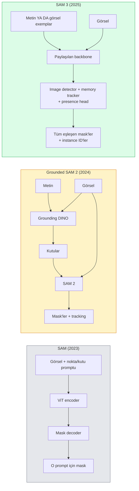

# SAM 3 & Open-Vocabulary Segmentasyon

> Bir modele bir metin promptu ve bir görsel ver, eşleşen her nesne için mask al. SAM 3 bunu tek bir forward pass yaptı.

**Tür:** Kullan + Yapım
**Diller:** Python
**Ön koşullar:** Faz 4 Ders 07 (U-Net), Faz 4 Ders 08 (Mask R-CNN), Faz 4 Ders 18 (CLIP)
**Süre:** ~60 dakika

## Öğrenme Hedefleri

- SAM (yalnızca görsel prompt'lar), Grounded SAM / SAM 2 (detector + SAM) ve SAM 3 (Promptable Concept Segmentation üzerinden native metin prompt'ları) arasında ayrım yap
- SAM 3 mimarisini açıkla: paylaşılan backbone + image detector + memory-tabanlı video tracker + presence head + ayrıştırılmış detector-tracker tasarımı
- Text-prompt'lu detection, segmentation ve video tracking için Hugging Face `transformers` SAM 3 entegrasyonunu kullan
- Latency, kavram karmaşıklığı ve deployment hedefine göre SAM 3, Grounded SAM 2, YOLO-World ve SAM-MI arasında seç

## Sorun

2023 SAM yalnızca görsel-prompt'lu bir modeldi: bir nokta tıkla ya da bir kutu çiz, sana bir mask döndürür. "Bu fotoğraftaki tüm portakalları ver" için kutu üretmek üzere bir detector'a (Grounding DINO), sonra her birini segmente etmek için SAM'e ihtiyacın vardı. Grounded SAM bunu bir pipeline'a çevirdi, ama kaçınılmaz hata birikimi olan iki donmuş modelin bir cascade'iydi.

SAM 3 (Meta, Kasım 2025, ICLR 2026) cascade'i çöktürdü. Prompt olarak kısa bir isim öbeği ya da görsel bir exemplar kabul eder ve tek bir forward pass'te tüm eşleşen mask'leri ve instance ID'leri döndürür. Bu **Promptable Concept Segmentation (PCS)**'dır. Mart 2026 Object Multiplex güncellemesi (SAM 3.1) ile birleştiğinde, aynı kavramın birden çok instance'ını video boyunca verimli şekilde izler.

Bu ders bunun temsil ettiği yapısal kaymayla ilgilidir. 2D seg, detection ve metin-görsel grounding tek bir modelde birleşti. Üretim sorusu artık "hangi pipeline'ı bağlayayım" değil "hangi promptable model use case'imi uçtan uca halleder" olmuştur.

## Kavram

### Üç jenerasyon



### Promptable Concept Segmentation

"Concept prompt" kısa bir isim öbeği (`"yellow school bus"`, `"striped red umbrella"`, `"hand holding a mug"`) ya da görsel bir exemplar'dır. Model, görseldeki kavrama uyan her instance için segmentation mask'leri ve eşleşme başına benzersiz bir instance ID döndürür.

Bu, klasik görsel-prompt'lu SAM'den üç şekilde farklıdır:

1. Instance başına prompt gerekmez — bir metin promptu tüm eşleşmeleri döndürür.
2. Open-vocabulary — kavram doğal dilde tanımlanabilen herhangi bir şey olabilir.
3. Prompt başına bir mask yerine birden fazla instance'ı bir kerede döndürür.

### Ana mimari parçalar

- **Paylaşılan backbone** — tek bir ViT görseli işler. Hem detector head hem memory-tabanlı tracker ondan okur.
- **Presence head** — kavramın görselde hiç var olup olmadığını tahmin eder. "Bu burada mı?"yı "nerede?"den ayrıştırır. Mevcut olmayan kavramlarda false positive'leri azaltır.
- **Ayrıştırılmış detector-tracker** — görsel-düzeyi detection ve video-düzeyi tracking'in ayrı head'leri vardır, böylece birbirlerine müdahale etmezler.
- **Memory bank** — video tracking için frame'ler arası instance başına feature'ları saklar (SAM 2'nin kullandığı aynı mekanizma).

### Ölçekte eğitim

SAM 3, AI + human review kullanarak iteratif olarak anote eden ve düzelten bir veri motoru tarafından üretilen **4 milyon benzersiz kavram** üzerinde eğitildi. Yeni **SA-CO benchmark**'ı 270K benzersiz kavram içerir, önceki benchmark'lardan 50x daha büyüktür. SAM 3 SA-CO'da insan performansının %75-80'ine ulaşır ve image + video PCS'te mevcut sistemleri ikiye katlar.

### SAM 3.1 Object Multiplex

Mart 2026 güncellemesi: **Object Multiplex** aynı kavramın birçok instance'ının joint tracking'i için paylaşılan-bellek mekanizması sunar. Daha önce N instance tracking'i N ayrı memory bank demekti. Multiplex bunu instance başına sorgularla tek bir paylaşılan belleğe çöktürür. Sonuç: doğruluğu feda etmeden önemli ölçüde daha hızlı multi-object tracking.

### Grounded SAM'in 2026'da hâlâ önemli olduğu yer

- Yerine spesifik bir open-vocabulary detector'a (DINO-X, Florence-2) ihtiyacın olduğunda.
- SAM 3 lisansı (HF'te gated) bir engel olduğunda.
- SAM 3'ün ifşa ettiğinden detector eşiği üzerinde daha fazla kontrole ihtiyacın olduğunda.
- Detector bileşeni üzerinde araştırma / ablation işi için.

Modüler pipeline'ların hâlâ bir yeri var. Çoğu üretim işi için SAM 3 daha basit cevaptır.

### YOLO-World vs SAM 3

- **YOLO-World** — yalnızca open-vocabulary detector (mask yok). Gerçek zamanlı. Yüksek fps'de kutulara ihtiyacın olduğunda en iyi.
- **SAM 3** — tam segmentation + tracking. Daha yavaş ama daha zengin çıktı.

Üretim bölünmesi: hızlı yalnız-detection pipeline'ları için YOLO-World (robotik navigasyonu, hızlı dashboard'lar), mask ya da tracking gerektiren her şey için SAM 3.

### SAM-MI verimliliği

SAM-MI (2025-2026) SAM'in decoder bottleneck'ini ele alır. Ana fikirler:

- **Sparse point prompting** — yoğun prompt'lar yerine birkaç iyi-seçilmiş nokta kullanır; decoder çağrılarını %96 azaltır.
- **Shallow mask aggregation** — kaba mask tahminlerini tek bir daha keskin mask'e birleştirir.
- **Decoupled mask injection** — decoder yeniden çalıştırmak yerine önceden hesaplanmış mask feature'larını alır.

Sonuç: Open-vocabulary benchmark'larda Grounded-SAM'a göre ~1.6x hızlanma.

### Üç model için çıktı formatı

Hepsi aynı genel yapıyı döndürür (kutular + etiketler + skorlar + mask'ler + ID'ler), bu da faydalı — downstream pipeline'ının hangi modelin çalıştığına dallanması gerekmez.

## İnşa Et

### Adım 1: Prompt yapımı

Kullanıcı cümlesini SAM 3 concept prompt'larının listesine çeviren bir yardımcı kur. Bu, "kullanıcının yazdığı şey"in "modelin tükettiği şey" ile buluştuğu sınırdır.

```python
def split_concepts(sentence):
    """
    Çok-kavramlı prompt'lar için heuristic ayırıcı.
    Kısa isim öbeklerinin listesini döndürür.
    """
    for sep in [",", ";", "and", "or", "&"]:
        if sep in sentence:
            parts = [p.strip() for p in sentence.replace("and ", ",").split(",")]
            return [p for p in parts if p]
    return [sentence.strip()]

print(split_concepts("cats, dogs and balloons"))
```

SAM 3 forward pass başına bir kavram kabul eder; çok-kavramlı sorgular için döngü yap ya da batch'le.

### Adım 2: Post-processing yardımcıları

SAM 3'ün ham çıktılarını Faz 4 Ders 16 pipeline kontratımıza uyan temiz bir tespit listesine çevir.

```python
from dataclasses import dataclass
from typing import List

@dataclass
class ConceptDetection:
    concept: str
    instance_id: int
    box: tuple          # (x1, y1, x2, y2)
    score: float
    mask_rle: str       # run-length encoded


def rle_encode(binary_mask):
    flat = binary_mask.flatten().astype("uint8")
    runs = []
    prev, count = flat[0], 0
    for v in flat:
        if v == prev:
            count += 1
        else:
            runs.append((int(prev), count))
            prev, count = v, 1
    runs.append((int(prev), count))
    return ";".join(f"{v}x{c}" for v, c in runs)
```

RLE birçok yüksek-çözünürlüklü mask için bile response payload'larını küçük tutar. Aynı format SAM 2, SAM 3, Grounded SAM 2'de çalışır.

### Adım 3: Birleşik bir open-vocab segmentation arayüzü

Sahip olduğun backend'i (SAM 3, Grounded SAM 2, YOLO-World + SAM 2) tek bir metodun arkasına sar. Backend değiştiğinde downstream kodun değişmez.

```python
from abc import ABC, abstractmethod
import numpy as np

class OpenVocabSeg(ABC):
    @abstractmethod
    def detect(self, image: np.ndarray, concept: str) -> List[ConceptDetection]:
        ...


class StubOpenVocabSeg(OpenVocabSeg):
    """
    Gerçek modeller yüklü olmadığında pipeline testi için kullanılan deterministik stub.
    """
    def detect(self, image, concept):
        h, w = image.shape[:2]
        return [
            ConceptDetection(
                concept=concept,
                instance_id=0,
                box=(w * 0.2, h * 0.3, w * 0.5, h * 0.8),
                score=0.89,
                mask_rle="0x100;1x50;0x200",
            ),
            ConceptDetection(
                concept=concept,
                instance_id=1,
                box=(w * 0.55, h * 0.25, w * 0.85, h * 0.75),
                score=0.74,
                mask_rle="0x80;1x40;0x220",
            ),
        ]
```

Gerçek `SAM3OpenVocabSeg` alt sınıfı `transformers.Sam3Model` ve `Sam3Processor`'ı sarar.

### Adım 4: Hugging Face SAM 3 kullanımı (referans)

Gerçek model için `transformers` entegrasyonu:

```python
from transformers import Sam3Processor, Sam3Model
import torch

processor = Sam3Processor.from_pretrained("facebook/sam3")
model = Sam3Model.from_pretrained("facebook/sam3").eval()

inputs = processor(images=pil_image, return_tensors="pt")
inputs = processor.set_text_prompt(inputs, "yellow school bus")

with torch.no_grad():
    outputs = model(**inputs)

masks = processor.post_process_masks(
    outputs.masks, inputs.original_sizes, inputs.reshaped_input_sizes
)
boxes = outputs.boxes
scores = outputs.scores
```

Bir prompt, tüm eşleşmeler tek bir çağrıda dönüyor.

### Adım 5: Grounded SAM 2'nin bedavaya verdiğini ölç

Dürüst bir benchmark: gerçek bir pipeline'da Grounded SAM 2'yi SAM 3 ile değiştirdiğinde ne olur?

- Latency: SAM 3 bir forward pass kazandırır (ayrı detector yok) ama modelin kendisi daha ağırdır; genellikle net-nötr ya da hafif bir hızlanma.
- Doğruluk: SAM 3 nadir ya da kompozisyonel kavramlarda ("striped red umbrella") önemli ölçüde daha iyi. Yaygın tek-kelimeli kavramlarda benzer.
- Esneklik: Grounded SAM 2 detector'ları değiştirmene izin verir (DINO-X, Florence-2, Grounding DINO 1.5); SAM 3 monoliktir.

Sonuç: SAM 3 2026 open-vocab seg için varsayılandır. Grounded SAM 2 hâlâ detector esnekliği ya da farklı lisans şartları gerektiğinde doğru cevaptır.

## Kullan

Üretim deployment kalıpları:

- **Gerçek zamanlı annotation** — CVAT'ın label-as-text-prompt feature'ı ile SAM 3. Anotatörler bir label adı seçer; SAM 3 her eşleşen instance'ı önceden etiketler. İncele ve düzelt.
- **Video analitiği** — multi-object tracking için SAM 3.1 Object Multiplex; frame'leri memory-tabanlı tracker'a besle.
- **Robotik** — open-vocab manipülasyon için SAM 3 ("kırmızı kupayı al"); planning primitive olarak çalışır.
- **Tıbbi görüntüleme** — tıbbi kavramlarda fine-tune edilmiş SAM 3; HF'te erişim isteği gerektirir.

Ultralytics SAM 3'ü Python paketinde sarar:

```python
from ultralytics import SAM

model = SAM("sam3.pt")
results = model(image_path, prompts="yellow school bus")
```

YOLO ve SAM 2 ile aynı arayüz.

## Yayınla

Bu ders şunları üretir:

- `outputs/prompt-open-vocab-stack-picker.md` — latency, kavram karmaşıklığı ve lisanslamaya göre SAM 3 / Grounded SAM 2 / YOLO-World / SAM-MI seçen bir prompt.
- `outputs/skill-concept-prompt-designer.md` — kullanıcı söylemlerini iyi-biçimli SAM 3 concept prompt'larına çeviren bir skill (ayırma, anlam belirsizliği giderme, fallback'ler).

## Alıştırmalar

1. **(Kolay)** Seçtiğin concept prompt'larıyla 10 görselde SAM 3 çalıştır. Aynı görsellerde SAM 2 + Grounding DINO 1.5'a karşı karşılaştır. Her modelin hangi kavramları kaçırdığını raporla.
2. **(Orta)** SAM 3'ün üstünde bir "click-to-include / click-to-exclude" UI kur: bir metin promptu aday instance'ları döndürür; kullanıcı tıklamalar hangilerinin pozitif sayılacağını korur. Son kavram setini JSON olarak çıktıla.
3. **(Zor)** Her biri 20 etiketli görselle özel bir kavram seti (örn. 5 tip elektronik bileşen) üzerinde SAM 3'ü fine-tune et. Aynı test setinde zero-shot SAM 3 ile karşılaştır; mask IoU iyileşmesini ölç.

## Anahtar Terimler

| Terim | İnsanlar ne diyor | Gerçekte ne anlama geliyor |
|------|----------------|----------------------|
| Open-vocabulary segmentation | "Metinle segmente et" | Sabit bir etiket seti değil, doğal dilde tanımlanan nesneler için mask üret |
| PCS | "Promptable Concept Segmentation" | SAM 3'ün çekirdek görevi — bir isim öbeği ya da görsel exemplar verildiğinde, tüm eşleşen instance'ları segmente et |
| Concept prompt | "Metin girdisi" | Kısa isim öbeği ya da görsel exemplar; tam cümle değil |
| Presence head | "Burada mı?" | Lokalizasyondan önce kavramın görselde var olup olmadığına karar veren SAM 3 modülü |
| SA-CO | "SAM 3 benchmark'ı" | 270K-kavramlı open-vocabulary segmentation benchmark'ı; önceki open-vocab benchmark'larından 50x daha büyük |
| Object Multiplex | "SAM 3.1 güncellemesi" | Paylaşılan bellekli multi-object tracking; birçok instance'ın hızlı joint tracking'i |
| Grounded SAM 2 | "Modüler pipeline" | Detector + SAM 2 cascade'i; detector değişimi önemli olduğunda hâlâ alakalı |
| SAM-MI | "Verimli SAM varyantı" | Grounded-SAM'a göre 1.6x hızlanma için Mask Injection |

## İleri Okuma

- [SAM 3: Segment Anything with Concepts (arXiv 2511.16719)](https://arxiv.org/abs/2511.16719)
- [SAM 3.1 Object Multiplex (Meta AI, March 2026)](https://ai.meta.com/blog/segment-anything-model-3/)
- [SAM 3 model page on Hugging Face](https://huggingface.co/facebook/sam3)
- [Grounded SAM 2 tutorial (PyImageSearch)](https://pyimagesearch.com/2026/01/19/grounded-sam-2-from-open-set-detection-to-segmentation-and-tracking/)
- [Ultralytics SAM 3 docs](https://docs.ultralytics.com/models/sam-3/)
- [SAM3-I: Instruction-aware SAM (arXiv 2512.04585)](https://arxiv.org/abs/2512.04585)
