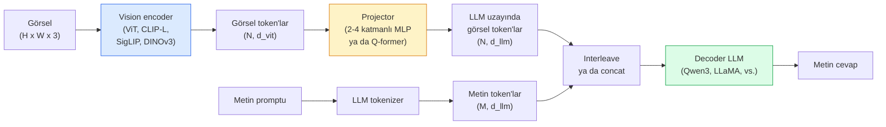

# Vision-Language Modelleri — ViT-MLP-LLM Kalıbı

> Bir vision encoder bir görseli token'lara çevirir. Bir MLP projector o token'ları LLM'in embedding uzayına eşler. Bir dil modeli geri kalanını yapar. O kalıp — ViT-MLP-LLM — 2026'da her üretim VLM'idir.

**Tür:** Öğrenim + Kullan
**Diller:** Python
**Ön koşullar:** Faz 4 Ders 14 (ViT), Faz 4 Ders 18 (CLIP), Faz 7 Ders 02 (Self-Attention)
**Süre:** ~75 dakika

## Öğrenme Hedefleri

- ViT-MLP-LLM mimarisini belirt ve üç bileşenden her birinin neye katkıda bulunduğunu açıkla
- Qwen3-VL, InternVL3.5, LLaVA-Next ve GLM-4.6V'yi parametre sayısı, bağlam uzunluğu ve benchmark performansında karşılaştır
- DeepStack'i açıkla: çok-seviyeli ViT feature'larının görü-dil hizalamasını tek son-katman feature'ından neden daha iyi sıkılaştırdığı
- Cross-Modal Error Rate (CMER) ile üretimde VLM hallucination'ı ölç ve sinyale göre hareket et

## Sorun

CLIP (Faz 4 Ders 18), görseller ve metin için zero-shot classification ve retrieval'a yetecek paylaşılan bir embedding space verir. "Bu görselde kaç kırmızı araba var?"ı cevaplayamaz çünkü CLIP metin üretmez — yalnızca benzerlikleri skorlar.

Vision-Language Modelleri (VLM'ler) — Qwen3-VL, InternVL3.5, LLaVA-Next, GLM-4.6V — bir CLIP-ailesi image encoder'ı tam bir dil modeline bağlar. Model bir görsel artı bir soru görür ve bir cevap üretir. 2026'da open-source VLM'ler multimodal benchmark'larda (MMMU, MMBench, DocVQA, ChartQA, MathVista, OSWorld) GPT-5 ve Gemini-2.5-Pro'yu eşler ya da yener.

Üç parçalı set (ViT, projector, LLM) standarttır. Modeller arasındaki farklar hangi ViT, hangi projector, hangi LLM, eğitim verisi ve hizalama tarifindedir. Kalıbı bir kez anladığında herhangi bir bileşeni değiştirmek mekaniktir.

## Kavram

### ViT-MLP-LLM mimarisi



1. **Vision encoder** — pretrained bir ViT (CLIP-L/14, SigLIP, DINOv3 ya da fine-tune varyant). Patch token üretir.
2. **Projector** — vision token'larını LLM'in embedding boyutuna eşleyen küçük bir modül (2-4 katmanlı MLP ya da Q-former). Fine-tuning'in çoğu burada olur.
3. **LLM** — decoder-only bir dil modeli (Qwen3, Llama, Mistral, GLM, InternLM). Sırayla vision + metin token'ları okur, metin üretir.

Üç parça da prensipte eğitilebilirdir. Pratikte vision encoder ve LLM çoğunlukla donmuş kalır; projector eğitilir — ucuza birkaç milyar parametre sinyali.

### DeepStack

Vanilla projeksiyon yalnızca son ViT katmanını kullanır. DeepStack (Qwen3-VL) birden fazla ViT derinliğinden feature'ları örnekler ve yığar. Daha derin katmanlar yüksek-seviye semantiği taşır; daha sığ katmanlar ince-taneli uzaysal ve dokusal bilgi taşır. İkisini de LLM'e beslemek "görsel ne içeriyor" (semantik) ile "tam olarak nerede" (uzaysal grounding) arasındaki boşluğu kapatır.

### Üç eğitim aşaması

Modern VLM'ler aşamalı olarak eğitir:

1. **Alignment** — ViT ve LLM'i dondur. Görsel-caption çiftleri üzerinde yalnızca projector'ı eğit. Projector'a vision space'i dil uzayına eşlemeyi öğretir.
2. **Pre-training** — her şeyi çöz. Büyük ölçekli interleaved görsel-metin verisi (500M+ çift) üzerinde eğit. Modelin görsel bilgisini kurar.
3. **Instruction tuning** — küratörlü (görsel, soru, cevap) üçlüleri üzerinde fine-tune et. Konuşma davranışı ve görev formatlarını öğretir. "Görü-farkındalıklı LM"i kullanılabilir bir asistana çeviren şey budur.

Çoğu LoRA fine-tune küçük etiketli bir dataset'le 3. aşamayı hedefler.

### Model aile karşılaştırması (2026 başı)

| Model | Param | Vision encoder | LLM | Bağlam | Güçlü yönler |
|-------|--------|----------------|-----|---------|-----------|
| Qwen3-VL-235B-A22B (MoE) | 235B (22B aktif) | özel ViT + DeepStack | Qwen3 | 256K | Genel SOTA, GUI agent |
| Qwen3-VL-30B-A3B (MoE) | 30B (3B aktif) | özel ViT + DeepStack | Qwen3 | 256K | Daha küçük MoE alternatifi |
| Qwen3-VL-8B (dense) | 8B | özel ViT | Qwen3 | 128K | Üretim dense varsayılanı |
| InternVL3.5-38B | 38B | InternViT-6B | Qwen3 + GPT-OSS | 128K | Güçlü MMBench / MMVet |
| InternVL3.5-241B-A28B | 241B (28B aktif) | InternViT-6B | Qwen3 | 128K | GPT-4o ile rekabet |
| LLaVA-Next 72B | 72B | SigLIP | Llama-3 | 32K | Açık, fine-tune'u kolay |
| GLM-4.6V | ~70B | özel | GLM | 64K | Open-source, güçlü OCR |
| MiniCPM-V-2.6 | 8B | SigLIP | MiniCPM | 32K | Edge-dostu |

### Visual agent'lar

Qwen3-VL-235B, OSWorld'de — GUI'leri (masaüstü, mobil, web) işleten **görsel agent'lar** için bir benchmark — global zirve performansa ulaşır. Model bir ekran görüntüsü görür, UI'yi anlar ve eylemler (tıklama, yazma, scroll) yayar. Tool'larla birleştiğinde yaygın masaüstü görevlerinde döngüyü kapatır. Çoğu 2026 "AI PC" demosunun altında çalışan budur.

### Agentic yetenekler + RoPE varyantları

VLM'lerin bir frame'in bir videoda **ne zaman** olduğunu bilmesi gerekir. Qwen3-VL T-RoPE (temporal rotary position embeddings)'den **metin-tabanlı zaman hizalaması**'na evrildi — video frame'leriyle interleave edilmiş explicit timestamp metin token'ları. Model "`<timestamp 00:32>` frame, prompt" görür ve temporal ilişkiler hakkında muhakeme yapabilir.

### Hizalama problemi

Crawl edilmiş bir dataset'teki görsel-metin çiftlerinin %12'si görselde tam olarak grounded olmayan açıklamalar içerir. Bunun üzerinde eğitilmiş bir VLM sessizce halüsinasyon yapmayı öğrenir — nesneler uydurur, sayıları yanlış okur, ilişkiler icat eder. Üretimde baskın başarısızlık modu budur.

Skywork.ai bunu izlemek için **Cross-Modal Error Rate (CMER)**'ı tanıttı:

```
CMER = metin güveninin yüksek olduğu ama görsel-metin benzerliğinin (bir CLIP-ailesi kontrolcü üzerinden) düşük olduğu çıktıların fraksiyonu
```

Yüksek CMER, modelin görselde grounded olmayan şeyleri güvenle söylediği anlamına gelir. CMER'i izlemek ve onu üretim KPI olarak ele almak deployment'larında hallucination oranını ~%35 azalttı. Hile "modeli düzelt" değil "yüksek-CMER çıktıları insan incelemesine yönlendir"dir.

### LoRA / QLoRA ile fine-tuning

70B bir VLM'in tam fine-tuning'i çoğu ekibin erişiminin ötesindedir. Attention + projector katmanları üzerinde LoRA (rank 16-64) ya da 4-bit base ağırlıklarla QLoRA, tek bir A100 / H100'e sığar. Maliyet: 5.000-50.000 örnek, compute'ta 100-5.000$, eğitim 2-10 saat.

### Uzaysal muhakeme hâlâ zayıf

Mevcut VLM'ler uzaysal muhakeme benchmark'larında (above-below, left-right, counting, distance) %50-60 alır. Use case'in "hangi nesne hangisinin üstünde"ye bağlıysa, yoğun doğrula — genel VLM performansı insanın altında. Saf uzaysal görevler için VLM'den iyi alternatifler: özelleşmiş bir keypoint / poz estimator, bir depth modeli ya da kutu geometrisi post-process edilmiş bir detection modeli.

## İnşa Et

### Adım 1: Projector

En sık eğiteceğin parça. GELU ile 2-4 katmanlı MLP.

```python
import torch
import torch.nn as nn


class Projector(nn.Module):
    def __init__(self, vit_dim=768, llm_dim=4096, hidden=4096):
        super().__init__()
        self.net = nn.Sequential(
            nn.Linear(vit_dim, hidden),
            nn.GELU(),
            nn.Linear(hidden, llm_dim),
        )

    def forward(self, x):
        return self.net(x)
```

Girdi bir `(N_patches, d_vit)` token tensor'dur. Çıktı `(N_patches, d_llm)`. LLM her çıktı satırını başka bir token olarak ele alır.

### Adım 2: ViT-MLP-LLM'i uçtan uca birleştir

Minimal bir VLM için forward pass iskeleti. Gerçek kod `transformers` kullanır; bu kavramsal yerleşim.

```python
class MinimalVLM(nn.Module):
    def __init__(self, vit, projector, llm, image_token_id):
        super().__init__()
        self.vit = vit
        self.projector = projector
        self.llm = llm
        self.image_token_id = image_token_id  # metin promptunda placeholder token

    def forward(self, image, input_ids, attention_mask):
        # 1. vision feature'lar
        vision_tokens = self.vit(image)                     # (B, N_patches, d_vit)
        vision_embeds = self.projector(vision_tokens)       # (B, N_patches, d_llm)

        # 2. metin embedding'leri
        text_embeds = self.llm.get_input_embeddings()(input_ids)  # (B, M, d_llm)

        # 3. görsel placeholder token'larını vision embed'leriyle değiştir
        merged = self._merge(text_embeds, vision_embeds, input_ids)

        # 4. LLM'i çalıştır
        return self.llm(inputs_embeds=merged, attention_mask=attention_mask)

    def _merge(self, text_embeds, vision_embeds, input_ids):
        out = text_embeds.clone()
        expected = vision_embeds.size(1)
        for b in range(input_ids.size(0)):
            positions = (input_ids[b] == self.image_token_id).nonzero(as_tuple=True)[0]
            if len(positions) != expected:
                raise ValueError(
                    f"batch item {b} has {len(positions)} image tokens but vision_embeds has {expected} patches."
                    " Batch'teki her örnek aynı sayıda görsel placeholder token'a önceden pad edilmiş olmalı.")
            out[b, positions] = vision_embeds[b]
        return out
```

Metindeki `<image>` placeholder token'ı gerçek görsel embedding'leriyle değiştirilir — LLaVA, Qwen-VL ve InternVL'in kullandığı aynı kalıp.

### Adım 3: CMER hesaplama

Hafif bir runtime kontrolü.

```python
import torch.nn.functional as F


def cross_modal_error_rate(image_emb, text_emb, text_confidence, sim_threshold=0.25, conf_threshold=0.8):
    """
    image_emb, text_emb: görsel ve üretilen metnin embedding'leri (içsel olarak normalize)
    text_confidence:     [0, 1]'de ortalama token başına olasılık
    Returns:             görsel-metin hizalaması düşük olan yüksek-güvenli çıktıların fraksiyonu
    """
    image_emb = F.normalize(image_emb, dim=-1)
    text_emb = F.normalize(text_emb, dim=-1)
    sim = (image_emb * text_emb).sum(dim=-1)        # cosine similarity
    high_conf_low_sim = (text_confidence > conf_threshold) & (sim < sim_threshold)
    return high_conf_low_sim.float().mean().item()
```

CMER'i üretim KPI olarak ele al. Endpoint başına, prompt türü başına, müşteri başına izle. Yükselen CMER, modelin bazı girdi dağılımlarında halüsinasyon yapmaya başladığını gösterir.

### Adım 4: Toy VLM sınıflandırıcı (çalıştırılabilir)

Projector'ın eğitildiğini göster. Sahte "ViT feature'ları" girer; ufak LLM tarzı bir token bir sınıf tahmin eder.

```python
class ToyVLM(nn.Module):
    def __init__(self, vit_dim=32, llm_dim=64, num_classes=5):
        super().__init__()
        self.projector = Projector(vit_dim, llm_dim, hidden=64)
        self.head = nn.Linear(llm_dim, num_classes)

    def forward(self, vision_tokens):
        projected = self.projector(vision_tokens)
        pooled = projected.mean(dim=1)
        return self.head(pooled)
```

Birisi bunu sentetik (feature, sınıf) çiftlerine 200 adımdan az sürede fit edebilir — projector kalıbının çalıştığını göstermeye yeter.

## Kullan

Üretim ekiplerinin 2026'da VLM'leri kullandığı üç yol:

- **Hosted API** — OpenAI Vision, Anthropic Claude Vision, Google Gemini Vision. Sıfır infra, satıcı riski.
- **Open-source self-host** — `transformers` ve `vllm` üzerinden Qwen3-VL ya da InternVL3.5. Tam kontrol, daha yüksek başlangıç çabası.
- **Domain üzerinde fine-tune** — Qwen2.5-VL-7B ya da LLaVA-1.6-7B yükle, 5k-50k özel örnek üzerinde LoRA, `vllm` ya da `TGI` ile serve et.

```python
from transformers import AutoProcessor, AutoModelForVision2Seq
import torch
from PIL import Image

model_id = "Qwen/Qwen3-VL-8B-Instruct"
processor = AutoProcessor.from_pretrained(model_id)
model = AutoModelForVision2Seq.from_pretrained(model_id, torch_dtype=torch.bfloat16, device_map="auto")

messages = [{
    "role": "user",
    "content": [
        {"type": "image", "image": Image.open("plot.png")},
        {"type": "text", "text": "What does this chart show?"},
    ],
}]
inputs = processor.apply_chat_template(messages, add_generation_prompt=True, tokenize=True, return_dict=True, return_tensors="pt").to("cuda")
generated = model.generate(**inputs, max_new_tokens=256)
answer = processor.decode(generated[0][inputs["input_ids"].shape[1]:], skip_special_tokens=True)
```

`apply_chat_template` `<image>` placeholder tokenization'ını gizler; model birleştirmeyi içeride halleder.

## Yayınla

Bu ders şunları üretir:

- `outputs/prompt-vlm-selector.md` — doğruluk, latency, bağlam uzunluğu ve bütçeye göre Qwen3-VL / InternVL3.5 / LLaVA-Next / API seçer.
- `outputs/skill-cmer-monitor.md` — bir üretim VLM endpoint'ini cross-modal error rate, endpoint başına dashboard'lar ve alert eşikleriyle enstrümante etmek için kodu yayar.

## Alıştırmalar

1. **(Kolay)** Herhangi bir açık VLM üzerinden beş görselde üç prompt ("bu nedir?", "nesneleri say", "sahneyi tarif et") çalıştır. Her cevabı doğru / kısmen doğru / halüsinasyon olarak elle puanla. İlk-geçiş CMER benzeri bir oran hesapla.
2. **(Orta)** Hedef domain'in 500 görseliyle caption'lar üzerinde LoRA (rank 16) ile Qwen2.5-VL-3B ya da LLaVA-1.6-7B fine-tune et. Zero-shot vs fine-tune MMBench tarzı doğruluğu karşılaştır.
3. **(Zor)** VLM'in image encoder'ını varsayılan SigLIP/CLIP yerine DINOv3 ile değiştir. Yalnızca projector'ı yeniden eğit (donmuş LLM + donmuş DINOv3). Yoğun-tahmin görevlerinin (sayma, uzaysal muhakeme) iyileşip iyileşmediğini ölç.

## Anahtar Terimler

| Terim | İnsanlar ne diyor | Gerçekte ne anlama geliyor |
|------|----------------|----------------------|
| ViT-MLP-LLM | "VLM kalıbı" | Vision encoder + projector + dil modeli; her 2026 VLM'i |
| Projector | "Köprü" | Görsel token'ları LLM embedding uzayına eşleyen 2-4 katmanlı MLP (ya da Q-former) |
| DeepStack | "Qwen3-VL feature hilesi" | Yalnızca son katman değil, çok-seviyeli ViT feature'ları yığılır |
| Image token | "<image> placeholder" | Metin akışında projekte edilmiş vision embedding'ler ile değiştirilen özel token |
| CMER | "Hallucination KPI" | Cross-Modal Error Rate; metin güveni yüksek ama görsel-metin benzerliği düşük olduğunda yüksek |
| Visual agent | "Tıklayan VLM" | Tool çağrılarıyla GUI'leri işleten VLM (OSWorld, mobil, web) |
| Q-former | "Sabit-sayılı token köprüsü" | Sabit sayıda visual query token üreten BLIP-2 tarzı projector |
| Alignment / pre-training / instruction tuning | "Üç aşama" | Standart VLM eğitim pipeline'ı |

## İleri Okuma

- [Qwen3-VL Technical Report (arXiv 2511.21631)](https://arxiv.org/abs/2511.21631)
- [InternVL3.5 Advancing Open-Source Multimodal Models (arXiv 2508.18265)](https://arxiv.org/html/2508.18265v1)
- [LLaVA-Next series](https://llava-vl.github.io/blog/2024-05-10-llava-next-stronger-llms/)
- [BentoML: Best Open-Source VLMs 2026](https://www.bentoml.com/blog/multimodal-ai-a-guide-to-open-source-vision-language-models)
- [MMMU: Multi-discipline Multimodal Understanding benchmark](https://mmmu-benchmark.github.io/)
- [VLMs in manufacturing (Robotics Tomorrow, March 2026)](https://www.roboticstomorrow.com/story/2026/03/when-machines-learn-to-see-like-experts-the-rise-of-vision-language-models-in-manufacturing/26335/)
