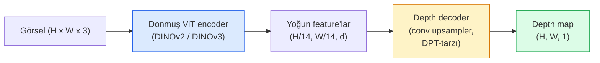

# Monocular Derinlik & Geometri Tahmini

> Bir depth map, her pikselin kameradan bir mesafe olduğu tek-kanallı bir görseldir. Tek bir RGB frame'den tahmin etmek stereo ya da LiDAR olmadan imkansızdı. 2026'da donmuş bir ViT encoder artı hafif bir head ground truth'un yüzde birkaçı içine giriyor.

**Tür:** Yapım + Kullan
**Diller:** Python
**Ön koşullar:** Faz 4 Ders 14 (ViT), Faz 4 Ders 17 (Self-Supervised Görü), Faz 4 Ders 07 (U-Net)
**Süre:** ~60 dakika

## Öğrenme Hedefleri

- Relative ve metric derinliği ayır ve her üretim modelinin (MiDaS, Marigold, Depth Anything V3, ZoeDepth) hangisini çözdüğünü söyle
- Hiç kalibrasyon olmadan keyfi tek görsel için derinlik tahmin etmek üzere Depth Anything V3 (DINOv2 backbone) kullan
- Monocular derinliğin tek bir görselden neden hiç çalıştığını (perspective ipuçları, doku gradyanları, öğrenilmiş prior'lar) ve neyi geri kazanamayacağını (mutlak ölçek, kapatılmış geometri) açıkla
- Bir depth map ve pinhole kamera intrinsics kullanarak 2D tespitleri 3D noktalara yükselt

## Sorun

Derinlik 2D bilgisayarlı görüdeki eksik eksendir. RGB verildiğinde, şeylerin görsel düzleminde nerede göründüğünü bilirsin; ne kadar uzakta olduklarını bilmezsin. Derinlik sensörleri (stereo rig'ler, LiDAR, time-of-flight) bunu doğrudan çözer ama pahalı, kırılgan ve aralıkta sınırlıdır.

Monocular derinlik tahmini — tek bir RGB frame'den derinlik tahmin etme — bulanık, güvenilmez çıktı üretirdi. 2026'ya gelindiğinde büyük pretrained encoder'lar bunu değiştirdi: Depth Anything V3 donmuş bir DINOv2 backbone kullanır ve iç, dış mekan, tıbbi ve uydu domain'lerinde genelleşen depth map'ler üretir. Marigold derinliği koşullu bir diffusion problemi olarak yeniden çerçeveler. ZoeDepth gerçek metrik mesafeleri regress eder.

Derinlik 2D detection ve 3D anlama arasındaki köprüdür de: tespit edilen bir kutunun piksellerini derinlikle çarp ve 2D nesneyi 3D bir point cloud'a yükseltirsin. Her AR occlusion sisteminin, her engelden-kaçınma pipeline'ının ve her "kupayı al" robotunun çekirdeği budur.

## Kavram

### Relative vs metric derinlik

- **Relative derinlik** — gerçek dünya birimi olmadan sıralı `z` değerleri. "Piksel A piksel B'den daha yakın, ama mesafelerin oranı metreye çapalanmamış."
- **Metric derinlik** — kameradan mutlak metre cinsinden mesafe. Modelin görsel ipuçları ile gerçek mesafe arasındaki istatistiksel ilişkiyi öğrenmiş olmasını gerektirir.

MiDaS ve Depth Anything V3 relative derinlik üretir. Marigold relative derinlik üretir. ZoeDepth, UniDepth ve Metric3D metric derinlik üretir. Metric modeller kamera intrinsics'lerine duyarlıdır; relative modeller değildir.

### Encoder-decoder kalıbı



Depth Anything V3 encoder'ı dondurur ve yalnızca DPT-tarzı decoder'ı eğitir. Encoder zengin feature'lar sağlar; decoder onları görsel çözünürlüğüne geri interpole eder ve derinliği regress eder.

### Tek bir görselin neden hiç derinlik ürettiği

2D bir görsel derinlikle korelasyonlu birçok monocular ipucu içerir:

- **Perspective** — 3D'de paralel çizgiler 2D'de birleşir.
- **Doku gradyanı** — uzaktaki yüzeyler daha küçük, daha yoğun dokuya sahiptir.
- **Occlusion sırası** — yakın nesneler uzak olanları kapatır.
- **Boyut sabitliği** — bilinen nesneler (arabalar, insanlar) yaklaşık ölçek verir.
- **Atmospheric perspective** — açık hava sahnelerinde uzak nesneler daha sisli ve maviye yakın görünür.

Milyarlarca görselde eğitilmiş bir ViT bu ipuçlarını içselleştirir. Yeterli veri ve güçlü bir backbone ile monocular derinlik herhangi bir explicit 3D denetim olmadan makul doğruluğa ulaşır.

### Monocular derinliğin yapamayacağı

- Intrinsics ya da sahnede bilinen bir nesne olmadan **mutlak metric ölçek**. Ağ kupanın 1 m mi 10 m mi uzakta olduğunu bilmeden "kupa kaşıktan iki kat daha uzakta" tahmin edebilir.
- **Kapatılmış geometri** — sandalyenin arkası görünmez ve güvenilir şekilde çıkarılamaz.
- **Gerçekten dokusuz / yansıtıcı yüzeyler** — aynalar, cam, uniform duvarlar. Ağ makul ama yanlış derinlik raporlar.

### 2026'da Depth Anything V3

- Encoder olarak vanilla DINOv2 ViT-L/14 (donmuş).
- DPT decoder.
- Çeşitli kaynaklardan pozlu görsel çiftleri üzerinde eğitilmiş (fotometrik tutarlılık ötesinde açık derinlik denetimi gerekmez).
- **Bilinen kamera pozlarıyla ya da onsuz keyfi sayıda görsel girdiden** uzaysal olarak tutarlı geometri tahmin eder.
- Monocular derinlik, any-view geometri, görsel rendering, kamera poz tahmininde SOTA.

2026'da derinliğe ihtiyacın olduğunda çağıracağın drop-in modeldir.

### Marigold — derinlik için diffusion

Marigold (Ke et al., CVPR 2024) depth estimation'ı koşullu image-to-image diffusion olarak yeniden çerçeveler. Koşullama: RGB. Hedef: depth map. Backbone olarak pretrained Stable Diffusion 2 U-Net kullanır. Çıktı depth map'leri nesne sınırlarında olağanüstü keskindir. Trade-off: feed-forward modellerinden daha yavaş çıkarım (10-50 denoising adımı).

### Intrinsics ve pinhole kamera

Derinliği `d` olan bir `(u, v)` pikseli kamera koordinatlarındaki bir 3D nokta `(X, Y, Z)`'ye yükseltmek için:

```
fx, fy, cx, cy = kamera intrinsics
X = (u - cx) * d / fx
Y = (v - cy) * d / fy
Z = d
```

Intrinsics EXIF metadata'sından, bir kalibrasyon kalıbından ya da monocular bir intrinsics estimator'ından (Perspective Fields, UniDepth) gelir. Intrinsics olmadan da 60-70° FOV ve orta-çözünürlük principal'ları varsayarak bir point cloud render edebilirsin — görselleştirme için kullanılabilir, ölçüm için değil.

### Değerlendirme

İki standart metrik:

- **AbsRel** (mutlak görece hata): `mean(|d_pred - d_gt| / d_gt)`. Daha düşük daha iyi. Üretim modelleri için 0.05-0.1.
- **delta < 1.25** (eşik doğruluğu): `max(d_pred/d_gt, d_gt/d_pred) < 1.25` olan piksellerin fraksiyonu. Daha yüksek daha iyi. SOTA için 0.9+.

Relative derinlik (Depth Anything V3, MiDaS) için değerlendirme her iki metriğin scale-and-shift invariant versiyonlarını kullanır.

## İnşa Et

### Adım 1: Derinlik metrikleri

```python
import torch

def abs_rel_error(pred, target, mask=None):
    if mask is not None:
        pred = pred[mask]
        target = target[mask]
    return (torch.abs(pred - target) / target.clamp(min=1e-6)).mean().item()


def delta_accuracy(pred, target, threshold=1.25, mask=None):
    if mask is not None:
        pred = pred[mask]
        target = target[mask]
    ratio = torch.maximum(pred / target.clamp(min=1e-6), target / pred.clamp(min=1e-6))
    return (ratio < threshold).float().mean().item()
```

Değerlendirmeden önce her zaman geçersiz derinlik piksellerini (sıfır, NaN, satüre) maskele.

### Adım 2: Scale-and-shift hizalama

Relative-derinlik modelleri için metrikleri hesaplamadan önce tahmini ground truth'a hizala. `a * pred + b = target`'in least-squares fit'i:

```python
def align_scale_shift(pred, target, mask=None):
    if mask is not None:
        p = pred[mask]
        t = target[mask]
    else:
        p = pred.flatten()
        t = target.flatten()
    A = torch.stack([p, torch.ones_like(p)], dim=1)
    coeffs, *_ = torch.linalg.lstsq(A, t.unsqueeze(-1))
    a, b = coeffs[:2, 0]
    return a * pred + b
```

MiDaS / Depth Anything değerlendirirken `abs_rel_error`'dan önce `align_scale_shift` çalıştır.

### Adım 3: Derinliği bir point cloud'a yükselt

```python
import numpy as np

def depth_to_point_cloud(depth, intrinsics):
    H, W = depth.shape
    fx, fy, cx, cy = intrinsics
    v, u = np.meshgrid(np.arange(H), np.arange(W), indexing="ij")
    z = depth
    x = (u - cx) * z / fx
    y = (v - cy) * z / fy
    return np.stack([x, y, z], axis=-1)


depth = np.random.uniform(0.5, 4.0, (240, 320))
intr = (320.0, 320.0, 160.0, 120.0)
pc = depth_to_point_cloud(depth, intr)
print(f"point cloud shape: {pc.shape}  (H, W, 3)")
```

Bir fonksiyon, her 3D-yükseltilmiş uygulama. Point cloud'u `.ply`'ye export et ve MeshLab ya da CloudCompare'da aç.

### Adım 4: Sentetik derinlik sahnesiyle smoke test

```python
def synthetic_depth(size=96):
    yy, xx = np.meshgrid(np.arange(size), np.arange(size), indexing="ij")
    # Floor: üstten (yakın) alta (uzak) lineer gradyan
    depth = 1.0 + (yy / size) * 4.0
    # Ortada kutu: daha yakın
    mask = (np.abs(xx - size / 2) < size / 6) & (np.abs(yy - size * 0.6) < size / 6)
    depth[mask] = 2.0
    return depth.astype(np.float32)


gt = torch.from_numpy(synthetic_depth(96))
pred = gt + 0.3 * torch.randn_like(gt)  # simüle edilmiş tahmin
aligned = align_scale_shift(pred, gt)
print(f"hizalama öncesi  absRel = {abs_rel_error(pred, gt):.3f}")
print(f"hizalama sonrası absRel = {abs_rel_error(aligned, gt):.3f}")
```

### Adım 5: Depth Anything V3 kullanımı (referans)

```python
import torch
from transformers import pipeline
from PIL import Image

pipe = pipeline(task="depth-estimation", model="LiheYoung/depth-anything-v2-large")

image = Image.open("street.jpg").convert("RGB")
out = pipe(image)
depth_np = np.array(out["depth"])
```

Üç satır. `out["depth"]` bir PIL grayscale'idir; matematik için numpy'a dönüştür. Spesifik olarak Depth Anything V3 için yayınlandığında model id'sini değiştir; API değişmez.

## Kullan

- **Depth Anything V3** (Meta AI / ByteDance, 2024-2026) — relative derinlik için varsayılan. Üretimdeki en hızlı ViT-large-backbone modeli.
- **Marigold** (ETH, 2024) — en yüksek görsel kalite, yavaş çıkarım.
- **UniDepth** (ETH, 2024) — kamera intrinsics tahminiyle metric derinlik.
- **ZoeDepth** (Intel, 2023) — metric derinlik; daha eski, hâlâ güvenilir.
- **MiDaS v3.1** — legacy ama kararlı; karşılaştırma için iyi bir baseline.

Tipik entegrasyon kalıbı:

1. RGB frame gelir.
2. Derinlik modeli depth map üretir.
3. Detector kutular üretir.
4. Kutu centroid'lerini derinlik üzerinden 3D'ye yükselt; mevcutsa point cloud ile birleştir.
5. Downstream: AR occlusion, path planning, nesne-boyut tahmini, stereo değişimi.

Gerçek-zamanlı kullanım için Depth Anything V2 Small (INT8 quantize) tüketici GPU'da 518x518'de ~30 fps'ye ulaşır.

## Yayınla

Bu ders şunları üretir:

- `outputs/prompt-depth-model-picker.md` — latency, metric-vs-relative ihtiyacı ve sahne türüne göre Depth Anything V3, Marigold, UniDepth, MiDaS arasında seçim yapar.
- `outputs/skill-depth-to-pointcloud.md` — doğru intrinsics yönetimi ile depth map'lerden point cloud kuran ve `.ply`'ye export eden bir skill.

## Alıştırmalar

1. **(Kolay)** Masan üzerindeki herhangi 10 görsel üzerinde Depth Anything V2 çalıştır. Derinliği grayscale PNG olarak kaydet ve incele. Tahmin edilen derinliği yanlış görünen bir nesne tanımla ve monocular ipuçlarının neden başarısız olduğunu açıkla.
2. **(Orta)** Depth Anything V2'den RGB + derinlik verildiğinde, bir point cloud'a yükselt ve `open3d` ile render et. İki sahneyi (iç / dış mekan) karşılaştır ve hangisinin daha inandırıcı göründüğünü not et.
3. **(Zor)** Yalnızca bilinen bir nesnenin konumuyla farklı olan beş görsel çifti al (örn. şişe 30 cm daha yakına taşındı). UniDepth kullanarak her ikisinde metric derinlik tahmin et. Öngörülen mesafe delta'yı gerçek 30 cm'e karşı raporla.

## Anahtar Terimler

| Terim | İnsanlar ne diyor | Gerçekte ne anlama geliyor |
|------|----------------|----------------------|
| Monocular derinlik | "Tek-görsel derinliği" | Bir RGB frame'den derinlik tahmini, stereo ya da LiDAR yok |
| Relative derinlik | "Sıralı derinlik" | Gerçek dünya birimleri olmadan sıralı z-değerleri |
| Metric derinlik | "Mutlak mesafe" | Metre cinsinden derinlik; kalibrasyon ya da metric denetimle eğitilmiş model gerektirir |
| AbsRel | "Mutlak görece hata" | |d_pred - d_gt| / d_gt'nin mean'i; standart derinlik metriği |
| Delta accuracy | "delta < 1.25" | Tahmini ground truth'un %25'i içinde olan piksellerin fraksiyonu |
| Pinhole camera | "fx, fy, cx, cy" | (u, v, d)'yi (X, Y, Z)'ye yükseltmek için kullanılan kamera modeli |
| DPT | "Dense Prediction Transformer" | Derinlik için donmuş ViT encoder'ların üstünde kullanılan conv-tabanlı decoder |
| DINOv2 backbone | "Çalışmasının nedeni" | Derinlik etiketleri olmadan domain'ler arası genelleşen self-supervised feature'lar |

## İleri Okuma

- [Depth Anything V3 paper page](https://depth-anything.github.io/) — DINOv2 encoder ile SOTA monocular derinlik
- [Marigold (Ke et al., CVPR 2024)](https://marigoldmonodepth.github.io/) — diffusion-tabanlı depth estimation
- [UniDepth (Piccinelli et al., 2024)](https://arxiv.org/abs/2403.18913) — intrinsics ile metric derinlik
- [MiDaS v3.1 (Intel ISL)](https://github.com/isl-org/MiDaS) — canonical relative-derinlik baseline'ı
- [DINOv3 blog post (Meta)](https://ai.meta.com/blog/dinov3-self-supervised-vision-model/) — derinlik doğruluğunu yükselten encoder ailesi
