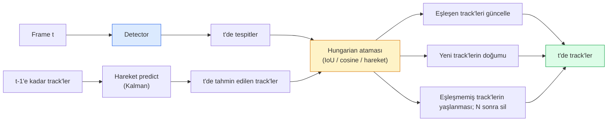

# Multi-Object Tracking & Video Belleği

> Tracking detection artı ilişkilendirmedir. Her frame'i tespit et. Bu frame'in tespitlerini son frame'in track'leriyle ID ile eşle.

**Tür:** Yapım
**Diller:** Python
**Ön koşullar:** Faz 4 Ders 06 (YOLO Detection), Faz 4 Ders 08 (Mask R-CNN), Faz 4 Ders 24 (SAM 3)
**Süre:** ~60 dakika

## Öğrenme Hedefleri

- Tracking-by-detection'ı query-tabanlı tracking'den ayır ve algoritma ailelerini adlandır (SORT, DeepSORT, ByteTrack, BoT-SORT, SAM 2 memory tracker, SAM 3.1 Object Multiplex)
- Klasik tracking-by-detection için sıfırdan IoU + Hungarian ataması uygula
- SAM 2'nin memory bank'ını ve neden occlusion'ı IoU-tabanlı ilişkilendirmeden daha iyi işlediğini açıkla
- Üç tracking metriğini (MOTA, IDF1, HOTA) oku ve verili bir use case için hangisinin önemli olduğunu seç

## Sorun

Bir detector tek bir frame'de nesnelerin nerede olduğunu söyler. Bir tracker, `t` frame'indeki hangi tespitin `t-1` frame'indeki bir tespitle aynı nesne olduğunu söyler. O olmadan, bir çizgiyi geçen nesneleri sayamazsın, bir topu bir occlusion boyunca takip edemezsin ya da "araba #4 şeritte 8 saniyedir" diyemezsin.

Tracking her video-yüzlü ürün için essential'dır: spor analitiği, gözetim, otonom sürüş, tıbbi video analizi, vahşi yaşam izleme, wordmark sayma. Çekirdek yapı taşları paylaşımlıdır: frame başına bir detector, bir hareket modeli (Kalman filter ya da daha zengin bir şey), bir ilişkilendirme adımı (IoU / cosine / öğrenilmiş feature'lar üzerinde Hungarian algoritması) ve bir track yaşam döngüsü (doğum, güncelleme, ölüm).

2026 iki yeni kalıp getirdi: **SAM 2 memory-tabanlı tracking** (hareket-modeli ilişkilendirmesi yerine feature-memory) ve **SAM 3.1 Object Multiplex** (aynı kavramın birçok instance'ı için paylaşılan bellek). Bu ders önce klasik stack'i, sonra memory-tabanlı yaklaşımı yürür.

## Kavram

### Tracking-by-detection



2026'da karşılaşacağın her tracker bu döngünün bir varyasyonudur. Farklar:

- **SORT** (2016): Kalman filter + IoU Hungarian. Basit, hızlı, görünüş modeli yok.
- **DeepSORT** (2017): SORT + track başına CNN-tabanlı görünüş feature'ı (ReID embedding). Geçişleri daha iyi işler.
- **ByteTrack** (2021): düşük-güvenli tespitleri ikinci aşama olarak ilişkilendirir; görünüş feature'ı gerektirmez ama MOT17'de en iyi performans gösteren.
- **BoT-SORT** (2022): Byte + kamera hareket telafisi + ReID.
- **StrongSORT / OC-SORT** — daha iyi hareket ve görünüşle ByteTrack soyundan gelenler.

### Tek paragrafta Kalman filter

Bir Kalman filter, track başına `(x, y, w, h, dx, dy, dw, dh)` state'ini bir kovaryans ile tutar. Her frame'de state'i sabit hız modeli ile **predict** et, sonra eşleşen tespitle **update** et. Predict belirsizliği yüksek olduğunda update tespite daha çok güvenir. Bu pürüzsüz yörüngeler ve kısa bir occlusion (1-5 frame) boyunca bir track'i devam ettirme yeteneği verir.

Her klasik tracker hareket-tahmin adımında bir Kalman filter kullanır.

### Hungarian algoritması

Bir `M x N` maliyet matrisi (track'ler x tespitler) verildiğinde, toplam maliyeti minimize eden bire-bir atamayı bul. Maliyet genellikle `1 - IoU(track_bbox, detection_bbox)` ya da görünüş feature'larının negatif cosine benzerliğidir. Runtime O((M+N)^3); M, N ~1000'e kadar Python'da `scipy.optimize.linear_sum_assignment` üzerinden yeterince hızlıdır.

### ByteTrack'in ana fikri

Standart tracker'lar düşük-güvenli tespitleri (< 0.5) atar. ByteTrack onları **ikinci aşama adayları** olarak tutar: track'leri yüksek-güvenli tespitlere eşledikten sonra, eşleşmemiş track'ler biraz daha gevşek bir IoU eşiğiyle düşük-güvenli tespitleri eşlemeyi dener. Kısa occlusion'ları, kalabalıklara yakın ID değişimlerini geri kazanır.

### SAM 2 memory-tabanlı tracking

SAM 2 videoyu instance başına spatio-temporal feature'ların bir **memory bank**'ini tutarak işler. Bir frame'de bir prompt (tıklama, kutu, metin) verildiğinde, instance'ı belleğe encode eder. Sonraki frame'lerde bellek yeni frame'in feature'larına karşı cross-attend edilir ve decoder yeni frame'de aynı instance için bir mask üretir.

Kalman filter yok, Hungarian ataması yok. İlişkilendirme memory-attention operasyonunda implicit'tir.

Artıları:
- Büyük occlusion'lara dayanıklı (bellek instance kimliğini birçok frame boyunca taşır).
- SAM 3'ün metin prompt'larıyla birleştiğinde open-vocabulary.
- Ayrı bir hareket modeli olmadan çalışır.

Eksileri:
- Çok-nesneli tracking için ByteTrack'ten daha yavaş.
- Memory bank büyür; bağlam penceresini sınırlar.

### SAM 3.1 Object Multiplex

Önceki SAM 2 / SAM 3 tracking, instance başına ayrı bir memory bank tutar. 50 nesne için 50 memory bank. Object Multiplex (Mart 2026) bunları **instance başına query token'larla** tek bir paylaşılan belleğe çöktürür. Maliyet instance sayısında alt-lineer ölçeklenir.

Multiplex 2026'da kalabalık tracking için yeni varsayılandır: konser kalabalıkları, depo çalışanları, trafik kavşakları.

### Bilmen gereken üç metrik

- **MOTA (Multi-Object Tracking Accuracy)** — 1 - (FN + FP + ID değişimi) / GT. Hata türüne göre ağırlıklı; detection ve ilişkilendirme başarısızlıklarını birleştiren tek metrik.
- **IDF1 (ID F1)** — ID precision ve recall'un harmonik ortalaması. Her ground-truth track'in zamanla ID'sini ne kadar iyi koruduğuna özel olarak odaklanır. ID-değişimine duyarlı görevler için MOTA'dan daha iyi.
- **HOTA (Higher Order Tracking Accuracy)** — detection accuracy (DetA) ve association accuracy (AssA)'ya ayrışır. 2020'den beri topluluk standardı; en kapsamlısı.

Gözetim için (kim kim): IDF1 raporladığın şeydir. Spor analitiği için (geçişleri sayma): HOTA. Genel akademik karşılaştırma için: HOTA.

## İnşa Et

### Adım 1: IoU-tabanlı maliyet matrisi

```python
import numpy as np


def bbox_iou(a, b):
    """
    a, b: [x1, y1, x2, y2]'lerin (N, 4) array'leri.
    (N_a, N_b) IoU matrisini döndürür.
    """
    ax1, ay1, ax2, ay2 = a[:, 0], a[:, 1], a[:, 2], a[:, 3]
    bx1, by1, bx2, by2 = b[:, 0], b[:, 1], b[:, 2], b[:, 3]
    inter_x1 = np.maximum(ax1[:, None], bx1[None, :])
    inter_y1 = np.maximum(ay1[:, None], by1[None, :])
    inter_x2 = np.minimum(ax2[:, None], bx2[None, :])
    inter_y2 = np.minimum(ay2[:, None], by2[None, :])
    inter = np.clip(inter_x2 - inter_x1, 0, None) * np.clip(inter_y2 - inter_y1, 0, None)
    area_a = (ax2 - ax1) * (ay2 - ay1)
    area_b = (bx2 - bx1) * (by2 - by1)
    union = area_a[:, None] + area_b[None, :] - inter
    return inter / np.clip(union, 1e-8, None)
```

### Adım 2: Minimal SORT-tarzı tracker

Sabit sabit-hız Kalman kısalık için atlandı — burada basit bir IoU ilişkilendirmesi kullanıyoruz; üretimde Kalman predict essential'dır. `sort` Python paketi tam versiyonu sağlar.

```python
from scipy.optimize import linear_sum_assignment


class Track:
    def __init__(self, tid, bbox, frame):
        self.id = tid
        self.bbox = bbox
        self.last_frame = frame
        self.hits = 1

    def update(self, bbox, frame):
        self.bbox = bbox
        self.last_frame = frame
        self.hits += 1


class SimpleTracker:
    def __init__(self, iou_threshold=0.3, max_age=5):
        self.tracks = []
        self.next_id = 1
        self.iou_threshold = iou_threshold
        self.max_age = max_age

    def step(self, detections, frame):
        if not self.tracks:
            for d in detections:
                self.tracks.append(Track(self.next_id, d, frame))
                self.next_id += 1
            return [(t.id, t.bbox) for t in self.tracks]

        track_boxes = np.array([t.bbox for t in self.tracks])
        det_boxes = np.array(detections) if len(detections) else np.empty((0, 4))

        iou = bbox_iou(track_boxes, det_boxes) if len(det_boxes) else np.zeros((len(track_boxes), 0))
        cost = 1 - iou
        cost[iou < self.iou_threshold] = 1e6

        matched_track = set()
        matched_det = set()
        if cost.size > 0:
            row, col = linear_sum_assignment(cost)
            for r, c in zip(row, col):
                if cost[r, c] < 1.0:
                    self.tracks[r].update(det_boxes[c], frame)
                    matched_track.add(r); matched_det.add(c)

        for i, d in enumerate(det_boxes):
            if i not in matched_det:
                self.tracks.append(Track(self.next_id, d, frame))
                self.next_id += 1

        self.tracks = [t for t in self.tracks if frame - t.last_frame <= self.max_age]
        return [(t.id, t.bbox) for t in self.tracks]
```

60 satır. Frame başına tespitleri alır, frame başına track ID'leri döndürür. Gerçek sistemler Kalman predict, ByteTrack'in ikinci-aşama yeniden-eşlemesi ve görünüş feature'ları ekler.

### Adım 3: Sentetik yörünge testi

```python
def synthetic_frames(num_frames=20, num_objects=3, H=240, W=320, seed=0):
    rng = np.random.default_rng(seed)
    starts = rng.uniform(20, 200, size=(num_objects, 2))
    velocities = rng.uniform(-5, 5, size=(num_objects, 2))
    frames = []
    for f in range(num_frames):
        dets = []
        for i in range(num_objects):
            cx, cy = starts[i] + f * velocities[i]
            dets.append([cx - 10, cy - 10, cx + 10, cy + 10])
        frames.append(dets)
    return frames


tracker = SimpleTracker()
for f, dets in enumerate(synthetic_frames()):
    tracks = tracker.step(dets, f)
```

Düz çizgilerde hareket eden üç nesne tüm 20 frame boyunca ID'lerini korumalı.

### Adım 4: ID-switch metriği

```python
def count_id_switches(tracks_per_frame, gt_per_frame):
    """
    tracks_per_frame:  (track_id, bbox) listelerinin listesi
    gt_per_frame:      (gt_id, bbox) listelerinin listesi
    Returns ID değişim sayısı.
    """
    prev_assignment = {}
    switches = 0
    for tracks, gts in zip(tracks_per_frame, gt_per_frame):
        if not tracks or not gts:
            continue
        t_boxes = np.array([b for _, b in tracks])
        g_boxes = np.array([b for _, b in gts])
        iou = bbox_iou(g_boxes, t_boxes)
        for g_idx, (gt_id, _) in enumerate(gts):
            j = iou[g_idx].argmax()
            if iou[g_idx, j] > 0.5:
                t_id = tracks[j][0]
                if gt_id in prev_assignment and prev_assignment[gt_id] != t_id:
                    switches += 1
                prev_assignment[gt_id] = t_id
    return switches
```

Bu basitleştirilmiş IDF1-bitişik metriğidir: bir ground-truth nesnesinin atanmış öngörülen track ID'sinin kaç kez değiştiğini say. Gerçek MOTA / IDF1 / HOTA araçları `py-motmetrics` ve `TrackEval`'da yaşar.

## Kullan

2026'da üretim tracker'ları:

- `ultralytics` — yerleşik YOLOv8 + ByteTrack / BoT-SORT. `results = model.track(source, tracker="bytetrack.yaml")`. Varsayılan.
- `supervision` (Roboflow) — annotation yardımcılarıyla ByteTrack sargıları.
- SAM 2 / SAM 3.1 — `processor.track()` üzerinden memory-tabanlı tracking.
- Özel stack: detector (YOLOv8 / RT-DETR) + `sort-tracker` / `OC-SORT` / `StrongSORT`.

Seçim:

- 30+ fps'de yaya / araba / kutular: **ultralytics ile ByteTrack**.
- Kalabalıkta bir sınıfın birçok instance'ı: **SAM 3.1 Object Multiplex**.
- Tanımlanabilir görünüşle ağır occlusion'lar: **DeepSORT / StrongSORT** (ReID feature'ları).
- Spor / karmaşık etkileşimler: **BoT-SORT** ya da öğrenilmiş tracker'lar (MOTRv3).

## Yayınla

Bu ders şunları üretir:

- `outputs/prompt-tracker-picker.md` — sahne türü, occlusion kalıpları ve latency bütçesine göre SORT / ByteTrack / BoT-SORT / SAM 2 / SAM 3.1 seçer.
- `outputs/skill-mot-evaluator.md` — ground-truth track'lere karşı MOTA / IDF1 / HOTA için komple bir değerlendirme harness'i yazar.

## Alıştırmalar

1. **(Kolay)** Yukarıdaki sentetik tracker'ı 3, 10 ve 30 nesne ile çalıştır. Her durumda ID-switch sayısını raporla. Basit yalnız-IoU ilişkilendirmesinin başarısız olmaya başladığı yeri belirle.
2. **(Orta)** İlişkilendirmeden önce sabit-hız Kalman predict adımı ekle. Kısa (2-3 frame) occlusion'ların artık ID değişimlerine neden olmadığını göster.
3. **(Zor)** SAM 2'nin memory-tabanlı tracker'ını (`transformers` üzerinden) alternatif tracker backend olarak entegre et. Hem SimpleTracker hem SAM 2'yi 30 saniyelik bir kalabalık clip'inde çalıştır ve 5 belirgin kişi için ground-truth ID'leri elle etiketleyerek ID-switch sayılarını karşılaştır.

## Anahtar Terimler

| Terim | İnsanlar ne diyor | Gerçekte ne anlama geliyor |
|------|----------------|----------------------|
| Tracking-by-detection | "Önce tespit sonra ilişkilendir" | Frame başına detector + IoU / görünüş üzerinde Hungarian ataması |
| Kalman filter | "Hareket predict" | Pürüzsüz track tahminleri ve occlusion yönetimi için lineer dinamik + kovaryans |
| Hungarian algoritması | "Optimum atama" | Minimum-maliyetli bipartite matching problemini çözer; `scipy.optimize.linear_sum_assignment` |
| ByteTrack | "Düşük-güven ikinci geçiş" | Kısa occlusion'ları geri kazanmak için eşleşmemiş track'leri düşük-güvenli tespitlere yeniden eşle |
| DeepSORT | "SORT + görünüş" | Cross-frame eşleştirme için bir ReID feature'ı ekler; ID korumasında daha iyi |
| Memory bank | "SAM 2 hilesi" | Frame'ler arası saklanan instance başına spatio-temporal feature'lar; cross-attention explicit ilişkilendirmenin yerini alır |
| Object Multiplex | "SAM 3.1 paylaşılan bellek" | Hızlı çok-nesneli tracking için instance başına query'lerle tek paylaşılan bellek |
| HOTA | "Modern tracking metriği" | Detection ve association doğruluğuna ayrışır; topluluk standardı |

## İleri Okuma

- [SORT (Bewley et al., 2016)](https://arxiv.org/abs/1602.00763) — minimal tracking-by-detection makalesi
- [DeepSORT (Wojke et al., 2017)](https://arxiv.org/abs/1703.07402) — görünüş feature'ı ekler
- [ByteTrack (Zhang et al., 2022)](https://arxiv.org/abs/2110.06864) — düşük-güven ikinci geçişi
- [BoT-SORT (Aharon et al., 2022)](https://arxiv.org/abs/2206.14651) — kamera hareket telafisi
- [HOTA (Luiten et al., 2020)](https://arxiv.org/abs/2009.07736) — ayrıştırılmış tracking metriği
- [SAM 2 video segmentation (Meta, 2024)](https://ai.meta.com/sam2/) — memory-tabanlı tracker
- [SAM 3.1 Object Multiplex (Meta, March 2026)](https://ai.meta.com/blog/segment-anything-model-3/)
