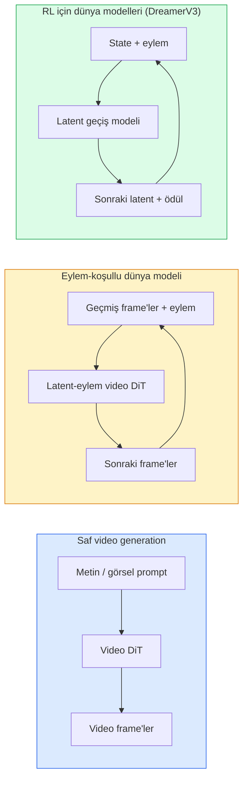

# Dünya Modelleri & Video Diffusion

> Bir sahnenin sonraki saniyelerini tahmin eden bir video modeli bir dünya simülatörüdür. O tahmini eylemlere koşulla ve öğrenilmiş bir game engine elde edersin.

**Tür:** Öğrenim + Yapım
**Diller:** Python
**Ön koşullar:** Faz 4 Ders 10 (Diffusion), Faz 4 Ders 12 (Video Anlama), Faz 4 Ders 23 (DiT + Rectified Flow)
**Süre:** ~75 dakika

## Öğrenme Hedefleri

- Saf bir video generation modeli (Sora 2) ile eylem-koşullu bir dünya modeli (Genie 3, DreamerV3) arasındaki farkı açıkla
- Bir video DiT'i tarif et: spatio-temporal patch'ler, 3D pozisyon encoding'i, (T, H, W) token'larında joint attention
- Bir dünya modelinin robotiğe nasıl bağlandığını izle: VLM planlar → video modeli simüle eder → inverse dynamics eylemleri yayar
- Verili bir use case (yaratıcı video, etkileşimli sim, otonom sürüş sentezi) için Sora 2, Genie 3, Runway GWM-1 Worlds, Wan-Video ve HunyuanVideo arasında seç

## Sorun

Video generation ve dünya modelleme 2026'da yakınsadı. Tutarlı bir dakika video üretebilen bir model, bir anlamda dünyanın nasıl hareket ettiğini öğrenmiştir: nesne sürekliliği, yerçekimi, nedensellik, stil. O tahmini eylemlere (sola yürü, kapıyı aç) koşullarsan, video modeli bir game engine'ı, bir sürüş simülatörünü ya da bir robotik ortamını değiştirebilecek öğrenilebilir bir simülatöre dönüşür.

Riskler somut. Genie 3 tek bir görselden oynanabilir ortamlar üretir. Runway GWM-1 Worlds sonsuz keşfedilebilir sahneler sentezler. Sora 2 senkron ses ve modellenmiş fizik ile dakika uzunluğunda videolar üretir. NVIDIA Cosmos-Drive, Wayve Gaia-2 ve Tesla DrivingWorld otonom-araç eğitim verisi için gerçekçi sürüş videosu üretir. Dünya-modeli paradigması sessizce robotik için sim-to-real'i ele geçiriyor.

Bu ders Faz 4 için "büyük resim" dersidir. Görsel generation, video anlama ve agentic muhakemeyi baskın araştırmanın hareket ettiği mimari kalıba bağlar.

## Kavram

### Dünya-modellemenin üç ailesi



- **Sora 2** prompt'lara koşullu saf video generation'dır. Eylem arayüzü yok. Rollout ortasında onu "yönlendiremezsin".
- **Genie 3**, **GWM-1 Worlds**, **Mirage / Magica** eylem-koşullu dünya modelleridir. Gözlemlenen videodan latent eylemleri çıkar, sonra gelecekteki frame tahminlerini eylemlere koşulla. Etkileşimli — tuşlara basarsın ya da bir kamera hareket ettirirsin ve sahne yanıt verir.
- **DreamerV3** ve klasik RL dünya-modeli ailesi explicit eylem koşullamasıyla bir latent uzayda tahmin eder, bir ödül sinyali üzerinde eğitilir. Daha az görsel; sample-verimli RL için daha faydalı.

### Video DiT mimarisi

```
Video latent:          (C, T, H, W)
Patchify (uzaysal):    frame başına P_h x P_w patch grid'i
Patchify (temporal):   P_t frame'i bir temporal patch'e grupla
Sonuç token'lar:       (T / P_t) * (H / P_h) * (W / P_w) token
```

Pozisyon encoding'i 3D'dir: (t, h, w) koordinatı başına rotary ya da öğrenilmiş embedding. Attention şu olabilir:

- **Full joint** — tüm token'lar tüm token'lara attend eder. N token ile O(N^2). Uzun videolar için yasakça.
- **Divided** — temporal attention (aynı uzaysal konum, zaman boyunca: `(H*W) * T^2`) ve spatial attention (aynı timestep, uzay boyunca: `T * (H*W)^2`) alternatifler. TimeSformer ve çoğu video DiT tarafından kullanılır.
- **Window** — (t, h, w)'da yerel pencereler. Video Swin tarafından kullanılır.

Her 2026 video diffusion modeli bu üç kalıptan birini artı AdaLN koşullamayı (Ders 23) ve rectified flow'u kullanır.

### Eylemlere koşullama: latent action modelleri

Genie, ardışık iki frame arasındaki eylemi ayırt edici olarak tahmin ederek frame başına bir **latent eylem** öğrenir. Modelin decoder'ı sonra çıkarılan latent eyleme koşullanır — explicit klavye tuşlarına değil. Çıkarımda kullanıcı bir latent eylem belirtebilir (ya da yeni bir prior'dan sample edebilir) ve model o eylemle tutarlı sonraki frame'i üretir.

Sora eylem arayüzünü tamamen atlar. Decoder'ı geçmiş spacetime token'larından sonraki spacetime token'larını tahmin eder. Prompt başlangıcı koşullar; generation ortasında hiçbir şey yönlendirmez.

### Fiziksel makullük

Sora 2'nin 2026 yayını açıkça **fiziksel makullüğü** reklam etti: ağırlık, denge, nesne sürekliliği, neden-sonuç. Ekip tarafından elle-puanlı makullük skorlarıyla ölçülür; model bırakılan nesneler, çarpışan karakterler ve kasıtlı başarısızlıklar (kaçırılmış bir sıçrama) üzerinde Sora 1'e göre görünür şekilde iyileşir.

Makullük baskın başarısızlık modu olmaya devam ediyor. 2024-2025 insanların spagetti yediği ya da bardaklardan içtiği videolar modelin kalıcı nesne temsili eksikliğini ortaya koydu. 2026 modelleri (Sora 2, Runway Gen-5, HunyuanVideo) bunları azaltır ama elimine etmez.

### Otonom sürüş dünya modelleri

Sürüş dünya modelleri yörüngeler, bounding box'lar ya da navigasyon haritalarına koşullu gerçekçi yol sahneleri üretir. Kullanım:

- **Cosmos-Drive-Dreams** (NVIDIA) — RL eğitimi için dakikalarca sürüş videosu üretir.
- **Gaia-2** (Wayve) — politika değerlendirmesi için yörünge-koşullu sahne sentezi.
- **DrivingWorld** (Tesla) — çeşitli hava, günün saati, trafik koşullarını simüle eder.
- **Vista** (ByteDance) — reaktif sürüş sahne sentezi.

Aksi halde milyonlarca mil sürüş gerektirecek köşe durumları için — gece yaya geçişleri, buzlu kavşaklar, alışılmadık araç türleri — pahalı gerçek-dünya veri toplamanın yerini alırlar.

### Robotik stack: VLM + video modeli + inverse dynamics

Yükselen üç-bileşenli robotik döngüsü:

1. **VLM** hedefi parse eder ("kırmızı kupayı al"), yüksek-seviyeli eylem dizisi planlar.
2. **Video generation modeli** her eylemi gerçekleştirmenin nasıl görüneceğini simüle eder — N frame ileride gözlemleri tahmin eder.
3. **Inverse dynamics modeli** o gözlemleri üretecek somut motor komutlarını çıkarır.

Bu reward shaping ve sample-ağır RL'in yerini alır. Dünya modeli hayal eder; inverse dynamics aktüasyon üzerinde döngüyü kapatır. Genie Envisioner bir instantiation'dır; birçok araştırma grubu bu yapıya yakınsıyor.

### Değerlendirme

- **Görsel kalite** — FVD (Fréchet Video Distance), kullanıcı çalışmaları.
- **Prompt hizalaması** — frame başına CLIPScore, VQA tarzı değerlendirme.
- **Fiziksel makullük** — bir benchmark suite'inde elle-puanlanmış (Sora 2'nin iç benchmark'ı, VBench).
- **Kontrol edilebilirlik** (etkileşimli dünya modelleri için) — eylem → gözlem tutarlılığı; önceki bir state'e geri dönebilir misin?

### 2026'da model manzarası

| Model | Kullanım | Parametre | Çıktı | Lisans |
|-------|-----|------------|--------|---------|
| Sora 2 | text-to-video, ses | — | 1-dak 1080p + ses | yalnız API |
| Runway Gen-5 | text/image-to-video | — | 10s clip'ler | API |
| Runway GWM-1 Worlds | etkileşimli dünya | — | sonsuz 3D rollout | API |
| Genie 3 | görselden etkileşimli dünya | 11B+ | oynanabilir frame'ler | araştırma önizlemesi |
| Wan-Video 2.1 | açık text-to-video | 14B | yüksek-kaliteli clip'ler | non-commercial |
| HunyuanVideo | açık text-to-video | 13B | 10s clip'ler | permissive |
| Cosmos / Cosmos-Drive | otonom sürüş sim | 7-14B | sürüş sahneleri | NVIDIA açık |
| Magica / Mirage 2 | AI-native game engine | — | düzenlenebilir dünyalar | ürün |

## İnşa Et

### Adım 1: Video için 3D patchify

```python
import torch
import torch.nn as nn


class VideoPatch3D(nn.Module):
    def __init__(self, in_channels=4, dim=64, patch_t=2, patch_h=2, patch_w=2):
        super().__init__()
        self.proj = nn.Conv3d(
            in_channels, dim,
            kernel_size=(patch_t, patch_h, patch_w),
            stride=(patch_t, patch_h, patch_w),
        )
        self.patch_t = patch_t
        self.patch_h = patch_h
        self.patch_w = patch_w

    def forward(self, x):
        # x: (N, C, T, H, W)
        x = self.proj(x)
        n, c, t, h, w = x.shape
        tokens = x.reshape(n, c, t * h * w).transpose(1, 2)
        return tokens, (t, h, w)
```

Stride'ı kernel'a eşit bir 3D conv spatio-temporal patchifier olarak çalışır. `(T, H, W) -> (T/2, H/2, W/2)` token grid'i.

### Adım 2: 3D rotary position encoding

`t`, `h`, `w` eksenleri boyunca ayrı uygulanan Rotary Position Embedding (RoPE):

```python
def rope_3d(tokens, t_dim, h_dim, w_dim, grid):
    """
    tokens: (N, T*H*W, D)
    grid: (T, H, W) boyutları
    t_dim + h_dim + w_dim == D
    """
    T, H, W = grid
    n, seq, d = tokens.shape
    if t_dim + h_dim + w_dim != d:
        raise ValueError(f"t_dim+h_dim+w_dim ({t_dim}+{h_dim}+{w_dim}) D={d}'ye eşit olmalı")
    assert seq == T * H * W
    t_idx = torch.arange(T, device=tokens.device).repeat_interleave(H * W)
    h_idx = torch.arange(H, device=tokens.device).repeat_interleave(W).repeat(T)
    w_idx = torch.arange(W, device=tokens.device).repeat(T * H)
    # Basitleştirilmiş: kanalları frekanslarla sadece ölçekle. Gerçek RoPE çiftleri rotate eder.
    freqs_t = torch.exp(-torch.log(torch.tensor(10000.0)) * torch.arange(t_dim // 2, device=tokens.device) / (t_dim // 2))
    freqs_h = torch.exp(-torch.log(torch.tensor(10000.0)) * torch.arange(h_dim // 2, device=tokens.device) / (h_dim // 2))
    freqs_w = torch.exp(-torch.log(torch.tensor(10000.0)) * torch.arange(w_dim // 2, device=tokens.device) / (w_dim // 2))
    emb_t = torch.cat([torch.sin(t_idx[:, None] * freqs_t), torch.cos(t_idx[:, None] * freqs_t)], dim=-1)
    emb_h = torch.cat([torch.sin(h_idx[:, None] * freqs_h), torch.cos(h_idx[:, None] * freqs_h)], dim=-1)
    emb_w = torch.cat([torch.sin(w_idx[:, None] * freqs_w), torch.cos(w_idx[:, None] * freqs_w)], dim=-1)
    return tokens + torch.cat([emb_t, emb_h, emb_w], dim=-1)
```

Basitleştirilmiş additive form. Gerçek RoPE eşlenmiş kanalları frekanslarda rotate eder; pozisyon bilgisi aynıdır.

### Adım 3: Divided attention block

```python
class DividedAttentionBlock(nn.Module):
    def __init__(self, dim=64, heads=2):
        super().__init__()
        self.time_attn = nn.MultiheadAttention(dim, heads, batch_first=True)
        self.space_attn = nn.MultiheadAttention(dim, heads, batch_first=True)
        self.ln1 = nn.LayerNorm(dim)
        self.ln2 = nn.LayerNorm(dim)
        self.ln3 = nn.LayerNorm(dim)
        self.mlp = nn.Sequential(nn.Linear(dim, 4 * dim), nn.GELU(), nn.Linear(4 * dim, dim))

    def forward(self, x, grid):
        T, H, W = grid
        n, seq, d = x.shape
        # time attention: aynı (h, w), t boyunca
        xt = x.view(n, T, H * W, d).permute(0, 2, 1, 3).reshape(n * H * W, T, d)
        a, _ = self.time_attn(self.ln1(xt), self.ln1(xt), self.ln1(xt), need_weights=False)
        xt = (xt + a).reshape(n, H * W, T, d).permute(0, 2, 1, 3).reshape(n, seq, d)
        # space attention: aynı t, (h, w) boyunca
        xs = xt.view(n, T, H * W, d).reshape(n * T, H * W, d)
        a, _ = self.space_attn(self.ln2(xs), self.ln2(xs), self.ln2(xs), need_weights=False)
        xs = (xs + a).reshape(n, T, H * W, d).reshape(n, seq, d)
        xs = xs + self.mlp(self.ln3(xs))
        return xs
```

Time attention her uzaysal konum içinde zaman boyunca attend eder; space attention her frame içinde konumlar boyunca attend eder. Bir O((THW)^2) yerine iki O(T^2 + (HW)^2) operasyon. Bu TimeSformer ve her modern video DiT'in çekirdeğidir.

### Adım 4: Ufak bir video DiT oluştur

```python
class TinyVideoDiT(nn.Module):
    def __init__(self, in_channels=4, dim=64, depth=2, heads=2):
        super().__init__()
        self.patch = VideoPatch3D(in_channels=in_channels, dim=dim, patch_t=2, patch_h=2, patch_w=2)
        self.blocks = nn.ModuleList([DividedAttentionBlock(dim, heads) for _ in range(depth)])
        self.out = nn.Linear(dim, in_channels * 2 * 2 * 2)

    def forward(self, x):
        tokens, grid = self.patch(x)
        for blk in self.blocks:
            tokens = blk(tokens, grid)
        return self.out(tokens), grid
```

Çalışan bir video generator değil; her parçanın doğru şekillendiğini gösteren yapısal bir demo.

### Adım 5: Shape'leri kontrol et

```python
vid = torch.randn(1, 4, 8, 16, 16)  # (N, C, T, H, W)
model = TinyVideoDiT()
out, grid = model(vid)
print(f"input  {tuple(vid.shape)}")
print(f"tokens grid {grid}")
print(f"output {tuple(out.shape)}")
```

Patching sonrasında `grid = (4, 8, 8)` ve `out = (1, 256, 32)` bekle; head sonra token başına spatio-temporal patch'lere projekte eder, bir videoya geri un-patchify edilmeye hazır.

## Kullan

2026 için üretim erişim kalıpları:

- **Sora 2 API** (OpenAI) — text-to-video, senkronize ses. Premium fiyatlandırma.
- **Runway Gen-5 / GWM-1** (Runway) — image-to-video, etkileşimli dünyalar.
- **Wan-Video 2.1 / HunyuanVideo** — open-source self-host.
- **Cosmos / Cosmos-Drive** (NVIDIA) — sürüş simülasyonu açık ağırlıklar.
- **Genie 3** — araştırma önizlemesi, erişim isteği.

Etkileşimli dünya-modeli demosu kurmak için: kalite için Wan-Video ile başla, etkileşim için bir latent-action adapter katmanla. Otonom sürüş simülasyonu için: Cosmos-Drive 2026 açık referansıdır.

Robotik için vahşi doğadaki stack:

1. Dil hedefi -> VLM (Qwen3-VL) -> yüksek-seviyeli plan.
2. Plan -> latent-action video modeli -> hayal edilmiş rollout.
3. Rollout -> inverse dynamics modeli -> düşük-seviyeli eylemler.
4. Eylemler yürütülür -> gözlem 1. adıma geri beslenir.

## Yayınla

Bu ders şunları üretir:

- `outputs/prompt-video-model-picker.md` — görev, lisans ve latency verildiğinde Sora 2 / Runway / Wan / HunyuanVideo / Cosmos arasında seçim yapar.
- `outputs/skill-physical-plausibility-checks.md` — yayınlamadan önce herhangi bir üretilmiş videoda çalıştırılacak otomatik kontrolleri (nesne sürekliliği, yerçekimi, süreklilik) tanımlayan bir skill.

## Alıştırmalar

1. **(Kolay)** patch-t=2, patch-h=8, patch-w=8'de 5 saniyelik 360p video için token sayısını hesapla. Bu boyutta attention için belleği muhakeme et.
2. **(Orta)** Yukarıdaki divided attention block'unu full joint attention block'u ile değiştir ve shape ve parametre sayısını ölç. Gerçek video modelleri için divided attention'ın neden gerekli olduğunu açıkla.
3. **(Zor)** Minimal bir latent-action video modeli kur: (frame_t, action_t, frame_{t+1}) üçlüleri (basit herhangi bir 2D oyun) dataset'i al, action embedding'lerine koşullanmış ufak bir video DiT eğit ve farklı eylemlerin farklı sonraki frame'ler ürettiğini göster.

## Anahtar Terimler

| Terim | İnsanlar ne diyor | Gerçekte ne anlama geliyor |
|------|----------------|----------------------|
| Dünya modeli | "Öğrenilmiş simülatör" | State ve eylem verildiğinde gelecekteki gözlemleri tahmin eden bir model |
| Video DiT | "Spacetime transformer" | 3D patchification ve divided attention ile diffusion transformer |
| Latent action | "Çıkarılmış kontrol" | Frame çiftlerinden çıkarılan ayrık ya da sürekli eylem latent'i; sonraki-frame generation'ı koşullamak için kullanılır |
| Divided attention | "Önce zaman sonra uzay" | O(N^2)'yi yönetilebilir tutmak için block başına iki attention operasyonu — zaman boyunca sonra uzay boyunca |
| Object permanence | "Şeyler gerçek kalır" | Video modellerinin öğrenmesi gereken sahne özelliği; yemek, cam eşya üzerinde klasik başarısızlık modu |
| FVD | "Fréchet Video Distance" | FID'nin video eşdeğeri; ana görsel kalite metriği |
| Inverse dynamics modeli | "Gözlemlerden eylemlere" | (state, sonraki state) verildiğinde onları bağlayan eylemi çıkar; robotik döngüsünü kapatır |
| Cosmos-Drive | "NVIDIA sürüş sim" | RL ve değerlendirme için açık-ağırlık otonom-sürüş dünya modeli |

## İleri Okuma

- [Sora technical report (OpenAI)](https://openai.com/index/video-generation-models-as-world-simulators/)
- [Genie: Generative Interactive Environments (Bruce et al., 2024)](https://arxiv.org/abs/2402.15391) — latent action dünya modelleri
- [TimeSformer (Bertasius et al., 2021)](https://arxiv.org/abs/2102.05095) — video transformer'lar için divided attention
- [DreamerV3 (Hafner et al., 2023)](https://arxiv.org/abs/2301.04104) — RL için dünya modelleri
- [Cosmos-Drive-Dreams (NVIDIA, 2025)](https://research.nvidia.com/labs/toronto-ai/cosmos-drive-dreams/) — sürüş dünya modeli
- [Top 10 Video Generation Models 2026 (DataCamp)](https://www.datacamp.com/blog/top-video-generation-models)
- [From Video Generation to World Model — survey repo](https://github.com/ziqihuangg/Awesome-From-Video-Generation-to-World-Model/)
