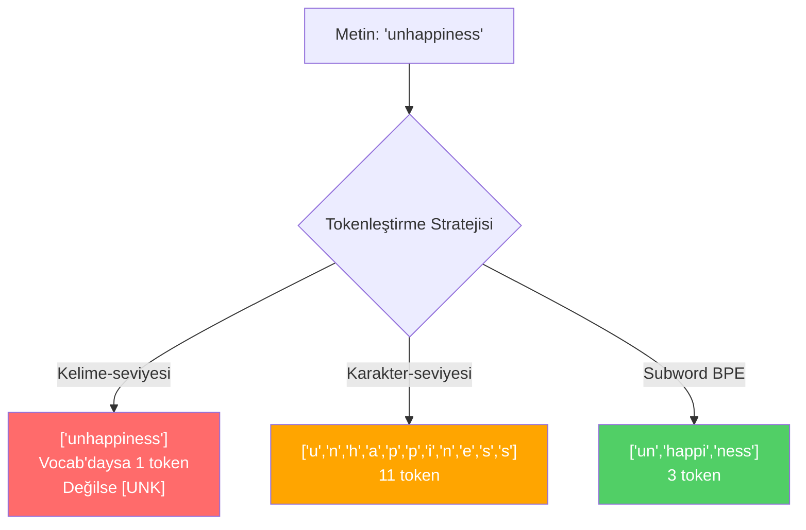
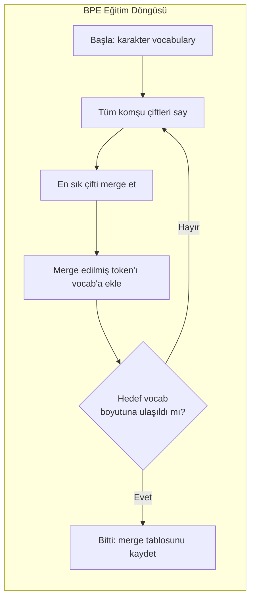
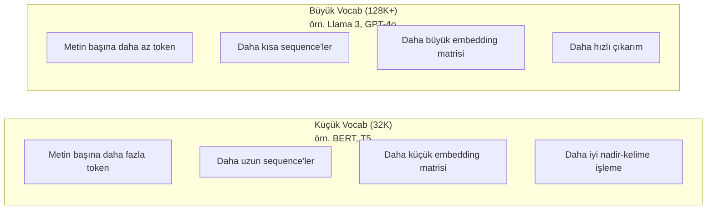

# Tokenleştiriciler: BPE, WordPiece, SentencePiece

> LLM'in İngilizce okumaz. Integer'lar okur. Tokenleştirici, o integer'ların anlam taşıyıp taşımayacağına ya da anlamı boşa harcayıp harcamayacağına karar verir.

**Tür:** Yapım
**Diller:** Python
**Ön koşullar:** Faz 05 (NLP Foundations)
**Süre:** ~90 dakika

## Öğrenme Hedefleri

- BPE, WordPiece ve Unigram tokenleştirme algoritmalarını sıfırdan implement et ve merge stratejilerini karşılaştır
- Vocabulary size'ın model verimliliğini nasıl etkilediğini açıkla: çok küçük olursa uzun sequence üretir, çok büyük olursa embedding parametrelerini boşa harcar
- Diller ve kod arasında tokenleştirme artefaktlarını analiz et; belirli tokenleştiricilerin nerede çöktüğünü tespit et
- tiktoken ve sentencepiece kütüphanelerini kullanarak metni tokenleştir ve elde edilen token ID'lerini incele

## Sorun

LLM'in İngilizce okumaz. Hiçbir dil okumaz. Sadece sayıları okur.

"Hello, world!" ile [15496, 11, 995, 0] arasındaki boşluk tokenleştiricidir. Her kelime, her boşluk, her noktalama işareti, model işleyebilmeden önce integer'a çevrilmek zorundadır. Bu dönüşüm tarafsız değildir. Modele sonradan geri alınamayacak varsayımları yerleştirir.

Bunu yanlış yaparsan, modelin yaygın kelimeleri birden fazla token ile encode ederek kapasitesini boşa harcar. "unfortunately" tek token yerine dört token olur. 128K context window'un, çok heceli kelime ağırlıklı metinler için %75 küçüldü. Doğru yaparsan, aynı context window iki katı anlam taşır. "Bu model kodu iyi işliyor" ile "bu model Python'da boğuluyor" arasındaki fark, çoğu zaman tokenleştiricinin nasıl eğitildiğine iner.

GPT-4 ya da Claude'a yaptığın her API çağrısı token başına fiyatlanır. Modelinin ürettiği her token compute maliyetidir. Bir çıktıyı temsil etmek için ne kadar az token gerekirse, uçtan uca çıkarım o kadar hızlıdır. Tokenleştirme bir ön işleme değildir. Mimaridir.

## Kavram

### Başarısız Olan Üç Yaklaşım (ve Bir Tanesi Kazandı)

Metni sayılara çevirmenin üç bariz yolu vardır. İkisi ölçekte çalışmaz.

**Kelime-seviyeli tokenleştirme** boşluk ve noktalamada böler. "The cat sat" şuna döner: ["The", "cat", "sat"]. Basit. Peki "tokenization"? Ya da "GPT-4o"? Ya da "Geschwindigkeitsbegrenzung" gibi bir Almanca bileşik kelime? Kelime-seviyesi, her dildeki her kelimeyi kapsamak için devasa bir vocabulary gerektirir. Bir kelimeyi kaçırırsan korkulu `[UNK]` token'ını alırsın — modelin "bunun ne olduğu hakkında hiçbir fikrim yok" deme şekli. Tek başına İngilizce'de bir milyondan fazla kelime formu var. Kod, URL'ler, bilimsel notasyon ve 100 başka dil ekle, sonsuz bir vocabulary'e ihtiyacın olur.

**Karakter-seviyeli tokenleştirme** diğer yöne gider. "hello" şuna döner: ["h", "e", "l", "l", "o"]. Vocabulary çok küçük (birkaç yüz karakter). Asla bilinmeyen token olmaz. Ama sequence'ler aşırı uzun olur. Kelime-seviyesinde 10 token olan bir cümle, karakter-seviyesinde 50 token olur. Modelin "t", "h", "e" birlikte olunca "the" demek olduğunu öğrenmesi gerekir — bir insanın üç yaşında öğrendiği şeye attention kapasitesi yakar.

**Subword tokenleştirme** tatlı noktayı bulur. Yaygın kelimeler bütün kalır: "the" tek token'dır. Nadir kelimeler anlamlı parçalara ayrılır: "unhappiness" şuna döner: ["un", "happi", "ness"]. Vocabulary yönetilebilir kalır (30K - 128K token). Sequence'ler kısa kalır. Bilinmeyen token'lar büyük ölçüde ortadan kalkar çünkü herhangi bir kelime subword parçalarından inşa edilebilir.

Her modern LLM subword tokenleştirme kullanır. GPT-2, GPT-4, BERT, Llama 3, Claude — hepsi. Soru hangi algoritmayı kullandığı.



### BPE: Byte Pair Encoding

BPE, tokenleştirme için yeniden kullanılan açgözlü bir sıkıştırma algoritmasıdır. Fikir bir kartvizite sığacak kadar basit.

Tek tek karakterlerle başla. Eğitim corpus'undaki her komşu çifti say. En sık çifti yeni bir token'a merge et. Hedef vocabulary boyutuna ulaşana kadar tekrar et.

Burada BPE'nin "lower", "lowest" ve "newest" kelimeleriyle minik bir corpus üzerinde çalışması:

```
Corpus (kelime frekanslarıyla):
  "lower"  x5
  "lowest" x2
  "newest" x6

Adım 0 -- Karakterlerle başla:
  l o w e r       (x5)
  l o w e s t     (x2)
  n e w e s t     (x6)

Adım 1 -- Komşu çiftleri say:
  (e,s): 8    (s,t): 8    (l,o): 7    (o,w): 7
  (w,e): 13   (e,r): 5    (n,e): 6    ...

Adım 2 -- En sık çifti (w,e) -> "we" merge et:
  l o we r        (x5)
  l o we s t      (x2)
  n e we s t      (x6)

Adım 3 -- Yeniden say ve (e,s) -> "es" merge et:
  l o we r        (x5)
  l o we s t      (x2)    <- 'es' sadece 'e'+'s'den oluşur, 'we'+'s'den değil
  n e we s t      (x6)    <- dur, 'we'den önce 'e' ve 'we'den sonra 's' var

Aslında bunu kesin izlemek:
  "we" merge'ünden sonra, kalan çiftler:
  (l,o): 7   (o,we): 7   (we,r): 5   (we,s): 8
  (s,t): 8   (n,e): 6    (e,we): 6

Adım 3 -- (we,s) -> "wes" veya (s,t) -> "st" merge et (8'de eşit, ilkini seç):
  (we,s) -> "wes" merge et:
  l o we r        (x5)
  l o wes t       (x2)
  n e wes t       (x6)

Adım 4 -- (wes,t) -> "west" merge et:
  l o we r        (x5)
  l o west        (x2)
  n e west        (x6)

...hedef vocab boyutuna ulaşana kadar devam et.
```

Merge tablosu tokenleştiricidir. Yeni metni encode etmek için, merge'leri öğrenildikleri sırayla uygula. Eğitim corpus'u hangi merge'lerin var olacağını belirler ve o seçim, modelin ne göreceğini kalıcı olarak şekillendirir.



### Byte-Level BPE (GPT-2, GPT-3, GPT-4)

Standart BPE Unicode karakterleri üzerinde çalışır. Byte-level BPE ham byte'lar (0-255) üzerinde çalışır. Bu sana tam olarak 256'lık bir taban vocabulary verir, her dili veya encoding'i halleder ve asla bilinmeyen bir token üretmez.

GPT-2 bu yaklaşımı tanıttı. Taban vocabulary olası her byte'ı kapsar. BPE merge'leri bunun üstüne inşa eder. OpenAI'nin tiktoken kütüphanesi byte-level BPE'yi şu vocabulary boyutlarıyla implement eder:

- GPT-2: 50.257 token
- GPT-3.5/GPT-4: ~100.256 token (cl100k_base encoding)
- GPT-4o: 200.019 token (o200k_base encoding)

### WordPiece (BERT)

WordPiece, BPE'ye benzer görünür ama merge'leri farklı seçer. Ham frekans yerine, eğitim verisinin olabilirliğini (likelihood) maksimize eder:

```
BPE merge kriteri:        count(A, B)
WordPiece merge kriteri:  count(AB) / (count(A) * count(B))
```

BPE sorar: "Hangi çift en sık geçiyor?" WordPiece sorar: "Hangi çift, rastgele beklenenden daha sık birlikte geçiyor?" Bu ince fark farklı vocabulary'ler üretir. WordPiece, sadece sık değil, birlikte geçişi şaşırtıcı olan merge'leri tercih eder.

WordPiece ayrıca devam subword'leri için "##" öneki kullanır:

```
"unhappiness" -> ["un", "##happi", "##ness"]
"embedding"   -> ["em", "##bed", "##ding"]
```

"##" öneki bu parçanın önceki bir token'ı sürdürdüğünü söyler. BERT, 30.522 token'lık bir vocabulary ile WordPiece kullanır. DistilBERT gibi her BERT türevi — RoBERTa'nın tokenleştiricisi aslında BPE'dir, ama BERT'in kendisi WordPiece.

### SentencePiece (Llama, T5)

SentencePiece input'u, whitespace dahil, ham bir Unicode karakter akışı olarak ele alır. Pre-tokenizasyon adımı yok. Kelime sınırları hakkında dile özgü kural yok. Bu onu gerçekten dil-agnostik yapar — Çince, Japonca, Tayca ve boşlukların kelimeleri ayırmadığı diğer dillerde çalışır.

SentencePiece iki algoritmayı destekler:
- **BPE modu**: standart BPE ile aynı merge mantığı, ham karakter sequence'lerine uygulanır
- **Unigram modu**: büyük bir vocabulary ile başlar ve genel olabilirliği en az etkileyen token'ları iteratif olarak çıkarır. BPE'nin tersi — merge yerine prune.

Llama 2, 32.000 token'lık bir vocabulary ile SentencePiece BPE kullanır. T5, 32.000 token ile SentencePiece Unigram kullanır. Not: Llama 3, 128.256 token'lık tiktoken-tabanlı byte-level BPE tokenleştiriciye geçti.

### Vocabulary Size Tradeoff'ları

Bu, ölçülebilir sonuçları olan gerçek bir mühendislik kararıdır.



Somut sayılar. 4.096 boyutlu embedding'lerle 128K vocabulary için, embedding matrisi tek başına 128.000 x 4.096 = 524 milyon parametre. 32K vocabulary için 131 milyon parametre. Sadece tokenleştirici seçiminden 400M parametre farkı.

Ama daha büyük vocabulary'ler metni daha agresif sıkıştırır. 32K vocabulary ile 100 token alan aynı İngilizce paragraf, 128K vocabulary ile 70 token alabilir. Bu, generation sırasında %30 daha az forward pass demek. Milyonlarca isteğe hizmet veren bir model için, bu compute maliyetinde doğrudan bir azalmadır.

Trend açık: vocabulary boyutları büyüyor. GPT-2 50.257 kullandı. GPT-4 ~100K kullanıyor. Llama 3 128K kullanıyor. GPT-4o 200K kullanıyor.

| Model | Vocab Size | Tokenleştirici Tipi | İngilizce Kelime Başına Ort. Token |
|-------|-----------|----------------|---------------------------|
| BERT | 30.522 | WordPiece | ~1.4 |
| GPT-2 | 50.257 | Byte-level BPE | ~1.3 |
| Llama 2 | 32.000 | SentencePiece BPE | ~1.4 |
| GPT-4 | ~100.256 | Byte-level BPE | ~1.2 |
| Llama 3 | 128.256 | Byte-level BPE (tiktoken) | ~1.1 |
| GPT-4o | 200.019 | Byte-level BPE | ~1.0 |

### Çok Dillilik Vergisi

Çoğunlukla İngilizce üzerine eğitilmiş tokenleştiriciler diğer dillere zalimdir. GPT-2'nin tokenleştiricisinde Korece metin kelime başına ortalama 2-3 token üretir. Çince daha kötü olabilir. Bu, bir Korece kullanıcının fiilen bir İngilizce kullanıcısının yarısı kadar context window'a sahip olduğu anlamına gelir — aynı fiyatı daha az bilgi yoğunluğu için ödeyerek.

Llama 3'ün vocabulary'sini 32K'dan 128K'ya dört katına çıkarmasının nedeni budur. İngilizce olmayan scriptlere ayrılan daha fazla token, diller arasında daha adil sıkıştırma demek.

## İnşa Et

### Adım 1: Karakter-Seviyeli Tokenleştirici

Temelde başla. Karakter-seviyeli tokenleştirici her karakteri Unicode kod noktasına eşler. Eğitim gerekmez. Bilinmeyen token olmaz. Sadece doğrudan bir eşleme.

```python
class CharTokenizer:
    def encode(self, text):
        return [ord(c) for c in text]

    def decode(self, tokens):
        return "".join(chr(t) for t in tokens)
```

"hello" şuna döner: [104, 101, 108, 108, 111]. Her karakter kendi token'ı. Bu, üzerine geliştirdiğimiz baseline.

### Adım 2: Sıfırdan BPE Tokenleştirici

Gerçek implementasyon. Ham byte'lar üzerinde (GPT-2 gibi) eğitiyoruz, çiftleri sayıyoruz, en sık olanı merge ediyoruz ve her merge'i sırayla kaydediyoruz. Merge tablosu tokenleştiricidir.

```python
from collections import Counter

class BPETokenizer:
    def __init__(self):
        self.merges = {}
        self.vocab = {}

    def _get_pairs(self, tokens):
        pairs = Counter()
        for i in range(len(tokens) - 1):
            pairs[(tokens[i], tokens[i + 1])] += 1
        return pairs

    def _merge_pair(self, tokens, pair, new_token):
        merged = []
        i = 0
        while i < len(tokens):
            if i < len(tokens) - 1 and tokens[i] == pair[0] and tokens[i + 1] == pair[1]:
                merged.append(new_token)
                i += 2
            else:
                merged.append(tokens[i])
                i += 1
        return merged

    def train(self, text, num_merges):
        tokens = list(text.encode("utf-8"))
        self.vocab = {i: bytes([i]) for i in range(256)}

        for i in range(num_merges):
            pairs = self._get_pairs(tokens)
            if not pairs:
                break
            best_pair = max(pairs, key=pairs.get)
            new_token = 256 + i
            tokens = self._merge_pair(tokens, best_pair, new_token)
            self.merges[best_pair] = new_token
            self.vocab[new_token] = self.vocab[best_pair[0]] + self.vocab[best_pair[1]]

        return self

    def encode(self, text):
        tokens = list(text.encode("utf-8"))
        for pair, new_token in self.merges.items():
            tokens = self._merge_pair(tokens, pair, new_token)
        return tokens

    def decode(self, tokens):
        byte_sequence = b"".join(self.vocab[t] for t in tokens)
        return byte_sequence.decode("utf-8", errors="replace")
```

Eğitim döngüsü BPE'nin çekirdeğidir: çiftleri say, kazananı merge et, tekrarla. Her merge toplam token sayısını azaltır. `num_merges` tur sonra, vocabulary 256'dan (taban byte'lar) 256 + num_merges'e büyür.

Encoding, merge'leri tam olarak öğrenildikleri sırayla uygular. Bu önemlidir. Eğer merge 1 "th" oluşturduysa ve merge 5 "the" oluşturduysa, encoding önce merge 1'i uygulamalı ki "the", merge 5'te "th" + "e"'den oluşabilsin.

Decoding tersidir: her token ID'sini vocabulary'de ara, byte'ları birleştir, UTF-8'e decode et.

### Adım 3: Encode ve Decode Roundtrip

```python
corpus = (
    "The cat sat on the mat. The cat ate the rat. "
    "The dog sat on the log. The dog ate the frog. "
    "Natural language processing is the study of how computers "
    "understand and generate human language. "
    "Tokenization is the first step in any NLP pipeline."
)

tokenizer = BPETokenizer()
tokenizer.train(corpus, num_merges=40)

test_sentences = [
    "The cat sat on the mat.",
    "Natural language processing",
    "tokenization pipeline",
    "unhappiness",
]

for sentence in test_sentences:
    encoded = tokenizer.encode(sentence)
    decoded = tokenizer.decode(encoded)
    raw_bytes = len(sentence.encode("utf-8"))
    ratio = len(encoded) / raw_bytes
    print(f"'{sentence}'")
    print(f"  Token: {len(encoded)} ({raw_bytes} byte'tan) -- oran: {ratio:.2f}")
    print(f"  Roundtrip: {'PASS' if decoded == sentence else 'FAIL'}")
```

Sıkıştırma oranı tokenleştiricinin ne kadar etkili olduğunu söyler. 0.50 oranı, tokenleştiricinin metni ham byte'ların yarısı kadar token'a sıkıştırdığı anlamına gelir. Daha düşük daha iyidir. Eğitim corpus'unda oran iyi olacak. Corpus'ta görünmeyen "unhappiness" gibi dağılım-dışı metinde oran daha kötü olacak — tokenleştirici görmediği desenler için karakter-seviyeli encoding'e geri düşer.

### Adım 4: tiktoken ile Karşılaştır

```python
import tiktoken

enc = tiktoken.get_encoding("cl100k_base")

texts = [
    "The cat sat on the mat.",
    "unhappiness",
    "Hello, world!",
    "def fibonacci(n): return n if n < 2 else fibonacci(n-1) + fibonacci(n-2)",
    "Geschwindigkeitsbegrenzung",
]

for text in texts:
    our_tokens = tokenizer.encode(text)
    tiktoken_tokens = enc.encode(text)
    tiktoken_pieces = [enc.decode([t]) for t in tiktoken_tokens]
    print(f"'{text}'")
    print(f"  Bizim BPE:  {len(our_tokens)} token")
    print(f"  tiktoken:   {len(tiktoken_tokens)} token -> {tiktoken_pieces}")
```

tiktoken tam olarak aynı algoritmayı kullanır ama 100.000 merge ile yüzlerce gigabyte metin üzerinde eğitilmiştir. Algoritma aynıdır. Fark eğitim verisi ve merge sayısıdır. 40 merge ile bir paragrafta eğitilmiş tokenleştiricin, devasa bir corpus üzerinde 100K merge ile tiktoken'la yarışamaz. Ama mekanizma aynı.

### Adım 5: Vocabulary Analizi

```python
def analyze_vocabulary(tokenizer, test_texts):
    total_tokens = 0
    total_chars = 0
    token_usage = Counter()

    for text in test_texts:
        encoded = tokenizer.encode(text)
        total_tokens += len(encoded)
        total_chars += len(text)
        for t in encoded:
            token_usage[t] += 1

    print(f"Vocabulary boyutu: {len(tokenizer.vocab)}")
    print(f"Tüm metinler boyunca toplam token: {total_tokens}")
    print(f"Toplam karakter: {total_chars}")
    print(f"Karakter başına ort. token: {total_tokens / total_chars:.2f}")

    print(f"\nEn çok kullanılan token'lar:")
    for token_id, count in token_usage.most_common(10):
        token_bytes = tokenizer.vocab[token_id]
        display = token_bytes.decode("utf-8", errors="replace")
        print(f"  Token {token_id:4d}: '{display}' ({count} kez kullanıldı)")

    unused = [t for t in tokenizer.vocab if t not in token_usage]
    print(f"\nKullanılmayan token: {len(unused)} / {len(tokenizer.vocab)}")
```

Bu, vocabulary'indeki Zipf dağılımını ortaya çıkarır. Birkaç token baskındır (boşluklar, "the", "e"). Çoğu token nadiren kullanılır. Production tokenleştiriciler bu dağılım için optimize eder — yaygın desenler kısa token ID'leri alır, nadir desenler daha uzun temsiller alır.

## Kullan

Sıfırdan BPE'in çalışıyor. Şimdi production araçlarının nasıl göründüğüne bak.

### tiktoken (OpenAI)

```python
import tiktoken

enc = tiktoken.get_encoding("cl100k_base")

text = "Tokenizers convert text to integers"
tokens = enc.encode(text)
print(f"Token'lar: {tokens}")
print(f"Parçalar:  {[enc.decode([t]) for t in tokens]}")
print(f"Roundtrip: {enc.decode(tokens)}")
```

tiktoken, Python binding'leri olan Rust'ta yazılmıştır. Saniyede milyonlarca token encode eder. Aynı BPE algoritması, endüstriyel güçte implementasyon.

### Hugging Face tokenizers

```python
from tokenizers import Tokenizer
from tokenizers.models import BPE
from tokenizers.trainers import BpeTrainer
from tokenizers.pre_tokenizers import ByteLevel

tokenizer = Tokenizer(BPE())
tokenizer.pre_tokenizer = ByteLevel()

trainer = BpeTrainer(vocab_size=1000, special_tokens=["<pad>", "<eos>", "<unk>"])
tokenizer.train(["corpus.txt"], trainer)

output = tokenizer.encode("The cat sat on the mat.")
print(f"Token'lar: {output.tokens}")
print(f"ID'ler: {output.ids}")
```

Hugging Face tokenizers kütüphanesi de altta Rust kullanır. Gigabyte ölçekli corpus'larda saniyeler içinde BPE eğitir. Kendi modelini eğitirken kullandığın budur.

### Llama'nın Tokenleştiricisini Yükleme

```python
from transformers import AutoTokenizer

tokenizer = AutoTokenizer.from_pretrained("meta-llama/Llama-3.1-8B")

text = "Tokenizers are the unsung heroes of LLMs"
tokens = tokenizer.encode(text)
print(f"Token ID'ler: {tokens}")
print(f"Token'lar: {tokenizer.convert_ids_to_tokens(tokens)}")
print(f"Vocab boyutu: {tokenizer.vocab_size}")

multilingual = ["Hello world", "Hola mundo", "Bonjour le monde"]
for text in multilingual:
    ids = tokenizer.encode(text)
    print(f"'{text}' -> {len(ids)} token")
```

Llama 3'ün 128K vocabulary'si, İngilizce olmayan metni GPT-2'nin 50K vocabulary'sinden önemli ölçüde daha iyi sıkıştırır. Bunu kendin doğrulayabilirsin — birden fazla dilde aynı cümleyi encode et ve token'ları say.

## Yayınla

Bu ders `outputs/prompt-tokenizer-analyzer.md` üretir — herhangi bir metin ve model kombinasyonu için tokenleştirme verimliliğini analiz eden tekrar kullanılabilir bir prompt. Ona bir metin örneği ver ve hangi modelin tokenleştiricisinin en iyi başa çıktığını söylesin.

## Alıştırmalar

1. BPE tokenleştiricisini her merge adımında vocabulary'i yazdıracak şekilde değiştir. "t" + "h"'nin "th" olduğunu, sonra "th" + "e"'nin "the" olduğunu izle. Yaygın İngilizce kelimelerin parça parça nasıl bir araya geldiğini takip et.

2. BPE tokenleştiriciye özel token'lar (`<pad>`, `<eos>`, `<unk>`) ekle. Onlara 0, 1, 2 ID'lerini ata ve diğer tüm token'ları kaydır. BPE'i çalıştırmadan önce whitespace'te bölen bir pre-tokenizasyon adımı implement et.

3. WordPiece merge kriterini implement et (frekans yerine likelihood oranı). Aynı corpus üzerinde aynı merge sayısı ile hem BPE hem WordPiece eğit. Elde edilen vocabulary'leri karşılaştır — hangisi dilbilimsel olarak daha anlamlı subword üretiyor?

4. Çok dilli bir tokenleştirici verimlilik benchmark'ı oluştur. İngilizce, İspanyolca, Çince, Korece ve Arapça'da 10 cümle al. Her birini tiktoken (cl100k_base) ile tokenleştir ve karakter başına ortalama token'ı ölç. Her dil için "çok dillilik vergisini" sayısallaştır.

5. BPE tokenleştiricini daha büyük bir corpus'ta eğit (bir Wikipedia makalesi indir). Aynı metin üzerinde tiktoken'a %10 yakın bir sıkıştırma oranı elde etmek için merge sayısını ayarla. Bu seni corpus boyutu, merge sayısı ve sıkıştırma kalitesi arasındaki ilişkiyi anlamaya zorlar.

## Anahtar Terimler

| Terim | İnsanlar ne diyor | Gerçekte ne anlama geliyor |
|------|----------------|----------------------|
| Token | "Bir kelime" | Modelin vocabulary'sindeki bir birim — karakter, subword, kelime veya çoklu-kelime parçası olabilir |
| BPE | "Bir tür sıkıştırma" | Byte Pair Encoding — hedef vocabulary boyutuna ulaşılana kadar en sık komşu token çiftini iteratif olarak merge eder |
| WordPiece | "BERT'in tokenleştiricisi" | BPE gibi ama merge'ler ham frekans yerine likelihood oranı count(AB)/(count(A)*count(B))'yi maksimize eder |
| SentencePiece | "Bir tokenleştirici kütüphanesi" | Pre-tokenizasyon olmadan ham Unicode üzerinde çalışan, BPE ve Unigram algoritmalarını destekleyen dil-agnostik tokenleştirici |
| Vocabulary size | "Kaç kelime bildiği" | Toplam benzersiz token sayısı: GPT-2'de 50.257, BERT'te 30.522, Llama 3'te 128.256 |
| Fertility | "Tokenleştirici terimi değil" | Kelime başına ortalama token sayısı — diller arasında tokenleştirici verimliliğini ölçer (1.0 mükemmel, 3.0 model üç kat daha fazla çalışıyor demek) |
| Byte-level BPE | "GPT'nin tokenleştiricisi" | Unicode karakterler yerine ham byte'lar (0-255) üzerinde çalışan BPE — herhangi bir input için bilinmeyen token üretmemesini garanti eder |
| Merge tablosu | "Tokenleştirici dosyası" | Eğitim sırasında öğrenilen pair merge'lerinin sıralı listesi — bu tokenleştiricinin KENDİSİDİR ve sıra önemlidir |
| Pre-tokenizasyon | "Boşluklarda bölme" | Subword tokenleştirmeden önce uygulanan kurallar: whitespace bölme, rakam ayırma, noktalama işleme |
| Sıkıştırma oranı | "Tokenleştirici ne kadar verimli" | Üretilen token sayısı / input byte sayısı — daha düşük daha iyi sıkıştırma ve daha hızlı çıkarım demek |

## İleri Okuma

- [Sennrich et al., 2016 -- "Neural Machine Translation of Rare Words with Subword Units"](https://arxiv.org/abs/1508.07909) -- BPE'i NLP'e tanıtan makale, 1994 sıkıştırma algoritmasını modern tokenleştirmenin temeline çeviren
- [Kudo & Richardson, 2018 -- "SentencePiece: A simple and language independent subword tokenizer"](https://arxiv.org/abs/1808.06226) -- çok dilli modelleri pratik yapan dil-agnostik tokenleştirme
- [OpenAI tiktoken repository](https://github.com/openai/tiktoken) -- GPT-3.5/4/4o tarafından kullanılan Python binding'leri olan Rust'taki production BPE implementasyonu
- [Hugging Face Tokenizers documentation](https://huggingface.co/docs/tokenizers) -- Rust performansıyla production-seviyeli tokenleştirici eğitimi
