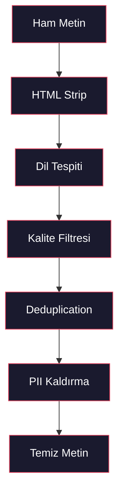
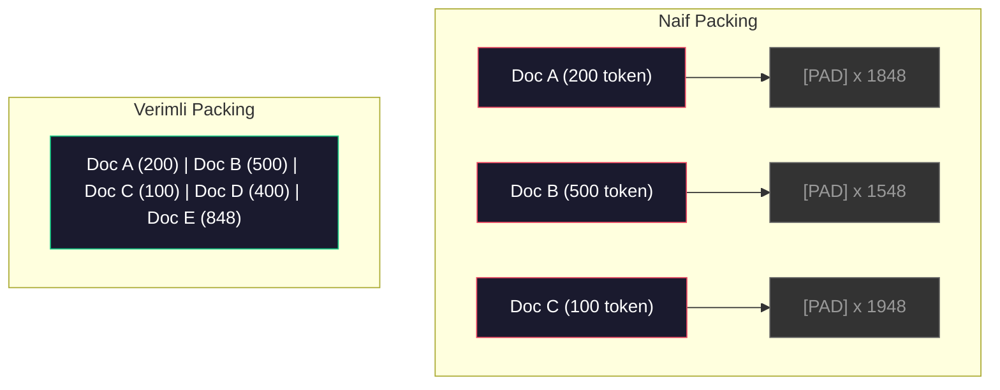

# Pretraining için Veri Pipeline'ları

> Model bir aynadır. Ona ne verirsen onu yansıtır. Çöp verirsen, çöpü kusursuz bir akıcılıkla yansıtır.

**Tür:** Yapım
**Diller:** Python
**Ön koşullar:** Faz 10, Ders 01-02 (Tokenleştiriciler, Sıfırdan Tokenleştirici)
**Süre:** ~90 dakika

## Öğrenme Hedefleri

- Hepsini belleğe yüklemeden terabytelarca metni tokenleştiren, parçalayan, karıştıran ve batch'leyen streaming bir veri pipeline'ı inşa et
- Gerçek pretraining pipeline'larında kullanılan veri kalitesi filtreleri (deduplication, dil tespiti, içerik filtreleme) implement et
- Doğru attention mask'leri ve doküman sınırı işleme ile sabit uzunluklu eğitim sequence'leri oluştur
- Dataloader'ın GPU eğitim hızına ayak uydurduğundan emin olmak için pipeline throughput'unu profille

## Sorun

Bir tokenleştiricin var. Şimdi veriye ihtiyacın var.

Bir dataset değil. Bir CSV dosyası değil. Terabytelarca metin — temizlenmiş, dedupe edilmiş, kalite için filtrelenmiş, sabit uzunluklu sequence'lere tokenleştirilmiş ve 8-GPU cluster'ının asla bir sonraki batch'i beklemeyeceği kadar hızlı randomize batch'lerde servis edilmiş.

Çoğu insan bir LLM eğitmenin model mimarisi hakkında olduğunu düşünür. Değil. Llama 3, 15.6 trilyon token kullandı. GPT-3, 300 milyar kullandı. DeepSeek-V2, 8.1 trilyon kullandı. Üçündeki de mimari kabaca aynı: attention ve feedforward katmanlarıyla yığılmış transformer blokları. Output kalitesindeki fark ezici çoğunlukla veriden geliyor.

DeepMind'ın Chinchilla makalesi bunu kesin yaptı. Sabit bir compute bütçesi için, model parametreleri ile eğitim token'ları arasında optimal bir oran vardır. Chinchilla, 2022'deki çoğu modelin dramatik şekilde undertrained olduğunu gösterdi — gördükleri veri miktarı için çok fazla parametreleri vardı. 1.4 trilyon token üzerinde eğitilmiş 70B parametre model (Chinchilla-optimal), 300 milyar token üzerinde eğitilmiş 280B model'i (Gopher) geçti.

Veri pipeline'ın modelinin dil mi yoksa gürültü mü öğreneceğini belirler.

## Kavram

### Veri Nereden Geliyor

Her büyük dil modeli kaynak karışımı üzerinde eğitilir. Tam kompozisyon çoğu lab için sıkı korunan bir sırdır, ama kategorileri anlamaya yetecek kadar biliyoruz.

| Kaynak | Boyut | Kalite | Kullanan |
|--------|------|---------|---------|
| Common Crawl | ~250 TB ham | Düşük (ağır filtreleme gerekiyor) | GPT-3, Llama, çoğu açık model |
| Wikipedia | ~20 GB | Yüksek | Her büyük LLM |
| GitHub kodu | ~1 TB+ | Orta (çok duplicate, ölü kod) | StarCoder, CodeLlama, DeepSeek-Coder |
| Kitaplar (BookCorpus, Pile) | ~100 GB | Yüksek | GPT-2, GPT-3, erken modeller |
| Akademik makaleler (arXiv, S2ORC) | ~100 GB | STEM için yüksek | Llama, Galactica |
| StackOverflow, Reddit | ~100 GB | Orta | Llama, Falcon |
| Curated web (C4, RefinedWeb) | ~5 TB | Orta-Yüksek (önceden filtrelenmiş) | T5, Falcon |

Llama 3 data mixture'ını açıkladı: kabaca %50 web verisi, %25 kod, %13 kitaplar ve akademik makaleler, %8 matematik verisi ve %4 çok dilli web verisi. 5 TB'tan fazla ham metin kaynaklarından toplam 15.6 trilyon token.

Oran toplam boyut kadar önemli. Çok fazla web verisi ve model bir Reddit papağanı olur. Çok az kod ve programlayamaz. Çok az matematik ve reasoning'de başarısız olur. Bu karışımı doğru yapmak LLM eğitmenin en zor parçalarından biri ve formülü yok — deney ve değerlendirme gerektirir.

### Veri Temizleme

Ham web verisi pislik. Tipik bir Common Crawl dump'ı şunları içerir:

- HTML tag'leri ve JavaScript
- Boilerplate header, footer, navigasyon menüleri
- Duplicate sayfalar (tam ve neredeyse-duplicate)
- Makine-üretimi spam
- Kişisel olarak tanımlanabilir bilgi (PII)
- Düşük kaliteli metin (anahtar kelime listeleri, SEO spam)
- Metin olarak encode edilmiş non-text içerik

Bunu temizlemek opsiyonel değil. Tutarlı paragraflar üreten model ile ürün listelemeleriyle karışık HTML tag'leri output veren model arasındaki fark budur.



Her adım bir gürültü kategorisini eler:

**HTML stripping:** Tüm markup'u kaldır. Sadece görünür metin içeriğini tut. `trafilatura` veya `readability` gibi kütüphaneler navigasyon, reklam ve boilerplate'i atarak makale içeriğini çıkarır.

**Dil tespiti:** Her dokümanı sınıflandırmak için fastText'in dil tanımlama modelini (lid.176.bin) kullan. Hedef dillerine filtrele. %0.8'den az güvenle İngilizce sınıflandırılan bir doküman muhtemelen temiz İngilizce değildir.

**Kalite filtreleme:** İlginç olduğu yer burası. RefinedWeb (Falcon'un arkasındaki dataset) perplexity-tabanlı bir filtre kullanır: Wikipedia üzerinde küçük bir dil modeli eğit, sonra her dokümanı skorla. Yüksek perplexity, dokümanın Wikipedia'ya benzemediği anlamına gelir — muhtemelen spam, anahtar kelime listesi veya makine-üretimi içerik. Eşiğin üzerinde perplexity'e sahip dokümanlar kaldırılır.

**Deduplication:** Tek en etkili temizleme adımı. Common Crawl çok sayıda duplicate sayfa içerir — yasal açıklamalar, çerez bildirimleri, hizmet koşulları. Duplicate'ler üzerinde eğitim compute'u israf eder ve modelin belirli pasajları ezberleyip aynen tekrar üretmesine neden olabilir.

**PII kaldırma:** İsimler, e-posta adresleri, telefon numaraları, sosyal güvenlik numaraları. Yapısal PII için regex-tabanlı tespit, bağlamdaki isimler için NER modelleri.

### MinHash ile Deduplication

Tam deduplication kolay: her dokümanı hash'le, duplicate'leri kaldır. Ama neredeyse-duplicate'ler gerçek problem. Etrafında biraz farklı reklamlar olan aynı haber makalesinin iki kopyası neredeyse-duplicate'tir. İçerik %95 aynı, ama byte-byte farklılar.

MinHash + Locality-Sensitive Hashing (LSH) bunu verimli çözer.


Fikir:

1. **Shingling:** Her dokümanı bir n-gram seti haline getir (örn. kelimelerin veya karakterlerin 5-gram'ları). 3 kelimelik shingle'larla "the quick brown fox" şuna döner: {"the quick brown", "quick brown fox"}.

2. **MinHash:** Her dokümanın shingle seti için k hash değeri hesapla. Her hash değeri, farklı bir hash fonksiyonu altında tüm shingle'lar üzerindeki minimum hash'tir. Bu, herhangi iki doküman arasındaki Jaccard benzerliğini yaklaşık veren sabit boyutlu bir "imza" oluşturur.

3. **LSH:** Dokümanları MinHash imzalarının band'larına göre kovalara grupla. Aynı kovadaki dokümanlar aday neredeyse-duplicate'lerdir. Bu her çifti karşılaştırmayı engeller — sadece adayları karşılaştırırsın.

4. **Doğrula:** Her aday çift için tam Jaccard benzerliğini hesapla. Benzerlik bir eşiği (tipik 0.8) aşarsa bir kopyayı kaldır.

Llama ekibi deduplication ile web verilerinin yaklaşık %38'ini kaldırdığını bildirdi. Bu küçük bir rakam değil. Common Crawl'ın üçte birinden fazlası duplicate veya neredeyse-duplicate içerik.

### Sequence Packing

Modelin sabit uzunluklu input sequence'leri bekler. Dokümanların değişken uzunlukta. Bazıları 50 token. Bazıları 50.000 token.

Naif yaklaşım: her dokümanı maksimum sequence uzunluğuna pad et. Bu, öğrenmeye hiç katkı sağlamayan padding token'ları üzerinde devasa compute israf eder.

Daha iyi yaklaşım: birden fazla dokümanı end-of-sequence token'larıyla ayrılmış tek bir sequence'e pack et. 2048-token'lık bir sequence aralarında [EOS] token'larıyla concat edilmiş üç kısa doküman içerebilir.



Attention mask doğru ayarlanmalı. Doküman A'nın token'ları aynı packed sequence içinde Doküman B'nin token'larına attention yapmamalı. Bu, block-diagonal bir attention mask gerektirir.

Uzun dokümanlar sequence sınırlarında truncate edilir veya chunk'lara bölünür. Bölme noktası önemli: cümle ortasında bölmek modeli eksik düşünceleri görmeye zorlar. Bazı pipeline'lar mümkün olduğunda bölmeleri paragraf veya cümle sınırlarına hizalar.

### Chinchilla Scaling Law

Sabit bir compute bütçesi C için (FLOP cinsinden ölçülen), optimal model boyutu N ve dataset boyutu D şunu takip eder:

```
N_opt ~ C^0.5
D_opt ~ C^0.5
```

Pratikte bu, model boyutu ve dataset boyutunu kabaca eşit ölçeklemen gerektiği anlamına gelir. 10x daha fazla parametreli bir model aynı loss'a ulaşmak için kabaca 10x daha fazla eğitim token'ı gerektirir.

| Model | Parametre | Eğitim Token | Chinchilla-Optimal? |
|-------|-----------|----------------|-------------------|
| GPT-3 | 175B | 300B | Hayır (3-4x undertrained) |
| Chinchilla | 70B | 1.4T | Evet (tasarımla) |
| Llama 2 | 70B | 2T | Overtrained (kasıtlı) |
| Llama 3 | 70B | 15T | Ağır overtrained |

Llama 3 Chinchilla yasasını kasıtlı olarak ihlal eder. Meta, daha fazla veride overtraining'in — compute-optimal orandan çok daha fazlasında — çıkarım için daha iyi modeller ürettiğini buldu. Ek eğitim maliyeti bir kez ödenir, ama daha küçük model sonsuza kadar servis için daha ucuzdur. Buna bazen "inference-optimal" scaling yaklaşımı denir ve 2024'ten beri endüstri standardı oldu.

## İnşa Et

### Adım 1: Metin Temizleme

HTML'i strip et, whitespace'i normalize et, non-text içeriği kaldır. Küçük corpus'umuz olarak public domain bir metin (Project Gutenberg) kullanacağız.

```python
import re

def clean_text(text):
    text = re.sub(r"<[^>]+>", "", text)
    text = re.sub(r"http\S+", "", text)
    text = re.sub(r"[^\x20-\x7E\n]", "", text)
    text = re.sub(r"\n{3,}", "\n\n", text)
    text = re.sub(r" {2,}", " ", text)
    return text.strip()

def quality_filter(text, min_words=50, max_ratio_caps=0.3, max_ratio_special=0.1):
    words = text.split()
    if len(words) < min_words:
        return False
    caps_ratio = sum(1 for w in words if w.isupper()) / len(words)
    if caps_ratio > max_ratio_caps:
        return False
    special_chars = sum(1 for c in text if not c.isalnum() and not c.isspace())
    if special_chars / max(len(text), 1) > max_ratio_special:
        return False
    return True
```

Kalite filtresi SEO spam'i (TÜM BÜYÜK HARFLER), makine-üretimi gürültüyü (yüksek özel karakter oranı) ve stub sayfaları (çok kısa) yakalar. Tek başına bu üç kontrol web crawl'larından şaşırtıcı miktarda çöp kaldırır.

### Adım 2: MinHash Deduplication

MinHash'i sıfırdan implement et. Harici kütüphane gerekmez — sadece `hashlib`.

```python
import hashlib
from collections import defaultdict

def get_shingles(text, k=5):
    words = text.lower().split()
    if len(words) < k:
        return set()
    return {" ".join(words[i:i+k]) for i in range(len(words) - k + 1)}

def minhash_signature(shingles, num_hashes=128):
    signature = []
    for i in range(num_hashes):
        min_hash = float("inf")
        for shingle in shingles:
            h = int(hashlib.sha256(f"{i}:{shingle}".encode()).hexdigest(), 16)
            min_hash = min(min_hash, h)
        signature.append(min_hash)
    return signature

def lsh_buckets(signature, bands=16):
    rows_per_band = len(signature) // bands
    buckets = []
    for b in range(bands):
        start = b * rows_per_band
        band_data = tuple(signature[start:start + rows_per_band])
        bucket_hash = hashlib.md5(str(band_data).encode()).hexdigest()
        buckets.append((b, bucket_hash))
    return buckets

def deduplicate(documents, threshold=0.8, num_hashes=128, bands=16):
    signatures = []
    shingle_sets = []
    for doc in documents:
        shingles = get_shingles(doc)
        shingle_sets.append(shingles)
        signatures.append(minhash_signature(shingles, num_hashes))

    bucket_map = defaultdict(list)
    for doc_idx, sig in enumerate(signatures):
        for band_id, bucket_hash in lsh_buckets(sig, bands):
            bucket_map[(band_id, bucket_hash)].append(doc_idx)

    duplicate_pairs = set()
    for bucket_docs in bucket_map.values():
        if len(bucket_docs) < 2:
            continue
        for i in range(len(bucket_docs)):
            for j in range(i + 1, len(bucket_docs)):
                duplicate_pairs.add((bucket_docs[i], bucket_docs[j]))

    removed = set()
    for i, j in duplicate_pairs:
        if i in removed or j in removed:
            continue
        s1, s2 = shingle_sets[i], shingle_sets[j]
        if not s1 or not s2:
            continue
        jaccard = len(s1 & s2) / len(s1 | s2)
        if jaccard >= threshold:
            removed.add(j)

    return [doc for idx, doc in enumerate(documents) if idx not in removed], len(removed)
```

`num_hashes=128` ve `bands=16` parametreleri precision-recall tradeoff'unu kontrol eder. Daha fazla hash daha doğru benzerlik tahminleri verir. Daha fazla band recall'u artırır (daha fazla duplicate yakalar) ama daha fazla false positive pahasına. Bu değerler tipik web metni için iyi çalışır.

### Adım 3: Sequence'leri Tokenleştir ve Pack Et

Temiz, dedupe edilmiş metni al, tokenleştir ve eğitim için sabit uzunluklu sequence'lere pack et.

```python
def tokenize_corpus(documents, tokenizer):
    all_tokens = []
    for doc in documents:
        tokens = tokenizer.encode(doc)
        all_tokens.extend(tokens)
        all_tokens.append(tokenizer.eos_id)
    return all_tokens

def pack_sequences(token_ids, seq_length, pad_id=0):
    sequences = []
    attention_masks = []
    for i in range(0, len(token_ids), seq_length):
        seq = token_ids[i:i + seq_length]
        mask = [1] * len(seq)
        if len(seq) < seq_length:
            pad_count = seq_length - len(seq)
            seq = seq + [pad_id] * pad_count
            mask = mask + [0] * pad_count
        sequences.append(seq)
        attention_masks.append(mask)
    return sequences, attention_masks
```

### Adım 4: Eğitim için DataLoader

Packed sequence'lerin randomize batch'lerini yield et. Eğitim döngüsünün tükettiği şey budur.

```python
import random

class PreTrainingDataLoader:
    def __init__(self, sequences, attention_masks, batch_size, shuffle=True):
        self.sequences = sequences
        self.attention_masks = attention_masks
        self.batch_size = batch_size
        self.shuffle = shuffle

    def __len__(self):
        return (len(self.sequences) + self.batch_size - 1) // self.batch_size

    def __iter__(self):
        indices = list(range(len(self.sequences)))
        if self.shuffle:
            random.shuffle(indices)
        for start in range(0, len(indices), self.batch_size):
            batch_idx = indices[start:start + self.batch_size]
            batch_seqs = [self.sequences[i] for i in batch_idx]
            batch_masks = [self.attention_masks[i] for i in batch_idx]
            yield batch_seqs, batch_masks
```

### Adım 5: Dataset İstatistikleri

Önemli sayıları hesapla: toplam token, benzersiz token, sıkıştırma oranı, doküman uzunluğu dağılımı.

```python
from collections import Counter

def compute_statistics(documents, token_ids, sequences, tokenizer_vocab_size):
    total_chars = sum(len(d) for d in documents)
    total_tokens = len(token_ids)
    unique_tokens = len(set(token_ids))
    compression_ratio = total_chars / total_tokens

    doc_lengths = [len(d.split()) for d in documents]
    avg_doc_length = sum(doc_lengths) / max(len(doc_lengths), 1)
    max_doc_length = max(doc_lengths) if doc_lengths else 0
    min_doc_length = min(doc_lengths) if doc_lengths else 0

    token_counts = Counter(token_ids)
    top_tokens = token_counts.most_common(10)

    non_pad_tokens = sum(sum(1 for t in seq if t != 0) for seq in sequences)
    total_positions = sum(len(seq) for seq in sequences)
    utilization = non_pad_tokens / max(total_positions, 1)

    stats = {
        "total_documents": len(documents),
        "total_characters": total_chars,
        "total_tokens": total_tokens,
        "unique_tokens": unique_tokens,
        "vocab_utilization": unique_tokens / tokenizer_vocab_size,
        "compression_ratio": compression_ratio,
        "avg_doc_length_words": avg_doc_length,
        "max_doc_length_words": max_doc_length,
        "min_doc_length_words": min_doc_length,
        "num_sequences": len(sequences),
        "sequence_utilization": utilization,
        "top_10_tokens": top_tokens,
    }
    return stats
```

Sıkıştırma oranı tokenleştiricinin bu corpus'ta ne kadar verimli olduğunu söyler. İngilizce metin tipik olarak token başına 3-4 karaktere sıkışır. Token başına 1.5 karakter görürsen, tokenleştirici çok agresif bölüyordur. 8+ görürsen, çok domain-spesifik merge'ler öğrenmiştir.

Sequence utilization, packed sequence'lerinin ne kadarının gerçek veri vs padding olduğunu söyler. %90'ın altı, packing'inin verimsiz olduğu anlamına gelir — padding token'larında compute israf ediyorsundur.

## Kullan

### HuggingFace Datasets ile Karşılaştır

Aynı corpus'u HuggingFace'in datasets kütüphanesi üzerinden yükle ve pipeline hızını karşılaştır.

```python
from datasets import load_dataset
from transformers import AutoTokenizer

ds = load_dataset("wikitext", "wikitext-2-raw-v1", split="train")
tokenizer = AutoTokenizer.from_pretrained("meta-llama/Meta-Llama-3-8B")

import time

start = time.time()
tokenized = ds.map(
    lambda x: tokenizer(x["text"], truncation=True, max_length=2048),
    batched=True,
    num_proc=4,
)
hf_time = time.time() - start
total_tokens = sum(len(t) for t in tokenized["input_ids"])
print(f"HuggingFace: {total_tokens:,} token, {hf_time:.2f}s ({total_tokens/hf_time:,.0f} token/sn)")
```

HuggingFace pipeline'ı altta Rust tokenleştiriciler ve 4 core arasında paralel işleme kullanır. Saf Python pipeline'ın 10-50x daha yavaş olacak. Bu boşluk, production ekiplerinin derlenmiş tokenleştiriciler kullandığı nedendir. Algoritma aynı. Implementasyon dili fark.

## Yayınla

Bu ders LLM eğitim pipeline'larında veri kalitesini doğrulamak ve debug etmek için bir prompt üretir. `outputs/prompt-data-quality-checker.md`'a bak.

## Alıştırmalar

1. **Kolay:** Basit bir heuristic (karakter seti analizi) kullanarak temizleme pipeline'ına dil tespiti ekle. Sadece İngilizce dokümanlara filtrele ve kaç dokümanın kaldırıldığını ölç.
2. **Orta:** MinHash neredeyse-deduplication'ın yanına SHA-256 hash'leri kullanarak tam deduplication implement et. Web-scrape edilmiş bir corpus üzerinde her yöntemin yakaladığı duplicate sayısını karşılaştır.
3. **Zor:** Perplexity-tabanlı bir kalite filtresi inşa et. Wikipedia metni üzerinde küçük bir bigram dil modeli eğit, her dokümanı perplexity ile skorla ve en alttaki %20'yi kaldır. Filtrelenmiş vs filtrelenmemiş veride eğitim yaparken model output kalitesini karşılaştır.

## Anahtar Terimler

| Terim | İnsanlar ne diyor | Gerçekte ne anlama geliyor |
|------|----------------|----------------------|
| Common Crawl | "İnternet" | Web'i ayda bir crawl eden non-profit — ~250TB ham, çoğu LLM eğitim verisinin başlangıç noktası |
| MinHash | "Bir tür hashing hilesi" | Sabit boyutlu imzalar kullanarak set'ler arası Jaccard benzerliğini tahmin eden bir teknik — ölçekte neredeyse-duplicate tespitini sağlar |
| LSH | "Locality-Sensitive Hashing" | Benzer öğeleri aynı kovada gruplayan yöntem — pairwise karşılaştırmaları O(n^2)'den neredeyse-lineer'e indirir |
| Sequence packing | "Dokümanları concat etme" | Doğru attention mask'leriyle birden fazla dokümanı sabit uzunluklu sequence'lere sığdırma — padding israfını ortadan kaldırır |
| Chinchilla scaling | "Daha fazla veride eğit" | Sabit compute bütçesi için, optimal performans model boyutu ve eğitim token'larını kabaca eşit ölçeklemeyi gerektirir |
| Fertility | "Kelime başına token" | Kelime başına ortalama token sayısı — GPT-4'te İngilizce için 1.3, Latin olmayan scriptler için daha yüksek |
| Data mixing | "Eğitim verisi seçme" | Kod vs metin vs matematik vs çok dilli veri oranı — formülü yok, deney gerektirir |
| Perplexity filtresi | "Kalite skorlama" | Dokümanları skorlamak için küçük bir dil modeli kullan — yüksek perplexity, metnin temiz referans veriye benzemediği anlamına gelir |
| Deduplication | "Kopyaları kaldırma" | Tam ve neredeyse-duplicate dokümanları eleme — tipik olarak ham web verisinin %30-40'ını kaldırır |
| Attention mask | "Hangi token'lara bakılacak" | Packed sequence'lerde doküman sınırları arasında attention'ı önleyen binary mask |

## İleri Okuma

- [Hoffmann et al., 2022 -- Training Compute-Optimal Large Language Models (Chinchilla)](https://arxiv.org/abs/2203.15556) -- veri ölçeği hakkında düşüncemizi değiştiren makale
- [Penedo et al., 2023 -- The RefinedWeb Dataset for Falcon LLM](https://arxiv.org/abs/2306.01116) -- Common Crawl'u yüksek kaliteye nasıl filtreleyeceğin
- [Touvron et al., 2023 -- Llama 2: Open Foundation and Fine-Tuned Chat Models](https://arxiv.org/abs/2307.09288) -- Llama 2 için veri pipeline detayları
- [Lee et al., 2022 -- Deduplicating Training Data Makes Language Models Better](https://arxiv.org/abs/2107.06499) -- deduplication'ın düşündüğünden neden daha önemli olduğu
- [Broder, 1997 -- On the Resemblance and Containment of Documents](https://ieeexplore.ieee.org/document/666900) -- orijinal MinHash makalesi
- [Meta, 2024 -- Llama 3 Technical Report](https://arxiv.org/abs/2407.21783) -- 15.6T token, data mixing oranları, filtreleme pipeline'ı
