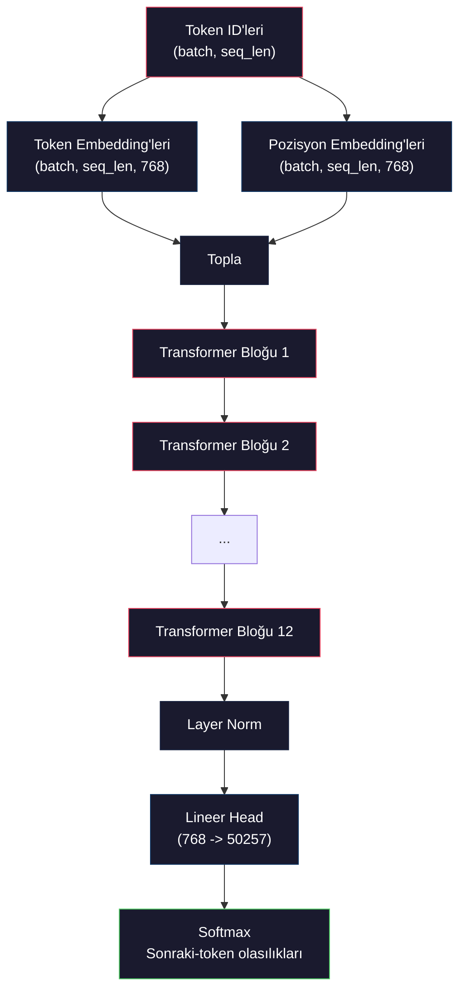
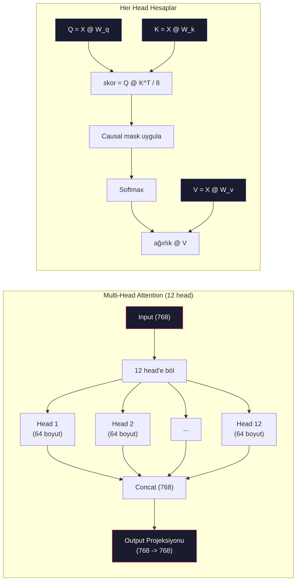
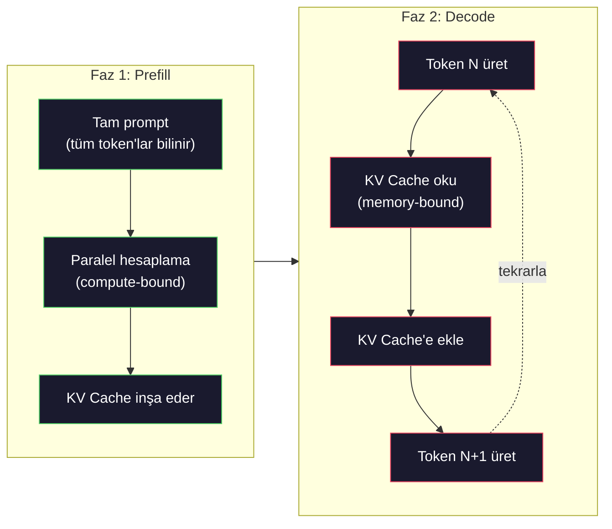

# Mini GPT Pretraining (124M Parametre)

> GPT-2 Small'un 124 milyon parametresi var. Bu 12 transformer katmanı, 12 attention head ve 768-boyutlu embedding demek. Tek bir GPU'da birkaç saatte sıfırdan eğitebilirsin. Çoğu insan bunu hiç yapmaz. Pretrained checkpoint'leri kullanırlar. Ama kendin bir tane eğitmezsen, üzerine ürün inşa ettiğin modelin içinde ne olduğunu aslında anlamıyorsun.

**Tür:** Yapım
**Diller:** Python (numpy ile)
**Ön koşullar:** Faz 10, Ders 01-03 (Tokenleştiriciler, Sıfırdan Tokenleştirici, Veri Pipeline'ları)
**Süre:** ~120 dakika

## Öğrenme Hedefleri

- Tam GPT-2 mimarisini (124M parametre) sıfırdan implement et: token embedding'leri, pozisyonel embedding'leri, transformer blokları ve language model head'i
- Bir GPT modelini cross-entropy loss ile next-token prediction kullanarak metin corpus'unda eğit
- Temperature sampling ve top-k/top-p filtrelemesiyle autoregressive metin generation implement et
- Eğitim loss eğrilerini izle ve modelin tutarlı dil desenleri öğrendiğini doğrula

## Sorun

Transformer'ın ne olduğunu biliyorsun. Diyagramları okudun. "Attention is all you need" diye sayabiliyorsun ve bir tahtada "Multi-Head Attention" etiketli kutular çizebiliyorsun.

Bunların hiçbiri model metin ürettiğinde ne olduğunu anladığın anlamına gelmiyor.

GPT-2 Small'da 124.438.272 parametre var (weight tying ile). Bunların her birini bir eğitim döngüsü çalıştırarak ayarladık: forward pass, loss hesapla, backward pass, ağırlıkları güncelle. On iki transformer bloğu. Blok başına on iki attention head. 768 boyutlu bir embedding uzayı. 50.257 token'lık bir vocabulary. Model her token ürettiğinde, 124 milyon parametrenin hepsi tek bir matrix multiplication zincirine katılır, bu zincir bir token ID sequence'i alır ve sonraki token üzerinde bir olasılık dağılımı üretir.

Bunu kendin inşa etmediysen, kara kutuyla çalışıyorsun. API'yi kullanabilirsin. Fine-tune edebilirsin. Ama bir şeyler ters gittiğinde — model halüsinasyon gördüğünde, kendini tekrar ettiğinde, talimatları takip etmeyi reddettiğinde — *neden* olduğuna dair zihinsel modelin yok.

Bu ders GPT-2 Small'u sıfırdan inşa eder. PyTorch'ta değil. Numpy'da. Her matrix multiplication görünür. Her gradient kodun tarafından hesaplanır. 124 milyon sayının bir sonraki kelimeyi tahmin etmek için tam olarak nasıl komplo kurduğunu göreceksin.

## Kavram

### GPT Mimarisi

GPT bir autoregressive dil modelidir. "Autoregressive" her seferinde bir token ürettiği anlamına gelir, her biri tüm önceki token'lara koşullu olarak. Mimari bir transformer decoder blok yığınıdır.

İşte token ID'lerinden sonraki-token olasılıklarına tam computation graph:

1. Token ID'leri gelir. Şekil: (batch_size, seq_len).
2. Token embedding lookup. Her ID 768 boyutlu bir vektöre eşlenir. Şekil: (batch_size, seq_len, 768).
3. Pozisyon embedding lookup. Her pozisyon (0, 1, 2, ...) 768 boyutlu bir vektöre eşlenir. Aynı şekil.
4. Token embedding'leri + pozisyon embedding'leri topla.
5. 12 transformer bloğundan geçir.
6. Son layer normalization.
7. Vocabulary boyutuna lineer projeksiyon. Şekil: (batch_size, seq_len, vocab_size).
8. Olasılıkları almak için softmax.

Tüm model bu. Convolution yok. Recurrence yok. Sadece embedding'ler, attention, feedforward ağlar ve 12 kez yığılmış layer norm'lar.



### Transformer Bloğu

12 bloğun her biri aynı deseni takip eder. Pre-norm mimarisi (GPT-2 orijinal transformer gibi post-norm değil, pre-norm kullanır):

1. LayerNorm
2. Multi-Head Self-Attention
3. Residual connection (input'u geri ekle)
4. LayerNorm
5. Feed-Forward Network (MLP)
6. Residual connection (input'u geri ekle)

Residual connection'lar kritik. Onlar olmadan, backpropagation sırasında gradient'lar blok 1'e ulaştığında kaybolur. Onlarla, gradient'lar "skip" yolu üzerinden loss'tan herhangi bir katmana doğrudan akabilir. Bu yüzden 12, 32 hatta 96 blok yığabilirsin (GPT-4'ün 120 kullandığı söylenir).

### Attention: Çekirdek Mekanizma

Self-attention her token'ın her önceki token'a bakmasına ve her birine ne kadar attention yapacağına karar vermesine izin verir. İşte matematik.

Her token pozisyonu için, input'tan üç vektör hesapla:
- **Query (Q)**: "Ne arıyorum?"
- **Key (K)**: "Ne içeriyorum?"
- **Value (V)**: "Hangi bilgiyi taşıyorum?"

```
Q = input @ W_q    (768 -> 768)
K = input @ W_k    (768 -> 768)
V = input @ W_v    (768 -> 768)

attention_scores = Q @ K^T / sqrt(d_k)
attention_scores = mask(attention_scores)   # causal mask: gelecek pozisyonlar için -inf
attention_weights = softmax(attention_scores)
output = attention_weights @ V
```

Causal mask, GPT'i autoregressive yapan şeydir. Pozisyon 5, pozisyon 0-5'e attention yapabilir ama 6, 7, 8 vb.'ye yapamaz. Bu, modelin eğitim sırasında gelecek token'lara bakarak "hile yapmasını" önler.

**Multi-head attention** 768 boyutlu uzayı her biri 64 boyutlu 12 head'e böler. Her head farklı bir attention deseni öğrenir. Bir head sözdizimsel ilişkileri (özne-yüklem uyumu) izleyebilir. Diğeri semantik benzerliği (eş anlamlılar) izleyebilir. Diğeri pozisyonel yakınlığı (yakın kelimeler) izleyebilir. Tüm 12 head'in output'ları concat edilir ve 768 boyuta geri projeksiyon yapılır.



sqrt(d_k) ile bölme — sqrt(64) = 8 — ölçeklemedir. Onsuz, nokta çarpımları yüksek boyutlu vektörler için büyür ve softmax'ı gradient'ların neredeyse sıfır olduğu bölgelere iter. Bu, orijinal "Attention Is All You Need" makalesindeki anahtar içgörülerden biriydi.

### KV Cache: Çıkarım Neden Hızlı

Eğitim sırasında, tüm sequence'i bir kerede işlersin. Çıkarım sırasında, her seferinde bir token üretirsin. Optimizasyon olmadan, N token'ı üretmek tüm N-1 önceki token için attention'ı yeniden hesaplamayı gerektirir. Bu üretilen token başına O(N^2) veya N uzunluğundaki bir sequence için toplam O(N^3).

KV Cache bunu çözer. Her token için K ve V'yi hesapladıktan sonra, sakla. N+1 token'ı üretirken, sadece yeni token için Q hesaplaman ve tüm önceki token'lar için cache'lenmiş K ve V'leri aramak yeterli. Bu K ve V hesaplamasını token başına O(N)'den O(1)'e indirir. Attention skor hesaplama hala O(N)'dir çünkü tüm önceki pozisyonlara attention yaparsın, ama input üzerindeki gereksiz matrix multiplication'ları engellemiş olursun.

12 katman ve 12 head'li GPT-2 için, KV cache token başına 2 (K + V) x 12 katman x 12 head x 64 boyut = 18.432 değer saklar. 1024 token'lık bir sequence için, bu FP32'de yaklaşık 75MB. 128 katmanlı Llama 3 405B için, tek bir sequence için KV cache 10GB'ı aşabilir. Uzun-context çıkarımının memory-bound olmasının nedeni budur.

### Prefill vs Decode: Çıkarımın İki Fazı

Bir LLM'e prompt gönderdiğinde, çıkarım iki farklı fazda olur.

**Prefill** tüm prompt'unu paralel işler. Tüm token'lar bilinir, dolayısıyla model tüm pozisyonlar için attention'ı eşzamanlı hesaplayabilir. Bu faz compute-bound'dur — GPU full throughput'ta matrix multiplication yapıyor. A100'de 1000 token'lık bir prompt için, prefill kabaca 20-50ms sürer.

**Decode** her seferinde bir token üretir. Her yeni token tüm önceki token'lara bağlıdır. Bu faz memory-bound'dur — darboğaz model ağırlıklarını ve KV cache'i GPU belleğinden okumaktır, matrix matematik değil. GPU'nun compute core'ları çoğunlukla bellek okumalarını beklerken boş durur. GPT-2 için, her decode adımı matmul'ların kaç FLOP gerektirdiğinden bağımsız olarak yaklaşık aynı zamanı alır, çünkü memory bandwidth kısıttır.

Bu ayrım production sistemleri için önemli. Prefill throughput'u GPU compute ile ölçeklenir (daha fazla FLOPS = daha hızlı prefill). Decode throughput'u memory bandwidth ile ölçeklenir (daha hızlı bellek = daha hızlı decode). NVIDIA'nın H100'ü A100 üzerinden memory bandwidth iyileştirmelerine odaklanmasının nedeni budur — token generation'ı doğrudan hızlandırır.



### Eğitim Döngüsü

Bir LLM'i eğitmek next-token prediction'dır. [0, 1, 2, ..., N-1] token'ları verildiğinde, [1, 2, 3, ..., N] token'larını tahmin et. Loss fonksiyonu modelin tahmin ettiği olasılık dağılımı ile gerçek sonraki token arasındaki cross-entropy'dir.

Bir eğitim adımı:

1. **Forward pass**: Batch'i tüm 12 bloktan geçir. Her pozisyon için logit'leri (softmax-öncesi skorlar) al.
2. **Loss hesapla**: Logit'ler ile target token'lar (bir pozisyon kaydırılmış input) arasında cross-entropy.
3. **Backward pass**: Backpropagation kullanarak tüm 124M parametre için gradient hesapla.
4. **Optimizer adımı**: Ağırlıkları güncelle. GPT-2 learning rate warmup ve cosine decay ile Adam kullanır.

Learning rate schedule beklediğinden daha önemli. GPT-2 ilk 2.000 adımda 0'dan tepe learning rate'e warmup yapar, sonra bir cosine eğrisini takip ederek decay eder. Yüksek learning rate ile başlamak modelin diverge etmesine neden olur. Sabit yüksek bir oran tutmak daha sonraki eğitimde osilasyona neden olur. Warmup-sonra-decay deseni her büyük LLM tarafından kullanılır.

### GPT-2 Small: Sayılar

| Bileşen | Şekil | Parametre |
|-----------|-------|------------|
| Token embedding'leri | (50257, 768) | 38.597.376 |
| Pozisyon embedding'leri | (1024, 768) | 786.432 |
| Blok başına attention (W_q, W_k, W_v, W_out) | 4 x (768, 768) | 2.359.296 |
| Blok başına FFN (up + down) | (768, 3072) + (3072, 768) | 4.718.592 |
| Blok başına LayerNorm'lar (2x) | 2 x 768 x 2 | 3.072 |
| Son LayerNorm | 768 x 2 | 1.536 |
| **Blok başına toplam** | | **7.080.960** |
| **Toplam (12 blok)** | | **85.054.464 + 39.383.808 = 124.438.272** |

Output projeksiyonu (logits head) token embedding matrisi ile ağırlıkları paylaşır. Buna weight tying denir — parametre sayısını 38M azaltır ve performansı iyileştirir çünkü modelin input ve output için aynı temsil uzayını kullanmasını zorlar.

## İnşa Et

### Adım 1: Embedding Katmanı

Token embedding'leri 50.257 olası token'ın her birini 768 boyutlu bir vektöre eşler. Pozisyon embedding'leri her token'ın sequence'de nerede oturduğu hakkında bilgi ekler. İkisi toplanır.

```python
import numpy as np

class Embedding:
    def __init__(self, vocab_size, embed_dim, max_seq_len):
        self.token_embed = np.random.randn(vocab_size, embed_dim) * 0.02
        self.pos_embed = np.random.randn(max_seq_len, embed_dim) * 0.02

    def forward(self, token_ids):
        seq_len = token_ids.shape[-1]
        tok_emb = self.token_embed[token_ids]
        pos_emb = self.pos_embed[:seq_len]
        return tok_emb + pos_emb
```

Initialization için 0.02 standart sapma GPT-2 makalesinden geliyor. Çok büyük olursa initial forward pass'ler eğitimi dengesizleştiren ekstrem değerler üretir. Çok küçük olursa initial output'lar tüm input'lar için neredeyse aynıdır, bu da erken gradient sinyallerini işe yaramaz hale getirir.

### Adım 2: Causal Mask'li Self-Attention

Önce single-head attention. Causal mask softmax'tan önce gelecek pozisyonları negatif sonsuza set eder, her pozisyonun sadece kendisine ve daha önceki pozisyonlara attention yapabilmesini sağlar.

```python
def attention(Q, K, V, mask=None):
    d_k = Q.shape[-1]
    scores = Q @ K.transpose(0, -1, -2 if Q.ndim == 4 else 1) / np.sqrt(d_k)
    if mask is not None:
        scores = scores + mask
    weights = np.exp(scores - scores.max(axis=-1, keepdims=True))
    weights = weights / weights.sum(axis=-1, keepdims=True)
    return weights @ V
```

Softmax implementasyonu exponential'lemeden önce maksimumu çıkarır. Bunsuz, exp(büyük_sayı) sonsuza overflow eder. Bu, softmax(x - c) = softmax(x) herhangi bir sabit c için olduğu için output'u değiştirmeyen bir sayısal kararlılık hilesi.

### Adım 3: Multi-Head Attention

768 boyutlu input'u her biri 64 boyutlu 12 head'e böl. Her head attention'ı bağımsız hesaplar. Sonuçları concat et ve 768 boyuta geri projeksiyon yap.

```python
class MultiHeadAttention:
    def __init__(self, embed_dim, num_heads):
        self.num_heads = num_heads
        self.head_dim = embed_dim // num_heads
        self.W_q = np.random.randn(embed_dim, embed_dim) * 0.02
        self.W_k = np.random.randn(embed_dim, embed_dim) * 0.02
        self.W_v = np.random.randn(embed_dim, embed_dim) * 0.02
        self.W_out = np.random.randn(embed_dim, embed_dim) * 0.02

    def forward(self, x, mask=None):
        batch, seq_len, d = x.shape
        Q = (x @ self.W_q).reshape(batch, seq_len, self.num_heads, self.head_dim).transpose(0, 2, 1, 3)
        K = (x @ self.W_k).reshape(batch, seq_len, self.num_heads, self.head_dim).transpose(0, 2, 1, 3)
        V = (x @ self.W_v).reshape(batch, seq_len, self.num_heads, self.head_dim).transpose(0, 2, 1, 3)

        scores = Q @ K.transpose(0, 1, 3, 2) / np.sqrt(self.head_dim)
        if mask is not None:
            scores = scores + mask
        weights = np.exp(scores - scores.max(axis=-1, keepdims=True))
        weights = weights / weights.sum(axis=-1, keepdims=True)
        attn_out = weights @ V

        attn_out = attn_out.transpose(0, 2, 1, 3).reshape(batch, seq_len, d)
        return attn_out @ self.W_out
```

Reshape-transpose-reshape dansı multi-head attention'ın en kafa karıştırıcı kısmı. Olan şu: (batch, seq_len, 768) tensor (batch, seq_len, 12, 64) olur, sonra (batch, 12, seq_len, 64). Şimdi 12 head'in her birinin attention çalıştıracağı kendi (seq_len, 64) matrisi var. Attention'dan sonra, süreci ters çeviriyoruz: (batch, 12, seq_len, 64) (batch, seq_len, 12, 64) olur, sonra (batch, seq_len, 768).

### Adım 4: Transformer Bloğu

Tam bir transformer bloğu: LayerNorm, residual'lı multi-head attention, LayerNorm, residual'lı feedforward.

```python
class LayerNorm:
    def __init__(self, dim, eps=1e-5):
        self.gamma = np.ones(dim)
        self.beta = np.zeros(dim)
        self.eps = eps

    def forward(self, x):
        mean = x.mean(axis=-1, keepdims=True)
        var = x.var(axis=-1, keepdims=True)
        return self.gamma * (x - mean) / np.sqrt(var + self.eps) + self.beta


class FeedForward:
    def __init__(self, embed_dim, ff_dim):
        self.W1 = np.random.randn(embed_dim, ff_dim) * 0.02
        self.b1 = np.zeros(ff_dim)
        self.W2 = np.random.randn(ff_dim, embed_dim) * 0.02
        self.b2 = np.zeros(embed_dim)

    def forward(self, x):
        h = x @ self.W1 + self.b1
        h = np.maximum(0, h)  # GELU yaklaşımı: basitlik için ReLU
        return h @ self.W2 + self.b2


class TransformerBlock:
    def __init__(self, embed_dim, num_heads, ff_dim):
        self.ln1 = LayerNorm(embed_dim)
        self.attn = MultiHeadAttention(embed_dim, num_heads)
        self.ln2 = LayerNorm(embed_dim)
        self.ffn = FeedForward(embed_dim, ff_dim)

    def forward(self, x, mask=None):
        x = x + self.attn.forward(self.ln1.forward(x), mask)
        x = x + self.ffn.forward(self.ln2.forward(x))
        return x
```

Feedforward ağ 768 boyutlu input'u 3.072 boyuta (4x) genişletir, bir nonlineerlik uygular, sonra 768'e geri projeksiyon yapar. Bu genişleme-daralma deseni modele her pozisyonda çalışacak "daha geniş" bir iç temsil verir. GPT-2 GELU aktivasyonu kullanır, ama burada basitlik için ReLU kullanıyoruz — mimariyi anlamak için fark küçüktür.

### Adım 5: Tam GPT Modeli

12 transformer bloğunu yığ. Önüne embedding katmanını ve arkasına output projeksiyonunu ekle.

```python
class MiniGPT:
    def __init__(self, vocab_size=50257, embed_dim=768, num_heads=12,
                 num_layers=12, max_seq_len=1024, ff_dim=3072):
        self.embedding = Embedding(vocab_size, embed_dim, max_seq_len)
        self.blocks = [
            TransformerBlock(embed_dim, num_heads, ff_dim)
            for _ in range(num_layers)
        ]
        self.ln_f = LayerNorm(embed_dim)
        self.vocab_size = vocab_size
        self.embed_dim = embed_dim

    def forward(self, token_ids):
        seq_len = token_ids.shape[-1]
        mask = np.triu(np.full((seq_len, seq_len), -1e9), k=1)

        x = self.embedding.forward(token_ids)
        for block in self.blocks:
            x = block.forward(x, mask)
        x = self.ln_f.forward(x)

        logits = x @ self.embedding.token_embed.T
        return logits

    def count_parameters(self):
        total = 0
        total += self.embedding.token_embed.size
        total += self.embedding.pos_embed.size
        for block in self.blocks:
            total += block.attn.W_q.size + block.attn.W_k.size
            total += block.attn.W_v.size + block.attn.W_out.size
            total += block.ffn.W1.size + block.ffn.b1.size
            total += block.ffn.W2.size + block.ffn.b2.size
            total += block.ln1.gamma.size + block.ln1.beta.size
            total += block.ln2.gamma.size + block.ln2.beta.size
        total += self.ln_f.gamma.size + self.ln_f.beta.size
        return total
```

Weight tying'e dikkat: `logits = x @ self.embedding.token_embed.T`. Output projeksiyonu token embedding matrisini (transpoze edilmiş) yeniden kullanır. Bu sadece parametre tasarrufu hilesi değil. Bu, modelin token'ları anlamak (embedding'ler) ve onları tahmin etmek (output) için aynı vektör uzayını kullandığı anlamına gelir.

### Adım 6: Eğitim Döngüsü

124M parametre üzerinde gerçek bir eğitim koşusu için, GPU ve PyTorch'a ihtiyacın olur. Bu eğitim döngüsü saf numpy'da çalışan küçük bir modelde mekanikleri gösterir. Tractable yapmak için minik bir model (4 katman, 4 head, 128 boyut) kullanıyoruz.

```python
def cross_entropy_loss(logits, targets):
    batch, seq_len, vocab_size = logits.shape
    logits_flat = logits.reshape(-1, vocab_size)
    targets_flat = targets.reshape(-1)

    max_logits = logits_flat.max(axis=-1, keepdims=True)
    log_softmax = logits_flat - max_logits - np.log(
        np.exp(logits_flat - max_logits).sum(axis=-1, keepdims=True)
    )

    loss = -log_softmax[np.arange(len(targets_flat)), targets_flat].mean()
    return loss


def train_mini_gpt(text, vocab_size=256, embed_dim=128, num_heads=4,
                   num_layers=4, seq_len=64, num_steps=200, lr=3e-4):
    tokens = np.array(list(text.encode("utf-8")[:2048]))
    model = MiniGPT(
        vocab_size=vocab_size, embed_dim=embed_dim, num_heads=num_heads,
        num_layers=num_layers, max_seq_len=seq_len, ff_dim=embed_dim * 4
    )

    print(f"Model parametreleri: {model.count_parameters():,}")
    print(f"Eğitim token'ları: {len(tokens):,}")
    print(f"Yapılandırma: {num_layers} katman, {num_heads} head, {embed_dim} boyut")
    print()

    for step in range(num_steps):
        start_idx = np.random.randint(0, max(1, len(tokens) - seq_len - 1))
        batch_tokens = tokens[start_idx:start_idx + seq_len + 1]

        input_ids = batch_tokens[:-1].reshape(1, -1)
        target_ids = batch_tokens[1:].reshape(1, -1)

        logits = model.forward(input_ids)
        loss = cross_entropy_loss(logits, target_ids)

        if step % 20 == 0:
            print(f"Adım {step:4d} | Loss: {loss:.4f}")

    return model
```

Loss ln(vocab_size) yakın başlar — 256 token'lık byte-level vocabulary için, bu ln(256) = 5.55. Rastgele bir model her token'a eşit olasılık atar. Eğitim ilerledikçe, loss düşer çünkü model yaygın desenleri tahmin etmeyi öğrenir: "t"den sonra "h", noktadan sonra boşluk vb.

Production'da gradient accumulation, learning rate warmup ve gradient clipping ile Adam optimizer kullanırsın. Forward-pass-loss-backward-update döngüsü aynıdır. Optimizer daha karmaşıktır.

### Adım 7: Metin Generation

Generation eğitilmiş modeli her seferinde bir token tahmin etmek için kullanır. Her tahmin output dağılımından sample edilir (veya argmax olarak greedy alınır).

```python
def generate(model, prompt_tokens, max_new_tokens=100, temperature=0.8):
    tokens = list(prompt_tokens)
    seq_len = model.embedding.pos_embed.shape[0]

    for _ in range(max_new_tokens):
        context = np.array(tokens[-seq_len:]).reshape(1, -1)
        logits = model.forward(context)
        next_logits = logits[0, -1, :]

        next_logits = next_logits / temperature
        probs = np.exp(next_logits - next_logits.max())
        probs = probs / probs.sum()

        next_token = np.random.choice(len(probs), p=probs)
        tokens.append(next_token)

    return tokens
```

Temperature rastgeleliği kontrol eder. Temperature 1.0 ham dağılımı kullanır. Temperature 0.5 onu keskinleştirir (daha deterministik — model en üst seçimlerini daha sık seçer). Temperature 1.5 onu düzleştirir (daha rastgele — düşük olasılıklı token'lar daha büyük şans alır). Temperature 0.0 greedy decoding'tir (her zaman en yüksek olasılıklı token'ı seç).

`tokens[-seq_len:]` window'u gerekli çünkü modelin maksimum context uzunluğu var (GPT-2 için 1024). Aştığında, en eski token'ları düşürmen gerekir. Bu, herkesin bahsettiği "context window"dur.

## Kullan

### Tam Eğitim ve Generation Demosu

```python
corpus = """The transformer architecture has revolutionized natural language processing.
Attention mechanisms allow the model to focus on relevant parts of the input.
Self-attention computes relationships between all pairs of positions in a sequence.
Multi-head attention splits the representation into multiple subspaces.
Each attention head can learn different types of relationships.
The feedforward network provides nonlinear transformations at each position.
Residual connections enable gradient flow through deep networks.
Layer normalization stabilizes training by normalizing activations.
Position embeddings give the model information about token ordering.
The causal mask ensures autoregressive generation during training.
Pre-training on large text corpora teaches the model general language understanding.
Fine-tuning adapts the pre-trained model to specific downstream tasks."""

model = train_mini_gpt(corpus, num_steps=200)

prompt = list("The transformer".encode("utf-8"))
output_tokens = generate(model, prompt, max_new_tokens=100, temperature=0.8)
generated_text = bytes(output_tokens).decode("utf-8", errors="replace")
print(f"\nÜretilen: {generated_text}")
```

Küçük bir model ile küçük bir corpus üzerinde, üretilen metin en iyi ihtimalle yarı-tutarlı olacak. Eğitim metninden bazı byte-seviyeli desenleri öğrenecek ama GPT-2'nin 40GB eğitim verisi ve tam 124M parametre mimarisi ile yaptığı gibi genelleyemez. Önemli olan output kalitesi değil. Önemli olan her adımı izleyebilmen: embedding lookup, attention hesabı, feedforward dönüşümü, logit projeksiyonu, softmax ve sampling. Her operasyon görünür.

## Yayınla

Bu ders `outputs/prompt-gpt-architecture-analyzer.md` üretir — herhangi bir GPT-tarzı modelin mimari seçimlerini analiz eden bir prompt. Ona bir model card veya teknik rapor ver, parametre tahsisini, attention tasarımını ve scaling kararlarını parçalasın.

## Alıştırmalar

1. Modeli 12/12 yerine 24 katman ve 16 head kullanacak şekilde değiştir. Parametreleri say. Derinliği iki katına çıkarmak genişliği (embedding boyutu) iki katına çıkarmakla nasıl karşılaştırılır?

2. GELU aktivasyon fonksiyonunu (GELU(x) = x * 0.5 * (1 + erf(x / sqrt(2)))) implement et ve feedforward ağdaki ReLU'yu değiştir. Her aktivasyonla 500 adım eğitim çalıştır ve son loss'u karşılaştır.

3. Generation fonksiyonuna bir KV cache ekle. İlk forward pass'tan sonra her katman için K ve V tensorlarını sakla ve sonraki token'lar için yeniden kullan. Hızlanmayı ölç: cache ile ve cache olmadan 200 token üret ve wall-clock zamanı karşılaştır.

4. Top-k sampling (sadece k en yüksek olasılıklı token'ı düşün) ve top-p sampling (nucleus sampling: kümülatif olasılığı p'yi aşan en küçük token setini düşün) implement et. Temperature 0.8'de top-k=50 vs top-p=0.95 ile output kalitesini karşılaştır.

5. Bir eğitim loss eğrisi çizici inşa et. Modeli 1000 adım eğit ve loss vs adım grafiği çiz. Üç fazı tespit et: hızlı initial iniş (yaygın byte'ları öğrenme), daha yavaş orta faz (byte desenlerini öğrenme) ve plato (küçük corpus üzerinde overfit). Bu eğrinin şekli 128 boyutlu model mi yoksa GPT-4 mi eğittiğine bakılmaksızın aynıdır.

## Anahtar Terimler

| Terim | İnsanlar ne diyor | Gerçekte ne anlama geliyor |
|------|----------------|----------------------|
| Autoregressive | "Her seferinde bir kelime üretir" | Her output token tüm önceki token'lara koşulludur — model P(token_n \| token_0, ..., token_{n-1}) tahmin eder |
| Causal mask | "Geleceği göremiyor" | Eğitim sırasında gelecek pozisyonlara attention'ı önleyen -sonsuz değerlerin üst-üçgensel matrisi |
| Multi-head attention | "Birden fazla attention deseni" | Q, K, V'yi paralel head'lere bölmek (örn. GPT-2 için her biri 64 boyutlu 12 head) böylece her head farklı ilişki tiplerini öğrenebilir |
| KV Cache | "Hız için cache'leme" | Autoregressive generation sırasında gereksiz hesaplamayı önlemek için önceki token'lardan hesaplanmış Key ve Value tensorlarını saklamak |
| Prefill | "Prompt'u işleme" | Tüm prompt token'larının paralel işlendiği ilk çıkarım fazı — GPU FLOPS üzerinde compute-bound |
| Decode | "Token'ları üretme" | Token'ların her seferinde bir üretildiği ikinci çıkarım fazı — GPU bandwidth üzerinde memory-bound |
| Weight tying | "Embedding paylaşma" | Input token embedding'leri ve output projeksiyon head'i için aynı matrisi kullanma — GPT-2'de 38M param tasarruf eder |
| Residual connection | "Skip connection" | Input'u doğrudan bir sublayer'ın output'una eklemek (x + sublayer(x)) — derin ağlarda gradient akışını sağlar |
| Layer normalization | "Aktivasyonları normalize etme" | Feature boyutu boyunca öğrenilebilir scale ve bias parametreleri ile ortalama 0 ve varyans 1'e normalize etme |
| Cross-entropy loss | "Tahminler ne kadar yanlış" | Doğru sonraki token'a atanan -log(olasılık), tüm pozisyonlar üzerinde ortalanmış — standart LLM eğitim hedefi |

## İleri Okuma

- [Radford et al., 2019 -- "Language Models are Unsupervised Multitask Learners" (GPT-2)](https://cdn.openai.com/better-language-models/language_models_are_unsupervised_multitask_learners.pdf) -- 124M'den 1.5B parametre ailesine tanıtan GPT-2 makalesi
- [Vaswani et al., 2017 -- "Attention Is All You Need"](https://arxiv.org/abs/1706.03762) -- scaled dot-product attention ve multi-head attention ile orijinal transformer makalesi
- [Llama 3 Technical Report](https://arxiv.org/abs/2407.21783) -- Meta'nın GPT mimarisini 16K GPU ile 405B parametreye nasıl ölçeklediği
- [Pope et al., 2022 -- "Efficiently Scaling Transformer Inference"](https://arxiv.org/abs/2211.05102) -- prefill vs decode ve KV cache analizini formalize eden makale
