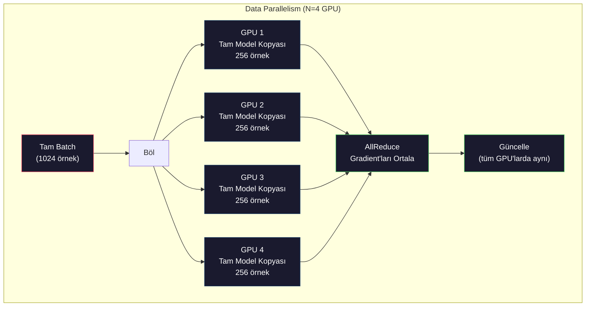
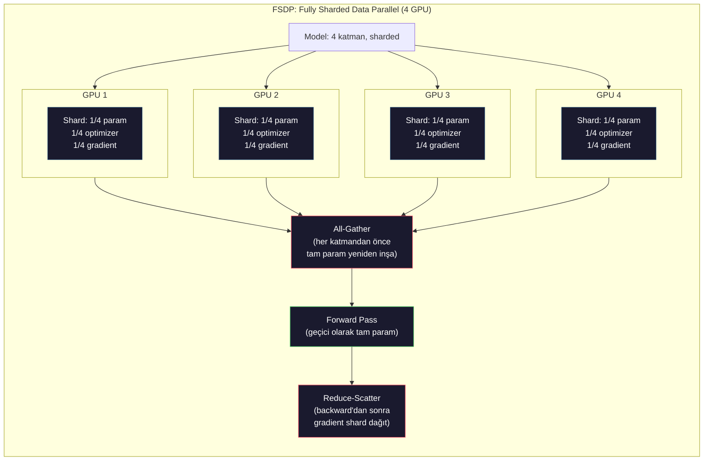
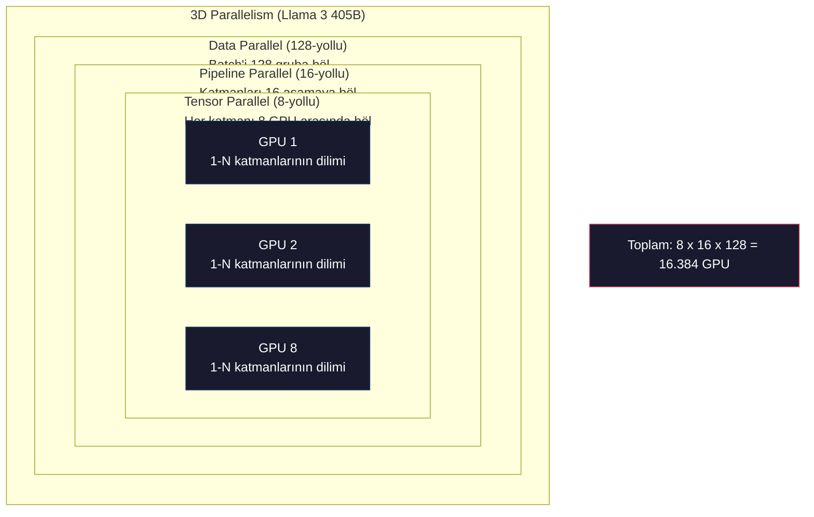

# Ölçekleme: Distributed Training, FSDP, DeepSpeed

> 124M modelin tek GPU'da eğitildi. Şimdi 7 milyar parametre dene. Model belleğe sığmaz. Veri tek bir makinede haftalar alır. Distributed training ölçekte opsiyonel değil. İleriye giden tek yoldur.

**Tür:** Yapım
**Diller:** Python
**Ön koşullar:** Faz 10, Ders 04 (Mini GPT Pretraining)
**Süre:** ~120 dakika

## Öğrenme Hedefleri

- Üç paralellik tipini (data, tensor, pipeline) ve her birinin model ve cluster boyutuna göre ne zaman gerekli olduğunu açıkla
- Birden fazla GPU üzerinde gradient senkronizasyonu ile PyTorch DDP kullanarak data-parallel eğitim implement et
- Minimum donanımı belirlemek için belirli bir model boyutu için memory bütçesini (ağırlıklar + optimizer state'leri + gradient'lar + activation'lar) hesapla
- Tek GPU belleğini aşan modelleri sığdırmak için model state'lerini GPU'lar arasında shard etmek üzere FSDP veya DeepSpeed ZeRO aşamalarını yapılandır

## Sorun

FP16'da 7B parametre modeli sadece ağırlıklar için 14GB ister. Adam optimizer her parametrenin iki ek kopyasını (birinci ve ikinci moment tahminleri) saklar. Bu başka 28GB. Backpropagation sırasındaki gradient'lar 14GB daha ekler. Tek bir activation saklanmadan 56GB'desin.

NVIDIA A100'ün 80GB belleği var.

80GB'ın 56GB'ı tüketildi. Activation'lar için 24GB kalıyor — forward pass sırasında hesaplanan ve backpropagation için canlı tutulması gereken ara değerler. 4096 boyutlu modelle 2048 token'lık bir sequence için, tek katmanın activation'ları yaklaşık 64MB kullanır. 32 katmanla, örnek başına 2GB ihtiyacın var. 8 batch size 16GB gerektirir. 24GB'in var. 12 batch size patlar.

Şimdi 70B parametre dene. Sadece ağırlıklar: FP16'da 140GB. Tek GPU'ya sığmaz. Sadece ağırlıkları tutmak için en az 2 A100'e (2 x 80GB = 160GB) ihtiyacın var. Optimizer state'lerini ve gradient'ları ekle çok daha fazlasına ihtiyacın olur: minimum 3+ GPU ve gerçekçi olarak sharding stratejisine bağlı olarak 8-16.

Llama 3 405B 16.384 NVIDIA H100 GPU üzerinde eğitildi. Eğitim koşusu tahmini 100 milyon dolar compute'a mal oldu. DeepSeek V3 benzer bir modeli mimari konusunda akıllıca davranarak (Mixture of Experts, parametrelerin sadece bir kısmının token başına aktif olduğu anlamına gelir) ve eğitim verimliliği ile kabaca 5.6 milyon dolara eğitti.

Bu ders büyük ölçekli eğitimi mümkün kılan dört stratejiyi kapsar: data parallelism, tensor parallelism, pipeline parallelism ve fully sharded data parallelism. Distributed training framework'üne dokunmadan mekanikleri anlamak için her birini saf Python'da simüle edeceksin.

## Kavram

### Distribution Neden Gerekli

Gerçek modeller için memory matematiği. Her sayı hesaplanmış, tahmin edilmemiştir.

| Model | Param | Ağırlık (FP16) | Adam State'leri | Gradient (FP16) | Toplam (activation hariç) |
|-------|--------|----------------|-------------|------------------|----------------------|
| GPT-2 Small | 124M | 248 MB | 992 MB | 248 MB | 1.5 GB |
| Llama 3 8B | 8B | 16 GB | 64 GB | 16 GB | 96 GB |
| Llama 3 70B | 70B | 140 GB | 560 GB | 140 GB | 840 GB |
| Llama 3 405B | 405B | 810 GB | 3.240 GB | 810 GB | 4.860 GB |

"Adam State'leri" sütunu katildir. Adam her parametre için bir running mean (m) ve bir running variance (v) saklar, her ikisi de FP32'de. 70B model için, bu 70B x 4 byte x 2 = 560GB. Sadece optimizer yedi A100 ister.

Tek H100'ün 80GB'ı var. Llama 3 405B ağırlıkları, optimizer'ı ve gradient'ları tutmak için en az 61 H100 ister. Activation'ları ekle, sayı daha da büyür. Meta 16.384 GPU kullandı, istedikleri için değil — yapmak zorunda oldukları için.

### Data Parallelism

En basit distributed strateji. Tüm modeli N GPU'ya kopyala. Her eğitim batch'ini N eşit parçaya böl. Her GPU kendi veri shard'ı üzerinde forward ve backward pass çalıştırır. Backward pass'ten sonra, gradient'ları tüm GPU'lar arasında ortala. Her GPU kendi ağırlık kopyasını aynı ortalanmış gradient'larla günceller, tüm kopyaları senkron tutar.

**İyi yanı:** Lineer throughput ölçekleme. N GPU adım başına N kat daha fazla veri işler. İletişim hesaplamayla overlap eden gradient ortalamasıyla sınırlıdır.

**Kötü yanı:** Her GPU modelin, optimizer state'lerinin ve gradient'ların tam bir kopyasını tutar. 70B model için, her GPU 840GB ister. Data parallelism per-GPU belleği azaltmak için hiçbir şey yapmaz. Sadece eğitim süresini azaltır.

**Matematik:** Etkili batch size = per_gpu_batch_size x N. Per-GPU batch'i 16 olan N=64 GPU için, etkili batch 1.024. Llama 3 adım başına 16 milyon token'lık bir etkili batch size kullandı.



### Tensor Parallelism

Tek tek katmanları GPU'lar arasında böl. Tek bir matrix multiplication GPU'lar arasında bölünür, her biri sonucun bir kısmını hesaplar.

Feedforward katmanında (8192, 8192) şekilli bir weight matrisi düşün. 4-yollu tensor parallelism ile, her GPU bir (8192, 2048) shard tutar. Her GPU input'u kendi shard'ı ile çarpar ve kısmi bir sonuç üretir. Kısmi sonuçlar tam output'u üretmek için (all-reduce veya all-gather ile) birleştirilir.

**İyi yanı:** Model ağırlıkları için per-GPU belleği azaltır. 8 GPU arasında bölünmüş bir 70B model her GPU'nun ~8.75B parametre değerinde ağırlık tuttuğu anlamına gelir.

**Kötü yanı:** Her katmandan sonra hızlı GPU-arası iletişim gerektirir. Her matmul'dan sonraki all-reduce gecikme ekler. Bu NVLink ile (aynı node'daki GPU'lar arasında 900 GB/s) iyi çalışır ama InfiniBand ile bağlı node'lar arasında (400 Gb/s, yaklaşık 50 GB/s) kötü çalışır. Tensor parallelism neredeyse her zaman tek bir node ile sınırlıdır (8 GPU).

**Gerçek kullanım:** Megatron-LM tensor parallelism'i öncülük etti. Llama 3 405B her node içinde 8-yollu tensor parallelism kullanır.

### Pipeline Parallelism

Modeli katmanlara göre böl. GPU 1 katmanları 1-8'i çalıştırır. GPU 2 katmanları 9-16'yı çalıştırır. GPU 3 katmanları 17-24'ü çalıştırır. GPU 4 katmanları 25-32'yi çalıştırır. Veri pipeline boyunca akar: GPU 1 katmanlarını hesaplar ve activation'ları GPU 2'ye gönderir, o katmanlarını hesaplar ve GPU 3'e gönderir vb.

**İyi yanı:** GPU'lar arasında minimal iletişim — sadece gradient veya ağırlıklarla karşılaştırıldığında küçük olan katman sınırlarındaki activation'lar. Bandwidth gereksinimleri düşük olduğu için node'lar arasında çalışır.

**Kötü yanı:** Pipeline bubble'ları. GPU 4 micro-batch 1 üzerinde forward pass hesaplarken, GPU 1, 2 ve 3 boştadır (kendi kısımlarını zaten forward etmişlerdir). Backward pass sırasında, desen ters döner. Naif pipelining ile, GPU kullanımı N pipeline aşaması için sadece 1/N'dir.

**GPipe ve PipeDream** batch'i micro-batch'lere bölerek bubble problemini çözer. GPU 1 micro-batch 1'i forward'lamayı bitirir bitirmez micro-batch 2 üzerinde başlar. Bu pipeline aşamaları arasında hesaplamayı overlap eder. M micro-batch ve N aşama ile, bubble oranı (N-1)/M'e düşer. N=4 aşama ile M=16 micro-batch kullan ve bubble 3/16 = %18.75 boş zamandır.

### FSDP: Fully Sharded Data Parallel

FSDP data parallelism'in ölçeklenebilirliğini sharding'in memory verimliliğiyle birleştirir. Her GPU'nun modelin tam bir kopyasını tutması yerine, her GPU sadece parametrelerin, gradient'ların ve optimizer state'lerinin 1/N'sini tutar.

Bir katmanın forward pass'ından önce, FSDP tüm GPU'lardan tam parametreleri her GPU'nun belleğine toplamak için bir **all-gather** çalıştırır. Forward pass'tan sonra, her GPU yerel olmayan parametreleri atar. Backward sırasında, gradient hesaplaması için parametreleri yeniden inşa etmek için all-gather tekrar çalışır. Backward pass'tan sonra, bir **reduce-scatter** gradient shard'larını dağıtır, böylece her GPU sadece gradient'ların 1/N'sini saklar.

**8 GPU'da 70B model için matematik:**

| Bileşen | FSDP Olmadan | FSDP İle |
|-----------|-------------|-----------|
| Ağırlıklar (FP16) | GPU başına 140 GB | GPU başına 17.5 GB |
| Adam State'leri (FP32) | GPU başına 560 GB | GPU başına 70 GB |
| Gradient'lar (FP16) | GPU başına 140 GB | GPU başına 17.5 GB |
| **Toplam** | **GPU başına 840 GB** | **GPU başına 105 GB** |

FSDP olmadan, 80GB tek bir GPU'ya 70B model sığdıramazsın. 8 GPU üzerinde FSDP ile, her GPU 105GB kullanır — dur, bu da hala sığmıyor. GPU başına 80GB'ın altına inmek için en az 16 GPU'a ihtiyacın var, veya FSDP'yi activation checkpointing ile birleştirirsin (activation'ları saklamak yerine backward sırasında yeniden hesapla).

İletişim maliyeti her katmandan önceki all-gather nedeniyle vanilya data parallelism'den daha yüksek. Ama memory tasarrufları önceden imkansız eğitim koşularını mümkün kılar.



### DeepSpeed ZeRO

DeepSpeed'in ZeRO'su (Zero Redundancy Optimizer) kavramsal olarak FSDP ile aynı ama Microsoft tarafından bağımsız geliştirildi. Her biri daha agresif shard eden üç aşama tanımlar:

| Aşama | Shard Eder | Memory Tasarrufu | İletişim |
|-------|--------|---------------|---------------|
| ZeRO-1 | Sadece optimizer state'leri | ~4x azalma | Data parallel ile aynı |
| ZeRO-2 | + Gradient'lar | ~8x azalma | Biraz daha fazla |
| ZeRO-3 | + Parametreler | ~Nx azalma (N GPU) | Katman başına all-gather |

ZeRO-3 FSDP'e eşdeğerdir. Adlandırma farklıdır, mekanizma aynı. PyTorch DeepSpeed kavramı kanıtladıktan sonra FSDP'i native bir implementasyon olarak ekledi.

DeepSpeed ayrıca ZeRO-Offload (optimizer state'lerini daha ucuz ve büyük olan CPU RAM'e offload et) ve ZeRO-Infinity (NVMe SSD'lere offload et) tanıttı. Bunlar compute hızını memory kapasitesi için takas eder — offload edilen işlemler daha yavaştır ama GPU belleğini boşaltır.

### Mixed Precision Training

Modern eğitim aynı anda birden fazla floating-point format kullanır:

- **Forward pass**: FP16 veya BF16 (16-bit). FP32'nin yarısı memory. Matmul'lar tensor core'larda 2x daha hızlı çalışır.
- **Master ağırlıklar**: FP32 (32-bit). Ağırlık güncellemeleri sırasında sayısal hassasiyet için optimizer tarafından tutulur.
- **Loss scaling**: FP16 gradient'ların sıfıra underflow etmesini önlemek için backward pass'tan önce loss'u büyük bir sabitle çarp. Optimizer adımından önce aynı sabite böl.

BF16 (Brain Float 16) FP32 ile aynı exponent aralığına sahiptir (8 exponent bit) ama düşük precision (7 mantissa bit, FP32'nin 23'üne karşı). Aynı değer aralığını temsil edebildiği için nadiren loss scaling gerekir. FP16'nın 5 exponent bit ve 10 mantissa bit'i var — ince taneli değerleri temsil edebilir ama ekstrem büyüklüklerde overflow/underflow yapar.

Google'ın TPU'ları BF16'yı native kullanır. NVIDIA'nın A100 ve H100'ü hem FP16 hem BF16'yı destekler. Endüstri büyük ölçüde BF16'ya geçti çünkü loss scaling baş ağrılarını ortadan kaldırır.

**7B model için memory karşılaştırması:**

| Precision | Ağırlık | Optimizer | Gradient | Toplam |
|-----------|---------|-----------|-----------|-------|
| Her yerde FP32 | 28 GB | 56 GB | 28 GB | 112 GB |
| Mixed (BF16 + FP32 master) | 14 GB | 56 GB | 14 GB | 84 GB |

Mixed precision bu modelde 28GB tasarruf eder. Optimizer state'leri her durumda FP32'de kalır — memory'nin çoğu buraya gider.

### Megatron-LM ve 3D Parallelism

Gerçek büyük ölçekli eğitim üç paralelliği de birleştirir:

- **Data parallelism** node grupları boyunca (batch size'ı ölçeklendir)
- **Tensor parallelism** bir node içinde (katmanları 8 GPU arasında böl)
- **Pipeline parallelism** node'lar arasında (katman gruplarını makineler arasında böl)

16.384 H100'de Llama 3 405B:
- Her node içinde 8-yollu tensor parallelism (node başına 8 GPU)
- Node'lar arasında 16-yollu pipeline parallelism (16 pipeline aşaması)
- Kalan boyut boyunca 128-yollu data parallelism (16.384 / 8 / 16 = 128)

Bu 3D ayrışma (8 x 16 x 128 = 16.384) binlerce GPU'ya nasıl ölçeklendiğindir. Her GPU farklı bir veri shard'ı görür (data parallel), her katmanın bir dilimini tutar (tensor parallel) ve farklı bir katman seti hesaplar (pipeline parallel).

DeepSeek V3 farklı bir yaklaşım izledi. Mixture of Experts mimarileri token başına 671B parametreden sadece 37B'yi aktive eder. Bu, her GPU'nun sadece aktif parametreleri hesaplaması (ve activation'larını saklaması) gerektiği anlamına gelir. 2.048 H800 GPU üzerinde eğittiler — Meta'nın GPU sayısının 1/8'inden azı — Meta'nın tahmini 100M$'ına karşı 5.6M$'a.



## İnşa Et

### Adım 1: Data Parallelism Simüle Et

Bir batch'i simüle edilmiş GPU'lar arasında böl. Her GPU kendi shard'ında forward pass hesaplar. "Gradient'ları" (onları loss değerleri olarak simüle ediyoruz) ortala.

```python
import numpy as np

def simulate_data_parallelism(data, num_gpus, model_fn):
    batch_size = len(data)
    shard_size = batch_size // num_gpus
    remainder = batch_size % num_gpus

    gpu_losses = []
    gpu_gradients = []

    offset = 0
    for gpu_id in range(num_gpus):
        extra = 1 if gpu_id < remainder else 0
        shard = data[offset:offset + shard_size + extra]
        offset += shard_size + extra

        loss, grad = model_fn(shard)
        gpu_losses.append(loss)
        gpu_gradients.append(grad)

    avg_loss = np.mean(gpu_losses)
    avg_gradient = np.mean(gpu_gradients, axis=0)

    return avg_loss, avg_gradient
```

All-reduce operasyonu (gradient ortalaması) data parallelism'deki tek iletişimdir. Pratikte, bu NVIDIA GPU'lar üzerinde ring all-reduce implement eden NCCL kütüphanesini kullanır: her GPU gradient'larının 1/N'sini komşusuna gönderir, diğer komşusundan 1/N alır ve N-1 adımdan sonra her GPU tam ortalamaya sahiptir. Toplam iletişim hacmi: 2 x gradient_size x (N-1)/N, büyük N için gradient size'ın 2 katına yaklaşır.

### Adım 2: Tensor Parallelism Simüle Et

Bir weight matrisini GPU'lar arasında böl. Her GPU kısmi bir matrix multiplication hesaplar. Sonuçları birleştir.

```python
def simulate_tensor_parallelism(input_data, weight_matrix, num_gpus):
    d_in, d_out = weight_matrix.shape
    assert d_out % num_gpus == 0, f"d_out {d_out}, num_gpus {num_gpus}'a bölünmüyor"
    shard_size = d_out // num_gpus

    partial_results = []
    for gpu_id in range(num_gpus):
        start = gpu_id * shard_size
        end = start + shard_size
        weight_shard = weight_matrix[:, start:end]

        partial = input_data @ weight_shard
        partial_results.append(partial)

    full_output = np.concatenate(partial_results, axis=-1)

    direct_output = input_data @ weight_matrix
    error = np.abs(full_output - direct_output).max()

    return full_output, error
```

Hata tam olarak sıfır (veya machine epsilon) olmalı. Tensor parallelism matematiksel olarak tam — bir GPU'da tam matmul hesaplamakla aynı sonucu üretir. Bölme output boyutu boyuncadır, dolayısıyla her GPU farklı bir sütun chunk'ı üretir ve concatenation tam sonucu yeniden inşa eder.

Column-parallel lineer katmanlar için (output boyutunu bölme), concat edersin. Row-parallel için (input boyutunu bölme), toplarsın. Transformer FFN'de, ilk lineer (expand) column-parallel kullanır ve ikinci lineer (contract) row-parallel kullanır. Bu iki katman arasındaki all-reduce'u engeller.

### Adım 3: Pipeline Parallelism Simüle Et

Bir modelin katmanlarını sanal GPU'lar arasında böl. Erken aşamaların sonraki aşamalar hesaplarken boş durduğu bubble problemini göster.

```python
def simulate_pipeline_parallelism(num_layers, num_stages, num_microbatches):
    layers_per_stage = num_layers // num_stages

    timeline = {}
    clock = 0

    for mb in range(num_microbatches):
        for stage in range(num_stages):
            start_time = max(
                timeline.get((stage, mb - 1, "fwd"), (0, 0))[1] if mb > 0 else 0,
                timeline.get((stage - 1, mb, "fwd"), (0, 0))[1] if stage > 0 else 0,
            )
            end_time = start_time + layers_per_stage
            timeline[(stage, mb, "fwd")] = (start_time, end_time)

    last_fwd_end = max(v[1] for v in timeline.values())

    for mb in range(num_microbatches - 1, -1, -1):
        for stage in range(num_stages - 1, -1, -1):
            deps = [last_fwd_end]
            if mb < num_microbatches - 1 and (stage, mb + 1, "bwd") in timeline:
                deps.append(timeline[(stage, mb + 1, "bwd")][1])
            if stage < num_stages - 1 and (stage + 1, mb, "bwd") in timeline:
                deps.append(timeline[(stage + 1, mb, "bwd")][1])
            start_time = max(deps)
            end_time = start_time + layers_per_stage
            timeline[(stage, mb, "bwd")] = (start_time, end_time)

    total_time = max(v[1] for v in timeline.values())
    compute_time = num_microbatches * num_stages * layers_per_stage * 2
    bubble_fraction = 1.0 - compute_time / (total_time * num_stages)

    return timeline, total_time, bubble_fraction
```

4 aşama ve 1 micro-batch ile, bubble oranı %75 — dörtte üç GPU herhangi bir anda boşta. 16 micro-batch ile, yaklaşık %19'a düşer. Bubble'ları ortadan kaldırmanın maliyeti memory: tüm uçuştaki micro-batch'lerin activation'larını eşzamanlı saklamak zorundasın.

### Adım 4: Memory Hesaplayıcı

Herhangi bir model boyutunu eğitmek için tam memory gereksinimlerini hesapla.

```python
def memory_calculator(
    params_billions,
    precision_bytes=2,
    optimizer="adam",
    num_gpus=1,
    sharding="none",
    sequence_length=2048,
    batch_size_per_gpu=1,
    hidden_dim=None,
    num_layers=None,
):
    params = params_billions * 1e9

    weight_memory = params * precision_bytes

    if optimizer == "adam":
        optimizer_memory = params * 4 * 2
    elif optimizer == "sgd":
        optimizer_memory = params * 4
    else:
        optimizer_memory = 0

    gradient_memory = params * precision_bytes

    total_no_activation = weight_memory + optimizer_memory + gradient_memory

    if hidden_dim and num_layers:
        activation_per_layer = (
            sequence_length * batch_size_per_gpu * hidden_dim * precision_bytes * 4
        )
        activation_memory = activation_per_layer * num_layers
    else:
        activation_memory = params * precision_bytes * 0.5

    if sharding == "fsdp" or sharding == "zero3":
        weight_memory /= num_gpus
        optimizer_memory /= num_gpus
        gradient_memory /= num_gpus
    elif sharding == "zero2":
        optimizer_memory /= num_gpus
        gradient_memory /= num_gpus
    elif sharding == "zero1":
        optimizer_memory /= num_gpus

    per_gpu_total = weight_memory + optimizer_memory + gradient_memory + activation_memory

    return {
        "params_billions": params_billions,
        "weights_gb": weight_memory / 1e9,
        "optimizer_gb": optimizer_memory / 1e9,
        "gradients_gb": gradient_memory / 1e9,
        "activations_gb": activation_memory / 1e9,
        "per_gpu_total_gb": per_gpu_total / 1e9,
        "total_across_gpus_gb": per_gpu_total * num_gpus / 1e9,
        "fits_on_80gb": per_gpu_total / 1e9 <= 80,
        "num_gpus": num_gpus,
        "sharding": sharding,
    }
```

Bu hesaplayıcı her ML mühendisinin sorduğu soruyu yanıtlar: "Kaç GPU'ya ihtiyacım var?" Ona model boyutunu ver ve sığıp sığmadığını gör. Per-GPU toplam 80GB altına düşene kadar sharding stratejisini ayarla.

### Adım 5: Mixed Precision Simülasyonu

FP32, FP16 ve mixed precision training arasında memory kullanımını karşılaştır.

```python
def mixed_precision_comparison(params_billions):
    params = params_billions * 1e9

    fp32_weights = params * 4
    fp32_optimizer = params * 4 * 2
    fp32_gradients = params * 4
    fp32_total = fp32_weights + fp32_optimizer + fp32_gradients

    fp16_weights = params * 2
    fp16_master = params * 4
    fp16_optimizer = params * 4 * 2
    fp16_gradients = params * 2
    fp16_total = fp16_weights + fp16_master + fp16_optimizer + fp16_gradients

    mixed_weights = params * 2
    mixed_optimizer = params * 4 * 2
    mixed_gradients = params * 2
    mixed_total = mixed_weights + mixed_optimizer + mixed_gradients

    return {
        "fp32_total_gb": fp32_total / 1e9,
        "fp16_with_master_gb": fp16_total / 1e9,
        "mixed_bf16_gb": mixed_total / 1e9,
        "savings_vs_fp32": 1 - mixed_total / fp32_total,
    }
```

Çoğu insan için en büyük sürpriz: mixed precision memory'i yarıya indirmez. Optimizer state'leri (Adam'ın m ve v'si) precision'dan bağımsız olarak FP32'de kalır. 7B model için, FP32 eğitim 112GB kullanır. Mixed precision 84GB kullanır. Bu %25 azalma, %50 değil. Optimizer baskındır.

## Kullan

### Tüm Simülasyonları Çalıştır

```python
def run_all_demos():
    print("=" * 70)
    print("DATA PARALLELISM SİMÜLASYONU")
    print("=" * 70)

    np.random.seed(42)
    data = np.random.randn(64, 32)
    weight = np.random.randn(32, 16)

    def model_fn(batch):
        output = batch @ weight
        loss = np.mean(output ** 2)
        grad = 2 * batch.T @ (batch @ weight) / len(batch)
        return loss, grad

    for n_gpus in [1, 2, 4, 8]:
        loss, grad = simulate_data_parallelism(data, n_gpus, model_fn)
        print(f"  {n_gpus} GPU: loss={loss:.4f}, grad_norm={np.linalg.norm(grad):.4f}")

    print()
    print("=" * 70)
    print("TENSOR PARALLELISM SİMÜLASYONU")
    print("=" * 70)

    x = np.random.randn(4, 8192)
    W = np.random.randn(8192, 8192)

    for n_gpus in [1, 2, 4, 8]:
        output, error = simulate_tensor_parallelism(x, W, n_gpus)
        print(f"  {n_gpus} GPU: output_shape={output.shape}, max_error={error:.2e}")

    print()
    print("=" * 70)
    print("PIPELINE PARALLELISM SİMÜLASYONU")
    print("=" * 70)

    for n_mb in [1, 4, 8, 16, 32]:
        _, total_t, bubble = simulate_pipeline_parallelism(32, 4, n_mb)
        print(f"  {n_mb:2d} micro-batch: total_time={total_t:4d}, bubble={bubble:.1%}")

    print()
    print("=" * 70)
    print("MEMORY HESAPLAYICI")
    print("=" * 70)

    configs = [
        (7, "none", 1),
        (7, "fsdp", 8),
        (70, "none", 1),
        (70, "fsdp", 8),
        (70, "fsdp", 16),
        (405, "fsdp", 64),
        (405, "fsdp", 128),
    ]

    print(f"  {'Model':>8} {'Sharding':>8} {'GPU':>5} {'Per-GPU':>10} {'80GB sığar':>10}")
    print("  " + "-" * 50)
    for params, shard, gpus in configs:
        result = memory_calculator(params, num_gpus=gpus, sharding=shard)
        fits = "Evet" if result["fits_on_80gb"] else "Hayır"
        print(f"  {params:>6}B {shard:>8} {gpus:>5} {result['per_gpu_total_gb']:>8.1f}GB {fits:>10}")

    print()
    print("=" * 70)
    print("MIXED PRECISION KARŞILAŞTIRMA")
    print("=" * 70)

    for params_b in [7, 13, 70, 405]:
        result = mixed_precision_comparison(params_b)
        print(f"  {params_b}B: FP32={result['fp32_total_gb']:.0f}GB, "
              f"Mixed BF16={result['mixed_bf16_gb']:.0f}GB, "
              f"Tasarruf={result['savings_vs_fp32']:.0%}")
```

## Yayınla

Bu ders `outputs/prompt-distributed-training-planner.md` üretir — bir model boyutu ve mevcut donanım alan ve sonra tam bir distributed training planı üreten bir prompt: paralellik stratejisi, memory bütçesi, iletişim overhead'i ve beklenen throughput.

## Alıştırmalar

1. Memory hesaplayıcıyı activation checkpointing'i içerecek şekilde değiştir. Checkpointing ile, sadece her K'inci katmanda activation sakla (tipik K=1, hepsini yeniden hesapla demek). Memory-compute tradeoff'unu göster: checkpointing ne kadar memory tasarruf eder ve eğitimi ne kadar yavaşlatır (full checkpointing için kabaca %33 daha fazla compute)?

2. Pipeline parallelism simülasyonunu PipeDream tarafından kullanılan 1F1B (one forward, one backward) schedule'unu implement edecek şekilde genişlet. 4 aşama ve 8 micro-batch için bubble oranını naif schedule'a karşı karşılaştır. 1F1B schedule daha küçük tepe memory'e sahip olmalı çünkü backward pass'leri daha erken başlatır.

3. Bir gradient accumulation simülatörü implement et. Her micro-batch'ten sonra all-reduce yapmak yerine, K adım boyunca gradient'ları lokal olarak biriktir, sonra all-reduce yap. Bunun iletişimi K kez azalttığını ama özdeş final gradient'lar (ve dolayısıyla özdeş eğitim) ürettiğini göster.

4. Bir maliyet tahminci inşa et. Bir model boyutu, hedef token sayısı, GPU tipi (A100 $2/saat, H100 $3.50/saat) ve paralellik stratejisi verildiğinde, toplam eğitim maliyetini dolar olarak tahmin et. Bilinen maliyetlere karşı doğrula: Llama 3 405B'nin ~100M$ ve DeepSeek V3'ün ~5.6M$ maliyeti olduğu bildirildi.

5. Memory hesaplayıcıya ZeRO-Offload ekle. CPU RAM'in node başına 512GB ve NVMe'nin 2TB olduğunu varsay. Optimizer state'lerini CPU'ya offload etmenin %30-50 daha yavaş optimizer adımları maliyetiyle 70B modelin 16 yerine 4 GPU'da eğitilmesine nasıl izin verdiğini göster.

## Anahtar Terimler

| Terim | İnsanlar ne diyor | Gerçekte ne anlama geliyor |
|------|----------------|----------------------|
| Data parallelism | "Modeli her GPU'ya kopyala" | Her GPU farklı bir veri shard'ı işler; her adımdan sonra gradient'lar all-reduce ile ortalanır |
| Tensor parallelism | "Bir katmanı GPU'lar arasında böl" | Her GPU matmul'un bir kısmını hesaplayacak şekilde weight matrislerini partition et; hızlı NVLink interconnect ister |
| Pipeline parallelism | "Katmanları GPU'lar arasında böl" | Her GPU farklı bir katman grubu çalıştırır; veri micro-batch'lerle pipeline boyunca akar, bubble'ları azaltmak için |
| FSDP | "Her şeyi shard et" | Fully Sharded Data Parallel — her GPU ağırlıkların, gradient'ların ve optimizer state'lerinin 1/N'sini tutar; compute öncesi all-gather |
| ZeRO | "DeepSpeed'in FSDP versiyonu" | 3 aşamalı Zero Redundancy Optimizer: optimizer'ı shard et (Aşama 1), + gradient'lar (Aşama 2), + parametreler (Aşama 3) |
| All-reduce | "GPU'lar arasında ortala" | Her GPU'nun tüm GPU'ların input'larının toplamı (veya ortalaması) ile bittiği collective operasyon — tipik olarak ring all-reduce olarak implement edilir |
| All-gather | "Tüm GPU'lardan topla" | Her GPU'nun tüm GPU'ların verisinin concatenation'ı ile bittiği collective operasyon — FSDP'de tam parametreleri yeniden inşa etmek için kullanılır |
| Reduce-scatter | "Topla ve dağıt" | Veriyi reduce eden (toplayan) ve farklı chunk'ları farklı GPU'lara scatter eden collective operasyon — FSDP'de gradient sharding için kullanılır |
| Mixed precision | "Yarım precision'da eğit" | Forward/backward için FP16/BF16 ve optimizer state'leri için FP32 kullan — %25 memory tasarrufu, %50 değil, çünkü optimizer baskın |
| Pipeline bubble | "Pipeline'daki boş zaman" | GPU'ların önceki aşamadan veri beklerken boş durduğu zaman oranı — daha fazla micro-batch kullanarak azalır |

## İleri Okuma

- [Rajbhandari et al., 2020 -- "ZeRO: Memory Optimizations Toward Training Trillion Parameter Models"](https://arxiv.org/abs/1910.02054) -- üç sharding aşamasını tanımlayan DeepSpeed ZeRO makalesi
- [Shoeybi et al., 2020 -- "Megatron-LM: Training Multi-Billion Parameter Language Models Using Model Parallelism"](https://arxiv.org/abs/1909.08053) -- transformer'lar için NVIDIA'nın tensor parallelism'i
- [Narayanan et al., 2021 -- "Efficient Large-Scale Language Model Training on GPU Clusters Using Megatron-LM"](https://arxiv.org/abs/2104.04473) -- data, tensor ve pipeline'ı birleştiren 3D parallelism
- [Zhao et al., 2023 -- "PyTorch FSDP: Experiences on Scaling Fully Sharded Data Parallel"](https://arxiv.org/abs/2304.11277) -- PyTorch'un native FSDP implementasyonu
- [Llama 3 Technical Report](https://arxiv.org/abs/2407.21783) -- 3D parallelism detayları ile 16.384 GPU eğitimi
- [DeepSeek-V3 Technical Report](https://arxiv.org/abs/2412.19437) -- MoE mimarisinin eğitim maliyetini nasıl bir büyüklük sırası azalttığı
