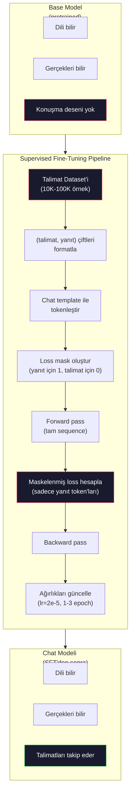

# Instruction Tuning (SFT)

> Base model sonraki token'ı tahmin eder. Hepsi bu. Talimatları takip etmez, soru cevaplamaz, zararlı istekleri reddetmez. SFT bir token tahmincisi ile faydalı bir asistan arasındaki köprüdür. Konuştuğun her model — Claude, GPT, Llama Chat — bu adımdan geçti.

**Tür:** Yapım
**Diller:** Python (numpy ile)
**Ön koşullar:** Faz 10, Ders 04 (Mini GPT Pretraining)
**Süre:** ~90 dakika

## Öğrenme Hedefleri

- Bir base dil modelini talimat-takip eden bir asistana dönüştüren supervised fine-tuning (SFT) implement et
- Eğitim verisini system, user ve assistant rolleriyle chat template'leri kullanarak formatla ve non-assistant token'larda loss'u maskele
- SFT'nin neden gerekli olduğunu açıkla: base modeller soru cevaplamak yerine metni devam ettirir
- Held-out talimat seti üzerinde base model vs fine-tuned model yanıtlarını karşılaştırarak SFT kalitesini değerlendir

## Sorun

Ders 04'te bir model eğittin. Bir sequence verildiğinde sonraki token'ı tahmin edebiliyor. Ona "The transformer architecture" ver ve "has revolutionized natural language processing" ile devam edebilir. Bu bir next-token tahmincisi için etkileyici.

Şimdi şunu dene: ona "What is the capital of France?" ver. Base model "Paris" yanıtı vermez. Deseni devam ettirir. "What is the capital of Germany? What is the capital of Spain?" üretebilir çünkü soru listeleri içeren dokümanlardan öğrendi. Veya "is a question that many people ask" üretebilir çünkü bu makul bir next-token devamı. Modelin *cevaplama* kavramı yok. Sadece *devam ettirmeyi* bilir.

Bu, GPT-3 (base model, Haziran 2020 yayınlandı) ile ChatGPT (instruction-tuned, Kasım 2022 yayınlandı) arasındaki boşluktur. Aynı mimari. Aynı pretraining. Fark, modele konuşma desenini takip etmeyi öğreten 20.000 ila 100.000 dikkatlice hazırlanmış (talimat, yanıt) çiftleridir.

Stanford Alpaca milyonlarca örneğe ihtiyacın olmadığını kanıtladı. Mart 2023'te, GPT-3.5 tarafından üretilen sadece 52.000 instruction-response çifti üzerinde Llama 7B'yi fine-tune ettiler. Toplam maliyet: 600$. Sonuç talimatları takip edebilen, soru cevaplayabilen ve konuşma sürdürebilen bir chatbot. ChatGPT kadar iyi değil, ama 600$ ve birkaç saat eğitim için şaşırtıcı derecede yakın.

Meta'nın Llama 2 Chat'i ilk SFT aşaması için sadece ~27.000 yüksek kaliteli örnek kullandı. Anahtar içgörü: kalite, miktardan daha önemli. Yetenekli annotator'lar tarafından yazılmış 27.000 örnek, internetten kazınmış 1 milyon gürültülü örneği yener.

## Kavram

### SFT Aslında Ne Yapar

Supervised Fine-Tuning pretraining'deki aynı eğitim döngüsünü sürdürür — forward pass, loss hesapla, backward pass, ağırlıkları güncelle — ama farklı türde veri üzerinde. Ham metin yerine, yapılandırılmış konuşmalar üzerinde eğitirsin:

```json
{
  "system": "You are a helpful assistant.",
  "user": "What is the capital of France?",
  "assistant": "The capital of France is Paris."
}
```

Model Paris'in Fransa'nın başkenti olduğunu zaten biliyor. Bunu pretraining sırasında Wikipedia, ders kitapları ve web sayfalarından öğrendi. SFT modele yeni gerçekler öğretmez. Modele yeni bir *davranış* öğretir: bir soru gördüğünde, bir cevap üret. Bir talimat gördüğünde, bir completion üret. Zararlı bir istek gördüğünde, bir reddetme üret.

Şöyle düşün. Pretraining modele bilgi verir. SFT modele görgü verir.

### Veri Formatları

Üç format endüstriye baskındır. Her biri aynı bilgiyi — kim ne dedi — farklı sınırlayıcılarla encode eder.

**Alpaca Format** (Stanford, Mart 2023):

```json
{
  "instruction": "Summarize the following article in 3 sentences.",
  "input": "The European Central Bank raised interest rates...",
  "output": "The ECB increased rates by 25 basis points..."
}
```

Basit ve yaygın kullanılır. `input` alanı opsiyoneldir — çoğu talimat ek bağlam gerektirmez. Stanford bu formatta GPT-3.5 tarafından 600$'a üretilen 52.000 örnek yayınladı. Bu açık kaynak instruction tuning hareketini başlattı.

**ShareGPT Format** (topluluk, 2023):

```json
{
  "conversations": [
    {"from": "system", "value": "You are a helpful assistant."},
    {"from": "human", "value": "What causes tides?"},
    {"from": "gpt", "value": "Tides are caused by the gravitational pull of the Moon..."},
    {"from": "human", "value": "How often do they occur?"},
    {"from": "gpt", "value": "Most coastal areas experience two high tides and two low tides per day..."}
  ]
}
```

Multi-turn konuşmaları destekler. "from" alanı gerçek modele bakılmaksızın geleneksel olarak "human" ve "gpt" kullanır. Vicuna kullanıcı-paylaşımlı ChatGPT transkriptlerinden kazınmış 70.000 ShareGPT konuşması üzerinde eğitildi.

**ChatML Format** (OpenAI, birçok açık kaynak model tarafından kullanılır):

```
<|im_start|>system
You are a helpful assistant.<|im_end|>
<|im_start|>user
What is the capital of France?<|im_end|>
<|im_start|>assistant
The capital of France is Paris.<|im_end|>
```

Rolleri sınırlamak için özel token'lar (`<|im_start|>`, `<|im_end|>`) kullanır. Bu token'lar fine-tuning sırasında tokenleştiricinin vocabulary'sine eklenir. Qwen, Yi ve birçok diğer model ChatML kullanır.

Üç format da aynı şeyi başarır: modele "bu talimat, bu yanıt, bu deseni öğren" der.

### Neden Çalışır

Model dili pretraining'den zaten biliyor. Sorulardan sonra cevaplar, talimatlardan sonra completion'lar ve insanlar arası konuşmaların milyarlarca örneğini gördü. Desenler ağırlıklarda zaten encode edilmiş.

SFT bu latent yeteneği yoğunlaştırır. Modelin bağlamdan bir soruyu cevaplaması mı yoksa bir dokümanı devam ettirmesi mi gerektiğini çıkarması gerekmek yerine, SFT açıkça konuşma deseni üzerinde eğitir. Birkaç bin örnek sonra, model öğrenir: assistant role marker gördüğünde, faydalı bir yanıt üret.

Bu yüzden 27.000 örnek yeterli. Modele İngilizce öğretmiyorsun. Ona dünya hakkında gerçekler öğretmiyorsun. Ona tek bir basit davranış öğretiyorsun: talimatlara yanıt ver. Bilgi zaten oradaydı.

### Maskelenmiş Loss

Bu SFT'deki en önemli teknik detay ve çoğu tutorial bunu atlar.

Pretraining sırasında, her token üzerinde loss hesaplarsın. Model sequence'deki her sonraki token'ı tahmin etmeyi öğrenir. SFT sırasında, sadece *yanıt* token'larında loss hesaplarsın. Talimat token'ları bağlam için oradadır, ama model onları yanlış "tahmin ettiği" için cezalandırılmaz.

Neden? Çünkü modelin talimat *üretmeyi* öğrenmesini istemezsin. Talimatlara *yanıt vermeyi* öğrenmesini istersin. Talimat token'larında loss hesaplarsan, modeli "What is the capital of France?"'i sanki soru soran oymuş gibi tahmin etmeye eğitiyorsun. Bu gradient sinyalini boşa harcar ve modeli rolü hakkında karıştırabilir.

Pratikte, bir loss mask oluşturursun: yanıt token'ları için 1, talimat token'ları için 0. Token başına loss'u ortalama almadan önce bu mask ile çarp.

```
Token'lar: [SYS] You are helpful [USER] What is the capital? [ASST] Paris is the capital [EOS]
Loss mask:   0    0    0     0      0     0   0  0     0       1     1    1   1     1      1
```

Sadece `[ASST]`'den sonraki token'lar loss'a katkı sağlar. Model forward pass sırasında tüm konuşmayı görür (doğru yanıtı üretmek için talimata ihtiyacı vardır) ama ağırlıklarını sadece yanıtı ne kadar iyi tahmin ettiğine göre günceller.

### Eğitim Hyperparametreleri

SFT pretraining'den dramatik şekilde farklı hyperparametre kullanır. Sıfırdan eğitmiyorsun. Zaten çalışan bir modeli ayarlıyorsun.

| Parametre | Pretraining (Llama 2 7B) | SFT (Llama 2 Chat) |
|-----------|---------------------------|---------------------|
| Learning rate | 3e-4 (tepe) | 2e-5 |
| Epoch | 1 (veri üzerinde tek geçiş) | 2 |
| Batch size | 4M token | 64 örnek |
| Warmup adım | 2.000 | 0-100 |
| Weight decay | 0.1 | 0.0-0.1 |
| Veri boyutu | 2T token | 27.000 örnek |

Learning rate SFT için 15x daha düşük. Bu kritik. Fine-tuning sırasında yüksek bir learning rate pretrained bilgiyi yok eder. Model öğrendiklerini "unutur" ve küçük fine-tuning dataset'ine overfit eder. Buna catastrophic forgetting denir.

İki epoch model her eğitim örneğini iki kez görür demek. Küçük bir dataset'te 3 epoch'tan fazla memorization'a yol açar — model genelleme yerine eğitim örneklerini aynen üretmeye başlar.

### Catastrophic Forgetting

Fine-tuning genel yetenekleri yok edebilir. Instruction-following verisi üzerinde çok uzun eğit ve model kod yazma, matematik yapma veya yaratıcı metin üretme yeteneğini kaybeder. Eğitim verisinin spesifik formatında çok iyi, diğer her şeyde berbat olur.

Üç önlem:

1. **Düşük learning rate.** 1e-5 ila 5e-5. Daha küçük güncellemeler pretrained özelliklerin daha az tahrip olması demek.

2. **Kısa eğitim.** 1-3 epoch. Model overfit etmeden önce dur.

3. **Pretraining verisini karıştır.** Llama 2 Chat SFT dataset'ine küçük bir yüzde (%2-5) ham pretraining verisi karıştırdı. Bu, yeni instruction-following davranışını öğrenirken modele genel yeteneklerini "hatırlatır".

### Gerçek Sayılar

7B modeli 10.000 yüksek kaliteli talimat çifti üzerinde fine-tune etmek tek bir NVIDIA A100 80GB GPU'da yaklaşık 1 saat sürer. İşte matematik:

- 10.000 örnek x ortalama 512 token = 5.12M token
- 2 epoch = toplam 10.24M token
- 7B model fine-tuning için A100 throughput'u: ~3.000 token/saniye
- 10.24M / 3.000 = ~3.400 saniye = ~57 dakika

Mini GPT'imiz için (4 katman, 128 boyut), eğitim neredeyse anlık. Önemli olan mekanikleri anlamak, ölçek değil.



## İnşa Et

### Adım 1: Talimat Dataset'i

Sentetik bir talimat dataset'i oluştur. Production'da Scale AI ve Anthropic gibi şirketler bunları yazmak için human annotator çalıştırır. Formatı göstermek için programatik olarak oluşturacağız.

```python
import numpy as np

INSTRUCTION_DATA = [
    {
        "instruction": "What is the capital of France?",
        "response": "The capital of France is Paris."
    },
    {
        "instruction": "Explain gravity in one sentence.",
        "response": "Gravity is the force that attracts objects with mass toward each other."
    },
    {
        "instruction": "Write a haiku about the ocean.",
        "response": "Waves crash on the shore, salt and foam beneath the sun, endless blue expanse."
    },
    {
        "instruction": "What is 15 multiplied by 7?",
        "response": "15 multiplied by 7 is 105."
    },
    {
        "instruction": "Name three programming languages.",
        "response": "Three programming languages are Python, Rust, and TypeScript."
    },
    {
        "instruction": "Summarize photosynthesis.",
        "response": "Photosynthesis converts sunlight, water, and carbon dioxide into glucose and oxygen."
    },
    {
        "instruction": "What year did World War II end?",
        "response": "World War II ended in 1945."
    },
    {
        "instruction": "Define machine learning.",
        "response": "Machine learning is a field where algorithms learn patterns from data to make predictions."
    },
]
```

Sekiz örnek minik. Stanford Alpaca 52.000 kullandı. Ama mekanikler 8 mi 52.000 mi olduğuna bakılmaksızın aynı: tokenleştir, maskele, sadece yanıtlarda loss hesapla.

### Adım 2: Chat Template ile Tokenleştir

Instruction-response çiftlerini özel role marker'larla token sequence'lerine çevir. Marker'lar modele talimatın nerede bittiğini ve yanıtın nerede başladığını söyler.

```python
SPECIAL_TOKENS = {
    "INST_START": 253,
    "INST_END": 254,
    "RESP_START": 255,
}


def tokenize_instruction_pair(instruction, response, vocab_size=256):
    inst_tokens = list(instruction.encode("utf-8"))
    resp_tokens = list(response.encode("utf-8"))

    inst_tokens = [min(t, vocab_size - 4) for t in inst_tokens]
    resp_tokens = [min(t, vocab_size - 4) for t in resp_tokens]

    tokens = (
        [SPECIAL_TOKENS["INST_START"]]
        + inst_tokens
        + [SPECIAL_TOKENS["INST_END"]]
        + [SPECIAL_TOKENS["RESP_START"]]
        + resp_tokens
    )

    return tokens


def create_loss_mask(tokens):
    mask = np.zeros(len(tokens), dtype=np.float32)
    in_response = False

    for i, token in enumerate(tokens):
        if token == SPECIAL_TOKENS["RESP_START"]:
            in_response = True
            continue
        if in_response:
            mask[i] = 1.0

    return mask
```

Loss mask talimat token'ları için tüm sıfır ve yanıt token'ları için tüm bir. `RESP_START` token'ı kendi mask'i 0 alır çünkü o bir sınırlayıcı, yanıt içeriğinin parçası değil.

### Adım 3: Maskelenmiş Cross-Entropy Loss

Standart cross-entropy, ama loss mask ile çarpılmış. Sadece yanıt token'ları gradient'e katkı sağlar.

```python
def masked_cross_entropy_loss(logits, targets, loss_mask):
    batch, seq_len, vocab_size = logits.shape
    logits_flat = logits.reshape(-1, vocab_size)
    targets_flat = targets.reshape(-1)
    mask_flat = loss_mask.reshape(-1)

    max_logits = logits_flat.max(axis=-1, keepdims=True)
    log_softmax = logits_flat - max_logits - np.log(
        np.exp(logits_flat - max_logits).sum(axis=-1, keepdims=True)
    )

    per_token_loss = -log_softmax[np.arange(len(targets_flat)), targets_flat]

    masked_loss = per_token_loss * mask_flat
    num_response_tokens = mask_flat.sum()
    if num_response_tokens == 0:
        return 0.0
    loss = masked_loss.sum() / num_response_tokens

    return loss
```

Payda `num_response_tokens`, `seq_len` değil. Toplam sequence uzunluğuna bölersen, daha uzun talimatlar gradient sinyalini sulandırır. Yanıt token sayısına bölmek talimat uzunluğundan bağımsız olarak yanıt token başına eşit ağırlık sağlar.

### Adım 4: SFT Eğitim Döngüsü

Ders 04'teki MiniGPT'i yeniden kullan. Eğitim döngüsü pretraining'e neredeyse aynı görünür, ama talimat formatlaması ve maskelenmiş loss ile.

```python
import sys
import os
sys.path.insert(0, os.path.join(os.path.dirname(__file__), "..", "..", "04-pre-training-mini-gpt", "code"))
from main import MiniGPT, LayerNorm, FeedForward, MultiHeadAttention, TransformerBlock, Embedding


def sft_train(model, dataset, num_epochs=2, lr=2e-5, seq_len=64):
    formatted_data = []
    for example in dataset:
        tokens = tokenize_instruction_pair(example["instruction"], example["response"])
        mask = create_loss_mask(tokens)
        formatted_data.append((tokens, mask))

    print(f"SFT Eğitim: {len(formatted_data)} örnek, {num_epochs} epoch, lr={lr}")
    print(f"Toplam token: {sum(len(t) for t, _ in formatted_data):,}")
    print()

    losses = []

    for epoch in range(num_epochs):
        epoch_loss = 0.0
        num_batches = 0

        indices = np.random.permutation(len(formatted_data))

        for idx in indices:
            tokens, mask = formatted_data[idx]

            if len(tokens) < 3:
                continue
            if len(tokens) > seq_len:
                tokens = tokens[:seq_len]
                mask = mask[:seq_len]

            input_ids = np.array(tokens[:-1]).reshape(1, -1)
            target_ids = np.array(tokens[1:]).reshape(1, -1)
            loss_mask = np.array(mask[1:]).reshape(1, -1)

            logits = model.forward(input_ids)
            loss = masked_cross_entropy_loss(logits, target_ids, loss_mask)

            batch_size, s_len, v_size = logits.shape
            probs = np.exp(logits - logits.max(axis=-1, keepdims=True))
            probs = probs / probs.sum(axis=-1, keepdims=True)
            dlogits = probs.copy()
            dlogits[np.arange(batch_size)[:, None], np.arange(s_len), target_ids] -= 1.0

            mask_expanded = loss_mask[:, :, np.newaxis]
            num_resp = loss_mask.sum()
            if num_resp > 0:
                dlogits = dlogits * mask_expanded / num_resp

            for block in model.blocks:
                block.ffn.W1 -= lr * np.random.randn(*block.ffn.W1.shape) * 0.01
                block.ffn.W2 -= lr * np.random.randn(*block.ffn.W2.shape) * 0.01
                block.ffn.b1 -= lr * np.random.randn(*block.ffn.b1.shape) * 0.01
                block.ffn.b2 -= lr * np.random.randn(*block.ffn.b2.shape) * 0.01

            epoch_loss += loss
            num_batches += 1
            losses.append(loss)

        avg_loss = epoch_loss / max(num_batches, 1)
        print(f"Epoch {epoch + 1}/{num_epochs} | Ort. Loss: {avg_loss:.4f}")

    return model, losses
```

Learning rate 2e-5, Llama 2 Chat ile eşleşiyor. Bunu pretraining'de kullanılan 3e-4 ile karşılaştır — 15x daha küçük. Gradient maskelenmiş: talimat token'ları sıfır gradient üretir. Sadece yanıt token'ları ağırlıkları iter.

### Adım 5: Base vs SFT Model Karşılaştır

SFT'nin tüm amacı davranış değişikliğidir. Modelin instruction-formatted input'lara karşı ham metin devamlarına nasıl yanıt verdiğini kontrol ederek ölçelim.

```python
def generate_response(model, prompt_tokens, max_new_tokens=50, temperature=0.8):
    tokens = list(prompt_tokens)
    seq_len = model.embedding.pos_embed.shape[0]

    for _ in range(max_new_tokens):
        context = np.array(tokens[-seq_len:]).reshape(1, -1)
        logits = model.forward(context)
        next_logits = logits[0, -1, :]

        next_logits = next_logits / max(temperature, 1e-8)
        probs = np.exp(next_logits - next_logits.max())
        probs = probs / probs.sum()
        probs = np.clip(probs, 1e-10, 1.0)
        probs = probs / probs.sum()

        next_token = np.random.choice(len(probs), p=probs)
        tokens.append(int(next_token))

    return tokens


def evaluate_instruction_following(model, instructions):
    print("Talimat takibi değerlendirmesi:")
    print("-" * 50)

    for instruction in instructions:
        tokens = (
            [SPECIAL_TOKENS["INST_START"]]
            + [min(t, 252) for t in list(instruction.encode("utf-8"))]
            + [SPECIAL_TOKENS["INST_END"]]
            + [SPECIAL_TOKENS["RESP_START"]]
        )

        output = generate_response(model, tokens, max_new_tokens=30, temperature=0.6)
        response_start = len(tokens)
        response_tokens = output[response_start:]
        response_bytes = bytes([t for t in response_tokens if t < 128])
        response_text = response_bytes.decode("utf-8", errors="replace")

        print(f"  S: {instruction}")
        print(f"  C: {response_text[:80]}")
        print()
```

8 örnekli minik bir model üzerinde, yanıtlar anlamlı olmayacak. Bu beklenen. Önemli olan *yapı*: model daha fazla talimat üretmeye devam etmek yerine response marker'dan sonra output üretmeyi öğreniyor.

### Adım 6: Catastrophic Forgetting Ölç

Modelin next-token tahmin yeteneğini SFT öncesi ve sonrası karşılaştır. SFT genel yetenekleri zedeliyorsa, ham metin üzerindeki loss artacaktır.

```python
def measure_forgetting(model, test_text, seq_len=64):
    tokens = np.array(list(test_text.encode("utf-8")[:512]))

    total_loss = 0.0
    num_windows = 0

    for start in range(0, len(tokens) - seq_len - 1, seq_len):
        input_ids = tokens[start:start + seq_len].reshape(1, -1)
        target_ids = tokens[start + 1:start + seq_len + 1].reshape(1, -1)

        logits = model.forward(input_ids)

        batch, s_len, vocab_size = logits.shape
        logits_flat = logits.reshape(-1, vocab_size)
        targets_flat = target_ids.reshape(-1)

        max_logits = logits_flat.max(axis=-1, keepdims=True)
        log_softmax = logits_flat - max_logits - np.log(
            np.exp(logits_flat - max_logits).sum(axis=-1, keepdims=True)
        )

        loss = -log_softmax[np.arange(len(targets_flat)), targets_flat].mean()
        total_loss += loss
        num_windows += 1

    return total_loss / max(num_windows, 1)
```

Gerçek fine-tuning'de bu metriği eğitim boyunca takip edersin. Ham metin loss'u %10-15'ten fazla artarsa, SFT'in çok agresif. Learning rate'i düşür veya epoch sayısını azalt.

## Kullan

### Tam SFT Pipeline Demosu

```python
if __name__ == "__main__":
    np.random.seed(42)

    test_text = """The transformer architecture processes sequences through self-attention.
Each layer applies multi-head attention followed by a feedforward network.
Residual connections and layer normalization stabilize deep networks.
The model learns to predict the next token given all previous tokens."""

    print("=" * 70)
    print("INSTRUCTION TUNING (SFT) DEMOSU")
    print("=" * 70)
    print()

    model = MiniGPT(
        vocab_size=256, embed_dim=128, num_heads=4,
        num_layers=4, max_seq_len=128, ff_dim=512
    )
    print(f"Model: {model.count_parameters():,} parametre")
    print(f"Yapılandırma: 4 katman, 4 head, 128 boyut (Ders 04'teki mini GPT)")
    print()

    print("SFT ÖNCESİ: Base model loss'u ham metin üzerinde ölçülüyor")
    base_loss = measure_forgetting(model, test_text)
    print(f"  Base model loss: {base_loss:.4f}")
    print()

    print("=" * 70)
    print("SFT EĞİTİM")
    print("=" * 70)

    model, losses = sft_train(
        model, INSTRUCTION_DATA, num_epochs=3, lr=2e-5, seq_len=128
    )

    print()
    print("SFT SONRASI: Fine-tuned model loss'u ham metin üzerinde ölçülüyor")
    sft_loss = measure_forgetting(model, test_text)
    print(f"  SFT model loss: {sft_loss:.4f}")
    print(f"  Değişim: {((sft_loss - base_loss) / base_loss * 100):+.1f}%")
    if abs(sft_loss - base_loss) / base_loss < 0.15:
        print("  Minimal forgetting (< %15 değişim)")
    else:
        print("  Önemli forgetting tespit edildi")
    print()

    print("=" * 70)
    print("TALİMAT TAKİBİ DEĞERLENDİRMESİ")
    print("=" * 70)
    print()

    test_instructions = [
        "What is the capital of France?",
        "Name a programming language.",
        "Define gravity.",
    ]
    evaluate_instruction_following(model, test_instructions)

    print("=" * 70)
    print("VERİ FORMAT ÖRNEKLERİ")
    print("=" * 70)
    print()

    for i, example in enumerate(INSTRUCTION_DATA[:3]):
        tokens = tokenize_instruction_pair(example["instruction"], example["response"])
        mask = create_loss_mask(tokens)
        resp_count = int(mask.sum())
        total_count = len(tokens)
        print(f"  Örnek {i + 1}: {total_count} token, {resp_count} yanıt token'ı (sequence'in %{resp_count/total_count*100:.0f}'si)")
        print(f"    Talimat: {example['instruction']}")
        print(f"    Yanıt: {example['response']}")
        print()

    print("=" * 70)
    print("EĞİTİM LOSS EĞRİSİ")
    print("=" * 70)
    print()

    if losses:
        window = max(1, len(losses) // 5)
        for i in range(0, len(losses), window):
            chunk = losses[i:i + window]
            avg = sum(chunk) / len(chunk)
            print(f"  Adım {i:3d}-{i + len(chunk) - 1:3d}: ort. loss = {avg:.4f}")
```

## Yayınla

Bu ders `outputs/prompt-sft-data-curator.md` üretir — SFT için talimat dataset'leri tasarlamana ve curate etmene yardım eden bir prompt. Bir hedef yetenek verildiğinde (kod üretme, matematik, konuşma), format spesifikasyonları, kalite kriterleri ve çeşitlilik gereksinimleriyle veri toplama planı üretir.

## Alıştırmalar

1. System prompt desteği ekle. `tokenize_instruction_pair`'i bir system mesajı kabul edecek ve talimattan önce prepend edecek şekilde değiştir. Farklı system prompt'lu 5 örnek oluştur ("You are a poet", "You are a math tutor") ve modelin eğitim sırasında farklı system prompt'lar gördüğünü doğrula.

2. Veri karıştırma implement et. Bir SFT dataset'i ve bir ham metin corpus'u alan ve örneklerin %5'i ham metin (mask yok) ve %95'i talimat çiftleri (maskelenmiş) olan eğitim batch'leri üreten bir fonksiyon oluştur. 3 epoch çalıştır ve forgetting metriklerini saf SFT eğitimine karşı karşılaştır.

3. Bir veri kalitesi skorlayıcı inşa et. Her instruction-response çifti için hesapla: (a) token cinsinden yanıt uzunluğu, (b) talimat-yanıt oranı, (c) vocabulary çeşitliliği (benzersiz token / toplam token). Yanıt uzunluğu < 10 token veya çeşitlilik < 0.3 olan örnekleri filtrele. Filtrelemenin son loss'u nasıl etkilediğini göster.

4. Multi-turn konuşma eğitimi implement et. Tokenleştirmeyi 3-turn konuşmaları (user-assistant-user-assistant-user-assistant) işleyecek şekilde genişlet. Loss mask üç assistant turn'ün hepsini kapsamalı. Bir örneğin token-mask hizalamasını yazdırarak mask'in doğru olduğunu doğrula.

5. Learning rate'leri karşılaştır. Aynı modeli lr=1e-4, lr=2e-5 ve lr=1e-6 ile üç kez eğit. Loss eğrilerini çiz. 1e-4 koşusu hızlı initial iniş ama daha yüksek final loss göstermeli (overfit). 1e-6 koşusu zar zor hareket etmeli. 2e-5 koşusu tatlı nokta olmalı.

## Anahtar Terimler

| Terim | İnsanlar ne diyor | Gerçekte ne anlama geliyor |
|------|----------------|----------------------|
| SFT | "Konuşmalarda fine-tuning" | Supervised Fine-Tuning: sadece yanıt token'larında hesaplanan loss ile (talimat, yanıt) çiftleri üzerinde eğitime devam etmek |
| Instruction tuning | "Modele talimatları takip etmeyi öğretmek" | Açık instruction-response çiftleri üzerinde eğitim, böylece base model konuşma desenini öğrenir, yeni bilgi değil |
| Loss masking | "Prompt'u görmezden gelme" | Gradient'lar sadece yanıt token tahminlerinden aksın diye talimat token'ları için loss'u sıfıra ayarlama |
| ChatML | "Chat Markup Language" | Konuşma verisinde konuşmacı rollerini işaretlemek için `<\|im_start\|>` ve `<\|im_end\|>` sınırlayıcıları kullanan bir token format |
| Alpaca format | "Stanford'un formatı" | instruction/input/output alanlarıyla 600$'a maliyetli 52K GPT-3.5 tarafından üretilmiş örnekler için kullanılan bir JSON formatı |
| Catastrophic forgetting | "Model aptallaşıyor" | Fine-tuning pretrained yetenekleri yok eder çünkü gradient güncellemeleri genel bilgiyi göreve-spesifik desenlerle üzerine yazar |
| Weight tying | "Paylaşılan embedding'ler" | Input token embedding'leri ve output prediction head için aynı matrisi kullanma, parametre tasarruf eder ve tutarlılığı iyileştirir |
| Chat template | "Prompt'u nasıl formatladığın" | Model için bir konuşmayı yapılandıran spesifik token sequence'i (role marker'lar, sınırlayıcılar) |

## İleri Okuma

- [Ouyang et al., 2022 -- "Training language models to follow instructions with human feedback" (InstructGPT)](https://arxiv.org/abs/2203.02155) -- OpenAI'da instruction tuning + RLHF'i tanıtan makale
- [Taori et al., 2023 -- "Stanford Alpaca: An Instruction-following LLaMA Model"](https://github.com/tatsu-lab/stanford_alpaca) -- 600$'a 52K talimat örneği, SFT'in küçük dataset'lerde çalıştığını kanıtlayan
- [Touvron et al., 2023 -- "Llama 2: Open Foundation and Fine-Tuned Chat Models"](https://arxiv.org/abs/2307.09288) -- 27K yüksek kaliteli örnekle Meta'nın SFT + RLHF pipeline'ı
- [Chiang et al., 2023 -- "Vicuna: An Open-Source Chatbot Impressing GPT-4"](https://lmsys.org/blog/2023-03-30-vicuna/) -- 70K ShareGPT konuşması üzerinde eğitim
- [Zhou et al., 2023 -- "LIMA: Less Is More for Alignment"](https://arxiv.org/abs/2305.11206) -- 1.000 dikkatlice seçilmiş örneğin çok daha büyük dataset'lerdeki SFT ile eşleşebileceğini kanıtlayan
