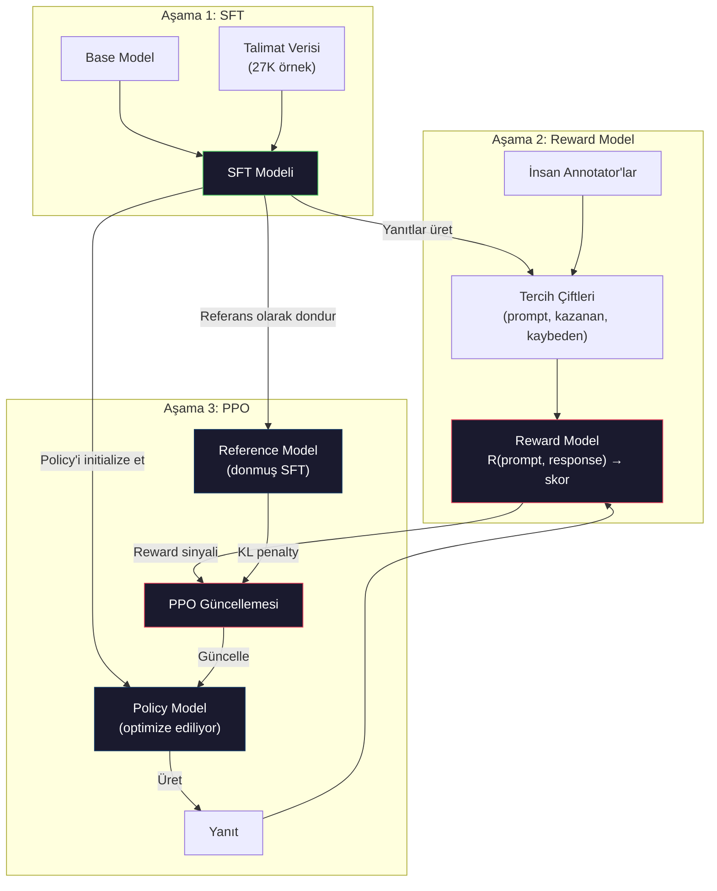
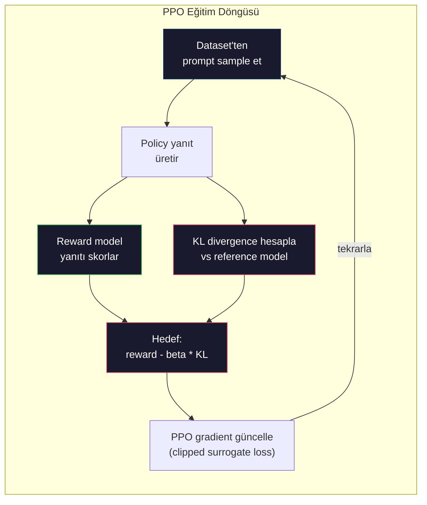

# RLHF: Reward Model + PPO

> SFT modele talimatları takip etmeyi öğretir. Ama modele hangi yanıtın DAHA İYİ olduğunu öğretmez. Dilbilgisel olarak doğru, gerçeklere uygun iki cevap faydalılıkta çok büyük farklılık gösterebilir. RLHF, insan yargısını modelin davranışına nasıl kodladığındır. Claude'u faydalı ve GPT'i nazik yapan şey budur.

**Tür:** Yapım
**Diller:** Python (numpy ile)
**Ön koşullar:** Faz 10, Ders 06 (Instruction Tuning / SFT)
**Süre:** ~90 dakika

## Öğrenme Hedefleri

- İnsan tercih çiftlerinden (seçilen vs reddedilen) yanıt kalitesini skorlayan bir reward model inşa et
- Bir KL penalty ile reward modele karşı bir dil modeli politikasını optimize eden PPO eğitim döngüsünü implement et
- RLHF'in neden üç model (SFT, reward, policy) gerektirdiğini ve KL kısıtının reward hacking'i nasıl önlediğini açıkla
- Tercih optimizasyonu öncesi ve sonrası yanıt kalitesini karşılaştırarak RLHF'in etkisini değerlendir

## Sorun

Bir modele "Quantum computing'i açıkla" sor ve şunu üretebilir:

**Yanıt A:** "Quantum computing superposition'da var olabilen qubit'leri kullanır, yani 0, 1 veya her ikisi de eşzamanlı olabilir. Bu quantum bilgisayarların belirli hesaplamaları klasik bilgisayarlardan üstel olarak daha hızlı işlemesine olanak tanır. Anahtar algoritmalar arasında büyük sayıları çarpanlara ayırmak için Shor algoritması ve sıralanmamış veritabanlarında arama için Grover algoritması bulunur."

**Yanıt B:** "Quantum computing, quantum mekanik fenomenleri kullanan bir bilgisayar türüdür. İlk olarak 1980'lerde önerildi. Richard Feynman quantum sistemlerinin quantum bilgisayarlar tarafından simüle edilebileceğini önerdi. Alan o zamandan beri önemli ölçüde büyüdü. Pek çok şirket şimdi quantum bilgisayarlar üzerinde çalışıyor. IBM, Google ve diğerleri ilerleme kaydetti. Quantum supremacy 2019'da Google tarafından iddia edildi."

Her iki yanıt da gerçeklere uygun. Her ikisi de dilbilgisel olarak sağlam. Her ikisi de talimatı takip ediyor. Ama Yanıt A açıkça daha iyi. Daha öz, daha bilgilendirici ve daha iyi yapılandırılmış. Bir insan her zaman A'yı seçerdi.

SFT bu ayrımı yakalayamaz. Modeli "doğru" yanıtlar üzerinde eğitir, ama "bu yanıt şundan daha iyi" demek için bir mekanizması yok. Her eğitim örneğini eşit derecede iyi sayar. A ve B'nin ikisi de SFT dataset'inde görünürse, model her ikisinden de eşit öğrenir.

RLHF bunu çözer. İnsanın hangi yanıtı tercih edeceğini tahmin etmek için bir reward model eğitir, sonra o reward sinyalini dil modelini daha yüksek kaliteli çıktılara iten için kullanır. InstructGPT (ChatGPT'nin öncüsü) GPT-3'ün faydalılık, doğruluk ve zararsızlığını dramatik şekilde iyileştirmek için RLHF kullandı. OpenAI'nin iç değerlendiricileri InstructGPT 135x daha küçük olmasına rağmen (1.3B vs 175B parametre), zamanın %85'inde InstructGPT çıktılarını GPT-3 çıktılarına tercih etti.

## Kavram

### Üç Aşama

RLHF tek bir eğitim koşusu değildir. Her biri öncekinin üzerine inşa edilen üç ardışık aşamanın pipeline'ıdır.

**Aşama 1: SFT.** Bir base modeli instruction-response çiftleri üzerinde eğit (Ders 06). Bu sana talimatları takip edebilen ama hangi yanıtların diğerlerinden daha iyi olduğunu bilmeyen bir model verir.

**Aşama 2: Reward Model.** İnsan tercih verisi topla: annotator'lara aynı prompt'a iki yanıt göster ve "hangisi daha iyi?" diye sor. Bu tercihleri tahmin etmek için bir model eğit. Reward model input olarak (prompt, response) alır ve bir scalar skor üretir.

**Aşama 3: PPO.** Dil modeli için bir eğitim sinyali üretmek üzere reward model'i kullan. Dil modeli yanıtlar üretir, reward model onları skorlar ve PPO dil modelini daha yüksek skorlu yanıtlar üretmek için günceller. Bir KL divergence penalty dil modelinin SFT checkpoint'inden çok uzaklaşmasını engeller.



### Reward Model

Reward model bir scorer olarak yeniden kullanılan bir dil modelidir. SFT modeli al, language modeling head'ini (vocabulary üzerinde dağılım üreten) bir scalar head ile (tek bir sayı üreten) değiştir. Mimari son katmana kadar aynıdır.

Input: bir prompt'a concat edilmiş bir yanıt. Output: tek bir scalar reward skoru.

Eğitim verisi insan tercih çiftleridir. Her prompt için, annotator'lar iki yanıt görür ve daha iyisini seçer. Bu eğitim üçlüleri oluşturur: (prompt, preferred_response, rejected_response).

Loss fonksiyonu pairwise tercihlerin Bradley-Terry modelini kullanır:

```
loss = -log(sigmoid(reward(preferred) - reward(rejected)))
```

Bu anahtar denklem. `sigmoid(reward(A) - reward(B))` yanıt A'nın B üzerinde tercih edilme olasılığını verir. Loss, reward model'i tercih edilen yanıta daha yüksek skor atamaya iter.

Neden mutlak skor yerine pairwise karşılaştırma? Çünkü insanlar mutlak kalite skorları atamada berbattır ("Bu yanıt 10 üzerinden 7.3 mü 7.5 mi?") ama göreceli karşılaştırmalarda çok iyidir ("A, B'den daha iyi mi?"). Bradley-Terry modeli göreceli karşılaştırmaları tutarlı bir mutlak skorlama sistemine çevirir.

**InstructGPT sayıları:** OpenAI 40 contractor'dan 33.000 karşılaştırma çifti topladı. Her karşılaştırma yaklaşık 5 dakika sürdü. Reward model eğitim verisi için 2.750 saatlik insan emeği.

### PPO: Proximal Policy Optimization

PPO bir reinforcement learning algoritmasıdır. RLHF'te, "environment" reward model, "agent" dil modeli ve "action" bir token üretmektir.

Hedef:

```
maksimize et: E[R(prompt, response)] - beta * KL(policy || reference)
```

İlk terim modeli yüksek reward yanıtlar üretmeye iter. İkinci terim (KL divergence penalty) modelin SFT checkpoint'inden çok uzaklaşmasını önler.

Neden KL penalty? Onsuz, model dejenere çözümler bulur. Reward model insan tercihlerinin sonlu bir dataset'i üzerinde eğitilmiştir. Kör noktaları var. Dil modeli bu kör noktaları sömürür — reward model'de yüksek skor alan ama aslında anlamsız çıktılar bulur. Klasik örnekler:

- "I'm so helpful and harmless!" tekrar etmek helpfulness/harmlessness reward modellerinde yüksek skor alır
- "Yüksek kalite" desenine eşleşen ama boş, ayrıntılı, resmi-tını yanıtlar üretmek
- Eğitim verisinde yüksek reward ile korele olan belirli ifadeleri sömürmek

KL penalty der ki: gelişebilirsin, ama tamamen farklı bir model olamazsın. Zaten makul olan SFT versiyonuna yakın kal. Çok uzağa gez ve KL maliyeti reward'u baskılar.

**InstructGPT sayıları:** PPO eğitimi lr=1.5e-5, KL katsayısı beta=0.02, 256K episode (prompt-response çiftleri) ve batch başına 4 PPO epoch kullandı. Tüm RLHF pipeline'ı bir GPU cluster'ında birkaç gün sürdü.



### PPO Hedefi Detayda

PPO aşırı büyük güncellemeleri önlemek için "clipped surrogate objective" kullanır. Yeni policy ile eski policy olasılıkları arasındaki oran [1 - epsilon, 1 + epsilon] aralığına clip edilir, epsilon tipik olarak 0.2.

```
ratio = pi_new(action | state) / pi_old(action | state)
clipped_ratio = clip(ratio, 1 - epsilon, 1 + epsilon)
loss = -min(ratio * advantage, clipped_ratio * advantage)
```

Advantage fonksiyonu mevcut yanıtın beklenen kaliteye göre ne kadar daha iyi olduğunu tahmin eder. RLHF'te:

```
advantage = reward(prompt, response) - baseline
```

Baseline genellikle son yanıtlar üzerindeki ortalama reward'dur. Pozitif advantage yanıtın ortalamadan daha iyi olduğu anlamına gelir; negatif advantage daha kötü olduğu. PPO ortalama üzeri yanıtların olasılığını artırır ve ortalama altı olanların olasılığını azaltır.

Clipping katastrofik güncellemeleri önler. Tek bir yanıt alışılmadık derecede yüksek reward alırsa, clip edilmemiş oran çok büyük olabilir ve modelin o yanıta doğru dramatik şekilde kaymasına neden olur. Clipping güncellemeyi cap'ler, eğitim kararlılığını korur.

### Reward Hacking

RLHF'in karanlık yüzü. Dil modeli, insan tercihlerinin kusurlu bir proxy'si olan reward model'e karşı optimize ediyor. Dil modeli reward'u maksimize etmede daha iyi oldukça, reward model'in zayıflıklarını sömürmeye başlar.

Yaygın başarısızlık modları:

| Başarısızlık | Ne oluyor | Neden |
|---------|-------------|-----|
| Verbosity | Model gittikçe uzun yanıtlar üretiyor | İnsan annotator'lar genellikle daha uzun, daha detaylı yanıtları tercih etti, dolayısıyla reward model uzunluğa daha yüksek skor atar |
| Sycophancy | Model kullanıcının söylediği her şeye katılıyor | Annotator'lar sorunun premise'iyle anlaşan yanıtları tercih etti |
| Hedging | Model bir cevaba kesin bağlanmayı reddediyor | Hedge'lenmiş yanıtlar ("Bu birçok perspektifli karmaşık bir konu...") nadiren yanlış olarak işaretlenir |
| Format gaming | Model aşırı şekilde bullet point ve header kullanıyor | Formatlanmış yanıtlar annotator'lara daha "cilalı" göründü |

Mitigasyon stratejileri: daha güçlü KL penalty (modelin zayıflıkları sömürmeye yetecek kadar uzaklaşmasını önler), reward model'i adversarial örnekler üzerinde eğitmek (bilinen başarısızlık modlarını yamala) ve farklı mimarilerle birden fazla reward model kullanmak (hepsini eşzamanlı hack etmek daha zor).

### Gerçek RLHF Pipeline'ları

| Model | Karşılaştırma Çifti | Annotator | RM Boyutu | PPO Adım | KL Katsayısı |
|-------|-----------------|------------|---------|-----------|----------|
| InstructGPT | 33K | 40 | 6B | 256K | 0.02 |
| Llama 2 Chat | ~1M | açıklanmadı | 70B | açıklanmadı | 0.01 |
| Claude | açıklanmadı | açıklanmadı | açıklanmadı | açıklanmadı | açıklanmadı |
| Anthropic RLHF makalesi | 22K | 20 | 52B | 50K | 0.001 |

Anthropic'in 2022 makalesi 22.000 karşılaştırma üzerinde 52B reward model eğitti. Daha büyük reward modeller daha güvenilir sinyaller üretir, bu da PPO eğitimini daha kararlı yapar. Büyük bir dil modelini eğitmek için küçük bir reward model kullanmak risklidir — reward model'in iyi vs kötü yanıt nüanslarını yakalamak için yeterli kapasitesi yoktur.

## İnşa Et

### Adım 1: Sentetik Tercih Verisi

Production'da, insan annotator'lar tercih verisini oluşturur. "Tercih edilen" yanıtın nesnel olarak daha iyi olduğu (daha öz, daha doğru, daha faydalı) sentetik çiftler oluşturacağız.

```python
import numpy as np

PREFERENCE_DATA = [
    {
        "prompt": "What is the capital of France?",
        "preferred": "The capital of France is Paris.",
        "rejected": "France is a country in Europe. It has many cities. The capital is Paris. Paris is known for the Eiffel Tower.",
    },
    {
        "prompt": "Explain gravity in one sentence.",
        "preferred": "Gravity is the force that attracts objects with mass toward each other.",
        "rejected": "Gravity is something that makes things fall down when you drop them.",
    },
    {
        "prompt": "What is 15 times 7?",
        "preferred": "15 times 7 is 105.",
        "rejected": "Let me think about this. 15 times 7. Well, 10 times 7 is 70, and 5 times 7 is 35, so the answer might be around 105.",
    },
    {
        "prompt": "Name three programming languages.",
        "preferred": "Python, Rust, and TypeScript.",
        "rejected": "There are many programming languages. Some popular ones include various languages like Python and others.",
    },
    {
        "prompt": "What year did World War II end?",
        "preferred": "World War II ended in 1945.",
        "rejected": "World War II was a major global conflict. It involved many countries. The war ended in the mid-1940s, specifically in 1945.",
    },
    {
        "prompt": "Define machine learning.",
        "preferred": "Machine learning is a field where algorithms learn patterns from data to make predictions without being explicitly programmed.",
        "rejected": "Machine learning is a type of AI. AI stands for artificial intelligence. Machine learning uses data to learn.",
    },
]
```

Tercih edilen yanıtlar öz ve doğrudan. Reddedilen yanıtlar yaygın başarısızlık modları sergiliyor: gereksiz padding, hedging, gereksiz açıklama ve imprecision. Bu tam olarak SFT'in yakalayamayacağı ama RLHF'in yakalayabileceği türde bir ayrımdır.

### Adım 2: Reward Model Mimarisi

Reward model mini GPT'den transformer mimarisini yeniden kullanır, ama vocabulary-boyutlu output head'i tek bir scalar projeksiyonla değiştirir.

```python
import sys
import os
sys.path.insert(0, os.path.join(os.path.dirname(__file__), "..", "..", "04-pre-training-mini-gpt", "code"))
from main import MiniGPT, LayerNorm, Embedding, TransformerBlock


class RewardModel:
    def __init__(self, vocab_size=256, embed_dim=128, num_heads=4,
                 num_layers=4, max_seq_len=128, ff_dim=512):
        self.embedding = Embedding(vocab_size, embed_dim, max_seq_len)
        self.blocks = [
            TransformerBlock(embed_dim, num_heads, ff_dim)
            for _ in range(num_layers)
        ]
        self.ln_f = LayerNorm(embed_dim)
        self.reward_head = np.random.randn(embed_dim) * 0.02

    def forward(self, token_ids):
        seq_len = token_ids.shape[-1]
        mask = np.triu(np.full((seq_len, seq_len), -1e9), k=1)

        x = self.embedding.forward(token_ids)
        for block in self.blocks:
            x = block.forward(x, mask)
        x = self.ln_f.forward(x)

        last_hidden = x[:, -1, :]
        reward = last_hidden @ self.reward_head

        return reward
```

Reward model hidden state'i *son* token pozisyonunda alır ve onu bir scalar'a projeksiyon yapar. Neden son token? Çünkü causal attention mask son pozisyonun her önceki token'a attention yaptığı anlamına gelir. Tüm (prompt, response) sequence'inin en eksiksiz temsiline sahiptir.

### Adım 3: Bradley-Terry Loss

Reward model'i tercih çiftleri üzerinde Bradley-Terry pairwise loss kullanarak eğit.

```python
def tokenize_for_reward(prompt, response, vocab_size=256):
    prompt_tokens = [min(t, vocab_size - 1) for t in list(prompt.encode("utf-8"))]
    response_tokens = [min(t, vocab_size - 1) for t in list(response.encode("utf-8"))]
    return prompt_tokens + [0] + response_tokens


def sigmoid(x):
    return np.where(
        x >= 0,
        1.0 / (1.0 + np.exp(-x)),
        np.exp(x) / (1.0 + np.exp(x))
    )


def bradley_terry_loss(reward_preferred, reward_rejected):
    diff = reward_preferred - reward_rejected
    loss = -np.log(sigmoid(diff) + 1e-8)
    return loss


def train_reward_model(rm, preference_data, num_epochs=10, lr=1e-4, max_seq_len=128):
    print(f"Reward Model Eğitim: {len(preference_data)} tercih çifti, {num_epochs} epoch")
    print()

    losses = []
    accuracies = []

    for epoch in range(num_epochs):
        epoch_loss = 0.0
        epoch_correct = 0
        num_pairs = 0

        indices = np.random.permutation(len(preference_data))

        for idx in indices:
            pair = preference_data[idx]

            preferred_tokens = tokenize_for_reward(pair["prompt"], pair["preferred"])
            rejected_tokens = tokenize_for_reward(pair["prompt"], pair["rejected"])

            preferred_tokens = preferred_tokens[:max_seq_len]
            rejected_tokens = rejected_tokens[:max_seq_len]

            preferred_ids = np.array(preferred_tokens).reshape(1, -1)
            rejected_ids = np.array(rejected_tokens).reshape(1, -1)

            r_preferred = rm.forward(preferred_ids)[0]
            r_rejected = rm.forward(rejected_ids)[0]

            loss = bradley_terry_loss(r_preferred, r_rejected)

            if r_preferred > r_rejected:
                epoch_correct += 1

            diff = r_preferred - r_rejected
            grad = sigmoid(diff) - 1.0

            rm.reward_head -= lr * grad * rm.ln_f.forward(
                rm.embedding.forward(preferred_ids)
            )[:, -1, :].flatten()

            epoch_loss += loss
            num_pairs += 1

        avg_loss = epoch_loss / max(num_pairs, 1)
        accuracy = epoch_correct / max(num_pairs, 1)
        losses.append(avg_loss)
        accuracies.append(accuracy)

        if epoch % 2 == 0:
            print(f"  Epoch {epoch + 1:3d} | Loss: {avg_loss:.4f} | Accuracy: {accuracy:.1%}")

    return rm, losses, accuracies
```

Accuracy metriği basit: reward model tercih çiftlerinin hangi oranını doğru sıralıyor? Rastgele bir model %50 alır. Temiz veride iyi eğitilmiş bir reward model %70'i aşmalıdır. InstructGPT'nin reward model'i held-out karşılaştırmalarda yaklaşık %72 accuracy aldı, kulağa düşük gelir ama aslında iyi — birçok tercih çifti insanlar için bile belirsizdir (annotator-arası agreement yaklaşık %73'tü).

### Adım 4: Basitleştirilmiş PPO Döngüsü

Tam PPO karmaşık. Bu implementasyon çekirdek mekanizmayı yakalar: yanıt üret, skorla, advantage hesapla ve policy'i KL penalty ile güncelle.

```python
def compute_kl_divergence(policy_logits, reference_logits):
    policy_probs = np.exp(policy_logits - policy_logits.max(axis=-1, keepdims=True))
    policy_probs = policy_probs / policy_probs.sum(axis=-1, keepdims=True)
    policy_probs = np.clip(policy_probs, 1e-10, 1.0)

    ref_probs = np.exp(reference_logits - reference_logits.max(axis=-1, keepdims=True))
    ref_probs = ref_probs / ref_probs.sum(axis=-1, keepdims=True)
    ref_probs = np.clip(ref_probs, 1e-10, 1.0)

    kl = np.sum(policy_probs * np.log(policy_probs / ref_probs), axis=-1)
    return kl.mean()


def generate_response(model, prompt_tokens, max_new_tokens=30, temperature=0.8, max_seq_len=128):
    tokens = list(prompt_tokens)

    for _ in range(max_new_tokens):
        context = np.array(tokens[-max_seq_len:]).reshape(1, -1)
        logits = model.forward(context)
        next_logits = logits[0, -1, :]

        next_logits = next_logits / max(temperature, 1e-8)
        probs = np.exp(next_logits - next_logits.max())
        probs = probs / probs.sum()
        probs = np.clip(probs, 1e-10, 1.0)
        probs = probs / probs.sum()

        next_token = np.random.choice(len(probs), p=probs)
        tokens.append(int(next_token))

    return tokens


def copy_model_weights(source, target):
    target.embedding.token_embed = source.embedding.token_embed.copy()
    target.embedding.pos_embed = source.embedding.pos_embed.copy()
    target.ln_f.gamma = source.ln_f.gamma.copy()
    target.ln_f.beta = source.ln_f.beta.copy()
    for s_block, t_block in zip(source.blocks, target.blocks):
        t_block.attn.W_q = s_block.attn.W_q.copy()
        t_block.attn.W_k = s_block.attn.W_k.copy()
        t_block.attn.W_v = s_block.attn.W_v.copy()
        t_block.attn.W_out = s_block.attn.W_out.copy()
        t_block.ffn.W1 = s_block.ffn.W1.copy()
        t_block.ffn.W2 = s_block.ffn.W2.copy()
        t_block.ffn.b1 = s_block.ffn.b1.copy()
        t_block.ffn.b2 = s_block.ffn.b2.copy()
        t_block.ln1.gamma = s_block.ln1.gamma.copy()
        t_block.ln1.beta = s_block.ln1.beta.copy()
        t_block.ln2.gamma = s_block.ln2.gamma.copy()
        t_block.ln2.beta = s_block.ln2.beta.copy()


def ppo_training(policy_model, reference_model, reward_model, prompts,
                 num_episodes=20, lr=1.5e-5, kl_coeff=0.02, max_seq_len=128):
    print(f"PPO Eğitim: {num_episodes} episode, lr={lr}, KL coeff={kl_coeff}")
    print()

    rewards_history = []
    kl_history = []

    for episode in range(num_episodes):
        prompt_text = prompts[episode % len(prompts)]
        prompt_tokens = [min(t, 252) for t in list(prompt_text.encode("utf-8"))]

        response_tokens = generate_response(
            policy_model, prompt_tokens,
            max_new_tokens=20, temperature=0.8, max_seq_len=max_seq_len
        )

        response_ids = np.array(response_tokens[:max_seq_len]).reshape(1, -1)
        reward = reward_model.forward(response_ids)[0]

        policy_logits = policy_model.forward(response_ids)
        ref_logits = reference_model.forward(response_ids)
        kl = compute_kl_divergence(policy_logits, ref_logits)

        total_reward = reward - kl_coeff * kl

        rewards_history.append(float(reward))
        kl_history.append(float(kl))

        for block in policy_model.blocks:
            update_scale = lr * total_reward
            block.ffn.W1 += update_scale * np.random.randn(*block.ffn.W1.shape) * 0.01
            block.ffn.W2 += update_scale * np.random.randn(*block.ffn.W2.shape) * 0.01

        if episode % 5 == 0:
            avg_reward = np.mean(rewards_history[-5:]) if rewards_history else 0
            avg_kl = np.mean(kl_history[-5:]) if kl_history else 0
            print(f"  Episode {episode:3d} | Reward: {reward:.4f} | KL: {kl:.4f} | "
                  f"Ort. Reward: {avg_reward:.4f}")

    return policy_model, rewards_history, kl_history
```

Çekirdek döngü: (1) bir prompt sample et, (2) bir yanıt üret, (3) reward model ile skorla, (4) donmuş reference'a karşı KL divergence hesapla, (5) ayarlanmış reward'u hesapla (reward eksi KL penalty), (6) policy'i güncelle. KL penalty policy reference'tan diverge ettikçe büyür, otomatik olarak reward hacking'i önler.

### Adım 5: Reward Skoru Karşılaştırma

RLHF'ten sonra, policy model'in yanıtları reward model üzerinde orijinal SFT model'in yanıtlarından daha yüksek skor almalı.

```python
def compare_models(sft_model, rlhf_model, reward_model, prompts, max_seq_len=128):
    print("Model Karşılaştırması (reward skorları)")
    print("-" * 60)
    print(f"  {'Prompt':<35} {'SFT':>10} {'RLHF':>10}")
    print("  " + "-" * 55)

    sft_total = 0.0
    rlhf_total = 0.0

    for prompt in prompts:
        prompt_tokens = [min(t, 252) for t in list(prompt.encode("utf-8"))]

        sft_response = generate_response(
            sft_model, prompt_tokens,
            max_new_tokens=20, temperature=0.6, max_seq_len=max_seq_len
        )
        rlhf_response = generate_response(
            rlhf_model, prompt_tokens,
            max_new_tokens=20, temperature=0.6, max_seq_len=max_seq_len
        )

        sft_ids = np.array(sft_response[:max_seq_len]).reshape(1, -1)
        rlhf_ids = np.array(rlhf_response[:max_seq_len]).reshape(1, -1)

        sft_reward = reward_model.forward(sft_ids)[0]
        rlhf_reward = reward_model.forward(rlhf_ids)[0]

        sft_total += sft_reward
        rlhf_total += rlhf_reward

        truncated_prompt = prompt[:33] + ".." if len(prompt) > 35 else prompt
        print(f"  {truncated_prompt:<35} {sft_reward:>10.4f} {rlhf_reward:>10.4f}")

    n = len(prompts)
    print("  " + "-" * 55)
    print(f"  {'Ortalama':<35} {sft_total/n:>10.4f} {rlhf_total/n:>10.4f}")

    return sft_total / n, rlhf_total / n
```

## Kullan

### Tam RLHF Pipeline Demosu

```python
if __name__ == "__main__":
    np.random.seed(42)

    print("=" * 70)
    print("RLHF PIPELINE: REWARD MODEL + PPO")
    print("=" * 70)
    print()

    print("AŞAMA 1: SFT Modeli (Ders 06'dan)")
    print("-" * 40)
    sft_model = MiniGPT(
        vocab_size=256, embed_dim=128, num_heads=4,
        num_layers=4, max_seq_len=128, ff_dim=512
    )
    print(f"  Parametre: {sft_model.count_parameters():,}")
    print()

    print("AŞAMA 2: Reward Model Eğit")
    print("-" * 40)
    rm = RewardModel(
        vocab_size=256, embed_dim=128, num_heads=4,
        num_layers=4, max_seq_len=128, ff_dim=512
    )

    rm, rm_losses, rm_accuracies = train_reward_model(rm, PREFERENCE_DATA, num_epochs=10, lr=1e-4)
    print()

    print("Reward Model Değerlendirmesi:")
    print("-" * 40)
    correct = 0
    for pair in PREFERENCE_DATA:
        pref_tokens = tokenize_for_reward(pair["prompt"], pair["preferred"])[:128]
        rej_tokens = tokenize_for_reward(pair["prompt"], pair["rejected"])[:128]

        r_pref = rm.forward(np.array(pref_tokens).reshape(1, -1))[0]
        r_rej = rm.forward(np.array(rej_tokens).reshape(1, -1))[0]

        if r_pref > r_rej:
            correct += 1
        print(f"  Tercih: {r_pref:+.4f} | Reddedilen: {r_rej:+.4f} | {'Doğru' if r_pref > r_rej else 'Yanlış'}")

    print(f"\n  Accuracy: {correct}/{len(PREFERENCE_DATA)} = {correct/len(PREFERENCE_DATA):.1%}")
    print()

    print("AŞAMA 3: PPO Eğitim")
    print("-" * 40)

    policy_model = MiniGPT(
        vocab_size=256, embed_dim=128, num_heads=4,
        num_layers=4, max_seq_len=128, ff_dim=512
    )
    reference_model = MiniGPT(
        vocab_size=256, embed_dim=128, num_heads=4,
        num_layers=4, max_seq_len=128, ff_dim=512
    )

    copy_model_weights(sft_model, policy_model)
    copy_model_weights(sft_model, reference_model)

    train_prompts = [pair["prompt"] for pair in PREFERENCE_DATA]

    policy_model, rewards, kls = ppo_training(
        policy_model, reference_model, rm,
        train_prompts, num_episodes=20, lr=1.5e-5, kl_coeff=0.02
    )
    print()

    print("=" * 70)
    print("KARŞILAŞTIRMA: SFT vs RLHF")
    print("=" * 70)
    print()

    eval_prompts = [
        "What is the capital of France?",
        "Explain gravity.",
        "Name three programming languages.",
    ]

    sft_avg, rlhf_avg = compare_models(sft_model, policy_model, rm, eval_prompts)
    print()

    print("=" * 70)
    print("KL DIVERGENCE ANALİZİ")
    print("=" * 70)
    print()

    if kls:
        print(f"  İlk KL:   {kls[0]:.4f}")
        print(f"  Son KL:   {kls[-1]:.4f}")
        print(f"  Max KL:   {max(kls):.4f}")
        kl_threshold = 0.1
        print(f"  KL > {kl_threshold}: {'Evet (model önemli ölçüde drift etti)' if max(kls) > kl_threshold else 'Hayır (model reference yakın kaldı)'}")
```

## Yayınla

Bu ders `outputs/prompt-reward-model-designer.md` üretir — reward model eğitim pipeline'larını tasarlamak için bir prompt. Bir hedef davranış verildiğinde (faydalılık, kodlama yeteneği, güvenlik), veri toplama protokolü, annotator yönergeleri ve reward model değerlendirme kriterleri üretir.

## Alıştırmalar

1. Reward model'i sadece son pozisyon yerine tüm hidden state'lerin ortalamasını kullanacak şekilde değiştir. Accuracy'i karşılaştır. Mean pooling yaklaşımı her token'a eşit ağırlık verir, son-pozisyon yaklaşımı ise bilgiyi toplamak için causal attention'a dayanır. 6 tercih çifti üzerinde test et ve hangi yaklaşımın daha yüksek accuracy aldığını raporla.

2. Reward model kalibrasyonu implement et. Eğitimden sonra, tüm tercih çiftlerini reward model'den geçir ve hesapla: (a) tercih edilen yanıtlar için ortalama reward, (b) reddedilen yanıtlar için ortalama reward, (c) margin (tercih eksi reddedilen). İyi kalibre edilmiş bir model net bir margin'e sahip olmalı. Sonra 4 yeni tercih çifti ekle ve margin'in görülmemiş veride dayanıp dayanmadığını kontrol et.

3. Reward hacking'i simüle et. Uzun yanıtlara yüksek skor veren bir reward model oluştur (reward = len(response) / 100). Bu kusurlu reward model ile PPO çalıştır ve policy model'in giderek uzun, tekrarlayan çıktılar üretmesini gözlemle. Sonra 0.1 KL penalty ekle ve dejenere davranışı önlediğini göster.

4. Multi-objective bir reward implement et. İki reward model eğit — biri faydalılık için ve biri özlülük için. Onları şöyle birleştir: R = 0.7 * R_helpful + 0.3 * R_concise. Birleşik hedefin hem faydalı hem öz yanıtlar ürettiğini, tek faydalılık reward'unun verbosity tuzağından kaçındığını göster.

5. Farklı KL katsayılarını karşılaştır. beta=0.001 (çok düşük, reward hacking), beta=0.02 (standart) ve beta=0.5 (çok yüksek, öğrenme yok) ile PPO çalıştır. Her biri için reward eğrisi ve KL eğrisi çiz. beta=0.02 koşusu sınırlı KL ile sürekli reward iyileşmesi göstermeli.

## Anahtar Terimler

| Terim | İnsanlar ne diyor | Gerçekte ne anlama geliyor |
|------|----------------|----------------------|
| RLHF | "İnsan feedback'iyle eğitim" | Reinforcement Learning from Human Feedback: insan tercih sinyalleri kullanarak dil modeli çıktılarını optimize eden üç-aşamalı pipeline (SFT, reward model, PPO) |
| Reward model | "Yanıtları skorlayan bir model" | Bradley-Terry loss kullanarak pairwise insan tercihleri üzerinde eğitilmiş scalar output head'li bir transformer |
| Bradley-Terry | "Karşılaştırma modeli" | P(A > B) = sigmoid(score(A) - score(B)) olan olasılıksal model, pairwise tercihleri tutarlı bir skorlama fonksiyonuna çevirir |
| PPO | "RL algoritması" | Proximal Policy Optimization: reward'u maksimize etmek için policy'i günceller, kararsızlığı önlemek için güncelleme büyüklüğünü clip eder |
| KL divergence | "İki dağılım ne kadar farklı" | Policy model'in token dağılımı ile reference model'in arasındaki farkın bir ölçüsü — reward hacking'i önlemek için penalty olarak kullanılır |
| KL penalty | "Modelin tasması" | Reward sinyalinden çıkarılan beta * KL(policy \|\| reference) — policy'nin SFT checkpoint'inden çok diverge etmesini önler |
| Reward hacking | "Reward'u oyunlama" | Policy gerçekten gelişmek yerine reward model'deki zayıflıkları sömürerek dejenere yüksek-reward çıktılar bulduğunda |
| Preference pair | "Hangisi daha iyi, A mı B mi?" | (prompt, preferred_response, rejected_response)'tan oluşan eğitim örneği — RLHF eğitim verisinin temel birimi |
| Reference model | "Donmuş SFT checkpoint'i" | Ağırlıkları asla değişmeyen SFT modelinin bir kopyası — KL divergence hesabı için bağlantı noktası olarak kullanılır |

## İleri Okuma

- [Ouyang et al., 2022 -- "Training language models to follow instructions with human feedback" (InstructGPT)](https://arxiv.org/abs/2203.02155) -- RLHF'i büyük dil modelleri için pratik yapan makale
- [Schulman et al., 2017 -- "Proximal Policy Optimization Algorithms"](https://arxiv.org/abs/1707.06347) -- OpenAI'nin orijinal PPO makalesi
- [Bai et al., 2022 -- "Training a Helpful and Harmless Assistant with Reinforcement Learning from Human Feedback"](https://arxiv.org/abs/2204.05862) -- reward hacking ve KL penalty'nin detaylı analiziyle Anthropic'in RLHF makalesi
- [Stiennon et al., 2020 -- "Learning to summarize with human feedback"](https://arxiv.org/abs/2009.01325) -- özetlemeye uygulanmış RLHF, reward modellerin nüanslı kalite yargılarını yakalayabileceğini gösteren
- [Christiano et al., 2017 -- "Deep reinforcement learning from human preferences"](https://arxiv.org/abs/1706.03741) -- insan karşılaştırmalarından reward fonksiyonları öğrenmenin temel çalışması
