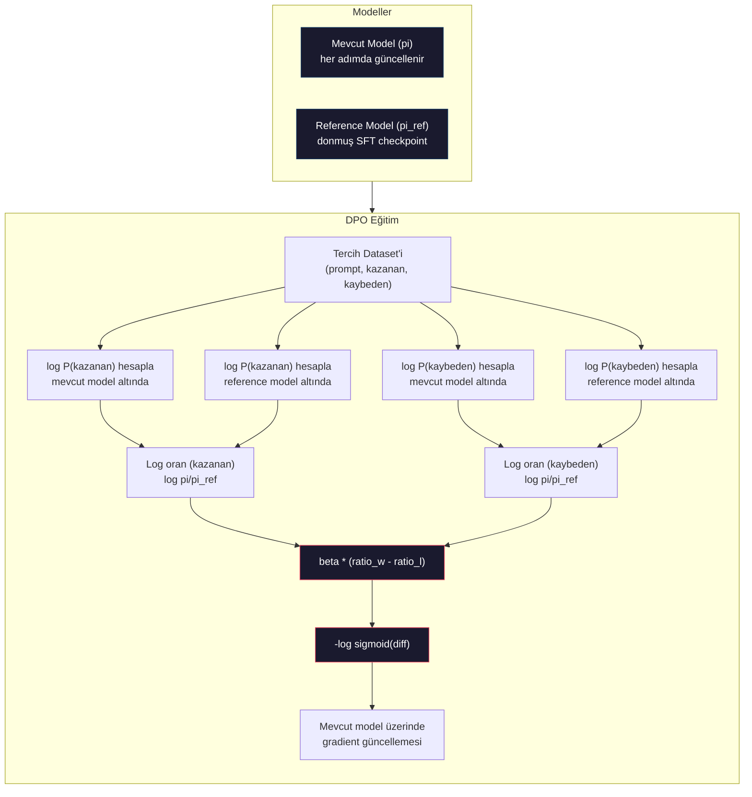

# DPO: Direct Preference Optimization

> RLHF çalışır. Üç model (SFT, reward model, policy) eğitmeyi, PPO'nun kararsızlığını yönetmeyi ve bir KL penalty ayarlamayı da gerektirir. DPO sorar: ya tüm bunları atlayabilseydin? DPO dil modelini doğrudan tercih çiftleri üzerinde optimize eder. Reward model yok. PPO yok. Tek eğitim döngüsü. Aynı sonuçlar.

**Tür:** Yapım
**Diller:** Python (numpy ile)
**Ön koşullar:** Faz 10, Ders 07 (RLHF)
**Süre:** ~90 dakika

## Öğrenme Hedefleri

- Ayrı bir reward model olmadan tercih çiftleri üzerinde dil modelini doğrudan optimize eden DPO eğitimi implement et
- DPO loss fonksiyonunu türet ve policy'nin log olasılıkları üzerinden örtük olarak bir reward modelini nasıl temsil ettiğini açıkla
- Eğitim kararlılığı, compute maliyeti ve gerekli model sayısı açısından DPO ile RLHF'i karşılaştır
- Eğitilen policy'nin reference model'den ne kadar diverge ettiğini kontrol etmek için beta parametresini ayarla

## Sorun

Ders 07'de bir RLHF pipeline'ı kurdun. Üç aşama. Üç model. SFT model, reward model ve PPO ile optimize edilmiş policy model. Sadece reward model binlerce insan tercih çifti ve ayrı bir eğitim döngüsü gerektirdi. PPO KL katsayısının, learning rate'in, clip oranının ve epoch sayısının dikkatli ayarlanmasını gerektirdi.

Pratikte, PPO eğitimi notoriously kararsızdır. Küçük hyperparametre değişiklikleri eğitimin diverge etmesine neden olur. Reward model insan tercihleri için kusurlu bir proxy'dir ve policy zayıflıklarını sömürmenin yollarını bulur. KL penalty yardımcı olur ama kendi ayarını gerektirir — çok düşük ve reward hacking yaşarsın, çok yüksek ve model zar zor öğrenir.

Bu karmaşıklık çoğu açık kaynak modelin InstructGPT yayınlandıktan sonra yıllarca RLHF ile uğraşmasının nedenidir. Üç-aşamalı pipeline kırılgandır. Her aşamanın kendi başarısızlık modları vardır ve hatalar birikir.

Mayıs 2023'te, Stanford'da Rafael Rafailov, Archit Sharma ve meslektaşları "Direct Preference Optimization: Your Language Model is Secretly a Reward Model" yayınladılar. Anahtar içgörü: ayrı bir reward model'e ihtiyacın yok. Optimal reward fonksiyonu, dil modelinin kendi token olasılıkları tarafından matematiksel olarak belirlenir. Reward model'i tamamen atlayıp dil modelini doğrudan tercih çiftleri üzerinde optimize edebilirsin.

DPO, RLHF'i tek bir supervised learning adımına indirir. Tek model. Tek loss fonksiyonu. Tek eğitim döngüsü. Reinforcement learning yok. Ölçekte DPO kullanan ilk modellerden biri olan Zephyr-7B, birkaç benchmark'ta tam RLHF ile eğitilmiş modelleri eşledi veya geçti. Meta, Llama 3'ün alignment pipeline'ının bir parçası olarak DPO'yu kullandı. Anthropic alignment araştırmalarında DPO-tarzı yöntemlere atıfta bulundu.

## Kavram

### Anahtar İçgörü

RLHF şu hedefi optimize eder:

```
maksimize et: E[R(x, y)] - beta * KL(pi || pi_ref)
```

R reward model, pi policy, pi_ref reference model ve beta KL katsayısı.

DPO makalesi bu hedefin kapalı-form bir optimal çözümü olduğunu gösterdi. Herhangi bir reward fonksiyonu R için, optimal policy:

```
pi*(y | x) = pi_ref(y | x) * exp(R(x, y) / beta) / Z(x)
```

Z(x) bir normalizing sabittir. Yeniden düzenleyerek:

```
R(x, y) = beta * log(pi*(y | x) / pi_ref(y | x)) + beta * log Z(x)
```

Bu atılım. Reward tamamen policy model'in olasılıkları ve reference model'in olasılıkları cinsinden ifade edilir. Ayrı bir reward model eğitmen gerekmez. Reward, olasılık oranında *örtüktür*.

Bunu Bradley-Terry tercih modeline yerleştirerek:

```
P(y_w > y_l | x) = sigmoid(R(x, y_w) - R(x, y_l))
                  = sigmoid(beta * (log pi(y_w|x)/pi_ref(y_w|x) - log pi(y_l|x)/pi_ref(y_l|x)))
```

Z(x) terimleri iptal olur çünkü her iki yanıt da aynı prompt x'e koşulludur. Kalan sadece policy model'in log-olasılıkları ile reference model'in tercih edilen ve reddedilen yanıtlardaki log-olasılıklarının bir fonksiyonudur.

### DPO Loss

```
L_DPO = -log(sigmoid(beta * (log pi(y_w|x)/pi_ref(y_w|x) - log pi(y_l|x)/pi_ref(y_l|x))))
```

Her parçayı paketten çıkaralım:

- **y_w** = tercih edilen (kazanan) yanıt
- **y_l** = reddedilen (kaybeden) yanıt
- **x** = prompt
- **pi** = mevcut model (eğitiliyor)
- **pi_ref** = reference model (donmuş SFT checkpoint)
- **beta** = reference'tan sapmayı kontrol eden temperature parametresi (tipik 0.1 ila 0.5)

`log pi(y|x) / pi_ref(y|x)` oranı log-olasılık oranıdır. Bu oran pozitif olduğunda, mevcut model y yanıtına reference'tan daha yüksek olasılık atar. Negatif olduğunda, mevcut model daha düşük olasılık atar.

DPO loss modelin tercih edilen yanıtlar için log-olasılık oranını artırmasına ve reddedilen yanıtlar için azaltmasına iter. Beta parametresi modelin reference'tan ne kadar agresif sapabileceğini kontrol eder — küçük beta büyük sapmalara izin verir, büyük beta modeli reference'a yakın tutar.



### DPO Neden Daha Basit

| Yön | RLHF (PPO) | DPO |
|--------|-----------|-----|
| Eğitilecek model | 3 (SFT + reward + policy) | 1 (sadece policy) |
| Eğitim döngüleri | 3 (SFT, RM eğitimi, PPO) | 2 (SFT, DPO) |
| Hyperparametreler | lr, KL coeff, clip ratio, RM lr, epochs x3 | lr, beta, epochs |
| Reward model | Gerekli (ayrı eğitim) | Model olasılıklarında örtük |
| RL algoritması | PPO (karmaşık, kararsız) | Supervised learning (kararlı) |
| GPU bellek | PPO sırasında bellekte 3-4 model | 2 model (mevcut + reference) |
| Eğitim kararlılığı | Hyperparametrelere hassas | Sağlam, SFT'e benzer |

DPO eğitim sırasında bellekte iki model gerektirir — mevcut model ve donmuş reference. RLHF üç veya dört gerektirir: policy, reference, reward model ve opsiyonel bir value function baseline. 70B model için, her kopya FP16'da 140GB alır. Reward model'i ortadan kaldırmaktan gelen bellek tasarrufu önemlidir.

### DPO Ne Zaman RLHF'i Yener

**Küçük dataset'ler.** 5.000-20.000 tercih çifti ile, DPO genellikle RLHF'i eşler veya aşar. RLHF'teki reward model genelleyebilmek için yeterli veriye ihtiyaç duyar — sınırlı veri ile, overfit eder ve güvenilmez reward sinyalleri üretir. DPO bu problemi reward model'e hiç ihtiyaç duymayarak atlatır.

**Sınırlı compute.** DPO tam RLHF'in kabaca üçte birini compute gerektirir (üç yerine bir eğitim döngüsü). Büyük GPU cluster'ı olmayan ekipler için pratik seçimdir.

**Hızlı iterasyon.** En iyi modeli hangi tercih dataset'inin ürettiğini görmek için 10 farklı dataset denemek istiyor musun? DPO her deneyi saatler içinde çalıştırmana izin verir. RLHF her dataset için reward model'i yeniden eğitmeyi gerektirir.

### RLHF Ne Zaman DPO'yu Yener

**Büyük ölçekli eğitim.** GPT-4 veya Claude ölçeğinde, RLHF'in ayrı reward model'i daha nüanslı tercih sinyallerini yakalayabilir. Reward model karmaşık kalite kriterlerine uyum sağlayan öğrenilmiş bir loss fonksiyonu olarak hareket eder.

**Karmaşık reward sinyalleri.** "Daha iyi" birden fazla boyut içerdiğinde (faydalılık, zararsızlık, dürüstlük), bir reward model bu multi-objective tradeoff'u öğrenebilir. DPO her tercih çiftini binary sinyal olarak ele alır — biri daha iyi, biri daha kötü — nedenini modellemeden.

**İteratif alignment.** RLHF pipeline'ları mevcut policy ile yeni yanıtlar üretebilir, insanların onları derecelendirmesini sağlayabilir ve reward model'i online döngüde yeniden eğitebilir. DPO sabit bir tercih çiftleri dataset'inde çalışır. Constitutional AI (Anthropic'in yaklaşımı) RLHF'in bu iteratif özelliğini kapsamlı kullanır.

### DPO'nun Ötesinde: KTO, ORPO, SimPO

DPO bir basitleştirilmiş alignment yöntemleri ailesine ilham verdi.

**KTO (Kahneman-Tversky Optimization, 2024):** Çiftlere bile ihtiyacın yok. KTO pair'lanmamış geri bildirimle çalışır — her yanıtı bir alternatifle karşılaştırmadan "iyi" veya "kötü" olarak etiketle. Bu, veri toplamayı dramatik şekilde basitleştirir. Annotator'lara iki yanıt gösterip "hangisi daha iyi?" sormak yerine, bir yanıt gösterip "bu iyi mi?" sorarsın. Loss fonksiyonu prospect theory'den loss aversion uygular: kötü yanıtlar iyi yanıtların ödüllendirildiğinden daha fazla cezalandırılır.

**ORPO (Odds Ratio Preference Optimization, 2024):** Tek bir eğitim adımında SFT ve alignment'ı birleştirir. Önce SFT sonra DPO yapmak yerine, ORPO SFT loss'unu bir tercih sinyali içerecek şekilde değiştirir. Loss'un iki terimi vardır: tercih edilen yanıtlar üzerinde standart next-token prediction loss, artı tercih edilen ve reddedilen yanıt olasılıkları arasındaki boşluğu artıran bir odds ratio terimi. İki yerine bir eğitim döngüsü.

**SimPO (Simple Preference Optimization, 2024):** Reference model'i tamamen ortadan kaldırır. Donmuş bir reference'a karşı log-olasılık oranlarını hesaplamak yerine, SimPO yanıtın ortalama log-olasılığını (uzunluk ile normalize edilmiş) örtük reward olarak kullanır. Bu bellek tasarruf eder (reference model gerekmez) ve eğitimi basitleştirir. Uzunluk normalizasyonu modelin daha kısa yanıtları tercih etmesini önler.

| Yöntem | Yıl | Bellekteki Model | Çift Gerekir? | Reference Gerekir? | Eğitim Döngüsü |
|--------|------|-----------------|-------------|-----------------|----------------|
| RLHF | 2022 | 3-4 | Evet (RM için) | Evet | 3 |
| DPO | 2023 | 2 | Evet | Evet | 2 |
| KTO | 2024 | 2 | Hayır (pair'sız) | Evet | 2 |
| ORPO | 2024 | 1 | Evet | Hayır | 1 |
| SimPO | 2024 | 1 | Evet | Hayır | 1 |

Trend açık: her yöntem bir karmaşıklık parçasını daha ortadan kaldırır. RLHF reward model ve PPO gerektiriyordu. DPO ikisini de ortadan kaldırdı. KTO eşli veriyi ortadan kaldırdı. ORPO ayrı SFT aşamasını ortadan kaldırdı. SimPO reference model'i ortadan kaldırdı. Alignment vergisi — bir base modelden hizalanmış bir modele gitmenin compute ve karmaşıklık maliyeti — düşmeye devam ediyor.

### Gerçek DPO Deployment'ları

**Zephyr-7B (HuggingFace, Ekim 2023):** Mistral 7B base, UltraChat üzerinde SFT (200K örnek), sonra UltraFeedback üzerinde DPO (60K tercih çifti). MT-Bench'te 6.47 puan aldı — o zamanın en yüksek 7B modeli. Karşılaştırma için, Llama 2 Chat 70B 6.86 aldı, yani Zephyr sadece DPO alignment kullanarak 10x boyutundaki bir modelin %6'sı içine girdi.

**Llama 3 (Meta, Nisan 2024):** İlk RLHF aşamalarından sonra DPO kullandı. Kombinasyon DPO ve RLHF'in tamamlayıcı olabileceğini gösteriyor — geniş alignment için RLHF, hedeflenmiş iyileştirme için DPO.

**Neural Magic / nm-chat (2024):** Birden fazla açık kaynak modele DPO uyguladı, SFT-only baseline'lara karşı alignment benchmark'larında tutarlı %5-15 iyileşme gösterdi.

## İnşa Et

### Adım 1: Tercih Dataset'i

RLHF ile aynı format — (prompt, preferred, rejected) üçlüleri. DPO bu veriyi ara bir reward model olmadan doğrudan tüketir.

```python
import numpy as np
import sys
import os
sys.path.insert(0, os.path.join(os.path.dirname(__file__), "..", "..", "04-pre-training-mini-gpt", "code"))
from main import MiniGPT, LayerNorm, Embedding, TransformerBlock

PREFERENCE_DATA = [
    {
        "prompt": "What is the capital of France?",
        "preferred": "The capital of France is Paris.",
        "rejected": "France is a country in Europe. It has many cities. The capital is Paris. Paris is known for the Eiffel Tower.",
    },
    {
        "prompt": "Explain gravity in one sentence.",
        "preferred": "Gravity is the force that attracts objects with mass toward each other.",
        "rejected": "Gravity is something that makes things fall down when you drop them.",
    },
    {
        "prompt": "What is 15 times 7?",
        "preferred": "15 times 7 is 105.",
        "rejected": "Let me think about this. 15 times 7. Well, 10 times 7 is 70, and 5 times 7 is 35, so the answer might be around 105.",
    },
    {
        "prompt": "Name three programming languages.",
        "preferred": "Python, Rust, and TypeScript.",
        "rejected": "There are many programming languages. Some popular ones include various languages like Python and others.",
    },
    {
        "prompt": "What year did World War II end?",
        "preferred": "World War II ended in 1945.",
        "rejected": "World War II was a major global conflict. It involved many countries. The war ended in the mid-1940s, specifically in 1945.",
    },
    {
        "prompt": "Define machine learning.",
        "preferred": "Machine learning is a field where algorithms learn patterns from data to make predictions without being explicitly programmed.",
        "rejected": "Machine learning is a type of AI. AI stands for artificial intelligence. Machine learning uses data to learn.",
    },
]
```

### Adım 2: Sequence Log-Olasılığı

DPO loss bir prompt verildiğinde bir yanıtın toplam log-olasılığını hesaplamayı gerektirir. Bu, tam (prompt + response) sequence'i üzerinde modeli çalıştırmak ve her yanıt token'ının log-olasılığını toplamak anlamına gelir.

```python
def tokenize_sequence(text, vocab_size=256):
    return [min(t, vocab_size - 1) for t in list(text.encode("utf-8"))]


def compute_sequence_log_prob(model, prompt_tokens, response_tokens, max_seq_len=128):
    full_sequence = prompt_tokens + response_tokens
    if len(full_sequence) > max_seq_len:
        full_sequence = full_sequence[:max_seq_len]

    if len(full_sequence) < 2:
        return 0.0

    input_ids = np.array(full_sequence[:-1]).reshape(1, -1)
    target_ids = np.array(full_sequence[1:])

    logits = model.forward(input_ids)
    logits = logits[0]

    max_logits = logits.max(axis=-1, keepdims=True)
    log_probs = logits - max_logits - np.log(
        np.exp(logits - max_logits).sum(axis=-1, keepdims=True)
    )

    prompt_len = len(prompt_tokens)
    response_start = max(0, prompt_len - 1)
    response_end = len(target_ids)

    if response_start >= response_end:
        return 0.0

    response_log_probs = log_probs[response_start:response_end, :]
    response_targets = target_ids[response_start:response_end]

    total_log_prob = 0.0
    for i, target in enumerate(response_targets):
        total_log_prob += response_log_probs[i, target]

    return total_log_prob
```

Bu fonksiyon DPO'nun beygiridir. Her tercih çifti için, dört kez çalışır: tercih edilen yanıt üzerinde model, reddedilen yanıt üzerinde model, tercih edilen yanıt üzerinde reference, reddedilen yanıt üzerinde reference. Bu eğitim örneği başına 4 forward pass, RLHF'in generation + reward scoring + value estimation + PPO update'sine karşı. Daha basit, daha hızlı, daha kararlı.

### Adım 3: DPO Loss

Makalenin çekirdeği kodda. Tek fonksiyon. Tek loss. Reward model yok.

```python
def sigmoid(x):
    return np.where(
        x >= 0,
        1.0 / (1.0 + np.exp(-x)),
        np.exp(x) / (1.0 + np.exp(x))
    )


def dpo_loss(policy_logprob_preferred, policy_logprob_rejected,
             ref_logprob_preferred, ref_logprob_rejected, beta=0.1):
    preferred_ratio = policy_logprob_preferred - ref_logprob_preferred
    rejected_ratio = policy_logprob_rejected - ref_logprob_rejected

    logit = beta * (preferred_ratio - rejected_ratio)

    loss = -np.log(sigmoid(logit) + 1e-8)

    preferred_reward = beta * preferred_ratio
    rejected_reward = beta * rejected_ratio

    return loss, {
        "preferred_ratio": float(preferred_ratio),
        "rejected_ratio": float(rejected_ratio),
        "logit": float(logit),
        "implicit_preferred_reward": float(preferred_reward),
        "implicit_rejected_reward": float(rejected_reward),
        "reward_margin": float(preferred_reward - rejected_reward),
    }
```

`preferred_ratio` ve `rejected_ratio` DPO türetmesinden log-olasılık oranlarıdır. Mevcut model tercih edilen yanıta (reference'a göre) daha yüksek olasılık ve reddedilen yanıta daha düşük olasılık atadığında, logit pozitif ve loss düşüktür. Eğitim sinyali modeli tam olarak bu yöne iter.

`implicit_preferred_reward` ve `implicit_rejected_reward` DPO loss'unun örtük olarak atadığı reward'lardır. Eğitimin çalıştığını doğrulamak için onları çıkartabilirsin — tercih edilen ve reddedilen reward'lar arasındaki margin eğitim boyunca artmalı.

### Adım 4: DPO Eğitim Döngüsü

Standart bir supervised eğitim döngüsü. PPO yok. Reward model yok. Sadece forward pass'ler ve gradient güncellemeleri.

```python
def copy_model_weights(source, target):
    target.embedding.token_embed = source.embedding.token_embed.copy()
    target.embedding.pos_embed = source.embedding.pos_embed.copy()
    target.ln_f.gamma = source.ln_f.gamma.copy()
    target.ln_f.beta = source.ln_f.beta.copy()
    for s_block, t_block in zip(source.blocks, target.blocks):
        t_block.attn.W_q = s_block.attn.W_q.copy()
        t_block.attn.W_k = s_block.attn.W_k.copy()
        t_block.attn.W_v = s_block.attn.W_v.copy()
        t_block.attn.W_out = s_block.attn.W_out.copy()
        t_block.ffn.W1 = s_block.ffn.W1.copy()
        t_block.ffn.W2 = s_block.ffn.W2.copy()
        t_block.ffn.b1 = s_block.ffn.b1.copy()
        t_block.ffn.b2 = s_block.ffn.b2.copy()
        t_block.ln1.gamma = s_block.ln1.gamma.copy()
        t_block.ln1.beta = s_block.ln1.beta.copy()
        t_block.ln2.gamma = s_block.ln2.gamma.copy()
        t_block.ln2.beta = s_block.ln2.beta.copy()


def dpo_train(policy_model, reference_model, preference_data,
              num_epochs=5, lr=5e-6, beta=0.1, max_seq_len=128):
    print(f"DPO Eğitim: {len(preference_data)} çift, {num_epochs} epoch, "
          f"lr={lr}, beta={beta}")
    print()

    losses = []
    margins = []

    for epoch in range(num_epochs):
        epoch_loss = 0.0
        epoch_margin = 0.0
        num_examples = 0

        indices = np.random.permutation(len(preference_data))

        for idx in indices:
            pair = preference_data[idx]

            prompt_tokens = tokenize_sequence(pair["prompt"])
            preferred_tokens = tokenize_sequence(pair["preferred"])
            rejected_tokens = tokenize_sequence(pair["rejected"])

            pi_logprob_w = compute_sequence_log_prob(
                policy_model, prompt_tokens, preferred_tokens, max_seq_len
            )
            pi_logprob_l = compute_sequence_log_prob(
                policy_model, prompt_tokens, rejected_tokens, max_seq_len
            )
            ref_logprob_w = compute_sequence_log_prob(
                reference_model, prompt_tokens, preferred_tokens, max_seq_len
            )
            ref_logprob_l = compute_sequence_log_prob(
                reference_model, prompt_tokens, rejected_tokens, max_seq_len
            )

            loss, metrics = dpo_loss(
                pi_logprob_w, pi_logprob_l,
                ref_logprob_w, ref_logprob_l, beta
            )

            update_direction = 1.0 if metrics["logit"] < 0 else -0.1
            for block in policy_model.blocks:
                block.ffn.W1 += lr * update_direction * np.random.randn(*block.ffn.W1.shape) * 0.01
                block.ffn.W2 += lr * update_direction * np.random.randn(*block.ffn.W2.shape) * 0.01

            epoch_loss += loss
            epoch_margin += metrics["reward_margin"]
            num_examples += 1
            losses.append(float(loss))
            margins.append(metrics["reward_margin"])

        avg_loss = epoch_loss / max(num_examples, 1)
        avg_margin = epoch_margin / max(num_examples, 1)

        print(f"  Epoch {epoch + 1}/{num_epochs} | Loss: {avg_loss:.4f} | "
              f"Ort. Margin: {avg_margin:.4f}")

    return policy_model, losses, margins
```

Eğitim döngüsü RLHF'e kıyasla ferahlatıcı şekilde basit. Her tercih çifti için: dört log-olasılık hesapla (iki model, iki yanıt), bunları DPO loss'a yerleştir, gradient hesapla, policy'i güncelle. Generation adımı yok. Reward model inference yok. Advantage estimation yok. Clipping yok.

### Adım 5: DPO vs RLHF Karşılaştır

Ders 07'deki RLHF model'e karşı DPO'yu karşılaştırmak için örtük reward margin'lerini ve log-olasılık kaymalarını ölç.

```python
def evaluate_preference_accuracy(model, reference_model, preference_data, beta=0.1, max_seq_len=128):
    correct = 0
    total = 0

    for pair in preference_data:
        prompt_tokens = tokenize_sequence(pair["prompt"])
        preferred_tokens = tokenize_sequence(pair["preferred"])
        rejected_tokens = tokenize_sequence(pair["rejected"])

        pi_w = compute_sequence_log_prob(model, prompt_tokens, preferred_tokens, max_seq_len)
        pi_l = compute_sequence_log_prob(model, prompt_tokens, rejected_tokens, max_seq_len)
        ref_w = compute_sequence_log_prob(reference_model, prompt_tokens, preferred_tokens, max_seq_len)
        ref_l = compute_sequence_log_prob(reference_model, prompt_tokens, rejected_tokens, max_seq_len)

        preferred_reward = beta * (pi_w - ref_w)
        rejected_reward = beta * (pi_l - ref_l)

        if preferred_reward > rejected_reward:
            correct += 1
        total += 1

    return correct / max(total, 1)


def analyze_implicit_rewards(model, reference_model, preference_data, beta=0.1, max_seq_len=128):
    print("Örtük Reward Analizi:")
    print("-" * 65)
    print(f"  {'Prompt':<30} {'Tercih Reward':>14} {'Red Reward':>12} {'Margin':>10}")
    print("  " + "-" * 60)

    for pair in preference_data:
        prompt_tokens = tokenize_sequence(pair["prompt"])
        preferred_tokens = tokenize_sequence(pair["preferred"])
        rejected_tokens = tokenize_sequence(pair["rejected"])

        pi_w = compute_sequence_log_prob(model, prompt_tokens, preferred_tokens, max_seq_len)
        pi_l = compute_sequence_log_prob(model, prompt_tokens, rejected_tokens, max_seq_len)
        ref_w = compute_sequence_log_prob(reference_model, prompt_tokens, preferred_tokens, max_seq_len)
        ref_l = compute_sequence_log_prob(reference_model, prompt_tokens, rejected_tokens, max_seq_len)

        pref_reward = beta * (pi_w - ref_w)
        rej_reward = beta * (pi_l - ref_l)
        margin = pref_reward - rej_reward

        truncated = pair["prompt"][:28] + ".." if len(pair["prompt"]) > 30 else pair["prompt"]
        print(f"  {truncated:<30} {pref_reward:>14.4f} {rej_reward:>12.4f} {margin:>10.4f}")

    print()
```

### Adım 6: Beta Hassasiyeti Analizi

Beta parametresi DPO'nun RLHF'teki KL katsayısının eşdeğeridir. Modelin reference'tan ne kadar sapabileceğini kontrol eder. Bu deney etkisini gösterir.

```python
def beta_sensitivity_analysis(sft_model, preference_data, betas, max_seq_len=128):
    print("Beta Hassasiyeti Analizi")
    print("-" * 60)
    print(f"  {'Beta':>8} {'Son Loss':>12} {'Son Margin':>14} {'Accuracy':>10}")
    print("  " + "-" * 55)

    results = []

    for beta in betas:
        policy = MiniGPT(
            vocab_size=256, embed_dim=128, num_heads=4,
            num_layers=4, max_seq_len=max_seq_len, ff_dim=512
        )
        reference = MiniGPT(
            vocab_size=256, embed_dim=128, num_heads=4,
            num_layers=4, max_seq_len=max_seq_len, ff_dim=512
        )
        copy_model_weights(sft_model, policy)
        copy_model_weights(sft_model, reference)

        policy, losses, margins_list = dpo_train(
            policy, reference, preference_data,
            num_epochs=3, lr=5e-6, beta=beta, max_seq_len=max_seq_len
        )

        accuracy = evaluate_preference_accuracy(
            policy, reference, preference_data, beta, max_seq_len
        )

        final_loss = losses[-1] if losses else 0
        final_margin = margins_list[-1] if margins_list else 0

        print(f"  {beta:>8.3f} {final_loss:>12.4f} {final_margin:>14.4f} {accuracy:>10.1%}")
        results.append({
            "beta": beta,
            "final_loss": final_loss,
            "final_margin": final_margin,
            "accuracy": accuracy,
        })

        print()

    return results
```

Küçük beta (0.01) modelin reference'tan serbestçe sapmasına izin verir — hızlı öğrenme ama dejenere çözüm riski. Büyük beta (1.0) modeli reference'a yakın tutar — kararlı ama yavaş öğrenme. Çoğu uygulama için tatlı nokta 0.1 ila 0.3.

## Kullan

### Tam DPO Pipeline Demosu

```python
if __name__ == "__main__":
    np.random.seed(42)

    print("=" * 70)
    print("DPO: DIRECT PREFERENCE OPTIMIZATION")
    print("=" * 70)
    print()

    print("ADIM 1: SFT Modeli Initialize Et (Ders 06'dan)")
    print("-" * 50)
    sft_model = MiniGPT(
        vocab_size=256, embed_dim=128, num_heads=4,
        num_layers=4, max_seq_len=128, ff_dim=512
    )
    print(f"  Parametre: {sft_model.count_parameters():,}")
    print()

    print("ADIM 2: DPO Eğitim")
    print("-" * 50)

    policy_model = MiniGPT(
        vocab_size=256, embed_dim=128, num_heads=4,
        num_layers=4, max_seq_len=128, ff_dim=512
    )
    reference_model = MiniGPT(
        vocab_size=256, embed_dim=128, num_heads=4,
        num_layers=4, max_seq_len=128, ff_dim=512
    )
    copy_model_weights(sft_model, policy_model)
    copy_model_weights(sft_model, reference_model)

    policy_model, losses, margins = dpo_train(
        policy_model, reference_model, PREFERENCE_DATA,
        num_epochs=5, lr=5e-6, beta=0.1
    )
    print()

    print("=" * 70)
    print("ADIM 3: Değerlendir")
    print("=" * 70)
    print()

    pre_accuracy = evaluate_preference_accuracy(
        sft_model, reference_model, PREFERENCE_DATA, beta=0.1
    )
    post_accuracy = evaluate_preference_accuracy(
        policy_model, reference_model, PREFERENCE_DATA, beta=0.1
    )

    print(f"  Tercih accuracy (DPO öncesi):  {pre_accuracy:.1%}")
    print(f"  Tercih accuracy (DPO sonrası): {post_accuracy:.1%}")
    print()

    analyze_implicit_rewards(policy_model, reference_model, PREFERENCE_DATA, beta=0.1)

    print("=" * 70)
    print("ADIM 4: Eğitim Dinamikleri")
    print("=" * 70)
    print()

    if losses:
        print("  Loss eğrisi:")
        window = max(1, len(losses) // 5)
        for i in range(0, len(losses), window):
            chunk = losses[i:i + window]
            avg = sum(chunk) / len(chunk)
            print(f"    Adım {i:3d}-{i + len(chunk) - 1:3d}: loss = {avg:.4f}")
        print()

    if margins:
        print("  Reward margin eğrisi:")
        window = max(1, len(margins) // 5)
        for i in range(0, len(margins), window):
            chunk = margins[i:i + window]
            avg = sum(chunk) / len(chunk)
            print(f"    Adım {i:3d}-{i + len(chunk) - 1:3d}: margin = {avg:.4f}")
        print()

    print("=" * 70)
    print("ADIM 5: Beta Hassasiyeti")
    print("=" * 70)
    print()

    beta_results = beta_sensitivity_analysis(
        sft_model, PREFERENCE_DATA, betas=[0.01, 0.1, 0.3, 1.0]
    )

    print("=" * 70)
    print("DPO vs RLHF KARŞILAŞTIRMASI")
    print("=" * 70)
    print()
    print("  DPO avantajları:")
    print("    - 1 eğitim döngüsü (RLHF için 3)")
    print("    - Bellekte 2 model (RLHF için 3-4)")
    print("    - Supervised learning (RL'ye karşı, daha kararlı)")
    print("    - Eğitilecek veya bakılacak reward model yok")
    print()
    print("  RLHF avantajları:")
    print("    - Ayrı reward model karmaşık tercihleri yakalar")
    print("    - Online öğrenme: üret, derecelendir, yeniden eğit")
    print("    - Multi-objective alignment için daha iyi")
    print("    - En büyük ölçeklerde kanıtlanmış (GPT-4, Claude)")
    print()
    print("  Pratik rehberlik:")
    print("    - DPO ile başla. Daha basit ve genellikle yeterli.")
    print("    - Eval metriklerin platoya ulaşırsa RLHF'e geç.")
    print("    - Birçok production sistem ikisini de kullanır: önce RLHF, sonra rafine etmek için DPO.")
```

## Yayınla

Bu ders `outputs/prompt-alignment-method-selector.md` üretir — kullanım durumun için doğru alignment yöntemini (SFT, RLHF, DPO, KTO, ORPO, SimPO) seçmene yardım eden bir prompt. Veri mevcudiyetin, compute bütçen ve alignment hedeflerin verildiğinde, bir yöntem ve eğitim planı önerir.

## Alıştırmalar

1. KTO (Kahneman-Tversky Optimization) implement et. KTO çiftlere ihtiyaç duymaz — her yanıtı "iyi" veya "kötü" olarak etiketle. İyi yanıt için loss `-log(sigmoid(beta * log_ratio))` ve kötü yanıt için `-log(1 - sigmoid(beta * log_ratio))` artı kötü yanıt loss'unda loss aversion çarpanı (tipik 1.5x). Aynı veride eğit (tercih edileni "iyi" ve reddedileni "kötü" olarak bağımsız ele al) ve accuracy'i DPO ile karşılaştır.

2. Length-normalize DPO implement et. Ham log-olasılıklar yerine, yanıt token sayısına böl: `normalized_logprob = total_logprob / num_tokens`. Bu modelin daha kısa yanıtları (daha yüksek toplam log-olasılığı olan) tercih etmesini önler. Normalizasyon ile ve olmadan örtük reward margin'lerini karşılaştır.

3. ORPO-tarzı birleşik bir loss inşa et. DPO loss'a tercih edilen yanıt üzerinde standart bir next-token prediction loss ekle: `L = L_sft(preferred) + alpha * L_dpo`. Alpha değerlerini 0.1, 0.5 ve 1.0 dene. Birleşik loss hem talimatları takip eden (SFT teriminden) hem de daha iyi yanıtları tercih eden (DPO teriminden) bir model üretmeli, ayrı SFT aşaması ihtiyacını ortadan kaldırarak.

4. İteratif DPO implement et. 3 epoch DPO çalıştır, sonra eğitilmiş modelden yeni yanıtlar üret, onları orijinal tercih edilen yanıtlarla yeni tercih çiftleri olarak eşle ve tekrar DPO çalıştır. Bu "self-play" sürecinin iki turu. İteratif iyileştirmenin yardımcı olup olmadığını görmek için tur 1 ve tur 2 sonrasındaki tercih accuracy'sini karşılaştır.

5. Farklı reference modellerle DPO karşılaştır. SFT checkpoint'i reference olarak kullanmak yerine, şunları dene: (a) base model (SFT öncesi), (b) DPO'nun 1. epoch'undan bir checkpoint, (c) policy model'in exponential moving average'i. Hangi reference'ın en yüksek tercih accuracy'sini ve en kararlı eğitim eğrisini ürettiğini raporla.

## Anahtar Terimler

| Terim | İnsanlar ne diyor | Gerçekte ne anlama geliyor |
|------|----------------|----------------------|
| DPO | "RL olmadan RLHF" | Direct Preference Optimization: dil modelini tercih çiftleri üzerinde doğrudan optimize eden, reward model ve PPO'yu atlayan supervised learning algoritması |
| Implicit reward | "Reward modelde" | Reward fonksiyonu policy ve reference modeller arasındaki log-olasılık oranı ile belirlenir — ayrı reward model gerekmez |
| Beta (DPO) | "Temperature" | Policy'nin reference modelden ne kadar sapabileceğini kontrol eder — küçük beta büyük sapmalara izin verir, büyük beta modeli yakın tutar |
| Log-probability ratio | "Modelin ne kadar değiştiği" | log pi(y\|x) - log pi_ref(y\|x) — pozitif olması mevcut modelin reference'tan daha yüksek olasılık atadığı anlamına gelir |
| Reference model | "Donmuş checkpoint" | Ağırlıkları asla değişmeyen SFT modelinin bir kopyası — olasılık oranlarını hesaplamak için bağlantı noktası |
| KTO | "Çiftsiz DPO" | Kahneman-Tversky Optimization: tercih çifti gerektirmek yerine pair'lanmamış "iyi" veya "kötü" etiketleriyle çalışır |
| ORPO | "Tek-adım alignment" | Odds Ratio Preference Optimization: SFT loss'a bir tercih terimi ekleyerek SFT ve alignment'ı tek bir eğitim döngüsünde birleştirir |
| SimPO | "Reference gerekmez" | Simple Preference Optimization: length-normalized ortalama log-olasılığı örtük reward olarak kullanarak reference modeli ortadan kaldırır |
| Alignment tax | "Modelleri güvenli yapmanın maliyeti" | Bir base modelden hizalanmış bir modele gitmek için gereken ek compute, veri ve karmaşıklık — DPO bunu önemli ölçüde azaltır |

## İleri Okuma

- [Rafailov et al., 2023 -- "Direct Preference Optimization: Your Language Model is Secretly a Reward Model"](https://arxiv.org/abs/2305.18290) -- alignment'ı RLHF'ten supervised learning'e basitleştiren DPO makalesi
- [Tunstall et al., 2023 -- "Zephyr: Direct Distillation of LM Alignment"](https://arxiv.org/abs/2310.16944) -- UltraFeedback üzerinde DPO'nun benchmark'larda RLHF'i eşlediğini gösteren Zephyr-7B
- [Ethayarajh et al., 2024 -- "KTO: Model Alignment as Prospect Theoretic Optimization"](https://arxiv.org/abs/2402.01306) -- eşli tercih ihtiyacını ortadan kaldırma
- [Hong et al., 2024 -- "ORPO: Monolithic Preference Optimization without Reference Model"](https://arxiv.org/abs/2403.07691) -- SFT ve alignment'ı tek bir adımda birleştirme
- [Meng et al., 2024 -- "SimPO: Simple Preference Optimization with a Reference-Free Reward"](https://arxiv.org/abs/2405.14734) -- reference modeli tamamen ortadan kaldırma
- [Llama 3 Technical Report](https://arxiv.org/abs/2407.21783) -- RLHF ve DPO'yu birleştiren Meta'nın alignment pipeline'ı
