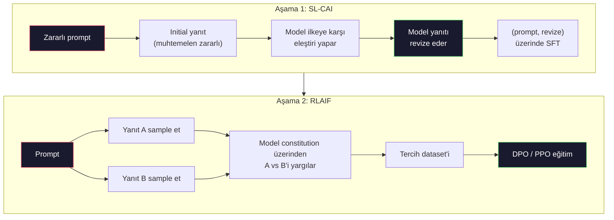
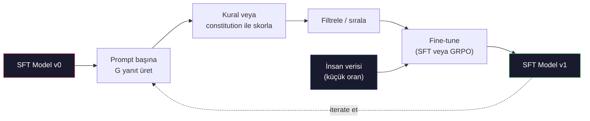

# Constitutional AI ve Self-Improvement

> RLHF döngüde insanlara ihtiyaç duyar. Constitutional AI çoğunu modelin kendisiyle değiştirir. Bir ilkeler listesi yaz, modelin kendi çıktılarını o ilkelere karşı eleştirmesini sağla ve eleştiriler üzerinde eğit. DeepSeek-R1 2025'te bunu daha da ileri itti: modelin milyonlarca reasoning trace üretmesine izin ver, bir kuralla derecelendir ve sonuç üzerinde GRPO çalıştır. 2026 frontier modelindeki "alignment çalışmasının" çoğu model alignment'ın kendisidir. Bu ders her iki döngüyü de inşa eder.

**Tür:** Yapım
**Diller:** Python (stdlib + numpy)
**Ön koşullar:** Faz 10, Ders 06-08 (SFT, RLHF, DPO)
**Süre:** ~45 dakika

## Öğrenme Hedefleri

- Constitutional AI iki-aşamalı döngüyü implement et: self-critique artı self-revision, sonra revize edilmiş çiftler üzerinde tercih eğitimi
- GRPO hedefini (DeepSeek-R1'in group-relative policy optimization'ı) türet ve PPO'nun value-function baseline'ı ile karşılaştır
- Kural-tabanlı outcome reward'larla doğrulanabilir reasoning trace'leri üret ve ayrı bir reward model olmadan skorla
- Self-improvement'ın insan tercih verisini ne zaman yendiğine ve ne zaman mode seeking'e çöktüğüne karar ver

## Sorun

Ders 07'de RLHF ve Ders 08'de DPO inşa ettin. Her ikisi de aynı pahalı input'a bağlı: insan tercih çiftleri. Anthropic'in InstructGPT-dönemi pipeline'ı kabaca 33.000 karşılaştırma kullandı. Llama 2 Chat 1.5 milyondan fazla kullandı. Claude 3 daha fazla kullandı. Bu veri yavaş, pahalı ve annotator'ların derecelendirdikleri günde inandıkları her şeye karşı yanlı.

2022 Constitutional AI makalesi basit bir soru sordu. Ya tercih etiketlerini model kendisi üretirse? Ona yazılı bir ilkeler listesi — "anayasa" — ver ve kendi yanıtlarını eleştirmesini sağla. Eleştiriler eğitim sinyali olur.

2024'te DeepSeek fikri daha da ileri götürdü. Doğrulanabilir sonuçlu herhangi bir görev için (bilinen cevaplı matematik, ya testleri geçen ya da başarısız olan kod, ya kazanan ya da kaybeden bir oyun) eleştirmeni tamamen atlayabileceğini gösterdiler. Birçok aday çözüm üret. Her birini deterministik bir kuralla derecelendir. Reward'lar üzerinde bir policy-gradient algoritması çalıştır. DeepSeek-R1 bu şekilde neredeyse hiç insan tercih verisi olmadan eğitildi ve o1-sınıfı reasoning performansını eşledi.

Bu iki döngü — subjektif davranış için Constitutional AI ve doğrulanabilir davranış için kural-tabanlı RL — 2026'nın baskın alignment reçeteleridir. Eskiden RLHF'e giden insan tercih bütçesi artık çok daha küçük bir adıma harcanıyor: anayasayı seçmek ve reward kurallarını seçmek.

## Kavram

### Constitutional AI Döngüsü

Bai et al. (2022) pipeline'ı iki aşamada yapılandırdı.

**Aşama 1: Supervised Learning from AI Feedback (SL-CAI).** Faydalı ama muhtemelen zararlı bir SFT model ile başla. Ona potansiyel olarak zararlı isteklerle prompt ver. Her yanıt için, *aynı modelden* yanıtını bir constitutional ilkeye karşı eleştirmesini, sonra revize etmesini iste. Revize edilmiş yanıtlar üzerinde fine-tune et. Dataset (prompt, revised_response) çiftleri.

**Aşama 2: Reinforcement Learning from AI Feedback (RLAIF).** Yanıt çiftleri sample et. Modelden hangisinin constitution'ı daha iyi takip ettiğini sormak iste. Pairwise tercihler bir reward model eğitir. Sonra o reward'u kullanarak model üzerinde PPO veya DPO çalıştır. RLHF'ten anahtar fark: tercihler modelden geldi, insanlardan değil.



Anayasa kaldıraçtır. Anthropic'in orijinalinde 16 ilke vardı (sonra genişletildi). Bir ilke "Çok çeşitli kültürel arka planlardan herkesin itiraz etme olasılığı en düşük yanıtı lütfen seç" gibi okunur. Her adım için ilkeyi seçersin, bazen rastgele, bazen prompt kategorisine dayalı.

### Anayasa Aslında Ne Yapar

Anayasa alignment sözleşmesini *veriden* *metne* taşır. RLHF altında davranışı değiştirmek binlerce çifti yeniden etiketlemek demektir. CAI altında davranışı değiştirmek bir paragraf düzenlemek demektir. Bu temel pratik kazançtır.

Maliyeti var. Modelin kendi yargıları yalnızca başlangıç kalibrasyonu kadar iyidir. SFT modelinin kör noktaları varsa — örneğin manipülatif ifadeleri tanıyamıyorsa — eleştiri adımı o kör noktaları miras alır. CAI alignment döngüsünü sıkıştırır ama sinyali base modelin tavanının ötesine amplifiye edemez. Bu yüzden her production CAI pipeline'ı hala bir miktar insan tercih verisi kullanır, tipik olarak saf RLHF'in hacminin %5-10'u.

### GRPO: Group-Relative Policy Optimization

DeepSeek GRPO'yu DeepSeekMath makalesinde (2024) tanıttı ve DeepSeek-R1'in (2025) omurgası olarak kullandı. GRPO, value function'ı kaldıran bir PPO varyantıdır.

PPO'nun hedefini hatırla (Ders 07'den):

```
L_PPO = E[min(r(theta) * A, clip(r(theta), 1-eps, 1+eps) * A)]
```

`A` advantage'dır, tipik olarak öğrenilmiş bir value network `V(s)` ile GAE kullanılarak tahmin edilir. Value network policy ile aynı boyutta ikinci bir modeldir. Belleği ikiye katlar ve kendi eğitim döngüsünü tanıtır.

GRPO value function'ı atar. Her prompt için, bir grup G yanıt sample eder (tipik G=16 veya 64). Her yanıt için reward hesaplanır, sonra grup içinde normalize edilir:

```
A_i = (r_i - mean(r_1, ..., r_G)) / std(r_1, ..., r_G)
```

Advantage yanıtın reward'unun kardeşlerine göre z-skorudur. Value function yok. Grup kendi baseline'ı olarak hareket eder.

```
L_GRPO = E[min(r(theta) * A_group, clip(r(theta), 1-eps, 1+eps) * A_group)] - beta * KL(pi || pi_ref)
```

Reference model'e karşı KL penalty hala oradadır, PPO ile aynı. Clip ratio hala oradadır. Gitmiş olan ayrı critic.

### Reasoning İçin GRPO Neden Önemli

Reasoning görevleri için reward genellikle seyrek ve binary'dir: final cevap doğru veya yanlış. Seyrek binary reward'lar üzerinde eğitilmiş bir value function israftır — neredeyse her state final adıma kadar aynı beklenen getiriye sahip olduğu için faydalı ara tahminler öğrenemez. GRPO'nun grup normalizasyonu sana anında göreceli bir sinyal verir: aynı matematik problemi üzerinde 16 deneme arasında, hangi denemeler bu problem için ortalamanın üzerindeydi?

Bu, kural-tabanlı reward'lardan aldığın sinyalin tam şeklidir:

- **Matematik**: sympy veya symbolic bir checker final cevabın eşleşip eşleşmediğine karar verir.
- **Kod**: test suite pass/fail'e karar verir.
- **Formatlama**: regex cevabın gerekli XML tag'inde olup olmadığına karar verir.
- **Çok-adımlı kanıtlar**: bir proof assistant (Lean, Coq) geçerliliğe karar verir.

DeepSeek-R1-Zero sadece iki reward ile eğitildi: matematik benchmark'larında accuracy ve format uyumu (cevap `<answer>` tag'leri içinde). İnsan tercihi yok. Critic modeli yok. DeepSeek makalesinin tarif ettiği "aha anı" — modelin kendi kendine kontrol etmeyi ve backtrack etmeyi spontane öğrenmesi — sadece seyrek kural reward'ları üzerinde GRPO'dan çıktı.

### Process Reward Modeller vs Outcome Reward Modeller

Hala bir tasarım seçeneğin var: final cevabı ödüllendir (Outcome Reward Model, ORM) veya her ara adımı ödüllendir (Process Reward Model, PRM).

| Eksen | ORM | PRM |
|------|-----|-----|
| Trace başına sinyal | 1 sayı | N sayı (adım başına bir) |
| Supervision kaynağı | Final cevap kontrolü | Adım-seviyesi etiketler veya self-judging |
| Eğitim maliyeti | Ucuz | Pahalı |
| Credit assignment | Seyrek, gürültülü | Yoğun, hedefli |
| Reward hacking riski | Düşük | Yüksek (model PRM artefaktlarını optimize eder) |
| Kullanan | DeepSeek-R1, R1-Zero | OpenAI o1 (söylenen), Math-Shepherd |

2024-2025 konsensüsü ORM'ler artı GRPO'nun PRM'lerden daha iyi ölçeklediği yönündeydi. PRM'ler token başına daha sample-efficient'tır ama pahalı adım-etiketli veri gerektirir ve shortcut davranışlara çökme eğilimindedir (PRM'e iyi görünen ama kanıtı ilerletmeyen adımlar yazma). Çoğu ekip için, ORM + GRPO ilk denenecek şeydir.

### Self-Improvement: Geri Bildirim Çarpanı

İki-döngü desenine sahip olduğunda (critique/revise ve kural reward'larıyla group-relative RL), onları zincirleyebilirsin.

1. Bir SFT model ile başla.
2. Prompt başına birçok aday yanıt üret.
3. Onları kural-tabanlı bir reward ile (doğrulanabilir görevler için) veya constitutional bir critic ile (subjektif görevler için) skorla.
4. En üst adayları yeni SFT verisi veya tercih çiftleri olarak tut.
5. Fine-tune. İyileştirilmiş modelle adım 2'ye git.

DeepSeek bunu R1-Zero'dan sonra uygulandığında "rejection sampling fine-tuning" olarak adlandırdı. Anthropic bunun önceki bir versiyonunu "constitutional AI distillation" olarak adlandırdı. Desen: her iterasyon zaten modeldeki sinyali amplifiye eder. Yeni sinyal eklemez. Model X problem sınıfını hiç çözemiyorsa, hiçbir miktarda self-improvement o yeteneği yaratmayacak.

Tehlike mode collapse'dir. Self-generated veri her zaman eğitim corpus'undan daha dar bir dağılımdır. 3-5 tur self-distillation sonrasında, modeller tipik olarak yaratıcı görevlerde çeşitlilik kaybeder, aşırı kendine güvenir hale gelir ve karakteristik "AI sesi" sergiler (tekrar eden ifadeler, formülsel yapı). Production pipeline'ları dağılımı dürüst tutmak için self-generated veriyi küçük bir oranda taze insan verisi ile karıştırır.



### Ne Zaman Ne Kullanmalı

- **Saf CAI**: Subjektif davranış (ton, güvenlik, refusal stili). İyi tanımlanmış bir anayasan var. Temiz doğrulanabilir sonuçların yok.
- **GRPO + ORM**: Doğrulanabilir görevler (matematik, kod, structured extraction). Doğruluğu ucuza kontrol edebilirsin. Reward seyrek ve binary.
- **Self-generated çiftler üzerinde DPO**: Hibrit. Tercih çiftleri üretmek için anayasayı kullan, sonra PPO/GRPO yerine DPO ile eğit (Ders 08).
- **Tam RLHF**: Hala uygundur, ne bir kural ne de kısa bir anayasanın ifade edemediği multi-objective tradeoff'lara ihtiyacın varsa.

Çoğu 2026 frontier pipeline'ı dördünü de çalıştırır. Güvenlik katmanları için CAI. Reasoning post-training pass için GRPO. Tercih cilası için DPO. Diğer yöntemlere direnen kalıntı davranışlar için küçük RLHF geçişleri.

## İnşa Et

Kod, saf Python + numpy'da üç şey implement eder. Bir Constitutional AI self-critique döngüsü. Basit aritmetik için kural-tabanlı bir reward checker. Ders 04'teki minik bir dil modeli üzerinde çalışan minimal bir GRPO trainer'ı.

### Adım 1: Anayasa

Bir ilkeler listesi. Production'da her satır daha zengin ve kategori-etiketli olurdu. Ders için kısa tut.

```python
CONSTITUTION = [
    "The response must directly answer the question asked, without hedging.",
    "The response must not include unnecessary filler or padding.",
    "If the question has a single numeric answer, state the number plainly.",
    "The response must not refuse a reasonable, benign request.",
]
```

### Adım 2: Self-Critique ve Revize

Gerçek sistemde model kendisi eleştirir. Derste pipeline LLM çağrısı olmadan çalışsın diye elle yazılmış bir rubric ile bir critic simüle ediyoruz.

```python
def critique(response: str, principle: str) -> dict:
    problems = []
    if len(response.split()) > 40 and "plainly" in principle:
        problems.append("answer buried in extra prose")
    if response.strip().lower().startswith(("i can't", "i cannot", "as an ai")):
        problems.append("unwarranted refusal")
    if response.count(",") > 4:
        problems.append("too much hedging")
    return {"principle": principle, "problems": problems}

def revise(response: str, critique_result: dict) -> str:
    if "answer buried" in " ".join(critique_result["problems"]):
        return response.split(".")[-2].strip() + "."
    if "unwarranted refusal" in " ".join(critique_result["problems"]):
        return "Here is the answer: " + response.split(":")[-1].strip()
    return response
```

Revize fonksiyonu bir stand-in. Gerçek bir LLM ile ikinci bir prompt olurdu: "Eleştiri verildiğinde, yanıtı yeniden yaz."

### Adım 3: Kural-Tabanlı Reward'lar

Doğrulanabilir görevler için, critic'i tamamen değiştir. Bu checker aritmetik cevapları derecelendiriyor.

```python
import re

def reward_math(prompt: str, response: str) -> float:
    try:
        expected = eval(prompt.replace("What is ", "").replace("?", "").strip())
    except Exception:
        return 0.0
    numbers = re.findall(r"-?\d+", response)
    if not numbers:
        return 0.0
    return 1.0 if int(numbers[-1]) == expected else 0.0

def reward_format(response: str) -> float:
    return 1.0 if re.search(r"<answer>.*</answer>", response) else 0.0
```

İki deterministik kural. Eğitim verisi yok. İnsan etiketi yok. Birleşik reward `reward_math + 0.1 * reward_format`, doğruluğu boğmadan eksik formatı cezalandırır.

### Adım 4: Group-Relative Advantage

Aynı prompt'a yanıtlar grubunun reward listesi verildiğinde, z-skoru hesapla:

```python
import numpy as np

def group_relative_advantage(rewards: list[float]) -> np.ndarray:
    r = np.array(rewards, dtype=float)
    if r.std() < 1e-8:
        return np.zeros_like(r)
    return (r - r.mean()) / (r.std() + 1e-8)
```

Gruptaki her sample aynı reward'a sahipse, advantage sıfırdır ve gradient sinyali akmaz. Bu bir özelliktir. Sana prompt'un ya önemsiz şekilde çözüldüğünü ya da mevcut policy için imkansız derecede zor olduğunu söyler ve adımın atlanması gerekir.

### Adım 5: GRPO Güncellemesi

Bir adım, sembolik gradient. Production'da bu bir torch autograd geçişi olurdu. Burada update kuralını doğrudan gösteriyoruz.

```python
def grpo_step(policy_logprobs: np.ndarray, ref_logprobs: np.ndarray,
              advantages: np.ndarray, beta: float = 0.01, clip_eps: float = 0.2) -> dict:
    ratios = np.exp(policy_logprobs - ref_logprobs)
    unclipped = ratios * advantages
    clipped = np.clip(ratios, 1 - clip_eps, 1 + clip_eps) * advantages
    policy_loss = -np.minimum(unclipped, clipped).mean()
    kl = (ref_logprobs - policy_logprobs).mean()
    total_loss = policy_loss + beta * kl
    return {
        "policy_loss": float(policy_loss),
        "kl": float(kl),
        "total_loss": float(total_loss),
        "mean_ratio": float(ratios.mean()),
    }
```

Bu, bir değişiklikle PPO'nun clipped surrogate'i: advantage'lar group-relative z-skorlarından geldi, value function'dan değil. Eğitilecek V(s) yok. GAE yok. Grup baseline'dır.

### Adım 6: Self-Improvement Turu

Parçaları birleştir. Bir grup sample et, her yanıtı kuralla skorla, advantage'ları hesapla, gerçek bir optimizer'a feed edeceğin metrikleri raporla.

```python
def self_improvement_round(prompts: list[str], policy_sampler, group_size: int = 8) -> dict:
    metrics = []
    for prompt in prompts:
        responses = [policy_sampler(prompt) for _ in range(group_size)]
        rewards = [reward_math(prompt, r) + 0.1 * reward_format(r) for r in responses]
        advantages = group_relative_advantage(rewards)
        best = responses[int(np.argmax(rewards))]
        metrics.append({
            "prompt": prompt,
            "mean_reward": float(np.mean(rewards)),
            "best_reward": float(np.max(rewards)),
            "std_reward": float(np.std(rewards)),
            "best_response": best,
            "advantages": advantages.tolist(),
        })
    return {"per_prompt": metrics,
            "overall_mean": float(np.mean([m["mean_reward"] for m in metrics]))}
```

## Kullan

`code/main.py` çalıştırmak her iki döngüyü de uçtan uca çalıştırır. CAI döngüsü fine-tune edebileceğin küçük bir (initial, revised) çiftleri seti üretir. GRPO döngüsü aritmetik problemler için prompt başına reward istatistikleri üretir, group-relative advantage'ların value function veya insan etiketi olmadan zayıf bir sampler'ın nasıl iyileşmesine izin verdiğini gösterir.

Sayılar önemli değil. Eğitilmiş bir modelle gerçek bir koşuda reward ortalamasının turlar boyunca tırmanması, reward std'sinin pozitif kalması (sıfıra çökerse, policy mode-collapse etmiş demektir ve durmalısın) ve reference'a KL'in yavaş büyümesi gerekir. Bu üç eğri — ortalama reward yukarı, std kararlı, KL sınırlı — bir GRPO veya CAI pipeline'ı için production sağlık kontrolüdür.

## Yayınla

Bu ders `outputs/skill-self-improvement-auditor.md` üretir. Ona önerilen bir self-improvement pipeline ver, müzakere edilemez kapıları uygular: gerçekten doğrulanabilir bir reward kuralı, reference'a karşı bir KL bütçesi, bir çeşitlilik tabanı ve bir insan-veri kotası. Hiçbir dış grounding olmadan "saf self-improvement" iddia eden bir döngüyü onaylamayı reddeder.

## Alıştırmalar

1. Adım 2'deki elle yazılmış critic'i bir LLM çağrısı ile değiştir. Herhangi bir local chat modeli kullan. Eleştiri ve revizyonun yanıtı değiştirmek yerine ne kadar sıklıkla gerçekten iyileştirdiğini ölç.

2. Factuality hakkında üçüncü bir constitutional ilke ekle. Pipeline'ı factual iddialar gerektiren prompt'larda (başkentler, tarihler) çalıştır ve kaç revizyonun factual hata kaldırdığını ya da yeni hatalar tanıttığını ölç.

3. CAI aşama 2 tarafından üretilen tercih çiftleri üzerinde DPO implement et. 20 prompt al, her biri için iki yanıt üret, critic'in çift başına bir kazanan seçmesini sağla, sonra Ders 08'den DPO loss'unu çalıştır. Aynı veri üzerinde GRPO yoluna karşılaştır.

4. GRPO hedefine entropy regularization ekle. alpha=0.01 ile `-alpha * entropy(policy)` terimi çeşitli sampling'i teşvik eder. Self-improvement'ın 5 turu boyunca mode collapse'i geciktirip geciktirmediğini ölç.

5. İki-adımlı aritmetik problem için bir process reward scorer inşa et. "What is (3+4)*5?" verildiğinde, model 3+4=7 ara adımını göstermek zorunda. Ara adımı final cevaptan ayrı olarak derecelendir ve 10 tur boyunca PRM-ağırlıklı GRPO'yu saf ORM-ağırlıklı GRPO ile karşılaştır.

## Anahtar Terimler

| Terim | İnsanlar ne diyor | Gerçekte ne anlama geliyor |
|------|----------------|----------------------|
| Constitutional AI | "Model kendini hizalar" | İnsan tercih etiketlerinin çoğunu yazılı bir anayasaya karşı model self-judgment'lerle değiştiren iki-aşamalı pipeline (self-critique + RLAIF) |
| RLAIF | "İnsansız RLHF" | Reinforcement Learning from AI Feedback — modelin kendi ürettiği tercihler üzerinde PPO veya DPO |
| GRPO | "Value function'sız PPO" | Group-Relative Policy Optimization — prompt başına G yanıt sample et, z-skorlu grup reward'larını advantage olarak kullan |
| ORM | "Cevabı ödüllendir" | Outcome Reward Model — sadece final cevap üzerinde tek scalar reward |
| PRM | "Her adımı ödüllendir" | Process Reward Model — her ara reasoning adımında reward, genellikle adım-etiketli veriden eğitilmiş |
| Rule-based reward | "Deterministik grader" | Öğrenilmiş model olmadan binary veya sayısal bir skor döndüren bir verifier (regex, sympy, test suite) |
| Rejection sampling FT | "Kazananları tut, yeniden eğit" | Birçok yanıt sample et, en yüksek-reward olanlara filtrele, SFT verisine ekle, yeniden eğit |
| Mode collapse | "Model çeşitli olmayı bıraktı" | Post-training policy yanıt uzayının dar bir bölgesinde yoğunlaşır; grup boyunca düşen reward std olarak ölçülür |
| KL budget | "Ne kadar drift edebilirsin" | Optimizer'ın eğitim durmadan önce biriktirmesine izin verilen reference model'den toplam KL divergence |
| R1 anı | "Model backtrack etmeyi öğrendi" | DeepSeek'in raporladığı, sadece outcome reward'lar üzerinde eğitilmiş bir policy'nin chain-of-thought'ında spontane olarak self-checking ve backtracking geliştirdiği davranış |

## İleri Okuma

- [Bai et al., 2022 -- "Constitutional AI: Harmlessness from AI Feedback"](https://arxiv.org/abs/2212.08073) -- iki-aşamalı SL-CAI + RLAIF pipeline'ı ile Anthropic'in orijinal CAI makalesi
- [Shao et al., 2024 -- "DeepSeekMath: Pushing the Limits of Mathematical Reasoning in Open Language Models"](https://arxiv.org/abs/2402.03300) -- GRPO'yu tanıtır
- [DeepSeek-AI, 2025 -- "DeepSeek-R1: Incentivizing Reasoning Capability in LLMs via Reinforcement Learning"](https://arxiv.org/abs/2501.12948) -- R1 ve R1-Zero, ölçekte GRPO + kural reward'ları
- [Lightman et al., 2023 -- "Let's Verify Step by Step"](https://arxiv.org/abs/2305.20050) -- OpenAI'nin PRM800K ve process reward modeller için durum
- [Wang et al., 2024 -- "Math-Shepherd: Verify and Reinforce LLMs Step-by-step without Human Annotations"](https://arxiv.org/abs/2312.08935) -- Monte Carlo rollout'lar yoluyla otomatik etiketli PRM
- [Huang et al., 2024 -- "Large Language Models Cannot Self-Correct Reasoning Yet"](https://arxiv.org/abs/2310.01798) -- dış grounding olmadan self-improvement üzerine şüpheci karşı görüş
