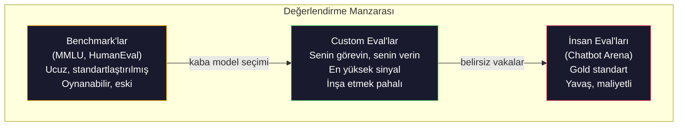
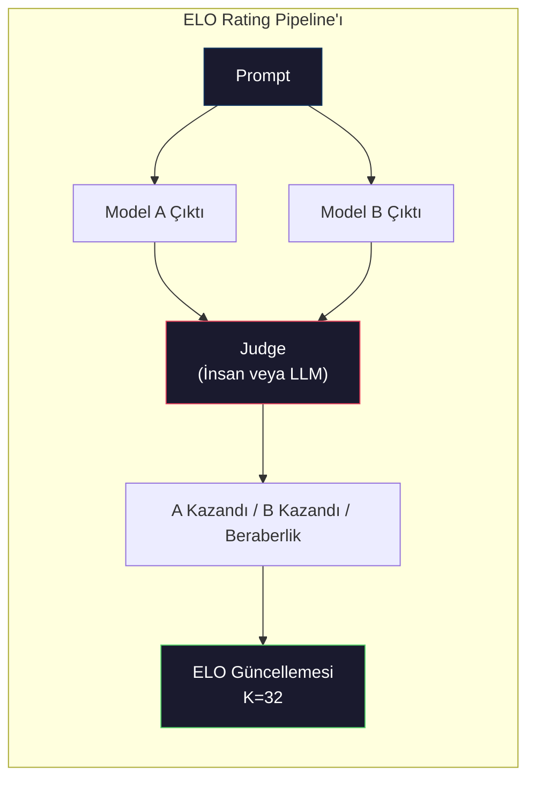

# Değerlendirme: Benchmark'lar, Eval'lar, LM Harness

> Goodhart Yasası: bir ölçü hedef haline geldiğinde, iyi bir ölçü olmaktan çıkar. Her frontier lab benchmark'ları oyunlar. MMLU skorları yükselir ama modeller hala "strawberry" kelimesindeki R'lerin sayısını güvenilir şekilde sayamıyor. Önemli olan tek eval SENİN evalindir — SENİN görevinde, SENİN verilerinle.

**Tür:** Yapım
**Diller:** Python
**Ön koşullar:** Faz 10, Ders 01-05 (LLMs from Scratch)
**Süre:** ~90 dakika

## Öğrenme Hedefleri

- Bir dil modeline karşı multiple-choice ve open-ended benchmark'ları çalıştıran custom bir evaluation harness inşa et
- Standart benchmark'ların (MMLU, HumanEval) neden doyduğunu ve frontier modelleri farklılaştırmada başarısız olduğunu açıkla
- Doğru metriklerle göreve-spesifik eval'lar implement et: exact match, F1, BLEU ve LLM-as-judge skorlama
- Sadece public leaderboard'lara güvenmek yerine spesifik kullanım durumuna hedeflenmiş bir custom değerlendirme suite'i tasarla

## Sorun

MMLU 2020'de 57 konuda 15.908 soru ile yayınlandı. Üç yıl içinde, frontier modeller onu doyurdu. GPT-4 %86.4 aldı. Claude 3 Opus %86.8 aldı. Llama 3 405B %88.6 aldı. Leaderboard farkların gerçek yetenek boşlukları değil, istatistiksel gürültü olduğu 3 puanlık bir aralığa sıkıştı.

Bu arada, aynı modeller 10 yaşındaki bir çocuğun düşünmeden hallettiği görevlerde başarısız oluyor. MMLU'da %88.7 alan Claude 3.5 Sonnet, başlangıçta "strawberry" kelimesindeki harfleri sayamadı — sıfır dünya bilgisi ve sıfır reasoning gerektiren, sadece karakter-seviyeli iterasyon gerektiren bir görev. HumanEval kod üretimini 164 problemle test eder. Modeller %90+ alır ama hala herhangi bir junior developer'ın yakalayacağı edge case'lerde çöken kod üretir.

Benchmark performansı ile gerçek dünya güvenilirliği arasındaki boşluk LLM değerlendirmesinin merkezi sorunudur. Benchmark'lar sana bir modelin benchmark'ta nasıl performans gösterdiğini söyler. O modelin senin spesifik görevin üzerinde, senin spesifik verilerinle, senin spesifik başarısızlık modlarında nasıl performans göstereceği hakkında neredeyse hiçbir şey söylemez. Bir müşteri destek botu inşa ediyorsan, MMLU alakasızdır. Bir kod asistanı inşa ediyorsan, HumanEval sadece fonksiyon-seviyesi generation'ı kapsar — dosyalar arasında debugging, refactoring veya kod açıklama hakkında hiçbir şey söylemez.

Custom eval'lara ihtiyacın var. Benchmark'lar işe yaramaz olduğu için değil — kaba model seçimi için faydalılar — ama final değerlendirmenin deployment koşullarınla tam olarak eşleşmesi gerekir.

## Kavram

### Eval Manzarası

Her biri farklı maliyet ve sinyal kalitesine sahip üç değerlendirme kategorisi vardır.

**Benchmark'lar** standartlaştırılmış test suite'leridir. MMLU, HumanEval, SWE-bench, MATH, ARC, HellaSwag. Bir modeli benchmark'a karşı çalıştırırsın ve bir skor alırsın. Avantajı: herkes aynı testi kullanır, dolayısıyla modelleri karşılaştırabilirsin. Dezavantajı: modeller ve eğitim verileri bu benchmark'ları giderek kontamine eder. Lab'lar benchmark sorularını içeren veri üzerinde eğitir. Skorlar yükselir. Yetenek yükselmeyebilir.

**Custom eval'lar** spesifik kullanım durumun için inşa ettiğin test suite'leridir. Input'ları, beklenen output'ları ve scoring fonksiyonunu sen tanımlarsın. Bir legal document summarizer legal dokümanlar üzerinde değerlendirilir. Bir SQL generator senin database schema'nda değerlendirilir. Bunlar oluşturmak pahalı ama production performansını öngören tek değerlendirme.

**İnsan eval'ları** model çıktılarını faydalılık, doğruluk, akıcılık ve güvenlik kriterlerinde yargılamak için ücretli annotator'lar kullanır. Otomatik skorlamanın başarısız olduğu open-ended görevler için gold standart. Chatbot Arena 100+ model arasında 2 milyondan fazla insan tercih oyu topladı. Olumsuz tarafı: maliyet (yargı başına 0.10-2.00$) ve hız (saatler ila günler).



### Benchmark'lar Neden Bozulur

Üç mekanizma benchmark skorlarının gerçek yeteneği yansıtmayı bırakmasına neden olur.

**Veri kontaminasyonu.** Eğitim corpus'ları interneti kazır. Benchmark soruları internette yaşıyor. Modeller eğitim sırasında cevapları görür. Bu geleneksel anlamda hile değil — lab'lar kasıtlı olarak benchmark verisi dahil etmez. Ama web-ölçekli scraping, dışlamayı neredeyse imkansız yapar.

**Test'e öğretme.** Lab'lar eğitim karışımlarını benchmark performansı için optimize eder. Eğitim karışımının %5'i MMLU-tarzı multiple choice ise, model formatı ve cevap dağılımını öğrenir. MMLU 4-yollu multiple choice. Modeller cevap dağılımının A/B/C/D arasında yaklaşık uniform olduğunu öğrenir, bu model cevabı bilmediğinde bile yardımcı olur.

**Doygunluk.** Her frontier model bir benchmark'ta %85-90 aldığında, benchmark ayırt etmeyi bırakır. Kalan %10-15 soru belirsiz, yanlış etiketli veya belirsiz alan bilgisi gerektirebilir. MMLU'da %87'den %89'a iyileşme modelin iki belirsiz soruyu daha ezberlediği anlamına gelebilir, daha akıllı olduğu değil.

### Perplexity: Hızlı Sağlık Kontrolü

Perplexity bir modelin bir token sequence'ine ne kadar şaşırdığını ölçer. Resmi olarak, üstelleştirilmiş ortalama negative log-likelihood'tir:

```
PPL = exp(-1/N * sum(log P(token_i | context)))
```

10 perplexity, modelin ortalama olarak her token pozisyonunda 10 seçenek arasından uniform seçim kadar belirsiz olduğu anlamına gelir. Daha düşük daha iyi. GPT-2 WikiText-103'te ~30 perplexity alır. GPT-3 ~20 alır. Llama 3 8B ~7 alır.

Perplexity aynı test seti üzerinde modelleri karşılaştırmak için faydalıdır, ama kör noktaları vardır. Bir model yaygın desenleri tahmin etmede iyi olarak ama nadir ama önemli desenlerde berbat olarak düşük perplexity'e sahip olabilir. Talimat takibi, reasoning veya factual accuracy hakkında da hiçbir şey söylemez. Final karar değil, sanity check olarak kullan.

### LLM-as-Judge

Daha zayıf bir modelin output'unu değerlendirmek için güçlü bir model kullan. Fikir basit: GPT-4o veya Claude Sonnet'ten bir yanıtı correctness, helpfulness ve safety için 1-5 ölçeğinde derecelendirmesini iste. Bu GPT-4o-mini ile yargı başına yaklaşık 0.01$ maliyettir ve insan yargılarıyla şaşırtıcı derecede iyi korele olur — çoğu görevde yaklaşık %80 anlaşma.

Scoring prompt'u modelden daha önemli. Belirsiz bir prompt ("Bu yanıtı derecelendir") gürültülü skorlar üretir. Rubric'li yapılandırılmış bir prompt ("Cevap factually doğru ve bir kaynak gösteriyorsa 5 puan, doğru ama kaynaksız ise 4, kısmen doğru ise 3...") tutarlı, tekrarlanabilir skorlar üretir.

Başarısızlık modları: judge modeller pozisyon yanlılığı sergiler (pairwise karşılaştırmalarda ilk yanıtı tercih ederler), verbosity yanlılığı (daha uzun yanıtları tercih ederler) ve self-preference (GPT-4 GPT-4 output'larını eşdeğer Claude output'larından daha yüksek değerlendirir). Mitigasyonlar: sırayı randomize et, uzunluk için normalize et, değerlendirilen modelden farklı bir judge kullan.

### Pairwise Karşılaştırmalardan ELO Rating'leri

Chatbot Arena'nın yaklaşımı. Aynı prompt'a farklı modellerden iki yanıt göster. Bir insan (veya LLM judge) daha iyisini seçer. Binlerce bu karşılaştırmadan, her model için bir ELO rating hesapla — satrançta kullanılan aynı sistem.

ELO avantajları: göreceli sıralama mutlak skorlamadan daha güvenilirdir, beraberlikleri zarif bir şekilde halleder ve her output'u bağımsız skorlamadan daha az karşılaştırmayla yakınsar. 2026 başı itibarıyla, Chatbot Arena sıralamaları üstte birbirinden 20 ELO puanı içinde GPT-4o, Claude 3.5 Sonnet ve Gemini 1.5 Pro gösteriyor.



### Eval Framework'leri

**lm-evaluation-harness** (EleutherAI): standart açık kaynak eval framework'ü. 200+ benchmark destekler. Tek bir komutla herhangi bir Hugging Face modelini MMLU, HellaSwag, ARC vb.'ye karşı çalıştır. Open LLM Leaderboard tarafından kullanılır.

**RAGAS**: özellikle RAG pipeline'ları için değerlendirme framework'ü. Faithfulness (cevap retrieved context ile eşleşiyor mu?), relevance (retrieved context soruyla alakalı mı?) ve answer correctness ölçer.

**promptfoo**: prompt engineering için config-driven eval. Test case'leri YAML'da tanımla, birden fazla modele karşı çalıştır, pass/fail raporu al. Prompt'ları regression test etmek için faydalı — bir prompt değişikliğinin mevcut test case'leri bozmadığından emin ol.

### Custom Eval'lar İnşa Etme

Production için önemli olan tek eval. Süreç:

1. **Görevi tanımla.** Model tam olarak ne yapmalı? Kesin ol. "Soruları cevapla" çok belirsiz. "Bir müşteri şikayet emaili verildiğinde, ürün adını, sorun kategorisini ve sentiment'ı çıkar" değerlendirebileceğin bir görev.

2. **Test case'leri oluştur.** Bir prototip eval için minimum 50, production için 200+. Her test case bir (input, expected_output) çiftidir. Edge case'leri dahil et: boş input'lar, adversarial input'lar, belirsiz input'lar, diğer dillerdeki input'lar.

3. **Scoring tanımla.** Structured output için exact match. Metin benzerliği için BLEU/ROUGE. Open-ended kalite için LLM-as-judge. Extraction görevleri için F1. Birden fazla metriği ağırlıklarla birleştir.

4. **Otomatikleştir.** Her eval tek komutla çalışır. Manuel adım yok. Sonuçları zaman içinde karşılaştırmayı mümkün kılan bir formatta sakla.

5. **Zaman içinde izle.** Tek başına bir eval skoru anlamsızdır. Trendline'a ihtiyacın var. Son prompt değişikliğinden sonra skor iyileşti mi? Model değişikliğinden sonra regresse etti mi? Eval'ını prompt'larınla beraber versiyonla.

| Eval Tipi | Yargı başına maliyet | İnsanlarla anlaşma | İçin en iyi |
|-----------|------------------|----------------------|----------|
| Exact match | ~$0 | %100 (uygulanabilir olduğunda) | Structured output, sınıflandırma |
| BLEU/ROUGE | ~$0 | ~%60 | Çeviri, özetleme |
| LLM-as-judge | ~$0.01 | ~%80 | Open-ended generation |
| İnsan eval | $0.10-$2.00 | N/A (ground truth) | Belirsiz, yüksek-risk görevler |

## İnşa Et

### Adım 1: Minimal Bir Eval Framework

Çekirdek soyutlamaları tanımla. Bir eval case'in input'u, expected output'u ve opsiyonel bir metadata dict'i var. Bir scorer prediction ve reference alır ve 0 ile 1 arasında bir skor döndürür.

```python
import json
from collections import Counter

class EvalCase:
    def __init__(self, input_text, expected, metadata=None):
        self.input_text = input_text
        self.expected = expected
        self.metadata = metadata or {}

class EvalSuite:
    def __init__(self, name, cases, scorers):
        self.name = name
        self.cases = cases
        self.scorers = scorers

    def run(self, model_fn):
        results = []
        for case in self.cases:
            prediction = model_fn(case.input_text)
            scores = {}
            for scorer_name, scorer_fn in self.scorers.items():
                scores[scorer_name] = scorer_fn(prediction, case.expected)
            results.append({
                "input": case.input_text,
                "expected": case.expected,
                "prediction": prediction,
                "scores": scores,
            })
        return results
```

### Adım 2: Scoring Fonksiyonları

Exact match, token F1 ve simüle edilmiş bir LLM-as-judge scorer inşa et.

```python
def exact_match(prediction, expected):
    return 1.0 if prediction.strip().lower() == expected.strip().lower() else 0.0

def token_f1(prediction, expected):
    pred_tokens = set(prediction.lower().split())
    exp_tokens = set(expected.lower().split())
    if not pred_tokens or not exp_tokens:
        return 0.0
    common = pred_tokens & exp_tokens
    precision = len(common) / len(pred_tokens)
    recall = len(common) / len(exp_tokens)
    if precision + recall == 0:
        return 0.0
    return 2 * (precision * recall) / (precision + recall)

def llm_judge_simulated(prediction, expected):
    pred_words = set(prediction.lower().split())
    exp_words = set(expected.lower().split())
    if not exp_words:
        return 0.0
    overlap = len(pred_words & exp_words) / len(exp_words)
    length_penalty = min(1.0, len(prediction) / max(len(expected), 1))
    return round(overlap * 0.7 + length_penalty * 0.3, 3)
```

### Adım 3: ELO Rating Sistemi

ELO güncellemeleri ile pairwise karşılaştırmalar implement et. Bu, Chatbot Arena'nın modelleri sıralamak için kullandığı sistemin aynısı.

```python
class ELOTracker:
    def __init__(self, k=32, initial_rating=1500):
        self.ratings = {}
        self.k = k
        self.initial_rating = initial_rating
        self.history = []

    def _ensure_player(self, name):
        if name not in self.ratings:
            self.ratings[name] = self.initial_rating

    def expected_score(self, rating_a, rating_b):
        return 1 / (1 + 10 ** ((rating_b - rating_a) / 400))

    def record_match(self, player_a, player_b, outcome):
        self._ensure_player(player_a)
        self._ensure_player(player_b)

        ea = self.expected_score(self.ratings[player_a], self.ratings[player_b])
        eb = 1 - ea

        if outcome == "a":
            sa, sb = 1.0, 0.0
        elif outcome == "b":
            sa, sb = 0.0, 1.0
        else:
            sa, sb = 0.5, 0.5

        self.ratings[player_a] += self.k * (sa - ea)
        self.ratings[player_b] += self.k * (sb - eb)

        self.history.append({
            "a": player_a, "b": player_b,
            "outcome": outcome,
            "rating_a": round(self.ratings[player_a], 1),
            "rating_b": round(self.ratings[player_b], 1),
        })

    def leaderboard(self):
        return sorted(self.ratings.items(), key=lambda x: -x[1])
```

### Adım 4: Perplexity Hesaplama

Token olasılıkları kullanarak perplexity hesapla. Pratikte bunları modelin logits'inden alırsın. Burada bir olasılık dağılımıyla simüle ediyoruz.

```python
import numpy as np

def perplexity(log_probs):
    if not log_probs:
        return float("inf")
    avg_neg_log_prob = -np.mean(log_probs)
    return float(np.exp(avg_neg_log_prob))

def token_log_probs_simulated(text, model_quality=0.8):
    np.random.seed(hash(text) % 2**31)
    tokens = text.split()
    log_probs = []
    for i, token in enumerate(tokens):
        base_prob = model_quality
        if len(token) > 8:
            base_prob *= 0.6
        if i == 0:
            base_prob *= 0.7
        prob = np.clip(base_prob + np.random.normal(0, 0.1), 0.01, 0.99)
        log_probs.append(float(np.log(prob)))
    return log_probs
```

### Adım 5: Sonuçları Toplama

Bir eval koşusu boyunca özet istatistikleri hesapla: ortalama, medyan, bir eşikteki pass rate ve metrik başına dökümler.

```python
def summarize_results(results, threshold=0.8):
    all_scores = {}
    for r in results:
        for metric, score in r["scores"].items():
            all_scores.setdefault(metric, []).append(score)

    summary = {}
    for metric, scores in all_scores.items():
        arr = np.array(scores)
        summary[metric] = {
            "mean": round(float(np.mean(arr)), 3),
            "median": round(float(np.median(arr)), 3),
            "std": round(float(np.std(arr)), 3),
            "min": round(float(np.min(arr)), 3),
            "max": round(float(np.max(arr)), 3),
            "pass_rate": round(float(np.mean(arr >= threshold)), 3),
            "n": len(scores),
        }
    return summary

def print_summary(summary, suite_name="Eval"):
    print(f"\n{'=' * 60}")
    print(f"  {suite_name} Özeti")
    print(f"{'=' * 60}")
    for metric, stats in summary.items():
        print(f"\n  {metric}:")
        print(f"    Ortalama:  {stats['mean']:.3f}")
        print(f"    Medyan:    {stats['median']:.3f}")
        print(f"    Std:       {stats['std']:.3f}")
        print(f"    Aralık:    [{stats['min']:.3f}, {stats['max']:.3f}]")
        print(f"    Pass rate: {stats['pass_rate']:.1%} (eşik >= 0.8)")
        print(f"    N:         {stats['n']}")
```

### Adım 6: Tam Pipeline'ı Çalıştır

Her şeyi bir araya getir. Bir görev tanımla, test case'leri oluştur, iki modeli simüle et, eval'ları çalıştır, pairwise karşılaştırmalardan ELO hesapla ve leaderboard'ı yazdır.

```python
def demo_model_good(prompt):
    responses = {
        "What is the capital of France?": "Paris",
        "What is 2 + 2?": "4",
        "Who wrote Hamlet?": "William Shakespeare",
        "What language is PyTorch written in?": "Python and C++",
        "What is the boiling point of water?": "100 degrees Celsius",
    }
    return responses.get(prompt, "I don't know")

def demo_model_bad(prompt):
    responses = {
        "What is the capital of France?": "Paris is the capital city of France",
        "What is 2 + 2?": "The answer is four",
        "Who wrote Hamlet?": "Shakespeare",
        "What language is PyTorch written in?": "Python",
        "What is the boiling point of water?": "212 Fahrenheit",
    }
    return responses.get(prompt, "Unknown")

cases = [
    EvalCase("What is the capital of France?", "Paris"),
    EvalCase("What is 2 + 2?", "4"),
    EvalCase("Who wrote Hamlet?", "William Shakespeare"),
    EvalCase("What language is PyTorch written in?", "Python and C++"),
    EvalCase("What is the boiling point of water?", "100 degrees Celsius"),
]

suite = EvalSuite(
    name="General Knowledge",
    cases=cases,
    scorers={
        "exact_match": exact_match,
        "token_f1": token_f1,
        "llm_judge": llm_judge_simulated,
    },
)

results_good = suite.run(demo_model_good)
results_bad = suite.run(demo_model_bad)

print_summary(summarize_results(results_good), "Model A (öz)")
print_summary(summarize_results(results_bad), "Model B (ayrıntılı)")
```

"İyi" model tam cevaplar verir. "Kötü" model ayrıntılı paraphrase'lar verir. Exact match ayrıntılı modeli ciddi şekilde cezalandırır. Token F1 ve LLM-as-judge daha bağışlayıcıdır. Bu, metrik seçiminin neden önemli olduğunu gösterir: aynı model nasıl skorladığına bağlı olarak harika veya berbat görünür.

### Adım 7: ELO Turnuvası

Çoklu turlar boyunca modeller arasında pairwise karşılaştırmalar çalıştır.

```python
elo = ELOTracker(k=32)

for case in cases:
    pred_a = demo_model_good(case.input_text)
    pred_b = demo_model_bad(case.input_text)

    score_a = token_f1(pred_a, case.expected)
    score_b = token_f1(pred_b, case.expected)

    if score_a > score_b:
        outcome = "a"
    elif score_b > score_a:
        outcome = "b"
    else:
        outcome = "tie"

    elo.record_match("model_a_concise", "model_b_verbose", outcome)

print("\nELO Leaderboard:")
for name, rating in elo.leaderboard():
    print(f"  {name}: {rating:.0f}")
```

### Adım 8: Perplexity Karşılaştırma

Farklı kalite seviyelerinde "modeller" boyunca perplexity karşılaştır.

```python
test_text = "The quick brown fox jumps over the lazy dog in the garden"

for quality, label in [(0.9, "Güçlü model"), (0.7, "Orta model"), (0.4, "Zayıf model")]:
    log_probs = token_log_probs_simulated(test_text, model_quality=quality)
    ppl = perplexity(log_probs)
    print(f"  {label} (kalite={quality}): perplexity = {ppl:.2f}")
```

## Kullan

### lm-evaluation-harness (EleutherAI)

Herhangi bir modelde benchmark çalıştırmak için standart araç.

```python
# pip install lm-eval
# Komut satırı:
# lm_eval --model hf --model_args pretrained=meta-llama/Llama-3.1-8B --tasks mmlu --batch_size 8

# Python API:
# import lm_eval
# results = lm_eval.simple_evaluate(
#     model="hf",
#     model_args="pretrained=meta-llama/Llama-3.1-8B",
#     tasks=["mmlu", "hellaswag", "arc_easy"],
#     batch_size=8,
# )
# print(results["results"])
```

### promptfoo

Prompt engineering için config-driven eval. YAML'da testleri tanımla ve birden fazla provider'a karşı çalıştır.

```yaml
# promptfoo.yaml
providers:
  - openai:gpt-4o-mini
  - anthropic:claude-3-haiku

prompts:
  - "Answer in one word: {{question}}"

tests:
  - vars:
      question: "What is the capital of France?"
    assert:
      - type: contains
        value: "Paris"
  - vars:
      question: "What is 2 + 2?"
    assert:
      - type: equals
        value: "4"
```

### RAG değerlendirmesi için RAGAS

```python
# pip install ragas
# from ragas import evaluate
# from ragas.metrics import faithfulness, answer_relevancy, context_precision
#
# result = evaluate(
#     dataset,
#     metrics=[faithfulness, answer_relevancy, context_precision],
# )
# print(result)
```

RAGAS generic eval'ların kaçırdığını ölçer: modelin cevabı retrieved context'te grounded mı, yoksa cevap sadece soyutta "doğru" mu.

## Yayınla

Bu ders `outputs/prompt-eval-designer.md` üretir — herhangi bir görev için custom eval suite'ler tasarlayan yeniden kullanılabilir bir prompt. Ona bir görev açıklaması ver, test case'leri, scoring fonksiyonları ve bir pass/fail eşiği önerisi üretir.

Ayrıca `outputs/skill-llm-evaluation.md` üretir — görev tipine, bütçeye ve latency gereksinimlerine dayalı olarak doğru değerlendirme stratejisini seçmek için bir karar framework'ü.

## Alıştırmalar

1. Aynı input'u modelden 5 kez geçiren ve output'ların ne sıklıkta eşleştiğini ölçen bir "consistency" scorer ekle. Deterministik input'larda tutarsız cevaplar kırılgan prompt'ları veya yüksek temperature ayarlarını ortaya çıkarır.

2. ELO tracker'ı birden fazla judge fonksiyonu (exact match, F1, LLM-as-judge) destekleyecek ve onları ağırlıklandıracak şekilde genişlet. Exact match'i ağır ağırlıkladığında ve F1'i ağır ağırlıkladığında leaderboard'un nasıl değiştiğini karşılaştır.

3. Spesifik bir görev için bir eval suite inşa et: 5 kategoriye email sınıflandırma. Birden fazla kategoriye ait olabilecek email'ler, boş email'ler, diğer dillerdeki email'ler gibi edge case'ler dahil çeşitli örneklerle 100 test case oluştur. Farklı "modellerin" (kural-tabanlı, anahtar kelime eşleştirme, simüle edilmiş LLM) nasıl performans gösterdiğini ölç.

4. Kontaminasyon tespiti implement et: bir eval soruları seti ve bir eğitim corpus'u verildiğinde, eval sorularının (veya yakın paraphrase'lerin) eğitim verisinde ne yüzdesinin göründüğünü kontrol et. Araştırmacılar benchmark geçerliliğini bu şekilde denetler.

5. Bir "model diff" aracı inşa et. İki model versiyonundan eval sonuçları verildiğinde, hangi spesifik test case'lerin iyileştiğini, hangilerinin regresse ettiğini ve hangilerinin aynı kaldığını vurgula. Bu bir kod diff'inin eval eşdeğeridir — bir değişikliğin yardım edip etmediğini anlamak için esastır.

## Anahtar Terimler

| Terim | İnsanlar ne diyor | Gerçekte ne anlama geliyor |
|------|----------------|----------------------|
| MMLU | "Benchmark" | Massive Multitask Language Understanding — 57 konuda 15.908 multiple choice soru, 2025 itibarıyla %88 üzerinde doyduğu |
| HumanEval | "Kod eval" | OpenAI'nin 164 Python function-completion problemi, sadece izole fonksiyon generation'ı test eder |
| SWE-bench | "Gerçek kodlama eval" | 12 Python repo'sundan 2.294 GitHub issue, test üretimi dahil uçtan uca bug fixing'i ölçer |
| Perplexity | "Modelin ne kadar kafası karışık" | exp(-avg(log P(token_i context verildiğinde))) — daha düşük modelin gerçek token'lara daha yüksek olasılık atadığı anlamına gelir |
| ELO rating | "Modeller için satranç sıralaması" | Pairwise win/loss kayıtlarından hesaplanan göreceli yetenek rating'i, Chatbot Arena tarafından 100+ modeli sıralamak için kullanılır |
| LLM-as-judge | "AI'yı derecelendirmek için AI" | Güçlü bir model bir rubric'e karşı zayıf bir modelin output'larını skorlar, yargı başına ~0.01$'da insan judge'larla ~%80 anlaşma |
| Data contamination | "Model testi gördü" | Eğitim verisi benchmark sorularını içerir, gerçek yeteneği iyileştirmeden skorları şişirir |
| Eval suite | "Bir grup test" | Spesifik bir yeteneği ölçen versiyonlu (input, expected_output, scorer) üçlü koleksiyonu |
| Pass rate | "Yüzde kaçını doğru yapıyor" | Bir eşiğin üzerinde skorlayan eval case'lerin oranı — güvenilirliği ölçtüğü için ortalama skordan daha actionable |
| Chatbot Arena | "Model sıralama web sitesi" | 2M+ insan tercih oyu ile LMSYS platformu, ELO rating'leri yoluyla en güvenilir LLM leaderboard'u üretir |

## İleri Okuma

- [Hendrycks et al., 2021 -- "Measuring Massive Multitask Language Understanding"](https://arxiv.org/abs/2009.03300) -- doygunluğuna rağmen hala en çok atıfta bulunulan LLM benchmark'ı olan MMLU makalesi
- [Chen et al., 2021 -- "Evaluating Large Language Models Trained on Code"](https://arxiv.org/abs/2107.03374) -- OpenAI'den HumanEval makalesi, kod üretimi değerlendirme metodolojisini oluşturdu
- [Zheng et al., 2023 -- "Judging LLM-as-a-Judge"](https://arxiv.org/abs/2306.05685) -- pozisyon yanlılığı ve verbosity yanlılığı bulguları dahil LLM'leri değerlendirmek için LLM kullanmanın sistematik analizi
- [LMSYS Chatbot Arena](https://chat.lmsys.org/) -- 2M+ oy ile crowdsourced model karşılaştırma platformu, en güvenilir gerçek-dünya LLM sıralaması
