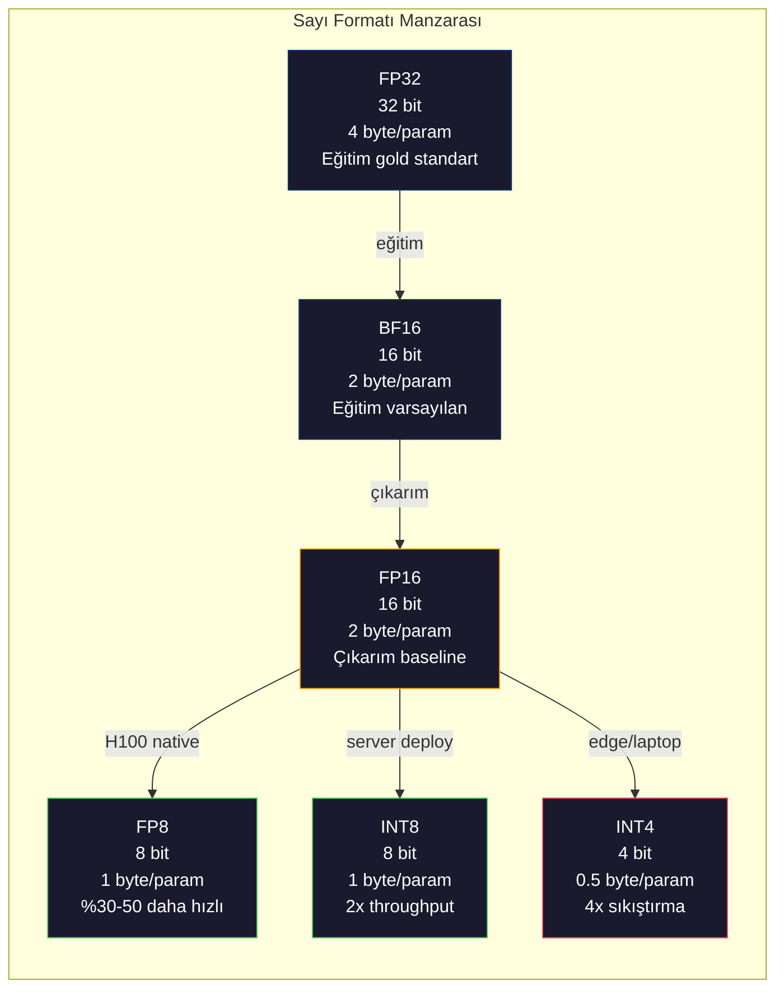
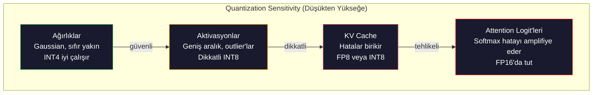
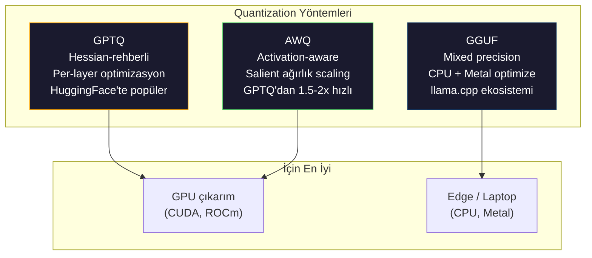

# Quantization: Modelleri Sığdırmak

> FP16'da 70B model 140GB ister. Sadece ağırlıklar için iki A100. FP8'e quantize et: bir 80GB GPU. INT4: bir MacBook.

**Tür:** Yapım
**Diller:** Python (numpy ile)
**Ön koşullar:** Faz 10, Ders 01-10 (LLMs from Scratch)
**Süre:** ~120 dakika

## Öğrenme Hedefleri

- FP16'dan INT8 ve INT4'e simetrik ve asimetrik quantization implement et, per-tensor ve per-channel scaling dahil
- Quantization'dan gelen memory tasarrufunu hesapla ve verilen bir GPU'nun VRAM'ine hangi precision'ın sığdığını belirle
- Post-training quantization (PTQ) ile quantization-aware training (QAT) arasındaki farkı açıkla
- Gerçek bir modeli quantize etmek için GPTQ veya AWQ uygula ve bir benchmark üzerinde accuracy-memory tradeoff'u ölç

## Sorun

Llama 3 70B'nin 70 milyar parametresi var. Her parametre 16-bit floating point sayı. Bu 140 milyar byte. 140GB. Tek bir A100'ün 80GB VRAM'i var. Çıkarımı çalıştırmak şöyle dursun, ağırlıkları bile yükleyemezsin tek bir GPU'da. Sadece bir modeli servis etmek için saatte 2$'a iki A100 gerekir.

Ama parametre başına 16 bit israftır. Bir nöron ağındaki çoğu ağırlık sıfır yakınında kümelenir. FP16'nın tam dinamik aralığı (0.000000059'dan 65.504'e) neredeyse tamamen kullanılmaz. Llama 3 70B'deki ağırlıkların gerçek dağılımını ölçersen, %95'i -0.1 ile +0.1 arasına düşer. 4 bit'e sığabilecek değerleri temsil etmek için 16 bit yakıyorsun.

Quantization yüksek-precision sayıları daha düşük precision olanlarla değiştirir. FP16'dan FP8'e memory'i yarıya indirir. FP16'dan INT4'e dörtte birine indirir. O 140GB model 35GB olur. Tek bir tüketici GPU'sune sığar. 2-bit quantization'a it (agresif, lossy, ama bazı görevler için kullanılabilir) ve aynı model 16GB laptop'ta çalışır.

Maliyet accuracy'dir. Kaldırdığın her bit bilgiyi yok eder. Soru ne kadar accuracy kaybettiğin ve nerede olduğu. İyi quantize edilmiş bir INT4 model orijinalin kalitesinin çoğu benchmark'ta %95-99'unu korur. INT4'e naif bir quantization modeli tamamen yok edebilir. Fark teknik.

Llama 3'ün INT4'e GPTQ ile topluluk quantization'ları WikiText üzerinde kabaca 1-2 perplexity puanı kayıp gösterir. Mistral Mixtral 8x22B'nin FP8 checkpoint'lerini MMLU'da sıfır ölçülebilir kalite kaybı ile yayınladı. GGUF formatı llama.cpp'i güçlendiriyor, M-serisi çiplerle MacBook'larda 70B modelleri çalıştırıyor. Quantization bir hack değil. 7B'den büyük her model için standart deployment yoludur.

## Kavram

### Sayı Formatları: Her Bit Ne Yapar

Her floating-point sayının üç parçası vardır: sign, exponent ve mantissa (significand olarak da bilinir). Sign bir bit. Exponent aralığı belirler (sayının ne kadar büyük veya küçük olabileceği). Mantissa precision'ı belirler (ne kadar ondalık basamak alırsın).

```
FP32:  [1 sign] [8 exponent] [23 mantissa]  = 32 bit
FP16:  [1 sign] [5 exponent] [10 mantissa]  = 16 bit
BF16:  [1 sign] [8 exponent] [7  mantissa]  = 16 bit
FP8:   [1 sign] [4 exponent] [3  mantissa]  = 8  bit (E4M3)
FP8:   [1 sign] [5 exponent] [2  mantissa]  = 8  bit (E5M2)
INT8:  [1 sign] [7 değer]                   = 8  bit (uniform adımlar)
INT4:  [1 sign] [3 değer]                   = 4  bit (toplam 16 seviye)
```

**FP32** tam precision. 23 mantissa bit yaklaşık 7 ondalık rakam precision verir. Aralık: kabaca 1.2 x 10^-38 ila 3.4 x 10^38. Eğitim eskiden tamamen FP32'de oluyordu. Hala accumulation için oluyor (matrix multiplication sırasında running toplamlar).

**FP16** bitleri yarıya indirir. 10 mantissa bit yaklaşık 3.3 ondalık rakam verir. Exponent 5 bit'e küçülür, aralığı dramatik şekilde azaltır (max değer ~65.504). Bu ağırlıklar için iyi (sıfır yakınında kümelenir) ama eğitim sırasında spike edebilen aktivasyonlar ve gradient'lar için tehlikelidir. FP16 eğitimi underflow'u önlemek için loss scaling gerektirir.

**BF16** (Brain Float 16) FP32'den 8-bit exponent'i tutar ama mantissa'yı 7 bit'e küçültür. FP32 ile aynı aralık, FP16'dan az precision. Google bunu derin öğrenme için özellikle tasarladı. Sezgi: aralık nöron ağları için precision'dan daha önemli. FP16'da sıfıra underflow eden 10^-20 gradient BF16'da hayatta kalır. BF16'da 0.0734'e yuvarlanan 0.07342 ağırlığı yeterince yakın. Her modern eğitim koşusu BF16 veya BF16/FP32 karışımı kullanır.

**FP8** iki tatla gelir. E4M3 (4 exponent, 3 mantissa) çıkarım sırasında ağırlıklar ve aktivasyonlar için kullanılır. E5M2 (5 exponent, 2 mantissa) eğitim sırasında gradient'lar için aralığın precision'dan daha önemli olduğu yerlerde kullanılır. H100 GPU'larda FP8 çıkarımı FP16 üzerinde ihmal edilebilir kalite kaybı ile %30-50 hızlanma elde eder.

**INT8** bir integer formatıdır. Exponent yok, mantissa yok. Sadece -128'den 127'ye 256 eşit aralıklı değer. Floating-point ağırlıkları bu aralığa eşlemek için bir scale factor'a ihtiyacın var. Avantajı: integer aritmetiği floating-point'ten daha hızlı ve daha güç-verimli. A100'de INT8 matrix multiplication 624 TOPS'ta çalışır, FP16 için 312 TFLOPS'a karşı.

**INT4** daha ileri iter. Sadece 16 olası değer. Scale factor ağır iş yapar. Kalite tamamen scale'i nasıl seçtiğine ve hangi ağırlıkları quantize ettiğine bağlıdır. State-of-the-art INT4 yöntemleri (GPTQ, AWQ) orijinal model kalitesinin %95+'sını korur.



### Quantization Nasıl Çalışır

Çekirdek operasyon basit. Bir floating-point değerler tensoru al, bir scale factor bul, çarp, en yakın integer'a yuvarla ve integer'ları artı scale factor'u sakla.

**Quantize:**
```
scale = max(abs(tensor)) / max_int_value
quantized = round(tensor / scale)
```

**Dequantize:**
```
reconstructed = quantized * scale
```

Simetrik aralıkla INT8 için (-127 ila 127):
```
scale = max(abs(tensor)) / 127
quantized = clamp(round(tensor / scale), -128, 127)
```

Hata yuvarlama hatasıdır. Her değer en fazla `scale / 2` kadar yanlış olabilir. Bir katman boyunca toplam hata kaç ağırlığın olduğuna ve modelin o ağırlıklardaki bozulmalara ne kadar hassas olduğuna bağlıdır.

**Per-tensor vs per-channel quantization.** Per-tensor tüm weight matrisi için tek bir scale factor kullanır. Basit ama lossy: bir sütunda büyük değerler ve diğerinde küçük değerler varsa, küçük değerler precision'ın çoğunu kaybeder. Per-channel weight matrisinin her output channel'ı başına (her satır veya sütun başına) bir scale factor kullanır. Daha fazla overhead (1 yerine N scale factor saklarsın) ama dramatik şekilde daha iyi kalite. Her production quantization yöntemi per-channel veya daha ince granülerlik kullanır.

**Asimetrik quantization** bir zero-point offset ekler: `quantized = round(tensor / scale) + zero_point`. Bu sıfırda merkezlenmemiş dağılımları halleder. ReLU aktivasyonları, örneğin, her zaman non-negatiftir. Simetrik quantization integer aralığının yarısını asla görünmeyen negatif değerlerde boşa harcar. Asimetrik quantization gerçek aralığı [min, max] tam integer aralığına eşler.

### Sensitivity Hiyerarşisi

Bir modeldeki her şey quantization'ı eşit derecede tolere etmez. Net bir hiyerarşi vardır.

**Ağırlıklar (en sağlam).** Model ağırlıkları eğitim sırasında yavaş değişir ve sıfır yakınında merkezli kabaca bir Gaussian dağılımı izler. İyi quantize olurlar. Per-channel scale'li INT8 ağırlıklar neredeyse kayıpsız sonuçlar üretir. INT4 daha sofistike yöntemler gerektirir ama çalışır.

**Aktivasyonlar (orta hassasiyet).** Aktivasyonlar çıkarım sırasında ağdan akan ara değerlerdir. Ağırlıklardan daha geniş dinamik aralığa sahiptirler ve outlier'lar içerirler. Tek bir attention head ortalamadan 100x büyük aktivasyon değerleri üretebilir. Bu outlier'lar model kalitesi için kritiktir. Onları naif quantize etmek bilgiyi yok eder. Çözümler: outlier kanalları daha yüksek precision'da tut (LLM.int8()), per-token veya per-channel aktivasyon scale'leri kullan.

**KV cache (yüksek hassasiyet).** Key-value cache tüm önceki token'lar için attention state'lerini saklar. Uzun context uzunluklarında, KV cache memory'i baskıda eder. 70B model için 32K context'te, KV cache tek başına FP16'da 40GB. KV cache'i FP8 veya INT8'e quantize etmek devasa memory tasarrufu sağlar ama herhangi bir hata tüm gelecekteki attention hesaplamaları boyunca birikir. Kalite etkisi sequence uzunluğuyla ölçeklenir.

**Attention logit'leri (en hassas).** Attention'daki softmax input'larındaki küçük değişikliklere son derece hassastır. Pre-softmax bir logit'te 0.01'lik bir quantization hatası attention dağılımını anlamlı şekilde kaydırabilir. Çoğu quantization şeması attention hesaplamasını her şey quantize edilse bile daha yüksek precision'da (FP16 veya BF16) tutar.



### PTQ vs QAT

**Post-Training Quantization (PTQ)** zaten-eğitilmiş bir modeli quantize eder. Yeniden eğitim yok. FP16 ağırlıkları alırsın, scale factor'lar hesaplarsın, yuvarlarsın ve deploy edersin. Hızlı (dakikalar ila saatler) ve ucuz. INT8 ve FP8 için iyi çalışır. INT4 için, naif PTQ genellikle yuvarlama hataları biriktiği için kötü başarısız olur. Gelişmiş PTQ yöntemleri (GPTQ, AWQ) quantization hatasını minimize etmek için kalibrasyon verisi kullanır.

**Quantization-Aware Training (QAT)** eğitim sırasında forward pass'a sahte quantization operasyonları ekler. Model ağırlıklarını yuvarlama hatalarının küçük olduğu yere yerleştirmeyi öğrenir. Gradient'lar straight-through estimator (STE) kullanarak sahte quantization üzerinden akar: yuvarlama operasyonunun gradient'inin 1 olduğunu varsay. QAT PTQ'dan daha iyi INT4 ve INT2 modeller üretir ama tam bir eğitim koşusu gerektirir. Google Gemini'nin verimli serving için QAT kullandı. Meta bazı Llama deployment hedefleri için QAT kullandı.

| Yön | PTQ | QAT |
|--------|-----|-----|
| Maliyet | Dakika ila saat | Tam eğitim koşusu |
| INT8'de kalite | Mükemmel (< %0.1 kayıp) | Mükemmel |
| INT4'te kalite | GPTQ/AWQ ile iyi (%1-3 kayıp) | Daha iyi (< %1 kayıp) |
| INT2'de kalite | Kötü | Bazı görevler için kullanılabilir |
| Kalibrasyon verisi | 128-1024 örnek | Tam eğitim dataset'i |
| Ne zaman kullan | Deployment, iterasyon | Düşük bit-width'te maksimum kalite |

### GPTQ, AWQ, GGUF

**GPTQ (GPT Quantization)** bir one-shot PTQ yöntemidir. Ağırlıkları her seferinde bir katman quantize eder, küçük bir kalibrasyon dataset'i (tipik 128 örnek) kullanarak Hessian (output'un her ağırlığa ne kadar hassas olduğu hakkında second-order bilgi) ölçer. Hessian'ın önemli dediği ağırlıklar daha dikkatli quantize edilir. GPTQ LLM'ler için INT4 quantization'ı pratik yapan ilk yöntemdi. Hugging Face'teki TheBloke yüzlerce modelin quantize edilmiş versiyonlarını yayınlayarak GPTQ'yu popülerleştirdi.

**AWQ (Activation-Aware Weight Quantization)** ağırlıkların küçük bir oranının (yaklaşık %1) büyük aktivasyon değerleriyle çarpıldığı için orantısız önemli olduğunu gözlemler. AWQ kalibrasyon verisi kullanarak bu salient ağırlıkları tanımlar ve quantization'dan önce onları ölçeklendirir (sonra karşılık gelen aktivasyonları aşağı ölçeklendirir). Bu önemli ağırlıkları INT4 quantization'ın doğru olduğu bir aralıkta tutar. AWQ tipik olarak GPTQ kalitesini eşler veya biraz geçer, uygulamak için 1.5-2x daha hızlıdır.

**GGUF (GPT-Generated Unified Format)** llama.cpp ve ekosistemi tarafından kullanılan dosya formatıdır. Karışık quantization'ı destekler: farklı katmanlar farklı bit width'leri alır. İlk ve son katmanlar (embedding ve output head) tipik olarak daha yüksek precision'da tutulur. Orta katmanlar INT4 veya INT3 alır. GGUF dosyaları kendi içinde tamdır: ağırlıklar, tokenleştirici, metadata hepsi tek dosyada. Format CPU çıkarımı ve Apple Silicon için tasarlanmıştır, tüm modeli memory'e yükleyip CPU veya Metal GPU üzerinde matrix multiplication çalıştırmanın standart yol olduğu yerlerde. Q4_K_M en popüler GGUF quantization varyantıdır, kalite ve boyutu dengeler.



### Kalite Ölçümü

Quantize edilmiş modelinin hala iyi olup olmadığını nasıl bilirsin?

**Perplexity.** En yaygın metrik. Daha düşük daha iyi. Hem orijinal hem quantize edilmiş model için held-out bir dataset'te (WikiText-2 standarttır) perplexity hesapla. Delta sana quantization'ın ne kadar bilgi yok ettiğini söyler. Pratik kurallar: delta < 0.5 mükemmel, 0.5-1.0 iyi, 1.0-2.0 çoğu görev için kabul edilebilir, > 2.0 bir şeyler ters gitti demek.

**Göreve-özgü benchmark'lar.** Quantize edilmiş modeli MMLU, HumanEval, GSM8K veya custom eval suite'inde çalıştır. Orijinale karşı karşılaştır. Quantization farklı yetenekleri eşitsiz etkiler. Matematik ve kod görevleri genel bilgiden precision kaybına daha hassastır.

**Output karşılaştırması.** Aynı prompt'larda her iki modelden de yanıt üret ve karşılaştır. LLM-as-judge (Ders 10) burada iyi çalışır. Bir win rate hesapla: quantize edilmiş model orijinali kaç prompt'ta eşler veya yener?

**Latency ve throughput.** Quantization modelleri daha hızlı ve daha ucuz yapmak için vardır. Token başına saniyeyi, time to first token'ı ve memory kullanımını ölç. Orijinalinden daha yavaş bir quantize edilmiş model işe yaramazdan beter.

| Model | Format | Boyut | Perplexity (WikiText-2) | MMLU | Token/sn (A100) |
|-------|--------|------|------------------------|------|-------------------|
| Llama 3 70B | FP16 | 140GB | 3.12 | %79.5 | 38 |
| Llama 3 70B | FP8 | 70GB | 3.14 | %79.3 | 55 |
| Llama 3 70B | GPTQ INT4 | 35GB | 4.32 | %77.8 | 72 |
| Llama 3 70B | AWQ INT4 | 35GB | 4.18 | %78.1 | 75 |
| Llama 3 70B | GGUF Q4_K_M | 40GB | 4.25 | %77.9 | 28 (CPU) |

Desen: FP8 neredeyse ücretsiz. INT4 1-2 MMLU puanı maliyetlidir ama throughput'u ikiye katlar ve memory'i dörtte birine indirir. Tradeoff neredeyse her deployment için değerli.

### Gerçek Sayılar

H100'de FP16'dan FP8'e: %30-50 çıkarım hızlanması, < %0.1 kalite kaybı. Bu hiç düşünmeden yapılacak quantization. Her H100 deployment'ı bunu kullanmalı.

FP16'dan INT8'e (LLM.int8()): 2x memory azalması, < %0.5 kalite kaybı. Mixed-precision yaklaşım outlier feature'ları FP16'da tutar, diğer her şeyi INT8'e quantize eder.

FP16'dan INT4'e (GPTQ/AWQ): 4x memory azalması, modele ve yönteme bağlı olarak %1-3 kalite kaybı. Tek 48GB GPU üzerinde 70B modelleri mümkün kılar.

FP16'dan INT4'e (GGUF Q4_K_M): 3.5x memory azalması, %1-2 kalite kaybı. CPU çıkarımı için optimize. Q4_K_M'de 70B model yaklaşık 40GB ve 64GB'lık M3 Max'ta saniyede 10-15 token çalışır.

FP16'dan INT2'ye: 8x memory azalması, %5-15 kalite kaybı. Sadece bozulmaya tolere edebileceğin spesifik dar görevler için uygulanabilir. Araştırma sınırı, genel kullanım için production-ready değil.

## İnşa Et

### Adım 1: Sayı Formatı Temsilleri

Her formatın bit-seviyesi temsilini inşa et, sign, exponent ve mantissa'nın tam olarak ne yaptığını görmek için.

```python
import numpy as np


def float_to_fp32_bits(value):
    bits = np.float32(value).view(np.uint32)
    sign = (bits >> 31) & 1
    exponent = (bits >> 23) & 0xFF
    mantissa = bits & 0x7FFFFF
    return {"sign": int(sign), "exponent": int(exponent), "mantissa": int(mantissa),
            "exponent_bits": format(int(exponent), '08b'),
            "mantissa_bits": format(int(mantissa), '023b'),
            "value": float(value),
            "actual_exponent": int(exponent) - 127}


def float_to_fp16_bits(value):
    fp16 = np.float16(value)
    bits = fp16.view(np.uint16)
    sign = (bits >> 15) & 1
    exponent = (bits >> 10) & 0x1F
    mantissa = bits & 0x3FF
    return {"sign": int(sign), "exponent": int(exponent), "mantissa": int(mantissa),
            "exponent_bits": format(int(exponent), '05b'),
            "mantissa_bits": format(int(mantissa), '010b'),
            "value": float(fp16),
            "actual_exponent": int(exponent) - 15}


def float_to_bf16_bits(value):
    fp32_bits = np.float32(value).view(np.uint32)
    bf16_bits = (fp32_bits >> 16).astype(np.uint16)
    sign = (bf16_bits >> 15) & 1
    exponent = (bf16_bits >> 7) & 0xFF
    mantissa = bf16_bits & 0x7F
    reconstructed = np.uint32(bf16_bits.astype(np.uint32) << 16).view(np.float32)
    return {"sign": int(sign), "exponent": int(exponent), "mantissa": int(mantissa),
            "exponent_bits": format(int(exponent), '08b'),
            "mantissa_bits": format(int(mantissa), '07b'),
            "value": float(reconstructed),
            "actual_exponent": int(exponent) - 127}


def simulate_fp8_e4m3(value):
    sign = 1 if value < 0 else 0
    abs_val = abs(value)
    max_val = 448.0
    abs_val = min(abs_val, max_val)
    if abs_val == 0:
        return {"sign": sign, "exponent": 0, "mantissa": 0, "value": 0.0,
                "exponent_bits": "0000", "mantissa_bits": "000"}
    exp = int(np.floor(np.log2(abs_val)))
    exp = max(-6, min(8, exp))
    mantissa_val = abs_val / (2.0 ** exp) - 1.0
    mantissa_quant = round(mantissa_val * 8) / 8
    mantissa_quant = max(0, min(0.875, mantissa_quant))
    reconstructed = (1.0 + mantissa_quant) * (2.0 ** exp)
    if sign:
        reconstructed = -reconstructed
    mantissa_int = int(round(mantissa_quant * 8))
    return {"sign": sign, "exponent": exp + 7, "mantissa": mantissa_int,
            "exponent_bits": format(exp + 7, '04b'),
            "mantissa_bits": format(mantissa_int, '03b'),
            "value": float(reconstructed),
            "actual_exponent": exp}


def display_format_comparison(value):
    fp32 = float_to_fp32_bits(value)
    fp16 = float_to_fp16_bits(value)
    bf16 = float_to_bf16_bits(value)
    fp8 = simulate_fp8_e4m3(value)

    print(f"\n  Değer: {value}")
    print(f"  {'Format':<8} {'Saklanan Değer':>16} {'Hata':>12} {'Sign':>5} {'Exp Bit':>10} {'Man Bit':>25}")
    print(f"  {'-'*76}")
    print(f"  {'FP32':<8} {fp32['value']:>16.6f} {abs(fp32['value'] - value):>12.8f} {fp32['sign']:>5} {fp32['exponent_bits']:>10} {fp32['mantissa_bits']:>25}")
    print(f"  {'FP16':<8} {fp16['value']:>16.6f} {abs(fp16['value'] - value):>12.8f} {fp16['sign']:>5} {fp16['exponent_bits']:>10} {fp16['mantissa_bits']:>25}")
    print(f"  {'BF16':<8} {bf16['value']:>16.6f} {abs(bf16['value'] - value):>12.8f} {bf16['sign']:>5} {bf16['exponent_bits']:>10} {bf16['mantissa_bits']:>25}")
    print(f"  {'FP8e4m3':<8} {fp8['value']:>16.6f} {abs(fp8['value'] - value):>12.8f} {fp8['sign']:>5} {fp8['exponent_bits']:>10} {fp8['mantissa_bits']:>25}")
```

### Adım 2: Simetrik Quantization (Per-Tensor ve Per-Channel)

Temel quantization operasyonları. Per-tensor tüm matris için tek bir scale kullanır. Per-channel her satır veya sütun başına bir scale kullanır.

```python
def quantize_symmetric(tensor, num_bits=8):
    qmin = -(2 ** (num_bits - 1))
    qmax = 2 ** (num_bits - 1) - 1
    abs_max = np.max(np.abs(tensor))
    if abs_max == 0:
        return np.zeros_like(tensor, dtype=np.int32), 1.0
    scale = abs_max / qmax
    quantized = np.clip(np.round(tensor / scale), qmin, qmax).astype(np.int32)
    return quantized, float(scale)


def dequantize_symmetric(quantized, scale):
    return quantized.astype(np.float64) * scale


def quantize_per_channel(tensor, num_bits=8, axis=0):
    qmin = -(2 ** (num_bits - 1))
    qmax = 2 ** (num_bits - 1) - 1

    if axis == 0:
        abs_max = np.max(np.abs(tensor), axis=1, keepdims=True)
    else:
        abs_max = np.max(np.abs(tensor), axis=0, keepdims=True)

    abs_max = np.where(abs_max == 0, 1.0, abs_max)
    scales = abs_max / qmax
    quantized = np.clip(np.round(tensor / scales), qmin, qmax).astype(np.int32)
    return quantized, scales.squeeze()


def dequantize_per_channel(quantized, scales, axis=0):
    if axis == 0:
        return quantized.astype(np.float64) * scales.reshape(-1, 1)
    else:
        return quantized.astype(np.float64) * scales.reshape(1, -1)


def quantize_asymmetric(tensor, num_bits=8):
    qmin = 0
    qmax = 2 ** num_bits - 1
    t_min = np.min(tensor)
    t_max = np.max(tensor)
    if t_max == t_min:
        return np.zeros_like(tensor, dtype=np.int32), 1.0, 0
    scale = (t_max - t_min) / (qmax - qmin)
    zero_point = int(np.round(qmin - t_min / scale))
    zero_point = max(qmin, min(qmax, zero_point))
    quantized = np.clip(np.round(tensor / scale + zero_point), qmin, qmax).astype(np.int32)
    return quantized, float(scale), int(zero_point)


def dequantize_asymmetric(quantized, scale, zero_point):
    return (quantized.astype(np.float64) - zero_point) * scale
```

### Adım 3: Kalite Ölçümü

Quantization'ın ne kadar bilgi yok ettiğini ölç. Mean squared error, signal-to-noise oranı ve orijinal ile reconstructed tensorlar arasında cosine similarity.

```python
def quantization_error(original, reconstructed):
    diff = original - reconstructed
    mse = float(np.mean(diff ** 2))
    rmse = float(np.sqrt(mse))
    max_error = float(np.max(np.abs(diff)))
    signal_power = float(np.mean(original ** 2))
    snr_db = 10 * np.log10(signal_power / max(mse, 1e-20))

    orig_flat = original.flatten()
    recon_flat = reconstructed.flatten()
    norm_orig = np.linalg.norm(orig_flat)
    norm_recon = np.linalg.norm(recon_flat)
    if norm_orig == 0 or norm_recon == 0:
        cosine_sim = 0.0
    else:
        cosine_sim = float(np.dot(orig_flat, recon_flat) / (norm_orig * norm_recon))

    return {"mse": mse, "rmse": rmse, "max_error": max_error,
            "snr_db": float(snr_db), "cosine_similarity": cosine_sim}
```

### Adım 4: Bit-Width Sweep

Aynı tensoru farklı bit width'lerinde (2, 3, 4, 8, 16) quantize et ve her seviyede kaliteyi ölç. Bu kalite uçurumunun tam olarak nerede olduğunu gösterir.

```python
def bit_width_sweep(tensor):
    print(f"\n  Bit-Width Sweep (tensor şekli {tensor.shape}):")
    print(f"  {'Bit':>6} {'Seviye':>8} {'MSE':>14} {'SNR (dB)':>10} {'Cosine Sim':>12} {'Sıkıştırma':>12}")
    print(f"  {'-'*64}")

    results = []
    for bits in [2, 3, 4, 8, 16]:
        q, s = quantize_per_channel(tensor, bits, axis=0)
        recon = dequantize_per_channel(q, s, axis=0)
        err = quantization_error(tensor, recon)
        levels = 2 ** bits
        compression = 32.0 / bits

        print(f"  {bits:>6} {levels:>8} {err['mse']:>14.8f} {err['snr_db']:>10.2f} {err['cosine_similarity']:>12.8f} {compression:>11.1f}x")
        results.append({"bits": bits, "levels": levels, "error": err, "compression": compression})

    return results
```

### Adım 5: Sensitivity Deneyi

Bir transformer'ın farklı parçalarını quantize etmeyi simüle et ve hangi bileşenlerin en hassas olduğunu ölç. Bu sensitivity hiyerarşisini gösterir: weights < activations < KV cache < attention.

```python
def simulate_transformer_layer(input_data, weights, kv_scale=1.0):
    hidden = input_data @ weights["qkv"]
    seq_len = hidden.shape[1]
    d_model = weights["qkv"].shape[1] // 3
    q, k, v = hidden[:, :, :d_model], hidden[:, :, d_model:2*d_model], hidden[:, :, 2*d_model:]

    attn_scores = (q @ k.transpose(0, 2, 1)) / np.sqrt(d_model) * kv_scale
    attn_max = np.max(attn_scores, axis=-1, keepdims=True)
    attn_exp = np.exp(attn_scores - attn_max)
    attn_weights = attn_exp / np.sum(attn_exp, axis=-1, keepdims=True)

    attn_output = attn_weights @ v
    output = attn_output @ weights["out"]
    return output, {"q": q, "k": k, "v": v, "attn_scores": attn_scores,
                    "attn_weights": attn_weights, "attn_output": attn_output}
```

### Adım 6: Simüle Edilmiş GPTQ

GPTQ her seferinde bir sütun quantize eder, yuvarlama hatasını nasıl dağıtacağına karar vermek için Hessian'ı kullanır. Bu, çekirdek fikri yakalayan basitleştirilmiş bir versiyondur: ağırlık önemini ölçmek için kalibrasyon verisi kullan, sonra en az önemli ağırlıkları daha agresif quantize et.

```python
def simulated_gptq(weight_matrix, calibration_inputs, num_bits=4):
    n_in, n_out = weight_matrix.shape
    qmin = -(2 ** (num_bits - 1))
    qmax = 2 ** (num_bits - 1) - 1

    H = np.zeros((n_in, n_in))
    for x in calibration_inputs:
        x = x.reshape(-1, 1) if x.ndim == 1 else x
        for row in range(x.shape[0]):
            xi = x[row].reshape(-1, 1)
            H += xi @ xi.T
    H /= len(calibration_inputs)
    H += np.eye(n_in) * 1e-4

    weight_importance = np.diag(H)

    quantized = np.zeros_like(weight_matrix, dtype=np.int32)
    scales = np.zeros(n_out)
    errors = np.zeros(n_out)

    W = weight_matrix.copy()

    for col in range(n_out):
        w_col = W[:, col]
        abs_max = np.max(np.abs(w_col))
        if abs_max == 0:
            scales[col] = 1.0
            continue
        scale = abs_max / qmax
        scales[col] = scale

        q_col = np.clip(np.round(w_col / scale), qmin, qmax).astype(np.int32)
        quantized[:, col] = q_col

        quant_error = w_col - q_col * scale
        errors[col] = np.sqrt(np.mean(quant_error ** 2))

        if col < n_out - 1:
            importance_weights = weight_importance / (np.max(weight_importance) + 1e-10)
            for next_col in range(col + 1, min(col + 4, n_out)):
                compensation = quant_error * importance_weights * 0.1
                W[:, next_col] += compensation

    return quantized, scales, {"column_errors": errors,
                               "mean_error": float(np.mean(errors)),
                               "max_error": float(np.max(errors))}
```

### Adım 7: AWQ Simülasyonu

AWQ salient ağırlıkları (büyük aktivasyonlarla çarpılanları) tanımlar ve onları quantization'dan önce ölçeklendirerek korur.

```python
def simulated_awq(weight_matrix, calibration_inputs, num_bits=4, salient_fraction=0.01):
    n_in, n_out = weight_matrix.shape
    qmin = -(2 ** (num_bits - 1))
    qmax = 2 ** (num_bits - 1) - 1

    activation_magnitudes = np.zeros(n_in)
    for x in calibration_inputs:
        if x.ndim == 1:
            activation_magnitudes += np.abs(x)
        else:
            activation_magnitudes += np.mean(np.abs(x), axis=0)
    activation_magnitudes /= len(calibration_inputs)

    n_salient = max(1, int(n_in * salient_fraction))
    salient_indices = np.argsort(activation_magnitudes)[-n_salient:]

    scale_factors = np.ones(n_in)
    for idx in salient_indices:
        col_max = np.max(np.abs(weight_matrix[idx, :]))
        if col_max > 0:
            scale_factors[idx] = min(4.0, 1.0 / (col_max + 1e-8) * np.mean(np.abs(weight_matrix)))

    scaled_weights = weight_matrix * scale_factors.reshape(-1, 1)

    quantized, scales = quantize_per_channel(scaled_weights, num_bits, axis=0)
    dequantized = dequantize_per_channel(quantized, scales, axis=0)

    result = dequantized / scale_factors.reshape(-1, 1)

    err = quantization_error(weight_matrix, result)

    return result, {"salient_indices": salient_indices,
                    "scale_factors": scale_factors[salient_indices],
                    "error": err,
                    "n_salient": n_salient}
```

### Adım 8: Tam Pipeline

Her şeyi birleştir. Naif quantization'ı, per-channel'ı, GPTQ'yu ve AWQ'yu aynı weight matrisi üzerinde karşılaştır.

```python
def memory_calculator(num_params_billions, bits_per_param):
    bytes_per_param = bits_per_param / 8
    total_bytes = num_params_billions * 1e9 * bytes_per_param
    total_gb = total_bytes / (1024 ** 3)
    return total_gb


def print_memory_table():
    print("\n  Model ve Precision'a göre Memory Gereksinimleri:")
    print(f"  {'Model':<15} {'FP32':>8} {'FP16':>8} {'FP8':>8} {'INT8':>8} {'INT4':>8} {'INT2':>8}")
    print(f"  {'-'*64}")
    for name, params in [("7B", 7), ("13B", 13), ("34B", 34), ("70B", 70), ("405B", 405)]:
        fp32 = memory_calculator(params, 32)
        fp16 = memory_calculator(params, 16)
        fp8 = memory_calculator(params, 8)
        int8 = memory_calculator(params, 8)
        int4 = memory_calculator(params, 4)
        int2 = memory_calculator(params, 2)
        print(f"  {name:<15} {fp32:>7.1f}G {fp16:>7.1f}G {fp8:>7.1f}G {int8:>7.1f}G {int4:>7.1f}G {int2:>7.1f}G")
```

## Kullan

### AutoGPTQ ile Quantize Etmek

```python
# pip install auto-gptq transformers
# from auto_gptq import AutoGPTQForCausalLM, BaseQuantizeConfig
# from transformers import AutoTokenizer
#
# model_id = "meta-llama/Llama-3.1-8B"
# quantize_config = BaseQuantizeConfig(
#     bits=4,
#     group_size=128,
#     desc_act=False,
# )
#
# tokenizer = AutoTokenizer.from_pretrained(model_id)
# model = AutoGPTQForCausalLM.from_pretrained(model_id, quantize_config)
#
# calibration = [tokenizer(t, return_tensors="pt") for t in calibration_texts[:128]]
# model.quantize(calibration)
# model.save_quantized("llama-8b-gptq-int4")
```

### AutoAWQ ile Quantize Etmek

```python
# pip install autoawq
# from awq import AutoAWQForCausalLM
# from transformers import AutoTokenizer
#
# model_id = "meta-llama/Llama-3.1-8B"
# model = AutoAWQForCausalLM.from_pretrained(model_id)
# tokenizer = AutoTokenizer.from_pretrained(model_id)
#
# model.quantize(tokenizer, quant_config={"zero_point": True, "q_group_size": 128, "w_bit": 4})
# model.save_quantized("llama-8b-awq-int4")
```

### GGUF'a Dönüştürme

```bash
# pip install llama-cpp-python
# python convert_hf_to_gguf.py meta-llama/Llama-3.1-8B --outtype q4_k_m --outfile llama-8b-q4km.gguf
# llama-server -m llama-8b-q4km.gguf -c 4096 -ngl 99
```

### vLLM ile Servis Etmek

```python
# pip install vllm
# vllm serve model-awq --quantization awq --dtype half --max-model-len 8192
```

vLLM AWQ ve GPTQ modellerini native destekler. Matrix multiplication sırasında dequantization'ı halleder ve KV cache için paged attention kullanır. H100'de FP8 için `--dtype float8_e4m3fn` ekle.

## Yayınla

Bu ders `outputs/skill-quantization.md` üretir, doğru quantization stratejisini seçmek için bir karar framework'ü. Model boyutun, hedef donanımın ve kalite gereksinimlerin verildiğinde, hangi formatı, yöntemi ve doğrulama adımlarını kullanacağını sana söyler. vLLM, llama.cpp ve TensorRT-LLM için memory bütçesi hesaplamaları, bileşen başına precision önerileri ve deployment reçeteleri içerir.

## Alıştırmalar

1. Group quantization implement et. Per-channel başına bir scale yerine, bir channel içinde 128 ağırlık grubu başına bir scale kullan. GPTQ ve AWQ'nun aslında kullandığı budur. Aynı weight matrisinde 32, 64, 128 ve 256 grup boyutlarını karşılaştır. Daha küçük gruplar daha iyi kalite verir ama scale factor'lar için daha fazla storage overhead.

2. Mixed-precision quantizer inşa et. Çok-katmanlı bir ağın ilk ve son katmanlarını INT8'de quantize et, orta katmanları INT4'te quantize et. End-to-end output kalitesini uniform INT4 ve uniform INT8'e karşı karşılaştır. All-INT8'e kıyasla memory tasarrufunu ölç.

3. Quantization-aware training için straight-through estimator (STE) implement et. Regresyon görevi üzerinde eğitilmiş basit bir iki-katmanlı ağın forward pass'ına sahte quantize/dequantize operasyonları ekle. Normal eğitilen (sonra INT4'e PTQ) bir model ile baştan QAT ile eğitilen bir model arasında final loss'u karşılaştır.

4. LLM.int8()'den ilham alan outlier-aware bir quantizer inşa et. Aktivasyon büyüklüğünün ortalamanın 6 katını aştığı channel'ları tespit et. O channel'ları FP16'da tut ve diğer her şeyi INT8'e quantize et. Adım 5'teki transformer katmanında değişen outlier eşikleri (3x, 6x, 10x) ile end-to-end kaliteyi ölç.

5. Bir quantization kalite dashboard'u implement et. Bir weight matrisi verildiğinde, şunları hesapla ve görüntüle: weight dağılımı histogramı, quantization hata dağılımı, per-channel scale factor'lar, en kötü-quantize edilmiş channel'lar (en yüksek reconstruction hatası) ve 100 random input boyunca orijinal ile quantize edilmiş output'lar arasında cosine similarity. Hangi channel'ların daha yüksek precision'da tutulması gerektiğini tanımla.

## Anahtar Terimler

| Terim | İnsanlar ne diyor | Gerçekte ne anlama geliyor |
|------|----------------|----------------------|
| FP16 | "Half precision" | 5 exponent bit ve 10 mantissa bit ile 16-bit float, max değer 65.504, standart çıkarım formatı |
| BF16 | "Brain float" | 8 exponent bit (FP32 ile aynı aralık) ve 7 mantissa bit ile 16-bit float, eğitim için Google tarafından tasarlandı |
| FP8 | "Eight-bit float" | İki varyant: E4M3 (çıkarım, daha fazla precision) ve E5M2 (eğitim, daha fazla aralık), H100'de native |
| INT8 | "Eight-bit integer" | -128'den 127'ye uniformly aralıklı 256 değer, float'lardan eşlemek için bir scale factor gerektirir |
| INT4 | "Four-bit integer" | Toplam 16 seviye, kaliteyi korumak için sofistike yöntemler (GPTQ, AWQ) gerektirir |
| Per-channel quantization | "Satır başına bir scale" | Tüm tensor için bir tane yerine her output channel için ayrı bir scale factor kullanır, dramatik şekilde hatayı azaltır |
| GPTQ | "Hessian yöntemi" | Second-order bilgi kullanarak output hatasını minimize eden post-training quantization, her seferinde bir katman |
| AWQ | "Activation-aware" | Quantization'dan önce salient ağırlıkları (büyük aktivasyonlarla çarpılanları) korumak için ölçeklendirir |
| GGUF | "llama.cpp formatı" | Mixed-precision katmanlarla kendi içinde tam model dosyası, CPU ve Apple Silicon çıkarımı için optimize |
| PTQ | "Eğitimden sonra quantize" | Eğitilmiş bir modelin ağırlıklarını yeniden eğitmeden daha düşük precision'a çevir, hızlı ama ekstrem sıkıştırmada sınırlı |
| QAT | "Eğitim sırasında quantize" | Modelin yuvarlamayı tolere etmeyi öğrenmesi için forward pass'a sahte quantization ekle, INT4/INT2'de daha iyi |
| Calibration data | "128 örnek" | Scale factor'ları ayarlamak için aktivasyon istatistiklerini hesaplamak üzere model üzerinden geçirilen küçük dataset |
| Scale factor | "Çarpan" | Floating-point aralığı ile integer aralığı arasında dönüştürür: `float_val = int_val * scale` |
| Perplexity delta | "Ne kadar kötü" | Orijinal ve quantize edilmiş model arasında perplexity farkı, < 0.5 mükemmel, > 2.0 problem |

## İleri Okuma

- [Frantar et al., 2022 -- "GPTQ: Accurate Post-Training Quantization for Generative Pre-trained Transformers"](https://arxiv.org/abs/2210.17323) -- Hessian-rehberli weight rounding kullanarak LLM'ler için INT4 quantization'ı pratik yapan makale
- [Lin et al., 2023 -- "AWQ: Activation-aware Weight Quantization for LLM Compression and Acceleration"](https://arxiv.org/abs/2306.00978) -- quantization'dan önce ölçeklendirerek salient ağırlıkları koruma, GPTQ'yu eşleme veya yenme
- [Dettmers et al., 2022 -- "LLM.int8(): 8-bit Matrix Multiplication for Transformers at Scale"](https://arxiv.org/abs/2208.07339) -- outlier feature'ları FP16'da tutan mixed-precision INT8, kalite kaybı olmadan INT8 çıkarımını mümkün kılan
- [Xiao et al., 2023 -- "SmoothQuant: Accurate and Efficient Post-Training Quantization for Large Language Models"](https://arxiv.org/abs/2211.10438) -- W8A8 deployment için aktivasyonlardan ağırlıklara quantization zorluğunu taşıma
- [Micikevicius et al., 2022 -- "FP8 Formats for Deep Learning"](https://arxiv.org/abs/2209.05433) -- H100'de native olan E4M3 ve E5M2 formatlarını tanımlayan NVIDIA/ARM/Intel makalesi
