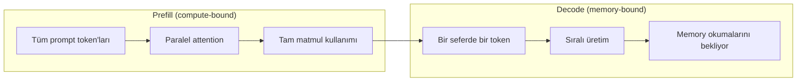

# Inference Optimization

> İki faz LLM çıkarımını tanımlar. Prefill prompt'unu paralel işler — compute-bound. Decode her seferinde bir token üretir — memory-bound. Her optimizasyon bir veya her ikisini hedefler.

**Tür:** Yapım
**Diller:** Python
**Ön koşullar:** Faz 10, Ders 01-08 (Transformer mimarisi, attention)
**Süre:** ~120 dakika

## Öğrenme Hedefleri

- Autoregressive token generation sırasında gereksiz hesaplamayı ortadan kaldırmak için KV-cache implement et
- LLM çıkarımının prefill vs decode fazlarını ve her birinin neden farklı darboğazları olduğunu (compute-bound vs memory-bound) açıkla
- Eşzamanlı istekler altında GPU kullanımını maksimize etmek için continuous batching ve PagedAttention kavramlarını implement et
- Çıkarım optimizasyon tekniklerini (KV-cache, speculative decoding, flash attention) ve throughput/latency tradeoff'larını karşılaştır

## Sorun

4xA100 GPU'da Llama 3 70B deploy ediyorsun. Tek kullanıcı saniyede ~50 token alıyor. Hızlı hissettiriyor. Sonra 100 kullanıcı endpoint'e eşzamanlı vuruyor. Throughput 3 token/saniye/kullanıcı'ya düşüyor. Aylık 25.000$'lık GPU faturanı insan yazma hızından yavaş yanıtlar servis ediyor.

Modelin kendisi 1 kullanıcı ile 100 kullanıcı arasında değişmiyor. Aynı ağırlıklar, aynı mimari, aynı matematik. Değişen şey işi nasıl scheduling yaptığın. Naif çıkarım mevcut GPU compute'unun %90+'ını boşa harcar. Token 47'yi bekleyen bir kullanıcı, GPU memory bus'ı matmul'lar arasında boş otururken tüm batch slot'unu açık tutar. Bu arada, yeni bir kullanıcının 2.000-token'lık prompt'u o ölü zamanı faydalı compute ile doldurabilir.

Bu bir scaling problemi değil. Bir scheduling problemi. Bu derste yer alan teknikler — KV caching, continuous batching, PagedAttention, speculative decoding, prefix caching — aylık 25k$ inference faturası ile aynı trafiği servis eden 5k$ olanı arasındaki farktır.

4xA100-80GB üzerinde Llama 3 70B'yi servis eden vLLM düşük concurrency'de ~50 token/saniye/kullanıcı elde eder ve continuous batching ile PagedAttention sayesinde 100 eşzamanlı istek altında 15-25 TPS/kullanıcı'yı sürdürür. Bu optimizasyonlar olmadan, aynı donanım o concurrency'de 5 TPS/kullanıcı servis eder. Aynı GPU'lar, aynı model, 4x throughput.

## Kavram

### Prefill vs Decode

Her LLM çıkarım isteğinin iki farklı fazı vardır.

**Prefill** tüm input prompt'unu işler. Tüm token'lar bilinir, dolayısıyla attention tam sequence boyunca paralel hesaplanabilir. Bu büyük bir matrix multiplication — GPU core'ları meşgul kalır. Darboğaz compute'tur: donanımın saniyede kaç FLOPS sağlayabildiği. A100 312 TFLOPS yapar (BF16). 70B modelde 4.096-token'lık bir prompt için prefill tek A100'de ~400ms sürer.

**Decode** output token'larını her seferinde bir üretir. Her yeni token tüm önceki token'lara attention yapar, ama forward pass başına sadece bir token üretilir. Weight matrisleri prefill sırasındakiyle aynı boyuttadır, ama onları matris yerine tek bir vektör ile çarpıyorsun. GPU core'ları mikrosaniyelerde bitirir, sonra memory'den bir sonraki batch ağırlık gelmesini bekler. Darboğaz memory bandwidth'dir: model ağırlıklarını HBM'den compute birimlerine ne kadar hızlı stream edebileceğin. A100'ün 2 TB/s bandwidth'i var. FP16'da 70B model 140 GB. Tam modeli bir kere okumak 70ms sürer — bu tek bir decode adımı için tabandır.



**ops:byte oranı** (arithmetic intensity de denir) bu tradeoff'u yakalar. Memory'den yüklenen byte başına kaç operasyon yaptığını ölçer.

```
ops:byte oranı = Token başına FLOP / memory'den okunan byte
```

4.096 token'lık batch ile prefill sırasında, yüklenen ağırlık başına ~4.096 multiply-accumulate operasyonu yaparsın. Oran yüksek — compute-bound'sun. Batch size 1 ile decode sırasında, yüklenen ağırlık başına ~1 operasyon yaparsın. Oran düşük — memory-bound'sun.

Temel içgörü: *decode memory-bound'dur çünkü tek bir token üretmek için tüm modeli okursun*. Aşağıdaki her optimizasyon ya ne okuduğunu azaltır, ya okuma başına işlenen token batch'ini artırır ya da okumayı tamamen önler.

### KV Cache

Attention sırasında, her token'ın query'si her önceki token'ın key ve value vektörlerine attention yapar. Caching olmadan, N token'ı üretmek önceki tüm N-1 token için key ve value projeksiyonlarını yeniden hesaplamayı gerektirir. Token 1, token 2 üretilirken projekte edilir, sonra token 3 için tekrar, sonra token 4 için tekrar. Token 1.000'e gelindiğinde, token 1'i toplam 999 kez projekte etmişsindir.

KV cache tüm önceki token'lardan key ve value projeksiyonlarını saklar. N token'ı üretirken, sadece N için key ve value hesaplarsın, sonra onları 1'den N-1'e kadar olan token'lardan cache'lenmiş K/V ile concat edersin.

**KV cache için memory formülü:**

```
KV cache boyutu = 2 * num_layers * num_kv_heads * head_dim * seq_len * bytes_per_param
```

Llama 3 70B için (80 katman, GQA ile 8 KV head, head_dim=128, BF16):

```
token başına: 2 * 80 * 8 * 128 * 2 byte = 327.680 byte = 320 KB
4.096 token'da: 320 KB * 4.096 = 1.28 GB
128K token'da: 320 KB * 131.072 = 40 GB
```

Llama 3 70B için tek bir 128K-context konuşma 40 GB KV cache tüketir — bir A100'ün belleğinin yarısı. 4K token'da 100 eşzamanlı kullanıcı ile, sadece KV cache 128 GB ister. Bu yüzden KV cache yönetimi çıkarım optimizasyonunun merkezi sorunudur.

### Continuous Batching

Static batching N istek batch'i gelene kadar bekler, onları birlikte işler ve yeni istekleri kabul etmeden önce *hepsinin* bitmesini bekler. Bir istek 500 token, başka bir istek 10 token istiyorsa, kısa istek bittikten sonra 490 decode adımı boyunca boş oturur.

Continuous batching (iteration-level batching da denir), herhangi bir istek tamamlandığında yeni istekleri batch'e ekler. Batch her decode adımında yeniden değerlendirilir. 10 token sonra biten bir istek anında bekleyen bir istekle değiştirilir.

Throughput iyileştirmesi output uzunluklarının ne kadar değiştiğine bağlıdır. Uniform uzunluklarla, continuous batching static batching ile eşleşir. Değişken uzunluklarla (yaygın durum), continuous batching 2-5x daha yüksek throughput sağlayabilir çünkü GPU slot'ları asla boş kalmaz.

### PagedAttention

Her isteğin KV cache'i bitişik bir memory bloğudur. İstekler geldikçe ve gittikçe, memory parçalanır — tıpkı işletim sistemlerindeki RAM parçalanması gibi. 4K-token'lık bir istek 1.28 GB bitişik gerektirir. Toplamda 2 GB boş alanın olsa bile, 1.28 GB *bitişik* alanın olmayabilir. Ya memory israf edersin ya da isteği reddedersin.

PagedAttention (vLLM'den) OS-tarzı virtual memory'i KV cache'e uygular. İstek başına bir bitişik blok atamak yerine, sabit boyutlu "page'ler" atar (tipik olarak her biri 16 token). Page'ler fiziksel GPU memory'sinin herhangi bir yerinde olabilir. Bir page table her isteğin mantıksal sequence pozisyonlarını fiziksel page konumlarına eşler.

PagedAttention ayrıca paylaşılan prefix'ler için **copy-on-write** sağlar. 50 istek aynı system prompt'u paylaşıyorsa, o system prompt için KV cache page'leri bir kez saklanır ve tüm 50 istek tarafından referans alınır. Sadece bir istek diverge ettiğinde (farklı kullanıcı mesajları) kendi page'lerini alır. Bu, paylaşılan system prompt'lu uygulamalar için memory kullanımını dramatik şekilde azaltır.

vLLM PagedAttention sayesinde sıfıra yakın memory israfı raporlar (naif allocation'da ~%60-80'e karşı ~%4).

### Speculative Decoding

Decode yavaş çünkü sıralı — bir token üretirsin, geri besletir, bir sonrakini üretirsin. Ama ya bir sonraki 5 token'ı ucuza tahmin edip hepsini bir kerede doğrulayabilseydin?

Speculative decoding K aday token üretmek için küçük, hızlı bir **draft model** kullanır. Büyük **target model** sonra tüm K aday'ı tek bir forward pass'ta işler (bu prefill gibi görünür — paralel, compute-bound, verimli). Target model draft model'in tahminleriyle anlaşırsa, bir target forward pass zamanında tüm K token'ı kabul edersin. j pozisyonunda anlaşmazsa, 1'den j-1'e kadar olan token'ları kabul edersin ve geri kalanını atarsın.

Hızlanma **acceptance rate**'e bağlıdır — draft model'in tahminlerinin target ile ne sıklıkla eşleştiği. Llama 3 70B için draft eden bir Llama 3 8B için, doğal dilde %70-85 acceptance rate'leri tipiktir. Bu 2-3x decode hızlanmasına çevrilir.

Speculative decoding'in üç yaklaşımı:

| Yöntem | Draft kaynağı | Acceptance rate | Overhead |
|--------|-------------|-----------------|----------|
| Draft-target (Leviathan et al.) | Ayrı küçük model | %70-85 | Draft model memory'si |
| EAGLE (Li et al.) | Target üzerinde hafif head | %75-90 | ~%1 ekstra parametre |
| N-gram lookup | Token n-gram tablosu | %40-60 | İhmal edilebilir |

**EAGLE** target model'in hidden state'leri üzerine küçük bir autoregressive head eğitir. Target model'in son-bir-önceki katman feature'larını kullanarak bir sonraki token'ın embedding'ini tahmin eder. Target model'in kendi temsilleri üzerinde çalıştığı için (ayrı bir modelin değil), minimal ekstra memory ile daha yüksek acceptance rate'leri elde eder. EAGLE-2 context'e dayalı aday sayısını ayarlayan dinamik bir draft tree ekler.

**N-gram speculative decoding** mevcut context'ten veya önceden inşa edilmiş bir corpus'tan n-gram devamlarının bir tablosunu sürdürür. Draft aynı konuşmada daha önce görüneni (tekrar eden desenler, kod, structured output) eşlerse, sıfır neural network overhead ile ateş eder. Acceptance rate'leri ortalama olarak daha düşüktür ama spekülasyon başına maliyet aslında ücretsizdir.

Speculative decoding *matematiksel olarak tam*tır — output dağılımı target modelin dağılımıyla özdeştir. Bir yaklaşım değildir. Doğrulama adımı her kabul edilen token'ın target modelin atayacağı tam olasılığa sahip olmasını sağlar.

### Prefix Caching

Pek çok istek aynı prefix'i paylaşır. Bir chatbot system prompt'u. Bir RAG context bloğu. Bir few-shot örnek seti. Prefix caching olmadan, her istek bu paylaşılan token'lar için KV cache'i sıfırdan yeniden hesaplar.

Prefix caching yaygın prefix'ler için KV cache'i saklar ve istekler arasında yeniden kullanır. Bilinen bir prefix ile yeni bir istek geldiğinde, sistem cache'lenmiş KV girişlerini kopyalar (veya referans alır) ve sadece benzersiz suffix için KV hesaplar.

Tüm istekler arasında paylaşılan 2.000-token'lık bir system prompt için, prefix caching istek başına ~400ms prefill'i ortadan kaldırır. Saniyede 100 istekte, bu saniyede 40 saniyelik GPU compute tasarrufu sağlar — bir GPU'nun değerinden fazla iş.

SGLang'in RadixAttention'ı prefix'leri token içeriklerine göre indeksleyen bir radix tree (trie) ile prefix caching implement eder. Saklanan bir prefix ile eşleşen herhangi bir istek KV cache'ini ücretsiz alır. Tree kısmi prefix eşleşmelerini mümkün kılar — cache'lenmiş bir girişle 2.000 prefix token'ından 1.500'ünü paylaşıyorsan, o 1.500'ü yeniden kullanır ve sadece 500'ü yeniden hesaplarsın.

### Çıkarım Motorları

Production LLM serving'de üç motor baskındır:

| Motor | Anahtar inovasyon | İçin en iyi |
|--------|---------------|----------|
| vLLM | PagedAttention, continuous batching | Genel amaçlı serving, en yüksek uyumluluk |
| SGLang | RadixAttention (prefix caching), structured generation | Multi-turn chatbot'lar, constrained decoding |
| TensorRT-LLM | NVIDIA kernel fusion, FP8 quantization | NVIDIA donanımında maksimum tek-GPU throughput |

**vLLM** varsayılan başlangıç noktasıdır. En geniş model yelpazesini destekler, herhangi bir GPU sağlayıcısında çalışır (NVIDIA, AMD, Intel) ve PagedAttention + continuous batching ile güçlü throughput elde eder. OpenAI-uyumlu API herhangi bir OpenAI API çağrısı için yerine drop-in olarak kullanabileceğin anlamına gelir.

**SGLang** vLLM ile aynı temeller üzerine inşa edilir ama prefix caching için RadixAttention ve structured LLM programlar için domain-spesifik bir dil ekler. İş yükün multi-turn konuşmalar, tool kullanımı veya constrained decoding (JSON output, regex-guided generation) içeriyorsa, SGLang prefix yeniden kullanımı yoluyla vLLM'i çoğu zaman 2-5x geçer.

**TensorRT-LLM** modelleri optimize edilmiş NVIDIA GPU kernel'larına derler. Operasyonları fuse eder (attention + linear + activation tek kernel'da), H100 GPU'larda FP8 kullanır ve production deployment için NVIDIA Triton Inference Server ile entegre eder. NVIDIA donanımında en yüksek tek-GPU throughput elde eder ama daha fazla setup gerektirir ve sadece NVIDIA GPU'larda çalışır.

### Ops:Byte Framework

Ölçmediğin şeyi optimize edemezsin. Ops:byte oranı sana compute-bound mu memory-bound mu olduğunu söyler, bu hangi optimizasyonların önemli olduğunu belirler.

```
Compute tavanı: GPU'nun tepe FLOPS'ı
Memory tavanı:  tepe bandwidth * ops:byte oranı
```

Ops:byte düşük olduğunda (decode, küçük batch'ler), memory bandwidth tavanına vurursun. Daha fazla compute eklemek (daha yüksek clock, daha fazla core) yardımcı olmaz. Memory okumalarını azaltmaya (quantization, KV cache sıkıştırması) veya okuma başına daha fazla faydalı iş için batch size'ı artırmaya ihtiyacın var.

Ops:byte yüksek olduğunda (prefill, büyük batch'ler), compute tavanına vurursun. Memory bandwidth optimizasyonu yardımcı olmaz. Daha hızlı GPU'lara, kernel fusion'a veya daha fazla FLOPS sıkmak için azaltılmış precision'a ihtiyacın var.

A100'de geçiş noktası ops:byte = 156 civarındadır (312 TFLOPS / 2 TB/s). 156'nın altında, memory-bound'sun. 156'nın üstünde, compute-bound'sun. Continuous batching iterasyon başına daha fazla token paketleyerek decode'u bu geçiş noktasına iter.

## İnşa Et

### Adım 1: Sıfırdan KV Cache

Katman başına, head başına key ve value projeksiyonlarını saklayan ve memory büyüme desenini gösteren multi-head bir KV cache inşa ediyoruz.

```python
import numpy as np

class KVCache:
    def __init__(self, num_layers, num_heads, head_dim, max_seq_len, dtype=np.float16):
        self.num_layers = num_layers
        self.num_heads = num_heads
        self.head_dim = head_dim
        self.max_seq_len = max_seq_len
        self.dtype = dtype

        self.k_cache = np.zeros(
            (num_layers, num_heads, max_seq_len, head_dim), dtype=dtype
        )
        self.v_cache = np.zeros(
            (num_layers, num_heads, max_seq_len, head_dim), dtype=dtype
        )
        self.seq_len = 0

    def update(self, layer_idx, new_keys, new_values):
        num_new = new_keys.shape[1]
        end = self.seq_len + num_new
        self.k_cache[layer_idx, :, self.seq_len:end, :] = new_keys
        self.v_cache[layer_idx, :, self.seq_len:end, :] = new_values
        return (
            self.k_cache[layer_idx, :, :end, :],
            self.v_cache[layer_idx, :, :end, :]
        )

    def advance(self, num_tokens):
        self.seq_len += num_tokens

    def memory_bytes(self):
        return self.k_cache.nbytes + self.v_cache.nbytes

    def used_bytes(self):
        per_token = 2 * self.num_layers * self.num_heads * self.head_dim * np.dtype(self.dtype).itemsize
        return per_token * self.seq_len
```

### Adım 2: KV Cache ile Attention

Decode adımları için KV cache kullanan basitleştirilmiş multi-head attention.

```python
def scaled_dot_product_attention(query, keys, values):
    head_dim = query.shape[-1]
    scores = np.matmul(query, keys.transpose(0, 1, 3, 2)) / np.sqrt(head_dim)
    seq_len_q = scores.shape[-2]
    seq_len_k = scores.shape[-1]
    if seq_len_q > 1:
        mask = np.triu(np.ones((seq_len_q, seq_len_k), dtype=np.float32), k=seq_len_k - seq_len_q + 1)
        scores = scores + mask * (-1e9)
    max_scores = np.max(scores, axis=-1, keepdims=True)
    exp_scores = np.exp(scores - max_scores)
    attn_weights = exp_scores / np.sum(exp_scores, axis=-1, keepdims=True)
    return np.matmul(attn_weights, values)
```

### Adım 3: Continuous Batching Simülatörü

Bu, static ve continuous batching arasındaki scheduling farkını simüle eder.

```python
class Request:
    def __init__(self, request_id, prompt_tokens, output_tokens, arrival_step):
        self.request_id = request_id
        self.prompt_tokens = prompt_tokens
        self.output_tokens = output_tokens
        self.arrival_step = arrival_step
        self.tokens_generated = 0
        self.start_step = None
        self.end_step = None

    def is_done(self):
        return self.tokens_generated >= self.output_tokens


def simulate_continuous_batching(requests, batch_size):
    step = 0
    completed = []
    queue = sorted(requests, key=lambda r: r.arrival_step)
    queue_idx = 0
    active = []
    waiting = []

    while queue_idx < len(queue) or active or waiting:
        while queue_idx < len(queue) and queue[queue_idx].arrival_step <= step:
            waiting.append(queue[queue_idx])
            queue_idx += 1

        while waiting and len(active) < batch_size:
            r = waiting.pop(0)
            r.start_step = step
            active.append(r)

        if not active:
            if waiting:
                step += 1
                continue
            elif queue_idx < len(queue):
                step = queue[queue_idx].arrival_step
                continue
            else:
                break

        for r in active:
            r.tokens_generated += 1

        done = [r for r in active if r.is_done()]
        for r in done:
            r.end_step = step + 1
            completed.append(r)
        active = [r for r in active if not r.is_done()]

        step += 1

    return completed
```

### Adım 4: Prefix Cache

Paylaşılan prefix'ler için KV girişleri saklayan trie-tabanlı bir prefix cache.

```python
class TrieNode:
    def __init__(self):
        self.children = {}
        self.kv_data = None
        self.hit_count = 0


class PrefixCache:
    def __init__(self, max_entries=1000):
        self.root = TrieNode()
        self.max_entries = max_entries
        self.total_entries = 0
        self.hits = 0
        self.misses = 0

    def _walk(self, token_ids):
        node = self.root
        depth = 0
        for tid in token_ids:
            if tid not in node.children:
                break
            node = node.children[tid]
            depth += 1
        return node, depth

    def lookup(self, token_ids):
        node, depth = self._walk(token_ids)
        if depth > 0:
            self.hits += 1
            return depth, []
        self.misses += 1
        return 0, []

    def hit_rate(self):
        total = self.hits + self.misses
        return self.hits / total if total > 0 else 0.0
```

### Adım 5: Speculative Decoding Simülatörü

Yapılandırılabilir acceptance rate'lerle draft-target speculative decoding'i simüle ediyoruz.

```python
class DraftModel:
    def __init__(self, vocab_size, acceptance_rate=0.8):
        self.vocab_size = vocab_size
        self.acceptance_rate = acceptance_rate

    def generate(self, context, num_tokens):
        tokens = np.random.randint(0, self.vocab_size, size=num_tokens)
        return tokens


class TargetModel:
    def __init__(self, vocab_size):
        self.vocab_size = vocab_size


def speculative_decode(draft_model, target_model, context, num_speculative=5,
                       draft_cost=1.0, target_cost=10.0, verify_cost=12.0):
    total_tokens = 0
    total_cost = 0.0
    accepted_counts = []
    context = list(context)

    max_tokens = 100

    while total_tokens < max_tokens:
        draft_tokens = draft_model.generate(context, num_speculative)
        total_cost += draft_cost * num_speculative
        total_cost += verify_cost

        accepted = 0
        for i in range(num_speculative):
            if np.random.random() < draft_model.acceptance_rate:
                accepted += 1
                total_tokens += 1
            else:
                total_tokens += 1
                break

        accepted_counts.append(accepted)

    sequential_cost = total_tokens * target_cost
    return {
        "total_tokens": total_tokens,
        "speculative_cost": total_cost,
        "sequential_cost": sequential_cost,
        "speedup": sequential_cost / total_cost if total_cost > 0 else 1.0,
        "avg_accepted": np.mean(accepted_counts),
        "acceptance_rate": np.mean(accepted_counts) / num_speculative,
    }
```

### Adım 6: KV Cache Memory Profiler

Gerçek model konfigürasyonları için KV cache memory gereksinimlerini hesapla.

```python
MODEL_CONFIGS = {
    "Llama-3-8B": {
        "num_layers": 32, "num_kv_heads": 8, "head_dim": 128,
        "model_params_b": 8, "gqa": True,
    },
    "Llama-3-70B": {
        "num_layers": 80, "num_kv_heads": 8, "head_dim": 128,
        "model_params_b": 70, "gqa": True,
    },
    "Llama-3-405B": {
        "num_layers": 126, "num_kv_heads": 8, "head_dim": 128,
        "model_params_b": 405, "gqa": True,
    },
}


def kv_cache_memory(config, seq_len, dtype_bytes=2):
    per_token = 2 * config["num_layers"] * config["num_kv_heads"] * config["head_dim"] * dtype_bytes
    total = per_token * seq_len
    return {
        "per_token_bytes": per_token,
        "per_token_kb": per_token / 1024,
        "total_bytes": total,
        "total_mb": total / (1024 ** 2),
        "total_gb": total / (1024 ** 3),
    }


def memory_budget(config, gpu_memory_gb, model_dtype_bytes=2, kv_dtype_bytes=2):
    model_memory_gb = config["model_params_b"] * 1e9 * model_dtype_bytes / (1024 ** 3)
    overhead_gb = gpu_memory_gb * 0.1
    available_for_kv = gpu_memory_gb - model_memory_gb - overhead_gb

    if available_for_kv <= 0:
        return {"error": "Model GPU memory'sine sığmıyor", "model_memory_gb": model_memory_gb}

    per_token = 2 * config["num_layers"] * config["num_kv_heads"] * config["head_dim"] * kv_dtype_bytes
    max_tokens = int(available_for_kv * (1024 ** 3) / per_token)

    return {
        "gpu_memory_gb": gpu_memory_gb,
        "model_memory_gb": round(model_memory_gb, 1),
        "overhead_gb": round(overhead_gb, 1),
        "available_for_kv_gb": round(available_for_kv, 1),
        "max_total_tokens": max_tokens,
        "max_users_at_2k": max_tokens // 2048,
        "max_users_at_4k": max_tokens // 4096,
        "max_users_at_32k": max_tokens // 32768,
    }
```

## Kullan

vLLM ile:

```python
from vllm import LLM, SamplingParams

llm = LLM(
    model="meta-llama/Llama-3-70B-Instruct",
    tensor_parallel_size=4,
    enable_prefix_caching=True,
    max_model_len=8192,
    gpu_memory_utilization=0.9,
)

params = SamplingParams(temperature=0.7, max_tokens=256)
outputs = llm.generate(["Explain inference optimization in one paragraph."], params)
```

Prefix caching + structured output için SGLang ile:

```python
import sglang as sgl

@sgl.function
def classify(s, text):
    s += sgl.system("You are a classifier. Output JSON only.")
    s += sgl.user(f"Classify this text: {text}")
    s += sgl.assistant(sgl.gen("result", regex=r'\{"label": "(positive|negative|neutral)"\}'))

runtime = sgl.Runtime(model_path="meta-llama/Llama-3-70B-Instruct", tp_size=4)
sgl.set_default_backend(runtime)
```

TensorRT-LLM ile:

```python
import tensorrt_llm
from tensorrt_llm.runtime import ModelRunner

runner = ModelRunner.from_dir("./llama-70b-trt-engine/", rank=0)

outputs = runner.generate(
    batch_input_ids=[tokenizer.encode("Explain KV caching.")],
    max_new_tokens=256,
    temperature=0.7,
)
```

## Yayınla

Bu ders şunları üretir:
- `outputs/skill-inference-optimization.md` -- LLM çıkarım serving'ini teşhis etmek ve optimize etmek için bir skill

## Alıştırmalar

1. KV cache profiler'ı FP16 vs FP8 vs INT4 KV cache quantization'ı karşılaştıracak şekilde değiştir. 4K context'te Llama 3 70B için, 4xA100-80GB'da her biri için maksimum eşzamanlı kullanıcıyı hesapla. INT4'e KV quantization kullanıcı kapasitesini kabaca 4x artırmalı.

2. Continuous batching simülatörünü GPU kullanımını (adım başına doldurulan batch slot oranı) izleyecek şekilde genişlet. Output uzunlukları Pareto dağılımını (shape=1.5, scale=20) takip eden 50 istek ile hem static hem continuous batching için kullanımı zamanla çiz. Continuous batching %80'in üzerinde kullanımı korumalı.

3. `num_kv_heads < num_query_heads` olan KV cache'in grouped-query attention (GQA) versiyonunu implement et. Llama 3 70B 64 query head kullanır ama sadece 8 KV head. Tam multi-head attention'a karşı memory tasarrufunu hesapla (KV cache boyutunda 8x azalma).

4. LRU eviction kullanan bir prefix cache inşa et. max_entries'i 500'e ayarla ve %60'ı 5 yaygın prefix'ten birini paylaşan 1.000 istek üret. Hit rate'i ölç ve sınırsız cache ile karşılaştır. İyi eviction ile, hit rate %55'in üzerinde kalmalı.

5. Speculative decoding simülatörünü tree-tabanlı spekülasyon (EAGLE-2 tarzı) implement etmek için genişlet. K draft token'ın tek bir zinciri yerine, bir aday tree'si üret (örn. 3 seviyenin her birinde 2 dal = 8 yaprak aday). Doğrulama turu başına kabul edilen toplam token'ı lineer spekülasyona karşı karşılaştır.

## Anahtar Terimler

| Terim | İnsanlar ne diyor | Gerçekte ne anlama geliyor |
|------|----------------|----------------------|
| Prefill | "Prompt'u işleme" | Tüm input token'ları üzerinde attention'ı paralel hesaplamak — compute-bound çünkü tam matrix multiplication GPU core'larını meşgul tutar |
| Decode | "Token üretme" | Forward pass başına bir token üretmek, her seferinde tam model ağırlıklarını okumak — memory-bound çünkü compute bir sonraki ağırlıklar gelmeden biter |
| KV cache | "Attention state'lerini cache'leme" | Tüm önceki token'lar için key ve value projeksiyonlarını saklamak böylece her decode adımında yeniden hesaplanmaz — memory'i compute için takas eder |
| Continuous batching | "Dinamik batching" | Herhangi bir istek bitince yeni istekleri çalışan batch'e ekleme, tüm batch'i beklemek yerine her decode iterasyonunda değerlendirilen |
| PagedAttention | "KV cache için virtual memory" | KV cache'i bitişik bloklar yerine sabit boyutlu page'lerde tahsis etmek, memory fragmentation'ı ortadan kaldırır ve paylaşılan prefix'ler için copy-on-write'ı sağlar |
| Speculative decoding | "Draft ve doğrula" | Birden fazla token önermek için hızlı bir draft model kullanmak, sonra hepsini tek bir target model forward pass'ta doğrulamak — matematiksel olarak tam, 2-3x hızlanma |
| EAGLE | "Self-speculative decoding" | Ayrı bir draft modelden daha yüksek acceptance rate elde eden, target model'in kendi hidden state'leri üzerinde hafif bir head eğiten speculative decoding varyantı |
| Prefix caching | "System prompt KV'sini yeniden kullanma" | Yaygın prefix'ler (system prompt'lar, few-shot örnekler) için hesaplanmış KV cache girişlerini saklamak ve gereksiz prefill'i atlamak için istekler arasında yeniden kullanmak |
| Ops:byte ratio | "Arithmetic intensity" | Compute operasyonlarının memory byte okumalarına oranı — bir iş yükünün compute-bound (yüksek oran) mı memory-bound (düşük oran) mı olduğunu belirler |
| Time to first token | "TTFT" | Bir isteğin alınmasından ilk output token'ı üretmeye kadar geçen latency — uzun prompt'lar için prefill zamanı tarafından baskındır |

## İleri Okuma

- Kwon et al., "Efficient Memory Management for Large Language Model Serving with PagedAttention" (2023) -- paged KV cache yönetimini tanıtan vLLM makalesi, şimdi inference serving için endüstri standardı
- Leviathan et al., "Fast Inference from Transformers via Speculative Decoding" (2023) -- draft-verify spekülasyonun tam target model dağılımları ürettiğini kanıtlayan temel makale, 2-3x hızlanma elde ederken
- Li et al., "EAGLE: Speculative Sampling Requires Rethinking Feature Uncertainty" (2024) -- ayrı bir draft model kullanmak yerine target model'in kendi feature'ları üzerinde bir head eğiterek daha yüksek acceptance rate'leri elde eder
- Zheng et al., "SGLang: Efficient Execution of Structured Language Model Programs" (2024) -- prefix caching için RadixAttention ve multi-call LLM programlar için bir programlama modeli tanıtır
- Williams et al., "Roofline: An Insightful Visual Performance Model for Multicore Architectures" (2009) -- compute vs memory darboğazlarını akıl yürütmek için ops:byte framework'ünü formalize eden orijinal roofline makalesi
