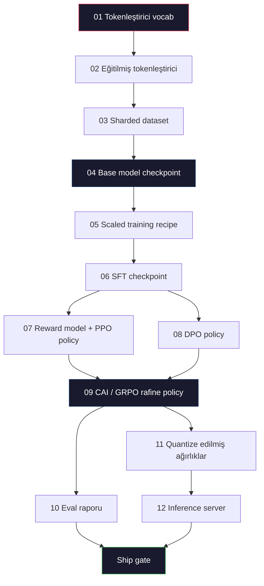

# Eksiksiz LLM Pipeline'ı İnşa Etme

> Ders 01'den 12'ye kadar her şey tek bir pipeline'ın tek bir aşamasıdır. Bu ders, o aşamaları uçtan uca tek bir koşuya dönüştüren iskelettir: tokenleştir, pretrain et, ölçekle, SFT, hizala, değerlendir, quantize et, servis et. Bir laptop'ta 70B model eğitmeyeceksin. Bir 2026 frontier ekibinin neyin yayınlanacağına karar vermek için kullandığı orchestration katmanını, manifest'i, eval gate'i ve rollback planını üreteceksin. Bu bitirme dersidir.

**Tür:** Yapım
**Diller:** Python (stdlib)
**Ön koşullar:** Tüm Faz 10 dersleri 01-12
**Süre:** ~120 dakika

## Öğrenme Hedefleri

- Önceki on bir dersi (tokenleştirici, veri, pretraining, scaling, SFT, RLHF, DPO, CAI, eval, quantization, inference) tek bir tekrarlanabilir pipeline spec'inde birleştir
- Aşamalar arasındaki artifact sözleşmesini tanımla: her aşama ne tüketir, ne üretir ve bir sonraki aşama input'u nasıl doğrular
- Deneyleri izleyen, artifact'leri hash'leyen ve ship kararlarını eval eşiklerinde gate eden bir orchestrator inşa et
- Rollback planını tasarla: hangi artifact'leri yeniden çalıştırmak ucuz, hangileri pahalı ve bozuk bir checkpoint'in maliyeti nedir

## Sorun

Önceki dersler her biri çalışır. Tokenleştirici eğitildi. Minik GPT pretrain edildi. SFT dataset'i hazırlandı. Reward model eğitildi. DPO çalıştı. Eval'lar ölçüldü. Quantize edilmiş ağırlıklar export edildi. Inference server kuruldu. Her biri bir notebook. Her birinin kendi konvansiyonları, kendi output yolları, kendi seed'i var.

Bir frontier eğitim koşusu notebook değildir. Llama 3 405B kabaca 54 gün boyunca 30 milyon H100 saati aldı. DeepSeek-V3 yaklaşık 2.8 milyon H800 saati kullandı. O süre boyunca, bir bozuk checkpoint, bir veri kontaminasyonu, bir eval regresyonu bir ekibe wall-clock'ta bir hafta ve GPU bütçesinde bir ay maliyetli olabilir. Ekiplerin bunu atlatma şekli pipeline hijyenidir: her aşamanın deterministik bir input'u, deterministik bir output'u, bir manifest'i, bir hash'i ve bir gate'i var.

Bu bitirme dersi. Pipeline'ı laptop'ta uçtan uca çalıştırmayacaksın. Aşamaları koordine eden orchestrator'ı, koşuyu açıklayan manifest'i, ship kararlarını gate eden verifier'ı ve üçüncü bir tarafın çalışmanı tek bir dosyadan yeniden çalıştırmasına izin veren replay planını yazacaksın. Kod küçük; disiplin büyük.

Desen 100M'den 1T parametreye değişmeden ölçeklenir. Aynı dört bileşen — manifest, orchestrator, eval gate, artifact store — Llama 3'ü çalıştırır ve aynı zamanda senin hobi GPT'ini de çalıştırır. Fark her aşamanın config'i içindeki sayıların boyutudur, pipeline'ın şeklinde değil.

## Kavram

### On İki Aşama

Her Faz 10 dersi bir aşamadır. İşte tam bağımlılık graph'ı.



Aşama 07 ve 08 paralel çalışabilir. Diğer her şey sert bir bağımlılıktır. Aşama 02'deki bir değişiklik (tokenleştirici) tüm downstream artifact'leri geçersiz kılar. Aşama 10'daki (eval) bir değişiklik sadece ship kararını geçersiz kılar.

### Manifest

Manifest, bir koşuyu replay etmeye yetecek kadar tam olarak tanımlayan tek bir dosyadır. Pipeline'ın ürettiği hiçbir şey manifest'te olmayan state'e bağlı olmamalıdır. Alanlar sıkıcı ve zorunludur.

```
pipeline_version: 1.2.3
seed: 42
git_commit: a1b2c3d4
stages:
  01_tokenizer:
    recipe: bpe_32k
    input_hash: sha256:...
    output_hash: sha256:...
    wall_clock_sec: 3600
    cost_usd: 12
```

Aşama N'in output hash'i aşama N+1'in input hash'idir. Herhangi bir sapma ve pipeline durur. Veri bozulmasını erken yakalama yolu budur. Aynı zamanda farklı bir kıtadaki bir takım arkadaşının replay'inin sizinkiyle aynı artifact ürettiğini doğrulama yoludur.

Pratikte ekipler bir manifest checker artı önceki başarılı koşuya karşı diff yapan küçük bir YAML schema kullanır. Beklenen alanların dışındaki (maliyet, wall clock) herhangi bir delta bir red flag'dir.

### Artifact Typing

Her aşamanın output'u tipli bir artifact'tir. Bir directory blob'u değil, bir pickle değil, ama bilinen schema'lı adlandırılmış bir tip.

| Aşama | Artifact Tipi | Anahtar Alanlar |
|-------|--------------|-----------|
| 01-02 | Tokenizer | vocab.json, merges.txt, config.json, hash |
| 03 | Dataset | shards[], row count, token count, dedup stats |
| 04-05 | Checkpoint | weights.safetensors, config.json, optimizer state, step count |
| 06 | SFT Model | checkpoint + SFT recipe + data mix |
| 07 | Reward Model | RM checkpoint + tercih veri hash'i |
| 08-09 | Policy | checkpoint + reference hash + beta + tüketilen KL bütçesi |
| 10 | Eval Report | benchmark skorları + regresyon diff'leri + eval veri hash'i |
| 11 | Quantized Model | quantize edilmiş ağırlıklar + kalibrasyon verisi + FP16'ya karşı accuracy delta'sı |
| 12 | Server Spec | endpoint + model hash + config + observability hook'ları |

Typing en yaygın başarısızlık modunu önler: aşama 08 output'unu aşama 06 input'u olarak kullanmak, DPO-eğitilmiş bir modeli SFT yolu üzerinden yayınlamak. Tipli artifact'ler ve tipli aşama imzaları bu hataları compile-time başarısızlıklar yapar, beşinci-gün başarısızlıkları değil.

### Eval Gate

Yayınlama "eğitim bitti" değildir. Yayınlama "eğitim bitti ve eval gate geçti" demektir. Gate koşu başlamadan önce tanımlanır.

```
gates:
  mmlu:      >= baseline + 0.5   # regresyon yok
  humaneval: >= baseline + 1.0
  truthfulqa: >= baseline         # düşüş yok
  safety_refusal_rate: <= 0.05
  kl_from_reference: <= 25.0
  cost_total_usd: <= 50000
```

Her gate bir sayısal eşiktir. "İyi görünüyor" gate yok. Subjektif onaylar yok. Her gate geçerse, artifact shippable olarak işaretlenir. Herhangi bir gate başarısız olursa, koşu adlandırılmış bir reviewer'ın açık override'ı bekleyene kadar tutulur, ki bu da manifest'te loglanır.

İki gate çoğu felaketi yakalar. Bir *regresyon* gate'i (yeni model çekirdek benchmark'larda öncekiler kadar iyi olmalı) eğitim bug'larını yakalar. Bir *KL bütçesi* gate'i (hizalanmış policy reference'tan X'ten fazla diverge etmiş olmamalı) alignment fazla pişirmeyi yakalar. Her production pipeline'da ikisi de vardır.

### Orchestrator

Manifest'i okuyan, aşamaları gönderen, artifact'leri izleyen ve herhangi bir sözleşme ihlalinde duran küçük bir kod parçası. Bu Airflow değil. Bu Kubeflow değil. Pipeline hijyeni için yazdığın sıkıcı bir şey istiyorsun.

Orchestrator'ın işi dar:

1. DAG'ı manifest'ten çözümle.
2. Her aşama için, beklenen output'un doğru hash'te zaten var olup olmadığını kontrol et (varsa atla).
3. Aşamayı çalıştır, stdout/stderr'ı yakala, wall clock ve maliyeti ölç.
4. Output hash'ini downstream aşamanın beklenen input hash'ine karşı doğrula.
5. Başarısızlıkta, tam başarısız aşamayla kısmi bir manifest yaz ve nonzero çık.

Bu 200 satır Python. Bu derste `code/main.py` dosyasına benzeyecek. Altında, gerçek pipeline tek tek aşamaları cluster'larda yürütmek için `torchrun` veya `ray` kullanır, ama orchestrator'ın kendisi tek bir kutuda çalışır.

### Deney Tracking ve Artifact Storage

İki harici sistem pipeline'ı sabitler.

**Deney tracker (wandb, neptune, mlflow).** Aşama başına loss eğrilerini, eval metriklerini, sistem telemetrisini loglar. Tracker, koşu A'yı üç hafta sonra koşu B ile karşılaştırman gerektiğinde gittiğin yerdir. Ekipler bunun için neredeyse her zaman hosted bir tracker kullanır — kendi yazmak eğitime gitmesi gereken zamanı kaybeder.

**Artifact store (S3, R2, GCS).** Checkpoint'ler, dataset'ler, tokenleştiriciler, eval raporları için değişmez object store. Artifact'ler dosya adıyla değil, hash ile adreslenir. `latest.pt` gibi bir dosya adı bir foot-gun'dır; `ckpt-7b-step-20000-sha256:abc123.safetensors` bir sözleşmedir.

Orchestrator ikisine de yazar. Tracker chart'lara bakan insanlar için. Artifact store input'ları arayan bir sonraki aşama için.

### Maliyetlendirme

Bir frontier koşusu ekli bir dolar sayısına sahiptir. Bütçe disiplini iki yerde gerçekleşir.

**Pre-run tahmini.** Manifest'ten, beklenen FLOP'ları (pretraining için: 6 x params x tokens), beklenen GPU saatlerini (FLOPs / tepe throughput / kullanım) ve mevcut kiralama oranında dolar maliyetini hesapla. Tahmin bütçe gate'ini aşarsa, pipeline başlamayı reddeder.

**In-run takip.** Aşama-by-aşama wall clock ve maliyet manifest'e loglanır. Her aşamadan sonra, kalan bütçe kontrol edilir. Bir aşama aştıysa, bir sonraki aşamanın gate'i yeni kalan bütçeyle değerlendirilir. VC arayınca paranın bittiğini öğrenmezsin.

Llama 3'ün raporlanan maliyeti 61M$. DeepSeek-V3 ana pretraining koşusu için 5.6M$ raporladı. Oran çoğunlukla donanım verimliliği artı mixture-of-experts — ama spesifik maliyet görünür çünkü her iki ekip de bunu aşama başına izledi, koşu başına değil.

### Reprodüksibilite vs Determinizm

Bunlar aynı şey değildir. *Reprodüksibl* aynı manifest artı aynı kod artı aynı altyapının eşdeğer downstream metriklerle bir checkpoint ürettiği anlamına gelir. *Deterministik* bit-aynı output anlamına gelir.

Modern LLM eğitimi reprodüksibldır ama deterministik değildir. Distributed training'in reduce-order'ı, GPU kernel non-determinizmi (cuBLAS, flash-attn) ve mixed precision rounding birleşerek koşular arasında 1e-5 seviyesinde farklılık gösteren float'lar üretir. Bu hareket etmeyen final metrikleri için iyi. Bit-seviyesi diff'lerle debug etmeye çalışıyorsan ölümcüldür. Çare her aşamanın input hash'ini, output hash'ini ve başlık metriklerini loglamak — eğer onlar eşleşirse, koşu "reprodüksibl"dir, ağırlıklar bit-aynı olmasa bile.

### Rollback Planı

Koşu başlamadan önce, her aşamanın başarısızlığında ne olacağını yaz. Üç kategori.

- **Yeniden çalıştırmak ucuz** (saatler): tokenleştirici, eval, quantization, inference server. Sadece yeniden çalıştır.
- **Orta** (günler): SFT, DPO, CAI. Base modeli tut; sadece alignment aşamalarını yeniden çalıştır.
- **Pahalı** (haftalar ve milyonlarca dolar): pretraining. Buradaki rollback planı "yeniden çalıştır" değil. "Son iyi checkpoint'i kullan ve revize edilmiş veriyle daha ucuz downstream aşamaları yeniden çalıştır" demek.

Aşama bağımlılıkları tipli ve hash'li olduğu için, orchestrator rollback set'ini otomatik hesaplayabilir: başarısız aşamayı artı her descendant'ı geçersiz kıl. Aşama 06'da (SFT) bir başarısızlık 06, 07, 08, 09, 10, 11, 12'yi geçersiz kılar. Aşama 11'de (quantization) bir başarısızlık sadece 11 ve 12'yi geçersiz kılar. Bunu önceden adlandırmak ekip sabah 4'te tükenmişken doğaçlama yapmayı önler.

### 2026'da Gözlenen Production Reçeteleri

Çoğu frontier ekibi aynı iskelete yakınsadı.

- Tokenleştirici: byte fallback'li 128k BPE. Küçük, dengeli çok dilli bir dilim üzerinde eğitildi.
- Pretraining: 10-20T token, çoğunlukla web artı kod artı sentetik. Muon veya AdamW optimizer. FSDP2 veya DeepSpeed ZeRO-3. Gradient checkpointing. BF16 ağırlıklar, FP32 master.
- SFT: 500k-2M instruction çifti, eval set'ine karşı sıkı dedup ile karışık insan ve sentetik.
- Alignment: DPO veya CAI + GRPO. RLHF sadece tercih sinyalinin DPO için çok çok boyutlu olduğu yerde.
- Eval: MMLU-Pro, MATH, HumanEval+, GPQA, SWE-Bench Verified, LiveBench, artı public'in asla görmediği private bir held-out set.
- Quantization: serving için 4-bit GPTQ veya AWQ, accuracy delta'larının önemli olduğu güvenlik eval'ları için 8-bit.
- Serving: vLLM, TensorRT-LLM veya in-house. Continuous batching. Speculative decoding. KV cache eviction.

Sayılar her altı ayda bir değişir. İskelet değişmez.

## İnşa Et

Dersin kodu bir orchestrator ve bir manifest checker, on iki eğitim script'i değil. Her aşama, doğru şekil ve hash'le bir output artifact'i üreten bir placeholder ile simüle edilir. Orchestrator'ı uçtan uca çalıştırmak gerçek aşamalarda GPU parası yakmadan önce pipeline'ın su tesisatının çalıştığını kanıtlar.

Tam implementasyon için `code/main.py`'a bak. Anahtar parçalar:

- `Manifest` dataclass: pipeline version, seed, git commit, stages, gates.
- `Stage` dataclass: name, type, inputs (hashes), output (hash), wall clock, cost.
- `Orchestrator.run()`: DAG'ı çözümler, aşamaları gönderir, hash'leri doğrular, manifest'i günceller.
- `EvalGate.check()`: eşikleri okur, son eval raporuna karşı karşılaştırır, pass/fail döner.
- `ArtifactStore` (in-memory stub): hash'e göre put/get, S3'ü simüle eder.
- `CostTracker`: aşama başına ve birikimli, cap aşıldığında durur.

`main.py`'daki pipeline on iki placeholder aşama çalıştırır, bir manifest üretir ve tutulan bir koşunun nasıl göründüğünü göstermek için başarısız bir eval gate'i çalıştırır. Her placeholder'ı karşılık gelen dersten gerçek eğitim script'i ile değiştir ve gerçek bir frontier pipeline'ın kullandığı iskelete sahip olursun.

## Kullan

Standart workflow'un üç komutu vardır.

```
python code/main.py plan    # manifest'i doğrula, maliyet tahminini hesapla, DAG yazdır
python code/main.py run     # aşamaları yürüt, manifest.out.yaml'a yaz
python code/main.py gate    # manifest.out.yaml'ı oku, eval gate'leri uygula, ship-or-hold
```

Her zaman önce `plan` çalıştır. Çoğu pipeline bug'ı plan zamanında ortaya çıkar — eksik gate eşikleri, bayat hash'ler, bütçe aşımları. `plan` çalıştırmak ücretsiz. `run` çalıştırmak pahalı. Bug'ları ucuz tarafta yakalayarak para kazan.

`gate`'in output'u ya `SHIP` ya da `HOLD: <reason>`. Tutulan bir koşu bir başarısızlık değildir; bir karar noktasıdır. Adlandırılmış bir reviewer ya override eder (ve override loglanır) ya da rollback'i onaylar.

## Yayınla

Bu ders `outputs/skill-llm-pipeline-reviewer.md` üretir. Ona önerilen bir pipeline manifest'i ver, tüm sözleşmeleri kontrol eder: aşama typing'i, hash zinciri, gate'ler, rollback planı, maliyet tahmini. Eksik eval gate'li, sınırsız KL bütçeli veya eval ve eğitim verisini karıştıran bir manifest'i onaylamayı reddeder.

## Alıştırmalar

1. Orchestrator'ı aşama 07 ve 08'in paralel yürütülmesini desteklemek için genişlet. Stdlib `concurrent.futures` modülünü kullan. Final manifest'in her iki aşamanın output'unu kaydettiğini ve aşama 09'un input hash'inin ikisinin deterministik bir kombinasyonu olduğunu doğrula.

2. Bir "contamination check" gate'i ekle. Eval dataset hash'i ve eğitim dataset shard'ları verildiğinde, overlap'i (tam string eşleşme veya 13-gram eşleşme) hesapla. Overlap %0.1'i aşarsa gate başarısız olur. Ona kontamine bir eğitim seti ver ve gate'in koşuyu tuttuğunu doğrula.

3. İlk ilkelerden bir maliyet tahminci implement et. Aşama 04 (pretraining) için, FLOP'ları 6 x params x tokens olarak tahmin et, H100'de %40 MFU (model FLOPs utilization) 989 TFLOPs BF16'da, GPU-saati başına 2.50$'da varsay. 2T token üzerinde eğitilen bir 7B model için tahmini raporla. Yayınlanmış Llama 2 sayılarıyla karşılaştır.

4. Kısmi bir rollback inşa et. Aşama 09'da (CAI) bir başarısızlık simüle et, sonra 01-08'i cache'li bırakırken aşama 09'dan 12'ye yeniden çalıştır. Orchestrator cache'lenmiş artifact'leri hash ile tespit etmeli ve atlamalı. Tam yeniden çalıştırmaya karşı tasarruf edilen wall-clock'u ölç.

5. Observability ekle. Her aşama için OpenTelemetry span'leri yay, parametreler, görülen token'lar, loss ve maliyet için attribute'larla. Span'leri local bir collector'a pipe et. Önemli olan dashboard'lar değil; önemli olan her aşamanın sağlığının tek bir trace ID'den izlenebilir olması.

## Anahtar Terimler

| Terim | İnsanlar ne diyor | Gerçekte ne anlama geliyor |
|------|----------------|----------------------|
| Manifest | "Reçete dosyası" | Pipeline version, seed, aşama başına config ve gate eşiklerini tanımlayan YAML veya JSON — bir koşuyu replay etmeye yeterli |
| Content-addressed | "Adla değil hash'le" | Artifact'ler içeriklerinin SHA-256'sına göre saklanır, dolayısıyla versiyon A'yı versiyon B ile asla karıştıramazsın |
| Eval gate | "Ship kriterleri" | Bir artifact shippable olarak işaretlenmeden önce geçmesi gereken benchmark metrikleri ve güvenlik skorları üzerindeki sayısal eşikler |
| KL budget | "Alignment ne kadar drift etti" | Alignment aşamaları boyunca toplam KL(policy \|\| reference) üzerinde bir cap, bir gate olarak uygulanır |
| MFU | "GPU'nun ne kadarını kullandın" | Model FLOPs Utilization — elde edilen FLOP'lar teorik tepenin bölümü. 70B ölçeğinde %40 tipik, 7B'de %55 |
| Rollback plan | "Bozulduğunda ne yaparız" | Başarısızlıkta aşama başına önceden yazılmış eylem seti: yeniden çalıştır, geri düş, revize edilmiş input'larla yeniden eğit |
| Orchestrator | "Şef" | Manifest'i okuyan, aşamaları gönderen, hash'leri doğrulayan, herhangi bir sözleşme ihlalinde duran süreç |
| Artifact store | "Ağırlıklar için versiyonlu S3" | Değişmez content-addressed object store — checkpoint'ler, dataset'ler, eval raporları için tek doğruluk kaynağı |
| Reproducible | "Replay'de aynı metrikler" | Farklı bit-seviyesi ağırlıklar ama eşdeğer downstream metrikler — distributed LLM eğitimi için gerçekçi hedef |
| Cost gate | "X'i aşamazsın" | Pre-run maliyet tahmini artı in-run tracker — tahmin bütçeyi aşarsa pipeline başlamayı reddeder |

## İleri Okuma

- [Dubey et al., 2024 -- "The Llama 3 Herd of Models"](https://arxiv.org/abs/2407.21783) -- veri, eğitim, alignment, eval dahil bir frontier pipeline'ının en detaylı public açıklaması
- [DeepSeek-AI, 2024 -- "DeepSeek-V3 Technical Report"](https://arxiv.org/abs/2412.19437) -- Llama 3 sınıfı eğitimin kabaca 1/10'u maliyetinde efficiency-first pipeline
- [Kaplan et al., 2020 -- "Scaling Laws for Neural Language Models"](https://arxiv.org/abs/2001.08361) -- orijinal compute-data-params scaling ilişkisi
- [Hoffmann et al., 2022 -- "Training Compute-Optimal Large Language Models (Chinchilla)"](https://arxiv.org/abs/2203.15556) -- modern veri bütçelerini yeniden kalibre eden Kaplan'a düzeltme
- [PyTorch FSDP2 documentation](https://pytorch.org/docs/stable/fsdp.html) -- PyTorch 2.4+'da FSDP1'i değiştiren distributed training primitive
- [Weights & Biases LLM Reports](https://wandb.ai/site/llms) -- açık kaynak LLM koşuları için gerçek manifest'ler ve deney tracker output'u, plagiarize edilebilir şablonlar olarak faydalı
