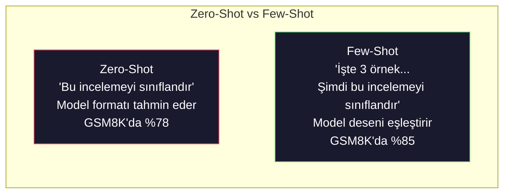
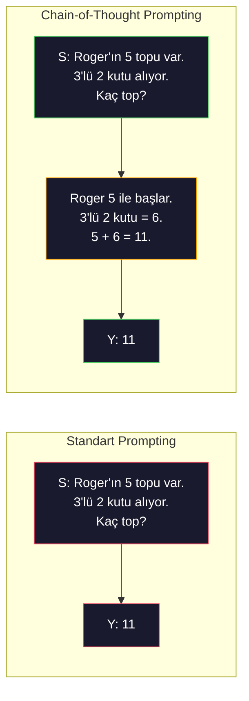
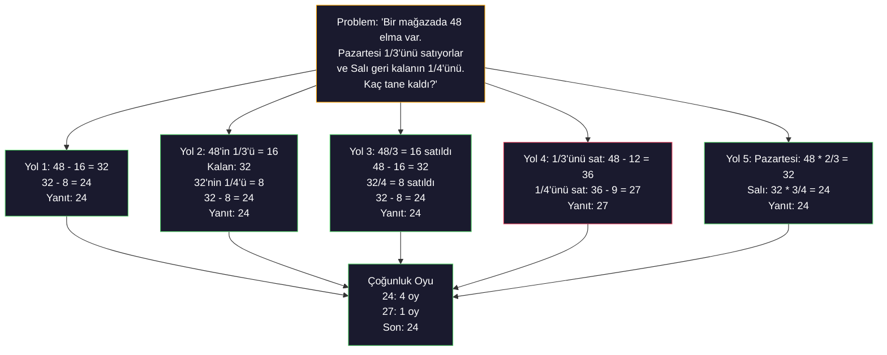
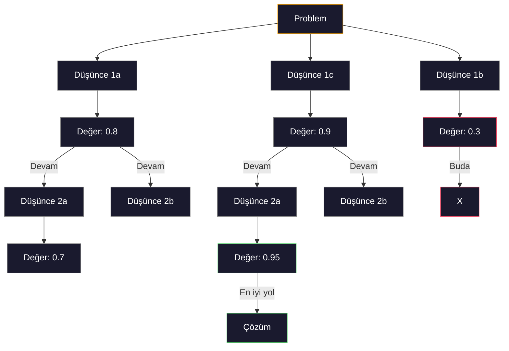
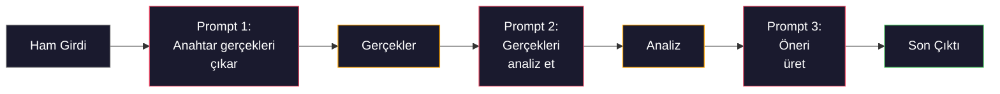

# Few-Shot, Chain-of-Thought, Tree-of-Thought

> Modele ne yapacağını söylemek prompting. Ona nasıl düşüneceğini göstermek mühendislik. Aynı model, aynı görev, aynı veri üzerinde %78 ile %91 doğruluk arasındaki fark daha iyi bir model değil. Daha iyi bir reasoning stratejisi.

**Tür:** Yapım
**Diller:** Python
**Ön koşullar:** Ders 11.01 (Prompt Engineering)
**Süre:** ~45 dakika

## Öğrenme Hedefleri

- Görev doğruluğunu maksimize eden örnek demonstrasyonları seçip formatlayarak few-shot prompting uygula
- Matematik problemleri gibi çok-adımlı problemlerde doğruluğu iyileştirmek için chain-of-thought (CoT) reasoning uygula
- Birden fazla reasoning yolunu keşfeden ve en iyisini seçen bir tree-of-thought prompt'u inşa et
- Standart bir benchmark'ta zero-shot vs few-shot vs CoT'tan gelen doğruluk iyileştirmesini ölç

## Sorun

Bir matematik özel ders uygulaması inşa ediyorsun. Prompt'un diyor ki: "Bu kelime problemini çöz." GPT-5 standart ilkokul matematik benchmark'ı GSM8K'da bunu %94 zamanı doğru yapıyor. Zirve yaptın sanıyorsun. Yapmadın — chain-of-thought hâlâ 3-4 puan ekliyor.

Beş kelime ekle — "Adım adım düşünelim" — ve doğruluk %91'e fırlar. Birkaç çözülmüş örnek ekle, %95'e ulaşır. Aynı model. Aynı sıcaklık. Aynı API maliyeti. Tek fark modele not kağıdı vermendir.

Bu bir hack değil. Reasoning böyle çalışır. İnsanlar çok-adımlı problemleri tek bir zihinsel atlamayla çözmez. Transformer'lar da çözmez. Bir modeli ara token'lar üretmeye zorladığında, o token'lar sonraki token için context'in parçası olur. Her reasoning adımı sonrakini besler. Model gerçekten yanıta doğru hesaplama yapar.

Ama "adım adım düşün" başlangıç, son değil. Ya beş reasoning yolu örnekleyip çoğunluk oyu alsaydın? Ya modelin bir olasılıklar ağacı keşfetmesine, dalları değerlendirip budamasına izin verseydin? Ya reasoning'i tool use ile araya serpiştirseydin? Bunlar varsayım değil. Ölçülmüş iyileştirmeleri olan yayınlanmış tekniklerdir ve bu derste hepsini inşa edeceksin.

## Kavram

### Zero-Shot vs Few-Shot: Örneklerin Talimatları Yendiği Durum

Zero-shot prompting modele bir görev ve başka hiçbir şey vermez. Few-shot prompting önce ona örnekler verir.

Wei et al. (2022) bunu 8 benchmark'ta ölçtü. Sentiment classification gibi basit görevler için zero-shot ve few-shot birbirinin %2'si içinde performans gösterdi. Çok-adımlı aritmetik ve sembolik reasoning gibi karmaşık görevler için few-shot doğruluğu %10-25 iyileştirdi.

Sezgi: örnekler sıkıştırılmış talimatlardır. Çıktı formatını tanımlamak yerine, onu gösterirsin. Reasoning sürecini açıklamak yerine, onu gösterirsin. Model örneklerle pattern-match yapmayı soyut talimatları yorumlamaktan daha güvenilir yapar.



**Few-shot kazandığında:** format-duyarlı görevler, classification, yapılandırılmış çıkarım, alan-spesifik jargon, modelin belirli bir desene uyması gereken herhangi bir görev.

**Zero-shot kazandığında:** basit olgusal sorular, örneklerin yaratıcılığı kısıtladığı yaratıcı görevler, iyi örnek bulmanın iyi talimatlar yazmaktan daha zor olduğu görevler.

### Örnek Seçimi: Benzer Rastgeleyi Yener

Tüm örnekler eşit değil. Hedef girdiye benzer örnekler seçmek, classification görevlerinde rastgele seçimi %5-15 oranında geçer (Liu et al., 2022). Üç ilke:

1. **Semantik benzerlik**: embedding uzayında girdiye en yakın örnekleri seç
2. **Etiket çeşitliliği**: örneklerinde tüm çıktı kategorilerini kapsa
3. **Zorluk eşleştirme**: hedef problemin karmaşıklık seviyesini eşleştir

Çoğu görev için optimal örnek sayısı 3-5'tir. 3'ün altında modelin deseni çıkarmak için yeterli sinyali olmaz. 5'in üstünde azalan getirilere ulaşır ve context window token'larını boşa harcarsın. Çok etiketli classification için, etiket başına bir örnek kullan.

### Chain-of-Thought: Modellere Not Kağıdı Vermek

Chain-of-Thought (CoT) prompting Wei et al. (2022) tarafından Google Brain'de tanıtıldı. Fikir basit: modele yalnızca yanıtı sormak yerine, önce reasoning adımlarını göstermesini iste.



Bu mekanik olarak neden çalışır? Bir transformer'ın ürettiği her token sonraki token için context olur. CoT olmadan, modelin tüm reasoning'i tek bir forward pass'in gizli state'ine sıkıştırması gerekir. CoT ile, model ara hesaplamaları token olarak dışsallaştırır. Her reasoning token'ı etkili hesaplama derinliğini uzatır.

**GSM8K benchmark'ları (ilkokul matematiği, 8.5K problem):**

| Model | Zero-Shot | Zero-Shot CoT | Few-Shot CoT |
|-------|-----------|---------------|--------------|
| GPT-4o | %78 | %91 | %95 |
| GPT-5 | %94 | %97 | %98 |
| o4-mini (reasoning) | %97 | — | — |
| Claude Opus 4.7 | %93 | %97 | %98 |
| Gemini 3 Pro | %92 | %96 | %98 |
| Llama 4 70B | %80 | %89 | %94 |
| DeepSeek-V3.1 | %89 | %94 | %96 |

**Reasoning modelleri hakkında not.** OpenAI'ın o-serisi (o3, o4-mini) ve DeepSeek-R1 gibi modeller yanıtlarını yaymadan önce içeride chain-of-thought çalıştırır. Bir reasoning modeline "Adım adım düşünelim" eklemek gereksiz ve bazen ters etkilidir — zaten yaptılar.

CoT'nin iki çeşni:

**Zero-shot CoT**: prompt'a "Adım adım düşünelim" ekle. Örnek gerekmez. Kojima et al. (2022) bu tek cümlenin aritmetik, commonsense ve sembolik reasoning görevlerinde doğruluğu iyileştirdiğini gösterdi.

**Few-shot CoT**: reasoning adımları içeren örnekler sağla. Zero-shot CoT'tan daha etkili çünkü model beklediğin tam reasoning formatını görür.

**CoT'nin zarar verdiği zaman**: basit olgusal hatırlama ("Fransa'nın başkenti nedir?"), tek-adımlı classification, hızın doğruluktan daha önemli olduğu görevler. CoT sorgu başına 50-200 token reasoning yükü ekler. Yüksek-throughput, düşük-karmaşıklık görevleri için bu boşa harcanan maliyet.

### Self-Consistency: Çok Örnekle, Bir Kez Oyla

Wang et al. (2023) self-consistency'yi tanıttı. İçgörü: tek bir CoT yolu reasoning hataları içerebilir. Ama N bağımsız reasoning yolu örneklersen (sıcaklık > 0 kullanarak) ve son yanıtta çoğunluk oyu alırsan, hatalar birbirini iptal eder.



Self-consistency, orijinal PaLM 540B deneylerinde N=40 ile GSM8K doğruluğunu %56.5'tan (tek CoT) %74.4'e iyileştirdi. GPT-5'te iyileştirme küçük (%97'den %98'e) çünkü taban doğruluk zaten doygun. Teknik en çok %60-85 taban CoT doğruluğuna sahip modellerde parlar — tek-yol hatalarının sık ama sistematik olmadığı sweet spot. Reasoning modelleri (o-serisi, R1) için self-consistency dahili sampling tarafından kapsanır.

Tradeoff: N örnek N kat API maliyeti ve gecikme demek. Pratikte N=5 faydanın çoğunu yakalar. N=3 anlamlı bir oy için minimum. N > 10 çoğu görev için azalan getirilere sahip.

### Tree-of-Thought: Dallanan Keşif

Yao et al. (2023) Tree-of-Thought (ToT)'u tanıttı. CoT tek bir lineer reasoning yolunu takip ederken, ToT birden fazla dalı keşfeder ve devam etmeden önce hangilerinin en umut verici olduğunu değerlendirir.



ToT'un üç bileşeni var:

1. **Düşünce üretimi**: birden fazla aday sonraki adım üret
2. **State değerlendirmesi**: her adayı skorla (LLM'in kendisini değerlendirici olarak kullanabilir)
3. **Arama algoritması**: ağaç boyunca BFS ya da DFS, düşük skorlu dalları budayarak

Game of 24 görevinde (24 yapmak için aritmetikle 4 sayıyı birleştir), GPT-4 standart prompting ile problemlerin %7.3'ünü çözer. CoT ile %4.0 (arama alanı geniş olduğu için CoT aslında burada zarar verir). ToT ile %74.

ToT pahalıdır. Ağaçtaki her düğüm bir LLM çağrısı gerektirir. Dallanma faktörü 3 ve derinlik 3 olan bir ağaç 39 LLM çağrısına kadar gerektirir. Yalnızca arama alanı geniş ama değerlendirilebilir problemler için kullan — planlama, bulmaca çözme, kısıtlamalarla yaratıcı problem çözme.

### ReAct: Düşünmek + Yapmak

Yao et al. (2022) reasoning izlerini aksiyonlarla birleştirdi. Model düşünme (reasoning üretme) ve yapma (tool çağırma, arama, hesaplama) arasında geçiş yapar.

```mermaid
graph LR
    Q["Soru:\nEyfel Kulesi'nin\nbulunduğu ülkenin\nnüfusu nedir?"]
    T1["Düşünce: Eyfel Kulesi'nin\nhangi ülkede olduğunu\nbulmam gerek"]
    A1["Aksiyon: ara\n'Eyfel Kulesi konum'"]
    O1["Gözlem:\nParis, Fransa"]
    T2["Düşünce: Şimdi\nFransa'nın nüfusunu\nbulmam gerek"]
    A2["Aksiyon: ara\n'Fransa nüfus 2024'"]
    O2["Gözlem:\n68.4 milyon"]
    T3["Düşünce: Yanıtım\nvar"]
    F["Yanıt:\n68.4 milyon"]

    Q --> T1 --> A1 --> O1 --> T2 --> A2 --> O2 --> T3 --> F

    style Q fill:#1a1a2e,stroke:#ffa500,color:#fff
    style T1 fill:#1a1a2e,stroke:#51cf66,color:#fff
    style A1 fill:#1a1a2e,stroke:#e94560,color:#fff
    style O1 fill:#1a1a2e,stroke:#808080,color:#fff
    style T2 fill:#1a1a2e,stroke:#51cf66,color:#fff
    style A2 fill:#1a1a2e,stroke:#e94560,color:#fff
    style O2 fill:#1a1a2e,stroke:#808080,color:#fff
    style T3 fill:#1a1a2e,stroke:#51cf66,color:#fff
    style F fill:#1a1a2e,stroke:#51cf66,color:#fff
```



ReAct, reasoning'ini gerçek veriye dayandırabildiği için bilgi-yoğun görevlerde saf CoT'tan üstündür. HotpotQA'da (çok-adımlı soru yanıtlama), GPT-4 ile ReAct %35.1 tam eşleşme elde ederken yalnız CoT için %29.4. Asıl güç, reasoning hatalarının gözlemlerle düzeltilmesi — model planını yürütme ortasında güncelleyebilir.

ReAct modern AI agent'larının temelidir. Her agent framework (LangChain, CrewAI, AutoGen) Düşünce-Aksiyon-Gözlem döngüsünün bir varyantını uygular. Faz 14'te tam agent'lar inşa edeceksin. Bu ders prompting desenini kapsar.

### Yapılandırılmış Prompting: XML Tag'leri, Sınırlayıcılar, Başlıklar

Prompt'lar karmaşıklaştıkça, yapı modelin bölümleri karıştırmasını önler. Üç yaklaşım:

**XML tag'leri** (Claude ile en iyi, her yerde sağlam):
```
<context>
You are reviewing a pull request.
The codebase uses TypeScript and React.
</context>

<task>
Review the following diff for bugs, security issues, and style violations.
</task>

<diff>
{diff_content}
</diff>

<output_format>
List each issue with: file, line, severity (critical/warning/info), description.
</output_format>
```

**Markdown başlıklar** (evrensel):
```
## Role
Senior security engineer at a fintech company.

## Task
Analyze this API endpoint for vulnerabilities.

## Input
{api_code}

## Rules
- Focus on OWASP Top 10
- Rate each finding: critical, high, medium, low
- Include remediation steps
```

**Sınırlayıcılar** (minimal ama etkili):
```
---INPUT---
{user_text}
---END INPUT---

---INSTRUCTIONS---
Summarize the above in 3 bullet points.
---END INSTRUCTIONS---
```

### Prompt Chaining: Sıralı Ayrıştırma

Bazı görevler tek bir prompt için fazla karmaşık. Prompt chaining onları, bir prompt'un çıktısının sonrakinin girdisi olduğu adımlara böler.



Chaining tek-prompt'u üç nedenle yener:

1. **Her adım daha basit**: model her şeyi jonglarken bir odaklanmış görevi işler
2. **Ara çıktılar denetlenebilir**: adımlar arası doğrulama ve düzeltme yapabilirsin
3. **Farklı adımlar farklı modeller kullanabilir**: çıkarım için ucuz model, reasoning için pahalı olanı

### Performans Karşılaştırması

| Teknik | En iyi | GSM8K Doğruluğu (GPT-5) | API Çağrısı | Token Yükü | Karmaşıklık |
|-----------|----------|------------------------|-----------|----------------|------------|
| Zero-Shot | Basit görevler | %94 | 1 | Yok | Önemsiz |
| Few-Shot | Format eşleştirme | %96 | 1 | 200-500 token | Düşük |
| Zero-Shot CoT | Hızlı reasoning artışı | %97 | 1 | 50-200 token | Önemsiz |
| Few-Shot CoT | Maksimum tek-çağrı doğruluğu | %98 | 1 | 300-600 token | Düşük |
| Self-Consistency (N=5) | Yüksek-bahisli reasoning | %98.5 | 5 | 5x token maliyeti | Orta |
| Reasoning modeli (o4-mini) | Drop-in CoT yedeği | %97 | 1 | gizli (2-10x dahili) | Önemsiz |
| Tree-of-Thought | Arama/planlama problemleri | Yok (Game of 24'te %74) | 10-40+ | 10-40x token maliyeti | Yüksek |
| ReAct | Bilgi-temelli reasoning | Yok (HotpotQA'da %35.1) | 3-10+ | Değişken | Yüksek |
| Prompt Chaining | Karmaşık çok-adımlı görevler | %96 (pipeline) | 2-5 | 2-5x token maliyeti | Orta |

Doğru teknik üç faktöre bağlı: doğruluk gereksinimi, gecikme budget'ı ve maliyet toleransı. Çoğu üretim sistemi için, 3-örnekli self-consistency fallback'li few-shot CoT kullanım durumlarının %90'ını kapsar.

## İnşa Et

Few-shot prompting'i, chain-of-thought reasoning'i ve self-consistency oylamasını tek bir pipeline'da birleştiren bir matematik problemi çözücüsü inşa edeceğiz. Sonra zor problemler için tree-of-thought ekleyeceğiz.

Tam uygulama `code/advanced_prompting.py`'da. Anahtar bileşenler burada.

### Adım 1: Few-Shot Örnek Store'u

İlk bileşen few-shot örnekleri yönetir ve verilen bir problem için en alakalı olanları seçer.

```python
GSM8K_EXAMPLES = [
    {
        "question": "Janet's ducks lay 16 eggs per day. She eats three for breakfast every morning and bakes muffins for her friends every day with four. She sells every egg at the farmers' market for $2. How much does she make every day at the farmers' market?",
        "reasoning": "Janet's ducks lay 16 eggs per day. She eats 3 and bakes 4, using 3 + 4 = 7 eggs. So she has 16 - 7 = 9 eggs left. She sells each for $2, so she makes 9 * 2 = $18 per day.",
        "answer": "18"
    },
    ...
]
```

Her örneğin üç parçası var: soru, reasoning chain'i ve son yanıt. Reasoning chain'i, sıradan bir few-shot örneğini CoT few-shot örneğine dönüştüren şeydir.

### Adım 2: Chain-of-Thought Prompt Builder

Prompt builder bir sistem mesajını, reasoning chain'leriyle few-shot örnekleri ve hedef soruyu tek bir prompt'a birleştirir.

```python
def build_cot_prompt(question, examples, num_examples=3):
    system = (
        "You are a math problem solver. "
        "For each problem, show your step-by-step reasoning, "
        "then give the final numerical answer on the last line "
        "in the format: 'The answer is [number]'."
    )

    example_text = ""
    for ex in examples[:num_examples]:
        example_text += f"Q: {ex['question']}\n"
        example_text += f"A: {ex['reasoning']} The answer is {ex['answer']}.\n\n"

    user = f"{example_text}Q: {question}\nA:"
    return system, user
```

Format kısıtı ("The answer is [number]") kritik. Onsuz self-consistency örnekler arasında yanıtları çıkarıp karşılaştıramaz.

### Adım 3: Self-Consistency Oylaması

N reasoning yolu örnekle ve çoğunluk yanıtını al.

```python
def self_consistency_solve(question, examples, client, model, n_samples=5):
    system, user = build_cot_prompt(question, examples)

    answers = []
    reasonings = []
    for _ in range(n_samples):
        response = client.chat.completions.create(
            model=model,
            messages=[
                {"role": "system", "content": system},
                {"role": "user", "content": user}
            ],
            temperature=0.7
        )
        text = response.choices[0].message.content
        reasonings.append(text)
        answer = extract_answer(text)
        if answer is not None:
            answers.append(answer)

    vote_counts = Counter(answers)
    best_answer = vote_counts.most_common(1)[0][0] if vote_counts else None
    confidence = vote_counts[best_answer] / len(answers) if best_answer else 0

    return best_answer, confidence, reasonings, vote_counts
```

Sıcaklık 0.7 önemli. Sıcaklık 0.0'da tüm N örnek özdeş olur, amacı boşa çıkarır. Çeşitli reasoning yolları için yeterli rastgeleliğe ihtiyacın var ama modelin saçma sapan üretmesini sağlayacak kadar değil.

### Adım 4: Tree-of-Thought Çözücüsü

Lineer reasoning'in başarısız olduğu problemler için, ToT birden fazla yaklaşım keşfeder ve hangi yönün en umut verici olduğunu değerlendirir.

```python
def tree_of_thought_solve(question, client, model, breadth=3, depth=3):
    thoughts = generate_initial_thoughts(question, client, model, breadth)
    scored = [(t, evaluate_thought(t, question, client, model)) for t in thoughts]
    scored.sort(key=lambda x: x[1], reverse=True)

    for current_depth in range(1, depth):
        next_thoughts = []
        for thought, score in scored[:2]:
            extensions = extend_thought(thought, question, client, model, breadth)
            for ext in extensions:
                ext_score = evaluate_thought(ext, question, client, model)
                next_thoughts.append((ext, ext_score))
        scored = sorted(next_thoughts, key=lambda x: x[1], reverse=True)

    best_thought = scored[0][0] if scored else ""
    return extract_answer(best_thought), best_thought
```

Değerlendirici kendisi bir LLM çağrısı. Modele soruyorsun: "0.0'dan 1.0'a bir ölçekte, bu reasoning yolu problemi çözmek için ne kadar umut verici?" Bu ToT'un anahtar içgörüsü — model kendi kısmi çözümlerini değerlendirir.

### Adım 5: Tam Pipeline

Pipeline tüm teknikleri bir escalation stratejisiyle birleştirir.

```python
def solve_with_escalation(question, examples, client, model):
    system, user = build_cot_prompt(question, examples)
    single_response = call_llm(client, model, system, user, temperature=0.0)
    single_answer = extract_answer(single_response)

    sc_answer, confidence, _, _ = self_consistency_solve(
        question, examples, client, model, n_samples=5
    )

    if confidence >= 0.8:
        return sc_answer, "self_consistency", confidence

    tot_answer, _ = tree_of_thought_solve(question, client, model)
    return tot_answer, "tree_of_thought", None
```

Escalation mantığı: önce ucuzu (tek CoT) dene. Self-consistency güveni 0.8'in altındaysa (5 örneğin 4'ünden az anlaşıyor), ToT'a yükselt. Bu maliyet ve doğruluğu dengeler — problemlerin çoğu ucuza çözülür, zor problemler daha fazla compute alır.

## Kullan

### LangChain ile

LangChain few-shot ve CoT desenlerini basitleştiren prompt şablonları ve çıktı parsing için dahili destek sağlar:

```python
from langchain_core.prompts import FewShotPromptTemplate, PromptTemplate
from langchain_openai import ChatOpenAI

example_prompt = PromptTemplate(
    input_variables=["question", "reasoning", "answer"],
    template="Q: {question}\nA: {reasoning} The answer is {answer}."
)

few_shot_prompt = FewShotPromptTemplate(
    examples=examples,
    example_prompt=example_prompt,
    suffix="Q: {input}\nA: Let's think step by step.",
    input_variables=["input"]
)

llm = ChatOpenAI(model="gpt-4o", temperature=0.7)
chain = few_shot_prompt | llm
result = chain.invoke({"input": "If a train travels 120 km in 2 hours..."})
```

LangChain'in semantik benzerlik seçimi için `ExampleSelector` sınıfları da var:

```python
from langchain_core.example_selectors import SemanticSimilarityExampleSelector
from langchain_openai import OpenAIEmbeddings

selector = SemanticSimilarityExampleSelector.from_examples(
    examples,
    OpenAIEmbeddings(),
    k=3
)
```

### DSPy ile

DSPy prompting stratejilerini optimize edilebilir modüller olarak ele alır. CoT prompt'ları elle yapmak yerine, bir signature tanımlar ve DSPy'ın prompt'u optimize etmesine izin verirsin:

```python
import dspy

dspy.configure(lm=dspy.LM("openai/gpt-4o", temperature=0.7))

class MathSolver(dspy.Module):
    def __init__(self):
        self.solve = dspy.ChainOfThought("question -> answer")

    def forward(self, question):
        return self.solve(question=question)

solver = MathSolver()
result = solver(question="Janet's ducks lay 16 eggs per day...")
```

DSPy'ın `ChainOfThought`'u otomatik olarak reasoning izleri ekler. `dspy.majority` self-consistency uygular:

```python
result = dspy.majority(
    [solver(question=q) for _ in range(5)],
    field="answer"
)
```

### Karşılaştırma: Sıfırdan vs Framework'ler

| Özellik | Sıfırdan (bu ders) | LangChain | DSPy |
|---------|--------------------------|-----------|------|
| Prompt format üzerinde kontrol | Tam | Şablon tabanlı | Otomatik |
| Self-consistency | Manuel oylama | Manuel | Dahili (`dspy.majority`) |
| Örnek seçimi | Custom mantık | `ExampleSelector` | `dspy.BootstrapFewShot` |
| Tree-of-Thought | Custom ağaç araması | Topluluk zincirleri | Dahili değil |
| Prompt optimizasyonu | Manuel iterasyon | Manuel | Otomatik derleme |
| En iyi | Öğrenme, custom pipeline'lar | Standart workflow'lar | Araştırma, optimizasyon |

## Yayınla

Bu ders iki artefakt üretir.

**1. Reasoning Chain Prompt** (`outputs/prompt-reasoning-chain.md`): self-consistency ile few-shot CoT için üretim-hazır prompt şablonu. Örneklerini ve problem alanını ekle.

**2. CoT Pattern Selection Skill** (`outputs/skill-cot-patterns.md`): görev tipi, doğruluk gereksinimleri ve maliyet kısıtlarına dayalı doğru reasoning tekniğini seçmek için karar framework'ü.

## Alıştırmalar

1. **Aralığı ölç**: 10 GSM8K problemi al. Her birini zero-shot, few-shot, zero-shot CoT ve few-shot CoT ile çöz. Her biri için doğruluğu kaydet. Hangi teknik modelinde en büyük artışı veriyor?

2. **Örnek seçim deneyi**: aynı 10 problem için, rastgele örnek seçimi vs elle seçilmiş benzer örnekleri karşılaştır. Doğruluk farkını ölç. Hangi noktada örnek kalitesi örnek miktarından daha önemli olur?

3. **Self-consistency maliyet eğrisi**: 20 GSM8K probleminde N=1, 3, 5, 7, 10 ile self-consistency çalıştır. Doğruluk vs maliyet (toplam token) çiz. Modelin için eğrinin diz noktası nerede?

4. **Bir ReAct döngüsü inşa et**: pipeline'ı bir hesap makinesi tool'uyla genişlet. Model bir matematik ifadesi ürettiğinde, onu Python'un `eval()`'iyle (sandbox'ta) yürüt ve sonucu geri besle. Tool-temelli reasoning'in saf CoT'tan üstün olup olmadığını ölç.

5. **Yaratıcı görevler için ToT**: Tree-of-Thought çözücüsünü yaratıcı bir yazma görevine uyarla: "Hem komik hem üzücü 6-kelimelik bir hikaye yaz." LLM'i değerlendirici olarak kullan. Dallanma keşfi tek-çekim üretimden daha iyi yaratıcı çıktılar üretiyor mu?

## Anahtar Terimler

| Terim | İnsanlar ne diyor | Gerçekte ne anlama geliyor |
|------|----------------|----------------------|
| Few-shot prompting | "Ona birkaç örnek ver" | Modelin çıktı formatını ve davranışını çıpa olarak prompt'a girdi-çıktı demonstrasyonları eklemek |
| Chain-of-Thought | "Adım adım düşünmesini sağla" | Son yanıtı üretmeden önce modelin etkili hesaplamasını uzatan ara reasoning token'larını ortaya çıkarmak |
| Self-Consistency | "Birkaç kez çalıştır" | Sıcaklık > 0'da N çeşitli reasoning yolu örneklemek ve çoğunluk oyuyla en yaygın son yanıtı seçmek |
| Tree-of-Thought | "Seçenekleri keşfetmesine izin ver" | Her kısmi çözümün değerlendirildiği ve yalnızca umut verici yolların genişletildiği reasoning dalları üzerinde yapılandırılmış arama |
| ReAct | "Düşünme + tool use" | Düşünce-Aksiyon-Gözlem döngüsünde reasoning izlerini dış aksiyonlarla (arama, hesaplama, API çağrıları) araya serpiştirmek |
| Prompt chaining | "Adımlara böl" | Karmaşık bir görevi her çıktının sonraki girdiyi beslediği sıralı prompt'lara ayrıştırmak |
| Zero-shot CoT | "Sadece 'adım adım düşün' ekle" | Modelin latent reasoning yeteneğine güvenerek hiçbir örnek olmadan bir prompt'a bir reasoning tetikleyici ifade eklemek |

## İleri Okuma

- [Chain-of-Thought Prompting Elicits Reasoning in Large Language Models](https://arxiv.org/abs/2201.11903) — Wei et al. 2022. Google Brain'den orijinal CoT makalesi. Çekirdek sonuçlar için bölüm 2-3'ü oku.
- [Self-Consistency Improves Chain of Thought Reasoning in Language Models](https://arxiv.org/abs/2203.11171) — Wang et al. 2023. Self-consistency makalesi. Tablo 1 ihtiyacın olan tüm sayılara sahip.
- [Tree of Thoughts: Deliberate Problem Solving with Large Language Models](https://arxiv.org/abs/2305.10601) — Yao et al. 2023. ToT makalesi. Bölüm 4'teki Game of 24 sonuçları zirve.
- [ReAct: Synergizing Reasoning and Acting in Language Models](https://arxiv.org/abs/2210.03629) — Yao et al. 2022. Modern AI agent'larının temeli. Bölüm 3, Düşünce-Aksiyon-Gözlem döngüsünü açıklar.
- [Large Language Models are Zero-Shot Reasoners](https://arxiv.org/abs/2205.11916) — Kojima et al. 2022. "Adım adım düşünelim" makalesi. Ne kadar basit olduğu için şaşırtıcı derecede etkili.
- [DSPy: Compiling Declarative Language Model Calls into Self-Improving Pipelines](https://arxiv.org/abs/2310.03714) — Khattab et al. 2023. Prompting'i bir derleme problemi olarak ele alır. Manuel prompt engineering'in ötesine geçmek istiyorsan oku.
- [OpenAI — Reasoning models guide](https://platform.openai.com/docs/guides/reasoning) — chain-of-thought'un bir prompt-seviyesi numara mı yoksa dahili, token başına ücretlendirilen "reasoning" mode'u mu olduğuna dair satıcı kılavuzu.
- [Lightman et al., "Let's Verify Step by Step" (2023)](https://arxiv.org/abs/2305.20050) — bir zincirin her adımını derecelendiren process reward model'leri (PRM); outcome-only ödüllerini başarıyla geçen reasoning supervision sinyali.
- [Snell et al., "Scaling LLM Test-Time Compute Optimally" (2024)](https://arxiv.org/abs/2408.03314) — CoT uzunluğu, self-consistency sampling ve MCTS'in sistematik çalışması; doğruluk gecikmeden daha önemli olduğunda "adım adım düşün"ün gittiği yer.
