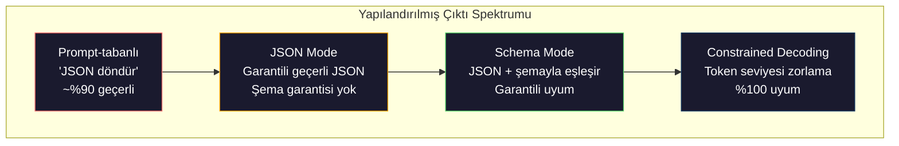
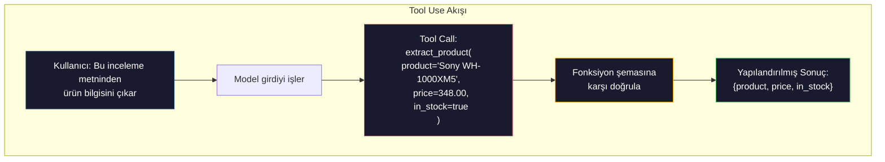

# Structured Outputs: JSON, Schema Doğrulama, Constrained Decoding

> LLM'in bir string döndürür. Uygulamanın JSON'a ihtiyaç duyar. Bu boşluk, herhangi bir model halüsinasyonundan daha fazla üretim sistemini çökertti. Yapılandırılmış çıktı, doğal dil ile tipli veri arasındaki köprüdür. Doğru yap, LLM'in güvenilir bir API olur. Yanlış yap, gece 3'te regex ile free-text parse ediyor olursun.

**Tür:** Yapım
**Diller:** Python
**Ön koşullar:** Faz 10, Ders 01-05 (Sıfırdan LLM'ler)
**Süre:** ~90 dakika
**İlgili:** Faz 5 · 20 (Structured Outputs ve Constrained Decoding) decoder-seviyesi teoriyi (FSM/CFG logit processor'lar, Outlines, XGrammar) kapsar. Bu ders üretim SDK yüzeyine (OpenAI `response_format`, Anthropic tool use, Instructor) odaklanır — API'nin altında ne olduğunu anlamak istiyorsan önce Faz 5 · 20'yi oku.

## Öğrenme Hedefleri

- OpenAI ve Anthropic API parametreleri kullanarak JSON-mode ve şema-kısıtlı çıktılar uygula
- Bozuk LLM çıktılarını reddeden ve hata geri bildirimiyle yeniden deneyen bir Pydantic doğrulama katmanı inşa et
- Constrained decoding'in, post-processing olmadan token seviyesinde geçerli JSON'u nasıl zorladığını açıkla
- Yapısız metni güvenilir şekilde tipli veri yapılarına dönüştüren sağlam çıkarım prompt'ları tasarla

## Sorun

Bir LLM'e soruyorsun: "Bu metinden ürün adını, fiyatını ve mevcudiyetini çıkar." Yanıt veriyor:

```
Ürün, Sony WH-1000XM5 kulaklıkları, $348.00 fiyatında ve şu anda stokta.
```

Bu tamamen doğru bir yanıt. Aynı zamanda uygulaman için tamamen işe yaramaz. Envanter sistemin `{"product": "Sony WH-1000XM5", "price": 348.00, "in_stock": true}`'ye ihtiyaç duyar. Belirli anahtarlara, belirli tiplere ve belirli değer kısıtlarına sahip bir JSON nesnesine ihtiyacın var. Bir cümleye ihtiyacın yok.

Naif çözüm: prompt'una "JSON ile yanıt ver" ekle. Bu zamanın %90'ı çalışır. Diğer %10'da model JSON'u markdown code fence'leri içine sarar, ya da "İşte JSON:" gibi bir önsöz ekler, ya da bir parantezi erken kapattığı için sözdizimsel olarak geçersiz JSON üretir. JSON parser'ın çöker. Pipeline'ın kırılır. try/except ve bir retry döngüsü eklersin. Retry bazen farklı veri üretir. Şimdi bir parsing problemine ek olarak bir tutarlılık problemin var.

Bu bir prompt engineering problemi değil. Bir decoding problemi. Model token'ları soldan sağa üretir. Her pozisyonda 100K+ seçenekli bir vocabulary'den en olası sonraki token'ı seçer. Bu seçeneklerin çoğu verili herhangi bir pozisyonda geçersiz JSON üretir. Model `{"price":` yayınladıysa, sonraki token bir rakam, bir tırnak (string için), `null`, `true`, `false` ya da negatif işareti olmalı. Başka her şey geçersiz JSON üretir. Kısıt olmadan model, sözdizimsel olarak felaket biçimde yanlış olan tamamen makul bir İngilizce kelime seçebilir.

## Kavram

### Yapılandırılmış Çıktı Spektrumu

Yapılandırılmış çıktı kontrolünün dört seviyesi vardır, her biri bir öncekinden daha güvenilir.



**Prompt-tabanlı** ("Geçerli JSON ile yanıt ver"): zorlama yok. Model genellikle uyar ama bazen uymaz. Güvenilirlik: ~%90. Hata modu: markdown fence'ler, önsöz metni, kesilmiş çıktı, yanlış yapı.

**JSON mode**: API çıktının geçerli JSON olduğunu garanti eder. OpenAI'ın `response_format: { type: "json_object" }`'i bunu sağlar. Çıktı hatasız parse olur. Ama beklediğin şemayla eşleşmeyebilir — fazladan anahtarlar, yanlış tipler, eksik alanlar.

**Schema mode**: API bir JSON Schema alır ve çıktının ona uyduğunu garanti eder. 2026'da her büyük sağlayıcı bunu yerel olarak destekliyor: OpenAI'ın `response_format: { type: "json_schema", json_schema: {...} }`'i (aynı zamanda `tool_choice="required"` olarak), Anthropic'in `input_schema` ile tool use'u ve Gemini'nin `response_schema` + `response_mime_type: "application/json"`'ı. Çıktının belirttiğin tam anahtarlar, tipler ve kısıtlar vardır.

**Constrained decoding**: üretim sırasında her token pozisyonunda decoder geçersiz çıktı üretecek tüm token'ları maskeler. Şema bir sayı gerektiriyorsa ve model bir harf yaymak üzereyse, o token'ın olasılığı sıfıra ayarlanır. Model yalnızca geçerli çıktıya yol açan token'ları üretebilir. OpenAI'ın structured output mode'u ve Outlines ve Guidance gibi kütüphaneler bunu altta uygular.

### JSON Schema: Sözleşme Dili

JSON Schema, modele (ya da doğrulama katmanına) çıktının hangi şekle sahip olması gerektiğini söyleme şeklindir. Her büyük yapılandırılmış çıktı sistemi bunu kullanır.

```json
{
  "type": "object",
  "properties": {
    "product": { "type": "string" },
    "price": { "type": "number", "minimum": 0 },
    "in_stock": { "type": "boolean" },
    "categories": {
      "type": "array",
      "items": { "type": "string" }
    }
  },
  "required": ["product", "price", "in_stock"]
}
```

Bu şema diyor ki: çıktı bir string `product`, negatif olmayan bir sayı `price`, bir boolean `in_stock` ve opsiyonel bir string `categories` dizisine sahip bir nesne olmalı. Eşleşmeyen herhangi bir çıktı reddedilir.

Şemalar zor durumları işler: iç içe nesneler, tipli öğelere sahip diziler, enum'lar (bir string'i belirli değerlere kısıtla), pattern matching (string üzerinde regex) ve birleştiriciler (polimorfik çıktılar için oneOf, anyOf, allOf).

### Pydantic Deseni

Python'da JSON Schema'yı elle yazmazsın. Bir Pydantic modeli tanımlarsın ve şemayı senin için üretir.

```python
from pydantic import BaseModel

class Product(BaseModel):
    product: str
    price: float
    in_stock: bool
    categories: list[str] = []
```

Bu yukarıdakiyle aynı JSON Schema'yı üretir. Instructor kütüphanesi (ve OpenAI'ın SDK'sı) Pydantic modellerini doğrudan kabul eder: model sınıfını geç, doğrulanmış bir örnek geri al. LLM çıktısı eşleşmezse Instructor otomatik retry yapar.

### Function Calling / Tool Use

Aynı problem için alternatif arayüz. Modele doğrudan JSON üretmesini istemek yerine, tipli parametrelerle "tool"lar (fonksiyonlar) tanımlarsın. Model yapılandırılmış argümanlarla bir function call çıktısı verir. OpenAI buna "function calling" diyor. Anthropic "tool use" diyor. Sonuç aynı: yapılandırılmış veri.



Modelin yalnızca parametreleri doldurmaktansa hangi fonksiyonu çağıracağını seçmesi gerektiğinde tool use tercih edilir. 10 farklı çıkarım şeman varsa ve modelin girdiye göre doğru olanı seçmesi gerekiyorsa, tool use sana hem şema seçimini hem yapılandırılmış çıktıyı verir.

### Yaygın Hata Modları

Şema zorlamasıyla bile yapılandırılmış çıktılar incelikli yollarla başarısız olabilir.

**Halüsine edilmiş değerler**: çıktı şemayla eşleşir ama uydurulmuş veri içerir. Metin $348 derken model `{"price": 299.99}` üretir. Şema doğrulaması bunu yakalayamaz — tip doğru, değer yanlış.

**Enum karışıklığı**: bir alanı `["in_stock", "out_of_stock", "preorder"]`'a kısıtlarsın. Model `"available"` çıktısı verir — semantik olarak doğru, ama izin verilen kümede değil. İyi constrained decoding bunu önler. Prompt-tabanlı yaklaşımlar önlemez.

**İç içe nesne derinliği**: derinden iç içe şemalar (4+ seviye) daha fazla hata üretir. Her iç içe seviye modelin yapıyı kaybedebileceği başka bir yer.

**Dizi uzunluğu**: model bir dizide çok fazla ya da çok az öğe üretebilir. Şemalar `minItems` ve `maxItems`'ı destekler ama tüm sağlayıcılar bunları decoding seviyesinde zorlamaz.

**Opsiyonel alan atlaması**: model teknik olarak opsiyonel ama kullanım durumun için semantik olarak önemli alanları atlayabilir. Veri bazen eksik olsa bile şemada zorunlu olarak ayarla — modeli açıkça `null` üretmeye zorla.

## İnşa Et

### Adım 1: JSON Schema Validator'ı

Sıfırdan bir validator inşa et, bir Python nesnesinin bir JSON Schema'yla eşleşip eşleşmediğini kontrol eden. Uyum doğrulamak için çıktı tarafında çalışan budur.

```python
import json

def validate_schema(data, schema):
    errors = []
    _validate(data, schema, "", errors)
    return errors

def _validate(data, schema, path, errors):
    schema_type = schema.get("type")

    if schema_type == "object":
        if not isinstance(data, dict):
            errors.append(f"{path}: expected object, got {type(data).__name__}")
            return
        for key in schema.get("required", []):
            if key not in data:
                errors.append(f"{path}.{key}: required field missing")
        properties = schema.get("properties", {})
        for key, value in data.items():
            if key in properties:
                _validate(value, properties[key], f"{path}.{key}", errors)

    elif schema_type == "array":
        if not isinstance(data, list):
            errors.append(f"{path}: expected array, got {type(data).__name__}")
            return
        min_items = schema.get("minItems", 0)
        max_items = schema.get("maxItems", float("inf"))
        if len(data) < min_items:
            errors.append(f"{path}: array has {len(data)} items, minimum is {min_items}")
        if len(data) > max_items:
            errors.append(f"{path}: array has {len(data)} items, maximum is {max_items}")
        items_schema = schema.get("items", {})
        for i, item in enumerate(data):
            _validate(item, items_schema, f"{path}[{i}]", errors)

    elif schema_type == "string":
        if not isinstance(data, str):
            errors.append(f"{path}: expected string, got {type(data).__name__}")
            return
        enum_values = schema.get("enum")
        if enum_values and data not in enum_values:
            errors.append(f"{path}: '{data}' not in allowed values {enum_values}")

    elif schema_type == "number":
        if not isinstance(data, (int, float)):
            errors.append(f"{path}: expected number, got {type(data).__name__}")
            return
        minimum = schema.get("minimum")
        maximum = schema.get("maximum")
        if minimum is not None and data < minimum:
            errors.append(f"{path}: {data} is less than minimum {minimum}")
        if maximum is not None and data > maximum:
            errors.append(f"{path}: {data} is greater than maximum {maximum}")

    elif schema_type == "boolean":
        if not isinstance(data, bool):
            errors.append(f"{path}: expected boolean, got {type(data).__name__}")

    elif schema_type == "integer":
        if not isinstance(data, int) or isinstance(data, bool):
            errors.append(f"{path}: expected integer, got {type(data).__name__}")
```

### Adım 2: Pydantic-Tarzı Modelden Şemaya

Minimal bir sınıftan şemaya dönüştürücü inşa et. Bir Python sınıfı tanımla ve JSON Schema'sını otomatik üret.

```python
class SchemaField:
    def __init__(self, field_type, required=True, default=None, enum=None, minimum=None, maximum=None):
        self.field_type = field_type
        self.required = required
        self.default = default
        self.enum = enum
        self.minimum = minimum
        self.maximum = maximum

def python_type_to_schema(field):
    type_map = {
        str: "string",
        int: "integer",
        float: "number",
        bool: "boolean",
    }

    schema = {}

    if field.field_type in type_map:
        schema["type"] = type_map[field.field_type]
    elif field.field_type == list:
        schema["type"] = "array"
        schema["items"] = {"type": "string"}
    elif isinstance(field.field_type, dict):
        schema = field.field_type

    if field.enum:
        schema["enum"] = field.enum
    if field.minimum is not None:
        schema["minimum"] = field.minimum
    if field.maximum is not None:
        schema["maximum"] = field.maximum

    return schema

def model_to_schema(name, fields):
    properties = {}
    required = []

    for field_name, field in fields.items():
        properties[field_name] = python_type_to_schema(field)
        if field.required:
            required.append(field_name)

    return {
        "type": "object",
        "properties": properties,
        "required": required,
    }
```

### Adım 3: Constrained Token Filter

Constrained decoding'i simüle et. Bir kısmi JSON string'i ve bir şema verildiğinde, mevcut pozisyonda hangi token kategorilerinin geçerli olduğunu belirle.

```python
def next_valid_tokens(partial_json, schema):
    stripped = partial_json.strip()

    if not stripped:
        return ["{"]

    try:
        json.loads(stripped)
        return ["<EOS>"]
    except json.JSONDecodeError:
        pass

    last_char = stripped[-1] if stripped else ""

    if last_char == "{":
        return ['"', "}"]
    elif last_char == '"':
        if stripped.endswith('":'):
            return ['"', "0-9", "true", "false", "null", "[", "{"]
        return ["a-z", '"']
    elif last_char == ":":
        return [" ", '"', "0-9", "true", "false", "null", "[", "{"]
    elif last_char == ",":
        return [" ", '"', "{", "["]
    elif last_char in "0123456789":
        return ["0-9", ".", ",", "}", "]"]
    elif last_char == "}":
        return [",", "}", "]", "<EOS>"]
    elif last_char == "]":
        return [",", "}", "<EOS>"]
    elif last_char == "[":
        return ['"', "0-9", "true", "false", "null", "{", "[", "]"]
    else:
        return ["any"]

def demonstrate_constrained_decoding():
    partial_states = [
        '',
        '{',
        '{"product"',
        '{"product":',
        '{"product": "Sony"',
        '{"product": "Sony",',
        '{"product": "Sony", "price":',
        '{"product": "Sony", "price": 348',
        '{"product": "Sony", "price": 348}',
    ]

    print(f"{'Partial JSON':<45} {'Valid Next Tokens'}")
    print("-" * 80)
    for state in partial_states:
        valid = next_valid_tokens(state, {})
        display = state if state else "(empty)"
        print(f"{display:<45} {valid}")
```

### Adım 4: Çıkarım Pipeline'ı

Her şeyi bir çıkarım pipeline'ında birleştir: bir şema tanımla, yapılandırılmış çıktı üreten bir LLM'i simüle et, çıktıyı doğrula ve retry'ları işle.

```python
def simulate_llm_extraction(text, schema, attempt=0):
    if "headphones" in text.lower() or "sony" in text.lower():
        if attempt == 0:
            return '{"product": "Sony WH-1000XM5", "price": 348.00, "in_stock": true, "categories": ["audio", "headphones"]}'
        return '{"product": "Sony WH-1000XM5", "price": 348.00, "in_stock": true}'

    if "laptop" in text.lower():
        return '{"product": "MacBook Pro 16", "price": 2499.00, "in_stock": false, "categories": ["computers"]}'

    return '{"product": "Unknown", "price": 0, "in_stock": false}'

def extract_with_retry(text, schema, max_retries=3):
    for attempt in range(max_retries):
        raw = simulate_llm_extraction(text, schema, attempt)

        try:
            data = json.loads(raw)
        except json.JSONDecodeError as e:
            print(f"  Attempt {attempt + 1}: JSON parse error -- {e}")
            continue

        errors = validate_schema(data, schema)
        if not errors:
            return data

        print(f"  Attempt {attempt + 1}: Schema validation errors -- {errors}")

    return None

product_schema = {
    "type": "object",
    "properties": {
        "product": {"type": "string"},
        "price": {"type": "number", "minimum": 0},
        "in_stock": {"type": "boolean"},
        "categories": {"type": "array", "items": {"type": "string"}},
    },
    "required": ["product", "price", "in_stock"],
}
```

### Adım 5: Tam Pipeline'ı Çalıştır

```python
def run_demo():
    print("=" * 60)
    print("  Structured Output Pipeline Demo")
    print("=" * 60)

    print("\n--- Schema Definition ---")
    product_fields = {
        "product": SchemaField(str),
        "price": SchemaField(float, minimum=0),
        "in_stock": SchemaField(bool),
        "categories": SchemaField(list, required=False),
    }
    generated_schema = model_to_schema("Product", product_fields)
    print(json.dumps(generated_schema, indent=2))

    print("\n--- Schema Validation ---")
    test_cases = [
        ({"product": "Test", "price": 10.0, "in_stock": True}, "Valid object"),
        ({"product": "Test", "price": -5.0, "in_stock": True}, "Negative price"),
        ({"product": "Test", "in_stock": True}, "Missing price"),
        ({"product": "Test", "price": "ten", "in_stock": True}, "String as price"),
        ("not an object", "String instead of object"),
    ]

    for data, label in test_cases:
        errors = validate_schema(data, product_schema)
        status = "PASS" if not errors else f"FAIL: {errors}"
        print(f"  {label}: {status}")

    print("\n--- Constrained Decoding Simulation ---")
    demonstrate_constrained_decoding()

    print("\n--- Extraction Pipeline ---")
    texts = [
        "The Sony WH-1000XM5 headphones are priced at $348 and currently available.",
        "The new MacBook Pro 16-inch laptop costs $2499 but is sold out.",
        "This is a random sentence with no product info.",
    ]

    for text in texts:
        print(f"\n  Input: {text[:60]}...")
        result = extract_with_retry(text, product_schema)
        if result:
            print(f"  Output: {json.dumps(result)}")
        else:
            print(f"  Output: FAILED after retries")
```

## Kullan

### OpenAI Structured Outputs

```python
# from openai import OpenAI
# from pydantic import BaseModel
#
# client = OpenAI()
#
# class Product(BaseModel):
#     product: str
#     price: float
#     in_stock: bool
#
# response = client.beta.chat.completions.parse(
#     model="gpt-5-mini",
#     messages=[
#         {"role": "system", "content": "Extract product information."},
#         {"role": "user", "content": "Sony WH-1000XM5, $348, in stock"},
#     ],
#     response_format=Product,
# )
#
# product = response.choices[0].message.parsed
# print(product.product, product.price, product.in_stock)
```

OpenAI'ın structured output mode'u içeride constrained decoding kullanır. Modelin ürettiği her token Pydantic şemasıyla eşleşen bir çıktı üreteceği garantilenir. Retry gerekmez. Doğrulama gerekmez. Kısıt decoding sürecine işlenmiştir.

### Anthropic Tool Use

```python
# import anthropic
#
# client = anthropic.Anthropic()
#
# response = client.messages.create(
#     model="claude-opus-4-7",
#     max_tokens=1024,
#     tools=[{
#         "name": "extract_product",
#         "description": "Extract product information from text",
#         "input_schema": {
#             "type": "object",
#             "properties": {
#                 "product": {"type": "string"},
#                 "price": {"type": "number"},
#                 "in_stock": {"type": "boolean"},
#             },
#             "required": ["product", "price", "in_stock"],
#         },
#     }],
#     messages=[{"role": "user", "content": "Extract: Sony WH-1000XM5, $348, in stock"}],
# )
```

Anthropic yapılandırılmış çıktıyı tool use üzerinden elde eder. Model, input_schema ile eşleşen yapılandırılmış argümanlarla bir tool call yayınlar. Aynı sonuç, farklı API yüzeyi.

### Instructor Kütüphanesi

```python
# pip install instructor
# import instructor
# from openai import OpenAI
# from pydantic import BaseModel
#
# client = instructor.from_openai(OpenAI())
#
# class Product(BaseModel):
#     product: str
#     price: float
#     in_stock: bool
#
# product = client.chat.completions.create(
#     model="gpt-5-mini",
#     response_model=Product,
#     messages=[{"role": "user", "content": "Sony WH-1000XM5, $348, in stock"}],
# )
```

Instructor herhangi bir LLM client'ını sarar ve doğrulamayla otomatik retry ekler. İlk girişim doğrulamada başarısız olursa, hataları modele bağlam olarak gönderir ve çıktıyı düzeltmesini ister. Bu yalnızca OpenAI'da değil, herhangi bir sağlayıcıda çalışır.

## Yayınla

Bu ders `outputs/prompt-structured-extractor.md` üretir — bir şema tanımı verildiğinde herhangi bir metinden yapılandırılmış veri çıkaran yeniden kullanılabilir bir prompt şablonu. Ona bir JSON Schema ve yapısız metin ver, doğrulanmış JSON döndürür.

Ayrıca `outputs/skill-structured-outputs.md` üretir — sağlayıcına, güvenilirlik gereksinimlerine ve şema karmaşıklığına göre doğru yapılandırılmış çıktı stratejisini seçmek için bir karar framework'ü.

## Alıştırmalar

1. Şema validator'ını `oneOf` desteklemek için genişlet (veri, birkaç şemadan tam olarak biriyle eşleşmeli). Bu polimorfik çıktıları işler — örneğin, farklı şekillere sahip ya bir `Product` ya da bir `Service` nesnesi olabilen bir alan.

2. İki şemayı karşılaştıran ve breaking değişiklikleri (kaldırılan zorunlu alanlar, değiştirilmiş tipler) breaking olmayan değişikliklerden (eklenen opsiyonel alanlar, gevşetilmiş kısıtlar) ayıran bir "şema diff" tool'u inşa et. Bu üretimde çıkarım şemalarını versiyonlamak için zorunlu.

3. Daha gerçekçi bir constrained decoding simülatörü uygula. Bir JSON Schema ve 100 token'lık bir vocabulary (harfler, rakamlar, noktalama, anahtar kelimeler) verildiğinde, generation'ı adım adım yürü, her pozisyonda geçersiz token'ları maskele. Her adımda vocabulary'nin yüzde kaçının geçerli olduğunu ölç.

4. Bir çıkarım eval suite'i inşa et. Elle etiketlenmiş JSON çıktılarıyla 50 ürün açıklaması oluştur. Çıkarım pipeline'ını 50'sinin hepsinde çalıştır ve tam eşleşme, alan-seviyesi doğruluk ve tip uyumu ölç. Hangi alanların doğru çıkarılmasının en zor olduğunu belirle.

5. Çıkarım pipeline'ına "güven skorları" ekle. Çıkarılan her alan için, modelin ne kadar güvendiğini tahmin et (token olasılıklarına dayalı ya da çıkarımı 3 kez çalıştırıp tutarlılığı ölçerek). Düşük güvenli alanları insan incelemesi için işaretle.

## Anahtar Terimler

| Terim | İnsanlar ne diyor | Gerçekte ne anlama geliyor |
|------|----------------|----------------------|
| JSON mode | "JSON döndürür" | Sözdizimsel olarak geçerli JSON çıktısı garanti eden ama belirli bir şemayı zorlamayan API bayrağı |
| Yapılandırılmış çıktı | "Tipli JSON" | Doğru anahtarlar, tipler ve kısıtlarla belirli bir JSON Schema ile eşleşen çıktı |
| Constrained decoding | "Yönlendirilmiş üretim" | Her token pozisyonunda geçersiz çıktı üretecek token'ları maskele — %100 şema uyumu garanti eder |
| JSON Schema | "Bir JSON şablonu" | JSON verisinin yapısını, tiplerini ve kısıtlarını tanımlamak için deklaratif dil (OpenAPI, JSON Forms vs. tarafından kullanılır) |
| Pydantic | "Python dataclass'lar+" | Tip doğrulamasıyla veri modelleri tanımlayan, FastAPI ve Instructor tarafından JSON Schema üretmek için kullanılan Python kütüphanesi |
| Function calling | "Tool use" | LLM, free text yerine yapılandırılmış bir fonksiyon çağrısı (isim + tipli argümanlar) çıktısı verir — OpenAI ve Anthropic ikisi de destekler |
| Instructor | "LLM'ler için Pydantic" | Doğrulanmış Pydantic örnekleri döndürmek için LLM client'larını saran, doğrulama hatasında otomatik retry yapan Python kütüphanesi |
| Token masking | "Vocabulary'yi filtreleme" | Üretim sırasında belirli token olasılıklarını sıfıra ayarlamak böylece model bunları üretemez |
| Şema uyumu | "Şekille eşleşir" | Çıktı her zorunlu alana, doğru tiplere, kısıtlar içinde değerlere sahip ve izin verilmeyen fazladan alanlar yok |
| Retry döngüsü | "Çalışana kadar tekrar dene" | Doğrulama hatalarını modele geri gönder ve çıktıyı düzeltmesini iste — Instructor bunu otomatik yapar, yapılandırılabilir bir max'a kadar |

## İleri Okuma

- [OpenAI Structured Outputs Kılavuzu](https://platform.openai.com/docs/guides/structured-outputs) — OpenAI API'sinde JSON Schema-tabanlı constrained decoding için resmi dokümantasyon
- [Willard & Louf, 2023 — "Efficient Guided Generation for Large Language Models"](https://arxiv.org/abs/2307.09702) — JSON Schema'ları token-seviyesi kısıtlar için finite state machine'lere nasıl derleneceğini açıklayan Outlines makalesi
- [Instructor dokümantasyonu](https://python.useinstructor.com/) — Pydantic doğrulaması ve retry'larla herhangi bir LLM'den yapılandırılmış çıktı almak için standart kütüphane
- [Anthropic Tool Use Kılavuzu](https://docs.anthropic.com/en/docs/tool-use) — Claude'un JSON Schema input_schema ile tool use üzerinden yapılandırılmış çıktıyı nasıl uyguladığı
- [JSON Schema spesifikasyonu](https://json-schema.org/) — her büyük yapılandırılmış çıktı sisteminin kullandığı şema dilinin tam spec'i
- [Outlines kütüphanesi](https://github.com/outlines-dev/outlines) — regex ve finite state machine'lere derlenmiş JSON Schema kullanan açık kaynak constrained generation
- [Dong et al., "XGrammar: Flexible and Efficient Structured Generation Engine for Large Language Models" (MLSys 2025)](https://arxiv.org/abs/2411.15100) — mevcut state-of-the-art grammar engine; token başına ~100 ns'de token maskeleyen pushdown-automaton derlemesi.
- [Beurer-Kellner et al., "Prompting Is Programming: A Query Language for Large Language Models" (LMQL)](https://arxiv.org/abs/2212.06094) — constrained decoding'i tip ve değer kısıtlarına sahip bir sorgu dili olarak çerçeveleyen LMQL makalesi.
- [Microsoft Guidance (framework docs)](https://github.com/guidance-ai/guidance) — şablon-odaklı constrained generation; Outlines ve XGrammar'a sağlayıcı-agnostik tamamlayıcı.
